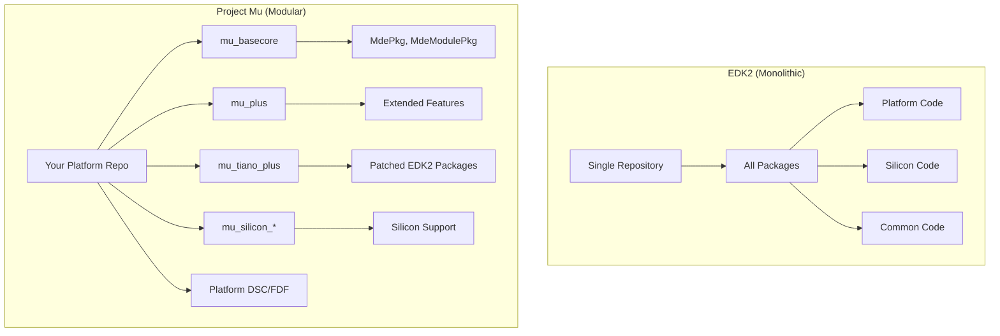
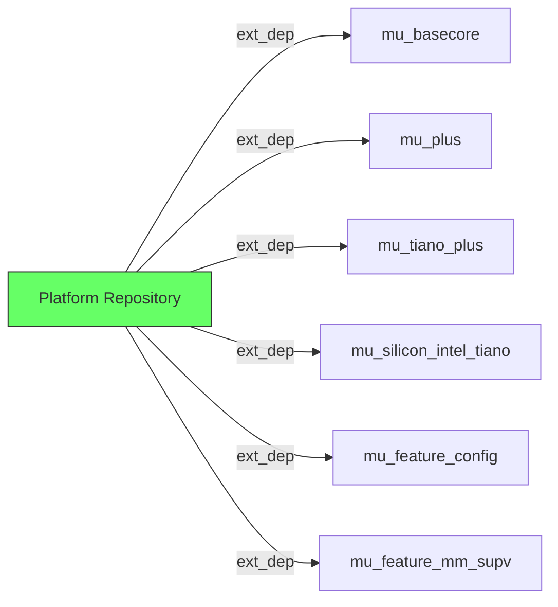
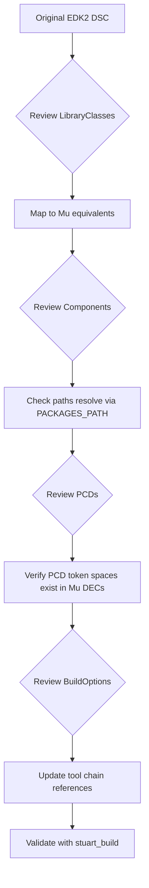

# Appendix B: EDK2 to Project Mu Migration

This appendix provides a practical guide for migrating an existing EDK2-based firmware platform to Project Mu. It covers the key architectural differences, step-by-step conversion process, CI migration, and common pitfalls.

---

## B.1 Key Differences Between EDK2 and Project Mu



| Aspect | EDK2 | Project Mu |
|--------|------|------------|
| Repository model | Monolithic with submodules | Multiple composable repos |
| Dependency management | Git submodules | stuart ext_dep (YAML + NuGet) |
| Build system | `build` command + `edksetup.sh` | `stuart_build` (Python-based) |
| CI/CD | Manual or custom scripts | Built-in `stuart_ci_build` with plugins |
| Branch model | `edk2-stable` tags | Versioned releases per repo |
| Testing | Limited built-in | MU UEFI unit test framework |
| Code ownership | Single maintainer model | Per-repo CODEOWNERS |
| Rebase frequency | Platform responsibility | Regular upstream merges |

---

## B.2 Repository Architecture

In Project Mu, firmware is assembled from multiple repositories:



| Repository | Contains | EDK2 Equivalent |
|------------|----------|-----------------|
| `mu_basecore` | MdePkg, MdeModulePkg, UefiCpuPkg core | edk2 core packages |
| `mu_plus` | Additional Mu-specific packages | N/A (Mu extensions) |
| `mu_tiano_plus` | Patched versions of EDK2 packages | edk2 packages with Mu patches |
| `mu_silicon_*` | Silicon-specific support | edk2-platforms silicon code |
| `mu_feature_*` | Optional feature packages | Varies |
| Platform repo | Your platform DSC/FDF/drivers | edk2-platforms board code |

---

## B.3 Step-by-Step Migration

### Step 1: Create the Platform Repository

```bash
mkdir MyPlatformPkg
cd MyPlatformPkg
git init

# Create directory structure
mkdir -p .pytool
mkdir -p Platforms/MyBoard
mkdir -p Include
mkdir -p Drivers
```

### Step 2: Define External Dependencies

Create `ext_dep` YAML files for each Mu repository you need.

```yaml
# mu_basecore_extdep.yaml
{
  "scope": "global",
  "type": "nuget",
  "name": "mu_basecore",
  "source": "https://pkgs.dev.azure.com/projectmu/mu/_packaging/Mu-Public/nuget/v3/index.json",
  "version": "2024.11.0",
  "flags": ["set_build_var"]
}
```

Alternatively, use git-based ext_deps:

```yaml
# mu_basecore_extdep.yaml
{
  "scope": "global",
  "type": "git",
  "name": "mu_basecore",
  "source": "https://github.com/microsoft/mu_basecore.git",
  "version": "release/202411",
  "flags": ["set_build_var"]
}
```

### Step 3: Create the Stuart Settings File

```python
# .pytool/CISettings.py

import os
from edk2toolext.invocables.edk2_ci_setup import CiSetupSettingsManager
from edk2toolext.invocables.edk2_ci_build import CiBuildSettingsManager
from edk2toolext.invocables.edk2_update import UpdateSettingsManager
from edk2toollib.utility_functions import GetHostInfo
from pathlib import Path


class Settings(CiSetupSettingsManager, CiBuildSettingsManager,
               UpdateSettingsManager):

    def GetPackagesSupported(self):
        return ["MyPlatformPkg"]

    def GetArchitecturesSupported(self):
        return ["X64", "IA32"]

    def GetTargetsSupported(self):
        return ["DEBUG", "RELEASE", "NOOPT"]

    def GetWorkspaceRoot(self):
        return str(Path(__file__).parent.parent.absolute())

    def GetRequiredSubmodules(self):
        return []

    def GetPackagesPath(self):
        """Return paths to all package directories."""
        ws = self.GetWorkspaceRoot()
        pp = []

        # Add ext_dep paths
        edk2_path_env = os.environ.get("EDK2_PATH_ENV", "")
        if edk2_path_env:
            pp.extend(edk2_path_env.split(os.pathsep))

        # Add local paths
        pp.append(os.path.join(ws, "Platforms"))

        return pp

    def GetActiveScopes(self):
        scopes = ["global", "myplatform"]
        return scopes

    def GetName(self):
        return "MyPlatform"
```

### Step 4: Create the Platform Build Script

```python
# Platforms/MyBoard/PlatformBuild.py

import os
import sys
from edk2toolext.environment.uefi_build import UefiBuilder
from edk2toolext.invocables.edk2_platform_build import BuildSettingsManager
from edk2toolext.invocables.edk2_setup import SetupSettingsManager
from edk2toolext.invocables.edk2_update import UpdateSettingsManager


class PlatformBuilder(UefiBuilder, BuildSettingsManager,
                      SetupSettingsManager, UpdateSettingsManager):

    def GetWorkspaceRoot(self):
        return os.path.dirname(os.path.dirname(
            os.path.dirname(os.path.abspath(__file__))))

    def GetActiveScopes(self):
        return ["global", "myplatform"]

    def GetPackagesPath(self):
        ws = self.GetWorkspaceRoot()
        return [
            os.path.join(ws, "MU_BASECORE"),
            os.path.join(ws, "Common", "MU"),
            os.path.join(ws, "Common", "MU_TIANO"),
            os.path.join(ws, "Silicon"),
            ws
        ]

    def GetName(self):
        return "MyBoard"

    def GetDscName(self):
        return os.path.join(
            "Platforms", "MyBoard", "MyBoard.dsc"
        )

    def GetFdfName(self):
        return os.path.join(
            "Platforms", "MyBoard", "MyBoard.fdf"
        )

    def SetPlatformEnv(self):
        self.env.SetValue("ACTIVE_PLATFORM",
                          self.GetDscName(), "Platform")
        self.env.SetValue("TARGET_ARCH", "X64", "Platform")
        self.env.SetValue("TOOL_CHAIN_TAG", "GCC5", "Platform")
        return 0
```

### Step 5: Adapt the DSC File

Key DSC changes from EDK2 to Project Mu:

```ini
# EDK2 style (paths relative to workspace)
# [LibraryClasses]
#   BaseLib|MdePkg/Library/BaseLib/BaseLib.inf

# Project Mu style (same, but packages come from ext_dep paths)
[LibraryClasses]
  BaseLib|MdePkg/Library/BaseLib/BaseLib.inf
  # The build system resolves MdePkg from the PACKAGES_PATH
  # which includes the mu_basecore ext_dep directory

  # Mu-specific libraries
  PolicyLib|PolicyServicePkg/Library/DxePolicyLib/DxePolicyLib.inf
  ResetUtilityLib|MdeModulePkg/Library/ResetUtilityLib/ResetUtilityLib.inf
```

### Step 6: Adapt the FDF File

FDF changes are typically minimal. Ensure paths resolve correctly through `PACKAGES_PATH`:

```ini
[FV.FVMAIN]
  # These INF paths are resolved via PACKAGES_PATH
  INF MdeModulePkg/Core/Dxe/DxeMain.inf
  INF MdeModulePkg/Universal/PCD/Dxe/Pcd.inf

  # Mu-specific modules
  INF PolicyServicePkg/PolicyService/DxePolicyService/DxePolicyService.inf
```

### Step 7: Set Up CI

```yaml
# .azurepipelines/build.yml (Azure DevOps example)
trigger:
  branches:
    include:
      - main

pool:
  vmImage: 'ubuntu-latest'

steps:
  - task: UsePythonVersion@0
    inputs:
      versionSpec: '3.11'

  - script: |
      pip install edk2-pytool-extensions edk2-pytool-library
    displayName: Install Python tools

  - script: |
      stuart_setup -c .pytool/CISettings.py
      stuart_update -c .pytool/CISettings.py
    displayName: Setup and Update

  - script: |
      stuart_ci_build -c .pytool/CISettings.py -a X64
    displayName: CI Build
```

---

## B.4 DSC Conversion Checklist



| EDK2 DSC Element | Migration Action |
|------------------|------------------|
| `[LibraryClasses]` | Verify INF paths exist in Mu repos; replace deprecated libraries with Mu equivalents |
| `[Components]` | Adjust paths; add Mu-specific components |
| `[PcdsFixedAtBuild]` | Check token space GUIDs exist in Mu DEC files |
| `[BuildOptions]` | Review for compatibility with Mu's default flags |
| `DEFINE` statements | Ensure macros are defined or replaced |
| Conditional includes (`!if`) | Verify macro conditions still apply |

---

## B.5 Common Library Replacements

| EDK2 Library | Project Mu Replacement | Notes |
|-------------|----------------------|-------|
| `BaseCryptLib` (OpenSSL) | `BaseCryptLib` (mu_crypto) | Mu uses its own crypto packaging |
| `IntrinsicLib` | `IntrinsicLib` (mu_basecore) | Same name, different location |
| `OpensslLib` | `OpensslLib` (mu_crypto) | Mu manages OpenSSL updates |
| Custom `PlatformSecLib` | Provided by `mu_silicon_*` | Silicon-specific |
| `PciExpressLib` | May be in `mu_silicon_*` | Check silicon package |

---

## B.6 Common Pitfalls

### Pitfall 1: PACKAGES_PATH Order

Project Mu resolves package names through `PACKAGES_PATH`. If two paths contain a package with the same name, the first one wins.

```python
# Wrong: mu_basecore after mu_tiano_plus
# May pick up wrong version of MdePkg
PACKAGES_PATH = [mu_tiano_plus, mu_basecore, ...]

# Right: mu_basecore first for core packages
PACKAGES_PATH = [mu_basecore, mu_tiano_plus, ...]
```

### Pitfall 2: Missing Mu-Specific PCDs

Mu packages introduce new PCDs not present in upstream EDK2. If you see build errors about undefined PCDs, add the appropriate Mu package to your INF `[Packages]` section.

### Pitfall 3: Library Class Scope Differences

Mu may define library class mappings at different scopes (e.g., a library that was `common` in EDK2 might be `DXE_DRIVER` only in Mu). Check the Mu DSC examples for correct scoping.

### Pitfall 4: Deprecated Modules

Some EDK2 modules are replaced in Mu:

| Deprecated EDK2 Module | Mu Replacement |
|------------------------|----------------|
| `BdsDxe` (MdeModulePkg) | `MsBootManagerPolicyDxe` |
| `UiApp` (MdeModulePkg) | `MsFrontPage` or custom |
| `BootManagerMenuApp` | `MsBootMenu` |
| `CapsuleRuntimeDxe` | Mu FMP-based capsule update |

### Pitfall 5: Stuart Version Mismatches

Pin your `edk2-pytool-extensions` and `edk2-pytool-library` versions in `pip_requirements.txt`:

```
edk2-pytool-extensions==0.27.0
edk2-pytool-library==0.21.0
```

### Pitfall 6: Git LFS for Binaries

Mu repositories may use Git LFS for binary dependencies. Ensure LFS is installed:

```bash
git lfs install
stuart_setup -c .pytool/CISettings.py  # Handles LFS pulls
```

---

## B.7 Migration Checklist

Use this checklist to track your migration progress:

- [ ] **Repository structure** -- created platform repo with `.pytool/` directory
- [ ] **External dependencies** -- defined ext_dep YAML files for all Mu repos
- [ ] **Stuart settings** -- created `CISettings.py` and `PlatformBuild.py`
- [ ] **DSC conversion** -- adapted `[LibraryClasses]` for Mu library paths
- [ ] **DSC conversion** -- adapted `[Components]` with correct paths
- [ ] **DSC conversion** -- verified `[PcdsFixedAtBuild]` and `[PcdsDynamic]`
- [ ] **FDF conversion** -- verified module INF paths resolve
- [ ] **FDF conversion** -- updated firmware volume layout if needed
- [ ] **Build test** -- `stuart_setup` completes without error
- [ ] **Build test** -- `stuart_update` downloads all dependencies
- [ ] **Build test** -- `stuart_build` produces a valid FD image
- [ ] **Boot test** -- firmware boots in QEMU
- [ ] **Boot test** -- firmware boots on target hardware (if applicable)
- [ ] **CI setup** -- `stuart_ci_build` passes all checks
- [ ] **CI setup** -- pipeline configured in CI system (Azure DevOps, GitHub Actions)
- [ ] **Documentation** -- updated build instructions for developers
- [ ] **Code review** -- migration reviewed by team

---

## B.8 Incremental Migration Strategy

For large platforms, consider an incremental approach:


1. **Phase 1**: Get stuart building your existing DSC/FDF (possibly with many overrides).
2. **Phase 2**: Replace core packages (MdePkg, MdeModulePkg) with `mu_basecore` versions.
3. **Phase 3**: Migrate silicon packages to `mu_silicon_*` equivalents.
4. **Phase 4**: Adopt Mu platform features (Policy Service, Front Page, etc.).
5. **Phase 5**: Set up stuart CI with test plugins.
6. **Phase 6**: Enable advanced features like Configuration, DFCI, and MM Supervisor.

---

## Summary

Migrating from EDK2 to Project Mu is primarily a restructuring effort -- the underlying UEFI code remains the same. The main changes are the repository layout, dependency management (ext_dep instead of submodules), and build orchestration (stuart instead of raw `build`). Take an incremental approach, validate at each step with boot testing, and use the migration checklist to track progress.
