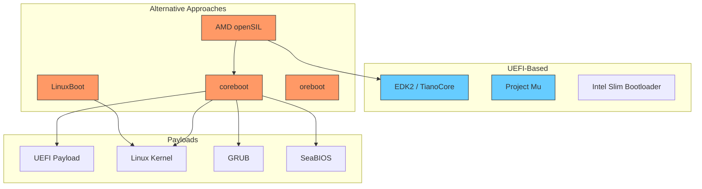
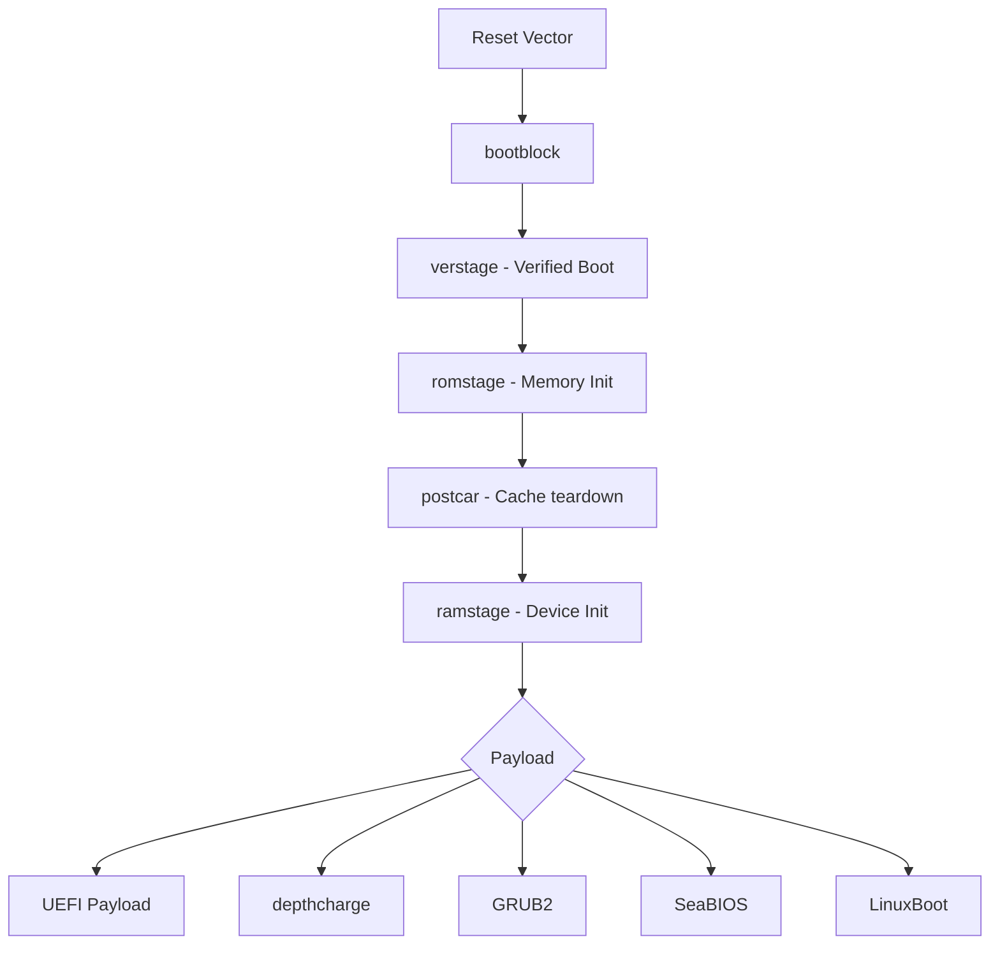
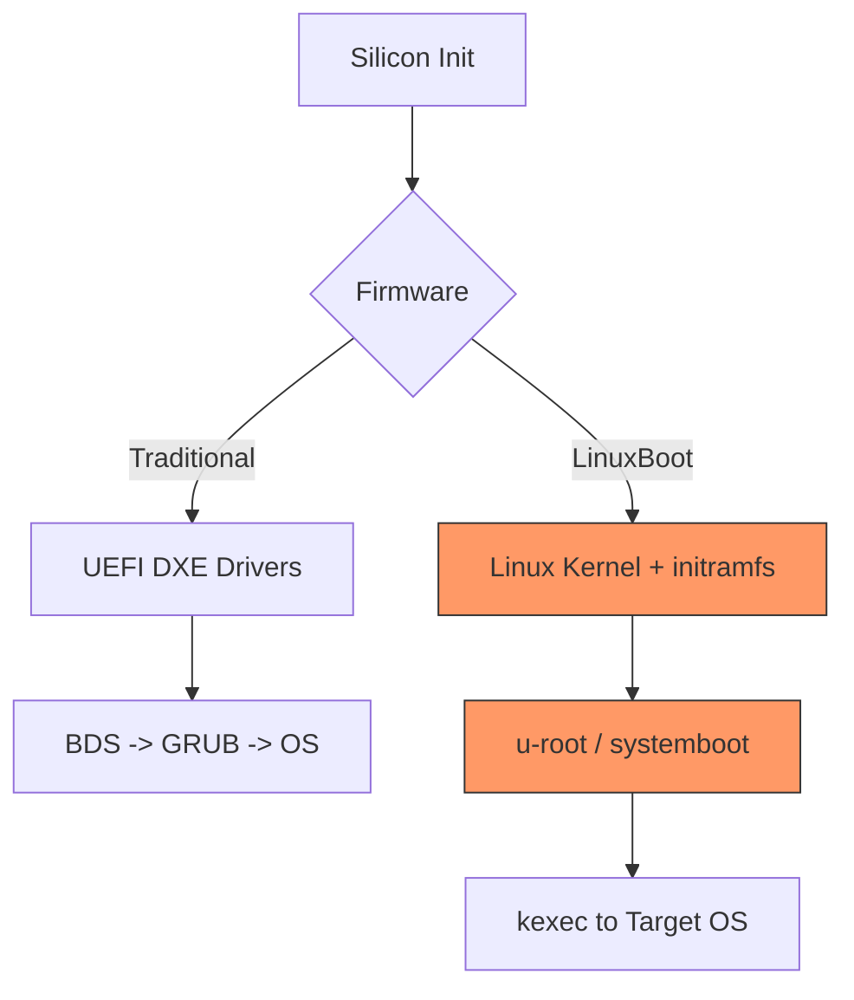
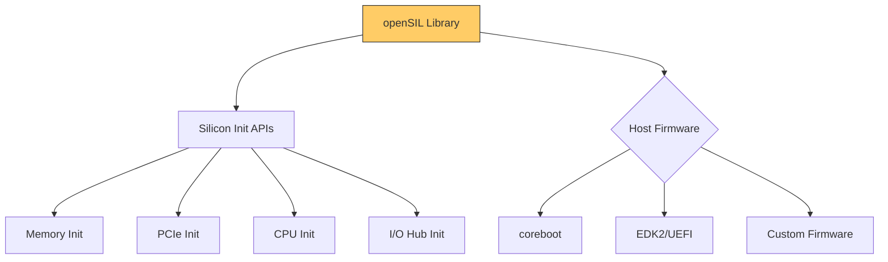
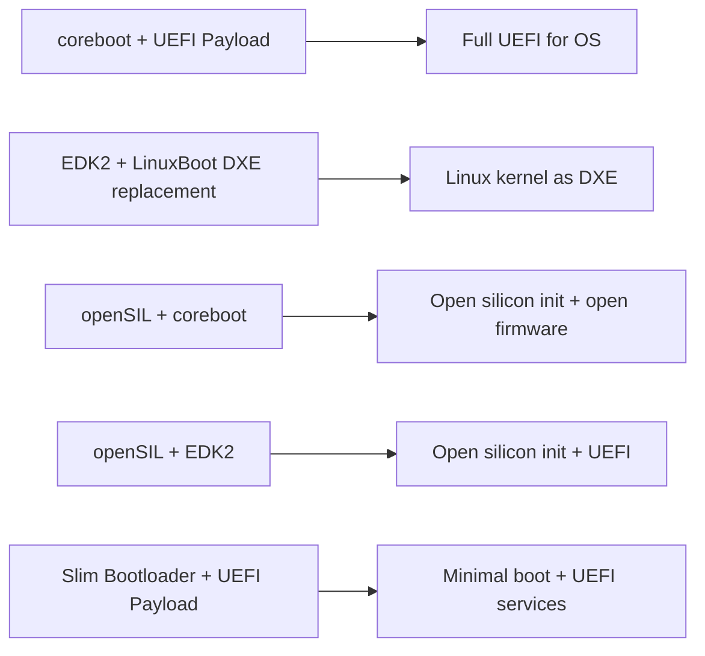

# Appendix F: Alternative Firmware

While UEFI (via EDK2 and Project Mu) dominates the PC firmware landscape, several alternative firmware projects exist with different design philosophies, licensing models, and use cases. This appendix surveys the major alternatives and explains how they relate to and interoperate with UEFI.

---

## F.1 Overview of Firmware Ecosystem

---

## F.2 coreboot

### Overview

coreboot (formerly LinuxBIOS) is an open-source firmware project that aims to replace proprietary BIOS/UEFI firmware with a lightweight, fast-booting alternative. It focuses on doing the minimum hardware initialization required, then handing off to a "payload" for boot services.

| Aspect | Details |
|--------|---------|
| License | GPLv2 |
| Language | C, some assembly |
| Architecture support | x86, ARM, RISC-V |
| Primary users | Google Chromebooks, servers, security-focused platforms |
| Website | [https://coreboot.org](https://coreboot.org) |
| Repository | [https://review.coreboot.org](https://review.coreboot.org) |

### Architecture

coreboot's boot stages:

| Stage | Function |
|-------|----------|
| **bootblock** | Minimal code from reset vector; cache-as-RAM setup |
| **verstage** | Google Verified Boot (Chrome OS); optional |
| **romstage** | Memory controller initialization; DRAM training |
| **postcar** | Tear down cache-as-RAM, switch to real DRAM |
| **ramstage** | Full device enumeration, PCI, USB, etc. |
| **Payload** | Boot loader or OS environment |

### coreboot vs. UEFI/EDK2

| Feature | coreboot | EDK2/UEFI |
|---------|----------|-----------|
| Boot time | Very fast (sub-second possible) | Typically 3-10+ seconds |
| Code size | ~100K-500K total firmware | 2-16 MB firmware volume |
| Driver model | Board-specific, no runtime API | Protocol-based, extensible |
| Runtime services | None (relies on payload) | Full UEFI runtime services |
| Secure Boot | Via payload (UEFI or vboot) | Native Secure Boot |
| Standardization | De facto, no formal spec | UEFI/PI specifications |
| Silicon vendor support | Limited to supported boards | Broad OEM adoption |

### coreboot with UEFI Payload

coreboot can load an EDK2-based UEFI payload, providing the best of both worlds: fast coreboot silicon init with full UEFI runtime services:

The UEFI Payload is an EDK2 module (`UefiPayloadPkg`) that receives hardware information from coreboot via HOB lists and provides standard UEFI boot and runtime services.

---

## F.3 LinuxBoot

### Overview

LinuxBoot replaces traditional DXE drivers with a Linux kernel and initramfs. The idea is to use the Linux kernel's mature, well-tested drivers instead of UEFI DXE drivers for hardware initialization and boot device access.

| Aspect | Details |
|--------|---------|
| License | GPLv2 (Linux kernel) |
| Architecture support | x86, ARM |
| Primary users | Hyperscale data centers (Google, Facebook/Meta) |
| Website | [https://linuxboot.org](https://linuxboot.org) |
| Repository | [https://github.com/linuxboot/linuxboot](https://github.com/linuxboot/linuxboot) |

### Architecture

| Component | Role |
|-----------|------|
| Silicon init (PEI equivalent) | Minimal firmware for DRAM, PCIe, CPU init |
| Linux kernel | Device drivers, filesystem access, networking |
| initramfs (u-root) | Go-based userspace with boot tools |
| systemboot | Boot logic: find and kexec the target kernel |
| kexec | Load and jump to the target OS kernel |

### LinuxBoot Advantages

- Linux kernel drivers are better tested and more feature-complete than UEFI DXE drivers.
- Full Linux userspace available for diagnostics, networking, and scripting during boot.
- Reduces firmware attack surface by replacing closed-source DXE drivers.
- Faster boot on servers where DXE driver enumeration is slow.

### LinuxBoot Limitations

- Requires PEI-equivalent silicon init (still proprietary for most platforms).
- No UEFI runtime services (OS must not depend on them).
- Not suitable for client platforms that need UEFI Secure Boot, Windows support, etc.
- Limited adoption outside hyperscale environments.

---

## F.4 AMD openSIL

### Overview

AMD open System Integration Library (openSIL) is AMD's effort to provide open-source silicon initialization code. Rather than being a complete firmware solution, openSIL is a library that can be integrated into any host firmware (coreboot, EDK2, or others).

| Aspect | Details |
|--------|---------|
| License | MIT |
| Language | C |
| Architecture | AMD x86 (EPYC, Ryzen) |
| Website | [https://github.com/openSIL](https://github.com/openSIL) |

### Architecture

openSIL is designed as a **Host Firmware Independent (HFI)** library:

| Layer | Description |
|-------|-------------|
| **xSIM** (Translated SIL Interface Module) | Adapts openSIL APIs to host firmware conventions |
| **SIL** (Silicon Initialization Library) | Core silicon init logic |
| **IP Blocks** | Per-IP-block initialization (DF, UMC, NBIO, etc.) |

### Significance

openSIL represents a shift toward open-source silicon initialization. Historically, silicon init code (AMD AGESA, Intel FSP) was closed-source binary blobs. openSIL aims to make this code auditable, modifiable, and portable across firmware stacks.

---

## F.5 oreboot

### Overview

oreboot is a coreboot-derived project that replaces C with Rust for memory safety. It targets a minimal, auditable firmware with no C code (except where required by hardware constraints).

| Aspect | Details |
|--------|---------|
| License | GPLv2 |
| Language | Rust, minimal assembly |
| Architecture | x86, RISC-V, ARM |
| Repository | [https://github.com/oreboot/oreboot](https://github.com/oreboot/oreboot) |

### Key Features

- Written entirely in Rust (no C runtime, no libc).
- Minimal code footprint.
- Focus on memory safety and correctness.
- Experimental; limited hardware support compared to coreboot.
- Targets embedded and security-critical platforms.

### Current Status

oreboot is an active research/development project. It supports a handful of platforms (primarily RISC-V boards and some ARM SoCs). x86 support is more limited due to the complexity of x86 silicon initialization.

---

## F.6 Intel Slim Bootloader

Intel Slim Bootloader (SBL) is an alternative UEFI-based firmware that uses a minimal subset of EDK2:

| Aspect | Details |
|--------|---------|
| License | BSD-2-Clause-Patent |
| Language | C |
| Architecture | Intel x86 |
| Repository | [https://github.com/slimbootloader/slimbootloader](https://github.com/slimbootloader/slimbootloader) |

SBL uses Intel FSP for silicon init and provides its own lightweight boot flow. It produces a smaller firmware image than full EDK2 and boots faster, but sacrifices the full UEFI driver model and runtime services.

---

## F.7 Comparison Table

| Feature | EDK2/Mu | coreboot | LinuxBoot | openSIL | oreboot | Slim Bootloader |
|---------|---------|----------|-----------|---------|---------|----------------|
| **License** | BSD-2 | GPLv2 | GPLv2 | MIT | GPLv2 | BSD-2 |
| **Language** | C | C | C/Go | C | Rust | C |
| **Boot time** | Medium | Fast | Medium | N/A (library) | Fast | Fast |
| **UEFI services** | Full | Via payload | None | N/A | None | Partial |
| **Secure Boot** | Native | Via payload | Via kexec | N/A | No | Yes |
| **Windows support** | Yes | Via UEFI payload | No | N/A | No | Limited |
| **Hardware support** | Broadest | Wide (x86) | Server-focused | AMD only | Narrow | Intel only |
| **Ecosystem** | Large | Large | Growing | Early | Small | Small |
| **Specification** | UEFI/PI | None (de facto) | None | None | None | None |
| **Primary use** | OEM firmware | Chromebooks, servers | Hyperscale | Future AMD platforms | Research | Embedded Intel |
| **Code size** | 2-16 MB | 0.5-2 MB | ~20 MB (with kernel) | Varies | <1 MB | 1-2 MB |

---

## F.8 When to Choose Each

### Choose EDK2 / Project Mu when:

- You need full UEFI compatibility (Windows, Linux, secure boot).
- Your platform ships to end users who expect standard firmware.
- Silicon vendor provides EDK2-based firmware reference code.
- You need the UEFI driver model, HII setup menus, or capsule updates.
- Enterprise manageability features (DFCI, ESRT) are required.

### Choose coreboot when:

- Boot speed is critical and you can control the hardware platform.
- You want fully open-source firmware (where silicon init allows).
- You are building a Chromebook, server, or embedded device with a supported board.
- You need a UEFI payload for OS compatibility but want faster init.

### Choose LinuxBoot when:

- You are operating at hyperscale and need Linux drivers during boot.
- The platform is server-class with well-supported Linux drivers.
- UEFI runtime services are not required by the OS.
- You want scriptable boot logic in a familiar Linux environment.

### Choose openSIL when:

- You are building firmware for AMD platforms and want open-source silicon init.
- You plan to integrate with coreboot or EDK2 as the host firmware.
- Auditability and supply-chain transparency are primary requirements.

### Choose oreboot when:

- Memory safety guarantees are paramount.
- You are working on RISC-V or ARM platforms with supported SoCs.
- The project is research, prototyping, or has custom hardware.
- You are comfortable with experimental software.

---

## F.9 Interoperability

The firmware ecosystem is not an all-or-nothing choice. Several interoperability patterns exist:

| Pattern | Description |
|---------|-------------|
| coreboot + UEFI Payload | Use coreboot for fast silicon init; EDK2 payload for UEFI services |
| EDK2 + LinuxBoot | Replace DXE phase with Linux kernel; keep PEI for silicon init |
| openSIL + coreboot | Open-source AMD silicon init feeding into coreboot |
| openSIL + EDK2 | Open-source AMD silicon init integrated into standard EDK2 flow |
| Slim Bootloader + OS Loader | Minimal boot chain for embedded Intel platforms |

The Universal Scalable Firmware (USF) initiative aims to standardize the interface between silicon init and host firmware, making it easier to mix and match components from different projects.

---

## F.10 The Future of Firmware

Several trends are shaping the firmware landscape:

1. **Open-source silicon init** -- AMD openSIL and Intel FSP open-sourcing efforts reduce reliance on binary blobs.
2. **Rust in firmware** -- oreboot and Rust-for-Linux bring memory safety to firmware; Project Mu has also explored Rust integration.
3. **Measured and verified boot** -- Hardware-rooted trust chains (TPM, AMD PSP, Intel CSME) are increasingly required.
4. **Firmware-as-a-service** -- Cloud-managed firmware configuration (DFCI, fwupd) enables fleet-scale management.
5. **Convergence** -- Standards like Universal Payload and USF aim to make firmware components interchangeable across projects.

---

## Summary

The firmware ecosystem extends well beyond UEFI. coreboot offers speed and openness, LinuxBoot leverages mature kernel drivers, openSIL pushes toward open silicon init, and oreboot explores memory-safe firmware. Each has distinct strengths and trade-offs. Understanding these alternatives helps you choose the right approach for your platform and recognize interoperability opportunities where different projects can be combined.
