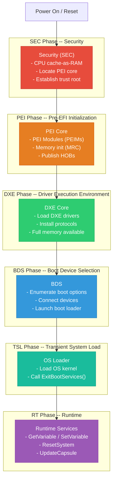
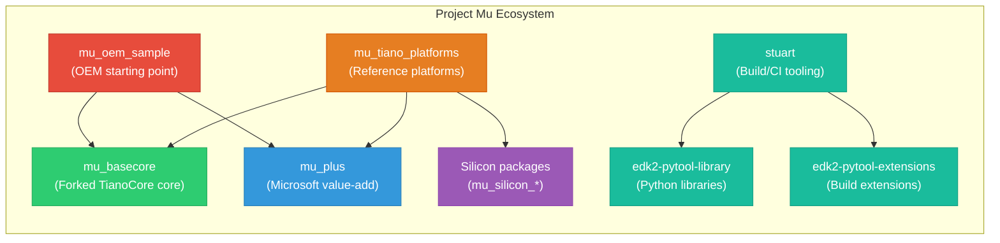

# Chapter 1: Introduction to UEFI and Project Mu
{: .fs-9 }

Understanding the firmware layer that boots every modern PC, and the open-source framework that makes it manageable.
{: .fs-6 .fw-300 }

---

## Table of Contents
{: .no_toc }

1. TOC
{:toc}

---

## 1.1 What Is Firmware?

Every time you press the power button on a computer, something has to run before the operating system takes over. That something is **firmware** -- software that is permanently stored on a chip on the motherboard (typically a SPI NOR flash chip). Firmware is responsible for:

- **Hardware initialization**: Configuring the CPU, memory controller, chipset, and peripherals so they are ready for use.
- **Security establishment**: Verifying that the code being executed has not been tampered with (Secure Boot, Measured Boot).
- **OS handoff**: Locating, loading, and transferring control to the operating system's boot loader.

Firmware is the lowest-level software that runs on a system. It operates in a privileged environment with direct access to all hardware, and it must work correctly even when nothing else on the machine is functional.

## 1.2 From Legacy BIOS to UEFI

### The Legacy BIOS Era

The original IBM PC BIOS (Basic Input/Output System) dates back to 1981. It was a 16-bit, real-mode interface that provided basic hardware abstraction through software interrupts (INT 10h for video, INT 13h for disk, INT 16h for keyboard, and so on). For decades, backward compatibility kept the BIOS architecture alive, but the design had severe limitations:

| Limitation | Detail |
|:-----------|:-------|
| **16-bit real mode** | The BIOS executed in the CPU's real mode, limiting addressable memory to 1 MB. |
| **MBR partitioning** | The Master Boot Record scheme supports a maximum of 4 primary partitions and disks up to 2.2 TB. |
| **No standard driver model** | Each BIOS vendor implemented device support from scratch with proprietary, undocumented interfaces. |
| **No security model** | Legacy BIOS had no mechanism for verifying the integrity of code it executed. |
| **Slow boot** | Sequential device initialization with no parallelism. |
| **No network boot standard** | PXE was bolted on as an afterthought. |

### The Birth of UEFI

In the mid-1990s, Intel began developing the **Intel Boot Initiative (IBI)**, later renamed **EFI (Extensible Firmware Interface)**, for the Itanium platform. The Itanium processor had no real mode, which made a legacy BIOS impossible. EFI was designed from the ground up as a modern, 32/64-bit firmware interface.

In 2005, Intel contributed the EFI specification to the **Unified EFI Forum**, a cross-industry standards body. The specification was renamed to **UEFI (Unified Extensible Firmware Interface)**, and the forum published UEFI 2.0 in January 2006. Today, the UEFI specification is at version 2.10 (August 2022) and is implemented by virtually every x86, ARM, and RISC-V system.

### What UEFI Replaced and Why

UEFI is not merely an update to BIOS; it is a complete architectural replacement:

| Feature | Legacy BIOS | UEFI |
|:--------|:------------|:-----|
| Execution mode | 16-bit real mode | 32-bit or 64-bit protected/long mode |
| Addressable memory | 1 MB | Full physical address space |
| Partitioning | MBR (2.2 TB limit) | GPT (9.4 ZB limit) |
| Driver model | None (vendor-specific) | Standardized UEFI Driver Model with bus-specific bindings |
| Security | None | Secure Boot, Measured Boot, authenticated variables |
| Boot manager | Single MBR boot sector | Built-in boot manager with multiple boot options |
| User interface | Text-only INT 10h | Graphics Output Protocol (GOP), HII forms |
| Networking | PXE only | Full TCP/IP stack via UEFI network protocols |
| File systems | FAT via INT 13h | Native FAT32 (EFI System Partition), extensible |
| Extensibility | ROM option ROMs | Loadable UEFI drivers (PE/COFF images) |

{: .note }
> UEFI defines an **interface**, not an **implementation**. The UEFI specification describes the protocols, services, and data structures that an implementation must provide. The actual firmware code that implements the specification can come from various sources, including EDK2, Project Mu, or proprietary vendor code.

## 1.3 UEFI Architecture Overview

### The UEFI Boot Flow

The UEFI boot process is divided into distinct **phases**, each with a specific role. Understanding these phases is essential for firmware development because every module you write executes in the context of a particular phase.



### Phase-by-Phase Breakdown

#### SEC (Security Phase)

The SEC phase is the very first code that executes after the CPU comes out of reset. At this point, DRAM has not been initialized, so the SEC phase must run from flash and use CPU cache-as-RAM (CAR) as a temporary stack.

**Responsibilities:**
- Establish a temporary memory store (cache-as-RAM or SRAM).
- Handle early platform initialization (e.g., disabling watchdog timers).
- Locate and validate the PEI Foundation (the PEI core).
- Transfer control to PEI.

**Key point:** The SEC phase is intentionally small and platform-specific. It contains the root of trust for a Secure Boot chain -- if the SEC code is compromised, nothing that follows can be trusted.

#### PEI (Pre-EFI Initialization Phase)

The PEI phase is responsible for initializing just enough hardware to get permanent memory (DRAM) working. PEI runs in a constrained, stack-based environment because full memory is not yet available.

**Responsibilities:**
- Execute **PEI Modules (PEIMs)** to initialize hardware.
- Run the **Memory Reference Code (MRC)** to configure and train DRAM.
- Publish **Hand-Off Blocks (HOBs)** describing the memory map, firmware volumes, and other platform data.
- Transfer control to the DXE phase via the DXE Initial Program Load (IPL) PEIM.

**Key point:** PEIMs communicate through **PPI (PEIM-to-PEIM Interfaces)**, which are simple function pointer tables. PPIs are the PEI equivalent of DXE protocols but much simpler due to the constrained environment.

#### DXE (Driver Execution Environment Phase)

The DXE phase is the workhorse of the UEFI boot process. Once permanent memory is available, the DXE core creates a rich execution environment where drivers can be loaded, protocols can be installed, and the full UEFI specification can be implemented.

**Responsibilities:**
- Initialize the DXE core services: Boot Services, Runtime Services, and the DXE Dispatcher.
- Discover and load DXE drivers from firmware volumes.
- DXE drivers install **protocols** on **handles** -- this is the UEFI driver model.
- Build the system table (`EFI_SYSTEM_TABLE`) that UEFI applications and the OS will use.

**Key point:** The DXE phase is where most UEFI development happens. Console drivers, storage drivers, network drivers, USB drivers, and security policies are all implemented as DXE drivers.

#### BDS (Boot Device Selection Phase)

The BDS phase is responsible for establishing the console (so the user can see output and provide input) and selecting a boot device.

**Responsibilities:**
- Connect console devices (keyboard, display).
- Enumerate boot options from UEFI variables (`Boot0000`, `Boot0001`, etc.) and removable media.
- Present a boot menu or automatically boot the highest-priority option.
- Load and transfer control to the OS boot loader (a UEFI application on the EFI System Partition).

**Key point:** The BDS policy is where OEMs customize the user experience. Project Mu provides a modern front-page UI through its **MU Front Page** infrastructure.

#### TSL (Transient System Load) and Runtime

Once the OS boot loader is running (e.g., `bootmgfw.efi` for Windows or `grubx64.efi` for Linux), it is in the **TSL phase**. The OS loader can still use all UEFI Boot Services and Runtime Services.

When the OS loader is ready to take full control, it calls `ExitBootServices()`. This critical transition:

- **Terminates** all Boot Services (memory allocation, protocol services, timer events).
- **Preserves** Runtime Services (variable access, clock, reset, capsule update).
- **Hands off** the memory map to the OS.

After `ExitBootServices()`, the system is in the **Runtime phase**. The OS can call a limited set of Runtime Services, but all other UEFI infrastructure is gone.

### The UEFI System Table

The `EFI_SYSTEM_TABLE` is the central data structure in UEFI. It is passed to every UEFI application and driver as a parameter to their entry point. The system table provides access to:

- **Boot Services** (`gBS`): Memory allocation, protocol management, event/timer services, image loading.
- **Runtime Services** (`gRT`): Variable storage, time services, reset, capsule update.
- **Console I/O**: `ConIn` (keyboard), `ConOut` (text display), `StdErr`.
- **Configuration Tables**: ACPI tables, SMBIOS tables, and other system metadata.

```c
typedef struct {
    EFI_TABLE_HEADER                  Hdr;
    CHAR16                            *FirmwareVendor;
    UINT32                            FirmwareRevision;
    EFI_HANDLE                        ConsoleInHandle;
    EFI_SIMPLE_TEXT_INPUT_PROTOCOL    *ConIn;
    EFI_HANDLE                        ConsoleOutHandle;
    EFI_SIMPLE_TEXT_OUTPUT_PROTOCOL   *ConOut;
    EFI_HANDLE                        StandardErrorHandle;
    EFI_SIMPLE_TEXT_OUTPUT_PROTOCOL   *StdErr;
    EFI_RUNTIME_SERVICES              *RuntimeServices;
    EFI_BOOT_SERVICES                 *BootServices;
    UINTN                             NumberOfTableEntries;
    EFI_CONFIGURATION_TABLE           *ConfigurationTable;
} EFI_SYSTEM_TABLE;
```

## 1.4 EDK2: The Reference Implementation

The **EDK2 (EFI Development Kit II)** is the open-source reference implementation of the UEFI specification, maintained by the TianoCore community under a BSD-2-Clause license. EDK2 provides:

- **Core UEFI services**: The SEC, PEI, DXE, and BDS core implementations.
- **Standard drivers**: Console, storage, network, USB, graphics, and more.
- **Build system**: A custom build system based on `.inf` (module description), `.dsc` (platform description), `.dec` (package declaration), and `.fdf` (flash description) files.
- **Libraries**: A rich set of base libraries (`BaseLib`, `BaseMemoryLib`, `UefiLib`, `DebugLib`, etc.).
- **OVMF**: An open-source virtual machine firmware based on EDK2 that runs under QEMU, KVM, and other hypervisors. This is what you will use for testing.

EDK2 is a massive codebase -- over 4 million lines of code in a single monolithic repository. While EDK2 is well-tested and widely deployed, its monolithic structure creates challenges for large teams and modern development practices.

## 1.5 Project Mu: Microsoft's UEFI Framework

### What Is Project Mu?

**Project Mu** is Microsoft's open-source UEFI firmware framework. It is built on top of EDK2 but restructures the codebase and adds tooling, policies, and features designed for modern firmware development at scale.

Project Mu powers the firmware on **Microsoft Surface devices**, **Xbox consoles**, **Azure servers**, and many other Microsoft hardware products. It represents Microsoft's production-hardened approach to UEFI firmware.



### Key Advantages of Project Mu

#### 1. Multi-Repository Architecture

Unlike the monolithic EDK2 repository, Project Mu splits the firmware codebase into **multiple focused repositories**:

| Repository | Purpose |
|:-----------|:--------|
| `mu_basecore` | Forked EDK2 core (MdePkg, MdeModulePkg, etc.) with Microsoft patches |
| `mu_plus` | Microsoft value-add features (front page, DFCI, shared crypto, etc.) |
| `mu_tiano_platforms` | Reference platform firmware (Q35, SBSA, etc.) |
| `mu_silicon_arm_tiano` | ARM silicon support packages |
| `mu_oem_sample` | Starter template for OEMs building a new platform |
| `mu_feature_*` | Feature repositories (TPM, IPMI, config, etc.) |

This multi-repo design allows teams to:
- **Update independently**: Take security fixes in `mu_basecore` without rebuilding unrelated features.
- **Version pin**: Lock each dependency to a specific commit/tag for reproducible builds.
- **Reduce clone sizes**: Developers only clone what they need.

#### 2. Stuart: Modern Build and CI Tooling

**Stuart** is Project Mu's Python-based build and CI orchestration system. It replaces the ad-hoc scripts and manual steps that are common in EDK2 development with a structured, repeatable workflow:

- `stuart_setup` -- clones all required repositories using a manifest (via Git submodules or ext_dep).
- `stuart_update` -- downloads external binary dependencies (compilers, tools, etc.).
- `stuart_build` -- invokes the EDK2 build system with the correct parameters.
- `stuart_ci_build` -- runs code checks (compiler warnings, code style, spell check) across the codebase.

Stuart is distributed as two Python packages:
- **`edk2-pytool-library`**: Low-level utilities for parsing EDK2 files, manipulating UEFI data structures, etc.
- **`edk2-pytool-extensions`**: The stuart commands themselves, along with CI plugins.

#### 3. Rust Support

Project Mu is at the forefront of integrating **Rust** into UEFI firmware. Rust's memory safety guarantees are especially valuable in firmware, where memory corruption bugs can create persistent security vulnerabilities that survive OS reinstallation.

Project Mu supports:
- Writing UEFI drivers and applications in Rust.
- Mixing Rust and C code within the same firmware image.
- Using Rust's `no_std` ecosystem for firmware-appropriate libraries.

#### 4. Device Firmware Configuration Interface (DFCI)

**DFCI** is a Project Mu feature that enables cloud-based, zero-touch management of firmware settings. With DFCI, IT administrators can:

- Configure UEFI settings (Secure Boot policy, camera/microphone enable/disable, boot order) remotely via Microsoft Intune or other MDM solutions.
- Enforce firmware policies without physical access to the device.
- Audit firmware configuration changes.

DFCI uses x.509 certificate chains for identity and authorization, and UEFI authenticated variables for persistence.

#### 5. Security and Quality Features

Project Mu includes several features that go beyond baseline EDK2:

- **Shared Crypto**: A single, centrally-managed OpenSSL/crypto binary shared by all consumers, reducing flash footprint and simplifying crypto updates.
- **Memory Protections**: Enhanced memory protection policies (NX stack, read-only page tables, NULL pointer detection).
- **Code Quality CI**: Built-in CI plugins for compiler warnings, markdown linting, spell checking, UEFI code style (uncrustify), binary size analysis, and more.
- **MU Telemetry / Whea**: Structured error reporting and telemetry infrastructure.

### Project Mu vs. EDK2: When to Use Which

| Consideration | EDK2 | Project Mu |
|:-------------|:-----|:-----------|
| You want the upstream reference implementation | Yes | No (fork) |
| You need multi-repo dependency management | Manual | Built-in (stuart) |
| You want CI/CD out of the box | No | Yes (stuart_ci_build) |
| You are targeting a Microsoft platform | Not recommended | Yes |
| You want Rust support | Limited | First-class |
| You need cloud firmware management (DFCI) | No | Yes |
| Your team needs modern dev workflows | Extra effort | Built-in |
| You are contributing to TianoCore upstream | Yes | Contribute upstream, consume via mu_basecore |

{: .tip }
> If you are starting a new platform or modernizing an existing one, Project Mu provides a more productive and secure foundation than raw EDK2. If you are only contributing upstream driver fixes, working directly with EDK2 is fine.

## 1.6 The UEFI Ecosystem

UEFI development does not happen in a vacuum. Here are the key standards and organizations you should know:

### Specifications

- **UEFI Specification** (currently 2.10): Defines firmware interfaces, protocols, and data structures. Published by the [UEFI Forum](https://uefi.org/specifications).
- **PI (Platform Initialization) Specification** (currently 1.8): Defines the internal firmware phases (SEC, PEI, DXE) and their interfaces. This is the spec that firmware developers reference most often.
- **ACPI Specification** (currently 6.5): Defines the interface between firmware and the OS for power management, device enumeration, and platform configuration.
- **SMBIOS Specification** (currently 3.6): Defines the system management data structures that firmware publishes for OS consumption.

### Key Organizations

- **UEFI Forum**: The standards body that publishes the UEFI and PI specifications.
- **TianoCore**: The open-source community maintaining EDK2.
- **Project Mu (Microsoft)**: Microsoft's open-source UEFI framework built on EDK2.
- **Linaro**: Contributes ARM and AARCH64 UEFI support.
- **AMD, Intel, ARM, Qualcomm**: Provide silicon-specific firmware packages.

## 1.7 Guide Roadmap

This guide is structured as a progressive learning path. Here is what lies ahead:


### Part 1: Getting Started (Chapters 1-3)

You are reading Chapter 1 right now. In [Chapter 2](), you will install the full Project Mu development toolchain. In [Chapter 3](), you will write, build, and run your first UEFI application.

### Part 2: Project Mu Structure and Tooling (Chapters 4-7)

A deep dive into how Project Mu organizes its codebase across multiple repositories, how the stuart build system works, how dependencies are managed, and how to set up CI/CD pipelines for your firmware project.

### Part 3: UEFI Core Concepts (Chapters 8-11)

The conceptual heart of UEFI: the driver model, the protocol/handle database, memory services, and the full set of Boot Services and Runtime Services.

### Part 4: Essential UEFI Services (Chapters 12-17)

Hands-on chapters covering the UEFI services you will use most: console I/O, graphics output, file system access, block I/O, networking, and UEFI variables.

### Part 5: Advanced Topics (Chapters 18-24)

Professional-level firmware topics: deep dives into PEI and DXE internals, System Management Mode (SMM), security (Secure Boot, Measured Boot), ACPI table generation, capsule-based firmware updates, DFCI, and writing firmware in Rust.

### Part 6: Practical Projects (Chapters 25-28)

Complete, end-to-end projects that tie together everything you have learned: building a custom UEFI Shell command, creating a graphical boot menu, developing a network application, and writing a custom boot loader.

## 1.8 Summary

In this chapter, you learned:

- **Firmware** is the first software that runs on a computer, responsible for hardware initialization, security, and OS handoff.
- **UEFI** replaced the legacy BIOS with a modern, extensible firmware interface supporting 64-bit execution, GPT partitioning, Secure Boot, a standardized driver model, and rich pre-boot services.
- The **UEFI boot process** is divided into phases: SEC, PEI, DXE, BDS, TSL, and Runtime. Each phase has a specific role and a progressively richer execution environment.
- **EDK2** is the open-source reference implementation of UEFI, but its monolithic structure creates challenges for large-scale development.
- **Project Mu** is Microsoft's open-source UEFI framework built on EDK2, offering multi-repo architecture, the stuart build system, Rust support, DFCI, and production-hardened security features.
- The **UEFI ecosystem** includes multiple specifications (UEFI, PI, ACPI, SMBIOS) and organizations (UEFI Forum, TianoCore, Microsoft, Linaro).

## Next Steps

Proceed to [Chapter 2: Environment Setup]() to install and configure your development environment.
