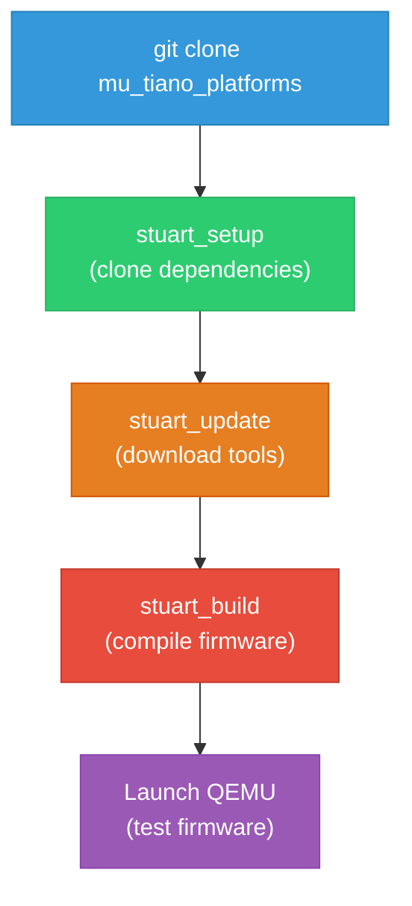

# Chapter 2: Environment Setup
{: .fs-9 }

Install and configure every tool you need to build and test UEFI firmware with Project Mu.
{: .fs-6 .fw-300 }

---

## Table of Contents
{: .no_toc }

1. TOC
{:toc}

---

## 2.1 Overview

Before you can build a single UEFI module, you need a working development environment. This chapter walks you through installing every required tool, from Python and Git to compilers and QEMU. By the end of this chapter you will have:

1. A Python environment with stuart installed.
2. A C compiler toolchain (Visual Studio on Windows or GCC on Linux).
3. Required assemblers and ACPI tools.
4. QEMU with OVMF firmware for testing.
5. A cloned Project Mu platform repository, fully set up and ready to build.

```mermaid
flowchart LR
    subgraph Prerequisites
        Python["Python 3.10+"]
        Git["Git 2.30+"]
        Pip["pip"]
    end

    subgraph Stuart["Stuart (pip install)"]
        PytoolLib["edk2-pytool-library"]
        PytoolExt["edk2-pytool-extensions"]
    end

    subgraph Compiler["Compiler Toolchain"]
        VS["VS Build Tools 2022\n(Windows)"]
        GCC["GCC 12+\n(Linux)"]
    end

    subgraph Tools["Additional Tools"]
        NASM["NASM 2.16+"]
        IASL["iASL (ACPI)"]
        QEMU["QEMU 7.0+"]
    end

    Prerequisites --> Stuart
    Stuart --> Compiler
    Compiler --> Tools

    style Python fill:#3498db,stroke:#2980b9,color:#fff
    style Git fill:#e67e22,stroke:#d35400,color:#fff
    style VS fill:#9b59b6,stroke:#8e44ad,color:#fff
    style GCC fill:#2ecc71,stroke:#27ae60,color:#fff
    style QEMU fill:#e74c3c,stroke:#c0392b,color:#fff
```



{: .note }
> This chapter covers both **Windows** and **Linux** setups. You only need to follow the instructions for your platform. macOS is partially supported but not recommended for firmware development due to toolchain limitations.

## 2.2 Prerequisites

### Python 3.10 or Later

Stuart and the EDK2 build system require Python 3.10 or later. Python 3.12 or 3.13 are recommended.

**Windows:**

Download the latest Python from [python.org](https://www.python.org/downloads/). During installation, check **"Add Python to PATH"** and select **"Customize installation"** to ensure pip is installed.

```powershell
# Verify installation
python --version
# Expected: Python 3.12.x or later

pip --version
# Expected: pip 23.x or later
```

{: .warning }
> On Windows, avoid using the Microsoft Store version of Python. It uses a sandboxed environment that can cause permission issues with stuart. Use the python.org installer instead.

**Linux (Ubuntu/Debian):**

```bash
# Ubuntu 22.04+ includes Python 3.10+ by default
sudo apt update
sudo apt install -y python3 python3-pip python3-venv

# Verify
python3 --version
pip3 --version
```

**Linux (Fedora/RHEL):**

```bash
sudo dnf install -y python3 python3-pip python3-virtualenv

python3 --version
pip3 --version
```

### Git 2.30 or Later

Stuart relies on Git for repository management and dependency resolution.

**Windows:**

Download Git from [git-scm.com](https://git-scm.com/download/win). Use the default installation options. Ensure **"Git from the command line and also from 3rd-party software"** is selected.

```powershell
git --version
# Expected: git version 2.40+ or later
```

**Linux:**

```bash
sudo apt install -y git    # Debian/Ubuntu
# or
sudo dnf install -y git    # Fedora/RHEL

git --version
```

### Recommended: Virtual Environment

It is strongly recommended to use a Python virtual environment for firmware development. This avoids conflicts between stuart's dependencies and other Python projects on your system.

```bash
# Create a virtual environment (do this once)
python3 -m venv ~/fw-venv

# Activate it (do this every session)
source ~/fw-venv/bin/activate    # Linux/macOS
# or
.\fw-venv\Scripts\Activate.ps1  # Windows PowerShell
```

{: .tip }
> Add the activation command to your shell profile (`.bashrc`, `.zshrc`, or PowerShell `$PROFILE`) so the virtual environment is activated automatically in new terminals.

## 2.3 Installing Stuart

Stuart is the Project Mu build and CI orchestration tool. It is distributed as two Python packages.

```bash
# Install both packages
pip install edk2-pytool-library edk2-pytool-extensions

# Verify stuart is available
stuart_setup --help
stuart_update --help
stuart_build --help
stuart_ci_build --help
```

If you see the help text for each command, stuart is installed correctly.

### What Each Stuart Command Does

| Command | Purpose |
|:--------|:--------|
| `stuart_setup` | Clones all required Git repositories (submodules and external dependencies) |
| `stuart_update` | Downloads binary dependencies (NASM, iASL, compilers) via NuGet or web fetch |
| `stuart_ci_build` | Runs CI checks (compile, code style, spell check) across all packages |
| `stuart_build` | Builds a specific platform firmware image |

### Stuart Configuration File

Stuart is configured by a **settings file** -- a Python file (typically `PlatformBuild.py` or `CISettings.py`) that defines build parameters. Every Project Mu platform repository includes these files. You do not need to write one for now; the repositories you clone will already have them.

## 2.4 Compiler Toolchain

### Windows: Visual Studio Build Tools 2022

The EDK2/Project Mu build system on Windows uses the MSVC compiler (`cl.exe`) and linker from Visual Studio.

{: .important }
> You need the **Build Tools** workload, not the full Visual Studio IDE (unless you want it). The Build Tools are a smaller download.

**Step 1: Download the installer.**

Go to [Visual Studio Downloads](https://visualstudio.microsoft.com/downloads/) and download **"Build Tools for Visual Studio 2022"** (free).

**Step 2: Select the correct workload.**

In the installer, select the following workload:

- **"Desktop development with C++"**

Under **"Individual components"**, ensure these are checked:

- MSVC v143 - VS 2022 C++ x64/x86 build tools (Latest)
- Windows 11 SDK (10.0.22621.0 or later)
- C++ CMake tools for Windows

**Step 3: Install and verify.**

After installation, open a **"Developer Command Prompt for VS 2022"** (or **"Developer PowerShell for VS 2022"**) and verify:

```powershell
cl
# Expected: Microsoft (R) C/C++ Optimizing Compiler Version 19.xx...

link
# Expected: Microsoft (R) Incremental Linker Version 14.xx...
```

{: .note }
> The EDK2 build system looks for the `VS2022` toolchain tag by default on Windows. If you are using the Build Tools (not full VS), the environment variables are set automatically when you open a Developer Command Prompt. If you are using a regular terminal, you must run `vcvarsall.bat` first.

**Setting up the environment in a regular terminal:**

```powershell
# Find vcvarsall.bat (typical path)
& "C:\Program Files (x86)\Microsoft Visual Studio\2022\BuildTools\VC\Auxiliary\Build\vcvarsall.bat" amd64

# Or for the full VS installation:
& "C:\Program Files\Microsoft Visual Studio\2022\Community\VC\Auxiliary\Build\vcvarsall.bat" amd64
```

### Linux: GCC and Build Essentials

On Linux, the EDK2 build system uses GCC. You also need several additional packages.

**Ubuntu/Debian:**

```bash
sudo apt update
sudo apt install -y \
    build-essential \
    gcc \
    g++ \
    make \
    uuid-dev \
    nasm \
    iasl \
    python3 \
    python3-pip \
    python3-venv \
    python3-distutils

# Verify GCC version (need 12+)
gcc --version
# Expected: gcc (Ubuntu 12.x.x) 12.x.x or later
```

**Fedora/RHEL:**

```bash
sudo dnf groupinstall -y "Development Tools"
sudo dnf install -y \
    gcc \
    gcc-c++ \
    make \
    libuuid-devel \
    nasm \
    iasl \
    python3 \
    python3-pip \
    python3-virtualenv

gcc --version
```

**GCC version note:** EDK2/Project Mu requires GCC 12 or later for full support. If your distribution ships an older GCC, you can install a newer version:

```bash
# Ubuntu: Install GCC 13 from the toolchain PPA
sudo add-apt-repository ppa:ubuntu-toolchain-r/test
sudo apt update
sudo apt install -y gcc-13 g++-13

# Set GCC 13 as default
sudo update-alternatives --install /usr/bin/gcc gcc /usr/bin/gcc-13 100
sudo update-alternatives --install /usr/bin/g++ g++ /usr/bin/g++-13 100
```

## 2.5 NASM (Netwide Assembler)

NASM is required for assembling x86 assembly files in EDK2. Some core modules (SEC, PEI) contain hand-written assembly for CPU initialization.

**Windows:**

Stuart can automatically download NASM as an external dependency during `stuart_update`. If you prefer to install it manually:

1. Download NASM from [nasm.us](https://www.nasm.us/).
2. Extract or install to a directory like `C:\nasm`.
3. Add the directory to your `PATH` environment variable.
4. Set the `NASM_PREFIX` environment variable:

```powershell
$env:NASM_PREFIX = "C:\nasm\"  # Note the trailing backslash
```

**Linux:**

NASM is installed via the package manager (see Section 2.4 above). Verify:

```bash
nasm --version
# Expected: NASM version 2.16+ or later
```

## 2.6 iASL (ACPI Source Language Compiler)

The iASL compiler is used to compile ACPI Source Language (ASL) files into ACPI Machine Language (AML). Many UEFI platforms include ASL source files that describe hardware to the operating system.

**Windows:**

Stuart downloads iASL automatically during `stuart_update`. For manual installation:

1. Download from [acpica.org](https://www.acpica.org/downloads).
2. Extract `iasl.exe` to a directory in your `PATH`.

**Linux:**

```bash
# Already installed if you followed Section 2.4
iasl -v
# Expected: ASL+ Optimizing Compiler/Disassembler version 2023xxxx
```

## 2.7 QEMU Installation and OVMF Setup

QEMU is an open-source machine emulator. Combined with **OVMF** (Open Virtual Machine Firmware), it provides a virtual UEFI machine for testing your firmware without real hardware.

### Installing QEMU

**Windows:**

1. Download the QEMU installer from [qemu.org](https://www.qemu.org/download/#windows).
2. Run the installer. The default installation path is `C:\Program Files\qemu`.
3. Add the QEMU directory to your `PATH`.

```powershell
qemu-system-x86_64 --version
# Expected: QEMU emulator version 8.x.x or later
```

**Linux:**

```bash
sudo apt install -y qemu-system-x86    # Debian/Ubuntu
# or
sudo dnf install -y qemu-system-x86    # Fedora/RHEL

qemu-system-x86_64 --version
```

### OVMF Firmware

**OVMF (Open Virtual Machine Firmware)** is a UEFI firmware built from EDK2 (or Project Mu) that runs inside QEMU. It gives you a complete UEFI environment -- Secure Boot, UEFI Shell, network boot, and all standard UEFI services -- in a virtual machine.

**Option 1: Use the pre-built OVMF from your package manager (Linux):**

```bash
sudo apt install -y ovmf    # Debian/Ubuntu

# The firmware files are installed to:
# /usr/share/OVMF/OVMF_CODE.fd   (firmware code)
# /usr/share/OVMF/OVMF_VARS.fd   (variable store template)
```

**Option 2: Build OVMF from Project Mu (recommended for this guide):**

You will build OVMF from source as part of the platform setup in Section 2.8. This ensures you have a version that matches the Project Mu toolchain and includes any custom features.

### Running QEMU with OVMF

Here is the basic QEMU command to launch a UEFI virtual machine:

```bash
qemu-system-x86_64 \
    -machine q35 \
    -m 256M \
    -drive if=pflash,format=raw,readonly=on,file=OVMF_CODE.fd \
    -drive if=pflash,format=raw,file=OVMF_VARS.fd \
    -drive file=fat:rw:hda-contents,format=raw,media=disk \
    -net none \
    -serial stdio \
    -no-reboot
```

| Flag | Purpose |
|:-----|:--------|
| `-machine q35` | Emulate a Q35 chipset (modern PCIe-based platform) |
| `-m 256M` | Allocate 256 MB of RAM |
| `-drive if=pflash,...OVMF_CODE.fd` | Map the UEFI firmware code as SPI flash (read-only) |
| `-drive if=pflash,...OVMF_VARS.fd` | Map the UEFI variable store as writable flash |
| `-drive file=fat:rw:hda-contents` | Create a virtual FAT drive from a local directory |
| `-net none` | Disable network (simplifies initial testing) |
| `-serial stdio` | Redirect serial output to the terminal (for debug messages) |
| `-no-reboot` | Exit QEMU on guest reboot instead of rebooting |

{: .tip }
> Create an `hda-contents/EFI/Boot/` directory and place your compiled `.efi` application there as `bootx64.efi`. OVMF's BDS will automatically find and launch it.

## 2.8 Cloning and Building a Project Mu Platform

Now that all prerequisites are installed, it is time to clone a Project Mu platform and perform your first build.

### Choosing a Repository

Project Mu provides several starting points:

| Repository | Description | Best for |
|:-----------|:------------|:---------|
| `mu_tiano_platforms` | Reference platforms (Q35, SBSA) with full UEFI features | Learning and experimentation |
| `mu_oem_sample` | Minimal OEM platform template | Starting a new product |

For this guide, we will use **`mu_tiano_platforms`** because it includes the Q35 virtual platform that runs in QEMU.

### Step 1: Clone the Repository

```bash
# Create a workspace directory
mkdir -p ~/fw && cd ~/fw

# Clone mu_tiano_platforms
git clone https://github.com/microsoft/mu_tiano_platforms.git
cd mu_tiano_platforms
```

### Step 2: Run stuart_setup

`stuart_setup` reads the platform's configuration and clones all required submodules and external repositories.

```bash
# Setup the Q35 platform
stuart_setup -c Platforms/QemuQ35Pkg/PlatformBuild.py
```

This command will:
- Parse `PlatformBuild.py` to determine all required repositories.
- Clone `mu_basecore`, `mu_plus`, `mu_silicon_arm_tiano`, and other dependencies into the workspace.
- Check out the correct branch/tag for each dependency.

{: .note }
> The first `stuart_setup` may take several minutes as it clones multiple large Git repositories. Subsequent runs are faster because they only fetch updates.

### Step 3: Run stuart_update

`stuart_update` downloads binary external dependencies such as NASM, iASL, and crypto binaries.

```bash
stuart_update -c Platforms/QemuQ35Pkg/PlatformBuild.py
```

This fetches tools via NuGet feeds and/or web downloads and places them in an `ext_dep` directory within the workspace.

### Step 4: Build the Platform

```bash
# Build the Q35 platform firmware (DEBUG build)
stuart_build -c Platforms/QemuQ35Pkg/PlatformBuild.py

# For a RELEASE build:
stuart_build -c Platforms/QemuQ35Pkg/PlatformBuild.py --FlashOnly
```

On a successful build, the firmware image is placed in the `Build/` directory. The exact path depends on the platform configuration, but for Q35 it is typically:

```
Build/QemuQ35Pkg/DEBUG_VS2022/FV/QEMUQ35_CODE.fd
Build/QemuQ35Pkg/DEBUG_VS2022/FV/QEMUQ35_VARS.fd
```

On Linux with GCC:
```
Build/QemuQ35Pkg/DEBUG_GCC5/FV/QEMUQ35_CODE.fd
Build/QemuQ35Pkg/DEBUG_GCC5/FV/QEMUQ35_VARS.fd
```

{: .important }
> The `GCC5` tag is used for all modern GCC versions (12, 13, 14). The name is historical and does not mean GCC 5 is required.

### Step 5: Run in QEMU

```bash
# Launch QEMU with the built firmware
stuart_build -c Platforms/QemuQ35Pkg/PlatformBuild.py --FlashOnly
```

Or manually:

```bash
qemu-system-x86_64 \
    -machine q35 \
    -m 2048M \
    -drive if=pflash,format=raw,readonly=on,file=Build/QemuQ35Pkg/DEBUG_GCC5/FV/QEMUQ35_CODE.fd \
    -drive if=pflash,format=raw,file=Build/QemuQ35Pkg/DEBUG_GCC5/FV/QEMUQ35_VARS.fd \
    -serial stdio \
    -no-reboot
```

If everything is set up correctly, you should see UEFI boot output in the terminal and eventually reach the Project Mu front page or the UEFI Shell.



## 2.9 Alternative: mu_oem_sample

If you want a simpler starting point or plan to build a custom platform, `mu_oem_sample` provides a minimal template.

```bash
cd ~/fw
git clone https://github.com/microsoft/mu_oem_sample.git
cd mu_oem_sample

stuart_setup -c Platforms/SamplePkg/PlatformBuild.py
stuart_update -c Platforms/SamplePkg/PlatformBuild.py
stuart_build -c Platforms/SamplePkg/PlatformBuild.py
```

The `mu_oem_sample` platform is designed as a starting template. It includes the minimum set of modules needed for a bootable UEFI image and is a good base for understanding platform composition.

## 2.10 Docker Alternative

If you do not want to install all tools locally, or if you need a reproducible build environment for CI, you can use Docker.

### Dockerfile for Project Mu Development

```dockerfile
FROM ubuntu:22.04

# Avoid interactive prompts
ENV DEBIAN_FRONTEND=noninteractive

# Install base dependencies
RUN apt-get update && apt-get install -y \
    build-essential \
    gcc \
    g++ \
    make \
    git \
    python3 \
    python3-pip \
    python3-venv \
    uuid-dev \
    nasm \
    iasl \
    qemu-system-x86 \
    mono-devel \
    curl \
    wget \
    && rm -rf /var/lib/apt/lists/*

# Install stuart
RUN pip3 install --no-cache-dir \
    edk2-pytool-library \
    edk2-pytool-extensions

# Create workspace
WORKDIR /workspace

# Set GCC5 toolchain
ENV GCC5_AARCH64_PREFIX=/usr/bin/aarch64-linux-gnu-

# Default entrypoint
CMD ["/bin/bash"]
```

### Building and Using the Docker Image

```bash
# Build the Docker image
docker build -t mu-dev .

# Run a container with your source mounted
docker run -it --rm \
    -v $(pwd):/workspace \
    mu-dev /bin/bash

# Inside the container, run stuart as normal
stuart_setup -c Platforms/QemuQ35Pkg/PlatformBuild.py
stuart_update -c Platforms/QemuQ35Pkg/PlatformBuild.py
stuart_build -c Platforms/QemuQ35Pkg/PlatformBuild.py
```

{: .tip }
> For CI pipelines (GitHub Actions, Azure DevOps), publish your Docker image to a container registry and use it as the build agent. This ensures every build uses exactly the same toolchain.

### Docker with GUI (QEMU Display)

If you want to run QEMU with a graphical display from inside Docker, you need to forward the X11 display:

```bash
# Linux with X11
docker run -it --rm \
    -v $(pwd):/workspace \
    -e DISPLAY=$DISPLAY \
    -v /tmp/.X11-unix:/tmp/.X11-unix \
    mu-dev /bin/bash
```

Alternatively, use QEMU's `-nographic` or `-serial stdio` options to avoid needing a display.

## 2.11 Environment Variables Reference

The EDK2/Project Mu build system uses several environment variables. Here is a reference table:

| Variable | Platform | Purpose | Example Value |
|:---------|:---------|:--------|:-------------|
| `WORKSPACE` | Both | Root of the build workspace | `/home/user/fw/mu_tiano_platforms` |
| `PACKAGES_PATH` | Both | Semicolon-separated list of additional package search paths | `Common/MU;MU_BASECORE` |
| `GCC5_AARCH64_PREFIX` | Linux | Cross-compiler prefix for ARM64 builds | `/usr/bin/aarch64-linux-gnu-` |
| `NASM_PREFIX` | Windows | Path to NASM directory (with trailing backslash) | `C:\nasm\` |
| `IASL_PREFIX` | Both | Path to iASL directory | `/usr/bin/` |
| `EDK_TOOLS_PATH` | Both | Path to EDK2 BaseTools | `$(WORKSPACE)/BaseTools` |
| `TOOL_CHAIN_TAG` | Both | Compiler toolchain identifier | `VS2022`, `GCC5` |
| `TARGET` | Both | Build target type | `DEBUG`, `RELEASE`, `NOOPT` |
| `TARGET_ARCH` | Both | Target architecture | `X64`, `IA32`, `AARCH64` |

{: .note }
> When using stuart, most of these variables are set automatically by the platform's `PlatformBuild.py`. You rarely need to set them manually.

## 2.12 Troubleshooting Common Issues

### stuart_setup fails with "git clone failed"

**Symptom:** `stuart_setup` fails during Git operations with authentication errors.

**Cause:** Some dependencies may be hosted on authenticated feeds, or you may have Git credential issues.

**Fix:**
```bash
# Ensure Git credential helper is configured
git config --global credential.helper store   # Linux
git config --global credential.helper manager  # Windows

# Retry
stuart_setup -c Platforms/QemuQ35Pkg/PlatformBuild.py --force
```

### "NASM not found" during build

**Symptom:** The build fails with an error like `NASM not found in PATH`.

**Fix:**
```bash
# Linux
sudo apt install -y nasm
which nasm  # Should print /usr/bin/nasm

# Windows: Ensure NASM_PREFIX is set
$env:NASM_PREFIX = "C:\nasm\"
```

Or let stuart handle it by re-running `stuart_update`, which downloads NASM as an external dependency.

### Build fails with "No module named 'edk2toolext'"

**Symptom:** Running stuart commands produces a Python import error.

**Fix:**
```bash
# Reinstall stuart packages
pip install --upgrade edk2-pytool-library edk2-pytool-extensions

# If using a virtual environment, make sure it is activated
source ~/fw-venv/bin/activate
```

### GCC version too old

**Symptom:** Build fails with compile errors or warnings about unsupported GCC version.

**Fix:**
```bash
# Check your GCC version
gcc --version

# If older than 12, install a newer version
sudo add-apt-repository ppa:ubuntu-toolchain-r/test
sudo apt update
sudo apt install -y gcc-13 g++-13
sudo update-alternatives --install /usr/bin/gcc gcc /usr/bin/gcc-13 100
sudo update-alternatives --install /usr/bin/g++ g++ /usr/bin/g++-13 100
```

### "uuid/uuid.h: No such file or directory" (Linux)

**Symptom:** Build fails looking for UUID headers.

**Fix:**
```bash
sudo apt install -y uuid-dev           # Debian/Ubuntu
sudo dnf install -y libuuid-devel      # Fedora/RHEL
```

### QEMU crashes or shows a black screen

**Symptom:** QEMU launches but no UEFI output appears.

**Possible causes and fixes:**

1. **Wrong firmware path**: Double-check the `-drive if=pflash` paths point to the correct `.fd` files.
2. **Not enough RAM**: Increase `-m` to at least `256M` (or `2048M` for full platform builds).
3. **Missing `-serial stdio`**: Without this flag, debug output goes nowhere. Add `-serial stdio` to see firmware debug messages in your terminal.
4. **KVM not available**: If you see a KVM error on Linux, either install KVM support or remove `-enable-kvm` from the command.

```bash
# Check if KVM is available
ls /dev/kvm
# If missing, run QEMU without KVM (slower but works)
```

### Windows: "cl.exe is not recognized"

**Symptom:** Build fails because the MSVC compiler is not in PATH.

**Fix:** Open a **Developer Command Prompt for VS 2022** instead of a regular terminal, or run `vcvarsall.bat` before building:

```powershell
& "C:\Program Files (x86)\Microsoft Visual Studio\2022\BuildTools\VC\Auxiliary\Build\vcvarsall.bat" amd64
```

### Build succeeds but "stuart_build --FlashOnly" fails

**Symptom:** The build completes but QEMU does not launch.

**Fix:** Ensure QEMU is in your `PATH`. On Windows, verify that the QEMU installation directory (e.g., `C:\Program Files\qemu`) is in the system `PATH` variable.

```powershell
# Windows
$env:PATH += ";C:\Program Files\qemu"

# Linux
which qemu-system-x86_64  # Should print the path
```

### Disk space issues

**Symptom:** Build fails partway through with write errors.

**Fix:** The full Project Mu source tree plus build output requires approximately 15-20 GB. Ensure you have enough free space:

```bash
df -h .   # Check available space
```

### Proxy or firewall issues

**Symptom:** `stuart_setup` or `stuart_update` fails to download dependencies.

**Fix:**
```bash
# Configure Git proxy
git config --global http.proxy http://proxy:port
git config --global https.proxy http://proxy:port

# Configure pip proxy
pip install --proxy http://proxy:port edk2-pytool-extensions
```

## 2.13 Verifying Your Setup

Run through this checklist to confirm your environment is ready:

```bash
# 1. Python
python3 --version       # 3.10+

# 2. pip / stuart
stuart_setup --help     # Should print usage

# 3. Git
git --version           # 2.30+

# 4. Compiler
gcc --version           # 12+ (Linux)
# or cl (Windows Developer Command Prompt)

# 5. NASM
nasm --version          # 2.16+

# 6. iASL
iasl -v                 # 2023xxxx+

# 7. QEMU
qemu-system-x86_64 --version   # 7.0+
```

If all seven checks pass, your environment is fully configured.

## 2.14 Summary

In this chapter, you:

- Installed **Python 3.10+** and set up a virtual environment.
- Installed **stuart** (`edk2-pytool-library` and `edk2-pytool-extensions`) via pip.
- Configured a **compiler toolchain**: Visual Studio Build Tools 2022 on Windows or GCC 12+ on Linux.
- Installed **NASM** and **iASL** for assembly and ACPI compilation.
- Installed **QEMU** and learned how to run it with OVMF firmware.
- Cloned the **mu_tiano_platforms** repository and ran `stuart_setup`, `stuart_update`, and `stuart_build` to produce a working firmware image.
- Explored a **Docker-based alternative** for reproducible builds.
- Reviewed **troubleshooting steps** for the most common setup issues.

## Next Steps

Your development environment is ready. Proceed to [Chapter 3: Hello World]() to write, build, and run your first UEFI application.
