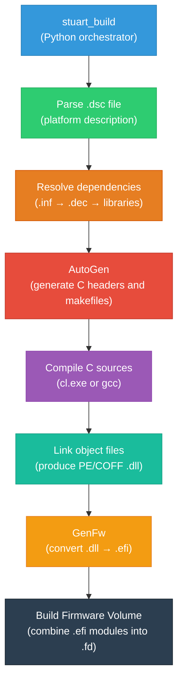

# Chapter 3: Hello World
{: .fs-9 }

Write, build, and run your first UEFI application.
{: .fs-6 .fw-300 }

---

## Table of Contents
{: .no_toc }

1. TOC
{:toc}

---

## 3.1 Overview

In this chapter, you will create a UEFI application from scratch. You will learn the minimal file structure of a UEFI module, write C code that prints text to the UEFI console, build it using stuart, and run it inside QEMU. By the end, you will have a working mental model of how UEFI applications are authored, compiled, and executed.


## 3.2 UEFI Application Structure

Every UEFI module in EDK2/Project Mu consists of at least two files:

| File | Purpose |
|:-----|:--------|
| `*.c` | C source code containing the module's logic and entry point |
| `*.inf` | **Module Information File** -- metadata that tells the build system how to compile the module |

Think of the `.inf` file as similar to a `Makefile` or a `CMakeLists.txt`, but specific to the EDK2 build system. It declares the module's name, type, dependencies, source files, and library classes.

### Where to Create Your Module

For this tutorial, we will create the Hello World application inside the `mu_tiano_platforms` workspace. The standard practice is to place custom applications in a dedicated package directory.

```
mu_tiano_platforms/
├── Platforms/
│   └── QemuQ35Pkg/
├── Common/
├── ...
└── HelloWorldPkg/              <-- We will create this
    ├── HelloWorldPkg.dec       <-- Package declaration
    └── Application/
        └── HelloWorld/
            ├── HelloWorld.c    <-- Source code
            └── HelloWorld.inf  <-- Module information
```

## 3.3 The Source Code: HelloWorld.c

Create the file `HelloWorldPkg/Application/HelloWorld/HelloWorld.c`:

```c
/** @file
  A minimal UEFI "Hello World" application.

  This application demonstrates the basic structure of a UEFI application:
  an entry point function that receives the ImageHandle and SystemTable,
  and uses the SystemTable's ConOut protocol to print a message.

  Copyright (c) 2024, Your Name. All rights reserved.
  SPDX-License-Identifier: BSD-2-Clause-Patent
**/

#include <Uefi.h>
#include <Library/UefiApplicationEntryPoint.h>
#include <Library/UefiLib.h>
#include <Library/UefiBootServicesTableLib.h>

/**
  The entry point for the Hello World UEFI application.

  @param[in] ImageHandle    The firmware-allocated handle for this image.
  @param[in] SystemTable    A pointer to the EFI System Table.

  @retval EFI_SUCCESS       The application completed successfully.
**/
EFI_STATUS
EFIAPI
UefiMain (
  IN EFI_HANDLE        ImageHandle,
  IN EFI_SYSTEM_TABLE  *SystemTable
  )
{
  //
  // Print a greeting to the UEFI console.
  // Print() is a convenience function from UefiLib that wraps
  // SystemTable->ConOut->OutputString().
  //
  Print (L"Hello, UEFI World!\n");
  Print (L"\n");

  //
  // Display some information about the firmware environment.
  //
  Print (L"Firmware Vendor:   %s\n", SystemTable->FirmwareVendor);
  Print (L"Firmware Revision: 0x%08x\n", SystemTable->FirmwareRevision);
  Print (L"\n");

  //
  // Access Boot Services through the global gBS pointer.
  // gBS is set up by UefiBootServicesTableLib.
  //
  Print (L"UEFI Specification Version: %d.%d\n",
         SystemTable->Hdr.Revision >> 16,
         SystemTable->Hdr.Revision & 0xFFFF);

  Print (L"\n");
  Print (L"Boot Services at:    0x%p\n", (VOID *)gBS);
  Print (L"Runtime Services at: 0x%p\n", (VOID *)gRT);
  Print (L"\n");

  //
  // Wait for a key press before exiting.
  //
  Print (L"Press any key to exit...\n");

  //
  // Clear any pending keystrokes.
  //
  gST->ConIn->Reset (gST->ConIn, FALSE);

  //
  // Wait for a key event.
  //
  {
    UINTN      Index;
    EFI_EVENT  WaitList[1];

    WaitList[0] = gST->ConIn->WaitForKey;
    gBS->WaitForEvent (1, WaitList, &Index);
  }

  return EFI_SUCCESS;
}
```

### Code Walkthrough

Let us examine each part of this source file in detail.

#### Header Comment

```c
/** @file
  A minimal UEFI "Hello World" application.
  ...
  SPDX-License-Identifier: BSD-2-Clause-Patent
**/
```

EDK2 coding style requires a Doxygen `@file` comment at the top of every source file with a brief description, copyright notice, and SPDX license identifier. The BSD-2-Clause-Patent license is standard for EDK2 contributions.

#### Include Files

```c
#include <Uefi.h>
#include <Library/UefiApplicationEntryPoint.h>
#include <Library/UefiLib.h>
#include <Library/UefiBootServicesTableLib.h>
```

| Header | Provides |
|:-------|:---------|
| `Uefi.h` | Core UEFI type definitions (`EFI_STATUS`, `EFI_HANDLE`, `EFI_SYSTEM_TABLE`, etc.) |
| `UefiApplicationEntryPoint.h` | The `UefiMain` entry point prototype and application framework |
| `UefiLib.h` | Convenience functions including `Print()` |
| `UefiBootServicesTableLib.h` | The global `gBS` (Boot Services), `gRT` (Runtime Services), and `gST` (System Table) pointers |

#### The Entry Point: UefiMain

```c
EFI_STATUS
EFIAPI
UefiMain (
  IN EFI_HANDLE        ImageHandle,
  IN EFI_SYSTEM_TABLE  *SystemTable
  )
```

Every UEFI application has an entry point function. The name `UefiMain` is conventional (and must match what you declare in the `.inf` file). The function signature is defined by the UEFI specification:

- **`ImageHandle`**: A handle that identifies this loaded image (your application) in the UEFI handle database. You use it when you need to install protocols on your own image or look up information about how you were loaded.
- **`SystemTable`**: A pointer to the `EFI_SYSTEM_TABLE`, which is the root data structure providing access to all UEFI services.
- **Return value**: An `EFI_STATUS` code. `EFI_SUCCESS` (value `0`) indicates success. The UEFI Shell displays this as the command's return status.
- **`EFIAPI`**: A calling convention macro. On x86-64, this translates to the Microsoft x64 calling convention (`__attribute__((ms_abi))` on GCC).

{: .note }
> The `IN` keyword is a documentation macro (defined as empty in EDK2). It tells the reader that the parameter is an input. Similarly, `OUT` marks output parameters and `IN OUT` marks bidirectional parameters.

#### Print() Function

```c
Print (L"Hello, UEFI World!\n");
```

`Print()` is a convenience wrapper provided by `UefiLib`. It works like `printf()` but outputs to the UEFI console (`ConOut`). Key differences from standard C `printf()`:

- String literals must be **wide strings** (prefixed with `L`).
- UEFI uses **UCS-2** encoding (similar to UTF-16LE), not ASCII or UTF-8.
- Format specifiers are similar to `printf()` but with some additions like `%s` for wide strings, `%a` for ASCII strings, `%r` for `EFI_STATUS` values, and `%g` for GUIDs.

Common format specifiers:

| Specifier | Type | Description |
|:----------|:-----|:------------|
| `%d` | `INT32` / `INTN` | Signed decimal integer |
| `%u` | `UINT32` / `UINTN` | Unsigned decimal integer |
| `%x` | `UINT32` / `UINTN` | Hexadecimal (lowercase) |
| `%X` | `UINT32` / `UINTN` | Hexadecimal (uppercase) |
| `%s` | `CHAR16 *` | UCS-2 (wide) string |
| `%a` | `CHAR8 *` | ASCII string |
| `%p` | `VOID *` | Pointer (hex) |
| `%r` | `EFI_STATUS` | Human-readable status string |
| `%g` | `EFI_GUID *` | GUID in standard format |

#### Global Pointers: gST, gBS, gRT

The `UefiBootServicesTableLib` library sets up three global pointers that you can use anywhere in your application:

| Global | Type | Description |
|:-------|:-----|:------------|
| `gST` | `EFI_SYSTEM_TABLE *` | The System Table (same as the `SystemTable` parameter) |
| `gBS` | `EFI_BOOT_SERVICES *` | Boot Services table (memory, protocols, events, images) |
| `gRT` | `EFI_RUNTIME_SERVICES *` | Runtime Services table (variables, time, reset) |

These are convenience aliases. You could always access the same data through `SystemTable->BootServices` and `SystemTable->RuntimeServices`, but the globals are more concise.

#### Waiting for a Key Press

```c
gST->ConIn->Reset (gST->ConIn, FALSE);

EFI_EVENT  WaitList[1];
WaitList[0] = gST->ConIn->WaitForKey;
gBS->WaitForEvent (1, WaitList, &Index);
```

This code waits for the user to press a key before exiting. Here is what happens:

1. **Reset the console input**: Clear any buffered keystrokes so we only respond to a new key press.
2. **Get the WaitForKey event**: `ConIn->WaitForKey` is an `EFI_EVENT` that is signaled when a key is available.
3. **WaitForEvent**: A Boot Services function that blocks until one of the provided events is signaled. The `Index` output tells you which event fired (in this case, there is only one).

## 3.4 The Module Information File: HelloWorld.inf

Create the file `HelloWorldPkg/Application/HelloWorld/HelloWorld.inf`:

```ini
## @file
#  A minimal UEFI Hello World application.
#
#  Copyright (c) 2024, Your Name. All rights reserved.
#  SPDX-License-Identifier: BSD-2-Clause-Patent
##

[Defines]
  INF_VERSION                    = 0x00010017
  BASE_NAME                      = HelloWorld
  FILE_GUID                      = a912f198-7f0e-4803-b908-b757b806ec83
  MODULE_TYPE                    = UEFI_APPLICATION
  VERSION_STRING                 = 1.0
  ENTRY_POINT                    = UefiMain

[Sources]
  HelloWorld.c

[Packages]
  MdePkg/MdePkg.dec
  MdeModulePkg/MdeModulePkg.dec

[LibraryClasses]
  UefiApplicationEntryPoint
  UefiLib
  UefiBootServicesTableLib

[Protocols]

[Guids]
```

### INF File Sections Explained

The `.inf` file is divided into sections, each enclosed in square brackets. Let us examine each one.

#### [Defines]

```ini
[Defines]
  INF_VERSION                    = 0x00010017
  BASE_NAME                      = HelloWorld
  FILE_GUID                      = a912f198-7f0e-4803-b908-b757b806ec83
  MODULE_TYPE                    = UEFI_APPLICATION
  VERSION_STRING                 = 1.0
  ENTRY_POINT                    = UefiMain
```

| Key | Purpose |
|:----|:--------|
| `INF_VERSION` | INF file format version. `0x00010017` is the current standard. |
| `BASE_NAME` | The output file name (produces `HelloWorld.efi`). |
| `FILE_GUID` | A unique GUID identifying this module. Every module must have a unique GUID. Generate one with `python -c "import uuid; print(uuid.uuid4())"` or `uuidgen`. |
| `MODULE_TYPE` | The type of module. `UEFI_APPLICATION` means this is a standalone application (not a driver). Other types include `DXE_DRIVER`, `PEIM`, `DXE_RUNTIME_DRIVER`, etc. |
| `VERSION_STRING` | Human-readable version number. |
| `ENTRY_POINT` | The name of the C function that serves as the entry point. Must match the function name in your source code. |

{: .important }
> Every module must have a **unique GUID**. If you copy this example, generate a new GUID for your module. Duplicate GUIDs cause build errors or unpredictable runtime behavior.

```mermaid
graph TD
    subgraph "INF File Structure"
        Defines["[Defines]\nModule identity and type"]
        Sources["[Sources]\nC, ASM, and header files"]
        Packages["[Packages]\nPackage declarations (.dec)"]
        LibClasses["[LibraryClasses]\nRequired library interfaces"]
        Protocols["[Protocols]\nConsumed/produced protocols"]
        Guids["[Guids]\nReferenced GUIDs"]
        PCDs["[Pcd]\nPlatform config data"]
        Depex["[Depex]\nDependency expressions"]
    end

    Defines --> Sources
    Sources --> Packages
    Packages --> LibClasses
    LibClasses --> Protocols
    Protocols --> Guids
    Guids --> PCDs
    PCDs --> Depex

    style Defines fill:#e74c3c,stroke:#c0392b,color:#fff
    style Sources fill:#e67e22,stroke:#d35400,color:#fff
    style Packages fill:#2ecc71,stroke:#27ae60,color:#fff
    style LibClasses fill:#3498db,stroke:#2980b9,color:#fff
    style Protocols fill:#9b59b6,stroke:#8e44ad,color:#fff
    style Guids fill:#1abc9c,stroke:#16a085,color:#fff
    style PCDs fill:#f39c12,stroke:#e67e22,color:#fff
    style Depex fill:#95a5a6,stroke:#7f8c8d,color:#fff
```



#### [Sources]

```ini
[Sources]
  HelloWorld.c
```

Lists all source files for this module. You can include multiple `.c` files, assembly files (`.nasm`), and architecture-specific files:

```ini
[Sources]
  HelloWorld.c
  Helpers.c

[Sources.X64]
  X64/CpuSpecific.nasm

[Sources.IA32]
  Ia32/CpuSpecific.nasm
```

Architecture-specific sections (e.g., `[Sources.X64]`) are only included when building for that architecture.

#### [Packages]

```ini
[Packages]
  MdePkg/MdePkg.dec
  MdeModulePkg/MdeModulePkg.dec
```

Lists the **package declaration files** (`.dec`) that this module depends on. A `.dec` file defines the public interface of a package: the GUIDs, protocols, PCDs (Platform Configuration Data), and include paths it exports.

| Package | Provides |
|:--------|:---------|
| `MdePkg` | Core UEFI types, base libraries, standard protocol definitions |
| `MdeModulePkg` | Higher-level module support libraries and protocols |

#### [LibraryClasses]

```ini
[LibraryClasses]
  UefiApplicationEntryPoint
  UefiLib
  UefiBootServicesTableLib
```

Lists the **library classes** (abstract interfaces) that this module requires. A library class is an abstraction -- the actual implementation is chosen by the platform's `.dsc` file. This indirection allows the same module to work with different library implementations on different platforms.

| Library Class | Purpose |
|:--------------|:--------|
| `UefiApplicationEntryPoint` | Provides the application entry point wrapper that calls `UefiMain` |
| `UefiLib` | Convenience functions (`Print`, `AsciiPrint`, etc.) |
| `UefiBootServicesTableLib` | Sets up the `gST`, `gBS`, `gRT` global pointers |

#### [Protocols] and [Guids]

```ini
[Protocols]

[Guids]
```

These sections list the **protocol GUIDs** and **data GUIDs** that the module uses. Our Hello World does not directly consume any protocols beyond what the libraries handle, so these sections are empty. In more complex modules, you would list items like:

```ini
[Protocols]
  gEfiSimpleTextInputExProtocolGuid       ## CONSUMES
  gEfiGraphicsOutputProtocolGuid          ## CONSUMES

[Guids]
  gEfiGlobalVariableGuid                  ## CONSUMES
```

The `## CONSUMES` / `## PRODUCES` comments are documentation conventions that indicate whether the module uses or provides the protocol.

## 3.5 Package Declaration: HelloWorldPkg.dec

To make the build system recognize your package, create a minimal `.dec` file at `HelloWorldPkg/HelloWorldPkg.dec`:

```ini
## @file
#  Hello World Package Declaration.
#
#  Copyright (c) 2024, Your Name. All rights reserved.
#  SPDX-License-Identifier: BSD-2-Clause-Patent
##

[Defines]
  DEC_VERSION                    = 0x00010017
  PACKAGE_NAME                   = HelloWorldPkg
  PACKAGE_GUID                   = b1e3a853-61c7-4555-8ca3-69518f941d2e
  PACKAGE_VERSION                = 1.0
```

## 3.6 Adding Your Module to the Platform Build

To build your module, you need to add it to the platform's `.dsc` (Platform Description) file. For the Q35 platform in `mu_tiano_platforms`:

**Step 1:** Open `Platforms/QemuQ35Pkg/QemuQ35Pkg.dsc` and add your module to the `[Components]` section:

```ini
[Components]
  # ... existing components ...
  HelloWorldPkg/Application/HelloWorld/HelloWorld.inf
```

**Step 2:** Ensure your package's path is discoverable. Add `HelloWorldPkg` to the `PACKAGES_PATH` if it is not already under the workspace root. In most cases, if your `HelloWorldPkg` directory is at the workspace root, it is automatically found.

{: .tip }
> Alternatively, you can build your module as a standalone component without modifying the platform `.dsc`. Use the UEFI Shell to load and run it.

## 3.7 Building with Stuart

With your source files in place and the `.dsc` updated, build the platform:

```bash
cd ~/fw/mu_tiano_platforms

# Build the platform (your module is included)
stuart_build -c Platforms/QemuQ35Pkg/PlatformBuild.py
```

If the build succeeds, your compiled application will be at:

```
Build/QemuQ35Pkg/DEBUG_GCC5/X64/HelloWorld.efi
```

Or on Windows:
```
Build\QemuQ35Pkg\DEBUG_VS2022\X64\HelloWorld.efi
```

### Build Output Explained

The EDK2 build system produces several artifacts for each module:

| File | Description |
|:-----|:------------|
| `HelloWorld.efi` | The compiled UEFI PE/COFF executable |
| `HelloWorld.obj` | Object file (intermediate) |
| `HelloWorld.map` | Linker map file (useful for debugging) |
| `HelloWorld.debug` | Debug symbols (used with source-level debuggers) |

## 3.8 Running in QEMU

### Method 1: UEFI Shell

The easiest way to test a standalone UEFI application is via the UEFI Shell.

**Step 1:** Create a directory for your virtual disk:

```bash
mkdir -p ~/fw/hda-contents
cp Build/QemuQ35Pkg/DEBUG_GCC5/X64/HelloWorld.efi ~/fw/hda-contents/
```

**Step 2:** Launch QEMU with the virtual disk:

```bash
qemu-system-x86_64 \
    -machine q35 \
    -m 2048M \
    -drive if=pflash,format=raw,readonly=on,file=Build/QemuQ35Pkg/DEBUG_GCC5/FV/QEMUQ35_CODE.fd \
    -drive if=pflash,format=raw,file=Build/QemuQ35Pkg/DEBUG_GCC5/FV/QEMUQ35_VARS.fd \
    -drive file=fat:rw:~/fw/hda-contents,format=raw,media=disk \
    -serial stdio \
    -no-reboot
```

**Step 3:** In the UEFI Shell, navigate to the file system and run your application:

```
Shell> fs0:
FS0:\> ls
...
HelloWorld.efi
FS0:\> HelloWorld.efi
Hello, UEFI World!

Firmware Vendor:   EDK II
Firmware Revision: 0x00010000

UEFI Specification Version: 2.7
Boot Services at:    0x000000007FE8A000
Runtime Services at: 0x000000007FD8B000

Press any key to exit...
```

### Method 2: Auto-Boot

You can make OVMF automatically launch your application by placing it at the default boot path:

```bash
mkdir -p ~/fw/hda-contents/EFI/Boot
cp Build/QemuQ35Pkg/DEBUG_GCC5/X64/HelloWorld.efi \
   ~/fw/hda-contents/EFI/Boot/bootx64.efi
```

When OVMF's BDS phase searches for boot options, it checks removable media for `\EFI\Boot\bootx64.efi` (on x86-64 systems). Your application will launch automatically.

## 3.9 Understanding Debug Output

UEFI firmware and applications can produce debug output through several channels:

### Serial Console

Debug output sent to the serial port appears in your terminal when you use `-serial stdio`. This is the primary mechanism for firmware debug messages.

### DEBUG() Macro

For development and debugging, use the `DEBUG()` macro from `DebugLib`:

```c
#include <Library/DebugLib.h>

// Usage:
DEBUG ((DEBUG_INFO, "Application started. ImageHandle = %p\n", ImageHandle));
DEBUG ((DEBUG_WARN, "Warning: something unexpected happened\n"));
DEBUG ((DEBUG_ERROR, "Error: operation failed with %r\n", Status));
```

The `DEBUG()` macro takes a **print error level** and a format string. Common levels:

| Level | Meaning |
|:------|:--------|
| `DEBUG_INIT` | Initialization messages |
| `DEBUG_INFO` | Informational messages |
| `DEBUG_WARN` | Warnings |
| `DEBUG_ERROR` | Errors |
| `DEBUG_VERBOSE` | Verbose/trace messages |

{: .note }
> `DEBUG()` output goes to the serial port (or whatever `DebugLib` is configured to use). It does **not** appear on the graphical console. In a `DEBUG` build, all messages at or above the configured level are printed. In a `RELEASE` build, `DEBUG()` calls are compiled out entirely.

To use `DEBUG()`, add `DebugLib` to your INF file's `[LibraryClasses]` section:

```ini
[LibraryClasses]
  UefiApplicationEntryPoint
  UefiLib
  UefiBootServicesTableLib
  DebugLib
```

### Enhanced Version with DEBUG Output

Here is the Hello World application enhanced with debug messages:

```c
#include <Uefi.h>
#include <Library/UefiApplicationEntryPoint.h>
#include <Library/UefiLib.h>
#include <Library/UefiBootServicesTableLib.h>
#include <Library/DebugLib.h>

EFI_STATUS
EFIAPI
UefiMain (
  IN EFI_HANDLE        ImageHandle,
  IN EFI_SYSTEM_TABLE  *SystemTable
  )
{
  DEBUG ((DEBUG_INFO, "[HelloWorld] Entry point reached.\n"));
  DEBUG ((DEBUG_INFO, "[HelloWorld] ImageHandle = 0x%p\n", ImageHandle));
  DEBUG ((DEBUG_INFO, "[HelloWorld] SystemTable = 0x%p\n", SystemTable));

  Print (L"Hello, UEFI World!\n");

  DEBUG ((DEBUG_INFO, "[HelloWorld] Print completed. Waiting for key.\n"));

  // Wait for key press
  gST->ConIn->Reset (gST->ConIn, FALSE);
  {
    UINTN      Index;
    EFI_EVENT  WaitList[1];
    WaitList[0] = gST->ConIn->WaitForKey;
    gBS->WaitForEvent (1, WaitList, &Index);
  }

  DEBUG ((DEBUG_INFO, "[HelloWorld] Key received. Exiting.\n"));
  return EFI_SUCCESS;
}
```

In the serial console output (terminal), you will see lines like:

```
[HelloWorld] Entry point reached.
[HelloWorld] ImageHandle = 0x7F9E3A40
[HelloWorld] SystemTable = 0x7FE9C018
[HelloWorld] Print completed. Waiting for key.
```

## 3.10 Anatomy of the Build Process

When you run `stuart_build`, the following happens behind the scenes:



1. **Parse**: The build system reads the `.dsc` file to determine which modules to build and how to configure them.
2. **Resolve dependencies**: For each `.inf`, the build system identifies required packages (`.dec`) and resolves library class implementations.
3. **AutoGen**: The build system generates `AutoGen.h` and `AutoGen.c` files for each module. These contain:
   - Protocol GUID definitions.
   - Library constructor/destructor calls.
   - PCD value definitions.
   - Entry point wrappers.
4. **Compile**: C sources (and generated AutoGen files) are compiled to object files.
5. **Link**: Object files are linked into a PE/COFF DLL.
6. **GenFw**: The `GenFw` tool converts the DLL into a UEFI-compatible `.efi` executable (stripping unnecessary sections, adjusting headers).
7. **Firmware Volume**: For platform builds, all `.efi` files are assembled into firmware volumes (`.fv`) and then into the final flash image (`.fd`).

## 3.11 Common Build Errors and Fixes

### Error: "Module not found in DSC"

```
ERROR - Module HelloWorldPkg/Application/HelloWorld/HelloWorld.inf not found
```

**Cause:** Your `.inf` file is not listed in the platform's `.dsc` file.

**Fix:** Add the `.inf` path to the `[Components]` section of the `.dsc` file (see Section 3.6).

### Error: "LibraryClass not found"

```
ERROR - Library class [UefiLib] is not found
```

**Cause:** The library class is listed in your `.inf` but no implementation is provided in the `.dsc` file's `[LibraryClasses]` section.

**Fix:** This usually means you are building with a `.dsc` that does not map the required library class. Standard platforms like QemuQ35Pkg already map all common library classes, so this error typically indicates a typo in the library class name.

### Error: "Undefined symbol" or "Unresolved external"

```
error LNK2019: unresolved external symbol UefiMain
```

**Cause:** The entry point name in the `.inf` (`ENTRY_POINT = UefiMain`) does not match the function name in your C code.

**Fix:** Ensure the `ENTRY_POINT` value in `[Defines]` matches your C function name exactly (case-sensitive).

### Error: "Package not found"

```
ERROR - Package MdePkg/MdePkg.dec not found
```

**Cause:** The build system cannot find the `.dec` file. The package directory is not in the workspace or `PACKAGES_PATH`.

**Fix:** Ensure the package exists in one of the paths listed in `PACKAGES_PATH`. Run `stuart_setup` to ensure all dependencies are cloned.

### Error: "Duplicate FILE_GUID"

```
ERROR - Duplicate FILE_GUID a912f198-7f0e-4803-b908-b757b806ec83
```

**Cause:** Two modules have the same GUID in their `.inf` files.

**Fix:** Generate a new unique GUID:

```bash
python3 -c "import uuid; print(uuid.uuid4())"
```

### Error: "Wide string expected"

```
error: passing 'char *' to parameter of type 'CHAR16 *'
```

**Cause:** You used a regular string literal (`"text"`) instead of a wide string literal (`L"text"`) with a UEFI function that expects `CHAR16 *`.

**Fix:** Prefix all string literals with `L` when passing them to UEFI APIs:

```c
// Wrong:
Print ("Hello");

// Correct:
Print (L"Hello");
```

### Warning: "Unused variable"

```
warning: unused variable 'Status' [-Wunused-variable]
```

**Cause:** You declared a variable but did not use it (or used it only in a `DEBUG()` macro that is compiled out in RELEASE builds).

**Fix:** Use the `ASSERT_EFI_ERROR()` macro or check the status:

```c
EFI_STATUS Status;
Status = SomeFunction ();
ASSERT_EFI_ERROR (Status);  // Asserts in DEBUG, compiles out in RELEASE
```

## 3.12 Exercises

Now that you have a working Hello World application, try these exercises to deepen your understanding.

### Exercise 1: Display the Memory Map

Use `gBS->GetMemoryMap()` to retrieve and display the system memory map:

```c
EFI_STATUS            Status;
UINTN                 MemoryMapSize = 0;
EFI_MEMORY_DESCRIPTOR *MemoryMap = NULL;
UINTN                 MapKey;
UINTN                 DescriptorSize;
UINT32                DescriptorVersion;

// First call: get the required buffer size
Status = gBS->GetMemoryMap (
    &MemoryMapSize, MemoryMap, &MapKey,
    &DescriptorSize, &DescriptorVersion
    );
// Status should be EFI_BUFFER_TOO_SMALL

// Allocate buffer (add extra space for the allocation itself)
MemoryMapSize += 2 * DescriptorSize;
Status = gBS->AllocatePool (
    EfiBootServicesData, MemoryMapSize, (VOID **)&MemoryMap
    );

// Second call: get the actual map
Status = gBS->GetMemoryMap (
    &MemoryMapSize, MemoryMap, &MapKey,
    &DescriptorSize, &DescriptorVersion
    );
```

### Exercise 2: List Installed Protocols

Use `gBS->LocateHandleBuffer()` and `gBS->ProtocolsPerHandle()` to enumerate all protocols installed in the system.

### Exercise 3: Read a UEFI Variable

Use `gRT->GetVariable()` to read the `Boot0000` variable and display its contents.

These exercises preview concepts that are covered in depth in [Part 3: UEFI Core Concepts]() and [Part 4: Essential UEFI Services]().

{: .note }
> **Complete source code**: The full working example for this chapter is available at [`examples/UefiMuGuidePkg/HelloWorld/`](https://github.com/MichaelTien8901/uefi-mu-guide-tutorial-openspec/tree/main/docs/examples/UefiMuGuidePkg/HelloWorld).

## 3.13 Summary

In this chapter, you:

- Created a **UEFI application** from scratch with a `.c` source file and a `.inf` module information file.
- Learned the structure of an **INF file**: `[Defines]`, `[Sources]`, `[Packages]`, `[LibraryClasses]`, `[Protocols]`, and `[Guids]`.
- Understood the **UefiMain entry point** and its parameters (`ImageHandle` and `SystemTable`).
- Used **`Print()`** for console output and **`gST`/`gBS`/`gRT`** global pointers for accessing UEFI services.
- **Built** the application with `stuart_build` and understood the build pipeline (parse, resolve, AutoGen, compile, link, GenFw).
- **Ran** the application in QEMU with OVMF, both via the UEFI Shell and via auto-boot.
- Learned about **DEBUG() output** for development-time serial logging.
- Reviewed **common build errors** and their fixes.

## Next Steps

You now have a working UEFI development environment and your first successful application. Continue to [Part 2: Project Mu Structure & Tooling]() to learn how Project Mu organizes its multi-repository codebase and how the stuart build system works in detail.
