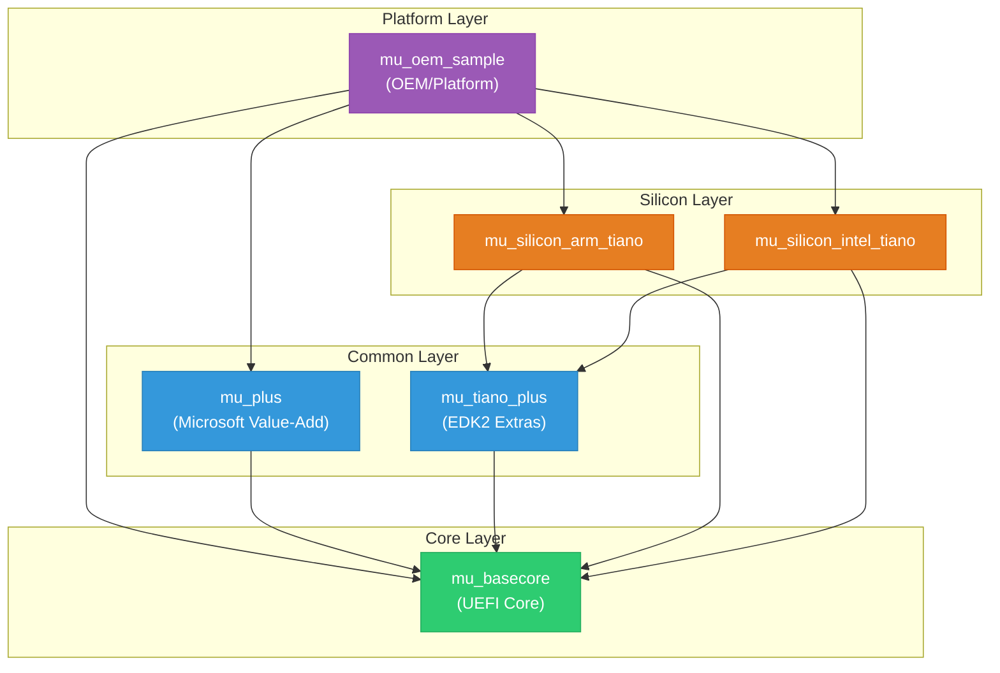
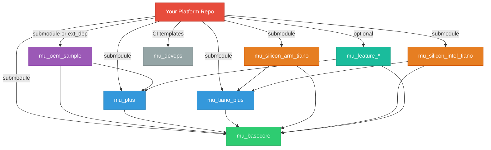

# Chapter 4: Repository Architecture
{: .no_toc }

How Project Mu distributes UEFI firmware across purpose-specific repositories, and why the multi-repo model enables better scalability, ownership, and release management than a traditional monorepo.
{: .fs-6 .fw-300 }

<details open markdown="block">
  <summary>
    Table of contents
  </summary>
  {: .text-delta }
1. TOC
{:toc}
</details>

---

## Learning Objectives

After completing this chapter, you will be able to:
- Explain the motivation behind Project Mu's multi-repository architecture
- Identify the role of each core Project Mu repository
- Trace dependency relationships between repositories
- Understand naming conventions and versioning strategies
- Compare the multi-repo model with EDK2's monorepo approach
- Describe how NuGet binary dependencies fit into the architecture

## The Problem with Monorepos in Firmware

EDK2, the reference implementation of the UEFI specification, is maintained as a single large Git repository. As of 2025 the `edk2` repo contains over 10,000 files spanning millions of lines of code. This monorepo model has clear advantages --- everything is in one place, cross-cutting changes are atomic, and there is a single version to track --- but it creates significant problems at scale:

| Problem | Impact |
|:--------|:-------|
| **Slow clones** | A fresh `git clone` of edk2 downloads the entire history of every package, even those you never build. |
| **Unclear ownership** | When everything lives together, it is difficult to assign clear code-ownership boundaries. |
| **Coupled release cycles** | A breaking change in `MdePkg` forces every downstream package in the same repo to adapt simultaneously. |
| **CI blast radius** | A CI failure in one package blocks merges for the entire repository. |
| **Silicon vendor friction** | Hardware vendors need to fork the entire repo to add platform support, even though they only modify a small slice. |

Project Mu was designed from the ground up to solve these problems.

## Project Mu's Multi-Repo Philosophy

Project Mu decomposes UEFI firmware into **layers**, each hosted in its own Git repository. Each layer has:

- A **clear purpose** (e.g., core UEFI spec implementation, Microsoft value-add features, silicon support)
- **Defined interfaces** to the layers above and below it
- An **independent release cadence** with semantic versioning
- **Dedicated code owners** who can review and merge without blocking other layers

This design follows the same principles as microservice architectures in cloud software: replace tight coupling with well-defined contracts, and allow each component to evolve at its own pace.

### Architectural Layers

Project Mu organizes repositories into four conceptual layers:



Dependencies flow **downward**: a platform repository depends on silicon and common layer repos, which in turn depend on the core layer. No upward dependencies are permitted.

## Key Repositories

### mu_basecore

**Role**: The foundation layer. Contains the core UEFI specification implementation --- the pieces every UEFI firmware must include regardless of platform.

**Contents**:
- `MdePkg` --- UEFI/PI specification headers, libraries, and protocol definitions
- `MdeModulePkg` --- Core DXE drivers, console infrastructure, variable services
- `UefiCpuPkg` --- CPU architecture initialization (interrupt handling, MP services)
- `BaseTools` --- EDK2 build tools (`build.exe`, `GenFds`, `GenFw`, etc.)
- `NetworkPkg` --- Core network stack (TCP/IP, TLS, HTTP Boot)
- `CryptoPkg` --- Cryptographic library wrappers (OpenSSL/mbedTLS integration)
- `SecurityPkg` --- Secure Boot, Authenticated Variables, TPM support
- `FatPkg` --- FAT file system driver

**Origin**: This repository is derived from the upstream TianoCore EDK2 project. Project Mu periodically rebases `mu_basecore` onto the latest stable EDK2 release, applying Mu-specific patches on top.

**Repository URL**: `https://github.com/microsoft/mu_basecore`

### mu_tiano_plus

**Role**: Additional EDK2 packages that are commonly needed but not strictly part of the core specification implementation.

**Contents**:
- `PcAtChipsetPkg` --- PC/AT-compatible chipset support (PIT, RTC, PIC)
- `ShellPkg` --- UEFI Shell application and libraries
- `UefiCpuPkg` extensions --- Additional CPU features
- `SignedCapsulePkg` --- Capsule update signing infrastructure

Like `mu_basecore`, this repo tracks upstream EDK2 but contains packages that not every firmware needs.

**Repository URL**: `https://github.com/microsoft/mu_tiano_plus`

### mu_plus

**Role**: Microsoft's value-add features that go beyond the UEFI specification. These are the capabilities that differentiate Project Mu from vanilla EDK2.

**Contents**:
- `DfciPkg` --- Device Firmware Configuration Interface (cloud-managed firmware settings)
- `MsCorePkg` --- Microsoft core services and libraries
- `MsGraphicsPkg` --- Boot graphics, front page UI, on-screen keyboard
- `MsWheaPkg` --- Windows Hardware Error Architecture integration
- `PolicyServicePkg` --- Policy-based configuration system
- `SetupDataPkg` --- Configuration/setup data management
- `UefiTestingPkg` --- Firmware testing infrastructure
- `XmlSupportPkg` --- XML parsing libraries for firmware

These packages have no upstream EDK2 equivalent --- they are original Project Mu contributions.

**Repository URL**: `https://github.com/microsoft/mu_plus`

### mu_silicon_arm_tiano

**Role**: ARM architecture silicon support derived from EDK2's ARM packages.

**Contents**:
- `ArmPkg` --- ARM architecture libraries, exception handling, MMU support
- `ArmPlatformPkg` --- Reference ARM platform support
- `ArmVirtPkg` --- ARM virtual machine platform (QEMU/KVM)
- `EmbeddedPkg` --- Minimal platform support for embedded ARM systems

**Repository URL**: `https://github.com/microsoft/mu_silicon_arm_tiano`

### mu_silicon_intel_tiano

**Role**: Intel architecture silicon support derived from EDK2's Intel-specific packages.

**Contents**:
- `IntelFsp2Pkg` --- Intel Firmware Support Package (FSP) integration
- `IntelFsp2WrapperPkg` --- Wrappers for consuming FSP binaries
- `KabylakeSiliconPkg` (and other generations) --- Generation-specific silicon init code

**Repository URL**: `https://github.com/microsoft/mu_silicon_intel_tiano`

### mu_oem_sample

**Role**: A reference platform implementation showing how an OEM or ODM would compose the layers above into a complete firmware image.

**Contents**:
- Example platform DSC and FDF files
- Platform-specific drivers and configuration
- Build configuration (stuart settings files)
- Sample CI pipeline configuration

This repository is the **template** you would fork when starting a new platform.

**Repository URL**: `https://github.com/microsoft/mu_oem_sample`

### Additional Repositories

Beyond the six core repositories, the Project Mu ecosystem includes several supporting repos:

| Repository | Purpose |
|:-----------|:--------|
| `mu_devops` | Shared CI/CD templates, GitHub Actions reusable workflows |
| `mu_crypto_release` | Pre-built cryptographic binaries for use as NuGet packages |
| `mu_feature_config` | Feature flag and configuration management system |
| `mu_feature_dfci` | DFCI feature integration and tools |
| `mu_feature_ipmi` | IPMI (Intelligent Platform Management Interface) support |
| `mu_feature_mm_supv` | MM Supervisor for StandaloneMm security isolation |

## Dependency Graph

The following diagram shows a more complete view of how repositories depend on one another in a typical platform build:



## Naming Conventions

Project Mu follows consistent naming patterns that help you identify a repository's purpose at a glance:

### Repository Names

| Prefix | Meaning | Example |
|:-------|:--------|:--------|
| `mu_basecore` | Core UEFI specification code (forked from EDK2) | `mu_basecore` |
| `mu_tiano_*` | Additional packages from EDK2/TianoCore | `mu_tiano_plus` |
| `mu_plus` | Microsoft-original value-add packages | `mu_plus` |
| `mu_silicon_*` | Silicon/architecture-specific code | `mu_silicon_arm_tiano` |
| `mu_feature_*` | Optional feature modules | `mu_feature_dfci` |
| `mu_oem_*` | Platform/OEM reference implementations | `mu_oem_sample` |
| `mu_devops` | Build and CI infrastructure | `mu_devops` |

### Branch Names

Project Mu uses a date-based branching scheme for releases:

```
release/YYYYMM
```

For example, `release/202311` represents the November 2023 release. This makes it immediately clear when a branch was cut and helps teams plan upgrade windows.

The `main` branch typically tracks the latest development state and may be unstable. For production use, always pin to a `release/*` branch or a specific tag.

### Package Names Inside Repositories

Packages within each repo follow EDK2 conventions:

- `MdePkg`, `MdeModulePkg` --- specification-defined names (retained from EDK2)
- `MsCorePkg`, `MsGraphicsPkg` --- `Ms` prefix for Microsoft-original packages
- `DfciPkg`, `PolicyServicePkg` --- feature-descriptive names for standalone features

## NuGet Binary Dependencies

Not all dependencies in a Project Mu build are source code. Some components are distributed as **pre-built binaries** through NuGet feeds. This is a key architectural decision that deserves careful explanation.

### Why Binary Dependencies?

Certain build tools and support binaries have characteristics that make source distribution impractical:

1. **Build tools**: `BaseTools` binaries (`build.exe`, `GenFds.exe`) must be compiled before you can build any firmware. Distributing them as pre-built NuGet packages eliminates the "build the builder" bootstrapping problem.

2. **Cryptographic libraries**: Pre-compiled OpenSSL binaries avoid the complexity of building OpenSSL from source on every platform. The `mu_crypto_release` repository handles building and publishing these.

3. **Compiler toolchains**: GCC/LLVM cross-compilers for ARM targets can be distributed as NuGet packages, ensuring all developers use the exact same compiler version.

4. **Silicon binaries**: Intel FSP (Firmware Support Package) binaries and AMD AGESA blobs are closed-source and can only be distributed as binaries.

### How NuGet Dependencies Are Declared

Each repository declares its NuGet dependencies using `ext_dep` JSON files:

```json
{
  "scope": "global",
  "type": "nuget",
  "name": "mu-basetools",
  "source": "https://pkgs.dev.azure.com/projectmu/mu/_packaging/Mu-Public/nuget/v3/index.json",
  "version": "2023.11.0",
  "flags": ["set_build_var"],
  "var_name": "EDK_TOOLS_BIN"
}
```

Key fields:
- `scope` --- When this dependency is needed (`global`, `cibuild`, or a specific package name)
- `type` --- The dependency type (`nuget`, `git`, or `web`)
- `name` --- The NuGet package name
- `source` --- The NuGet feed URL
- `version` --- The exact version to fetch (pinned for reproducibility)
- `flags` / `var_name` --- Optional build environment variable to set after extraction

When you run `stuart_update` (covered in [Chapter 5]()), it reads all `ext_dep` files and downloads the specified NuGet packages into a local cache.

### NuGet Feed Structure

Project Mu publishes packages to Azure Artifacts feeds:

```
https://pkgs.dev.azure.com/projectmu/mu/_packaging/Mu-Public/nuget/v3/index.json
```

Common packages available on this feed:

| Package | Contents |
|:--------|:---------|
| `mu-basetools` | Pre-built EDK2 BaseTools binaries |
| `mu-crypto` | Pre-compiled OpenSSL libraries |
| `mu_nasm` | NASM assembler binary |
| `mu_iasl` | Intel ASL compiler binary |
| `gcc_aarch64_linux` | GCC cross-compiler for AARCH64 targets |

## Comparison with EDK2 Monorepo

Understanding the tradeoffs helps you evaluate which model fits your project:

| Dimension | EDK2 Monorepo | Project Mu Multi-Repo |
|:----------|:--------------|:----------------------|
| **Repository count** | 1 (plus submodules for `CryptoPkg/Library/OpensslLib/openssl` etc.) | 6+ core repos, composed via submodules or ext_deps |
| **Clone time** | Single large clone | Multiple smaller clones, managed by stuart |
| **Cross-package changes** | Single atomic commit | Coordinated PRs across repos (requires planning) |
| **Code ownership** | MAINTAINERS file, loosely enforced | Per-repo CODEOWNERS, strictly enforced |
| **CI scope** | Entire repo tested on every PR | Per-repo CI; platform-level integration tests separate |
| **Release cadence** | Quarterly stable tags | Per-repo releases on independent schedules |
| **Silicon vendor workflow** | Fork entire repo, cherry-pick upstream changes | Consume base repos as submodules, maintain only platform repo |
| **Build system** | `build.sh`/`build.bat` + `edksetup.sh` | `stuart` Python tooling (wraps EDK2 `build`) |
| **Binary dependencies** | Manual download or git submodules | NuGet packages with version pinning |
| **Toolchain management** | Developer responsibility | NuGet-distributed toolchains with exact version control |

### When Multi-Repo Adds Complexity

The multi-repo model is not without costs:

1. **Cross-repo changes are harder**: If a change in `mu_basecore` requires a corresponding change in `mu_plus`, you must coordinate two separate PRs and ensure they merge in the correct order.

2. **Version synchronization**: You need to track which version of each dependency is compatible with your platform. Stuart's ext_dep pinning helps, but upgrades still require testing.

3. **Local development**: Working on code that spans multiple repos requires careful workspace setup. Stuart handles this, but the mental model is more complex than "everything is here."

4. **Debugging across boundaries**: When a bug crosses repository boundaries, you may need to check out and modify multiple repos simultaneously.

{: .note }
> Despite these tradeoffs, the multi-repo model is strongly recommended for any team building production firmware. The benefits of clear ownership, independent release cycles, and manageable CI scope outweigh the coordination costs.

## Repository Composition in Practice

When you set up a platform project, your top-level repository typically includes the other repos as **Git submodules**. A typical directory layout looks like this:

```
MyPlatformPkg/
├── .gitmodules                  # Submodule declarations
├── Platform/
│   └── MyPlatform/
│       ├── PlatformBuild.py     # Stuart build settings
│       ├── PlatformPkg.dsc      # Platform description file
│       └── PlatformPkg.fdf      # Flash description file
├── MU_BASECORE/                 # submodule -> mu_basecore
├── Common/
│   ├── MU_TIANO/                # submodule -> mu_tiano_plus
│   └── MU_PLUS/                 # submodule -> mu_plus
├── Silicon/
│   ├── ARM/MU_SILICON_ARM/      # submodule -> mu_silicon_arm_tiano
│   └── Intel/MU_SILICON_INTEL/  # submodule -> mu_silicon_intel_tiano
└── pip-requirements.txt         # Python dependencies
```

The `.gitmodules` file pins each submodule to a specific commit or branch:

```ini
[submodule "MU_BASECORE"]
    path = MU_BASECORE
    url = https://github.com/microsoft/mu_basecore.git
    branch = release/202311

[submodule "Common/MU_TIANO"]
    path = Common/MU_TIANO
    url = https://github.com/microsoft/mu_tiano_plus.git
    branch = release/202311

[submodule "Common/MU_PLUS"]
    path = Common/MU_PLUS
    url = https://github.com/microsoft/mu_plus.git
    branch = release/202311
```

{: .tip }
> Pin submodules to specific commits rather than branch names for fully reproducible builds. Use branch names during active development when you want to track the latest changes in a release branch.

## Forking Strategy for Custom Platforms

When creating a new platform, follow this approach:

1. **Fork `mu_oem_sample`** as your starting point
2. **Add submodules** for the repos your platform needs
3. **Pin all submodules** to a consistent release branch (e.g., `release/202311`)
4. **Customize** the platform DSC/FDF files for your hardware
5. **Add silicon-specific repos** as submodules if they exist, or create your own `mu_silicon_*` repo for proprietary silicon init code


## Key Takeaways

- Project Mu replaces EDK2's monorepo with a multi-repo architecture organized into core, common, silicon, and platform layers
- Each repository has clear ownership, independent releases, and focused CI
- `mu_basecore` provides the UEFI foundation; `mu_plus` adds Microsoft value-add features; silicon repos provide hardware-specific code
- NuGet binary dependencies handle build tools, compilers, and pre-built libraries
- Platform repos compose the layers via Git submodules, pinned to release branches
- The multi-repo model adds coordination cost but provides significantly better scalability for production firmware teams

## Next Steps

Now that you understand how Project Mu organizes its code, continue to [Chapter 5: Stuart Build System]() to learn how the `stuart` tooling ties these repositories together into a working build.
