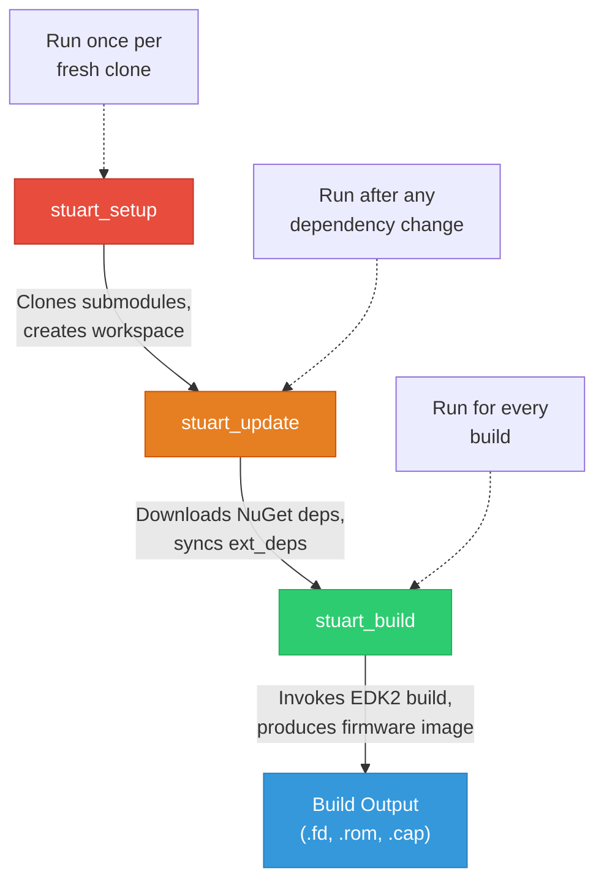
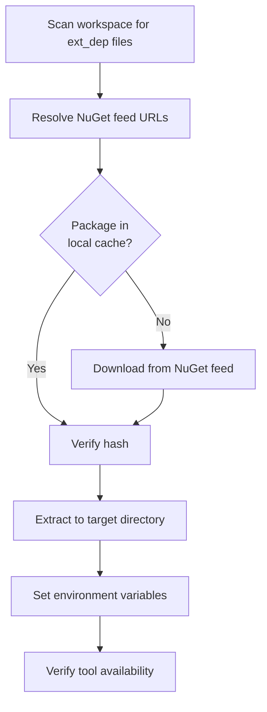
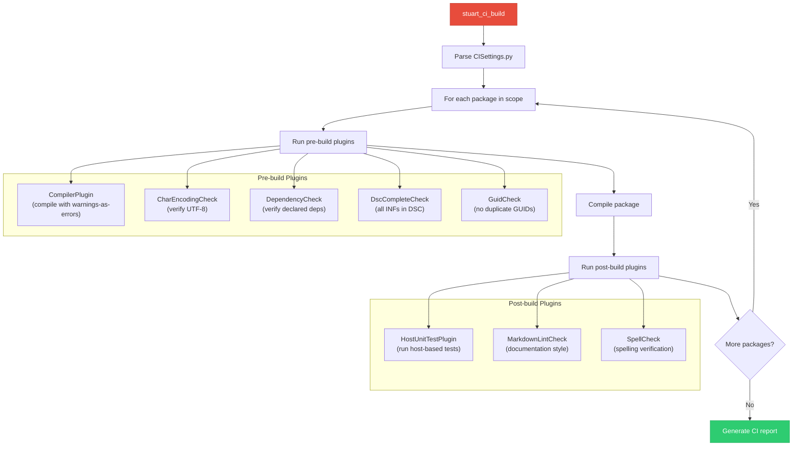
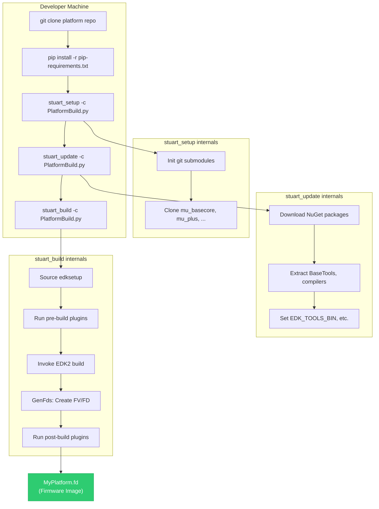

# Chapter 5: Stuart Build System
{: .no_toc }

Master the Python-based build orchestration system that replaces ad-hoc EDK2 build scripts with a repeatable, cross-platform, CI-friendly workflow.
{: .fs-6 .fw-300 }

<details open markdown="block">
  <summary>
    Table of contents
  </summary>
  {: .text-delta }
1. TOC
{:toc}
</details>

---

## Learning Objectives

After completing this chapter, you will be able to:
- Explain what stuart is and why it replaces traditional EDK2 build scripts
- Run the complete stuart workflow: `stuart_setup`, `stuart_update`, `stuart_build`
- Write and customize `PlatformBuild.py` and `CISettings.py` settings files
- Use `stuart_ci_build` for continuous integration validation
- Interpret build output and diagnose common build failures
- Configure build profiles, targets, and architecture flags

## What Is Stuart?

Stuart is Project Mu's **Python-based build orchestration system**. It is distributed as a collection of pip packages under the `edk2-pytool-extensions` and `edk2-pytool-library` projects. Stuart does not replace the underlying EDK2 `build` tool --- instead, it wraps it with a higher-level workflow that manages:

- **Environment setup**: Verifying that compilers, assemblers, and other tools are installed and accessible
- **Dependency resolution**: Downloading NuGet packages, syncing Git submodules, and verifying ext_dep files
- **Build invocation**: Calling EDK2's `build` command with the correct arguments, environment variables, and paths
- **CI validation**: Running code analysis plugins, compiler warnings-as-errors, and compliance checks
- **Reporting**: Structured output with clear error messages and build summaries

### Stuart vs. Traditional EDK2 Build Scripts

In a vanilla EDK2 workflow, building firmware typically involves:

```bash
# Traditional EDK2 workflow
source edksetup.sh           # Set up environment (Unix)
# or edksetup.bat             # (Windows)
build -p MyPkg/MyPkg.dsc \
      -t GCC5 \
      -a X64 \
      -b DEBUG
```

This requires manual environment setup, manually managing tool paths, and custom shell scripts for each platform. Stuart replaces this with:

```bash
# Stuart workflow
stuart_setup -c PlatformBuild.py    # One-time: clone submodules
stuart_update -c PlatformBuild.py   # Sync dependencies
stuart_build -c PlatformBuild.py    # Build firmware
```

The settings file (`PlatformBuild.py`) captures all the platform-specific configuration in Python, making builds fully reproducible across developers and CI systems.

### The Stuart Package Ecosystem

Stuart is composed of several Python packages:

| Package | Purpose |
|:--------|:--------|
| `edk2-pytool-library` | Core library: UEFI data types, parsers (DSC, FDF, INF), path utilities |
| `edk2-pytool-extensions` | Build orchestration: stuart commands, environment management, plugin system |
| `edk2-basetools` | Python-wrapped EDK2 BaseTools (`build`, `GenFds`, `GenFw`, etc.) |

Install them all with:

```bash
pip install edk2-pytool-library edk2-pytool-extensions edk2-basetools
```

Or, more commonly, install from a platform's `pip-requirements.txt`:

```bash
pip install -r pip-requirements.txt
```

## The Stuart Workflow

The stuart workflow consists of three sequential steps. Each step must complete successfully before the next can run.



### Step 1: stuart_setup

`stuart_setup` performs one-time workspace initialization:

1. Reads the settings file to determine which Git submodules are required
2. Initializes and clones the submodules
3. Validates that the workspace structure matches expectations

```bash
stuart_setup -c Platform/MyPlatform/PlatformBuild.py
```

**When to run**: After a fresh `git clone`, or when a new submodule has been added to the project.

**What it does internally**:


Common flags:

| Flag | Purpose |
|:-----|:--------|
| `-c FILE` | Path to settings file (required) |
| `--force` | Force re-initialization even if submodules exist |
| `--omnicache DIR` | Use a local Git cache to speed up clones |
| `-v` | Verbose output |

{: .tip }
> The `--omnicache` flag is extremely useful in CI environments. An omnicache is a local bare Git repository that caches objects from all Project Mu repos. Subsequent clones fetch from the local cache instead of GitHub, dramatically reducing setup time.

### Step 2: stuart_update

`stuart_update` synchronizes all external dependencies:

1. Reads all `ext_dep` JSON files in the workspace
2. Downloads NuGet packages to a local cache
3. Extracts packages to the expected locations
4. Sets environment variables (e.g., `EDK_TOOLS_BIN`) as declared by ext_deps
5. Verifies that all required tools are accessible

```bash
stuart_update -c Platform/MyPlatform/PlatformBuild.py
```

**When to run**: After `stuart_setup`, after pulling new changes that modify ext_dep files, or after changing release branches.

**What it does internally**:



{: .note }
> `stuart_update` creates `ext_dep` directories alongside the JSON descriptor files. These directories are typically in `.gitignore` since their contents are reproducibly downloaded. Never check fetched ext_dep contents into source control.

### Step 3: stuart_build

`stuart_build` performs the actual firmware build:

1. Reads the settings file for build configuration
2. Sets up the EDK2 build environment (equivalent to `edksetup.sh`)
3. Runs any pre-build plugins
4. Invokes the EDK2 `build` command with the configured parameters
5. Runs any post-build plugins
6. Reports build results

```bash
stuart_build -c Platform/MyPlatform/PlatformBuild.py
```

Common flags:

| Flag | Purpose |
|:-----|:--------|
| `-c FILE` | Path to settings file (required) |
| `TARGET=DEBUG` | Build target: `DEBUG`, `RELEASE`, or `NOOPT` |
| `TOOL_CHAIN_TAG=GCC5` | Compiler toolchain to use |
| `MAX_CONCURRENT_THREAD_NUMBER=8` | Parallel build threads |
| `BLD_*_MY_FEATURE=TRUE` | Custom build flags (passed to DSC as defines) |
| `--FlashOnly` | Skip build, only run flash/post-build steps |
| `--SkipPostBuild` | Skip post-build plugins |
| `--clean` | Clean build (delete Build directory first) |

**Build targets**:

| Target | Optimization | Debug Output | Assertions | Use Case |
|:-------|:-------------|:-------------|:-----------|:---------|
| `DEBUG` | None (`-O0`) | Full | Enabled | Development, debugging |
| `RELEASE` | Full (`-Os`) | Minimal | Disabled | Production images |
| `NOOPT` | None (`-O0`) | Full | Enabled | Source-level debugging (best for GDB/WinDbg) |

## Settings Files

Stuart uses Python settings files to configure the build. There are two main types:

### PlatformBuild.py

This file defines how to build a complete firmware image for a specific platform. It inherits from `UefiBuilder` and implements several required methods:

```python
import os
from edk2toolext.invocables.edk2_platform_build import UefiBuilder
from edk2toolext.invocables.edk2_setup import SetupSettingsManager
from edk2toolext.invocables.edk2_update import UpdateSettingsManager


class PlatformBuilder(UefiBuilder, SetupSettingsManager, UpdateSettingsManager):
    """Build settings for MyPlatform."""

    def GetWorkspaceRoot(self):
        """Return the root directory of the workspace."""
        return os.path.dirname(os.path.dirname(
            os.path.dirname(os.path.abspath(__file__))
        ))

    def GetActiveScopes(self):
        """Return scopes that determine which ext_deps are active."""
        return ("myplatform", "global")

    def GetRequiredSubmodules(self):
        """Return list of Git submodules needed for this platform."""
        return [
            RequiredSubmodule("MU_BASECORE"),
            RequiredSubmodule("Common/MU_TIANO"),
            RequiredSubmodule("Common/MU_PLUS"),
            RequiredSubmodule("Silicon/ARM/MU_SILICON_ARM"),
        ]

    def GetPackagesPath(self):
        """Return list of paths to search for UEFI packages."""
        ws = self.GetWorkspaceRoot()
        return [
            os.path.join(ws, "MU_BASECORE"),
            os.path.join(ws, "Common", "MU_TIANO"),
            os.path.join(ws, "Common", "MU_PLUS"),
            os.path.join(ws, "Silicon", "ARM", "MU_SILICON_ARM"),
        ]

    def GetPackagesSupported(self):
        """Return list of packages this platform builds."""
        return ["MyPlatformPkg"]

    def GetArchitecturesSupported(self):
        """Return target architectures."""
        return ["AARCH64"]

    def GetTargetsSupported(self):
        """Return supported build targets."""
        return ["DEBUG", "RELEASE", "NOOPT"]

    def GetDscName(self):
        """Return path to the platform DSC file."""
        return "Platform/MyPlatform/MyPlatformPkg.dsc"

    def GetFdfName(self):
        """Return path to the platform FDF file."""
        return "Platform/MyPlatform/MyPlatformPkg.fdf"

    def SetPlatformEnv(self):
        """Set platform-specific environment variables."""
        self.env.SetValue("ACTIVE_PLATFORM", self.GetDscName(),
                          "Platform Hardcoded")
        self.env.SetValue("TARGET_ARCH", "AARCH64",
                          "Platform Hardcoded")
        self.env.SetValue("TOOL_CHAIN_TAG", "GCC5",
                          "Platform Default")
        return 0

    def PlatformPreBuild(self):
        """Run before the EDK2 build. Return 0 for success."""
        return 0

    def PlatformPostBuild(self):
        """Run after the EDK2 build. Return 0 for success."""
        return 0

    def PlatformFlashImage(self):
        """Flash the built image to hardware (or launch QEMU)."""
        return 0
```

Key methods explained:

| Method | Purpose |
|:-------|:--------|
| `GetWorkspaceRoot()` | Returns the top-level directory of the workspace |
| `GetActiveScopes()` | Controls which ext_dep packages are fetched |
| `GetRequiredSubmodules()` | Lists Git submodules to initialize during setup |
| `GetPackagesPath()` | Equivalent to `PACKAGES_PATH` --- where to find UEFI packages |
| `SetPlatformEnv()` | Sets build environment variables (target arch, toolchain, etc.) |
| `PlatformPreBuild()` | Hook for pre-build tasks (code generation, config validation) |
| `PlatformPostBuild()` | Hook for post-build tasks (image signing, packaging) |
| `PlatformFlashImage()` | Hook for flashing the image (or launching QEMU for virtual platforms) |

### CISettings.py

This file defines how to run CI validation on a set of packages. It inherits from `CiBuildSettingsManager`:

```python
from edk2toolext.invocables.edk2_ci_build import CiBuildSettingsManager
from edk2toolext.invocables.edk2_ci_setup import CiSetupSettingsManager


class CISettings(CiBuildSettingsManager, CiSetupSettingsManager):
    """CI build settings for validating packages."""

    def GetWorkspaceRoot(self):
        return os.path.dirname(os.path.dirname(
            os.path.abspath(__file__)
        ))

    def GetActiveScopes(self):
        return ("cibuild", "global")

    def GetRequiredSubmodules(self):
        return [
            RequiredSubmodule("MU_BASECORE"),
            RequiredSubmodule("Common/MU_TIANO"),
            RequiredSubmodule("Common/MU_PLUS"),
        ]

    def GetPackagesPath(self):
        ws = self.GetWorkspaceRoot()
        return [
            os.path.join(ws, "MU_BASECORE"),
            os.path.join(ws, "Common", "MU_TIANO"),
            os.path.join(ws, "Common", "MU_PLUS"),
        ]

    def GetPackagesSupported(self):
        return [
            "MyPlatformPkg",
            "MyCommonPkg",
        ]

    def GetArchitecturesSupported(self):
        return ["IA32", "X64", "AARCH64"]

    def GetTargetsSupported(self):
        return ["DEBUG", "RELEASE", "NOOPT"]

    def GetDependencies(self):
        """Return additional pip dependencies needed for CI."""
        return [
            {"Path": "MU_BASECORE", "Url": "https://github.com/microsoft/mu_basecore.git"},
        ]
```

The key difference from `PlatformBuild.py`: `CISettings.py` is designed to validate individual packages (compilation, code style, documentation) rather than produce a complete firmware image.

## Stuart CI Build

`stuart_ci_build` is a specialized invocation designed for continuous integration. It builds each package independently and runs a suite of validation plugins:

```bash
stuart_ci_build -c CISettings.py \
    -p MyPlatformPkg \
    -t DEBUG \
    -a X64
```

### CI Build Workflow



### CI Plugin Configuration

Each package can configure CI plugins through a `ci.yaml` file in the package root:

```yaml
## @file ci.yaml
## CI configuration for MyPlatformPkg
##
{
    "CompilerPlugin": {
        "DscPath": "MyPlatformPkg.dsc"
    },
    "CharEncodingCheck": {
        "IgnoreFiles": [
            "Binaries/**"
        ]
    },
    "DependencyCheck": {
        "AcceptableDependencies": [
            "MdePkg/MdePkg.dec",
            "MdeModulePkg/MdeModulePkg.dec",
            "MsCorePkg/MsCorePkg.dec"
        ]
    },
    "DscCompleteCheck": {
        "DscPath": "MyPlatformPkg.dsc",
        "IgnoreInf": [
            "TestApp/TestApp.inf"
        ]
    },
    "GuidCheck": {
        "IgnoreGuidName": [],
        "IgnoreFoldersAndFiles": [],
        "IgnoreDuplicates": []
    },
    "SpellCheck": {
        "AuditOnly": false,
        "AdditionalIncludePaths": [],
        "IgnoreFiles": [
            "Binaries/**"
        ]
    }
}
```

### Available CI Plugins

| Plugin | Checks | Severity |
|:-------|:-------|:---------|
| `CompilerPlugin` | Builds the package with warnings-as-errors enabled | Error |
| `CharEncodingCheck` | Verifies all source files are valid UTF-8 | Error |
| `DependencyCheck` | Ensures all package dependencies are declared in the DEC file | Error |
| `DscCompleteCheck` | Verifies all INF files are referenced by the package DSC | Warning |
| `GuidCheck` | Detects duplicate GUID definitions | Error |
| `LibraryClassCheck` | Validates library class declarations and implementations | Error |
| `MarkdownLintCheck` | Enforces Markdown style rules in documentation | Warning |
| `SpellCheck` | Checks spelling in source code comments and documentation | Warning |
| `HostUnitTestPlugin` | Discovers and runs host-based unit tests | Error |
| `CodeQL` | Runs CodeQL static analysis queries | Warning |
| `UncrustifyCheck` | Enforces C code formatting with Uncrustify | Warning |

## Build Profiles and Flags

Stuart supports passing custom defines that control conditional compilation in DSC files.

### Using Build Flags

Pass defines on the command line using the `BLD_*_` prefix:

```bash
# Enable a feature flag
stuart_build -c PlatformBuild.py BLD_*_ENABLE_NETWORK=TRUE

# Set a platform-specific option
stuart_build -c PlatformBuild.py BLD_*_MEMORY_SIZE=8192

# Multiple flags
stuart_build -c PlatformBuild.py \
    BLD_*_ENABLE_NETWORK=TRUE \
    BLD_*_SECURE_BOOT=TRUE \
    TARGET=RELEASE
```

The `BLD_*_` prefix is stripped before passing to the EDK2 build system. The `*` matches all build targets. You can also target specific build types:

```bash
# Only in DEBUG builds
BLD_DEBUG_ENABLE_SERIAL_LOG=TRUE

# Only in RELEASE builds
BLD_RELEASE_ENABLE_SERIAL_LOG=FALSE
```

### Consuming Build Flags in DSC Files

In your platform DSC, consume these flags with `!if` directives:

```ini
[Defines]
  DEFINE ENABLE_NETWORK = FALSE

!if $(ENABLE_NETWORK) == TRUE
  [Components]
    NetworkPkg/HttpBootDxe/HttpBootDxe.inf
    NetworkPkg/HttpDxe/HttpDxe.inf
    NetworkPkg/TlsDxe/TlsDxe.inf
!endif
```

### Setting Defaults in PlatformBuild.py

You can set default build flags programmatically:

```python
def SetPlatformEnv(self):
    self.env.SetValue("ACTIVE_PLATFORM", self.GetDscName(),
                      "Platform Hardcoded")
    # Set defaults that can be overridden from command line
    self.env.SetValue("ENABLE_NETWORK", "FALSE", "Platform Default")
    self.env.SetValue("SECURE_BOOT", "TRUE", "Platform Default")
    return 0
```

The priority order for environment values (highest to lowest):

1. Command line (`BLD_*_VAR=VALUE`)
2. `SetPlatformEnv()` with `"Platform Hardcoded"` (cannot be overridden)
3. `SetPlatformEnv()` with `"Platform Default"` (can be overridden)
4. ext_dep declarations
5. System environment variables

## Understanding Build Output

### Directory Structure

After a successful build, the output directory (`Build/`) has this structure:

```
Build/
└── MyPlatform/
    └── DEBUG_GCC5/
        ├── FV/                          # Firmware Volumes
        │   ├── FVMAIN.Fv               # Main firmware volume
        │   ├── FVMAIN_COMPACT.Fv       # Compressed firmware volume
        │   └── MYPLATFORM.fd           # Final flash descriptor
        ├── X64/                         # Architecture-specific output
        │   ├── MdeModulePkg/
        │   │   └── Universal/
        │   │       └── Variable/
        │   │           └── RuntimeDxe/
        │   │               ├── VariableRuntimeDxe.efi
        │   │               └── OUTPUT/
        │   │                   ├── VariableRuntimeDxe.map
        │   │                   └── VariableRuntimeDxe.dll
        │   └── MyPlatformPkg/
        │       └── Application/
        │           └── HelloWorld/
        │               └── HelloWorld.efi
        ├── IA32/                        # 32-bit PEI components (if applicable)
        ├── NOOPT_BUILDLOG.txt           # Build log
        └── BuildOptions.txt            # Resolved build options
```

Key output files:

| File | Purpose |
|:-----|:--------|
| `*.fd` | Flash Descriptor --- the final firmware image ready to flash or run in QEMU |
| `*.Fv` | Firmware Volume --- a container for multiple firmware files |
| `*.efi` | Individual EFI binaries (drivers, applications) |
| `*.map` | Linker map files (useful for debugging symbol resolution) |
| `*.dll` / `*.debug` | Debug binaries with symbols (for source-level debugging) |
| `BUILDLOG.txt` | Complete build log |

### Reading Build Logs

When a build fails, the build log is your primary diagnostic tool. Key sections to look for:

```
# Successful module build
Building ... MyPlatformPkg/Application/HelloWorld/HelloWorld.inf [X64]

# Compilation error
error C2065: 'UndeclaredVariable': undeclared identifier
  MyPlatformPkg/Application/HelloWorld/HelloWorld.c(42)

# Linker error
error LNK2019: unresolved external symbol MyFunction
  referenced in function UefiMain

# DSC parse error
error 4000: Instance of library class [MyLibClass] is not found
```

{: .warning }
> When you see "Instance of library class [...] is not found," it means your DSC file does not map a library class to an implementation for the module that needs it. See [Chapter 7]() for details on library class resolution.

### Build Performance

Tips for faster builds:

1. **Parallel builds**: Set `MAX_CONCURRENT_THREAD_NUMBER` to your CPU core count
2. **Incremental builds**: Stuart only rebuilds modules with changed source files
3. **Build cache**: The `Build/` directory caches intermediate objects; only use `--clean` when necessary
4. **Omnicache**: Use `--omnicache` with `stuart_setup` to cache Git objects locally
5. **NuGet cache**: Stuart caches NuGet packages in `~/.nuget/packages/`; avoid deleting this directory

## The Complete Build Pipeline

Here is the full picture of what happens when you build a firmware image:



## Troubleshooting Common Issues

### "Python package not found"

```
ModuleNotFoundError: No module named 'edk2toolext'
```

**Fix**: Ensure you have installed the pip requirements in your active virtual environment:

```bash
python -m venv .venv
source .venv/bin/activate   # Linux/macOS
pip install -r pip-requirements.txt
```

### "Submodule not initialized"

```
error: could not find required submodule MU_BASECORE
```

**Fix**: Run `stuart_setup` before `stuart_update` or `stuart_build`:

```bash
stuart_setup -c PlatformBuild.py
```

### "NuGet package download failed"

```
ERROR - Failed to download mu-basetools 2023.11.0
```

**Fix**: Check network connectivity and NuGet feed access. If behind a proxy, configure pip and NuGet proxy settings. You can also manually download the package and place it in `~/.nuget/packages/`.

### "Library class not found"

```
error 4000: Instance of library class [DebugLib] is not found
```

**Fix**: Your DSC file is missing a library class mapping. Add the appropriate `DebugLib` implementation in the `[LibraryClasses]` section of your DSC. See [Chapter 7]().

### "Tool not found: nasm"

```
ERROR - Tool nasm is not on the path
```

**Fix**: Run `stuart_update` to download tool NuGet packages, or install `nasm` manually and ensure it is on your `PATH`.

## Key Takeaways

- Stuart is a Python-based build orchestration layer over the EDK2 build system, providing repeatable, cross-platform firmware builds
- The three-step workflow --- `stuart_setup`, `stuart_update`, `stuart_build` --- replaces ad-hoc shell scripts with a standardized process
- `PlatformBuild.py` defines platform-specific build configuration; `CISettings.py` defines CI validation settings
- `stuart_ci_build` runs compilation plus a suite of code quality plugins for continuous integration
- Build flags use the `BLD_*_` prefix on the command line and map to `DEFINE` values in DSC files
- Build output lands in `Build/<Platform>/<Target>_<Toolchain>/` with firmware volumes, EFI binaries, and debug symbols

## Next Steps

Continue to [Chapter 6: Dependency Management]() to learn how Project Mu resolves pip packages, NuGet binaries, Git submodules, and third-party libraries.
