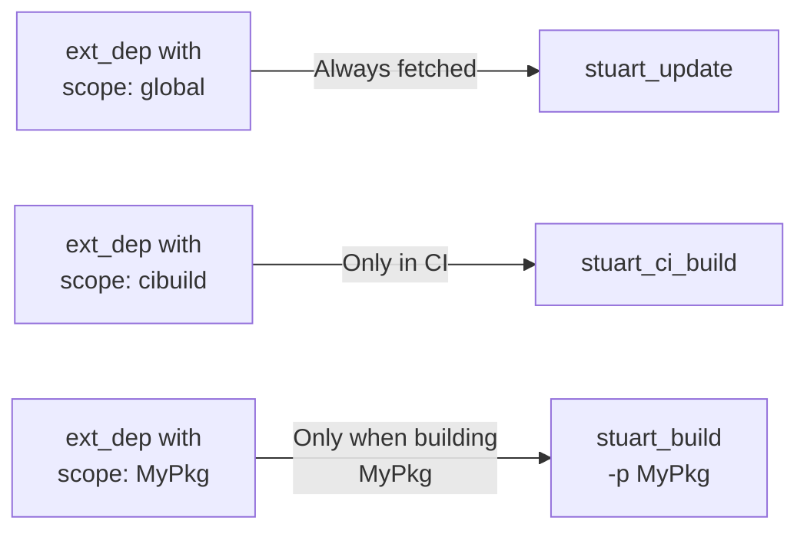
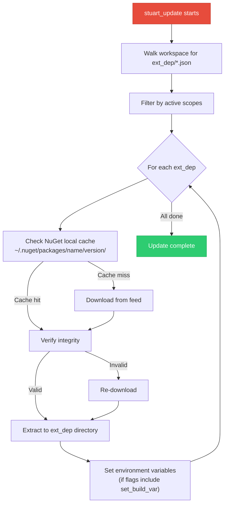
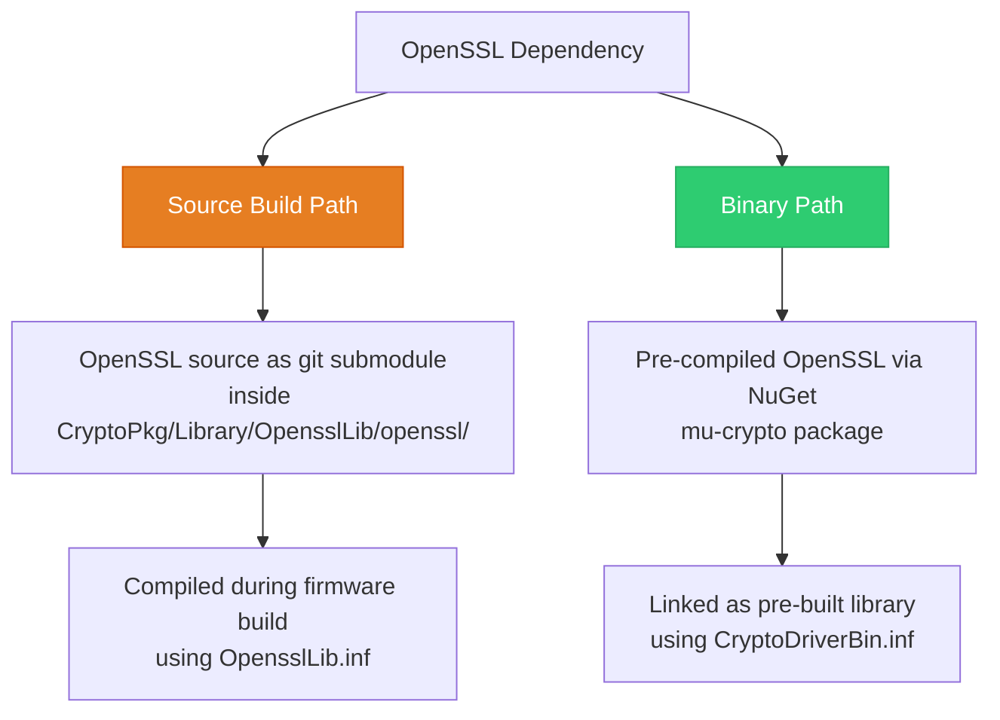
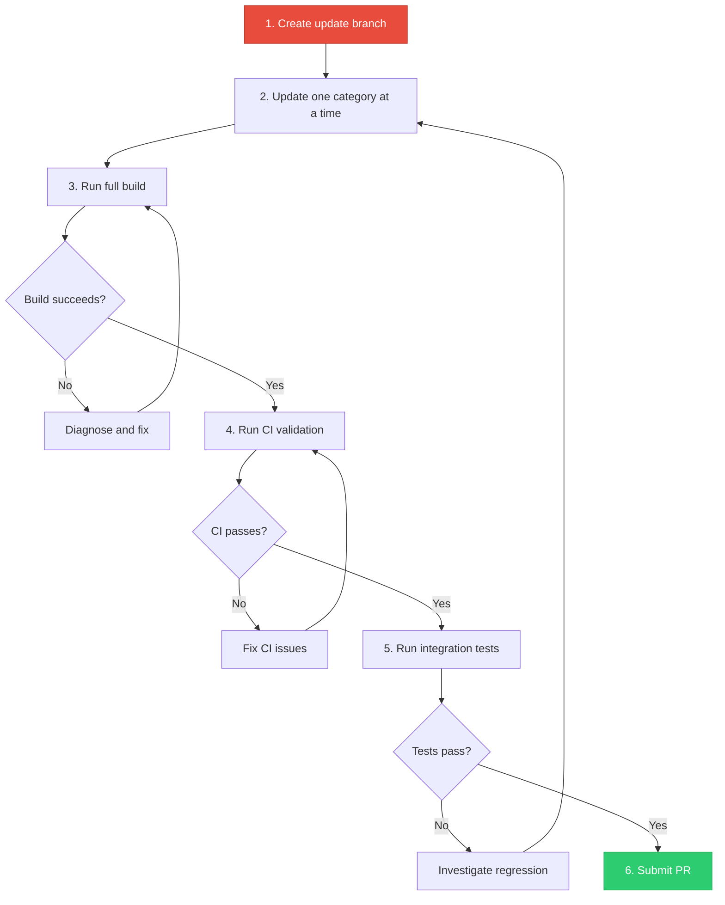

# Chapter 6: Dependency Management
{: .no_toc }

How Project Mu resolves, pins, and updates the pip packages, NuGet binaries, Git submodules, and third-party libraries that a firmware build depends on.
{: .fs-6 .fw-300 }

<details open markdown="block">
  <summary>
    Table of contents
  </summary>
  {: .text-delta }
1. TOC
{:toc}
</details>

---

## Learning Objectives

After completing this chapter, you will be able to:
- Identify the four categories of dependencies in a Project Mu workspace
- Configure pip requirements for Stuart and build tools
- Declare and consume NuGet external dependencies
- Manage Git submodules for source-level dependencies
- Handle third-party libraries such as OpenSSL
- Update dependencies safely without breaking your build

## Dependency Categories

A Project Mu platform build depends on four distinct categories of external resources. Each category uses a different resolution mechanism:

```mermaid
flowchart TD
    Platform["Platform Build"]

    subgraph "Python (pip)"
        PIP1["edk2-pytool-extensions"]
        PIP2["edk2-pytool-library"]
        PIP3["edk2-basetools"]
    end

    subgraph "Binary (NuGet)"
        NU1["mu-basetools"]
        NU2["mu_nasm"]
        NU3["mu_iasl"]
        NU4["mu-crypto"]
    end

    subgraph "Source (Git Submodules)"
        GIT1["mu_basecore"]
        GIT2["mu_tiano_plus"]
        GIT3["mu_plus"]
        GIT4["mu_silicon_*"]
    end

    subgraph "Third-Party (Vendored)"
        EXT1["OpenSSL"]
        EXT2["mbedTLS"]
        EXT3["GoogleTest"]
    end

    Platform --> PIP1 & PIP2 & PIP3
    Platform --> NU1 & NU2 & NU3 & NU4
    Platform --> GIT1 & GIT2 & GIT3 & GIT4
    Platform --> EXT1 & EXT2 & EXT3

    style Platform fill:#e74c3c,stroke:#c0392b,color:#fff
    style PIP1 fill:#3498db,stroke:#2980b9,color:#fff
    style PIP2 fill:#3498db,stroke:#2980b9,color:#fff
    style PIP3 fill:#3498db,stroke:#2980b9,color:#fff
    style NU1 fill:#e67e22,stroke:#d35400,color:#fff
    style NU2 fill:#e67e22,stroke:#d35400,color:#fff
    style NU3 fill:#e67e22,stroke:#d35400,color:#fff
    style NU4 fill:#e67e22,stroke:#d35400,color:#fff
    style GIT1 fill:#2ecc71,stroke:#27ae60,color:#fff
    style GIT2 fill:#2ecc71,stroke:#27ae60,color:#fff
    style GIT3 fill:#2ecc71,stroke:#27ae60,color:#fff
    style GIT4 fill:#2ecc71,stroke:#27ae60,color:#fff
    style EXT1 fill:#9b59b6,stroke:#8e44ad,color:#fff
    style EXT2 fill:#9b59b6,stroke:#8e44ad,color:#fff
    style EXT3 fill:#9b59b6,stroke:#8e44ad,color:#fff
```



## Python (pip) Dependencies

### What They Provide

Python packages provide the build orchestration layer itself. Without them, you cannot run any `stuart_*` commands. The key packages are:

| Package | Purpose | Typical Version |
|:--------|:--------|:----------------|
| `edk2-pytool-extensions` | Stuart commands (`stuart_setup`, `stuart_update`, `stuart_build`, `stuart_ci_build`) | `>=0.26.0` |
| `edk2-pytool-library` | UEFI data structures, parsers (DSC, INF, FDF), path utilities | `>=0.21.0` |
| `edk2-basetools` | Python-wrapped EDK2 BaseTools (`build`, `GenFds`, `GenFw`, `GenSec`, etc.) | `>=0.3.0` |

### pip-requirements.txt

Every platform repo includes a `pip-requirements.txt` at the workspace root:

```
# pip-requirements.txt
edk2-pytool-library==0.21.6
edk2-pytool-extensions==0.26.4
edk2-basetools==0.3.14
```

{: .important }
> Always use **exact version pins** (`==`) rather than minimum versions (`>=`) in your requirements file. This ensures that every developer and CI machine uses identical tool versions, eliminating "works on my machine" failures.

### Installation

```bash
# Create and activate a virtual environment (recommended)
python -m venv .venv
source .venv/bin/activate    # Linux/macOS
# .venv\Scripts\activate.bat  # Windows CMD
# .venv\Scripts\Activate.ps1  # Windows PowerShell

# Install pinned dependencies
pip install -r pip-requirements.txt
```

### Upgrading pip Dependencies

To upgrade Stuart tools:

1. Check the [edk2-pytool-extensions changelog](https://github.com/tianocore/edk2-pytool-extensions/releases) for breaking changes
2. Update version pins in `pip-requirements.txt`
3. Run `pip install -r pip-requirements.txt` to install new versions
4. Run a full build (`stuart_setup`, `stuart_update`, `stuart_build`) to verify compatibility
5. Commit the updated `pip-requirements.txt`

{: .warning }
> Never run `pip install --upgrade edk2-pytool-extensions` without also updating `pip-requirements.txt`. This creates a version mismatch between your local environment and what other developers or CI will install.

## NuGet Binary Dependencies

### What They Provide

NuGet packages distribute pre-built binaries that would be complex or time-consuming to build from source. In the Project Mu ecosystem, NuGet provides:

- **Build tools**: Compiled EDK2 BaseTools binaries (`build.exe`, `GenFds`, `GenFw`)
- **Assemblers**: NASM assembler for UEFI assembly code
- **Compilers**: Intel ASL compiler (`iasl`) for ACPI table compilation
- **Cryptographic libraries**: Pre-compiled OpenSSL or mbedTLS libraries
- **Cross-compilers**: GCC cross-compilers for ARM/AARCH64 targets

### ext_dep JSON Files

NuGet dependencies are declared using `ext_dep` descriptor files placed alongside the code that needs them. Each file is a JSON document:

```json
{
    "scope": "global",
    "type": "nuget",
    "name": "mu-basetools",
    "source": "https://pkgs.dev.azure.com/projectmu/mu/_packaging/Mu-Public/nuget/v3/index.json",
    "version": "2023.11.0",
    "flags": ["set_build_var"],
    "var_name": "EDK_TOOLS_BIN"
}
```

#### Field Reference

| Field | Required | Description |
|:------|:---------|:------------|
| `scope` | Yes | When to fetch: `"global"` (always), `"cibuild"` (CI only), or a package name |
| `type` | Yes | Dependency type: `"nuget"`, `"git"`, or `"web"` |
| `name` | Yes | Package identifier on the NuGet feed |
| `source` | Yes | URL of the NuGet feed |
| `version` | Yes | Exact version to download |
| `flags` | No | Array of flags: `"set_build_var"`, `"set_path"`, `"host_specific"` |
| `var_name` | No | Environment variable to set after extraction (used with `set_build_var`) |
| `id` | No | Override the directory name where the package is extracted |
| `internal_path` | No | Subdirectory within the package to use |
| `compression_type` | No | For `"web"` type: `"tar"`, `"zip"` |
| `sha256` | No | SHA-256 hash for integrity verification |

#### Scope Values

The `scope` field controls when a dependency is fetched:



- `"global"` --- Fetched by every `stuart_update` invocation (use for tools needed by all builds)
- `"cibuild"` --- Only fetched during CI validation (use for linters, static analyzers)
- `"<PackageName>"` --- Only fetched when building that specific package

### NuGet Feed Configuration

Project Mu uses Azure DevOps Artifacts for its public NuGet feed:

```
https://pkgs.dev.azure.com/projectmu/mu/_packaging/Mu-Public/nuget/v3/index.json
```

For private or corporate feeds, configure a `nuget.config` file at the workspace root:

```xml
<?xml version="1.0" encoding="utf-8"?>
<configuration>
  <packageSources>
    <clear />
    <add key="Project Mu Public"
         value="https://pkgs.dev.azure.com/projectmu/mu/_packaging/Mu-Public/nuget/v3/index.json" />
    <add key="Corporate Feed"
         value="https://pkgs.dev.azure.com/mycompany/_packaging/FirmwareTools/nuget/v3/index.json" />
  </packageSources>
</configuration>
```

### How stuart_update Resolves NuGet Packages



### ext_dep Directory Layout

After `stuart_update`, each ext_dep JSON file has a corresponding directory:

```
MyPlatformPkg/
├── mu_basetools_ext_dep.json     # Descriptor
├── mu_basetools_ext_dep/         # Extracted content (gitignored)
│   ├── build.exe
│   ├── GenFds.exe
│   └── ...
├── nasm_ext_dep.json
└── nasm_ext_dep/
    └── nasm.exe
```

{: .note }
> The extracted `*_ext_dep/` directories should be listed in `.gitignore`. They are ephemeral and fully reproducible from the JSON descriptors via `stuart_update`.

## Git Submodule Dependencies

### What They Provide

Git submodules provide source-level dependencies --- the actual UEFI packages (C source code, headers, INF/DSC/DEC files) that your platform compiles against. These are the Project Mu repositories described in [Chapter 4]().

### Declaring Submodules

Submodules are declared in two places:

1. **`.gitmodules`** --- Standard Git submodule configuration:

```ini
[submodule "MU_BASECORE"]
    path = MU_BASECORE
    url = https://github.com/microsoft/mu_basecore.git
    branch = release/202311

[submodule "Common/MU_TIANO"]
    path = Common/MU_TIANO
    url = https://github.com/microsoft/mu_tiano_plus.git
    branch = release/202311
```

2. **`GetRequiredSubmodules()`** in your settings file --- Tells stuart which submodules to initialize:

```python
def GetRequiredSubmodules(self):
    return [
        RequiredSubmodule("MU_BASECORE"),
        RequiredSubmodule("Common/MU_TIANO"),
        RequiredSubmodule("Common/MU_PLUS"),
        RequiredSubmodule("Silicon/ARM/MU_SILICON_ARM"),
    ]
```

### Version Pinning Strategies

There are two approaches to pinning submodule versions:

**Branch tracking** (development):
```ini
[submodule "MU_BASECORE"]
    path = MU_BASECORE
    url = https://github.com/microsoft/mu_basecore.git
    branch = release/202311
```

The submodule tracks the tip of the specified branch. Running `git submodule update --remote` pulls the latest commit on that branch.

**Commit pinning** (production):
```bash
cd MU_BASECORE
git checkout abc123def456   # Specific known-good commit
cd ..
git add MU_BASECORE
git commit -m "Pin MU_BASECORE to abc123def456"
```

The submodule is locked to an exact commit hash, regardless of branch. This is the recommended approach for production builds because it provides complete reproducibility.

{: .tip }
> Use branch tracking during active development to stay current with upstream fixes. Switch to commit pinning before production releases to lock down the exact code being shipped.

### Recursive Submodules

Some Project Mu repos have their own submodules (for example, `mu_basecore` may include OpenSSL as a submodule of `CryptoPkg`). Stuart handles recursive initialization automatically, but if you need to do it manually:

```bash
git submodule update --init --recursive
```

## Third-Party Libraries

### OpenSSL

OpenSSL is the most significant third-party dependency in UEFI firmware. It provides the cryptographic primitives needed for Secure Boot, authenticated variables, TLS, and HTTPS Boot.

#### How OpenSSL Is Integrated

In Project Mu, OpenSSL integration follows one of two paths:



The **binary path** is preferred in Project Mu because:
- It eliminates the long OpenSSL compilation time
- It ensures all platforms use an identical, tested cryptographic library
- The `mu_crypto_release` repository handles building, testing, and publishing the binaries

#### OpenSSL Version Management

The OpenSSL version is controlled by the `mu_crypto_release` build pipeline:

1. The pipeline checks out a specific OpenSSL release tag
2. It compiles OpenSSL for all supported architectures (IA32, X64, AARCH64)
3. The resulting binaries are packaged and published to the NuGet feed
4. Platform repos consume the NuGet package via an ext_dep

To check which OpenSSL version your platform uses:

```bash
# Look at the mu-crypto ext_dep
cat MU_BASECORE/CryptoPkg/Driver/Bin/mu_crypto_ext_dep.json
```

### GoogleTest

Project Mu uses GoogleTest for host-based unit testing. It is typically included as a submodule:

```
MU_BASECORE/UnitTestFrameworkPkg/Library/GoogleTestLib/googletest/
```

Or as a NuGet ext_dep for pre-built binaries. The `HostUnitTestPlugin` in `stuart_ci_build` discovers and runs GoogleTest-based tests automatically.

### mbedTLS

Some platforms use mbedTLS as a lighter-weight alternative to OpenSSL. When present, it follows the same pattern --- either as a source submodule or as a NuGet binary.

## Updating Dependencies Safely

Updating dependencies in a firmware project carries risk: a bad update can break your build, introduce security vulnerabilities, or cause subtle runtime failures. Follow this process:

### Step-by-Step Update Process



### Updating Git Submodules

```bash
# 1. Create an update branch
git checkout -b update-mu-basecore-202405

# 2. Update the submodule to the new release
cd MU_BASECORE
git fetch origin
git checkout release/202405
cd ..

# 3. Stage the submodule pointer change
git add MU_BASECORE

# 4. Update other submodules to matching release if needed
cd Common/MU_TIANO
git fetch origin
git checkout release/202405
cd ../..
git add Common/MU_TIANO

# 5. Run the full build
stuart_setup -c Platform/MyPlatform/PlatformBuild.py
stuart_update -c Platform/MyPlatform/PlatformBuild.py
stuart_build -c Platform/MyPlatform/PlatformBuild.py

# 6. Commit and submit PR if build succeeds
git commit -m "Update mu_basecore and mu_tiano_plus to release/202405"
```

{: .important }
> Always update related submodules together. The `mu_basecore` and `mu_tiano_plus` repositories are released in lockstep --- mixing versions from different release branches will almost certainly cause build failures.

### Updating NuGet ext_deps

```bash
# 1. Edit the ext_dep JSON file
# Change "version": "2023.11.0" to "version": "2024.05.0"
# in the appropriate ext_dep JSON file

# 2. Delete the old extracted directory
rm -rf mu_basetools_ext_dep/

# 3. Re-run stuart_update to fetch the new version
stuart_update -c Platform/MyPlatform/PlatformBuild.py

# 4. Build and test
stuart_build -c Platform/MyPlatform/PlatformBuild.py
```

### Updating pip Requirements

```bash
# 1. Update version pins in pip-requirements.txt
# edk2-pytool-extensions==0.26.4  ->  edk2-pytool-extensions==0.27.0

# 2. Install new versions
pip install -r pip-requirements.txt

# 3. Run full workflow to verify compatibility
stuart_setup -c Platform/MyPlatform/PlatformBuild.py
stuart_update -c Platform/MyPlatform/PlatformBuild.py
stuart_build -c Platform/MyPlatform/PlatformBuild.py
```

### Version Compatibility Matrix

When updating, ensure all components are from compatible releases:

| Component | Release 202311 | Release 202405 |
|:----------|:---------------|:---------------|
| `mu_basecore` | `release/202311` | `release/202405` |
| `mu_tiano_plus` | `release/202311` | `release/202405` |
| `mu_plus` | `release/202311` | `release/202405` |
| `mu-basetools` (NuGet) | `2023.11.x` | `2024.05.x` |
| `edk2-pytool-extensions` (pip) | `0.26.x` | `0.27.x` |

{: .note }
> Project Mu publishes release notes for each release branch that document the required versions of all dependencies. Always consult the release notes before upgrading.

## Dependency Lockfiles and Reproducibility

For maximum reproducibility, a production platform should have:

1. **`pip-requirements.txt`** with exact version pins for all Python packages
2. **`.gitmodules`** with submodules pinned to exact commit hashes
3. **`ext_dep` JSON files** with exact NuGet package versions
4. **`nuget.config`** specifying the exact NuGet feed URLs

Together, these four files form a complete "lockfile" for the firmware build. Anyone with the same files, the same Python version, and the same operating system will produce an identical build environment.

## Key Takeaways

- Project Mu manages four categories of dependencies: pip packages (build tools), NuGet packages (pre-built binaries), Git submodules (source code), and third-party libraries (OpenSSL, GoogleTest)
- Pip dependencies are pinned in `pip-requirements.txt` with exact versions
- NuGet dependencies are declared in `ext_dep` JSON files and downloaded by `stuart_update`
- Git submodules should be pinned to specific commits for production builds
- OpenSSL is preferably consumed as a pre-built NuGet binary rather than compiled from source
- Always update related dependencies together and verify with a full build-and-test cycle

## Next Steps

Continue to [Chapter 7: Platform DSC/FDF Organization]() to learn how platform description and flash description files are structured in a multi-repo Project Mu environment.
