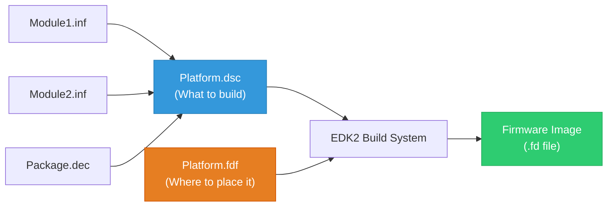
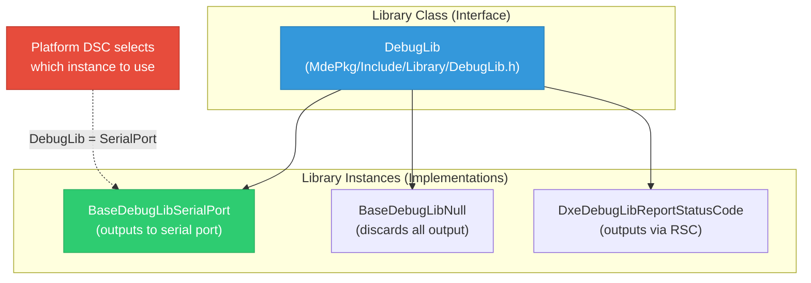
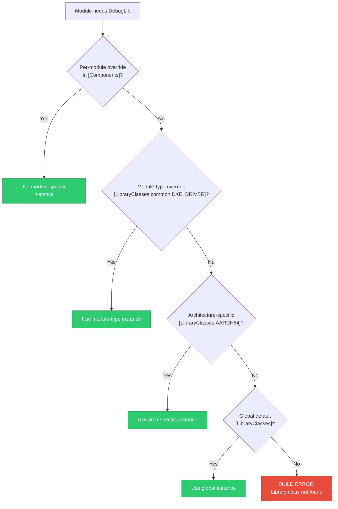
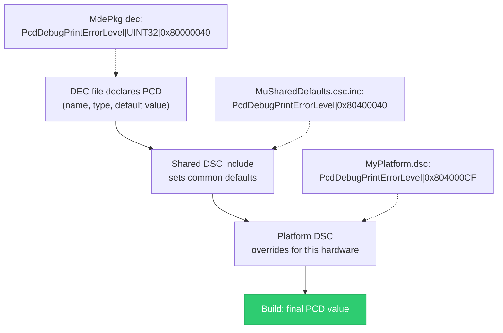
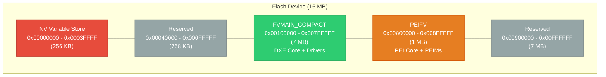

# Chapter 7: Platform DSC/FDF Organization
{: .no_toc }

How platform description (DSC) and flash description (FDF) files are structured in Project Mu's multi-repo architecture, including library class resolution, PCD layering, and shared versus platform-specific includes.
{: .fs-6 .fw-300 }

<details open markdown="block">
  <summary>
    Table of contents
  </summary>
  {: .text-delta }
1. TOC
{:toc}
</details>

---

## Learning Objectives

After completing this chapter, you will be able to:
- Describe the purpose and structure of DSC and FDF files
- Explain how library class resolution works in a multi-repo context
- Use library class overrides at the module, section, and platform level
- Configure PCDs (Platform Configuration Database) entries for your platform
- Organize shared and platform-specific DSC includes
- Identify key differences from vanilla EDK2 DSC/FDF conventions

## DSC and FDF Overview

UEFI firmware builds are driven by two primary configuration files:

| File | Full Name | Purpose |
|:-----|:----------|:--------|
| `.dsc` | Platform Description File | Defines **what** to build: which modules, which libraries, which PCDs, and how they are configured |
| `.fdf` | Flash Description File | Defines **where** to place built modules: flash layout, firmware volume structure, and region assignments |



## DSC File Structure

A DSC file is divided into sections, each controlling a different aspect of the build. Here is the anatomy of a typical Project Mu platform DSC:

### Section Overview

```ini
## @file
## MyPlatformPkg.dsc
## Platform description file for My Platform
##

[Defines]
  # Build system metadata
  PLATFORM_NAME           = MyPlatform
  PLATFORM_GUID           = 12345678-ABCD-EF01-2345-6789ABCDEF01
  PLATFORM_VERSION        = 1.0
  DSC_SPECIFICATION       = 0x0001001C
  OUTPUT_DIRECTORY        = Build/MyPlatform
  SUPPORTED_ARCHITECTURES = AARCH64    # or IA32|X64 for Intel/AMD platforms
  BUILD_TARGETS           = DEBUG|RELEASE|NOOPT
  SKUID_IDENTIFIER        = DEFAULT

  # Custom defines for conditional compilation
  DEFINE ENABLE_NETWORK   = FALSE
  DEFINE SECURE_BOOT      = TRUE

[Packages]
  # Not commonly used in platform DSC;
  # packages are resolved via PACKAGES_PATH

[LibraryClasses]
  # Default library class implementations for all module types
  BaseLib|MdePkg/Library/BaseLib/BaseLib.inf
  BaseMemoryLib|MdePkg/Library/BaseMemoryLibRepStr/BaseMemoryLibRepStr.inf
  DebugLib|MdePkg/Library/BaseDebugLibSerialPort/BaseDebugLibSerialPort.inf
  PrintLib|MdePkg/Library/BasePrintLib/BasePrintLib.inf
  UefiLib|MdePkg/Library/UefiLib/UefiLib.inf
  # ... many more library class mappings

[LibraryClasses.common.PEIM]
  # Library overrides specific to PEI modules
  MemoryAllocationLib|MdePkg/Library/PeiMemoryAllocationLib/PeiMemoryAllocationLib.inf
  HobLib|MdePkg/Library/PeiHobLib/PeiHobLib.inf

[LibraryClasses.common.DXE_DRIVER]
  # Library overrides specific to DXE drivers
  MemoryAllocationLib|MdePkg/Library/UefiMemoryAllocationLib/UefiMemoryAllocationLib.inf
  HobLib|MdePkg/Library/DxeHobLib/DxeHobLib.inf

[LibraryClasses.common.UEFI_APPLICATION]
  # Library overrides specific to UEFI applications
  MemoryAllocationLib|MdePkg/Library/UefiMemoryAllocationLib/UefiMemoryAllocationLib.inf

[PcdsFixedAtBuild]
  # PCDs whose values are fixed at compile time
  gEfiMdePkgTokenSpaceGuid.PcdDebugPropertyMask|0x3F
  gEfiMdePkgTokenSpaceGuid.PcdDebugPrintErrorLevel|0x80400040

[PcdsDynamicDefault]
  # PCDs whose values can change at runtime
  gEfiMdeModulePkgTokenSpaceGuid.PcdConOutRow|25
  gEfiMdeModulePkgTokenSpaceGuid.PcdConOutColumn|80

[Components]
  # List of modules (drivers, applications) to build
  MdeModulePkg/Universal/Variable/RuntimeDxe/VariableRuntimeDxe.inf
  MdeModulePkg/Universal/Console/ConPlatformDxe/ConPlatformDxe.inf
  MdeModulePkg/Universal/Console/ConSplitterDxe/ConSplitterDxe.inf

  # Module with per-module library override
  MyPlatformPkg/Drivers/MyDriver/MyDriver.inf {
    <LibraryClasses>
      DebugLib|MdePkg/Library/BaseDebugLibNull/BaseDebugLibNull.inf
  }

!if $(ENABLE_NETWORK) == TRUE
  [Components]
    NetworkPkg/HttpBootDxe/HttpBootDxe.inf
    NetworkPkg/HttpDxe/HttpDxe.inf
!endif

[BuildOptions]
  # Compiler flags applied globally
  GCC:*_*_*_CC_FLAGS = -Wno-unused-variable
  MSFT:*_*_*_CC_FLAGS = /wd4201
```

### The [Defines] Section

The `[Defines]` section establishes platform identity and build parameters:

| Key | Purpose | Example |
|:----|:--------|:--------|
| `PLATFORM_NAME` | Human-readable platform name | `MyPlatform` |
| `PLATFORM_GUID` | Unique GUID for this platform | `12345678-...` |
| `OUTPUT_DIRECTORY` | Where build output goes | `Build/MyPlatform` |
| `SUPPORTED_ARCHITECTURES` | Target CPU architectures | `IA32|X64|AARCH64` |
| `BUILD_TARGETS` | Allowed build targets | `DEBUG|RELEASE|NOOPT` |
| `SKUID_IDENTIFIER` | SKU variant (for multi-SKU platforms) | `DEFAULT` |
| `DEFINE` | Custom preprocessor defines | `ENABLE_NETWORK = FALSE` |

## Library Class Resolution

Library class resolution is one of the most important --- and most confusing --- aspects of UEFI DSC files. Understanding it thoroughly is essential for working with Project Mu.

### What Are Library Classes?

A **library class** is an abstract interface defined by a header file. A **library instance** is a concrete implementation of that interface. The DSC file maps each library class to an instance, allowing the same driver to be compiled against different implementations on different platforms.



### Resolution Priority

When the build system needs to resolve a library class for a specific module, it checks in this order:



**Priority order** (highest to lowest):

1. **Per-module override**: Specified inside `{ <LibraryClasses> ... }` for a specific INF in `[Components]`
2. **Module-type section**: `[LibraryClasses.common.DXE_DRIVER]` applies to all DXE drivers
3. **Architecture section**: `[LibraryClasses.AARCH64]` applies to all AARCH64 modules
4. **Global section**: `[LibraryClasses]` or `[LibraryClasses.common]` applies to everything

### Per-Module Library Overrides

You can override a library class for a single module:

```ini
[Components]
  # This module uses the serial port debug library
  MdeModulePkg/Universal/Variable/RuntimeDxe/VariableRuntimeDxe.inf

  # This module uses the null debug library (suppress debug output)
  MdeModulePkg/Universal/Acpi/AcpiTableDxe/AcpiTableDxe.inf {
    <LibraryClasses>
      DebugLib|MdePkg/Library/BaseDebugLibNull/BaseDebugLibNull.inf
  }
```

This is commonly used to:
- Suppress debug output from noisy modules
- Use a different memory allocator for performance-critical modules
- Provide a special implementation for testing

### Module-Type Library Sections

Different module types run in different execution environments and need different library implementations:

```ini
[LibraryClasses.common.SEC]
  # SEC phase: no memory services, minimal environment
  DebugLib|MdePkg/Library/BaseDebugLibSerialPort/BaseDebugLibSerialPort.inf
  ExtractGuidedSectionLib|MdePkg/Library/BaseExtractGuidedSectionLib/BaseExtractGuidedSectionLib.inf

[LibraryClasses.common.PEI_CORE]
  # PEI Core: temporary RAM, HOB-based memory
  MemoryAllocationLib|MdePkg/Library/PeiMemoryAllocationLib/PeiMemoryAllocationLib.inf
  HobLib|MdePkg/Library/PeiHobLib/PeiHobLib.inf
  ReportStatusCodeLib|MdeModulePkg/Library/PeiReportStatusCodeLib/PeiReportStatusCodeLib.inf

[LibraryClasses.common.PEIM]
  # PEI modules: similar to PEI Core
  MemoryAllocationLib|MdePkg/Library/PeiMemoryAllocationLib/PeiMemoryAllocationLib.inf
  HobLib|MdePkg/Library/PeiHobLib/PeiHobLib.inf

[LibraryClasses.common.DXE_CORE]
  # DXE Core: full memory services available
  MemoryAllocationLib|MdeModulePkg/Library/DxeCoreMemoryAllocationLib/DxeCoreMemoryAllocationLib.inf
  HobLib|MdePkg/Library/DxeCoreHobLib/DxeCoreHobLib.inf

[LibraryClasses.common.DXE_DRIVER]
  # DXE drivers: standard runtime environment
  MemoryAllocationLib|MdePkg/Library/UefiMemoryAllocationLib/UefiMemoryAllocationLib.inf
  HobLib|MdePkg/Library/DxeHobLib/DxeHobLib.inf
  UefiBootServicesTableLib|MdePkg/Library/UefiBootServicesTableLib/UefiBootServicesTableLib.inf
  UefiRuntimeServicesTableLib|MdePkg/Library/UefiRuntimeServicesTableLib/UefiRuntimeServicesTableLib.inf

[LibraryClasses.common.DXE_RUNTIME_DRIVER]
  # Runtime drivers: must function after ExitBootServices
  MemoryAllocationLib|MdePkg/Library/UefiMemoryAllocationLib/UefiMemoryAllocationLib.inf
  UefiRuntimeLib|MdePkg/Library/UefiRuntimeLib/UefiRuntimeLib.inf

[LibraryClasses.common.UEFI_APPLICATION]
  # UEFI applications (shell apps, boot managers)
  MemoryAllocationLib|MdePkg/Library/UefiMemoryAllocationLib/UefiMemoryAllocationLib.inf
  ShellLib|ShellPkg/Library/UefiShellLib/UefiShellLib.inf
```

## PCD (Platform Configuration Database) Usage

PCDs are the UEFI mechanism for platform-specific configuration values. They allow a generic driver to be customized for a specific platform without modifying its source code.

### PCD Types

| PCD Type | When Value Is Set | Can Change at Runtime | Use Case |
|:---------|:------------------|:----------------------|:---------|
| `FixedAtBuild` | Compile time | No | Constants: buffer sizes, feature flags |
| `PatchableInModule` | Compile time, patchable in binary | Post-build patching only | Values adjusted by firmware tools |
| `FeatureFlag` | Compile time | No | Boolean feature enable/disable |
| `Dynamic` | Runtime | Yes | Configuration that varies by SKU |
| `DynamicDefault` | Runtime (with compile-time default) | Yes | Runtime-configurable with safe defaults |
| `DynamicHii` | Runtime (stored in HII) | Yes | User-visible settings |
| `DynamicVpd` | Runtime (stored in VPD region) | Read-only at runtime | Factory-programmed configuration |

### Declaring PCDs in DSC

```ini
[PcdsFixedAtBuild]
  # Debug configuration
  gEfiMdePkgTokenSpaceGuid.PcdDebugPropertyMask|0x3F
  gEfiMdePkgTokenSpaceGuid.PcdDebugPrintErrorLevel|0x80400040
  gEfiMdePkgTokenSpaceGuid.PcdFixedDebugPrintErrorLevel|0x80400040

  # Serial port configuration
  gEfiMdeModulePkgTokenSpaceGuid.PcdSerialBaudRate|115200
  gEfiMdeModulePkgTokenSpaceGuid.PcdSerialLineControl|0x03
  gEfiMdeModulePkgTokenSpaceGuid.PcdSerialFifoControl|0x07

  # Platform memory configuration
  gMyPlatformTokenSpaceGuid.PcdSystemMemoryBase|0x80000000
  gMyPlatformTokenSpaceGuid.PcdSystemMemorySize|0x100000000

[PcdsFeatureFlag]
  # Enable/disable features at compile time
  gEfiMdeModulePkgTokenSpaceGuid.PcdConOutGopSupport|TRUE
  gEfiMdeModulePkgTokenSpaceGuid.PcdConOutUgaSupport|FALSE

[PcdsDynamicDefault]
  # Runtime-configurable with defaults
  gEfiMdeModulePkgTokenSpaceGuid.PcdConOutRow|25
  gEfiMdeModulePkgTokenSpaceGuid.PcdConOutColumn|80
  gEfiMdeModulePkgTokenSpaceGuid.PcdVideoHorizontalResolution|1024
  gEfiMdeModulePkgTokenSpaceGuid.PcdVideoVerticalResolution|768
```

### PCD Layering in Project Mu

In a multi-repo environment, PCDs are declared in DEC files (per-package) and set in DSC files (per-platform). This creates a layering hierarchy:



The final value used in the build is determined by the **last assignment wins** rule: if the platform DSC sets a PCD after the shared include, the platform value takes precedence.

## Shared vs. Platform-Specific Includes

Project Mu encourages splitting DSC content into shared includes and platform-specific overrides. This reduces duplication across platforms.

### Include File Organization

```
Common/
└── MU_PLUS/
    └── MsCorePkg/
        ├── MsCore.dsc.inc          # Shared library class defaults
        └── MsCore.fdf.inc          # Shared FDF fragments

Platform/
└── MyPlatform/
    ├── MyPlatformPkg.dsc           # Platform DSC (top-level)
    ├── MyPlatformPkg.fdf           # Platform FDF (top-level)
    ├── LibraryClasses.dsc.inc      # Platform library class overrides
    ├── Pcds.dsc.inc                # Platform PCD settings
    └── Components.dsc.inc          # Platform component list
```

### Using !include Directives

The platform DSC pulls in shared content using `!include`:

```ini
## @file MyPlatformPkg.dsc

[Defines]
  PLATFORM_NAME = MyPlatform
  # ... platform identity

# Pull in shared library class defaults from mu_plus
!include MsCorePkg/MsCore.dsc.inc

# Pull in shared Silicon defaults
!include Silicon/ARM/ArmPlatformDefaults.dsc.inc

# Platform-specific overrides (after shared includes)
!include Platform/MyPlatform/LibraryClasses.dsc.inc
!include Platform/MyPlatform/Pcds.dsc.inc
!include Platform/MyPlatform/Components.dsc.inc
```

{: .important }
> The order of `!include` directives matters. Place shared includes **before** platform-specific includes so that platform values override shared defaults. The "last assignment wins" rule applies to both library classes and PCDs.

### Conditional Includes

Use `!if` / `!else` / `!endif` for conditional compilation:

```ini
!if $(SECURE_BOOT) == TRUE
  !include SecurityPkg/SecureBoot.dsc.inc
!endif

!if $(TARGET) == DEBUG
  [PcdsFixedAtBuild]
    gEfiMdePkgTokenSpaceGuid.PcdDebugPropertyMask|0x3F
!else
  [PcdsFixedAtBuild]
    gEfiMdePkgTokenSpaceGuid.PcdDebugPropertyMask|0x00
!endif
```

## FDF Flash Layout

The FDF file defines the physical layout of the firmware image --- how modules are organized into firmware volumes and how those volumes map to flash regions.

### FDF Structure Overview

```ini
## @file MyPlatformPkg.fdf

[Defines]
  # Base address and size of the flash device
  DEFINE FLASH_BASE       = 0x00000000
  DEFINE FLASH_SIZE       = 0x01000000    # 16 MB
  DEFINE BLOCK_SIZE       = 0x00010000    # 64 KB blocks
  DEFINE NUM_BLOCKS       = 0x100         # 256 blocks

[FD.MyPlatform]
  BaseAddress   = $(FLASH_BASE)
  Size          = $(FLASH_SIZE)
  ErasePolarity = 1
  BlockSize     = $(BLOCK_SIZE)
  NumBlocks     = $(NUM_BLOCKS)

  # NV Variable Store region
  $(FLASH_BASE)|0x00040000
  gEfiMdeModulePkgTokenSpaceGuid.PcdFlashNvStorageVariableBase|gEfiMdeModulePkgTokenSpaceGuid.PcdFlashNvStorageVariableSize
  DATA = {
    ## VarStore header
    0xff, 0xff, 0xff, 0xff, 0xff, 0xff, 0xff, 0xff
  }

  # FV_MAIN: Primary firmware volume with DXE drivers
  0x00100000|0x00700000
  FV = FVMAIN_COMPACT

  # FV_PEIFV: PEI firmware volume
  0x00800000|0x00100000
  FV = PEIFV

[FV.PEIFV]
  FvAlignment        = 8
  ERASE_POLARITY     = 1
  MEMORY_MAPPED      = TRUE
  STICKY_WRITE       = TRUE
  LOCK_CAP           = TRUE
  LOCK_STATUS        = TRUE
  WRITE_DISABLED_CAP = TRUE
  WRITE_ENABLED_CAP  = TRUE
  WRITE_STATUS       = TRUE
  WRITE_LOCK_CAP     = TRUE
  WRITE_LOCK_STATUS  = TRUE
  READ_DISABLED_CAP  = TRUE
  READ_ENABLED_CAP   = TRUE
  READ_STATUS        = TRUE
  READ_LOCK_CAP      = TRUE
  READ_LOCK_STATUS   = TRUE

  INF MdeModulePkg/Core/Pei/PeiMain.inf
  INF MdeModulePkg/Universal/PCD/Pei/Pcd.inf
  INF MdeModulePkg/Universal/ReportStatusCodeRouter/Pei/ReportStatusCodeRouterPei.inf

[FV.FVMAIN]
  FvAlignment = 16

  INF MdeModulePkg/Core/Dxe/DxeMain.inf
  INF MdeModulePkg/Universal/PCD/Dxe/Pcd.inf
  INF MdeModulePkg/Universal/Variable/RuntimeDxe/VariableRuntimeDxe.inf
  INF MdeModulePkg/Universal/Console/ConPlatformDxe/ConPlatformDxe.inf
  INF MdeModulePkg/Universal/Console/ConSplitterDxe/ConSplitterDxe.inf
  INF MdeModulePkg/Universal/Console/GraphicsConsoleDxe/GraphicsConsoleDxe.inf
  INF MdeModulePkg/Universal/Console/TerminalDxe/TerminalDxe.inf
  INF MdeModulePkg/Universal/BdsDxe/BdsDxe.inf

!if $(ENABLE_NETWORK) == TRUE
  INF NetworkPkg/HttpBootDxe/HttpBootDxe.inf
  INF NetworkPkg/HttpDxe/HttpDxe.inf
!endif

[FV.FVMAIN_COMPACT]
  FvAlignment = 16

  FILE FV_IMAGE = 12345678-ABCD-EF01-2345-6789ABCDEF02 {
    SECTION GUIDED EE4E5898-3914-4259-9D6E-DC7BD79403CF PROCESSING_REQUIRED = TRUE {
      SECTION FV_IMAGE = FVMAIN
    }
  }

[Rule.Common.SEC]
  FILE SEC = $(NAMED_GUID) RELOCS_STRIPPED {
    PE32 PE32 $(INF_OUTPUT)/$(MODULE_NAME).efi
  }

[Rule.Common.PEI_CORE]
  FILE PEI_CORE = $(NAMED_GUID) {
    PE32 PE32 $(INF_OUTPUT)/$(MODULE_NAME).efi
    UI STRING ="$(MODULE_NAME)" Optional
  }

[Rule.Common.PEIM]
  FILE PEIM = $(NAMED_GUID) {
    PEI_DEPEX PEI_DEPEX Optional $(INF_OUTPUT)/$(MODULE_NAME).depex
    PE32 PE32 $(INF_OUTPUT)/$(MODULE_NAME).efi
    UI STRING ="$(MODULE_NAME)" Optional
  }

[Rule.Common.DXE_DRIVER]
  FILE DRIVER = $(NAMED_GUID) {
    DXE_DEPEX DXE_DEPEX Optional $(INF_OUTPUT)/$(MODULE_NAME).depex
    PE32 PE32 $(INF_OUTPUT)/$(MODULE_NAME).efi
    UI STRING ="$(MODULE_NAME)" Optional
  }
```

### Flash Layout Visualization



## Differences from Vanilla EDK2

Project Mu introduces several conventions that differ from standard EDK2 practices:

### 1. Multi-File DSC Organization

**EDK2**: Typically one large monolithic DSC file per platform, sometimes thousands of lines long.

**Project Mu**: Breaks the DSC into multiple `!include` files organized by concern:

```
# EDK2 style
OvmfPkg/OvmfPkgX64.dsc              # 2000+ lines, everything in one file

# Project Mu style
Platform/MyPlatform/
├── MyPlatformPkg.dsc                # ~100 lines: Defines + includes
├── LibraryClasses.dsc.inc           # Library class mappings
├── Pcds.dsc.inc                     # PCD settings
├── Components.dsc.inc              # Module list
└── BuildOptions.dsc.inc            # Compiler flags
```

### 2. Shared Include Libraries

**EDK2**: Each platform duplicates common library class mappings.

**Project Mu**: Shared DSC includes in packages like `MsCorePkg` provide sensible defaults that platforms include and selectively override.

### 3. PACKAGES_PATH Usage

**EDK2**: All packages typically live under a single workspace root.

**Project Mu**: `PACKAGES_PATH` is set by stuart to include multiple submodule directories:

```python
def GetPackagesPath(self):
    ws = self.GetWorkspaceRoot()
    return [
        os.path.join(ws, "MU_BASECORE"),
        os.path.join(ws, "Common", "MU_TIANO"),
        os.path.join(ws, "Common", "MU_PLUS"),
        os.path.join(ws, "Silicon", "ARM", "MU_SILICON_ARM"),
    ]
```

This allows the build system to resolve package references (like `MdePkg/Library/BaseLib/BaseLib.inf`) by searching each path in order.

### 4. Policy-Based Configuration

**EDK2**: Platform configuration is done entirely through PCDs in the DSC.

**Project Mu**: Adds a `PolicyServicePkg` that provides a runtime policy engine. Instead of hard-coding PCD values, policies can be evaluated at runtime based on device state, user settings, or cloud-delivered configuration.

### 5. Configuration via YAML/JSON

**EDK2**: All configuration lives in DSC/FDF files using the EDK2 INI-like syntax.

**Project Mu**: Supplements DSC/FDF with YAML and JSON files for CI configuration (`ci.yaml`), dependency declarations (`ext_dep` JSON), and build profiles. The DSC/FDF files remain authoritative for the build, but ancillary configuration uses more modern formats.

### 6. Binary Driver Integration

**EDK2**: Binary drivers are placed directly in the source tree or downloaded manually.

**Project Mu**: Binary drivers (e.g., `CryptoDriverBin.inf`) are distributed as NuGet packages and consumed via ext_dep. This keeps large binaries out of Git history and ensures version-controlled distribution.

## Common DSC Patterns in Project Mu

### Feature Flag Pattern

```ini
[Defines]
  DEFINE ENABLE_DFCI = TRUE

# Feature library classes
!if $(ENABLE_DFCI) == TRUE
  [LibraryClasses]
    DfciSettingPermissionLib|DfciPkg/Library/DfciSettingPermissionLib/DfciSettingPermissionLib.inf
    DfciXmlSettingSchemaSupportLib|DfciPkg/Library/DfciXmlSettingSchemaSupportLib/DfciXmlSettingSchemaSupportLib.inf

  [Components]
    DfciPkg/SettingsManager/SettingsManagerDxe.inf
    DfciPkg/IdentityAndAuthManager/IdentityAndAuthManagerDxe.inf
!endif
```

### SKU-Based Configuration

```ini
[Defines]
  SKUID_IDENTIFIER = DEFAULT|SKU_PREMIUM|SKU_BASIC

[PcdsDynamicDefault.common.DEFAULT]
  gMyPlatformTokenSpaceGuid.PcdMaxResolution|1920

[PcdsDynamicDefault.common.SKU_PREMIUM]
  gMyPlatformTokenSpaceGuid.PcdMaxResolution|3840

[PcdsDynamicDefault.common.SKU_BASIC]
  gMyPlatformTokenSpaceGuid.PcdMaxResolution|1280
```

### NULL Library Linking Pattern

Project Mu uses NULL library instances to inject functionality without modifying the consuming module:

```ini
[Components]
  MdeModulePkg/Universal/BdsDxe/BdsDxe.inf {
    <LibraryClasses>
      NULL|MsCorePkg/Library/BootGraphicsProviderLib/BootGraphicsProviderLib.inf
      NULL|MsGraphicsPkg/Library/MsUiThemeLib/Dxe/MsUiThemeLib.inf
  }
```

The `NULL` library class means these libraries are linked into `BdsDxe` and their constructors run, but no named library class interface is exposed. This is the primary mechanism for extending existing modules with new behavior.

## Key Takeaways

- DSC files define what to build (libraries, PCDs, components); FDF files define where to place it (flash layout, firmware volumes)
- Library class resolution follows a priority chain: per-module override, module-type section, architecture section, global section
- PCDs provide platform-specific configuration with multiple types (FixedAtBuild, Dynamic, FeatureFlag, etc.)
- Project Mu organizes DSC content into shared includes and platform-specific overrides, reducing duplication
- FDF files map firmware volumes to flash regions and define compression and packaging rules
- Key differences from EDK2 include multi-file DSC organization, shared includes, PACKAGES_PATH across submodules, and binary driver distribution via NuGet

## Next Steps

Continue to [Chapter 8: CI/CD Pipeline]() to learn how Project Mu validates firmware changes through automated builds, code analysis, and compliance checks.
