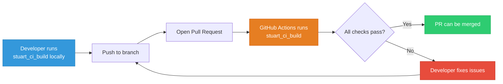
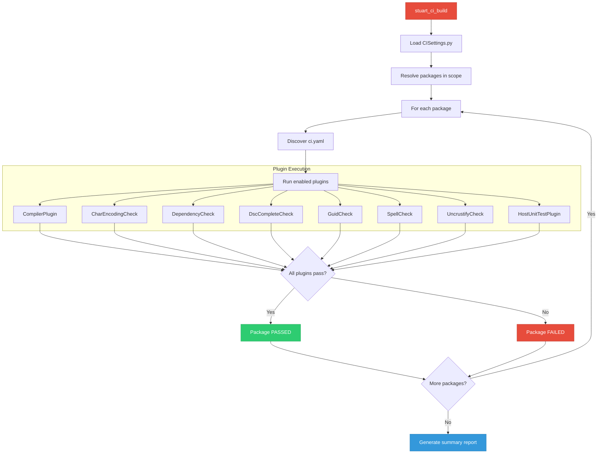
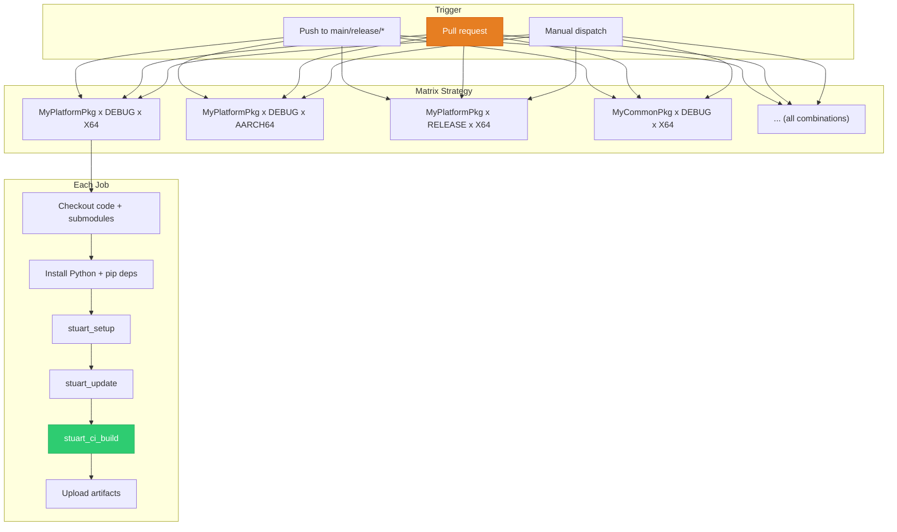
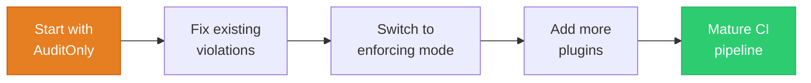

# Chapter 8: CI/CD Pipeline
{: .no_toc }

How Project Mu validates every pull request with automated builds, code analysis, and compliance checks --- and how to set up the same pipeline for your own platform.
{: .fs-6 .fw-300 }

<details open markdown="block">
  <summary>
    Table of contents
  </summary>
  {: .text-delta }
1. TOC
{:toc}
</details>

---

## Learning Objectives

After completing this chapter, you will be able to:
- Explain Project Mu's CI philosophy and the role of automated validation
- Use `stuart_ci_build` to run local CI checks before pushing code
- Set up GitHub Actions workflows for firmware CI/CD
- Configure and customize code analysis plugins
- Implement PR validation gates for your platform repository
- Debug CI failures and understand CI reports

## Project Mu CI Philosophy

Project Mu treats CI as a **first-class engineering practice**, not an afterthought. Every repository in the Project Mu ecosystem is validated by an automated pipeline on every pull request. The philosophy can be summarized in three principles:

1. **Every package must compile independently**: A package should build on its own without hidden dependencies on the platform DSC. `stuart_ci_build` builds each package using only its declared dependencies.

2. **Code quality is enforced automatically**: Formatting, spelling, encoding, GUID uniqueness, and dependency declarations are all checked by plugins. Reviewers should focus on logic and design, not style.

3. **CI runs the same tools developers run locally**: There is no separate "CI build system." Developers use the same `stuart_ci_build` command locally that CI uses in the cloud. If it passes locally, it passes in CI.



## Using stuart_ci_build Locally

Before pushing code, run `stuart_ci_build` locally to catch issues early. This runs the same checks that CI will run.

### Basic Usage

```bash
# Run CI checks on all packages
stuart_ci_build -c CISettings.py -t DEBUG -a X64

# Run CI checks on a specific package
stuart_ci_build -c CISettings.py -p MyPlatformPkg -t DEBUG -a X64

# Run CI checks for multiple architectures
stuart_ci_build -c CISettings.py -p MyPlatformPkg -t DEBUG -a IA32,X64,AARCH64

# Run CI checks for multiple targets
stuart_ci_build -c CISettings.py -p MyPlatformPkg -t DEBUG,RELEASE -a X64
```

### Command-Line Options

| Flag | Purpose | Example |
|:-----|:--------|:--------|
| `-c FILE` | Path to CI settings file | `-c CISettings.py` |
| `-p PKG` | Package(s) to validate (comma-separated) | `-p MdePkg,MdeModulePkg` |
| `-t TARGET` | Build target(s) | `-t DEBUG,RELEASE` |
| `-a ARCH` | Architecture(s) | `-a X64,AARCH64` |
| `--verbose` | Enable verbose output | `--verbose` |
| `--dump-env` | Print resolved environment variables | `--dump-env` |

### CI Build Execution Flow



## Code Analysis Plugins

Stuart CI includes a rich set of plugins that validate different aspects of code quality. Each plugin can be configured per-package through the `ci.yaml` file.

### CompilerPlugin

The most fundamental check: does the code compile?

**What it does**: Builds the package with warnings treated as errors (`-Werror` for GCC, `/WX` for MSVC). This catches not only syntax errors but also suspicious patterns like unused variables, implicit casts, and missing return values.

**Configuration** (`ci.yaml`):
```yaml
"CompilerPlugin": {
    "DscPath": "MyPlatformPkg.dsc"
}
```

### CharEncodingCheck

**What it does**: Verifies that all source files use valid UTF-8 encoding. Mixed encodings cause subtle build failures on different operating systems.

**Configuration**:
```yaml
"CharEncodingCheck": {
    "IgnoreFiles": [
        "Binaries/**",
        "ThirdParty/**"
    ]
}
```

### DependencyCheck

**What it does**: Compares the packages actually `#include`d by source files against the dependencies declared in the package's DEC file. Undeclared dependencies are flagged --- they compile today because of `PACKAGES_PATH` ordering, but could break if the path order changes.

**Configuration**:
```yaml
"DependencyCheck": {
    "AcceptableDependencies": [
        "MdePkg/MdePkg.dec",
        "MdeModulePkg/MdeModulePkg.dec",
        "MsCorePkg/MsCorePkg.dec"
    ],
    "AcceptableDependencies-HOST_APPLICATION": [
        "UnitTestFrameworkPkg/UnitTestFrameworkPkg.dec"
    ]
}
```

### DscCompleteCheck

**What it does**: Scans the package directory for INF files and verifies that each one is referenced in the package DSC. Unreferenced INF files are "dead code" that may silently break without anyone noticing.

**Configuration**:
```yaml
"DscCompleteCheck": {
    "DscPath": "MyPlatformPkg.dsc",
    "IgnoreInf": [
        "Test/TestApp.inf",
        "Tools/ToolHelper.inf"
    ]
}
```

### GuidCheck

**What it does**: Scans all DEC and INF files for GUID declarations and detects duplicates. Duplicate GUIDs cause protocol registration conflicts, variable collisions, and other hard-to-debug runtime failures.

**Configuration**:
```yaml
"GuidCheck": {
    "IgnoreGuidName": ["gEfiCallerIdGuid"],
    "IgnoreFoldersAndFiles": ["Test/**"],
    "IgnoreDuplicates": ["gSpecialCaseGuid"]
}
```

### SpellCheck

**What it does**: Checks spelling in source code comments, documentation files, and string literals using `cspell`. Custom dictionaries can be added for firmware-specific terminology.

**Configuration**:
```yaml
"SpellCheck": {
    "AuditOnly": false,
    "ExtendWords": [
        "UEFI",
        "DFCI",
        "WHEA",
        "ACPI",
        "SMBIOS"
    ],
    "IgnoreFiles": [
        "Binaries/**",
        "*.asl"
    ]
}
```

### UncrustifyCheck

**What it does**: Enforces consistent C code formatting using Uncrustify. The Project Mu coding standard is encoded as an Uncrustify configuration file.

**Configuration**:
```yaml
"UncrustifyCheck": {
    "AuditOnly": false,
    "IgnoreFiles": [
        "ThirdParty/**",
        "AutoGen/**"
    ]
}
```

{: .tip }
> Run Uncrustify locally before committing to avoid formatting-only CI failures. Most editors have Uncrustify plugins that can format on save.

### HostUnitTestPlugin

**What it does**: Discovers and runs host-based unit tests. These are tests compiled as native applications (not UEFI binaries) that run directly on the developer's machine or CI server.

**Configuration**:
```yaml
"HostUnitTestPlugin": {
    "DscPath": "Test/MyPlatformPkgHostTest.dsc"
}
```

### CodeQL (Optional)

**What it does**: Runs GitHub CodeQL static analysis queries against the firmware codebase. CodeQL can detect security vulnerabilities, buffer overflows, and other defects that traditional compilation cannot catch.

This plugin is typically enabled only in GitHub-hosted CI because it requires the CodeQL toolchain.

## GitHub Actions Workflows

Project Mu uses GitHub Actions as its CI/CD platform. The `mu_devops` repository provides reusable workflow templates that you can consume in your own platform.

### Basic Workflow Structure

Here is a complete GitHub Actions workflow for a Project Mu platform:

```yaml
# .github/workflows/ci.yml
name: "Firmware CI"

on:
  push:
    branches: [main, release/*]
  pull_request:
    branches: [main, release/*]
  workflow_dispatch:

jobs:
  ci-build:
    name: "CI Build"
    runs-on: ubuntu-latest
    strategy:
      fail-fast: false
      matrix:
        package:
          - "MyPlatformPkg"
          - "MyCommonPkg"
        target:
          - "DEBUG"
          - "RELEASE"
        arch:
          - "X64"
          - "AARCH64"

    steps:
      - name: Checkout repository
        uses: actions/checkout@v4
        with:
          submodules: recursive
          fetch-depth: 0

      - name: Set up Python
        uses: actions/setup-python@v5
        with:
          python-version: "3.12"

      - name: Install pip dependencies
        run: pip install -r pip-requirements.txt

      - name: Stuart Setup
        run: stuart_setup -c CISettings.py

      - name: Stuart Update
        run: stuart_update -c CISettings.py

      - name: Stuart CI Build
        run: |
          stuart_ci_build -c CISettings.py \
            -p ${{ matrix.package }} \
            -t ${{ matrix.target }} \
            -a ${{ matrix.arch }}

      - name: Upload build logs
        if: always()
        uses: actions/upload-artifact@v4
        with:
          name: build-logs-${{ matrix.package }}-${{ matrix.target }}-${{ matrix.arch }}
          path: |
            Build/**/*.log
            Build/**/*.txt
```

### Workflow Breakdown



### Using mu_devops Reusable Workflows

Instead of writing workflows from scratch, you can use the reusable workflows from `mu_devops`:

```yaml
# .github/workflows/ci.yml
name: "Firmware CI"

on:
  push:
    branches: [main, release/*]
  pull_request:
    branches: [main, release/*]

jobs:
  ci:
    uses: microsoft/mu_devops/.github/workflows/MuDevOps-CI.yml@main
    with:
      ci_settings_file: "CISettings.py"
      packages: "MyPlatformPkg,MyCommonPkg"
      targets: "DEBUG,RELEASE"
      architectures: "X64,AARCH64"
```

This gives you the full Project Mu CI pipeline --- including caching, artifact uploads, and status reporting --- with minimal configuration.

### Platform Build Workflow

In addition to CI validation (which checks individual packages), you typically want a workflow that builds the complete firmware image:

```yaml
# .github/workflows/platform-build.yml
name: "Platform Build"

on:
  push:
    branches: [main, release/*]
  pull_request:
    branches: [main, release/*]

jobs:
  build:
    name: "Build ${{ matrix.target }} firmware"
    runs-on: ubuntu-latest
    strategy:
      matrix:
        target: [DEBUG, RELEASE]

    steps:
      - name: Checkout
        uses: actions/checkout@v4
        with:
          submodules: recursive

      - name: Set up Python
        uses: actions/setup-python@v5
        with:
          python-version: "3.12"

      - name: Install dependencies
        run: pip install -r pip-requirements.txt

      - name: Stuart Setup
        run: stuart_setup -c Platform/MyPlatform/PlatformBuild.py

      - name: Stuart Update
        run: stuart_update -c Platform/MyPlatform/PlatformBuild.py

      - name: Stuart Build
        run: |
          stuart_build -c Platform/MyPlatform/PlatformBuild.py \
            TARGET=${{ matrix.target }}

      - name: Upload firmware image
        uses: actions/upload-artifact@v4
        with:
          name: firmware-${{ matrix.target }}
          path: Build/**/*.fd
```

## PR Validation Gates

GitHub branch protection rules enforce that CI passes before code can be merged.

### Recommended Branch Protection Settings

1. **Require status checks to pass before merging**: Select the CI build jobs as required checks.

2. **Require branches to be up to date before merging**: Ensures the PR is tested against the latest `main`.

3. **Require pull request reviews**: At least one approval from a code owner.

4. **Restrict who can push to matching branches**: Prevent direct pushes to `main` and `release/*`.

### Configuring Required Status Checks

In your repository settings under **Branches > Branch protection rules**:

```
Required status checks:
  [x] CI Build / MyPlatformPkg DEBUG X64
  [x] CI Build / MyPlatformPkg RELEASE X64
  [x] CI Build / MyPlatformPkg DEBUG AARCH64
  [x] Platform Build / Build DEBUG firmware
  [x] Platform Build / Build RELEASE firmware
```

### CODEOWNERS File

Use a `CODEOWNERS` file to automatically assign reviewers:

```
# .github/CODEOWNERS

# Platform owners review all platform changes
Platform/MyPlatform/    @firmware-platform-team

# Package owners review package changes
MyPlatformPkg/          @firmware-platform-team
MyCommonPkg/            @firmware-common-team

# CI and build infrastructure
.github/                @firmware-devops-team
CISettings.py           @firmware-devops-team
PlatformBuild.py        @firmware-platform-team
pip-requirements.txt    @firmware-devops-team
```

## Setting Up CI for a New Platform

Here is a step-by-step guide for adding CI to a new platform repository:

### Step 1: Create CISettings.py

```python
import os
from edk2toolext.invocables.edk2_ci_build import CiBuildSettingsManager
from edk2toolext.invocables.edk2_ci_setup import CiSetupSettingsManager
from edk2toolext.invocables.edk2_update import UpdateSettingsManager
from edk2toollib.utility_functions import GetHostInfo


class CISettings(CiBuildSettingsManager, CiSetupSettingsManager, UpdateSettingsManager):

    def GetWorkspaceRoot(self):
        return os.path.dirname(os.path.abspath(__file__))

    def GetActiveScopes(self):
        scopes = ("cibuild", "global")
        if GetHostInfo().os == "Linux":
            scopes += ("linux",)
        elif GetHostInfo().os == "Windows":
            scopes += ("windows",)
        return scopes

    def GetRequiredSubmodules(self):
        return [
            RequiredSubmodule("MU_BASECORE"),
            RequiredSubmodule("Common/MU_TIANO"),
            RequiredSubmodule("Common/MU_PLUS"),
        ]

    def GetPackagesPath(self):
        ws = self.GetWorkspaceRoot()
        return [
            os.path.join(ws, "MU_BASECORE"),
            os.path.join(ws, "Common", "MU_TIANO"),
            os.path.join(ws, "Common", "MU_PLUS"),
        ]

    def GetPackagesSupported(self):
        return ["MyPlatformPkg"]

    def GetArchitecturesSupported(self):
        return ["X64", "AARCH64"]

    def GetTargetsSupported(self):
        return ["DEBUG", "RELEASE", "NOOPT"]
```

### Step 2: Create Package ci.yaml

```yaml
## @file ci.yaml
## CI configuration for MyPlatformPkg
{
    "CompilerPlugin": {
        "DscPath": "MyPlatformPkg.dsc"
    },
    "CharEncodingCheck": {
        "IgnoreFiles": []
    },
    "DependencyCheck": {
        "AcceptableDependencies": [
            "MdePkg/MdePkg.dec",
            "MdeModulePkg/MdeModulePkg.dec"
        ]
    },
    "DscCompleteCheck": {
        "DscPath": "MyPlatformPkg.dsc",
        "IgnoreInf": []
    },
    "GuidCheck": {
        "IgnoreGuidName": [],
        "IgnoreFoldersAndFiles": [],
        "IgnoreDuplicates": []
    },
    "SpellCheck": {
        "AuditOnly": true,
        "ExtendWords": [],
        "IgnoreFiles": []
    },
    "UncrustifyCheck": {
        "AuditOnly": true
    }
}
```

{: .tip }
> Start with `"AuditOnly": true` for SpellCheck and UncrustifyCheck on existing codebases. This reports issues without failing the build, giving you time to fix existing violations before enforcing the checks.

### Step 3: Create GitHub Actions Workflow

Use the workflow templates shown earlier in this chapter. Place them in `.github/workflows/`.

### Step 4: Configure Branch Protection

After the first successful CI run, configure branch protection rules as described above.

### Step 5: Iterate and Tighten



Over time:
1. Fix existing SpellCheck violations, then set `"AuditOnly": false`
2. Fix existing UncrustifyCheck violations, then enforce formatting
3. Enable HostUnitTestPlugin as you add unit tests
4. Consider enabling CodeQL for security analysis

## Debugging CI Failures

### Reading CI Logs

When CI fails, the build log contains structured output indicating which plugin failed and why:

```
=======================================
PACKAGE: MyPlatformPkg
ARCH:    X64
TARGET:  DEBUG
=======================================

--- Plugin: CompilerPlugin ---
RESULT: PASS

--- Plugin: DependencyCheck ---
RESULT: FAIL
  ERROR: MyPlatformPkg/Drivers/MyDriver/MyDriver.c includes
         <Library/SomeLib.h> from SomePkg but SomePkg/SomePkg.dec
         is not listed in AcceptableDependencies.

--- Plugin: GuidCheck ---
RESULT: PASS

--- Plugin: SpellCheck ---
RESULT: WARNING (AuditOnly)
  WARN: MyPlatformPkg/Drivers/MyDriver/MyDriver.c:42 - "initalize"
        should be "initialize"

=======================================
OVERALL: FAIL (1 error, 1 warning)
=======================================
```

### Common CI Failures and Fixes

| Failure | Cause | Fix |
|:--------|:------|:----|
| CompilerPlugin: warning treated as error | Code produces compiler warnings | Fix the warning or suppress it with a justification comment |
| DependencyCheck: undeclared dependency | Code includes headers from a package not in DEC | Add the package to `AcceptableDependencies` in `ci.yaml` or add it to your DEC's `[Packages]` section |
| DscCompleteCheck: INF not in DSC | New INF file not added to the package DSC | Add the INF to the DSC or add it to `IgnoreInf` if intentionally excluded |
| GuidCheck: duplicate GUID | Two INF/DEC files declare the same GUID value | Generate a new unique GUID for the new module |
| CharEncodingCheck: invalid encoding | File contains non-UTF-8 bytes | Re-save the file as UTF-8 (without BOM) |
| SpellCheck: misspelling | Typo in comment or string | Fix the typo or add the word to `ExtendWords` if it is a valid technical term |

### Reproducing CI Failures Locally

The most important debugging technique: run the same command locally:

```bash
# Run exactly what CI runs
stuart_ci_build -c CISettings.py -p MyPlatformPkg -t DEBUG -a X64

# Run a specific plugin only (not directly supported, but you can
# disable others by setting them to skip in ci.yaml temporarily)
```

If a failure reproduces locally, you can iterate quickly. If it does not reproduce locally, the issue is likely an environment difference --- check Python version, pip package versions, and OS.

## Advanced CI Topics

### Caching for Faster CI

GitHub Actions caching can significantly speed up CI runs:

```yaml
- name: Cache NuGet packages
  uses: actions/cache@v4
  with:
    path: ~/.nuget/packages
    key: nuget-${{ hashFiles('**/*ext_dep*.json') }}

- name: Cache Python packages
  uses: actions/cache@v4
  with:
    path: ~/.cache/pip
    key: pip-${{ hashFiles('pip-requirements.txt') }}

- name: Cache Git submodules
  uses: actions/cache@v4
  with:
    path: |
      MU_BASECORE
      Common/MU_TIANO
      Common/MU_PLUS
    key: submodules-${{ hashFiles('.gitmodules') }}
```

### Omnicache in CI

For large organizations with many firmware repos, an omnicache dramatically reduces CI setup time:

```yaml
- name: Set up omnicache
  run: |
    git init --bare /tmp/omnicache
    git -C /tmp/omnicache remote add mu_basecore https://github.com/microsoft/mu_basecore.git
    git -C /tmp/omnicache remote add mu_plus https://github.com/microsoft/mu_plus.git
    git -C /tmp/omnicache fetch --all

- name: Stuart Setup with omnicache
  run: stuart_setup -c CISettings.py --omnicache /tmp/omnicache
```

### Release Pipeline

For creating release firmware images, add a release workflow:

```yaml
# .github/workflows/release.yml
name: "Release Build"

on:
  push:
    tags: ["v*"]

jobs:
  release:
    runs-on: ubuntu-latest
    steps:
      - uses: actions/checkout@v4
        with:
          submodules: recursive

      - name: Build release image
        run: |
          pip install -r pip-requirements.txt
          stuart_setup -c Platform/MyPlatform/PlatformBuild.py
          stuart_update -c Platform/MyPlatform/PlatformBuild.py
          stuart_build -c Platform/MyPlatform/PlatformBuild.py TARGET=RELEASE

      - name: Create GitHub Release
        uses: softprops/action-gh-release@v2
        with:
          files: Build/**/*.fd
          generate_release_notes: true
```

## Key Takeaways

- Project Mu enforces code quality through automated CI that runs the same tools locally and in the cloud
- `stuart_ci_build` validates individual packages with compilation checks, dependency analysis, GUID verification, spelling, and formatting
- GitHub Actions workflows use matrix strategies to test across packages, targets, and architectures
- Code analysis plugins are configured per-package via `ci.yaml` files
- Start with `AuditOnly` mode for style-enforcement plugins and tighten over time
- Branch protection rules gate PR merges on CI success
- Caching (NuGet, pip, submodules, omnicache) dramatically improves CI performance

## Next Steps

You have now completed Part 2 and have a thorough understanding of Project Mu's structure and tooling. Continue to [Part 3: UEFI Core Concepts]() to dive into the UEFI driver model, protocols, memory services, and boot/runtime services.
