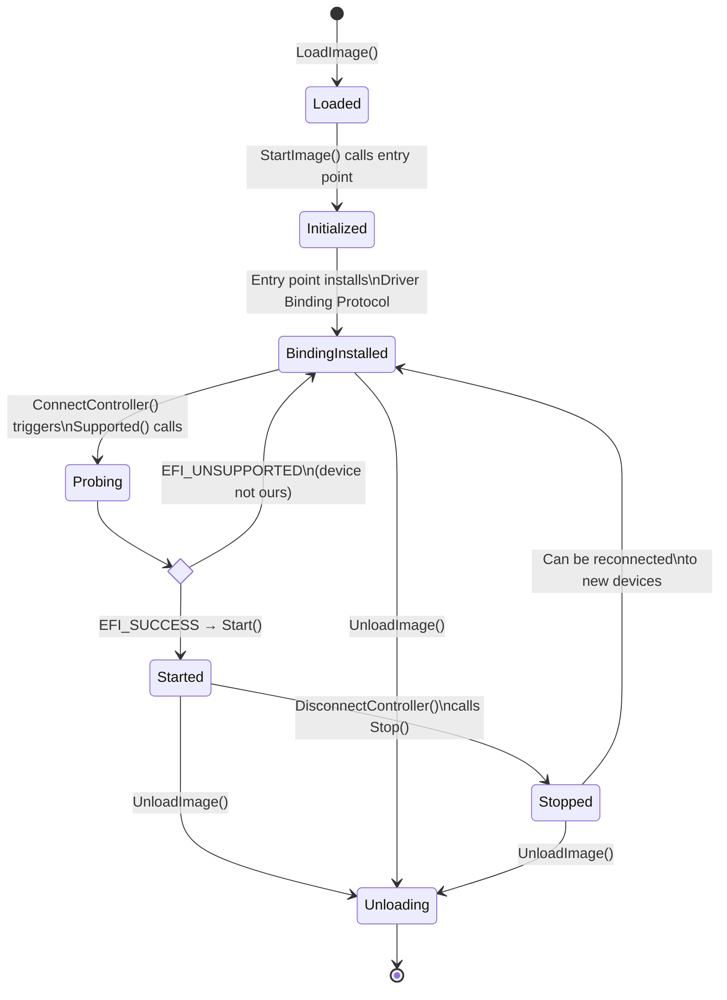
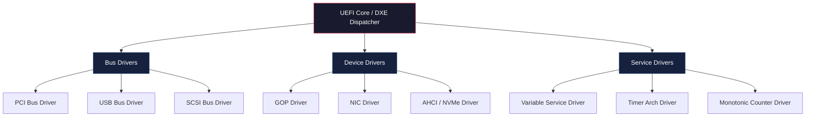
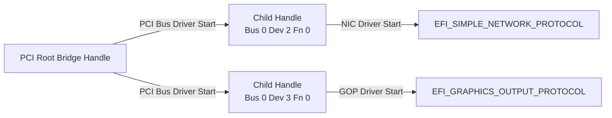

# Chapter 9: Driver Model
{: .fs-9 }

Learn the architecture that lets UEFI drivers discover hardware, manage devices, and coexist cleanly with other firmware components.
{: .fs-6 .fw-300 }

---

## 9.1 UEFI Drivers vs. UEFI Applications

Before diving into the driver model, it is important to understand the fundamental difference between the two kinds of UEFI executables.

| Characteristic | UEFI Application | UEFI Driver |
|:---|:---|:---|
| **Entry point return** | Returns control to the caller; image is unloaded | Typically stays resident in memory |
| **Lifetime** | Transient -- runs and exits | Persistent -- remains until explicitly unloaded |
| **Typical use** | Boot loaders, shell utilities, diagnostics | Hardware abstraction, bus enumeration, service providers |
| **Module type in INF** | `UEFI_APPLICATION` | `UEFI_DRIVER` |
| **Image type in PE header** | `EFI_IMAGE_SUBSYSTEM_EFI_APPLICATION` | `EFI_IMAGE_SUBSYSTEM_EFI_BOOT_SERVICE_DRIVER` or `EFI_IMAGE_SUBSYSTEM_EFI_RUNTIME_DRIVER` |

A UEFI application is like a user-mode program: it does its work and terminates. A UEFI driver is like a kernel module: it installs services, manages devices, and stays loaded until the platform no longer needs it.

{: .note }
> A driver's entry point typically does very little -- it installs a Driver Binding Protocol and returns `EFI_SUCCESS`. The real work happens later when the UEFI core calls the binding protocol's `Start()` function.

---

## 9.2 The Driver Binding Protocol

The **EFI Driver Binding Protocol** is the cornerstone of the UEFI driver model. Every well-behaved UEFI driver installs an instance of this protocol. It contains three function pointers and two version fields:

```c
typedef struct _EFI_DRIVER_BINDING_PROTOCOL {
  EFI_DRIVER_BINDING_SUPPORTED  Supported;
  EFI_DRIVER_BINDING_START      Start;
  EFI_DRIVER_BINDING_STOP       Stop;
  UINT32                        Version;
  EFI_HANDLE                    ImageHandle;
  EFI_HANDLE                    DriverBindingHandle;
} EFI_DRIVER_BINDING_PROTOCOL;
```

### 9.2.1 Supported()

```c
EFI_STATUS
EFIAPI
MyDriverSupported (
  IN EFI_DRIVER_BINDING_PROTOCOL  *This,
  IN EFI_HANDLE                   ControllerHandle,
  IN EFI_DEVICE_PATH_PROTOCOL     *RemainingDevicePath OPTIONAL
  );
```

The platform firmware calls `Supported()` to ask the driver: "Can you manage this controller?" The driver must answer quickly and without side effects. A typical implementation:

1. Opens the bus protocol on `ControllerHandle` using `BY_DRIVER` to check for conflicts.
2. Reads the device's vendor/device ID from configuration space.
3. Compares against a list of known IDs.
4. Closes the protocol (since this is just a probe).
5. Returns `EFI_SUCCESS` if the device is supported, or `EFI_UNSUPPORTED` otherwise.

{: .warning }
> `Supported()` must not modify hardware state. If it allocates resources, it must free them before returning. The UEFI specification explicitly requires `Supported()` to be idempotent.

### 9.2.2 Start()

```c
EFI_STATUS
EFIAPI
MyDriverStart (
  IN EFI_DRIVER_BINDING_PROTOCOL  *This,
  IN EFI_HANDLE                   ControllerHandle,
  IN EFI_DEVICE_PATH_PROTOCOL     *RemainingDevicePath OPTIONAL
  );
```

After `Supported()` returns success, the core calls `Start()` to actually take ownership of the device. This function:

1. Opens the bus I/O protocol `BY_DRIVER` (claiming exclusive access).
2. Allocates private data structures.
3. Initializes the hardware.
4. Installs one or more I/O abstraction protocols on the controller handle (e.g., `EFI_BLOCK_IO_PROTOCOL`, `EFI_SIMPLE_TEXT_OUTPUT_PROTOCOL`).
5. Returns `EFI_SUCCESS`.

### 9.2.3 Stop()

```c
EFI_STATUS
EFIAPI
MyDriverStop (
  IN EFI_DRIVER_BINDING_PROTOCOL  *This,
  IN EFI_HANDLE                   ControllerHandle,
  IN UINTN                        NumberOfChildren,
  IN EFI_HANDLE                   *ChildHandleBuffer OPTIONAL
  );
```

`Stop()` is the reverse of `Start()`. It must:

1. Uninstall all protocols that `Start()` installed.
2. Close all protocols opened with `BY_DRIVER`.
3. Free all allocated memory.
4. Leave the hardware in a safe state.

---

## 9.3 Driver Lifecycle

The following diagram shows the complete lifecycle of a UEFI driver from image loading to unloading.



### Key points

- A single driver image can manage multiple controllers simultaneously. Each controller gets its own `Start()`/`Stop()` cycle.
- `ConnectController()` iterates over all installed Driver Binding Protocols, calling `Supported()` on each, highest version first.
- Drivers can be unloaded at any time. The `Unload()` function in the Loaded Image Protocol must call `Stop()` on every active controller before the image is freed.

---

## 9.4 Component Name Protocol

The **EFI Component Name 2 Protocol** allows drivers to provide human-readable names for themselves and the controllers they manage. This is what the UEFI Shell's `drivers` and `devices` commands display.

```c
typedef struct _EFI_COMPONENT_NAME2_PROTOCOL {
  EFI_COMPONENT_NAME2_GET_DRIVER_NAME      GetDriverName;
  EFI_COMPONENT_NAME2_GET_CONTROLLER_NAME  GetControllerName;
  CHAR8                                    *SupportedLanguages;
} EFI_COMPONENT_NAME2_PROTOCOL;
```

### Implementation example

```c
GLOBAL_REMOVE_IF_UNREFERENCED
EFI_UNICODE_STRING_TABLE mDriverNameTable[] = {
  { "en", (CHAR16 *)L"Sample PCI Device Driver" },
  { NULL,  NULL }
};

EFI_STATUS
EFIAPI
SampleGetDriverName (
  IN  EFI_COMPONENT_NAME2_PROTOCOL  *This,
  IN  CHAR8                         *Language,
  OUT CHAR16                        **DriverName
  )
{
  return LookupUnicodeString2 (
           Language,
           This->SupportedLanguages,
           mDriverNameTable,
           DriverName,
           FALSE
           );
}

EFI_STATUS
EFIAPI
SampleGetControllerName (
  IN  EFI_COMPONENT_NAME2_PROTOCOL  *This,
  IN  EFI_HANDLE                    ControllerHandle,
  IN  EFI_HANDLE                    ChildHandle OPTIONAL,
  IN  CHAR8                         *Language,
  OUT CHAR16                        **ControllerName
  )
{
  return EFI_UNSUPPORTED;  // Simplified -- real drivers should provide names
}

EFI_COMPONENT_NAME2_PROTOCOL gSampleComponentName2 = {
  SampleGetDriverName,
  SampleGetControllerName,
  "en"
};
```

---

## 9.5 Driver Diagnostics Protocol

The **EFI Driver Diagnostics 2 Protocol** is optional but valuable for production firmware. It allows a management application or the UEFI Shell `drvdiag` command to run diagnostics on a controller.

```c
typedef struct _EFI_DRIVER_DIAGNOSTICS2_PROTOCOL {
  EFI_DRIVER_DIAGNOSTICS2_RUN_DIAGNOSTICS  RunDiagnostics;
  CHAR8                                    *SupportedLanguages;
} EFI_DRIVER_DIAGNOSTICS2_PROTOCOL;
```

The `RunDiagnostics()` function accepts a diagnostic type:

| Type | Purpose |
|:---|:---|
| `EfiDriverDiagnosticTypeStandard` | Quick non-destructive test |
| `EfiDriverDiagnosticTypeExtended` | Thorough test, may take longer |
| `EfiDriverDiagnosticTypeManufacturing` | Factory-level test, may be destructive |

---

## 9.6 Private Context Data Pattern

Real drivers need to store per-device state. The standard UEFI pattern uses a "private context" structure with a signature and a macro to convert from a protocol pointer back to the context:

```c
#define SAMPLE_DRIVER_SIGNATURE  SIGNATURE_32('S','M','P','L')

typedef struct {
  UINT32                          Signature;
  EFI_HANDLE                     Handle;
  EFI_PCI_IO_PROTOCOL            *PciIo;

  //
  // Produced protocol
  //
  EFI_BLOCK_IO_PROTOCOL          BlockIo;

  //
  // Device-specific state
  //
  UINT64                         DeviceBaseAddress;
  UINT32                         SectorSize;
  UINT64                         TotalSectors;
} SAMPLE_DRIVER_PRIVATE_DATA;

#define SAMPLE_PRIVATE_FROM_BLOCK_IO(a) \
  CR(a, SAMPLE_DRIVER_PRIVATE_DATA, BlockIo, SAMPLE_DRIVER_SIGNATURE)
```

The `CR()` macro (short for "Containing Record") uses `CONTAINING_RECORD` logic plus a signature check. When a protocol function is called, you recover your private data like this:

```c
EFI_STATUS
EFIAPI
SampleBlockIoReadBlocks (
  IN  EFI_BLOCK_IO_PROTOCOL  *This,
  IN  UINT32                 MediaId,
  IN  EFI_LBA                Lba,
  IN  UINTN                  BufferSize,
  OUT VOID                   *Buffer
  )
{
  SAMPLE_DRIVER_PRIVATE_DATA  *Private;

  Private = SAMPLE_PRIVATE_FROM_BLOCK_IO (This);
  ASSERT (Private->Signature == SAMPLE_DRIVER_SIGNATURE);

  // Now use Private->PciIo, Private->DeviceBaseAddress, etc.
  // ...
}
```

---

## 9.7 Complete Example: A Simple UEFI Driver

Below is a complete, compilable UEFI driver that demonstrates the driver binding protocol pattern. This driver does not manage real hardware -- it installs a trivial custom protocol on a new handle to demonstrate the full lifecycle.

### 9.7.1 The Protocol Header (SampleProtocol.h)

```c
#ifndef SAMPLE_PROTOCOL_H_
#define SAMPLE_PROTOCOL_H_

//
// {A7D54E3C-1B29-4F9E-8C4D-6E2A7F3B1D80}
//
#define SAMPLE_PROTOCOL_GUID \
  { 0xa7d54e3c, 0x1b29, 0x4f9e, \
    { 0x8c, 0x4d, 0x6e, 0x2a, 0x7f, 0x3b, 0x1d, 0x80 } }

typedef struct _SAMPLE_PROTOCOL SAMPLE_PROTOCOL;

typedef
EFI_STATUS
(EFIAPI *SAMPLE_GET_VALUE)(
  IN  SAMPLE_PROTOCOL  *This,
  OUT UINT32           *Value
  );

typedef
EFI_STATUS
(EFIAPI *SAMPLE_SET_VALUE)(
  IN  SAMPLE_PROTOCOL  *This,
  IN  UINT32           Value
  );

struct _SAMPLE_PROTOCOL {
  SAMPLE_GET_VALUE   GetValue;
  SAMPLE_SET_VALUE   SetValue;
};

extern EFI_GUID gSampleProtocolGuid;

#endif // SAMPLE_PROTOCOL_H_
```

### 9.7.2 The Driver Source (SampleDriver.c)

```c
#include <Uefi.h>
#include <Library/UefiBootServicesTableLib.h>
#include <Library/UefiDriverEntryPoint.h>
#include <Library/DebugLib.h>
#include <Library/MemoryAllocationLib.h>
#include <Library/UefiLib.h>
#include <Protocol/DriverBinding.h>
#include <Protocol/ComponentName2.h>

#include "SampleProtocol.h"

//
// Private data
//
#define SAMPLE_PRIVATE_SIGNATURE  SIGNATURE_32('S','m','p','D')

typedef struct {
  UINT32            Signature;
  EFI_HANDLE        Handle;
  SAMPLE_PROTOCOL   SampleProtocol;
  UINT32            StoredValue;
} SAMPLE_PRIVATE_DATA;

#define SAMPLE_PRIVATE_FROM_PROTOCOL(a) \
  CR(a, SAMPLE_PRIVATE_DATA, SampleProtocol, SAMPLE_PRIVATE_SIGNATURE)

//
// Protocol function implementations
//
EFI_STATUS
EFIAPI
SampleGetValue (
  IN  SAMPLE_PROTOCOL  *This,
  OUT UINT32           *Value
  )
{
  SAMPLE_PRIVATE_DATA  *Private;

  if (This == NULL || Value == NULL) {
    return EFI_INVALID_PARAMETER;
  }

  Private = SAMPLE_PRIVATE_FROM_PROTOCOL (This);
  *Value  = Private->StoredValue;

  DEBUG ((DEBUG_INFO, "SampleDriver: GetValue() returning %u\n", *Value));
  return EFI_SUCCESS;
}

EFI_STATUS
EFIAPI
SampleSetValue (
  IN  SAMPLE_PROTOCOL  *This,
  IN  UINT32           Value
  )
{
  SAMPLE_PRIVATE_DATA  *Private;

  if (This == NULL) {
    return EFI_INVALID_PARAMETER;
  }

  Private = SAMPLE_PRIVATE_FROM_PROTOCOL (This);
  Private->StoredValue = Value;

  DEBUG ((DEBUG_INFO, "SampleDriver: SetValue(%u)\n", Value));
  return EFI_SUCCESS;
}

//
// Driver Binding Protocol functions
//
EFI_STATUS
EFIAPI
SampleDriverSupported (
  IN EFI_DRIVER_BINDING_PROTOCOL  *This,
  IN EFI_HANDLE                   ControllerHandle,
  IN EFI_DEVICE_PATH_PROTOCOL     *RemainingDevicePath OPTIONAL
  )
{
  //
  // This simple driver creates its own handle rather than binding
  // to an existing controller. In a real driver you would probe
  // the controller here (e.g., check PCI Vendor/Device IDs).
  //
  return EFI_UNSUPPORTED;
}

EFI_STATUS
EFIAPI
SampleDriverStart (
  IN EFI_DRIVER_BINDING_PROTOCOL  *This,
  IN EFI_HANDLE                   ControllerHandle,
  IN EFI_DEVICE_PATH_PROTOCOL     *RemainingDevicePath OPTIONAL
  )
{
  return EFI_UNSUPPORTED;
}

EFI_STATUS
EFIAPI
SampleDriverStop (
  IN EFI_DRIVER_BINDING_PROTOCOL  *This,
  IN EFI_HANDLE                   ControllerHandle,
  IN UINTN                        NumberOfChildren,
  IN EFI_HANDLE                   *ChildHandleBuffer OPTIONAL
  )
{
  return EFI_UNSUPPORTED;
}

//
// Driver Binding Protocol instance
//
EFI_DRIVER_BINDING_PROTOCOL gSampleDriverBinding = {
  SampleDriverSupported,
  SampleDriverStart,
  SampleDriverStop,
  0x10,    // Version
  NULL,    // ImageHandle -- filled in at entry
  NULL     // DriverBindingHandle -- filled in at entry
};

//
// Component Name
//
GLOBAL_REMOVE_IF_UNREFERENCED
EFI_UNICODE_STRING_TABLE mSampleDriverNameTable[] = {
  { "en", (CHAR16 *)L"Sample UEFI Driver" },
  { NULL,  NULL }
};

EFI_STATUS
EFIAPI
SampleComponentNameGetDriverName (
  IN  EFI_COMPONENT_NAME2_PROTOCOL  *This,
  IN  CHAR8                         *Language,
  OUT CHAR16                        **DriverName
  )
{
  return LookupUnicodeString2 (
           Language,
           This->SupportedLanguages,
           mSampleDriverNameTable,
           DriverName,
           FALSE
           );
}

EFI_STATUS
EFIAPI
SampleComponentNameGetControllerName (
  IN  EFI_COMPONENT_NAME2_PROTOCOL  *This,
  IN  EFI_HANDLE                    ControllerHandle,
  IN  EFI_HANDLE                    ChildHandle OPTIONAL,
  IN  CHAR8                         *Language,
  OUT CHAR16                        **ControllerName
  )
{
  return EFI_UNSUPPORTED;
}

EFI_COMPONENT_NAME2_PROTOCOL gSampleComponentName2 = {
  SampleComponentNameGetDriverName,
  SampleComponentNameGetControllerName,
  "en"
};

//
// Module-scoped handle for the protocol we install during entry
//
STATIC EFI_HANDLE  mSampleHandle = NULL;
STATIC SAMPLE_PRIVATE_DATA  *mPrivate = NULL;

//
// Unload handler
//
EFI_STATUS
EFIAPI
SampleDriverUnload (
  IN EFI_HANDLE  ImageHandle
  )
{
  EFI_STATUS  Status;

  if (mSampleHandle != NULL) {
    Status = gBS->UninstallProtocolInterface (
                    mSampleHandle,
                    &gSampleProtocolGuid,
                    &mPrivate->SampleProtocol
                    );
    if (EFI_ERROR (Status)) {
      return Status;
    }
  }

  if (mPrivate != NULL) {
    FreePool (mPrivate);
    mPrivate = NULL;
  }

  //
  // Uninstall Driver Binding and Component Name
  //
  Status = EfiLibUninstallDriverBindingComponentName2 (
             &gSampleDriverBinding,
             &gSampleComponentName2
             );

  return Status;
}

//
// Entry point
//
EFI_STATUS
EFIAPI
SampleDriverEntryPoint (
  IN EFI_HANDLE        ImageHandle,
  IN EFI_SYSTEM_TABLE  *SystemTable
  )
{
  EFI_STATUS  Status;

  //
  // Install Driver Binding and Component Name protocols
  //
  Status = EfiLibInstallDriverBindingComponentName2 (
             ImageHandle,
             SystemTable,
             &gSampleDriverBinding,
             ImageHandle,
             NULL,  // ComponentName (v1) -- not provided
             &gSampleComponentName2
             );
  if (EFI_ERROR (Status)) {
    return Status;
  }

  //
  // Allocate private data and install our custom protocol
  //
  mPrivate = AllocateZeroPool (sizeof (SAMPLE_PRIVATE_DATA));
  if (mPrivate == NULL) {
    return EFI_OUT_OF_RESOURCES;
  }

  mPrivate->Signature                  = SAMPLE_PRIVATE_SIGNATURE;
  mPrivate->StoredValue                = 42;  // Default value
  mPrivate->SampleProtocol.GetValue    = SampleGetValue;
  mPrivate->SampleProtocol.SetValue    = SampleSetValue;

  mSampleHandle = NULL;
  Status = gBS->InstallProtocolInterface (
                  &mSampleHandle,
                  &gSampleProtocolGuid,
                  EFI_NATIVE_INTERFACE,
                  &mPrivate->SampleProtocol
                  );
  if (EFI_ERROR (Status)) {
    FreePool (mPrivate);
    mPrivate = NULL;
    return Status;
  }

  mPrivate->Handle = mSampleHandle;

  DEBUG ((DEBUG_INFO, "SampleDriver: Loaded and protocol installed.\n"));

  return EFI_SUCCESS;
}
```

### 9.7.3 The Module INF File (SampleDriver.inf)

```ini
[Defines]
  INF_VERSION    = 0x00010017
  BASE_NAME      = SampleDriver
  FILE_GUID      = 3E4D7A2C-58B1-4A9F-B0C6-8D2E1F5A3C70
  MODULE_TYPE    = UEFI_DRIVER
  VERSION_STRING = 1.0
  ENTRY_POINT    = SampleDriverEntryPoint
  UNLOAD_IMAGE   = SampleDriverUnload

[Sources]
  SampleDriver.c
  SampleProtocol.h

[Packages]
  MdePkg/MdePkg.dec
  MdeModulePkg/MdeModulePkg.dec

[LibraryClasses]
  UefiDriverEntryPoint
  UefiBootServicesTableLib
  DebugLib
  MemoryAllocationLib
  UefiLib

[Protocols]
  gSampleProtocolGuid    ## PRODUCES

[Guids]

[Depex]
  TRUE
```

### 9.7.4 The GUID Declaration

In your package `.dec` file, add:

```ini
[Protocols]
  gSampleProtocolGuid = { 0xa7d54e3c, 0x1b29, 0x4f9e, \
    { 0x8c, 0x4d, 0x6e, 0x2a, 0x7f, 0x3b, 0x1d, 0x80 } }
```

---

## 9.8 Building and Loading the Driver in QEMU

### Step 1: Add the driver to your DSC file

```ini
[Components]
  YourPkg/Drivers/SampleDriver/SampleDriver.inf
```

### Step 2: Build

```bash
stuart_build -c Platforms/QemuQ35Pkg/PlatformBuild.py TOOL_CHAIN_TAG=GCC5
```

### Step 3: Copy the built EFI binary to a virtual FAT disk

```bash
cp Build/QemuQ35/DEBUG_GCC5/X64/SampleDriver.efi /path/to/virtual/disk/
```

### Step 4: Load in the UEFI Shell

```
Shell> load SampleDriver.efi
Image 'FS0:\SampleDriver.efi' loaded at 7E4C6000 - Success

Shell> drivers
 Drv  Version  Bus  Image                          Driver Name
 === ======== ==== ============================== ============================
  7F     0x10       SampleDriver.efi               Sample UEFI Driver
```

### Step 5: Test with a client application

Write a small UEFI application that locates and exercises the protocol:

```c
#include <Uefi.h>
#include <Library/UefiBootServicesTableLib.h>
#include <Library/UefiLib.h>
#include "SampleProtocol.h"

EFI_STATUS
EFIAPI
UefiMain (
  IN EFI_HANDLE        ImageHandle,
  IN EFI_SYSTEM_TABLE  *SystemTable
  )
{
  EFI_STATUS       Status;
  SAMPLE_PROTOCOL  *Sample;
  UINT32           Value;

  Status = gBS->LocateProtocol (&gSampleProtocolGuid, NULL, (VOID **)&Sample);
  if (EFI_ERROR (Status)) {
    Print (L"ERROR: Could not locate SampleProtocol: %r\n", Status);
    return Status;
  }

  Status = Sample->GetValue (Sample, &Value);
  Print (L"Current value: %u\n", Value);

  Status = Sample->SetValue (Sample, 100);
  Print (L"Set value to 100: %r\n", Status);

  Status = Sample->GetValue (Sample, &Value);
  Print (L"New value: %u\n", Value);

  return EFI_SUCCESS;
}
```

---

## 9.9 Driver Categories in Practice

The UEFI specification defines several driver categories based on the bus they manage:



| Category | Behavior | Example |
|:---|:---|:---|
| **Bus driver** | Enumerates child devices, creates child handles | PCI bus driver discovers PCI functions |
| **Device driver** | Manages a single device, installs I/O protocols | Network driver installs `EFI_SIMPLE_NETWORK_PROTOCOL` |
| **Service driver** | Provides a platform service, no device binding | Variable driver provides `GetVariable()`/`SetVariable()` |

### Bus drivers and child handles

Bus drivers are special because they create **child handles**. When a PCI bus driver finds a device at Bus 0, Device 2, Function 0, it creates a new handle and installs `EFI_PCI_IO_PROTOCOL` on it. Device drivers then bind to these child handles.



---

## 9.10 Driver Best Practices

1. **Keep `Supported()` fast.** It is called frequently during `ConnectController()`. Avoid heavy I/O.

2. **Clean up completely in `Stop()`.** Every resource allocated in `Start()` must be freed in `Stop()`. Test by loading, connecting, disconnecting, and unloading repeatedly.

3. **Use the `CR()` macro and signatures.** They catch memory corruption early with a clear `ASSERT` rather than a mysterious crash.

4. **Provide Component Name.** It costs little and makes debugging dramatically easier.

5. **Set the Version field appropriately.** Higher-versioned drivers override lower ones for the same device. Use version `0x10` for development and increment for production releases.

6. **Handle `RemainingDevicePath` correctly.** If it is `NULL`, start all children. If it points to an end node, start no children but verify the controller. If it points to a specific device path, start only that child.

7. **Test hot-plug scenarios.** If your driver manages a bus that supports hot-plug (USB, Thunderbolt), test repeated connect/disconnect cycles under memory pressure.

---

## 9.11 Debugging Driver Issues

Common problems and their symptoms:

| Symptom | Likely Cause |
|:---|:---|
| Driver loads but no device appears | `Supported()` returns `EFI_UNSUPPORTED` for all controllers -- check your matching logic |
| `Start()` fails with `EFI_ACCESS_DENIED` | Another driver already opened the protocol `BY_DRIVER` -- use `dh -v <handle>` in the shell to investigate |
| Crash in protocol function | `CR()` signature mismatch -- likely memory corruption or wrong protocol pointer |
| `Stop()` fails with `EFI_IN_USE` | A consumer still has the protocol open -- all openers must close before uninstall |
| Shell `drivers` shows no name | Component Name Protocol not installed or language mismatch |

### Useful UEFI Shell commands for driver debugging

```
Shell> drivers              # List all loaded drivers
Shell> devices              # List all device handles
Shell> devtree              # Show device tree hierarchy
Shell> dh -d -v 7F          # Detailed dump of handle 0x7F
Shell> connect 7F           # Connect driver 0x7F to all devices
Shell> disconnect 7F        # Disconnect driver 0x7F from all devices
Shell> unload 7F            # Unload driver image 0x7F
Shell> reconnect -r         # Reconnect all drivers to all devices
```

---

{: .note }
> **Complete source code**: The full working example for this chapter is available at [`examples/UefiMuGuidePkg/DriverExample/`](https://github.com/MichaelTien8901/uefi-mu-guide-tutorial-openspec/tree/main/docs/examples/UefiMuGuidePkg/DriverExample).

## Summary

The UEFI driver model provides a clean, protocol-based architecture for managing hardware and services. The Driver Binding Protocol's three-function pattern -- `Supported()`, `Start()`, `Stop()` -- enforces a disciplined approach to device discovery and lifecycle management. Combined with Component Name and Driver Diagnostics, this model produces drivers that are discoverable, testable, and hot-plug capable.

In the next chapter, we will explore the protocol and handle database in depth -- the foundation upon which this entire driver model rests.

---

{: .tip }
> **Hands-on exercise:** Modify the SampleDriver to accept a string value instead of a `UINT32`. Add a `GetString()`/`SetString()` pair to the protocol, allocate storage dynamically, and ensure `Stop()` frees the string memory. This exercise reinforces the private data pattern and memory lifecycle management.
