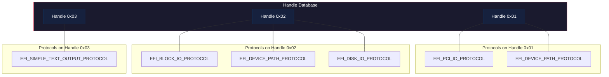
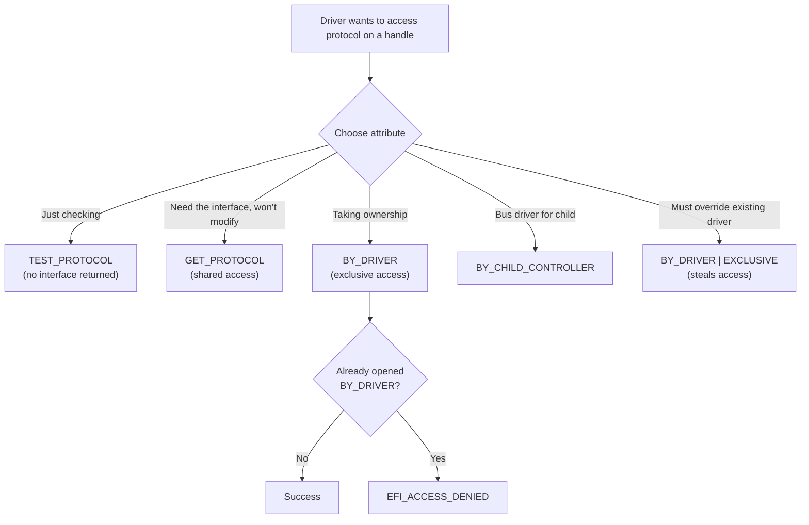
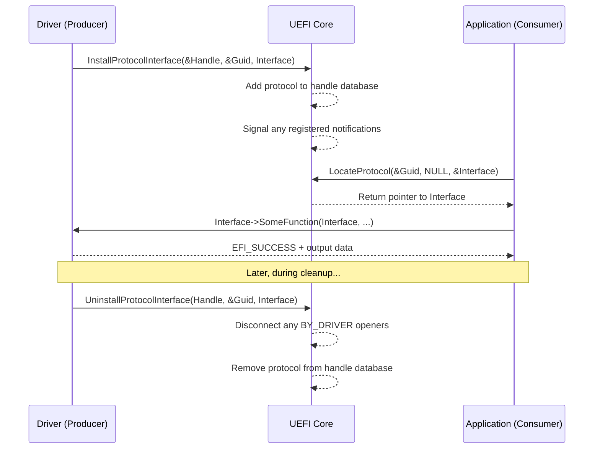

# Chapter 10: Protocols and Handles
{: .fs-9 }

Understand the dynamic object system that makes UEFI firmware modular, extensible, and hardware-independent.
{: .fs-6 .fw-300 }

---

## 10.1 The Handle Database

At the center of UEFI is the **handle database** -- a runtime registry of all the objects and services in the system. If you come from an object-oriented background, think of it as a global object registry where:

- A **handle** is an opaque object identity (like an object pointer).
- A **protocol** is an interface (like a vtable) identified by a GUID.
- Multiple protocols can be installed on a single handle.
- Any code can query, install, or remove protocols at runtime.



{: .note }
> The handle database is maintained by UEFI Boot Services. It exists only during boot -- once `ExitBootServices()` is called, the database is gone and no new protocols can be installed or located.

---

## 10.2 GUIDs: The Universal Identifier

Every protocol, every variable namespace, and every file format in UEFI is identified by a **Globally Unique Identifier (GUID)** -- a 128-bit value that is unique across all space and time.

### GUID structure

```c
typedef struct {
  UINT32  Data1;
  UINT16  Data2;
  UINT16  Data3;
  UINT8   Data4[8];
} EFI_GUID;
```

### Declaring a GUID in EDK II / Project Mu

In a header file:

```c
#define EFI_MY_PROTOCOL_GUID \
  { 0x12345678, 0xABCD, 0xEF01, \
    { 0x23, 0x45, 0x67, 0x89, 0xAB, 0xCD, 0xEF, 0x01 } }

extern EFI_GUID gEfiMyProtocolGuid;
```

In the package `.dec` file:

```ini
[Protocols]
  gEfiMyProtocolGuid = { 0x12345678, 0xABCD, 0xEF01, \
    { 0x23, 0x45, 0x67, 0x89, 0xAB, 0xCD, 0xEF, 0x01 } }
```

In your module `.inf`:

```ini
[Protocols]
  gEfiMyProtocolGuid    ## CONSUMES
```

The auto-generated `AutoGen.c` file will create the actual `EFI_GUID gEfiMyProtocolGuid` variable.

{: .tip }
> Use `uuidgen` on Linux or `[System.Guid]::NewGuid()` in PowerShell to generate new GUIDs. Never reuse an existing protocol GUID for a different interface.

---

## 10.3 Installing Protocols

### InstallProtocolInterface

The most basic way to attach a protocol to a handle:

```c
EFI_STATUS
EFIAPI
gBS->InstallProtocolInterface (
  IN OUT EFI_HANDLE      *Handle,
  IN     EFI_GUID        *Protocol,
  IN     EFI_INTERFACE_TYPE  InterfaceType,  // Always EFI_NATIVE_INTERFACE
  IN     VOID            *Interface
  );
```

If `*Handle` is `NULL`, a new handle is created. If it points to an existing handle, the protocol is added to that handle.

```c
EFI_HANDLE  NewHandle = NULL;

Status = gBS->InstallProtocolInterface (
                &NewHandle,
                &gEfiMyProtocolGuid,
                EFI_NATIVE_INTERFACE,
                &mMyProtocolInstance
                );
if (EFI_ERROR (Status)) {
  DEBUG ((DEBUG_ERROR, "Failed to install protocol: %r\n", Status));
  return Status;
}
// NewHandle now points to a valid handle with our protocol
```

### InstallMultipleProtocolInterfaces

For installing several protocols atomically on the same handle:

```c
EFI_HANDLE  DeviceHandle = NULL;

Status = gBS->InstallMultipleProtocolInterfaces (
                &DeviceHandle,
                &gEfiBlockIoProtocolGuid,    &mBlockIoProtocol,
                &gEfiDevicePathProtocolGuid, &mDevicePath,
                &gEfiDiskIoProtocolGuid,     &mDiskIoProtocol,
                NULL  // Sentinel -- must terminate the list
                );
```

{: .important }
> `InstallMultipleProtocolInterfaces` is **atomic**: if any protocol fails to install (e.g., a duplicate GUID on the same handle), none of them are installed. Always prefer this function when installing multiple protocols.

### Reinstalling a protocol

When a protocol's interface changes (e.g., media changes in a removable device), use:

```c
Status = gBS->ReinstallProtocolInterface (
                DeviceHandle,
                &gEfiBlockIoProtocolGuid,
                &mOldBlockIo,   // Old interface
                &mNewBlockIo    // New interface
                );
```

This notifies all agents registered for protocol notification that the interface has changed.

---

## 10.4 Locating Protocols

UEFI provides several functions for finding protocols in the handle database. Choosing the right one depends on your use case.

### LocateProtocol -- Find the first instance

```c
EFI_STATUS
EFIAPI
gBS->LocateProtocol (
  IN  EFI_GUID  *Protocol,
  IN  VOID      *Registration OPTIONAL,
  OUT VOID      **Interface
  );
```

This returns the **first** handle in the database that has the specified protocol. It is the simplest search function but gives you no control over which instance you get.

```c
EFI_SIMPLE_TEXT_OUTPUT_PROTOCOL  *ConOut;

Status = gBS->LocateProtocol (
                &gEfiSimpleTextOutputProtocolGuid,
                NULL,
                (VOID **)&ConOut
                );
if (!EFI_ERROR (Status)) {
  ConOut->OutputString (ConOut, L"Found console output!\r\n");
}
```

### LocateHandleBuffer -- Find all instances

When you need to enumerate every handle that carries a protocol:

```c
EFI_STATUS
EFIAPI
gBS->LocateHandleBuffer (
  IN     EFI_LOCATE_SEARCH_TYPE  SearchType,
  IN     EFI_GUID                *Protocol OPTIONAL,
  IN     VOID                    *SearchKey OPTIONAL,
  IN OUT UINTN                   *NoHandles,
  OUT    EFI_HANDLE              **Buffer
  );
```

The search types are:

| SearchType | Meaning |
|:---|:---|
| `AllHandles` | Return every handle in the database |
| `ByRegisterNotify` | Return handle from a `RegisterProtocolNotify` registration |
| `ByProtocol` | Return all handles that have the specified protocol |

Example: enumerate all block I/O devices:

```c
EFI_HANDLE  *HandleBuffer;
UINTN       HandleCount;
UINTN       Index;

Status = gBS->LocateHandleBuffer (
                ByProtocol,
                &gEfiBlockIoProtocolGuid,
                NULL,
                &HandleCount,
                &HandleBuffer
                );
if (EFI_ERROR (Status)) {
  Print (L"No Block I/O devices found: %r\n", Status);
  return Status;
}

Print (L"Found %u Block I/O devices:\n", HandleCount);

for (Index = 0; Index < HandleCount; Index++) {
  EFI_BLOCK_IO_PROTOCOL  *BlockIo;

  Status = gBS->HandleProtocol (
                  HandleBuffer[Index],
                  &gEfiBlockIoProtocolGuid,
                  (VOID **)&BlockIo
                  );
  if (!EFI_ERROR (Status)) {
    Print (
      L"  [%u] MediaId=%u BlockSize=%u LastBlock=%lu\n",
      Index,
      BlockIo->Media->MediaId,
      BlockIo->Media->BlockSize,
      BlockIo->Media->LastBlock
      );
  }
}

// Caller must free the buffer
gBS->FreePool (HandleBuffer);
```

{: .warning }
> Always call `gBS->FreePool()` on the buffer returned by `LocateHandleBuffer`. The UEFI core allocates this buffer and transfers ownership to you.

### LocateHandle -- Low-level version

`LocateHandle` is the older, lower-level form. You must call it twice: once to get the required buffer size, then again with an allocated buffer. Prefer `LocateHandleBuffer` in new code.

```c
UINTN       BufferSize = 0;
EFI_HANDLE  *Handles   = NULL;

// First call: get required size
Status = gBS->LocateHandle (
                ByProtocol,
                &gEfiBlockIoProtocolGuid,
                NULL,
                &BufferSize,
                NULL
                );
if (Status == EFI_BUFFER_TOO_SMALL) {
  Handles = AllocatePool (BufferSize);
  if (Handles == NULL) {
    return EFI_OUT_OF_RESOURCES;
  }

  // Second call: fill the buffer
  Status = gBS->LocateHandle (
                  ByProtocol,
                  &gEfiBlockIoProtocolGuid,
                  NULL,
                  &BufferSize,
                  Handles
                  );
}
```

---

## 10.5 OpenProtocol and CloseProtocol

### The problem with HandleProtocol

`HandleProtocol()` was the original way to get a protocol interface:

```c
Status = gBS->HandleProtocol (Handle, &gEfiXyzGuid, (VOID **)&Xyz);
```

It works but has a critical flaw: it does not track who opened the protocol or why. This makes it impossible for the system to enforce exclusive access or to clean up properly during `DisconnectController()`.

### OpenProtocol -- The right way

```c
EFI_STATUS
EFIAPI
gBS->OpenProtocol (
  IN  EFI_HANDLE  Handle,
  IN  EFI_GUID    *Protocol,
  OUT VOID        **Interface OPTIONAL,
  IN  EFI_HANDLE  AgentHandle,
  IN  EFI_HANDLE  ControllerHandle,
  IN  UINT32      Attributes
  );
```

The `Attributes` parameter controls the access mode:

| Attribute | Purpose | Who uses it |
|:---|:---|:---|
| `BY_HANDLE_PROTOCOL` | Compatibility mode, like `HandleProtocol()` | Legacy code |
| `GET_PROTOCOL` | Read-only access, does not prevent others from opening | Applications, shell commands |
| `TEST_PROTOCOL` | Only checks if the protocol exists, `Interface` can be `NULL` | `Supported()` quick checks |
| `BY_CHILD_CONTROLLER` | Bus driver opening parent's protocol on behalf of a child | Bus drivers |
| `BY_DRIVER` | Exclusive access -- fails if another driver already has it | Device drivers in `Start()` |
| `BY_DRIVER | EXCLUSIVE` | Forcibly steals from an existing `BY_DRIVER` opener | Override drivers |



### Example: Driver opening a protocol in Start()

```c
EFI_STATUS
EFIAPI
MyDriverStart (
  IN EFI_DRIVER_BINDING_PROTOCOL  *This,
  IN EFI_HANDLE                   ControllerHandle,
  IN EFI_DEVICE_PATH_PROTOCOL     *RemainingDevicePath OPTIONAL
  )
{
  EFI_STATUS           Status;
  EFI_PCI_IO_PROTOCOL  *PciIo;

  //
  // Open PCI I/O with exclusive access
  //
  Status = gBS->OpenProtocol (
                  ControllerHandle,
                  &gEfiPciIoProtocolGuid,
                  (VOID **)&PciIo,
                  This->DriverBindingHandle,
                  ControllerHandle,
                  EFI_OPEN_PROTOCOL_BY_DRIVER
                  );
  if (EFI_ERROR (Status)) {
    return Status;  // Another driver already owns this device
  }

  // ... initialize hardware, install produced protocols ...

  return EFI_SUCCESS;
}
```

### CloseProtocol

Every `OpenProtocol()` with `BY_DRIVER` or `BY_CHILD_CONTROLLER` must be matched by a `CloseProtocol()` in `Stop()`:

```c
gBS->CloseProtocol (
       ControllerHandle,
       &gEfiPciIoProtocolGuid,
       This->DriverBindingHandle,
       ControllerHandle
       );
```

### OpenProtocolInformation -- Who has it open?

For debugging, you can query who has a protocol open:

```c
EFI_OPEN_PROTOCOL_INFORMATION_ENTRY  *OpenInfo;
UINTN                                OpenInfoCount;

Status = gBS->OpenProtocolInformation (
                Handle,
                &gEfiPciIoProtocolGuid,
                &OpenInfo,
                &OpenInfoCount
                );
if (!EFI_ERROR (Status)) {
  for (UINTN i = 0; i < OpenInfoCount; i++) {
    Print (
      L"  Agent=0x%x Controller=0x%x Attr=0x%x OpenCount=%u\n",
      OpenInfo[i].AgentHandle,
      OpenInfo[i].ControllerHandle,
      OpenInfo[i].Attributes,
      OpenInfo[i].OpenCount
      );
  }
  gBS->FreePool (OpenInfo);
}
```

---

## 10.6 Protocol Notification

Sometimes you need to know when a protocol is installed -- for example, a driver that depends on another service being available. UEFI provides `RegisterProtocolNotify()`:

```c
EFI_EVENT   Event;
VOID        *Registration;

//
// Create an event
//
Status = gBS->CreateEvent (
                EVT_NOTIFY_SIGNAL,
                TPL_CALLBACK,
                MyNotifyFunction,
                NULL,       // Context
                &Event
                );

//
// Register for notification when our protocol appears
//
Status = gBS->RegisterProtocolNotify (
                &gEfiMyProtocolGuid,
                Event,
                &Registration
                );
```

The callback fires every time a new instance of the protocol is installed:

```c
VOID
EFIAPI
MyNotifyFunction (
  IN EFI_EVENT  Event,
  IN VOID       *Context
  )
{
  EFI_STATUS  Status;
  VOID        *Interface;

  //
  // Use Registration to locate the newly installed protocol
  //
  Status = gBS->LocateProtocol (
                  &gEfiMyProtocolGuid,
                  mRegistration,
                  &Interface
                  );
  if (!EFI_ERROR (Status)) {
    // Process the new protocol instance
  }
}
```

{: .note }
> Protocol notifications are edge-triggered, not level-triggered. If three instances are installed before you register, you will not receive notifications for them. You should do an initial `LocateHandleBuffer` search and then register for future notifications.

---

## 10.7 Uninstalling Protocols

### UninstallProtocolInterface

```c
Status = gBS->UninstallProtocolInterface (
                Handle,
                &gEfiMyProtocolGuid,
                &mMyProtocolInstance
                );
```

This can fail with `EFI_ACCESS_DENIED` if any agent still has the protocol open. The core will attempt to disconnect any drivers that have the protocol open `BY_DRIVER`, but if consumers opened with `GET_PROTOCOL`, they must close first.

### UninstallMultipleProtocolInterfaces

The atomic counterpart:

```c
Status = gBS->UninstallMultipleProtocolInterfaces (
                Handle,
                &gEfiBlockIoProtocolGuid,    &mBlockIo,
                &gEfiDevicePathProtocolGuid, &mDevicePath,
                NULL
                );
```

If any single protocol fails to uninstall, none are removed and the call returns an error.

---

## 10.8 Creating a Custom Protocol -- Complete Example

Let us build a complete example: a temperature sensor protocol and a consumer application.

### 10.8.1 Protocol Definition

```c
#ifndef TEMPERATURE_SENSOR_PROTOCOL_H_
#define TEMPERATURE_SENSOR_PROTOCOL_H_

//
// {B3F72A1E-8D4C-4E9A-A5C7-3F1B6D2E8A40}
//
#define TEMPERATURE_SENSOR_PROTOCOL_GUID \
  { 0xb3f72a1e, 0x8d4c, 0x4e9a, \
    { 0xa5, 0xc7, 0x3f, 0x1b, 0x6d, 0x2e, 0x8a, 0x40 } }

typedef struct _TEMPERATURE_SENSOR_PROTOCOL TEMPERATURE_SENSOR_PROTOCOL;

//
// Temperature is returned in tenths of a degree Celsius.
// For example, 251 = 25.1 C
//
typedef
EFI_STATUS
(EFIAPI *TEMPERATURE_SENSOR_READ)(
  IN  TEMPERATURE_SENSOR_PROTOCOL  *This,
  OUT INT32                        *TemperatureDeciC
  );

typedef
EFI_STATUS
(EFIAPI *TEMPERATURE_SENSOR_GET_NAME)(
  IN  TEMPERATURE_SENSOR_PROTOCOL  *This,
  OUT CHAR16                       **SensorName
  );

typedef
EFI_STATUS
(EFIAPI *TEMPERATURE_SENSOR_GET_THRESHOLD)(
  IN  TEMPERATURE_SENSOR_PROTOCOL  *This,
  OUT INT32                        *HighThresholdDeciC,
  OUT INT32                        *LowThresholdDeciC
  );

typedef
EFI_STATUS
(EFIAPI *TEMPERATURE_SENSOR_SET_THRESHOLD)(
  IN  TEMPERATURE_SENSOR_PROTOCOL  *This,
  IN  INT32                        HighThresholdDeciC,
  IN  INT32                        LowThresholdDeciC
  );

struct _TEMPERATURE_SENSOR_PROTOCOL {
  TEMPERATURE_SENSOR_READ           ReadTemperature;
  TEMPERATURE_SENSOR_GET_NAME       GetSensorName;
  TEMPERATURE_SENSOR_GET_THRESHOLD  GetThreshold;
  TEMPERATURE_SENSOR_SET_THRESHOLD  SetThreshold;
};

extern EFI_GUID gTemperatureSensorProtocolGuid;

#endif // TEMPERATURE_SENSOR_PROTOCOL_H_
```

### 10.8.2 Protocol Producer (Driver)

```c
#include <Uefi.h>
#include <Library/UefiBootServicesTableLib.h>
#include <Library/UefiDriverEntryPoint.h>
#include <Library/DebugLib.h>
#include <Library/MemoryAllocationLib.h>
#include "TemperatureSensorProtocol.h"

typedef struct {
  UINT32                         Signature;
  EFI_HANDLE                     Handle;
  TEMPERATURE_SENSOR_PROTOCOL    Protocol;
  INT32                          CurrentTempDeciC;
  INT32                          HighThreshold;
  INT32                          LowThreshold;
  CHAR16                         *Name;
} TEMP_SENSOR_PRIVATE;

#define TEMP_SENSOR_SIG  SIGNATURE_32('T','m','p','S')

#define PRIVATE_FROM_PROTOCOL(a) \
  CR(a, TEMP_SENSOR_PRIVATE, Protocol, TEMP_SENSOR_SIG)

STATIC TEMP_SENSOR_PRIVATE  *mSensor = NULL;

EFI_STATUS
EFIAPI
TempReadTemperature (
  IN  TEMPERATURE_SENSOR_PROTOCOL  *This,
  OUT INT32                        *TemperatureDeciC
  )
{
  TEMP_SENSOR_PRIVATE  *Private;

  if (This == NULL || TemperatureDeciC == NULL) {
    return EFI_INVALID_PARAMETER;
  }

  Private = PRIVATE_FROM_PROTOCOL (This);

  //
  // In a real driver, read from hardware (e.g., MMIO register).
  // Here we simulate a slowly changing temperature.
  //
  Private->CurrentTempDeciC += 1;  // Simulate warming
  if (Private->CurrentTempDeciC > 800) {
    Private->CurrentTempDeciC = 200;  // Reset simulation
  }

  *TemperatureDeciC = Private->CurrentTempDeciC;
  return EFI_SUCCESS;
}

EFI_STATUS
EFIAPI
TempGetSensorName (
  IN  TEMPERATURE_SENSOR_PROTOCOL  *This,
  OUT CHAR16                       **SensorName
  )
{
  TEMP_SENSOR_PRIVATE  *Private;

  if (This == NULL || SensorName == NULL) {
    return EFI_INVALID_PARAMETER;
  }

  Private     = PRIVATE_FROM_PROTOCOL (This);
  *SensorName = Private->Name;
  return EFI_SUCCESS;
}

EFI_STATUS
EFIAPI
TempGetThreshold (
  IN  TEMPERATURE_SENSOR_PROTOCOL  *This,
  OUT INT32                        *HighThresholdDeciC,
  OUT INT32                        *LowThresholdDeciC
  )
{
  TEMP_SENSOR_PRIVATE  *Private;

  if (This == NULL) {
    return EFI_INVALID_PARAMETER;
  }

  Private = PRIVATE_FROM_PROTOCOL (This);
  if (HighThresholdDeciC != NULL) {
    *HighThresholdDeciC = Private->HighThreshold;
  }
  if (LowThresholdDeciC != NULL) {
    *LowThresholdDeciC = Private->LowThreshold;
  }

  return EFI_SUCCESS;
}

EFI_STATUS
EFIAPI
TempSetThreshold (
  IN  TEMPERATURE_SENSOR_PROTOCOL  *This,
  IN  INT32                        HighThresholdDeciC,
  IN  INT32                        LowThresholdDeciC
  )
{
  TEMP_SENSOR_PRIVATE  *Private;

  if (This == NULL) {
    return EFI_INVALID_PARAMETER;
  }
  if (LowThresholdDeciC >= HighThresholdDeciC) {
    return EFI_INVALID_PARAMETER;
  }

  Private = PRIVATE_FROM_PROTOCOL (This);
  Private->HighThreshold = HighThresholdDeciC;
  Private->LowThreshold  = LowThresholdDeciC;
  return EFI_SUCCESS;
}

EFI_STATUS
EFIAPI
TempSensorEntryPoint (
  IN EFI_HANDLE        ImageHandle,
  IN EFI_SYSTEM_TABLE  *SystemTable
  )
{
  EFI_STATUS  Status;

  mSensor = AllocateZeroPool (sizeof (TEMP_SENSOR_PRIVATE));
  if (mSensor == NULL) {
    return EFI_OUT_OF_RESOURCES;
  }

  mSensor->Signature                = TEMP_SENSOR_SIG;
  mSensor->CurrentTempDeciC         = 250;  // 25.0 C
  mSensor->HighThreshold            = 850;  // 85.0 C
  mSensor->LowThreshold             = 0;    //  0.0 C
  mSensor->Name                     = L"Virtual CPU Temperature Sensor";
  mSensor->Protocol.ReadTemperature = TempReadTemperature;
  mSensor->Protocol.GetSensorName   = TempGetSensorName;
  mSensor->Protocol.GetThreshold    = TempGetThreshold;
  mSensor->Protocol.SetThreshold    = TempSetThreshold;

  mSensor->Handle = NULL;
  Status = gBS->InstallProtocolInterface (
                  &mSensor->Handle,
                  &gTemperatureSensorProtocolGuid,
                  EFI_NATIVE_INTERFACE,
                  &mSensor->Protocol
                  );
  if (EFI_ERROR (Status)) {
    FreePool (mSensor);
    mSensor = NULL;
  }

  return Status;
}
```

### 10.8.3 Protocol Consumer (Application)

```c
#include <Uefi.h>
#include <Library/UefiApplicationEntryPoint.h>
#include <Library/UefiBootServicesTableLib.h>
#include <Library/UefiLib.h>
#include "TemperatureSensorProtocol.h"

EFI_STATUS
EFIAPI
UefiMain (
  IN EFI_HANDLE        ImageHandle,
  IN EFI_SYSTEM_TABLE  *SystemTable
  )
{
  EFI_STATUS                    Status;
  EFI_HANDLE                    *HandleBuffer;
  UINTN                         HandleCount;
  UINTN                         Index;
  TEMPERATURE_SENSOR_PROTOCOL   *Sensor;
  INT32                         Temperature;
  CHAR16                        *Name;

  Status = gBS->LocateHandleBuffer (
                  ByProtocol,
                  &gTemperatureSensorProtocolGuid,
                  NULL,
                  &HandleCount,
                  &HandleBuffer
                  );
  if (EFI_ERROR (Status)) {
    Print (L"No temperature sensors found: %r\n", Status);
    return Status;
  }

  Print (L"Found %u temperature sensor(s):\n\n", HandleCount);

  for (Index = 0; Index < HandleCount; Index++) {
    Status = gBS->OpenProtocol (
                    HandleBuffer[Index],
                    &gTemperatureSensorProtocolGuid,
                    (VOID **)&Sensor,
                    ImageHandle,
                    NULL,
                    EFI_OPEN_PROTOCOL_GET_PROTOCOL
                    );
    if (EFI_ERROR (Status)) {
      continue;
    }

    Status = Sensor->GetSensorName (Sensor, &Name);
    if (!EFI_ERROR (Status)) {
      Print (L"Sensor [%u]: %s\n", Index, Name);
    }

    Status = Sensor->ReadTemperature (Sensor, &Temperature);
    if (!EFI_ERROR (Status)) {
      Print (
        L"  Temperature: %d.%d C\n",
        Temperature / 10,
        (Temperature >= 0) ? (Temperature % 10) : ((-Temperature) % 10)
        );
    }

    INT32  High, Low;
    Status = Sensor->GetThreshold (Sensor, &High, &Low);
    if (!EFI_ERROR (Status)) {
      Print (
        L"  Thresholds : Low=%d.%d C  High=%d.%d C\n",
        Low / 10, (Low >= 0) ? (Low % 10) : ((-Low) % 10),
        High / 10, (High >= 0) ? (High % 10) : ((-High) % 10)
        );
    }

    Print (L"\n");
  }

  gBS->FreePool (HandleBuffer);
  return EFI_SUCCESS;
}
```

---

## 10.9 The Protocol Lifecycle in Detail



---

## 10.10 Handle Types in the System

Not all handles are created equal. Here is what you will find in a typical running system:

| Handle type | Protocols typically installed | Created by |
|:---|:---|:---|
| **Image handle** | `EFI_LOADED_IMAGE_PROTOCOL` | `LoadImage()` |
| **Driver handle** | `EFI_DRIVER_BINDING_PROTOCOL`, `EFI_COMPONENT_NAME2_PROTOCOL` | Driver entry point |
| **Controller handle** | Bus I/O protocol, `EFI_DEVICE_PATH_PROTOCOL` | Bus driver `Start()` |
| **Service handle** | Any service protocol (e.g., variable, timer) | Service drivers |
| **Agent handle** | Used as the `AgentHandle` in `OpenProtocol`, not a separate kind | Any code |

### Examining handles in the UEFI Shell

```
Shell> dh -p BlockIo
Handle  00A2  BlockIo  DevPath  DiskIo  DiskIo2
Handle  00A5  BlockIo  DevPath  DiskIo  DiskIo2

Shell> dh -d -v 00A2
00A2: DevPath(PciRoot(0x0)/Pci(0x1F,0x2)/Sata(0x0,0xFFFF,0x0))
      BlockIo    - MediaId=0 Removable=N BlockSize=512 LastBlock=0xFFFFF
      DiskIo
      DiskIo2
```

---

## 10.11 Common Mistakes and Best Practices

### Mistake 1: Forgetting to free LocateHandleBuffer results

```c
// WRONG -- memory leak!
gBS->LocateHandleBuffer (ByProtocol, &gEfiXyzGuid, NULL, &Count, &Buffer);
for (...) { ... }
// Missing: gBS->FreePool (Buffer);

// CORRECT
gBS->LocateHandleBuffer (ByProtocol, &gEfiXyzGuid, NULL, &Count, &Buffer);
for (...) { ... }
gBS->FreePool (Buffer);
```

### Mistake 2: Using HandleProtocol in a driver

```c
// WRONG in a driver -- no access tracking
gBS->HandleProtocol (Handle, &gEfiPciIoGuid, (VOID **)&PciIo);

// CORRECT in a driver
gBS->OpenProtocol (
       Handle, &gEfiPciIoGuid, (VOID **)&PciIo,
       DriverBindingHandle, Handle,
       EFI_OPEN_PROTOCOL_BY_DRIVER
       );
```

### Mistake 3: Installing duplicate GUIDs on the same handle

Each handle can have at most **one** protocol with a given GUID. Installing a second will fail with `EFI_INVALID_PARAMETER`. Use `ReinstallProtocolInterface` to update an existing protocol.

### Mistake 4: Not handling LocateProtocol returning NULL

```c
VOID  *Interface = NULL;
Status = gBS->LocateProtocol (&gEfiXyzGuid, NULL, &Interface);
// Always check Status AND Interface before dereferencing
if (EFI_ERROR (Status) || Interface == NULL) {
  return EFI_NOT_FOUND;
}
```

### Best practices summary

1. **Use `OpenProtocol` with proper attributes** -- never `HandleProtocol` in driver code.
2. **Always pair `Open` with `Close`** in your `Stop()` function.
3. **Use `InstallMultipleProtocolInterfaces`** for atomic multi-protocol installation.
4. **Free `LocateHandleBuffer` results** -- the core will not do it for you.
5. **Use protocol notification** instead of polling when waiting for a dependency.
6. **Document your protocol GUIDs** in your package `.dec` file with comments describing the interface.

---

{: .note }
> **Complete source code**: The full working example for this chapter is available at [`examples/UefiMuGuidePkg/ProtocolExample/`](https://github.com/MichaelTien8901/uefi-mu-guide-tutorial/tree/main/examples/UefiMuGuidePkg/ProtocolExample).

## Summary

The protocol and handle database is UEFI's answer to the question: "How do we build a modular firmware system in C without classes, interfaces, or dynamic linking?" Handles provide object identity, GUIDs provide type-safe interface identification, and the `Install`/`Locate`/`Open`/`Close` functions provide lifecycle management. Understanding this system is essential for writing drivers, debugging boot failures, and designing extensible firmware architectures.

In the next chapter, we will explore UEFI memory services -- the allocation and mapping primitives that all of these protocols depend on.

---

{: .tip }
> **Hands-on exercise:** Write a "Protocol Inspector" shell application that takes a handle number as a command-line argument and prints every protocol GUID installed on that handle. Use `ProtocolsPerHandle()` from Boot Services and compare each GUID against known GUIDs from `MdePkg`. For unknown GUIDs, print them in registry format (e.g., `{12345678-ABCD-EF01-2345-6789ABCDEF01}`).
