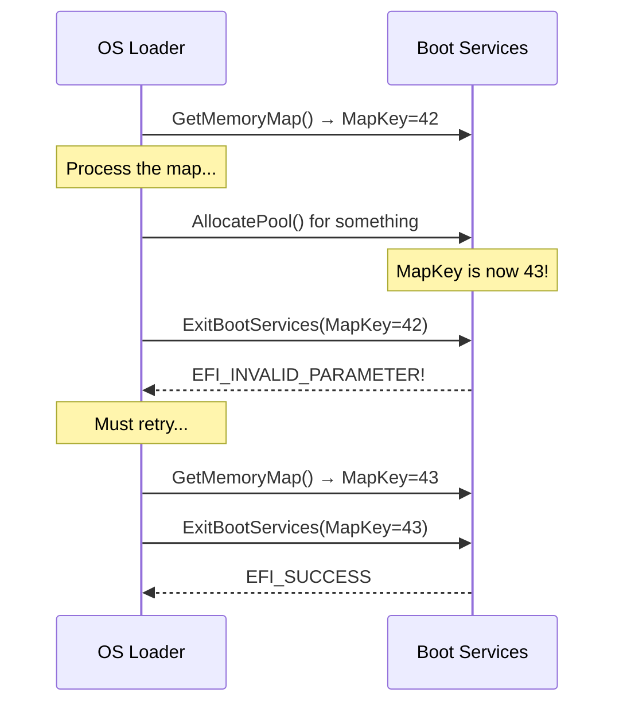

# Chapter 11: Memory Services
{: .fs-9 }

Master the UEFI memory model -- allocations, memory types, the memory map, and the pitfalls that catch even experienced firmware engineers.
{: .fs-6 .fw-300 }

---

## 11.1 The UEFI Memory Model

UEFI operates in flat physical address mode with paging optionally enabled. Unlike an operating system, there is no virtual memory in the traditional sense during boot. All pointers are physical addresses (or identity-mapped virtual addresses). This changes only after `ExitBootServices()`, when the OS may choose to call `SetVirtualAddressMap()` to establish its own mapping.


---

## 11.2 Memory Types

Every memory allocation in UEFI has a **type** that tells the system (and the OS) how the memory is used and when it can be reclaimed.

| Memory Type | Value | Description | Freed after ExitBootServices? |
|:---|:---|:---|:---|
| `EfiReservedMemoryType` | 0 | Not usable by UEFI or OS | No |
| `EfiLoaderCode` | 1 | Code loaded by the OS boot loader | OS decides |
| `EfiLoaderData` | 2 | Data allocated by the OS boot loader | OS decides |
| `EfiBootServicesCode` | 3 | UEFI Boot Service driver code | Yes |
| `EfiBootServicesData` | 4 | UEFI Boot Service driver data | Yes |
| `EfiRuntimeServicesCode` | 5 | UEFI Runtime driver code | No -- persists |
| `EfiRuntimeServicesData` | 6 | UEFI Runtime driver data | No -- persists |
| `EfiConventionalMemory` | 7 | Free, unallocated memory | N/A (already free) |
| `EfiUnusableMemory` | 8 | Memory with errors | No |
| `EfiACPIReclaimMemory` | 9 | ACPI tables -- OS may reclaim after parsing | OS decides |
| `EfiACPINvs` | 10 | ACPI NVS -- must not be reclaimed | No |
| `EfiMemoryMappedIO` | 11 | Memory-mapped I/O registers | No |
| `EfiMemoryMappedIOPortSpace` | 12 | I/O port space (IA-64 specific) | No |
| `EfiPalCode` | 13 | Processor Abstraction Layer (IA-64) | No |
| `EfiPersistentMemory` | 14 | Persistent memory (NVDIMM) | No |

{: .important }
> The most common types you will use in driver code are `EfiBootServicesData` (the default for `AllocatePool`) and `EfiRuntimeServicesData` (for data that must survive into the OS runtime). Choosing the wrong type can cause the OS to reclaim memory your runtime driver still needs, leading to crashes after boot.

---

## 11.3 Pool Allocation: AllocatePool / FreePool

Pool allocation is the UEFI equivalent of `malloc()` and `free()`. It is the simplest and most common allocation interface.

### AllocatePool

```c
EFI_STATUS
EFIAPI
gBS->AllocatePool (
  IN  EFI_MEMORY_TYPE  PoolType,
  IN  UINTN            Size,
  OUT VOID             **Buffer
  );
```

### FreePool

```c
EFI_STATUS
EFIAPI
gBS->FreePool (
  IN VOID  *Buffer
  );
```

### Basic usage

```c
CHAR16  *String;

Status = gBS->AllocatePool (
                EfiBootServicesData,
                256 * sizeof (CHAR16),
                (VOID **)&String
                );
if (EFI_ERROR (Status)) {
  return Status;
}

StrCpyS (String, 256, L"Hello from pool memory!");

// ... use String ...

gBS->FreePool (String);
```

### Library wrappers

The `MemoryAllocationLib` provides convenient wrappers that most EDK II / Project Mu code uses:

```c
#include <Library/MemoryAllocationLib.h>

// Allocate zeroed memory (EfiBootServicesData)
VOID *Buffer = AllocateZeroPool (1024);

// Allocate runtime memory
VOID *RtBuffer = AllocateRuntimeZeroPool (256);

// Allocate and copy
VOID *Copy = AllocateCopyPool (SourceSize, SourceBuffer);

// Free
FreePool (Buffer);
FreePool (RtBuffer);
FreePool (Copy);
```

| Library function | Memory type | Zeroed? |
|:---|:---|:---|
| `AllocatePool(Size)` | `EfiBootServicesData` | No |
| `AllocateZeroPool(Size)` | `EfiBootServicesData` | Yes |
| `AllocateRuntimePool(Size)` | `EfiRuntimeServicesData` | No |
| `AllocateRuntimeZeroPool(Size)` | `EfiRuntimeServicesData` | Yes |
| `AllocateCopyPool(Size, Src)` | `EfiBootServicesData` | Copied from Src |
| `AllocateRuntimeCopyPool(Size, Src)` | `EfiRuntimeServicesData` | Copied from Src |
| `ReallocatePool(Old, New, Ptr)` | `EfiBootServicesData` | Old data copied |

{: .warning }
> Pool allocations are **not** page-aligned. If you need page-aligned memory (for DMA buffers, page tables, or MMIO mappings), use `AllocatePages()` instead.

---

## 11.4 Page Allocation: AllocatePages / FreePages

Page allocation gives you memory in multiples of 4 KiB pages with control over the physical address.

### AllocatePages

```c
EFI_STATUS
EFIAPI
gBS->AllocatePages (
  IN     EFI_ALLOCATE_TYPE      Type,
  IN     EFI_MEMORY_TYPE        MemoryType,
  IN     UINTN                  Pages,
  IN OUT EFI_PHYSICAL_ADDRESS   *Memory
  );
```

The `Type` parameter controls where the memory comes from:

| AllocateType | Behavior |
|:---|:---|
| `AllocateAnyPages` | Allocate from anywhere in memory |
| `AllocateMaxAddress` | Allocate at or below the address in `*Memory` |
| `AllocateAddress` | Allocate at the exact address in `*Memory` |

### Examples

```c
// Allocate 4 pages (16 KiB) anywhere
EFI_PHYSICAL_ADDRESS  DmaBuffer;
Status = gBS->AllocatePages (
                AllocateAnyPages,
                EfiBootServicesData,
                4,    // Number of 4K pages
                &DmaBuffer
                );
if (!EFI_ERROR (Status)) {
  // DmaBuffer now contains a page-aligned physical address
  ZeroMem ((VOID *)(UINTN)DmaBuffer, 4 * EFI_PAGE_SIZE);
}
```

```c
// Allocate below 4 GB (required for some 32-bit DMA hardware)
EFI_PHYSICAL_ADDRESS  Below4G = 0xFFFFFFFF;
Status = gBS->AllocatePages (
                AllocateMaxAddress,
                EfiBootServicesData,
                1,
                &Below4G
                );
```

```c
// Allocate at a specific physical address (rare, for legacy compatibility)
EFI_PHYSICAL_ADDRESS  LegacyAddr = 0x000E0000;
Status = gBS->AllocatePages (
                AllocateAddress,
                EfiReservedMemoryType,
                16,   // 64 KiB
                &LegacyAddr
                );
```

### FreePages

```c
gBS->FreePages (DmaBuffer, 4);  // Free 4 pages starting at DmaBuffer
```

### Macro helpers

```c
// Convert a byte size to a page count (rounding up)
#define EFI_SIZE_TO_PAGES(Size)  (((Size) + EFI_PAGE_SIZE - 1) / EFI_PAGE_SIZE)

// Convert a page count to bytes
#define EFI_PAGES_TO_SIZE(Pages) ((Pages) * EFI_PAGE_SIZE)
```

---

## 11.5 The Memory Map

The memory map is a table describing every region of physical memory: its start address, size, type, and attributes. It is one of the most important data structures in the UEFI-to-OS handoff.

### GetMemoryMap

```c
EFI_STATUS
EFIAPI
gBS->GetMemoryMap (
  IN OUT UINTN                  *MemoryMapSize,
  OUT    EFI_MEMORY_DESCRIPTOR  *MemoryMap,
  OUT    UINTN                  *MapKey,
  OUT    UINTN                  *DescriptorSize,
  OUT    UINT32                 *DescriptorVersion
  );
```

### The memory descriptor

```c
typedef struct {
  UINT32                Type;        // EFI_MEMORY_TYPE
  EFI_PHYSICAL_ADDRESS  PhysicalStart;
  EFI_VIRTUAL_ADDRESS   VirtualStart;
  UINT64                NumberOfPages;
  UINT64                Attribute;   // Memory attributes (cacheability, etc.)
} EFI_MEMORY_DESCRIPTOR;
```

### Reading the memory map correctly

The memory map must be read using a two-call pattern because its size is not known in advance and the act of allocating memory changes the map:

```c
EFI_STATUS
GetAndPrintMemoryMap (
  VOID
  )
{
  EFI_STATUS             Status;
  UINTN                  MemoryMapSize = 0;
  EFI_MEMORY_DESCRIPTOR  *MemoryMap    = NULL;
  UINTN                  MapKey;
  UINTN                  DescriptorSize;
  UINT32                 DescriptorVersion;
  UINTN                  Index;
  UINTN                  EntryCount;

  //
  // First call: get the required buffer size
  //
  Status = gBS->GetMemoryMap (
                  &MemoryMapSize,
                  NULL,
                  &MapKey,
                  &DescriptorSize,
                  &DescriptorVersion
                  );
  // Expected: EFI_BUFFER_TOO_SMALL, MemoryMapSize now has the needed size

  //
  // Add extra space because AllocatePool will change the map
  //
  MemoryMapSize += 2 * DescriptorSize;

  Status = gBS->AllocatePool (
                  EfiBootServicesData,
                  MemoryMapSize,
                  (VOID **)&MemoryMap
                  );
  if (EFI_ERROR (Status)) {
    return Status;
  }

  //
  // Second call: get the actual map
  //
  Status = gBS->GetMemoryMap (
                  &MemoryMapSize,
                  MemoryMap,
                  &MapKey,
                  &DescriptorSize,
                  &DescriptorVersion
                  );
  if (EFI_ERROR (Status)) {
    gBS->FreePool (MemoryMap);
    return Status;
  }

  //
  // Iterate entries -- note: use DescriptorSize, not sizeof()
  //
  EntryCount = MemoryMapSize / DescriptorSize;

  Print (L"Memory Map: %u entries (descriptor size = %u)\n\n", EntryCount, DescriptorSize);
  Print (L"%-20s %-18s %-12s %-10s\n", L"Type", L"PhysicalStart", L"Pages", L"Attribute");
  Print (L"%-20s %-18s %-12s %-10s\n", L"----", L"-------------", L"-----", L"---------");

  for (Index = 0; Index < EntryCount; Index++) {
    EFI_MEMORY_DESCRIPTOR  *Desc;

    //
    // CRITICAL: walk by DescriptorSize, not sizeof(EFI_MEMORY_DESCRIPTOR)
    //
    Desc = (EFI_MEMORY_DESCRIPTOR *)((UINT8 *)MemoryMap + Index * DescriptorSize);

    Print (
      L"%-20u 0x%016lx %-12lu 0x%08lx\n",
      Desc->Type,
      Desc->PhysicalStart,
      Desc->NumberOfPages,
      Desc->Attribute
      );
  }

  gBS->FreePool (MemoryMap);
  return EFI_SUCCESS;
}
```

{: .important }
> **Never use `sizeof(EFI_MEMORY_DESCRIPTOR)` to iterate the memory map.** The firmware may use a larger descriptor than the structure defined in headers. Always use the `DescriptorSize` returned by `GetMemoryMap()`. This is one of the most common bugs in UEFI code.

### The MapKey

The `MapKey` is a snapshot identifier for the memory map. It changes every time the map changes (e.g., after any allocation or free). The key is critical for `ExitBootServices()` -- you must pass the exact `MapKey` that corresponds to the current state of the map.



---

## 11.6 Memory Attributes

Each memory descriptor includes an `Attribute` field with flags describing the cacheability and access permissions:

| Attribute | Value | Meaning |
|:---|:---|:---|
| `EFI_MEMORY_UC` | 0x0000000000000001 | Uncacheable |
| `EFI_MEMORY_WC` | 0x0000000000000002 | Write-combining |
| `EFI_MEMORY_WT` | 0x0000000000000004 | Write-through |
| `EFI_MEMORY_WB` | 0x0000000000000008 | Write-back (normal RAM) |
| `EFI_MEMORY_UCE` | 0x0000000000000010 | Uncacheable, exported |
| `EFI_MEMORY_WP` | 0x0000000000001000 | Write-protected |
| `EFI_MEMORY_RP` | 0x0000000000002000 | Read-protected |
| `EFI_MEMORY_XP` | 0x0000000000004000 | Execute-protected (NX) |
| `EFI_MEMORY_NV` | 0x0000000000008000 | Non-volatile (persistent) |
| `EFI_MEMORY_RUNTIME` | 0x8000000000000000 | Needs virtual mapping at runtime |

{: .note }
> The `EFI_MEMORY_RUNTIME` attribute is set on memory regions that Runtime Services code and data live in. The OS uses this flag to know which regions it must include in `SetVirtualAddressMap()`.

---

## 11.7 Practical Allocation Patterns

### Pattern 1: Allocating a structure

```c
MY_PRIVATE_DATA  *Private;

Private = AllocateZeroPool (sizeof (MY_PRIVATE_DATA));
if (Private == NULL) {
  return EFI_OUT_OF_RESOURCES;
}

Private->Signature = MY_PRIVATE_SIGNATURE;
// ... initialize other fields ...

// Later:
FreePool (Private);
```

### Pattern 2: Allocating an array

```c
UINTN   Count = 64;
UINT32  *Array;

Array = AllocateZeroPool (Count * sizeof (UINT32));
if (Array == NULL) {
  return EFI_OUT_OF_RESOURCES;
}

for (UINTN i = 0; i < Count; i++) {
  Array[i] = (UINT32)i;
}

// Grow the array
UINT32  *NewArray = ReallocatePool (
                      Count * sizeof (UINT32),
                      Count * 2 * sizeof (UINT32),
                      Array
                      );
if (NewArray == NULL) {
  FreePool (Array);
  return EFI_OUT_OF_RESOURCES;
}
Array = NewArray;
Count *= 2;
```

### Pattern 3: DMA buffer with physical address constraints

```c
EFI_PHYSICAL_ADDRESS  DmaBuffer;
UINTN                 Pages;

Pages = EFI_SIZE_TO_PAGES (DMA_BUFFER_SIZE);

//
// Some devices require buffers below 4 GiB
//
DmaBuffer = 0xFFFFFFFF;
Status = gBS->AllocatePages (
                AllocateMaxAddress,
                EfiBootServicesData,
                Pages,
                &DmaBuffer
                );
if (EFI_ERROR (Status)) {
  return Status;
}

//
// Program the device with the physical address
//
DeviceRegs->DmaBaseAddress = (UINT32)DmaBuffer;

// Later in Stop():
gBS->FreePages (DmaBuffer, Pages);
```

### Pattern 4: Runtime-persistent data

```c
//
// This buffer survives ExitBootServices() and is available
// to Runtime Services code.
//
MY_RUNTIME_DATA  *RtData;

RtData = AllocateRuntimeZeroPool (sizeof (MY_RUNTIME_DATA));
if (RtData == NULL) {
  return EFI_OUT_OF_RESOURCES;
}

//
// After SetVirtualAddressMap(), physical addresses become invalid.
// You must convert pointers in your runtime driver's
// SetVirtualAddressMap event handler:
//
VOID
EFIAPI
VirtualAddressChangeEvent (
  IN EFI_EVENT  Event,
  IN VOID       *Context
  )
{
  gRT->ConvertPointer (0, (VOID **)&mRtData);
  gRT->ConvertPointer (0, (VOID **)&mRtData->SomePointer);
}
```

---

## 11.8 Common Memory Bugs and Debugging

### Bug 1: Using sizeof instead of DescriptorSize for memory map iteration

```c
// BUG: Silent data corruption, reads wrong entries
for (i = 0; i < Count; i++) {
  Desc = &MemoryMap[i];  // WRONG if DescriptorSize > sizeof(EFI_MEMORY_DESCRIPTOR)
}

// FIX:
for (i = 0; i < Count; i++) {
  Desc = (EFI_MEMORY_DESCRIPTOR *)((UINT8 *)MemoryMap + i * DescriptorSize);
}
```

### Bug 2: Pool allocation after ExitBootServices

```c
// BUG: Boot Services are gone!
Status = gBS->AllocatePool (EfiRuntimeServicesData, 256, &Ptr);
// This will triple-fault or return garbage.

// FIX: Allocate all memory you need BEFORE ExitBootServices.
```

### Bug 3: Not adding extra space when getting the memory map for ExitBootServices

```c
// BUG: GetMemoryMap + AllocatePool changes the map, invalidating MapKey
gBS->GetMemoryMap (&Size, NULL, &Key, &DescSize, &DescVer);
gBS->AllocatePool (EfiLoaderData, Size, &Map);
gBS->GetMemoryMap (&Size, Map, &Key, &DescSize, &DescVer);
gBS->ExitBootServices (ImageHandle, Key);  // May fail!

// FIX: Add extra space and retry loop
Size += 2 * DescSize;
gBS->AllocatePool (EfiLoaderData, Size, &Map);
gBS->GetMemoryMap (&Size, Map, &Key, &DescSize, &DescVer);
Status = gBS->ExitBootServices (ImageHandle, Key);
if (Status == EFI_INVALID_PARAMETER) {
  // Map changed, get it again (no allocation this time -- reuse buffer)
  gBS->GetMemoryMap (&Size, Map, &Key, &DescSize, &DescVer);
  gBS->ExitBootServices (ImageHandle, Key);
}
```

### Bug 4: Memory leak in error paths

```c
// BUG: Memory leak if second allocation fails
Buffer1 = AllocatePool (Size1);
Buffer2 = AllocatePool (Size2);
if (Buffer2 == NULL) {
  return EFI_OUT_OF_RESOURCES;  // Buffer1 leaked!
}

// FIX: Clean up on all error paths
Buffer1 = AllocatePool (Size1);
if (Buffer1 == NULL) {
  return EFI_OUT_OF_RESOURCES;
}
Buffer2 = AllocatePool (Size2);
if (Buffer2 == NULL) {
  FreePool (Buffer1);
  return EFI_OUT_OF_RESOURCES;
}
```

### Bug 5: Using freed memory

```c
// BUG: Use-after-free
FreePool (Private);
Private->SomeField = 0;  // Undefined behavior!

// FIX: Clear the pointer after freeing
FreePool (Private);
Private = NULL;
```

### Bug 6: Forgetting ConvertPointer in runtime drivers

```c
// BUG: Runtime driver accesses physical address after virtual mapping
VOID *RuntimeData;  // Allocated with AllocateRuntimePool

// After OS calls SetVirtualAddressMap, this pointer is invalid.
// The driver crashes when a Runtime Service tries to use it.

// FIX: Register for the Virtual Address Change event
EFI_EVENT  VaChangeEvent;
gBS->CreateEventEx (
       EVT_NOTIFY_SIGNAL,
       TPL_NOTIFY,
       VirtualAddressChangeCallback,
       NULL,
       &gEfiEventVirtualAddressChangeGuid,
       &VaChangeEvent
       );

VOID EFIAPI
VirtualAddressChangeCallback (IN EFI_EVENT Event, IN VOID *Context)
{
  gRT->ConvertPointer (0, &RuntimeData);
}
```

---

## 11.9 Memory Map Visualization

A typical QEMU Q35 memory map might look like this:

```
Type                  PhysicalStart        Pages     Size
----                  -------------        -----     ----
EfiBootServicesCode   0x0000000000000000    1         4 KiB
EfiConventionalMemory 0x0000000000001000    159       636 KiB
EfiConventionalMemory 0x0000000000100000    1792      7 MiB
EfiBootServicesData   0x0000000000800000    256       1 MiB
EfiConventionalMemory 0x0000000000900000    30464     119 MiB
EfiBootServicesData   0x0000000007F00000    128       512 KiB
EfiBootServicesCode   0x0000000007F80000    64        256 KiB
EfiRuntimeServicesData 0x0000000007FC0000   32        128 KiB
EfiRuntimeServicesCode 0x0000000007FE0000   32        128 KiB
EfiReservedMemoryType 0x00000000FEC00000    1         4 KiB   (IOAPIC)
EfiReservedMemoryType 0x00000000FEE00000    1         4 KiB   (LAPIC)
EfiMemoryMappedIO     0x00000000FFE00000    512       2 MiB   (Firmware Flash)
```

{: .note }
> After `ExitBootServices()`, the OS reclaims all `EfiBootServicesCode` and `EfiBootServicesData` regions as free RAM. Only `EfiRuntimeServices*`, `EfiACPINvs`, `EfiReservedMemoryType`, and `EfiPersistentMemory` regions must be preserved.

---

## 11.10 Debugging Memory Issues

### Using the UEFI Shell

```
Shell> memmap          # Display the current memory map
Shell> mem 0x7FC0000   # Dump raw memory at an address
Shell> dmem 0x7FC0000 100  # Dump 0x100 bytes
```

### Using DEBUG macros

```c
DEBUG ((DEBUG_INFO, "Allocated %u bytes at %p\n", Size, Buffer));
DEBUG ((DEBUG_INFO, "Memory map has %u entries\n", MapSize / DescSize));
```

### Using the heap guard feature (Project Mu)

Project Mu and EDK II support heap guard features that can detect buffer overflows and use-after-free bugs:

```ini
# In your DSC file:
[PcdsFixedAtBuild]
  gEfiMdeModulePkgTokenSpaceGuid.PcdHeapGuardPropertyMask|0x0F
  gEfiMdeModulePkgTokenSpaceGuid.PcdHeapGuardPageType|0x7FF4
  gEfiMdeModulePkgTokenSpaceGuid.PcdHeapGuardPoolType|0x7FF4
```

These PCDs enable guard pages around allocations. When code writes past the end of a buffer or accesses freed memory, the CPU triggers a page fault, making the bug immediately visible.

---

## Summary

UEFI memory services provide two allocation interfaces -- pool (variable-size, like `malloc`) and page (page-aligned, fixed granularity) -- each tagged with a memory type that determines the lifetime of the allocation. The memory map is the authoritative description of physical memory and is critical for the `ExitBootServices` transition. Understanding memory types, the two-call `GetMemoryMap` pattern, and the `DescriptorSize` iteration rule will prevent the majority of memory-related bugs in your firmware code.

In the next chapter, we will explore Boot Services and Runtime Services in full -- the two service tables that define everything UEFI code can do.

---

{: .tip }
> **Hands-on exercise:** Write a UEFI application that retrieves the memory map and calculates summary statistics: total usable RAM, total runtime-reserved RAM, largest contiguous free region, and number of MMIO regions. Print the results in a formatted table. Test it in QEMU with different memory sizes by passing `-m 256M` vs `-m 2G` to see how the map changes.
