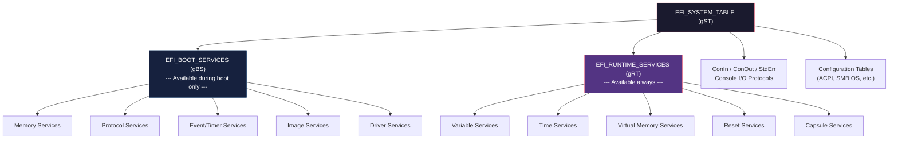
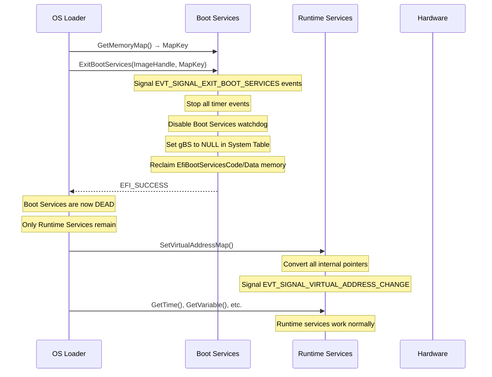
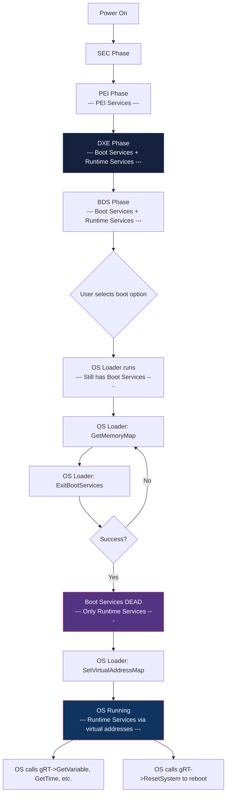

# Chapter 12: Boot and Runtime Services
{: .fs-9 }

Explore the two service tables that define everything UEFI firmware can do -- and understand the critical transition between them.
{: .fs-6 .fw-300 }

---

## 12.1 The Two Service Tables

UEFI defines exactly two service tables, both accessible through the System Table:

```c
// These global pointers are set up by UefiBootServicesTableLib
extern EFI_BOOT_SERVICES     *gBS;   // Boot Services
extern EFI_RUNTIME_SERVICES  *gRT;   // Runtime Services
extern EFI_SYSTEM_TABLE      *gST;   // System Table (contains both)
```



---

## 12.2 Boot Services Reference

Boot Services are available from the moment the DXE phase begins until `ExitBootServices()` is called. After that, every function pointer in `gBS` becomes invalid.

### 12.2.1 Memory Services

| Function | Purpose |
|:---|:---|
| `AllocatePages()` | Allocate page-aligned memory |
| `FreePages()` | Free page-aligned memory |
| `AllocatePool()` | Allocate arbitrary-size memory |
| `FreePool()` | Free pool memory |
| `GetMemoryMap()` | Get the current memory map |

These were covered in depth in Chapter 11.

### 12.2.2 Protocol Handler Services

| Function | Purpose |
|:---|:---|
| `InstallProtocolInterface()` | Add a protocol to a handle |
| `UninstallProtocolInterface()` | Remove a protocol from a handle |
| `ReinstallProtocolInterface()` | Replace a protocol interface |
| `RegisterProtocolNotify()` | Get notified when a protocol is installed |
| `LocateHandle()` | Find handles with a protocol |
| `LocateHandleBuffer()` | Find handles (allocates buffer for you) |
| `HandleProtocol()` | Get a protocol from a handle (legacy) |
| `OpenProtocol()` | Get a protocol with access tracking |
| `CloseProtocol()` | Release a protocol |
| `OpenProtocolInformation()` | Query who has a protocol open |
| `LocateProtocol()` | Find the first instance of a protocol |
| `InstallMultipleProtocolInterfaces()` | Atomically install several protocols |
| `UninstallMultipleProtocolInterfaces()` | Atomically remove several protocols |
| `ProtocolsPerHandle()` | List all protocols on a handle |
| `LocateDevicePath()` | Find a handle by device path |

These were covered in Chapter 10.

### 12.2.3 Event Services

| Function | Purpose |
|:---|:---|
| `CreateEvent()` | Create a new event |
| `CreateEventEx()` | Create an event in an event group |
| `SetTimer()` | Arm a timer event |
| `WaitForEvent()` | Block until one of several events signals |
| `SignalEvent()` | Manually signal an event |
| `CloseEvent()` | Destroy an event |
| `CheckEvent()` | Non-blocking check if an event is signaled |

### 12.2.4 Image Services

| Function | Purpose |
|:---|:---|
| `LoadImage()` | Load a PE/COFF image into memory |
| `StartImage()` | Call the entry point of a loaded image |
| `UnloadImage()` | Unload an image from memory |
| `Exit()` | Return from an image (used by applications) |
| `ExitBootServices()` | Transition to runtime -- the point of no return |

### 12.2.5 Driver Support Services

| Function | Purpose |
|:---|:---|
| `ConnectController()` | Connect drivers to a controller |
| `DisconnectController()` | Disconnect drivers from a controller |

### 12.2.6 Miscellaneous Services

| Function | Purpose |
|:---|:---|
| `SetWatchdogTimer()` | Set/disable the watchdog timer |
| `Stall()` | Busy-wait for a specified number of microseconds |
| `CopyMem()` | Memory copy (handles overlapping regions) |
| `SetMem()` | Fill memory with a byte value |
| `GetNextMonotonicCount()` | Get a monotonically increasing counter |
| `InstallConfigurationTable()` | Add/remove a configuration table entry |
| `CalculateCrc32()` | Calculate a CRC32 checksum |

---

## 12.3 Events and Timers

Events are UEFI's mechanism for asynchronous notification, periodic callbacks, and synchronization. They are simpler than OS-level threading -- UEFI is single-threaded and events fire only at safe points (TPL transitions).

### 12.3.1 Creating Events

```c
EFI_STATUS
EFIAPI
gBS->CreateEvent (
  IN  UINT32            Type,
  IN  EFI_TPL           NotifyTpl,
  IN  EFI_EVENT_NOTIFY  NotifyFunction OPTIONAL,
  IN  VOID              *NotifyContext OPTIONAL,
  OUT EFI_EVENT         *Event
  );
```

Event types:

| Type flag | Meaning |
|:---|:---|
| `EVT_TIMER` | Can be armed with `SetTimer()` |
| `EVT_NOTIFY_SIGNAL` | Notification function called when signaled |
| `EVT_NOTIFY_WAIT` | Notification function called when checked/waited |
| `EVT_SIGNAL_EXIT_BOOT_SERVICES` | Signaled when `ExitBootServices()` is called |
| `EVT_SIGNAL_VIRTUAL_ADDRESS_CHANGE` | Signaled when `SetVirtualAddressMap()` is called |

### 12.3.2 Timer Events

```c
EFI_STATUS
EFIAPI
gBS->SetTimer (
  IN EFI_EVENT        Event,
  IN EFI_TIMER_DELAY  Type,
  IN UINT64           TriggerTime   // In 100-nanosecond units
  );
```

| Timer type | Behavior |
|:---|:---|
| `TimerCancel` | Cancel a pending timer |
| `TimerPeriodic` | Signal repeatedly at the specified interval |
| `TimerRelative` | Signal once after the specified delay |

### 12.3.3 Complete Timer Example

This example creates a periodic timer that fires every second and prints a message:

```c
#include <Uefi.h>
#include <Library/UefiBootServicesTableLib.h>
#include <Library/UefiLib.h>

STATIC UINTN  mTickCount = 0;

VOID
EFIAPI
TimerCallback (
  IN EFI_EVENT  Event,
  IN VOID       *Context
  )
{
  mTickCount++;
  //
  // NOTE: Print() is not safe at elevated TPL in all implementations.
  // Use DEBUG() in production code. This works for demonstration.
  //
}

EFI_STATUS
EFIAPI
UefiMain (
  IN EFI_HANDLE        ImageHandle,
  IN EFI_SYSTEM_TABLE  *SystemTable
  )
{
  EFI_STATUS  Status;
  EFI_EVENT   TimerEvent;
  EFI_EVENT   WaitEvents[2];
  UINTN       EventIndex;
  EFI_EVENT   KeyEvent;

  //
  // Create a periodic timer event (fires every 1 second)
  // 10,000,000 * 100ns = 1 second
  //
  Status = gBS->CreateEvent (
                  EVT_TIMER | EVT_NOTIFY_SIGNAL,
                  TPL_CALLBACK,
                  TimerCallback,
                  NULL,
                  &TimerEvent
                  );
  if (EFI_ERROR (Status)) {
    Print (L"Failed to create timer event: %r\n", Status);
    return Status;
  }

  Status = gBS->SetTimer (
                  TimerEvent,
                  TimerPeriodic,
                  10000000  // 1 second in 100ns units
                  );
  if (EFI_ERROR (Status)) {
    gBS->CloseEvent (TimerEvent);
    return Status;
  }

  Print (L"Timer running. Press any key to stop.\n\n");

  //
  // Wait for a keypress while the timer runs in the background
  //
  KeyEvent = gST->ConIn->WaitForKey;

  while (TRUE) {
    WaitEvents[0] = KeyEvent;
    WaitEvents[1] = TimerEvent;

    Status = gBS->WaitForEvent (2, WaitEvents, &EventIndex);

    Print (L"\rTicks: %u  ", mTickCount);

    if (EventIndex == 0) {
      //
      // Key was pressed -- consume the keystroke and exit
      //
      EFI_INPUT_KEY  Key;
      gST->ConIn->ReadKeyStroke (gST->ConIn, &Key);
      break;
    }
  }

  //
  // Clean up
  //
  gBS->SetTimer (TimerEvent, TimerCancel, 0);
  gBS->CloseEvent (TimerEvent);

  Print (L"\nDone. Total ticks: %u\n", mTickCount);
  return EFI_SUCCESS;
}
```

### 12.3.4 Task Priority Levels (TPL)

UEFI uses Task Priority Levels to prevent reentrancy:

| TPL | Value | Purpose |
|:---|:---|:---|
| `TPL_APPLICATION` | 4 | Normal execution level |
| `TPL_CALLBACK` | 8 | Timer callbacks and protocol notifications |
| `TPL_NOTIFY` | 16 | Higher-priority notifications |
| `TPL_HIGH_LEVEL` | 31 | Interrupts disabled -- never use for event notifications |

```c
// Raise TPL to prevent timer callbacks during a critical section
EFI_TPL  OldTpl;

OldTpl = gBS->RaiseTPL (TPL_NOTIFY);

// Critical section -- no callbacks can fire here
SharedData->Counter++;

gBS->RestoreTPL (OldTpl);
```

{: .warning }
> Never call blocking functions (`WaitForEvent`, `Stall` for long periods) at elevated TPL. This will deadlock the system because the events that would unblock you cannot fire.

### 12.3.5 Event Groups with CreateEventEx

`CreateEventEx` allows multiple events to be signaled together as a group:

```c
EFI_EVENT  ReadyToBootEvent;

Status = gBS->CreateEventEx (
                EVT_NOTIFY_SIGNAL,
                TPL_CALLBACK,
                ReadyToBootCallback,
                NULL,
                &gEfiEventReadyToBootGuid,
                &ReadyToBootEvent
                );
```

Important event groups defined by the specification:

| Event Group GUID | When signaled |
|:---|:---|
| `gEfiEventReadyToBootGuid` | Just before the boot option is launched |
| `gEfiEventAfterReadyToBootGuid` | After ReadyToBoot processing |
| `gEfiEventExitBootServicesGuid` | When `ExitBootServices()` is called |
| `gEfiEventVirtualAddressChangeGuid` | When `SetVirtualAddressMap()` is called |
| `gEfiEventMemoryMapChangeGuid` | When the memory map changes |

---

## 12.4 WaitForEvent -- Blocking Synchronization

`WaitForEvent` blocks the caller until one of the specified events is signaled:

```c
EFI_STATUS
EFIAPI
gBS->WaitForEvent (
  IN  UINTN      NumberOfEvents,
  IN  EFI_EVENT  *Event,
  OUT UINTN      *Index
  );
```

{: .note }
> `WaitForEvent` can only be called at `TPL_APPLICATION`. It will return `EFI_UNSUPPORTED` if the current TPL is higher. This prevents deadlocks.

### Waiting for multiple sources

```c
EFI_EVENT  Events[3];
UINTN      EventIndex;

Events[0] = gST->ConIn->WaitForKey;  // Keyboard input
Events[1] = NetworkReadyEvent;        // Network data available
Events[2] = TimeoutEvent;             // 30-second timeout

Status = gBS->WaitForEvent (3, Events, &EventIndex);

switch (EventIndex) {
  case 0:
    HandleKeyInput ();
    break;
  case 1:
    HandleNetworkData ();
    break;
  case 2:
    Print (L"Timed out waiting for input.\n");
    break;
}
```

---

## 12.5 Runtime Services Reference

Runtime Services survive `ExitBootServices()` and are available to the operating system for the lifetime of the platform. The OS calls them through the Runtime Services table, which is part of the System Table passed to `ExitBootServices()`.

### 12.5.1 Variable Services

| Function | Purpose |
|:---|:---|
| `GetVariable()` | Read a named variable |
| `SetVariable()` | Write/create/delete a named variable |
| `GetNextVariableName()` | Enumerate all variables |
| `QueryVariableInfo()` | Get storage space information |

### 12.5.2 Time Services

| Function | Purpose |
|:---|:---|
| `GetTime()` | Read the real-time clock |
| `SetTime()` | Set the real-time clock |
| `GetWakeupTime()` | Read the RTC alarm |
| `SetWakeupTime()` | Set/disable the RTC alarm |

### 12.5.3 Virtual Memory Services

| Function | Purpose |
|:---|:---|
| `SetVirtualAddressMap()` | Provide the runtime virtual mapping (called once by OS) |
| `ConvertPointer()` | Convert a physical pointer to its virtual equivalent |

### 12.5.4 Reset Services

| Function | Purpose |
|:---|:---|
| `ResetSystem()` | Reset or shut down the platform |

### 12.5.5 Capsule Services

| Function | Purpose |
|:---|:---|
| `UpdateCapsule()` | Pass a capsule (firmware update, etc.) to the platform |
| `QueryCapsuleCapabilities()` | Query what capsule types are supported |

---

## 12.6 Variable Services in Detail

Variables are UEFI's persistent key-value store. They survive reboots and are the primary mechanism for storing configuration (boot order, Secure Boot keys, OEM settings).

### Reading a variable

```c
UINTN   DataSize = 0;
VOID    *Data    = NULL;
UINT32  Attributes;

//
// First call: get the required buffer size
//
Status = gRT->GetVariable (
                L"BootOrder",
                &gEfiGlobalVariableGuid,
                &Attributes,
                &DataSize,
                NULL
                );
if (Status == EFI_BUFFER_TOO_SMALL) {
  Data = AllocatePool (DataSize);
  if (Data == NULL) {
    return EFI_OUT_OF_RESOURCES;
  }

  Status = gRT->GetVariable (
                  L"BootOrder",
                  &gEfiGlobalVariableGuid,
                  &Attributes,
                  &DataSize,
                  Data
                  );
}

if (!EFI_ERROR (Status)) {
  UINT16  *BootOrder = (UINT16 *)Data;
  UINTN   Count = DataSize / sizeof (UINT16);

  Print (L"Boot order (%u entries):", Count);
  for (UINTN i = 0; i < Count; i++) {
    Print (L" %04x", BootOrder[i]);
  }
  Print (L"\n");
}

if (Data != NULL) {
  FreePool (Data);
}
```

### Writing a variable

```c
UINT32  MyConfig = 0x12345678;

Status = gRT->SetVariable (
                L"MyConfigValue",
                &gMyVendorGuid,
                EFI_VARIABLE_NON_VOLATILE |
                  EFI_VARIABLE_BOOTSERVICE_ACCESS |
                  EFI_VARIABLE_RUNTIME_ACCESS,
                sizeof (UINT32),
                &MyConfig
                );
if (EFI_ERROR (Status)) {
  DEBUG ((DEBUG_ERROR, "Failed to set variable: %r\n", Status));
}
```

### Variable attributes

| Attribute | Value | Meaning |
|:---|:---|:---|
| `EFI_VARIABLE_NON_VOLATILE` | 0x01 | Persists across reboots |
| `EFI_VARIABLE_BOOTSERVICE_ACCESS` | 0x02 | Accessible during boot |
| `EFI_VARIABLE_RUNTIME_ACCESS` | 0x04 | Accessible after ExitBootServices |
| `EFI_VARIABLE_AUTHENTICATED_WRITE_ACCESS` | 0x10 | Deprecated -- do not use |
| `EFI_VARIABLE_TIME_BASED_AUTHENTICATED_WRITE_ACCESS` | 0x20 | Requires signed updates |
| `EFI_VARIABLE_APPEND_WRITE` | 0x40 | Append data instead of overwrite |

### Deleting a variable

Set it with zero `DataSize` and `NULL` data:

```c
Status = gRT->SetVariable (
                L"MyConfigValue",
                &gMyVendorGuid,
                0,      // Attributes
                0,      // DataSize = 0
                NULL    // Data = NULL
                );
```

### Enumerating all variables

```c
CHAR16    VariableName[256];
EFI_GUID  VendorGuid;
UINTN     NameSize;

VariableName[0] = L'\0';

while (TRUE) {
  NameSize = sizeof (VariableName);
  Status = gRT->GetNextVariableName (&NameSize, VariableName, &VendorGuid);
  if (Status == EFI_NOT_FOUND) {
    break;  // End of variable list
  }
  if (EFI_ERROR (Status)) {
    break;  // Error
  }

  Print (
    L"%g : %s\n",
    &VendorGuid,
    VariableName
    );
}
```

---

## 12.7 The ExitBootServices Transition

`ExitBootServices()` is the single most critical moment in the boot process. It is the point where the operating system takes full ownership of the platform.

```c
EFI_STATUS
EFIAPI
gBS->ExitBootServices (
  IN EFI_HANDLE  ImageHandle,
  IN UINTN       MapKey
  );
```

### What happens during ExitBootServices



### The ExitBootServices contract

After a successful `ExitBootServices()`:

1. **All Boot Services are gone.** Calling any function through `gBS` is undefined behavior (typically a crash).
2. **All timer events are stopped.** No more callbacks.
3. **All `EfiBootServicesCode` and `EfiBootServicesData` memory may be reclaimed.** Do not touch it.
4. **Console I/O protocols are gone.** No more `Print()`.
5. **Runtime Services remain.** `gRT->GetVariable()`, `gRT->GetTime()`, `gRT->ResetSystem()`, etc. still work.
6. **Interrupts are disabled.** The OS must set up its own IDT before re-enabling them.

### Correct ExitBootServices pattern

The correct implementation must handle the case where the memory map changes between `GetMemoryMap` and `ExitBootServices`:

```c
EFI_STATUS
DoExitBootServices (
  IN EFI_HANDLE  ImageHandle
  )
{
  EFI_STATUS             Status;
  UINTN                  MemMapSize  = 0;
  EFI_MEMORY_DESCRIPTOR  *MemMap     = NULL;
  UINTN                  MapKey;
  UINTN                  DescSize;
  UINT32                 DescVer;

  //
  // Step 1: Get the memory map size
  //
  Status = gBS->GetMemoryMap (&MemMapSize, NULL, &MapKey, &DescSize, &DescVer);
  ASSERT (Status == EFI_BUFFER_TOO_SMALL);

  //
  // Step 2: Allocate buffer with extra room
  //
  MemMapSize += 2 * DescSize;
  Status = gBS->AllocatePool (EfiLoaderData, MemMapSize, (VOID **)&MemMap);
  ASSERT_EFI_ERROR (Status);

  //
  // Step 3: Get the memory map
  //
  Status = gBS->GetMemoryMap (&MemMapSize, MemMap, &MapKey, &DescSize, &DescVer);
  ASSERT_EFI_ERROR (Status);

  //
  // Step 4: Call ExitBootServices with the current MapKey
  //
  Status = gBS->ExitBootServices (ImageHandle, MapKey);

  if (Status == EFI_INVALID_PARAMETER) {
    //
    // MapKey mismatch -- memory map changed.
    // Get the map again WITHOUT allocating (reuse the buffer).
    //
    Status = gBS->GetMemoryMap (&MemMapSize, MemMap, &MapKey, &DescSize, &DescVer);
    ASSERT_EFI_ERROR (Status);

    //
    // Retry ExitBootServices
    //
    Status = gBS->ExitBootServices (ImageHandle, MapKey);
  }

  //
  // If we get here with success, Boot Services are dead.
  // Do NOT call FreePool, Print, or any Boot Service.
  //
  return Status;
}
```

{: .important }
> After a **failed** `ExitBootServices()`, Boot Services are still available but in a degraded state. You can call `GetMemoryMap` and retry, but you must not perform any allocations between the second `GetMemoryMap` and the retry. This is why the retry reuses the existing buffer.

---

## 12.8 Service Availability Matrix

This table shows which services are available in each phase of the UEFI boot process:

| Service | SEC | PEI | DXE (Boot) | After ExitBootServices | After SetVirtualAddressMap |
|:---|:---:|:---:|:---:|:---:|:---:|
| **Boot Services (gBS)** | -- | -- | Yes | **No** | **No** |
| `AllocatePool` / `FreePool` | -- | -- | Yes | No | No |
| `LocateProtocol` | -- | -- | Yes | No | No |
| `InstallProtocolInterface` | -- | -- | Yes | No | No |
| `CreateEvent` / `SetTimer` | -- | -- | Yes | No | No |
| `LoadImage` / `StartImage` | -- | -- | Yes | No | No |
| `ExitBootServices` | -- | -- | Yes (once) | No | No |
| **Runtime Services (gRT)** | -- | -- | Yes | Yes | Yes |
| `GetVariable` / `SetVariable` | -- | -- | Yes | Yes | Yes |
| `GetTime` / `SetTime` | -- | -- | Yes | Yes | Yes |
| `ResetSystem` | -- | -- | Yes | Yes | Yes |
| `UpdateCapsule` | -- | -- | Yes | Yes | Yes |
| `SetVirtualAddressMap` | -- | -- | No | Yes (once) | No |
| `ConvertPointer` | -- | -- | No | During SVAM only | No |
| **PEI Services** | -- | Yes | No | No | No |
| `InstallPpi` / `LocatePpi` | -- | Yes | No | No | No |
| `GetHobList` | -- | Yes | No | No | No |

{: .note }
> PEI Services are not part of the UEFI specification proper -- they come from the PI (Platform Initialization) specification. They exist only during the PEI phase and are replaced by DXE/Boot Services when the DXE Core takes over.

---

## 12.9 ResetSystem -- Resetting the Platform

`ResetSystem` is a Runtime Service that can be called at any time (boot or runtime):

```c
VOID
EFIAPI
gRT->ResetSystem (
  IN EFI_RESET_TYPE  ResetType,
  IN EFI_STATUS      ResetStatus,
  IN UINTN           DataSize,
  IN VOID            *ResetData OPTIONAL
  );
```

| Reset type | Behavior |
|:---|:---|
| `EfiResetCold` | Full power cycle (equivalent to unplugging and re-plugging) |
| `EfiResetWarm` | CPU reset without power cycle (memory may be preserved) |
| `EfiResetShutdown` | Power off the system |
| `EfiResetPlatformSpecific` | Platform-defined reset with GUID-tagged data |

```c
// Reboot the system
gRT->ResetSystem (EfiResetCold, EFI_SUCCESS, 0, NULL);

// Shutdown
gRT->ResetSystem (EfiResetShutdown, EFI_SUCCESS, 0, NULL);

// Warm reset with a reason string
gRT->ResetSystem (
       EfiResetWarm,
       EFI_SUCCESS,
       StrSize (L"Firmware update applied"),
       L"Firmware update applied"
       );
```

{: .warning }
> `ResetSystem` does not return. If it does, the platform firmware is broken. Always treat the call as a termination point.

---

## 12.10 Time Services

The UEFI time services provide access to the real-time clock (RTC):

```c
EFI_TIME  Time;
EFI_TIME_CAPABILITIES  Capabilities;

Status = gRT->GetTime (&Time, &Capabilities);
if (!EFI_ERROR (Status)) {
  Print (
    L"Current time: %04u-%02u-%02u %02u:%02u:%02u\n",
    Time.Year, Time.Month, Time.Day,
    Time.Hour, Time.Minute, Time.Second
    );
  Print (
    L"RTC resolution: %u (1=1s, 10=100ms, etc.)\n",
    Capabilities.Resolution
    );
  Print (
    L"RTC accuracy: %u ppm\n",
    Capabilities.Accuracy
    );
}
```

The `EFI_TIME` structure:

```c
typedef struct {
  UINT16  Year;       // 1900 - 9999
  UINT8   Month;      // 1 - 12
  UINT8   Day;        // 1 - 31
  UINT8   Hour;       // 0 - 23
  UINT8   Minute;     // 0 - 59
  UINT8   Second;     // 0 - 59
  UINT8   Pad1;
  UINT32  Nanosecond; // 0 - 999,999,999
  INT16   TimeZone;   // -1440 to 1440, or 2047 = unspecified
  UINT8   Daylight;   // Daylight saving flags
  UINT8   Pad2;
} EFI_TIME;
```

### Setting a wake alarm

```c
EFI_TIME  WakeTime;

ZeroMem (&WakeTime, sizeof (WakeTime));
WakeTime.Year   = 2026;
WakeTime.Month  = 3;
WakeTime.Day    = 23;
WakeTime.Hour   = 6;
WakeTime.Minute = 0;
WakeTime.Second = 0;

Status = gRT->SetWakeupTime (TRUE, &WakeTime);
if (!EFI_ERROR (Status)) {
  Print (L"Wake alarm set for 2026-03-23 06:00:00\n");
}
```

---

## 12.11 Capsule Services

Capsules provide a mechanism for passing data across a system reset. The primary use case is firmware updates:

```c
EFI_CAPSULE_HEADER  *CapsuleHeaderArray[1];
UINT64              MaxCapsuleSize;
EFI_RESET_TYPE      ResetType;

//
// Query capabilities first
//
Status = gRT->QueryCapsuleCapabilities (
                CapsuleHeaderArray,
                1,
                &MaxCapsuleSize,
                &ResetType
                );
if (!EFI_ERROR (Status)) {
  Print (L"Max capsule size: %lu bytes\n", MaxCapsuleSize);
  Print (L"Required reset type: %u\n", ResetType);
}

//
// To deliver a capsule (e.g., firmware update):
//
Status = gRT->UpdateCapsule (
                CapsuleHeaderArray,
                1,                    // CapsuleCount
                (EFI_PHYSICAL_ADDRESS)(UINTN)ScatterGatherList
                );
// UpdateCapsule may trigger a reset or defer to next boot
```

---

## 12.12 Putting It All Together: Boot Flow with Services



---

## 12.13 Common Patterns and Pitfalls

### Pattern: ReadyToBoot event handler

Many drivers need to perform last-minute setup before the OS boots (lock security registers, finalize configuration):

```c
VOID
EFIAPI
OnReadyToBoot (
  IN EFI_EVENT  Event,
  IN VOID       *Context
  )
{
  //
  // Lock down flash write protection
  //
  LockSpiFlash ();

  //
  // Final SMBIOS table update
  //
  UpdateSmbiosEntries ();

  //
  // Close the event so we're not called again
  //
  gBS->CloseEvent (Event);
}

// During initialization:
EFI_EVENT  Event;
Status = gBS->CreateEventEx (
                EVT_NOTIFY_SIGNAL,
                TPL_CALLBACK,
                OnReadyToBoot,
                NULL,
                &gEfiEventReadyToBootGuid,
                &Event
                );
```

### Pattern: ExitBootServices notification in a runtime driver

```c
VOID
EFIAPI
OnExitBootServices (
  IN EFI_EVENT  Event,
  IN VOID       *Context
  )
{
  //
  // Boot Services are about to die. Save any state we need.
  // After this, we cannot allocate memory or use protocols.
  //
  mAtRuntime = TRUE;
}

// Register during entry point:
EFI_EVENT  ExitBsEvent;
gBS->CreateEventEx (
       EVT_NOTIFY_SIGNAL,
       TPL_CALLBACK,
       OnExitBootServices,
       NULL,
       &gEfiEventExitBootServicesGuid,
       &ExitBsEvent
       );
```

### Pitfall: Calling Print() after ExitBootServices

```c
// FATAL: Print() uses Boot Services (LocateProtocol, ConOut, etc.)
gBS->ExitBootServices (ImageHandle, MapKey);
Print (L"Boot services exited!\n");  // CRASH!

// Use serial port or direct framebuffer writes after ExitBootServices
```

### Pitfall: Forgetting SetVirtualAddressMap in runtime driver

If a runtime driver stores pointers to its data and the OS calls `SetVirtualAddressMap()`, those physical pointers become invalid. The driver must register for the virtual address change event and convert all its internal pointers.

---

{: .note }
> **Complete source code**: The full working example for this chapter is available at [`examples/UefiMuGuidePkg/ServicesExample/`]({{ site.baseurl }}/examples/UefiMuGuidePkg/ServicesExample/).

## Summary

Boot Services and Runtime Services are the two pillars of the UEFI service architecture. Boot Services provide the rich environment needed during firmware initialization -- memory management, protocol handling, event systems, and image loading. Runtime Services provide the minimal set of services that persist into the operating system -- variables, time, reset, and capsules. The `ExitBootServices()` transition is the bright line between these two worlds, and understanding it correctly is essential for writing reliable firmware and OS loaders.

Together with the driver model (Chapter 9), protocols and handles (Chapter 10), and memory services (Chapter 11), this chapter completes the foundation of UEFI core concepts. You now have the knowledge to understand, write, and debug any UEFI firmware module.

---

{: .tip }
> **Hands-on exercise:** Write a UEFI application that (1) creates a periodic timer counting up every 100ms, (2) waits for a keypress, (3) reads the current time from `GetTime()` at start and at key press, (4) calculates elapsed wall-clock time, and (5) compares it against the tick count to verify timer accuracy. Print the results. This exercise combines event services, timer services, and runtime time services.
