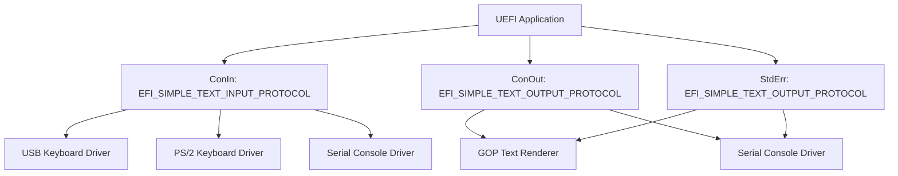

# Chapter 13: Console I/O
{: .fs-9 }

Read keystrokes, display colored text, and build interactive menus using the UEFI console protocols.
{: .fs-6 .fw-300 }

---

## 13.1 Console Architecture Overview

UEFI provides two primary console protocols that abstract keyboard input and text display from the underlying hardware. Whether the console is a physical VGA text-mode display, a serial port, or a graphical text renderer, these protocols present a uniform interface.



The UEFI System Table provides three pre-configured console pointers:

| System Table Field | Protocol | Purpose |
|---|---|---|
| `ConIn` | `EFI_SIMPLE_TEXT_INPUT_PROTOCOL` | Keyboard input |
| `ConOut` | `EFI_SIMPLE_TEXT_OUTPUT_PROTOCOL` | Standard text output |
| `StdErr` | `EFI_SIMPLE_TEXT_OUTPUT_PROTOCOL` | Error text output |

You never need to locate these protocols manually -- they are available directly through `gST` (the global System Table pointer provided by `UefiLib`).

---

## 13.2 Simple Text Output Protocol

The `EFI_SIMPLE_TEXT_OUTPUT_PROTOCOL` provides functions to display text, set colors, clear the screen, and control the cursor.

### 13.2.1 Protocol Interface

```c
typedef struct _EFI_SIMPLE_TEXT_OUTPUT_PROTOCOL {
    EFI_TEXT_RESET             Reset;
    EFI_TEXT_STRING            OutputString;
    EFI_TEXT_TEST_STRING       TestString;
    EFI_TEXT_QUERY_MODE        QueryMode;
    EFI_TEXT_SET_MODE          SetMode;
    EFI_TEXT_SET_ATTRIBUTE     SetAttribute;
    EFI_TEXT_CLEAR_SCREEN      ClearScreen;
    EFI_TEXT_SET_CURSOR_POSITION SetCursorPosition;
    EFI_TEXT_ENABLE_CURSOR     EnableCursor;
    SIMPLE_TEXT_OUTPUT_MODE    *Mode;
} EFI_SIMPLE_TEXT_OUTPUT_PROTOCOL;
```

### 13.2.2 Displaying Text with OutputString

`OutputString` writes a null-terminated Unicode (UCS-2) string to the console. It supports a subset of control characters:

| Character | Code | Effect |
|---|---|---|
| Newline | `\n` | Move cursor to beginning of next line |
| Carriage Return | `\r` | Move cursor to beginning of current line |
| Backspace | `\b` | Move cursor back one column |
| Tab | `\t` | Move cursor to next tab stop (8 columns) |

```c
#include <Uefi.h>
#include <Library/UefiLib.h>
#include <Library/UefiBootServicesTableLib.h>

EFI_STATUS
EFIAPI
UefiMain(
    IN EFI_HANDLE        ImageHandle,
    IN EFI_SYSTEM_TABLE  *SystemTable
    )
{
    EFI_STATUS Status;

    //
    // OutputString requires UCS-2 (wide) strings -- use the L"" prefix.
    //
    Status = gST->ConOut->OutputString(gST->ConOut, L"Hello from OutputString!\r\n");
    if (EFI_ERROR(Status)) {
        return Status;
    }

    //
    // Print() from UefiLib is a convenience wrapper that supports
    // format specifiers (%d, %s, %x, %g for GUIDs, etc.).
    //
    Print(L"Firmware Vendor: %s\n", gST->FirmwareVendor);
    Print(L"Firmware Revision: 0x%08x\n", gST->FirmwareRevision);

    return EFI_SUCCESS;
}
```

{: .note }
> `OutputString` only accepts UCS-2 strings. The `Print()` function from `UefiLib` wraps `OutputString` and adds `printf`-style formatting, making it the preferred choice for most output.

### 13.2.3 Querying the Console Geometry

Before drawing menus or formatted output, query the console dimensions:

```c
EFI_STATUS
GetConsoleSize(
    OUT UINTN  *Columns,
    OUT UINTN  *Rows
    )
{
    return gST->ConOut->QueryMode(
               gST->ConOut,
               gST->ConOut->Mode->Mode,  // Current mode number
               Columns,
               Rows
               );
}
```

You can also enumerate all available text modes and select one:

```c
EFI_STATUS
SetLargestConsoleMode(VOID)
{
    EFI_SIMPLE_TEXT_OUTPUT_PROTOCOL  *ConOut = gST->ConOut;
    UINTN  BestMode   = 0;
    UINTN  BestArea   = 0;
    UINTN  Columns, Rows;

    for (UINTN Mode = 0; Mode < (UINTN)ConOut->Mode->MaxMode; Mode++) {
        EFI_STATUS Status = ConOut->QueryMode(ConOut, Mode, &Columns, &Rows);
        if (EFI_ERROR(Status)) {
            continue;
        }

        UINTN Area = Columns * Rows;
        if (Area > BestArea) {
            BestArea = Area;
            BestMode = Mode;
        }
    }

    return ConOut->SetMode(ConOut, BestMode);
}
```

---

## 13.3 Text Colors and Attributes

### 13.3.1 SetAttribute

`SetAttribute` controls the foreground and background colors of subsequent text output. UEFI defines 16 foreground colors and 8 background colors.

```c
//
// Foreground colors (bits 0-3)
//
#define EFI_BLACK         0x00
#define EFI_BLUE          0x01
#define EFI_GREEN         0x02
#define EFI_CYAN          0x03
#define EFI_RED           0x04
#define EFI_MAGENTA       0x05
#define EFI_BROWN         0x06
#define EFI_LIGHTGRAY     0x07
#define EFI_DARKGRAY      0x08
#define EFI_LIGHTBLUE     0x09
#define EFI_LIGHTGREEN    0x0A
#define EFI_LIGHTCYAN     0x0B
#define EFI_LIGHTRED      0x0C
#define EFI_LIGHTMAGENTA  0x0D
#define EFI_YELLOW        0x0E
#define EFI_WHITE         0x0F

//
// Background colors (bits 4-6) -- use the EFI_BACKGROUND_xxx macros
//
#define EFI_BACKGROUND_BLACK     0x00
#define EFI_BACKGROUND_BLUE      0x10
#define EFI_BACKGROUND_GREEN     0x20
#define EFI_BACKGROUND_CYAN      0x30
#define EFI_BACKGROUND_RED       0x40
#define EFI_BACKGROUND_MAGENTA   0x50
#define EFI_BACKGROUND_BROWN     0x60
#define EFI_BACKGROUND_LIGHTGRAY 0x70
```

Combine foreground and background with bitwise OR:

```c
VOID
PrintColored(
    IN CHAR16  *Text,
    IN UINTN   Foreground,
    IN UINTN   Background
    )
{
    UINTN OriginalAttribute = gST->ConOut->Mode->Attribute;

    gST->ConOut->SetAttribute(gST->ConOut, Foreground | Background);
    gST->ConOut->OutputString(gST->ConOut, Text);

    // Restore the original colors
    gST->ConOut->SetAttribute(gST->ConOut, OriginalAttribute);
}

// Usage:
// PrintColored(L"ERROR: ", EFI_RED, EFI_BACKGROUND_BLACK);
// PrintColored(L"OK",      EFI_GREEN, EFI_BACKGROUND_BLACK);
```

### 13.3.2 Clearing the Screen

```c
// Clear the screen and reset cursor to (0,0)
gST->ConOut->ClearScreen(gST->ConOut);
```

`ClearScreen` fills the entire display with the current background color. Set the attribute before clearing if you want a specific background:

```c
gST->ConOut->SetAttribute(gST->ConOut, EFI_WHITE | EFI_BACKGROUND_BLUE);
gST->ConOut->ClearScreen(gST->ConOut);
// Now the whole screen has a blue background
```

---

## 13.4 Cursor Positioning

`SetCursorPosition` moves the cursor to an arbitrary column and row (zero-indexed):

```c
EFI_STATUS
PrintAt(
    IN UINTN    Column,
    IN UINTN    Row,
    IN CHAR16   *Text
    )
{
    EFI_STATUS Status;

    Status = gST->ConOut->SetCursorPosition(gST->ConOut, Column, Row);
    if (EFI_ERROR(Status)) {
        return Status;
    }

    return gST->ConOut->OutputString(gST->ConOut, Text);
}
```

You can also show or hide the cursor:

```c
// Hide the cursor (useful for menus)
gST->ConOut->EnableCursor(gST->ConOut, FALSE);

// Show the cursor
gST->ConOut->EnableCursor(gST->ConOut, TRUE);
```

---

## 13.5 Simple Text Input Protocol

The `EFI_SIMPLE_TEXT_INPUT_PROTOCOL` reads individual keystrokes.

### 13.5.1 Protocol Interface

```c
typedef struct _EFI_SIMPLE_TEXT_INPUT_PROTOCOL {
    EFI_INPUT_RESET     Reset;
    EFI_INPUT_READ_KEY  ReadKeyStroke;
    EFI_EVENT           WaitForKey;
} EFI_SIMPLE_TEXT_INPUT_PROTOCOL;
```

### 13.5.2 Reading a Single Keystroke

`ReadKeyStroke` is non-blocking. It returns `EFI_NOT_READY` if no key is available. To wait for a key, use `WaitForEvent` with the `WaitForKey` event:

```c
EFI_STATUS
WaitForSingleKey(
    OUT EFI_INPUT_KEY  *Key
    )
{
    EFI_STATUS  Status;
    UINTN       EventIndex;

    //
    // Block until a key is pressed.
    //
    Status = gBS->WaitForEvent(1, &gST->ConIn->WaitForKey, &EventIndex);
    if (EFI_ERROR(Status)) {
        return Status;
    }

    //
    // Read the key that woke us up.
    //
    return gST->ConIn->ReadKeyStroke(gST->ConIn, Key);
}
```

### 13.5.3 The EFI_INPUT_KEY Structure

```c
typedef struct {
    UINT16  ScanCode;       // Special key scan code (0 for printable chars)
    CHAR16  UnicodeChar;    // Unicode character (0 for special keys)
} EFI_INPUT_KEY;
```

Common scan codes for special keys:

| Key | ScanCode | UnicodeChar |
|---|---|---|
| Printable character | `0x00` | The character |
| Up Arrow | `0x01` | `0x0000` |
| Down Arrow | `0x02` | `0x0000` |
| Right Arrow | `0x03` | `0x0000` |
| Left Arrow | `0x04` | `0x0000` |
| Home | `0x05` | `0x0000` |
| End | `0x06` | `0x0000` |
| Insert | `0x07` | `0x0000` |
| Delete | `0x08` | `0x0000` |
| Page Up | `0x09` | `0x0000` |
| Page Down | `0x0A` | `0x0000` |
| F1-F10 | `0x0B`-`0x14` | `0x0000` |
| Escape | `0x17` | `0x0000` |

{: .important }
> Always check `ScanCode` first. If it is non-zero, the keypress is a special key and `UnicodeChar` should be ignored. If `ScanCode` is zero, `UnicodeChar` contains the printable character.

### 13.5.4 Draining the Keyboard Buffer

Before presenting a menu or prompt, drain any buffered keystrokes to avoid ghost inputs:

```c
VOID
DrainKeyboardBuffer(VOID)
{
    EFI_INPUT_KEY Key;

    while (gST->ConIn->ReadKeyStroke(gST->ConIn, &Key) == EFI_SUCCESS) {
        // Discard
    }
}
```

---

## 13.6 Reading a Line of Text

UEFI does not provide a readline-style function, but you can build one:

```c
#include <Library/MemoryAllocationLib.h>

#define MAX_INPUT_LENGTH  256

EFI_STATUS
ReadLine(
    IN  CHAR16  *Prompt,
    OUT CHAR16  *Buffer,
    IN  UINTN   BufferSize   // Size in bytes
    )
{
    EFI_STATUS     Status;
    EFI_INPUT_KEY  Key;
    UINTN          Index = 0;
    UINTN          MaxChars = (BufferSize / sizeof(CHAR16)) - 1;

    if (Prompt != NULL) {
        Print(L"%s", Prompt);
    }

    DrainKeyboardBuffer();

    while (TRUE) {
        Status = WaitForSingleKey(&Key);
        if (EFI_ERROR(Status)) {
            return Status;
        }

        if (Key.ScanCode != 0) {
            //
            // Ignore special keys (arrows, function keys, etc.)
            //
            continue;
        }

        if (Key.UnicodeChar == CHAR_CARRIAGE_RETURN) {
            //
            // Enter key -- terminate the string.
            //
            Buffer[Index] = L'\0';
            Print(L"\n");
            return EFI_SUCCESS;
        }

        if (Key.UnicodeChar == CHAR_BACKSPACE) {
            if (Index > 0) {
                Index--;
                //
                // Erase the character on screen: backspace, space, backspace.
                //
                Print(L"\b \b");
            }
            continue;
        }

        if (Index < MaxChars) {
            Buffer[Index++] = Key.UnicodeChar;
            //
            // Echo the character.
            //
            CHAR16 Echo[2] = { Key.UnicodeChar, L'\0' };
            gST->ConOut->OutputString(gST->ConOut, Echo);
        }
    }
}
```

---

## 13.7 Building an Interactive Menu

Combining cursor positioning, color attributes, and keyboard input, you can build a fully interactive selection menu.

### 13.7.1 Menu Data Structures

```c
#define SCAN_UP    0x01
#define SCAN_DOWN  0x02
#define SCAN_ESC   0x17

typedef struct {
    CHAR16  *Label;
    UINTN   Value;
} MENU_ITEM;
```

### 13.7.2 Complete Menu Implementation

```c
/**
  Display a menu and return the user's selection.

  @param[in]  Title       Menu title string.
  @param[in]  Items       Array of menu items.
  @param[in]  ItemCount   Number of items in the array.
  @param[out] Selection   Index of the selected item.

  @retval EFI_SUCCESS       A selection was made.
  @retval EFI_ABORTED       The user pressed Escape.
  @retval EFI_DEVICE_ERROR  Console I/O failure.
**/
EFI_STATUS
DisplayMenu(
    IN  CHAR16      *Title,
    IN  MENU_ITEM   *Items,
    IN  UINTN       ItemCount,
    OUT UINTN       *Selection
    )
{
    EFI_STATUS     Status;
    EFI_INPUT_KEY  Key;
    UINTN          CurrentSelection = 0;
    UINTN          StartRow = 3;
    UINTN          Columns, Rows;

    Status = gST->ConOut->QueryMode(
                 gST->ConOut,
                 gST->ConOut->Mode->Mode,
                 &Columns,
                 &Rows
                 );
    if (EFI_ERROR(Status)) {
        return Status;
    }

    //
    // Disable cursor and clear screen.
    //
    gST->ConOut->EnableCursor(gST->ConOut, FALSE);
    gST->ConOut->SetAttribute(gST->ConOut, EFI_WHITE | EFI_BACKGROUND_BLACK);
    gST->ConOut->ClearScreen(gST->ConOut);

    //
    // Draw title.
    //
    gST->ConOut->SetAttribute(gST->ConOut, EFI_YELLOW | EFI_BACKGROUND_BLACK);
    gST->ConOut->SetCursorPosition(gST->ConOut, 2, 1);
    gST->ConOut->OutputString(gST->ConOut, Title);

    //
    // Draw a separator line.
    //
    gST->ConOut->SetAttribute(gST->ConOut, EFI_DARKGRAY | EFI_BACKGROUND_BLACK);
    gST->ConOut->SetCursorPosition(gST->ConOut, 2, 2);
    for (UINTN i = 0; i < 40; i++) {
        gST->ConOut->OutputString(gST->ConOut, L"\x2500");  // Unicode box-drawing
    }

    DrainKeyboardBuffer();

    while (TRUE) {
        //
        // Render all menu items.
        //
        for (UINTN i = 0; i < ItemCount; i++) {
            gST->ConOut->SetCursorPosition(gST->ConOut, 4, StartRow + i);

            if (i == CurrentSelection) {
                gST->ConOut->SetAttribute(
                    gST->ConOut,
                    EFI_WHITE | EFI_BACKGROUND_BLUE
                    );
                Print(L"  > %-36s", Items[i].Label);
            } else {
                gST->ConOut->SetAttribute(
                    gST->ConOut,
                    EFI_LIGHTGRAY | EFI_BACKGROUND_BLACK
                    );
                Print(L"    %-36s", Items[i].Label);
            }
        }

        //
        // Draw instructions at the bottom.
        //
        gST->ConOut->SetAttribute(gST->ConOut, EFI_DARKGRAY | EFI_BACKGROUND_BLACK);
        gST->ConOut->SetCursorPosition(gST->ConOut, 2, StartRow + ItemCount + 2);
        gST->ConOut->OutputString(
            gST->ConOut,
            L"Use \x2191\x2193 arrows to navigate, Enter to select, Esc to cancel"
            );

        //
        // Wait for a keypress.
        //
        Status = WaitForSingleKey(&Key);
        if (EFI_ERROR(Status)) {
            gST->ConOut->EnableCursor(gST->ConOut, TRUE);
            return EFI_DEVICE_ERROR;
        }

        if (Key.ScanCode == SCAN_UP && CurrentSelection > 0) {
            CurrentSelection--;
        } else if (Key.ScanCode == SCAN_DOWN && CurrentSelection < ItemCount - 1) {
            CurrentSelection++;
        } else if (Key.ScanCode == SCAN_ESC) {
            gST->ConOut->EnableCursor(gST->ConOut, TRUE);
            return EFI_ABORTED;
        } else if (Key.UnicodeChar == CHAR_CARRIAGE_RETURN) {
            *Selection = CurrentSelection;
            gST->ConOut->EnableCursor(gST->ConOut, TRUE);
            return EFI_SUCCESS;
        }
    }
}
```

### 13.7.3 Using the Menu

```c
EFI_STATUS
EFIAPI
UefiMain(
    IN EFI_HANDLE        ImageHandle,
    IN EFI_SYSTEM_TABLE  *SystemTable
    )
{
    MENU_ITEM Items[] = {
        { L"Boot from disk",     0 },
        { L"Boot from network",  1 },
        { L"Enter UEFI Shell",   2 },
        { L"System diagnostics", 3 },
        { L"Reset system",       4 },
    };

    UINTN Selection;
    EFI_STATUS Status = DisplayMenu(
                            L"Boot Manager",
                            Items,
                            sizeof(Items) / sizeof(Items[0]),
                            &Selection
                            );

    gST->ConOut->SetAttribute(gST->ConOut, EFI_WHITE | EFI_BACKGROUND_BLACK);
    gST->ConOut->ClearScreen(gST->ConOut);

    if (Status == EFI_SUCCESS) {
        Print(L"You selected: %s (value=%d)\n", Items[Selection].Label, Items[Selection].Value);
    } else if (Status == EFI_ABORTED) {
        Print(L"Menu cancelled.\n");
    }

    return EFI_SUCCESS;
}
```

---

## 13.8 Simple Text Input Ex Protocol

The `EFI_SIMPLE_TEXT_INPUT_EX_PROTOCOL` extends the basic input protocol with support for shift states (Ctrl, Alt, Shift, Logo keys) and key notification callbacks.

```c
#include <Protocol/SimpleTextInEx.h>

EFI_STATUS
ReadKeyWithModifiers(VOID)
{
    EFI_STATUS                         Status;
    EFI_SIMPLE_TEXT_INPUT_EX_PROTOCOL  *TextInEx;
    EFI_KEY_DATA                       KeyData;
    UINTN                              EventIndex;

    //
    // Locate the extended input protocol on ConIn's handle.
    //
    Status = gBS->HandleProtocol(
                 gST->ConsoleInHandle,
                 &gEfiSimpleTextInputExProtocolGuid,
                 (VOID **)&TextInEx
                 );
    if (EFI_ERROR(Status)) {
        Print(L"SimpleTextInputEx not available: %r\n", Status);
        return Status;
    }

    Print(L"Press a key (Ctrl+Q to quit)...\n");

    while (TRUE) {
        gBS->WaitForEvent(1, &TextInEx->WaitForKeyEx, &EventIndex);
        Status = TextInEx->ReadKeyStrokeEx(TextInEx, &KeyData);
        if (EFI_ERROR(Status)) {
            continue;
        }

        //
        // Check modifier keys via KeyState.KeyShiftState.
        // Bit 0 (EFI_SHIFT_STATE_VALID) must be set for other bits to be meaningful.
        //
        if (KeyData.KeyState.KeyShiftState & EFI_SHIFT_STATE_VALID) {
            if (KeyData.KeyState.KeyShiftState & EFI_LEFT_CONTROL_PRESSED ||
                KeyData.KeyState.KeyShiftState & EFI_RIGHT_CONTROL_PRESSED)
            {
                Print(L"[Ctrl] ");
            }
            if (KeyData.KeyState.KeyShiftState & EFI_LEFT_ALT_PRESSED ||
                KeyData.KeyState.KeyShiftState & EFI_RIGHT_ALT_PRESSED)
            {
                Print(L"[Alt] ");
            }
            if (KeyData.KeyState.KeyShiftState & EFI_LEFT_SHIFT_PRESSED ||
                KeyData.KeyState.KeyShiftState & EFI_RIGHT_SHIFT_PRESSED)
            {
                Print(L"[Shift] ");
            }
        }

        if (KeyData.Key.UnicodeChar != 0) {
            Print(L"Char='%c' (0x%04x)\n", KeyData.Key.UnicodeChar, KeyData.Key.UnicodeChar);
        } else {
            Print(L"ScanCode=0x%04x\n", KeyData.Key.ScanCode);
        }

        //
        // Ctrl+Q to exit (Q = 0x0011 when Ctrl is held).
        //
        if (KeyData.Key.UnicodeChar == 0x0011) {
            break;
        }
    }

    return EFI_SUCCESS;
}
```

---

## 13.9 Practical Tips

### Handling Serial vs. Graphical Consoles

Your code should work regardless of whether the console is a graphical display or a serial terminal. Keep these rules in mind:

1. **Avoid relying on specific column counts.** Query the mode before formatting output.
2. **Unicode box-drawing characters** may not render on serial terminals. Consider falling back to ASCII (`+`, `-`, `|`) when the console mode is small (e.g., 80x25).
3. **Color support varies.** Serial terminals may ignore `SetAttribute`. Your code should still be functional without color.

### Performance Considerations

- **Minimize OutputString calls.** Each call may trigger a serial port write, which is slow. Build larger strings in a buffer and output them in a single call.
- **Avoid full-screen redraws.** Only repaint the lines that changed (as the menu example does with selective cursor positioning).

### Using Print Format Specifiers

`Print()` from `UefiLib` supports these format specifiers:

| Specifier | Description |
|---|---|
| `%d` | Signed decimal integer |
| `%u` | Unsigned decimal integer |
| `%x`, `%X` | Hexadecimal (lowercase/uppercase) |
| `%s` | UCS-2 string (`CHAR16*`) |
| `%a` | ASCII string (`CHAR8*`) |
| `%c` | Single UCS-2 character |
| `%r` | `EFI_STATUS` value (prints human-readable name) |
| `%g` | `EFI_GUID` (prints in standard GUID format) |
| `%p` | Pointer (prints hex address) |

{: .note }
> The `%r` specifier is exceptionally useful for debugging. `Print(L"Status: %r\n", Status)` outputs strings like `Success`, `Not Found`, or `Invalid Parameter` instead of raw hex codes.

---

## 13.10 Complete Example: System Information Display

This example combines output formatting, colors, and cursor positioning to display system information:

```c
#include <Uefi.h>
#include <Library/UefiLib.h>
#include <Library/UefiBootServicesTableLib.h>

EFI_STATUS
EFIAPI
UefiMain(
    IN EFI_HANDLE        ImageHandle,
    IN EFI_SYSTEM_TABLE  *SystemTable
    )
{
    UINTN Columns, Rows;

    gST->ConOut->SetAttribute(gST->ConOut, EFI_WHITE | EFI_BACKGROUND_BLUE);
    gST->ConOut->ClearScreen(gST->ConOut);

    gST->ConOut->QueryMode(gST->ConOut, gST->ConOut->Mode->Mode, &Columns, &Rows);

    //
    // Title bar
    //
    gST->ConOut->SetAttribute(gST->ConOut, EFI_YELLOW | EFI_BACKGROUND_BLUE);
    gST->ConOut->SetCursorPosition(gST->ConOut, (Columns - 20) / 2, 1);
    gST->ConOut->OutputString(gST->ConOut, L"System Information");

    //
    // Info fields
    //
    gST->ConOut->SetAttribute(gST->ConOut, EFI_WHITE | EFI_BACKGROUND_BLUE);

    gST->ConOut->SetCursorPosition(gST->ConOut, 4, 3);
    Print(L"Firmware Vendor:    %s", gST->FirmwareVendor);

    gST->ConOut->SetCursorPosition(gST->ConOut, 4, 4);
    Print(L"Firmware Revision:  0x%08x", gST->FirmwareRevision);

    gST->ConOut->SetCursorPosition(gST->ConOut, 4, 5);
    Print(L"UEFI Specification: %d.%d",
          gST->Hdr.Revision >> 16,
          gST->Hdr.Revision & 0xFFFF);

    gST->ConOut->SetCursorPosition(gST->ConOut, 4, 6);
    Print(L"Console Mode:       %d (%d x %d)", gST->ConOut->Mode->Mode, Columns, Rows);

    gST->ConOut->SetCursorPosition(gST->ConOut, 4, 7);
    Print(L"Available Modes:    %d", gST->ConOut->Mode->MaxMode);

    //
    // Footer
    //
    gST->ConOut->SetAttribute(gST->ConOut, EFI_DARKGRAY | EFI_BACKGROUND_BLUE);
    gST->ConOut->SetCursorPosition(gST->ConOut, 4, Rows - 2);
    gST->ConOut->OutputString(gST->ConOut, L"Press any key to exit...");

    //
    // Wait for a key
    //
    EFI_INPUT_KEY Key;
    UINTN EventIndex;
    gBS->WaitForEvent(1, &gST->ConIn->WaitForKey, &EventIndex);
    gST->ConIn->ReadKeyStroke(gST->ConIn, &Key);

    //
    // Reset console
    //
    gST->ConOut->SetAttribute(gST->ConOut, EFI_LIGHTGRAY | EFI_BACKGROUND_BLACK);
    gST->ConOut->ClearScreen(gST->ConOut);

    return EFI_SUCCESS;
}
```

---

## Summary

The UEFI console protocols provide a simple but effective text-based interface for user interaction in the pre-boot environment.

| Concept | Key Points |
|---|---|
| **Output** | Use `Print()` for formatted output, `OutputString` for raw UCS-2 strings |
| **Colors** | 16 foreground + 8 background colors via `SetAttribute` |
| **Positioning** | `SetCursorPosition(Column, Row)` for absolute placement |
| **Input** | `ReadKeyStroke` is non-blocking; use `WaitForEvent` to block |
| **Special keys** | Check `ScanCode` first; use `SimpleTextInputEx` for modifier keys |
| **Best practice** | Always save and restore attributes; query mode before formatting |

In the next chapter, we move beyond text mode and explore the Graphics Output Protocol (GOP) for pixel-level rendering.
