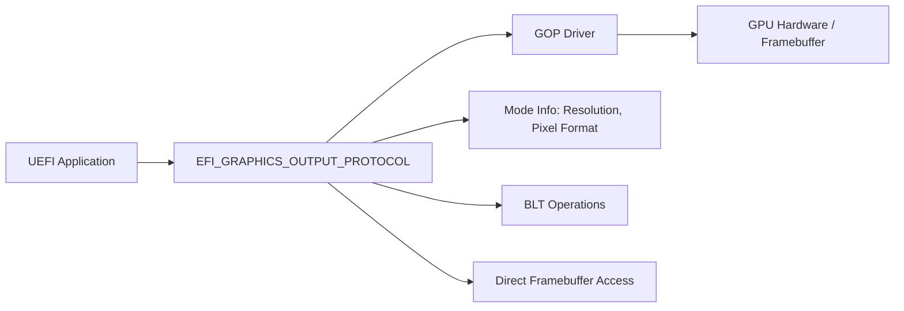
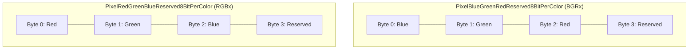
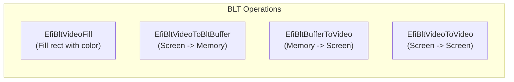

# Chapter 14: Graphics Output (GOP)
{: .fs-9 }

Access the framebuffer, draw pixels, and perform block transfers using the Graphics Output Protocol.
{: .fs-6 .fw-300 }

---

## 14.1 What Is GOP?

The Graphics Output Protocol (GOP) is UEFI's primary graphics interface. It replaces the legacy VGA BIOS `INT 10h` interface and provides:

- Enumeration and selection of video modes (resolution, pixel format)
- Direct framebuffer access for pixel-level rendering
- Block Transfer (BLT) operations for efficient rectangle copying and filling



GOP is available during Boot Services. After `ExitBootServices()`, the framebuffer pointer remains valid, but the protocol itself can no longer be called. Operating system boot loaders typically query GOP, store the framebuffer address, and pass it to the OS kernel.

---

## 14.2 Locating the GOP Protocol

```c
#include <Uefi.h>
#include <Library/UefiLib.h>
#include <Library/UefiBootServicesTableLib.h>
#include <Protocol/GraphicsOutput.h>

EFI_STATUS
GetGop(
    OUT EFI_GRAPHICS_OUTPUT_PROTOCOL  **Gop
    )
{
    return gBS->LocateProtocol(
               &gEfiGraphicsOutputProtocolGuid,
               NULL,
               (VOID **)Gop
               );
}
```

{: .warning }
> Not all systems provide GOP. Headless servers, serial-only debug boards, and some virtual machines may lack a graphics device. Always check the return status.

---

## 14.3 Querying Video Modes

### 14.3.1 The Mode Information Structure

```c
typedef struct {
    UINT32                        MaxMode;        // Number of available modes
    UINT32                        Mode;           // Current mode number
    EFI_GRAPHICS_OUTPUT_MODE_INFORMATION *Info;   // Current mode details
    UINTN                         SizeOfInfo;
    EFI_PHYSICAL_ADDRESS          FrameBufferBase; // Physical address
    UINTN                         FrameBufferSize;
} EFI_GRAPHICS_OUTPUT_PROTOCOL_MODE;

typedef struct {
    UINT32                     Version;
    UINT32                     HorizontalResolution;
    UINT32                     VerticalResolution;
    EFI_GRAPHICS_PIXEL_FORMAT  PixelFormat;
    EFI_PIXEL_BITMASK          PixelInformation;  // Only for PixelBitMask format
    UINT32                     PixelsPerScanLine;  // May differ from HorizontalResolution
} EFI_GRAPHICS_OUTPUT_MODE_INFORMATION;
```

### 14.3.2 Enumerating All Modes

```c
EFI_STATUS
ListVideoModes(
    IN EFI_GRAPHICS_OUTPUT_PROTOCOL  *Gop
    )
{
    EFI_STATUS                              Status;
    EFI_GRAPHICS_OUTPUT_MODE_INFORMATION    *Info;
    UINTN                                   InfoSize;

    Print(L"Available video modes (%d total):\n\n", Gop->Mode->MaxMode);
    Print(L"  Mode  Resolution      Pixel Format        Pixels/Scanline\n");
    Print(L"  ----  ----------      ------------        ---------------\n");

    for (UINT32 Mode = 0; Mode < Gop->Mode->MaxMode; Mode++) {
        Status = Gop->QueryMode(Gop, Mode, &InfoSize, &Info);
        if (EFI_ERROR(Status)) {
            continue;
        }

        CHAR16 *FormatStr;
        switch (Info->PixelFormat) {
        case PixelRedGreenBlueReserved8BitPerColor:
            FormatStr = L"RGBx (32-bit)";
            break;
        case PixelBlueGreenRedReserved8BitPerColor:
            FormatStr = L"BGRx (32-bit)";
            break;
        case PixelBitMask:
            FormatStr = L"BitMask";
            break;
        case PixelBltOnly:
            FormatStr = L"BLT Only (no FB)";
            break;
        default:
            FormatStr = L"Unknown";
            break;
        }

        Print(L"  [%2d]  %4d x %-4d    %-20s %d\n",
              Mode,
              Info->HorizontalResolution,
              Info->VerticalResolution,
              FormatStr,
              Info->PixelsPerScanLine);

        gBS->FreePool(Info);
    }

    Print(L"\nCurrent mode: %d\n", Gop->Mode->Mode);
    Print(L"Framebuffer at: 0x%lx (%d bytes)\n",
          Gop->Mode->FrameBufferBase,
          Gop->Mode->FrameBufferSize);

    return EFI_SUCCESS;
}
```

### 14.3.3 Setting a Video Mode

```c
EFI_STATUS
SetVideoMode(
    IN EFI_GRAPHICS_OUTPUT_PROTOCOL  *Gop,
    IN UINT32                        DesiredWidth,
    IN UINT32                        DesiredHeight
    )
{
    EFI_STATUS                              Status;
    EFI_GRAPHICS_OUTPUT_MODE_INFORMATION    *Info;
    UINTN                                   InfoSize;

    for (UINT32 Mode = 0; Mode < Gop->Mode->MaxMode; Mode++) {
        Status = Gop->QueryMode(Gop, Mode, &InfoSize, &Info);
        if (EFI_ERROR(Status)) {
            continue;
        }

        if (Info->HorizontalResolution == DesiredWidth &&
            Info->VerticalResolution == DesiredHeight &&
            Info->PixelFormat != PixelBltOnly)
        {
            gBS->FreePool(Info);
            return Gop->SetMode(Gop, Mode);
        }

        gBS->FreePool(Info);
    }

    return EFI_NOT_FOUND;
}
```

---

## 14.4 Pixel Formats

UEFI defines four pixel formats. Understanding them is critical for correct framebuffer access.



| Format | Byte Order | Notes |
|---|---|---|
| `PixelBlueGreenRedReserved8BitPerColor` | B, G, R, x | Most common (matches Windows BMP order) |
| `PixelRedGreenBlueReserved8BitPerColor` | R, G, B, x | Standard RGB order |
| `PixelBitMask` | Custom bitmask | Use `PixelInformation` to decode |
| `PixelBltOnly` | N/A | No framebuffer; only BLT operations work |

{: .important }
> The `EFI_GRAPHICS_OUTPUT_BLT_PIXEL` structure always uses **BGRx** order (`Blue, Green, Red, Reserved`), regardless of the framebuffer's native pixel format. The BLT engine handles conversion automatically.

```c
typedef struct {
    UINT8 Blue;
    UINT8 Green;
    UINT8 Red;
    UINT8 Reserved;
} EFI_GRAPHICS_OUTPUT_BLT_PIXEL;
```

---

## 14.5 Direct Framebuffer Access

For maximum performance, you can write directly to the framebuffer. This bypasses the BLT engine but requires you to handle pixel format conversion yourself.

### 14.5.1 Computing Pixel Addresses

```c
/**
  Calculate the address of a pixel in the framebuffer.

  @param[in] Gop    The GOP protocol instance.
  @param[in] X      Horizontal pixel coordinate.
  @param[in] Y      Vertical pixel coordinate.

  @return Pointer to the pixel's first byte in the framebuffer.
**/
UINT32 *
GetPixelAddress(
    IN EFI_GRAPHICS_OUTPUT_PROTOCOL  *Gop,
    IN UINT32                        X,
    IN UINT32                        Y
    )
{
    UINT32 *FrameBuffer = (UINT32 *)(UINTN)Gop->Mode->FrameBufferBase;
    UINT32 PixelsPerScanLine = Gop->Mode->Info->PixelsPerScanLine;

    //
    // PixelsPerScanLine may be larger than HorizontalResolution due to
    // alignment padding. Always use PixelsPerScanLine for stride calculation.
    //
    return &FrameBuffer[Y * PixelsPerScanLine + X];
}
```

### 14.5.2 Drawing a Single Pixel

```c
VOID
PutPixel(
    IN EFI_GRAPHICS_OUTPUT_PROTOCOL  *Gop,
    IN UINT32                        X,
    IN UINT32                        Y,
    IN UINT8                         Red,
    IN UINT8                         Green,
    IN UINT8                         Blue
    )
{
    if (X >= Gop->Mode->Info->HorizontalResolution ||
        Y >= Gop->Mode->Info->VerticalResolution)
    {
        return;  // Clip out-of-bounds pixels
    }

    UINT32 *Pixel = GetPixelAddress(Gop, X, Y);

    switch (Gop->Mode->Info->PixelFormat) {
    case PixelBlueGreenRedReserved8BitPerColor:
        *Pixel = (UINT32)Blue | ((UINT32)Green << 8) | ((UINT32)Red << 16);
        break;
    case PixelRedGreenBlueReserved8BitPerColor:
        *Pixel = (UINT32)Red | ((UINT32)Green << 8) | ((UINT32)Blue << 16);
        break;
    default:
        break;  // PixelBitMask and PixelBltOnly need special handling
    }
}
```

---

## 14.6 Drawing Primitives

### 14.6.1 Horizontal and Vertical Lines

```c
VOID
DrawHorizontalLine(
    IN EFI_GRAPHICS_OUTPUT_PROTOCOL  *Gop,
    IN UINT32  X1,
    IN UINT32  X2,
    IN UINT32  Y,
    IN UINT8   Red,
    IN UINT8   Green,
    IN UINT8   Blue
    )
{
    if (X1 > X2) {
        UINT32 Tmp = X1; X1 = X2; X2 = Tmp;
    }

    for (UINT32 X = X1; X <= X2; X++) {
        PutPixel(Gop, X, Y, Red, Green, Blue);
    }
}

VOID
DrawVerticalLine(
    IN EFI_GRAPHICS_OUTPUT_PROTOCOL  *Gop,
    IN UINT32  X,
    IN UINT32  Y1,
    IN UINT32  Y2,
    IN UINT8   Red,
    IN UINT8   Green,
    IN UINT8   Blue
    )
{
    if (Y1 > Y2) {
        UINT32 Tmp = Y1; Y1 = Y2; Y2 = Tmp;
    }

    for (UINT32 Y = Y1; Y <= Y2; Y++) {
        PutPixel(Gop, X, Y, Red, Green, Blue);
    }
}
```

### 14.6.2 Bresenham's Line Algorithm

For arbitrary lines between any two points:

```c
VOID
DrawLine(
    IN EFI_GRAPHICS_OUTPUT_PROTOCOL  *Gop,
    IN INT32   X0,
    IN INT32   Y0,
    IN INT32   X1,
    IN INT32   Y1,
    IN UINT8   Red,
    IN UINT8   Green,
    IN UINT8   Blue
    )
{
    INT32 dx = (X1 > X0) ? (X1 - X0) : (X0 - X1);
    INT32 dy = (Y1 > Y0) ? (Y1 - Y0) : (Y0 - Y1);
    INT32 sx = (X0 < X1) ? 1 : -1;
    INT32 sy = (Y0 < Y1) ? 1 : -1;
    INT32 err = dx - dy;

    while (TRUE) {
        PutPixel(Gop, (UINT32)X0, (UINT32)Y0, Red, Green, Blue);

        if (X0 == X1 && Y0 == Y1) {
            break;
        }

        INT32 e2 = 2 * err;
        if (e2 > -dy) {
            err -= dy;
            X0 += sx;
        }
        if (e2 < dx) {
            err += dx;
            Y0 += sy;
        }
    }
}
```

### 14.6.3 Filled Rectangle

```c
VOID
FillRect(
    IN EFI_GRAPHICS_OUTPUT_PROTOCOL  *Gop,
    IN UINT32  X,
    IN UINT32  Y,
    IN UINT32  Width,
    IN UINT32  Height,
    IN UINT8   Red,
    IN UINT8   Green,
    IN UINT8   Blue
    )
{
    for (UINT32 Row = Y; Row < Y + Height; Row++) {
        for (UINT32 Col = X; Col < X + Width; Col++) {
            PutPixel(Gop, Col, Row, Red, Green, Blue);
        }
    }
}
```

---

## 14.7 BLT Operations

The BLT (Block Transfer) interface is more efficient than per-pixel framebuffer writes and handles pixel format conversion automatically. It operates on `EFI_GRAPHICS_OUTPUT_BLT_PIXEL` arrays (always BGRx order).

### 14.7.1 BLT Operation Types

```c
typedef enum {
    EfiBltVideoFill,         // Fill a rectangle with a single color
    EfiBltVideoToBltBuffer,  // Copy from framebuffer to memory buffer
    EfiBltBufferToVideo,     // Copy from memory buffer to framebuffer
    EfiBltVideoToVideo,      // Copy one framebuffer region to another
} EFI_GRAPHICS_OUTPUT_BLT_OPERATION;
```



### 14.7.2 Filling a Rectangle with BLT

```c
EFI_STATUS
BltFillRect(
    IN EFI_GRAPHICS_OUTPUT_PROTOCOL  *Gop,
    IN UINT32  X,
    IN UINT32  Y,
    IN UINT32  Width,
    IN UINT32  Height,
    IN UINT8   Red,
    IN UINT8   Green,
    IN UINT8   Blue
    )
{
    EFI_GRAPHICS_OUTPUT_BLT_PIXEL FillColor;

    FillColor.Red      = Red;
    FillColor.Green    = Green;
    FillColor.Blue     = Blue;
    FillColor.Reserved = 0;

    //
    // For EfiBltVideoFill, the BltBuffer points to a single pixel
    // that defines the fill color. SourceX/SourceY are ignored.
    //
    return Gop->Blt(
               Gop,
               &FillColor,           // BltBuffer
               EfiBltVideoFill,      // BltOperation
               0, 0,                 // SourceX, SourceY (ignored for Fill)
               X, Y,                 // DestinationX, DestinationY
               Width, Height,        // Width, Height
               0                     // Delta (ignored for Fill)
               );
}
```

### 14.7.3 Clearing the Screen to a Color

```c
EFI_STATUS
ClearScreen(
    IN EFI_GRAPHICS_OUTPUT_PROTOCOL  *Gop,
    IN UINT8   Red,
    IN UINT8   Green,
    IN UINT8   Blue
    )
{
    return BltFillRect(
               Gop, 0, 0,
               Gop->Mode->Info->HorizontalResolution,
               Gop->Mode->Info->VerticalResolution,
               Red, Green, Blue
               );
}
```

### 14.7.4 Drawing an Image from a Pixel Buffer

```c
EFI_STATUS
DrawBitmap(
    IN EFI_GRAPHICS_OUTPUT_PROTOCOL    *Gop,
    IN EFI_GRAPHICS_OUTPUT_BLT_PIXEL   *PixelBuffer,
    IN UINT32                          ImageWidth,
    IN UINT32                          ImageHeight,
    IN UINT32                          DestX,
    IN UINT32                          DestY
    )
{
    //
    // Delta = the byte stride of the source buffer (width * sizeof(pixel)).
    // This tells the BLT engine how to advance rows in the source buffer.
    //
    return Gop->Blt(
               Gop,
               PixelBuffer,
               EfiBltBufferToVideo,
               0, 0,                              // SourceX, SourceY
               DestX, DestY,                      // DestinationX, DestinationY
               ImageWidth, ImageHeight,
               ImageWidth * sizeof(EFI_GRAPHICS_OUTPUT_BLT_PIXEL)  // Delta
               );
}
```

### 14.7.5 Capturing the Screen

```c
EFI_STATUS
CaptureScreen(
    IN  EFI_GRAPHICS_OUTPUT_PROTOCOL    *Gop,
    OUT EFI_GRAPHICS_OUTPUT_BLT_PIXEL   **PixelBuffer,
    OUT UINT32                          *Width,
    OUT UINT32                          *Height
    )
{
    EFI_STATUS Status;

    *Width  = Gop->Mode->Info->HorizontalResolution;
    *Height = Gop->Mode->Info->VerticalResolution;

    UINTN BufferSize = (*Width) * (*Height) * sizeof(EFI_GRAPHICS_OUTPUT_BLT_PIXEL);

    Status = gBS->AllocatePool(EfiBootServicesData, BufferSize, (VOID **)PixelBuffer);
    if (EFI_ERROR(Status)) {
        return Status;
    }

    return Gop->Blt(
               Gop,
               *PixelBuffer,
               EfiBltVideoToBltBuffer,
               0, 0,                // SourceX, SourceY (from framebuffer)
               0, 0,                // DestinationX, DestinationY (in buffer)
               *Width, *Height,
               0                    // Delta (0 means width == buffer stride)
               );
}
```

---

## 14.8 Double Buffering

Writing directly to the framebuffer during rendering causes visible tearing and flicker. Double buffering solves this by drawing to an off-screen buffer, then copying the completed frame to the screen in a single BLT operation.

```c
#include <Library/MemoryAllocationLib.h>
#include <Library/BaseMemoryLib.h>

typedef struct {
    EFI_GRAPHICS_OUTPUT_BLT_PIXEL  *Buffer;
    UINT32                         Width;
    UINT32                         Height;
    UINTN                          BufferSize;
} BACK_BUFFER;

EFI_STATUS
CreateBackBuffer(
    IN  EFI_GRAPHICS_OUTPUT_PROTOCOL  *Gop,
    OUT BACK_BUFFER                   *BackBuffer
    )
{
    BackBuffer->Width      = Gop->Mode->Info->HorizontalResolution;
    BackBuffer->Height     = Gop->Mode->Info->VerticalResolution;
    BackBuffer->BufferSize = BackBuffer->Width * BackBuffer->Height
                             * sizeof(EFI_GRAPHICS_OUTPUT_BLT_PIXEL);

    BackBuffer->Buffer = AllocateZeroPool(BackBuffer->BufferSize);
    if (BackBuffer->Buffer == NULL) {
        return EFI_OUT_OF_RESOURCES;
    }

    return EFI_SUCCESS;
}

VOID
BackBufferPutPixel(
    IN BACK_BUFFER  *BackBuffer,
    IN UINT32       X,
    IN UINT32       Y,
    IN UINT8        Red,
    IN UINT8        Green,
    IN UINT8        Blue
    )
{
    if (X >= BackBuffer->Width || Y >= BackBuffer->Height) {
        return;
    }

    EFI_GRAPHICS_OUTPUT_BLT_PIXEL *Pixel =
        &BackBuffer->Buffer[Y * BackBuffer->Width + X];

    Pixel->Red   = Red;
    Pixel->Green = Green;
    Pixel->Blue  = Blue;
}

VOID
BackBufferClear(
    IN BACK_BUFFER  *BackBuffer,
    IN UINT8        Red,
    IN UINT8        Green,
    IN UINT8        Blue
    )
{
    for (UINTN i = 0; i < (UINTN)(BackBuffer->Width * BackBuffer->Height); i++) {
        BackBuffer->Buffer[i].Red   = Red;
        BackBuffer->Buffer[i].Green = Green;
        BackBuffer->Buffer[i].Blue  = Blue;
    }
}

EFI_STATUS
BackBufferFlip(
    IN EFI_GRAPHICS_OUTPUT_PROTOCOL  *Gop,
    IN BACK_BUFFER                   *BackBuffer
    )
{
    return Gop->Blt(
               Gop,
               BackBuffer->Buffer,
               EfiBltBufferToVideo,
               0, 0,
               0, 0,
               BackBuffer->Width,
               BackBuffer->Height,
               BackBuffer->Width * sizeof(EFI_GRAPHICS_OUTPUT_BLT_PIXEL)
               );
}

VOID
DestroyBackBuffer(
    IN BACK_BUFFER  *BackBuffer
    )
{
    if (BackBuffer->Buffer != NULL) {
        FreePool(BackBuffer->Buffer);
        BackBuffer->Buffer = NULL;
    }
}
```

---

## 14.9 Complete Example: Animated Color Bars

This example draws animated color gradient bars using double buffering:

```c
#include <Uefi.h>
#include <Library/UefiLib.h>
#include <Library/UefiBootServicesTableLib.h>
#include <Library/MemoryAllocationLib.h>
#include <Protocol/GraphicsOutput.h>

// Include the BackBuffer functions defined above

EFI_STATUS
EFIAPI
UefiMain(
    IN EFI_HANDLE        ImageHandle,
    IN EFI_SYSTEM_TABLE  *SystemTable
    )
{
    EFI_STATUS                      Status;
    EFI_GRAPHICS_OUTPUT_PROTOCOL    *Gop;
    BACK_BUFFER                     BackBuf;
    EFI_INPUT_KEY                   Key;
    UINT32                          Frame = 0;

    Status = gBS->LocateProtocol(
                 &gEfiGraphicsOutputProtocolGuid,
                 NULL,
                 (VOID **)&Gop
                 );
    if (EFI_ERROR(Status)) {
        Print(L"GOP not available: %r\n", Status);
        return Status;
    }

    Status = CreateBackBuffer(Gop, &BackBuf);
    if (EFI_ERROR(Status)) {
        Print(L"Failed to create back buffer: %r\n", Status);
        return Status;
    }

    //
    // Animation loop -- runs until a key is pressed.
    //
    while (TRUE) {
        //
        // Check for keypress (non-blocking).
        //
        Status = gST->ConIn->ReadKeyStroke(gST->ConIn, &Key);
        if (Status == EFI_SUCCESS) {
            break;  // Any key exits
        }

        //
        // Draw color gradient bars that scroll vertically.
        //
        for (UINT32 Y = 0; Y < BackBuf.Height; Y++) {
            UINT8 ColorPhase = (UINT8)((Y + Frame) % 256);
            for (UINT32 X = 0; X < BackBuf.Width; X++) {
                UINT8 R = (UINT8)((X * 255) / BackBuf.Width);
                UINT8 G = ColorPhase;
                UINT8 B = (UINT8)(255 - R);
                BackBufferPutPixel(&BackBuf, X, Y, R, G, B);
            }
        }

        //
        // Present the frame.
        //
        BackBufferFlip(Gop, &BackBuf);
        Frame += 2;
    }

    DestroyBackBuffer(&BackBuf);
    return EFI_SUCCESS;
}
```

---

## 14.10 Practical Considerations

### PixelsPerScanLine vs. HorizontalResolution

The framebuffer may have padding at the end of each scan line for alignment. Always use `PixelsPerScanLine` (not `HorizontalResolution`) when calculating byte offsets in the framebuffer. The BLT engine does not require this -- its `Delta` parameter handles stride explicitly.

### GOP After ExitBootServices

The framebuffer memory remains mapped after `ExitBootServices()`, so an OS boot loader can continue to use it for early display. However:

- You must not call any GOP protocol functions after `ExitBootServices()`.
- You must record `FrameBufferBase`, `FrameBufferSize`, `HorizontalResolution`, `VerticalResolution`, `PixelsPerScanLine`, and `PixelFormat` before exiting boot services.

### Multiple GOP Instances

Systems with multiple displays may expose multiple GOP instances. Use `LocateHandleBuffer` to find all of them:

```c
EFI_STATUS
FindAllGopHandles(
    OUT EFI_HANDLE  **Handles,
    OUT UINTN       *HandleCount
    )
{
    return gBS->LocateHandleBuffer(
               ByProtocol,
               &gEfiGraphicsOutputProtocolGuid,
               NULL,
               HandleCount,
               Handles
               );
}
```

### Performance Tips

| Technique | Speed |
|---|---|
| BLT operations | Fast (driver-optimized, handles format conversion) |
| Direct framebuffer (large writes) | Fast (bypasses protocol overhead) |
| Per-pixel framebuffer writes | Slow (each write crosses the bus) |

For best performance:
1. Build your frame in a memory buffer (back buffer).
2. Use `EfiBltBufferToVideo` to copy the completed frame to the screen.
3. Avoid reading from the framebuffer (`EfiBltVideoToBltBuffer`) when possible -- MMIO reads are slow.

---

## Summary

| Concept | Key Points |
|---|---|
| **GOP Protocol** | Primary UEFI graphics interface; replaces VGA BIOS |
| **Video Modes** | Query with `QueryMode`, set with `SetMode` |
| **Pixel Formats** | BGRx is most common; BLT always uses BGRx internally |
| **Framebuffer** | Direct access via `FrameBufferBase`; use `PixelsPerScanLine` for stride |
| **BLT Operations** | Fill, screen-to-buffer, buffer-to-screen, screen-to-screen |
| **Double Buffering** | Draw off-screen, flip with single BLT for flicker-free rendering |

In the next chapter, we leave graphics behind and explore how to read and write files through the UEFI file system protocols.
