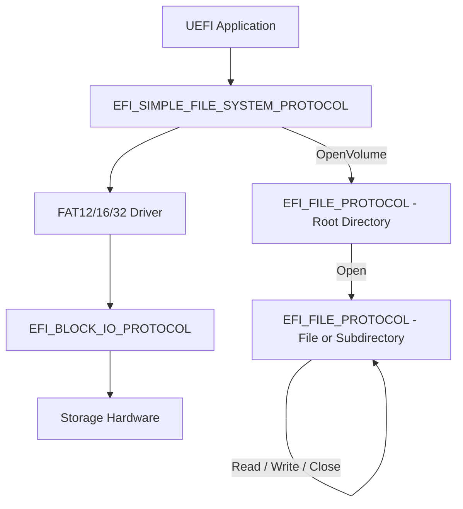

# Chapter 15: File System Access
{: .fs-9 }

Read, write, and manage files on FAT-formatted volumes using the UEFI file system protocols.
{: .fs-6 .fw-300 }

---

## 15.1 File System Architecture

UEFI file access involves two cooperating protocols:



| Protocol | Purpose |
|---|---|
| `EFI_SIMPLE_FILE_SYSTEM_PROTOCOL` | Installed on each volume handle; provides `OpenVolume()` to get the root directory |
| `EFI_FILE_PROTOCOL` | Represents an open file or directory; provides `Open`, `Read`, `Write`, `Close`, `Delete`, `SetPosition`, `GetPosition`, `GetInfo`, `SetInfo`, `Flush` |

{: .note }
> UEFI mandates FAT file system support (FAT12, FAT16, FAT32). The EFI System Partition (ESP) is always FAT32. Other file systems (NTFS, ext4) are not part of the UEFI specification but may be available through third-party drivers.

---

## 15.2 Locating File System Volumes

### 15.2.1 Opening the Volume Where Your Application Resides

The most common use case is accessing files on the same volume as your UEFI application:

```c
#include <Uefi.h>
#include <Library/UefiLib.h>
#include <Library/UefiBootServicesTableLib.h>
#include <Protocol/SimpleFileSystem.h>
#include <Protocol/LoadedImage.h>
#include <Guid/FileInfo.h>

EFI_STATUS
OpenApplicationVolume(
    OUT EFI_FILE_PROTOCOL  **RootDir
    )
{
    EFI_STATUS                         Status;
    EFI_LOADED_IMAGE_PROTOCOL          *LoadedImage;
    EFI_SIMPLE_FILE_SYSTEM_PROTOCOL    *FileSystem;

    //
    // Step 1: Get the Loaded Image Protocol for our own image.
    // This tells us which device we were loaded from.
    //
    Status = gBS->HandleProtocol(
                 gImageHandle,
                 &gEfiLoadedImageProtocolGuid,
                 (VOID **)&LoadedImage
                 );
    if (EFI_ERROR(Status)) {
        return Status;
    }

    //
    // Step 2: Get the file system protocol from our device handle.
    //
    Status = gBS->HandleProtocol(
                 LoadedImage->DeviceHandle,
                 &gEfiSimpleFileSystemProtocolGuid,
                 (VOID **)&FileSystem
                 );
    if (EFI_ERROR(Status)) {
        return Status;
    }

    //
    // Step 3: Open the root directory of the volume.
    //
    return FileSystem->OpenVolume(FileSystem, RootDir);
}
```

### 15.2.2 Enumerating All File System Volumes

```c
EFI_STATUS
ListAllVolumes(VOID)
{
    EFI_STATUS                         Status;
    EFI_HANDLE                         *Handles;
    UINTN                              HandleCount;
    EFI_SIMPLE_FILE_SYSTEM_PROTOCOL    *Fs;
    EFI_FILE_PROTOCOL                  *Root;

    Status = gBS->LocateHandleBuffer(
                 ByProtocol,
                 &gEfiSimpleFileSystemProtocolGuid,
                 NULL,
                 &HandleCount,
                 &Handles
                 );
    if (EFI_ERROR(Status)) {
        Print(L"No file systems found: %r\n", Status);
        return Status;
    }

    Print(L"Found %d file system volume(s):\n\n", HandleCount);

    for (UINTN i = 0; i < HandleCount; i++) {
        Status = gBS->HandleProtocol(
                     Handles[i],
                     &gEfiSimpleFileSystemProtocolGuid,
                     (VOID **)&Fs
                     );
        if (EFI_ERROR(Status)) {
            continue;
        }

        Status = Fs->OpenVolume(Fs, &Root);
        if (EFI_ERROR(Status)) {
            Print(L"  Volume %d: OpenVolume failed (%r)\n", i, Status);
            continue;
        }

        //
        // Get volume label via EFI_FILE_SYSTEM_INFO.
        //
        EFI_FILE_SYSTEM_INFO  *FsInfo;
        UINTN                 InfoSize = 0;

        Status = Root->GetInfo(Root, &gEfiFileSystemInfoGuid, &InfoSize, NULL);
        if (Status == EFI_BUFFER_TOO_SMALL) {
            Status = gBS->AllocatePool(EfiBootServicesData, InfoSize, (VOID **)&FsInfo);
            if (!EFI_ERROR(Status)) {
                Status = Root->GetInfo(Root, &gEfiFileSystemInfoGuid, &InfoSize, FsInfo);
                if (!EFI_ERROR(Status)) {
                    Print(L"  Volume %d: \"%s\"  Size=%ld MB  Free=%ld MB\n",
                          i,
                          FsInfo->VolumeLabel,
                          FsInfo->VolumeSize / (1024 * 1024),
                          FsInfo->FreeSpace / (1024 * 1024));
                }
                gBS->FreePool(FsInfo);
            }
        }

        Root->Close(Root);
    }

    gBS->FreePool(Handles);
    return EFI_SUCCESS;
}
```

---

## 15.3 Opening Files

The `EFI_FILE_PROTOCOL.Open()` function opens a file or directory relative to an existing open directory:

```c
EFI_STATUS
(EFIAPI *EFI_FILE_OPEN)(
    IN  EFI_FILE_PROTOCOL  *This,       // Parent directory
    OUT EFI_FILE_PROTOCOL  **NewHandle, // Newly opened file/dir
    IN  CHAR16             *FileName,   // Name (may include path separators)
    IN  UINT64             OpenMode,    // Read, Read/Write, or Create
    IN  UINT64             Attributes   // Only used when creating
    );
```

### Open Mode Flags

| Flag | Value | Meaning |
|---|---|---|
| `EFI_FILE_MODE_READ` | `0x01` | Open for reading |
| `EFI_FILE_MODE_WRITE` | `0x02` | Open for writing (must also include READ) |
| `EFI_FILE_MODE_CREATE` | `0x8000000000000000` | Create the file if it does not exist |

### File Attribute Flags (for creation)

| Flag | Value | Meaning |
|---|---|---|
| `EFI_FILE_READ_ONLY` | `0x01` | File is read-only |
| `EFI_FILE_HIDDEN` | `0x02` | File is hidden |
| `EFI_FILE_SYSTEM` | `0x04` | System file |
| `EFI_FILE_DIRECTORY` | `0x10` | This is a directory |
| `EFI_FILE_ARCHIVE` | `0x20` | Archive attribute |

### 15.3.1 Opening a File for Reading

```c
EFI_STATUS
OpenFileForRead(
    IN  EFI_FILE_PROTOCOL   *RootDir,
    IN  CHAR16              *FileName,
    OUT EFI_FILE_PROTOCOL   **File
    )
{
    return RootDir->Open(
               RootDir,
               File,
               FileName,
               EFI_FILE_MODE_READ,
               0  // Attributes ignored when not creating
               );
}
```

### 15.3.2 Creating a New File

```c
EFI_STATUS
CreateFile(
    IN  EFI_FILE_PROTOCOL   *RootDir,
    IN  CHAR16              *FileName,
    OUT EFI_FILE_PROTOCOL   **File
    )
{
    return RootDir->Open(
               RootDir,
               File,
               FileName,
               EFI_FILE_MODE_READ | EFI_FILE_MODE_WRITE | EFI_FILE_MODE_CREATE,
               0  // No special attributes
               );
}
```

{: .note }
> Path separators in UEFI use the backslash (`\`). For example: `L"\\EFI\\Boot\\config.txt"`. You can open files in subdirectories relative to any open directory handle.

---

## 15.4 Reading Files

### 15.4.1 Reading the Entire File

```c
#include <Library/MemoryAllocationLib.h>

EFI_STATUS
ReadEntireFile(
    IN  EFI_FILE_PROTOCOL  *RootDir,
    IN  CHAR16             *FileName,
    OUT VOID               **Buffer,
    OUT UINTN              *FileSize
    )
{
    EFI_STATUS         Status;
    EFI_FILE_PROTOCOL  *File;
    EFI_FILE_INFO      *FileInfo;
    UINTN              InfoSize;

    //
    // Open the file.
    //
    Status = RootDir->Open(RootDir, &File, FileName, EFI_FILE_MODE_READ, 0);
    if (EFI_ERROR(Status)) {
        return Status;
    }

    //
    // Get file size via EFI_FILE_INFO.
    //
    InfoSize = 0;
    Status = File->GetInfo(File, &gEfiFileInfoGuid, &InfoSize, NULL);
    if (Status != EFI_BUFFER_TOO_SMALL) {
        File->Close(File);
        return EFI_DEVICE_ERROR;
    }

    FileInfo = AllocatePool(InfoSize);
    if (FileInfo == NULL) {
        File->Close(File);
        return EFI_OUT_OF_RESOURCES;
    }

    Status = File->GetInfo(File, &gEfiFileInfoGuid, &InfoSize, FileInfo);
    if (EFI_ERROR(Status)) {
        FreePool(FileInfo);
        File->Close(File);
        return Status;
    }

    *FileSize = (UINTN)FileInfo->FileSize;
    FreePool(FileInfo);

    //
    // Allocate buffer and read the file.
    //
    *Buffer = AllocatePool(*FileSize);
    if (*Buffer == NULL) {
        File->Close(File);
        return EFI_OUT_OF_RESOURCES;
    }

    UINTN ReadSize = *FileSize;
    Status = File->Read(File, &ReadSize, *Buffer);
    if (EFI_ERROR(Status) || ReadSize != *FileSize) {
        FreePool(*Buffer);
        *Buffer = NULL;
        File->Close(File);
        return EFI_DEVICE_ERROR;
    }

    File->Close(File);
    return EFI_SUCCESS;
}
```

### 15.4.2 Reading in Chunks

For very large files, read in chunks to conserve memory:

```c
#define CHUNK_SIZE  (64 * 1024)  // 64 KB

EFI_STATUS
ProcessFileInChunks(
    IN EFI_FILE_PROTOCOL  *File
    )
{
    EFI_STATUS  Status;
    UINT8       ChunkBuffer[CHUNK_SIZE];
    UINTN       BytesRead;
    UINT64      TotalBytesRead = 0;

    while (TRUE) {
        BytesRead = CHUNK_SIZE;
        Status = File->Read(File, &BytesRead, ChunkBuffer);
        if (EFI_ERROR(Status)) {
            return Status;
        }

        if (BytesRead == 0) {
            break;  // End of file
        }

        TotalBytesRead += BytesRead;

        //
        // Process the chunk here...
        // For example, compute a checksum, parse data, etc.
        //
    }

    Print(L"Processed %ld bytes total.\n", TotalBytesRead);
    return EFI_SUCCESS;
}
```

---

## 15.5 Writing Files

```c
EFI_STATUS
WriteDataToFile(
    IN EFI_FILE_PROTOCOL  *RootDir,
    IN CHAR16             *FileName,
    IN VOID               *Data,
    IN UINTN              DataSize
    )
{
    EFI_STATUS         Status;
    EFI_FILE_PROTOCOL  *File;
    UINTN              WriteSize;

    //
    // Open (or create) the file for writing.
    //
    Status = RootDir->Open(
                 RootDir,
                 &File,
                 FileName,
                 EFI_FILE_MODE_READ | EFI_FILE_MODE_WRITE | EFI_FILE_MODE_CREATE,
                 0
                 );
    if (EFI_ERROR(Status)) {
        return Status;
    }

    //
    // Write the data. On input, WriteSize is the number of bytes to write.
    // On output, it is the number of bytes actually written.
    //
    WriteSize = DataSize;
    Status = File->Write(File, &WriteSize, Data);
    if (EFI_ERROR(Status)) {
        File->Close(File);
        return Status;
    }

    if (WriteSize != DataSize) {
        Print(L"Warning: only %d of %d bytes written.\n", WriteSize, DataSize);
    }

    //
    // Flush ensures data is committed to the storage device.
    //
    File->Flush(File);
    File->Close(File);

    return EFI_SUCCESS;
}
```

---

## 15.6 File Position

The file position determines where the next `Read` or `Write` operation occurs.

```c
//
// Get the current position.
//
UINT64 Position;
File->GetPosition(File, &Position);

//
// Seek to the beginning of the file.
//
File->SetPosition(File, 0);

//
// Seek to the end of the file (for appending).
// The special value 0xFFFFFFFFFFFFFFFF seeks to the end.
//
File->SetPosition(File, 0xFFFFFFFFFFFFFFFF);
```

---

## 15.7 Directory Enumeration

Directories are opened just like files. Reading from a directory handle returns `EFI_FILE_INFO` structures, one per entry.

```c
EFI_STATUS
ListDirectory(
    IN EFI_FILE_PROTOCOL  *RootDir,
    IN CHAR16             *DirPath
    )
{
    EFI_STATUS         Status;
    EFI_FILE_PROTOCOL  *Dir;
    UINT8              Buffer[1024];
    UINTN              BufferSize;
    EFI_FILE_INFO      *FileInfo;

    //
    // Open the directory.
    //
    Status = RootDir->Open(RootDir, &Dir, DirPath, EFI_FILE_MODE_READ, 0);
    if (EFI_ERROR(Status)) {
        Print(L"Cannot open directory \"%s\": %r\n", DirPath, Status);
        return Status;
    }

    Print(L"\nDirectory listing of \"%s\":\n\n", DirPath);
    Print(L"  %-40s %10s  %s\n", L"Name", L"Size", L"Attributes");
    Print(L"  %-40s %10s  %s\n", L"----", L"----", L"----------");

    while (TRUE) {
        BufferSize = sizeof(Buffer);
        Status = Dir->Read(Dir, &BufferSize, Buffer);
        if (EFI_ERROR(Status) || BufferSize == 0) {
            break;  // No more entries
        }

        FileInfo = (EFI_FILE_INFO *)Buffer;

        //
        // Build an attribute string.
        //
        CHAR16 AttrStr[8];
        AttrStr[0] = (FileInfo->Attribute & EFI_FILE_DIRECTORY) ? L'D' : L'-';
        AttrStr[1] = (FileInfo->Attribute & EFI_FILE_READ_ONLY) ? L'R' : L'-';
        AttrStr[2] = (FileInfo->Attribute & EFI_FILE_HIDDEN)    ? L'H' : L'-';
        AttrStr[3] = (FileInfo->Attribute & EFI_FILE_SYSTEM)    ? L'S' : L'-';
        AttrStr[4] = (FileInfo->Attribute & EFI_FILE_ARCHIVE)   ? L'A' : L'-';
        AttrStr[5] = L'\0';

        if (FileInfo->Attribute & EFI_FILE_DIRECTORY) {
            Print(L"  %-40s %10s  %s\n", FileInfo->FileName, L"<DIR>", AttrStr);
        } else {
            Print(L"  %-40s %10ld  %s\n", FileInfo->FileName, FileInfo->FileSize, AttrStr);
        }
    }

    Dir->Close(Dir);
    return EFI_SUCCESS;
}
```

---

## 15.8 Querying and Modifying File Attributes

### 15.8.1 Getting File Information

```c
EFI_STATUS
PrintFileInfo(
    IN EFI_FILE_PROTOCOL  *File
    )
{
    EFI_STATUS     Status;
    EFI_FILE_INFO  *Info;
    UINTN          InfoSize = 0;

    //
    // First call with InfoSize=0 to get the required buffer size.
    //
    Status = File->GetInfo(File, &gEfiFileInfoGuid, &InfoSize, NULL);
    if (Status != EFI_BUFFER_TOO_SMALL) {
        return EFI_DEVICE_ERROR;
    }

    Info = AllocatePool(InfoSize);
    if (Info == NULL) {
        return EFI_OUT_OF_RESOURCES;
    }

    Status = File->GetInfo(File, &gEfiFileInfoGuid, &InfoSize, Info);
    if (EFI_ERROR(Status)) {
        FreePool(Info);
        return Status;
    }

    Print(L"File Name:     %s\n", Info->FileName);
    Print(L"File Size:     %ld bytes\n", Info->FileSize);
    Print(L"Physical Size: %ld bytes\n", Info->PhysicalSize);
    Print(L"Attributes:    0x%lx\n", Info->Attribute);

    //
    // EFI_TIME fields: Year, Month, Day, Hour, Minute, Second
    //
    Print(L"Created:       %04d-%02d-%02d %02d:%02d:%02d\n",
          Info->CreateTime.Year, Info->CreateTime.Month, Info->CreateTime.Day,
          Info->CreateTime.Hour, Info->CreateTime.Minute, Info->CreateTime.Second);

    Print(L"Modified:      %04d-%02d-%02d %02d:%02d:%02d\n",
          Info->ModificationTime.Year, Info->ModificationTime.Month,
          Info->ModificationTime.Day, Info->ModificationTime.Hour,
          Info->ModificationTime.Minute, Info->ModificationTime.Second);

    FreePool(Info);
    return EFI_SUCCESS;
}
```

### 15.8.2 Changing File Attributes

```c
EFI_STATUS
SetFileReadOnly(
    IN EFI_FILE_PROTOCOL  *File,
    IN BOOLEAN            ReadOnly
    )
{
    EFI_STATUS     Status;
    EFI_FILE_INFO  *Info;
    UINTN          InfoSize = 0;

    File->GetInfo(File, &gEfiFileInfoGuid, &InfoSize, NULL);
    Info = AllocatePool(InfoSize);
    if (Info == NULL) return EFI_OUT_OF_RESOURCES;

    Status = File->GetInfo(File, &gEfiFileInfoGuid, &InfoSize, Info);
    if (EFI_ERROR(Status)) {
        FreePool(Info);
        return Status;
    }

    if (ReadOnly) {
        Info->Attribute |= EFI_FILE_READ_ONLY;
    } else {
        Info->Attribute &= ~EFI_FILE_READ_ONLY;
    }

    Status = File->SetInfo(File, &gEfiFileInfoGuid, InfoSize, Info);
    FreePool(Info);
    return Status;
}
```

---

## 15.9 Deleting Files

To delete a file, open it and call `Delete()`. The handle is automatically closed and invalidated.

```c
EFI_STATUS
DeleteFile(
    IN EFI_FILE_PROTOCOL  *RootDir,
    IN CHAR16             *FileName
    )
{
    EFI_STATUS         Status;
    EFI_FILE_PROTOCOL  *File;

    Status = RootDir->Open(
                 RootDir,
                 &File,
                 FileName,
                 EFI_FILE_MODE_READ | EFI_FILE_MODE_WRITE,
                 0
                 );
    if (EFI_ERROR(Status)) {
        return Status;
    }

    //
    // Delete() closes the handle. Do NOT call Close() after Delete().
    // Returns EFI_WARN_DELETE_FAILURE if the file could not be deleted
    // (e.g., read-only file system or the file is a non-empty directory).
    //
    return File->Delete(File);
}
```

{: .warning }
> Calling `Close()` on a file handle after `Delete()` results in undefined behavior. The handle is invalidated by `Delete()` regardless of whether the deletion succeeded.

---

## 15.10 Creating Directories

```c
EFI_STATUS
CreateDirectory(
    IN EFI_FILE_PROTOCOL  *RootDir,
    IN CHAR16             *DirPath
    )
{
    EFI_STATUS         Status;
    EFI_FILE_PROTOCOL  *Dir;

    Status = RootDir->Open(
                 RootDir,
                 &Dir,
                 DirPath,
                 EFI_FILE_MODE_READ | EFI_FILE_MODE_WRITE | EFI_FILE_MODE_CREATE,
                 EFI_FILE_DIRECTORY
                 );
    if (EFI_ERROR(Status)) {
        return Status;
    }

    Dir->Close(Dir);
    return EFI_SUCCESS;
}
```

---

## 15.11 Complete Example: Simple File Copy

```c
#include <Uefi.h>
#include <Library/UefiLib.h>
#include <Library/UefiBootServicesTableLib.h>
#include <Library/MemoryAllocationLib.h>
#include <Protocol/SimpleFileSystem.h>
#include <Protocol/LoadedImage.h>
#include <Guid/FileInfo.h>

#define COPY_BUFFER_SIZE  (128 * 1024)

EFI_STATUS
CopyFile(
    IN EFI_FILE_PROTOCOL  *RootDir,
    IN CHAR16             *SourcePath,
    IN CHAR16             *DestPath
    )
{
    EFI_STATUS         Status;
    EFI_FILE_PROTOCOL  *Source = NULL;
    EFI_FILE_PROTOCOL  *Dest  = NULL;
    VOID               *Buffer = NULL;
    UINTN              ReadSize, WriteSize;
    UINT64             TotalCopied = 0;

    //
    // Open source file for reading.
    //
    Status = RootDir->Open(RootDir, &Source, SourcePath, EFI_FILE_MODE_READ, 0);
    if (EFI_ERROR(Status)) {
        Print(L"Cannot open source \"%s\": %r\n", SourcePath, Status);
        return Status;
    }

    //
    // Create destination file.
    //
    Status = RootDir->Open(
                 RootDir, &Dest, DestPath,
                 EFI_FILE_MODE_READ | EFI_FILE_MODE_WRITE | EFI_FILE_MODE_CREATE,
                 0
                 );
    if (EFI_ERROR(Status)) {
        Print(L"Cannot create dest \"%s\": %r\n", DestPath, Status);
        Source->Close(Source);
        return Status;
    }

    Buffer = AllocatePool(COPY_BUFFER_SIZE);
    if (Buffer == NULL) {
        Source->Close(Source);
        Dest->Close(Dest);
        return EFI_OUT_OF_RESOURCES;
    }

    //
    // Copy loop.
    //
    while (TRUE) {
        ReadSize = COPY_BUFFER_SIZE;
        Status = Source->Read(Source, &ReadSize, Buffer);
        if (EFI_ERROR(Status)) {
            Print(L"Read error: %r\n", Status);
            break;
        }

        if (ReadSize == 0) {
            Status = EFI_SUCCESS;
            break;  // EOF
        }

        WriteSize = ReadSize;
        Status = Dest->Write(Dest, &WriteSize, Buffer);
        if (EFI_ERROR(Status)) {
            Print(L"Write error: %r\n", Status);
            break;
        }

        TotalCopied += WriteSize;
    }

    Print(L"Copied %ld bytes from \"%s\" to \"%s\"\n", TotalCopied, SourcePath, DestPath);

    FreePool(Buffer);
    Dest->Flush(Dest);
    Dest->Close(Dest);
    Source->Close(Source);

    return Status;
}
```

---

{: .note }
> **Complete source code**: The full working example for this chapter is available at [`examples/UefiMuGuidePkg/FileSystemExample/`](https://github.com/MichaelTien8901/uefi-mu-guide-tutorial-openspec/tree/main/docs/examples/UefiMuGuidePkg/FileSystemExample).

## Summary

| Concept | Key Points |
|---|---|
| **Volume access** | Use `EFI_SIMPLE_FILE_SYSTEM_PROTOCOL.OpenVolume()` to get root directory |
| **Opening files** | `Open()` takes mode flags (READ, WRITE, CREATE) and attributes |
| **Reading** | `Read()` returns data starting at current position; returns 0 bytes at EOF |
| **Writing** | Always open with READ + WRITE; call `Flush()` before `Close()` |
| **Directories** | Read from a directory handle to enumerate; each entry is `EFI_FILE_INFO` |
| **File info** | Two-pass `GetInfo()` pattern: first call gets size, second call gets data |
| **Deletion** | `Delete()` invalidates the handle; do not call `Close()` afterward |
| **Paths** | Use backslash separators (`\\`); paths are relative to the parent directory handle |

The next chapter drops below the file system layer to access raw storage devices through the Block I/O Protocol.
