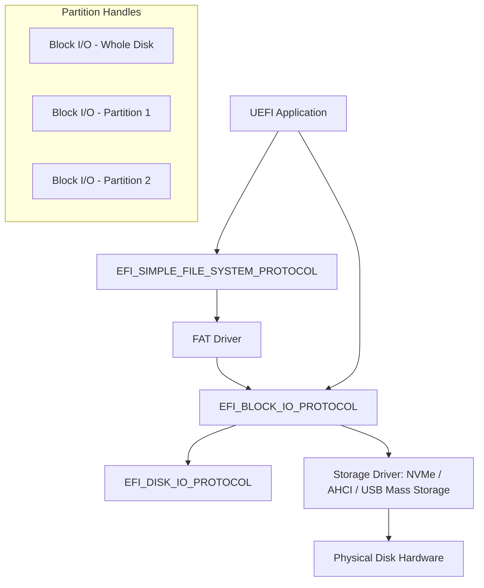

# Chapter 16: Block I/O
{: .fs-9 }

Access raw storage devices, read disk sectors, and detect partition schemes using the Block I/O Protocol.
{: .fs-6 .fw-300 }

---

## 16.1 Block I/O Overview

The Block I/O Protocol provides raw sector-level access to storage devices. It sits below the file system layer and is used by file system drivers to read and write data on disk.



UEFI creates one Block I/O handle for the entire physical disk and one child handle for each detected partition. Each partition handle exposes its own Block I/O instance that maps logical block 0 to the first block of that partition.

---

## 16.2 The Block I/O Protocol Interface

```c
typedef struct _EFI_BLOCK_IO_PROTOCOL {
    UINT64              Revision;
    EFI_BLOCK_IO_MEDIA  *Media;
    EFI_BLOCK_RESET     Reset;
    EFI_BLOCK_READ      ReadBlocks;
    EFI_BLOCK_WRITE     WriteBlocks;
    EFI_BLOCK_FLUSH     FlushBlocks;
} EFI_BLOCK_IO_PROTOCOL;
```

### The Media Descriptor

```c
typedef struct {
    UINT32   MediaId;          // Current media identifier (changes on media swap)
    BOOLEAN  RemovableMedia;   // TRUE if media is removable
    BOOLEAN  MediaPresent;     // TRUE if media is currently inserted
    BOOLEAN  LogicalPartition; // TRUE if this is a partition (not whole disk)
    BOOLEAN  ReadOnly;         // TRUE if media is write-protected
    BOOLEAN  WriteCaching;     // TRUE if write caching is enabled
    UINT32   BlockSize;        // Bytes per block (typically 512 or 4096)
    UINT32   IoAlign;          // Required buffer alignment (0 or power of 2)
    EFI_LBA  LastBlock;        // LBA of the last block on the device
    // Revision 2 fields:
    EFI_LBA  LowestAlignedLba;
    UINT32   LogicalBlocksPerPhysicalBlock;
    UINT32   OptimalTransferLengthGranularity;
} EFI_BLOCK_IO_MEDIA;
```

{: .important }
> The `MediaId` field must be passed to every `ReadBlocks` and `WriteBlocks` call. If the media has changed (e.g., a USB drive was swapped), the call will fail with `EFI_MEDIA_CHANGED`, and you must re-query the media descriptor.

---

## 16.3 Enumerating Storage Devices

```c
#include <Uefi.h>
#include <Library/UefiLib.h>
#include <Library/UefiBootServicesTableLib.h>
#include <Protocol/BlockIo.h>
#include <Protocol/DevicePath.h>
#include <Library/DevicePathLib.h>

EFI_STATUS
ListBlockDevices(VOID)
{
    EFI_STATUS              Status;
    EFI_HANDLE              *Handles;
    UINTN                   HandleCount;
    EFI_BLOCK_IO_PROTOCOL   *BlockIo;
    EFI_DEVICE_PATH_PROTOCOL *DevicePath;

    Status = gBS->LocateHandleBuffer(
                 ByProtocol,
                 &gEfiBlockIoProtocolGuid,
                 NULL,
                 &HandleCount,
                 &Handles
                 );
    if (EFI_ERROR(Status)) {
        Print(L"No block devices found: %r\n", Status);
        return Status;
    }

    Print(L"Found %d block I/O device(s):\n\n", HandleCount);
    Print(L"  %-4s %-10s %-8s %-12s %-10s %s\n",
          L"#", L"Type", L"BlkSize", L"Blocks", L"Size(MB)", L"Device Path");
    Print(L"  %-4s %-10s %-8s %-12s %-10s %s\n",
          L"--", L"--------", L"------", L"----------", L"--------", L"-----------");

    for (UINTN i = 0; i < HandleCount; i++) {
        Status = gBS->HandleProtocol(
                     Handles[i],
                     &gEfiBlockIoProtocolGuid,
                     (VOID **)&BlockIo
                     );
        if (EFI_ERROR(Status)) {
            continue;
        }

        EFI_BLOCK_IO_MEDIA *Media = BlockIo->Media;

        if (!Media->MediaPresent) {
            Print(L"  [%2d] No media present\n", i);
            continue;
        }

        CHAR16 *TypeStr = Media->LogicalPartition ? L"Partition" : L"Disk";
        UINT64 SizeMB   = ((UINT64)(Media->LastBlock + 1) * Media->BlockSize)
                          / (1024 * 1024);

        //
        // Get the device path string for identification.
        //
        CHAR16 *PathStr = L"(unknown)";
        Status = gBS->HandleProtocol(
                     Handles[i],
                     &gEfiDevicePathProtocolGuid,
                     (VOID **)&DevicePath
                     );
        if (!EFI_ERROR(Status)) {
            PathStr = ConvertDevicePathToText(DevicePath, FALSE, FALSE);
        }

        Print(L"  [%2d] %-10s %-8d %-12ld %-10ld %s\n",
              i,
              TypeStr,
              Media->BlockSize,
              Media->LastBlock + 1,
              SizeMB,
              PathStr);

        if (PathStr != L"(unknown)") {
            FreePool(PathStr);
        }
    }

    gBS->FreePool(Handles);
    return EFI_SUCCESS;
}
```

---

## 16.4 Reading Blocks

```c
/**
  Read raw sectors from a block device.

  @param[in]  BlockIo   The Block I/O protocol instance.
  @param[in]  Lba       Starting logical block address.
  @param[in]  Blocks    Number of blocks to read.
  @param[out] Buffer    Caller-allocated buffer (must be aligned per Media->IoAlign).

  @retval EFI_SUCCESS         Data read successfully.
  @retval EFI_DEVICE_ERROR    Hardware error.
  @retval EFI_MEDIA_CHANGED   Media was swapped since last access.
**/
EFI_STATUS
ReadSectors(
    IN  EFI_BLOCK_IO_PROTOCOL  *BlockIo,
    IN  EFI_LBA                Lba,
    IN  UINTN                  Blocks,
    OUT VOID                   *Buffer
    )
{
    UINTN BufferSize = Blocks * BlockIo->Media->BlockSize;

    return BlockIo->ReadBlocks(
               BlockIo,
               BlockIo->Media->MediaId,
               Lba,
               BufferSize,
               Buffer
               );
}
```

### 16.4.1 Buffer Alignment

The `IoAlign` field specifies the minimum alignment of the buffer address. If `IoAlign` is 0 or 1, any alignment is acceptable. Otherwise, the buffer address must be a multiple of `IoAlign`.

```c
#include <Library/MemoryAllocationLib.h>

VOID *
AllocateAlignedBuffer(
    IN EFI_BLOCK_IO_MEDIA  *Media,
    IN UINTN               Size
    )
{
    if (Media->IoAlign <= 1) {
        return AllocatePool(Size);
    }

    return AllocateAlignedPages(
               EFI_SIZE_TO_PAGES(Size),
               Media->IoAlign
               );
}
```

In practice, allocating with `AllocatePages` or `AllocateAlignedPages` guarantees page alignment (4 KB), which satisfies any realistic `IoAlign` requirement.

---

## 16.5 Writing Blocks

```c
EFI_STATUS
WriteSectors(
    IN EFI_BLOCK_IO_PROTOCOL  *BlockIo,
    IN EFI_LBA                Lba,
    IN UINTN                  Blocks,
    IN VOID                   *Buffer
    )
{
    EFI_STATUS Status;
    UINTN      BufferSize = Blocks * BlockIo->Media->BlockSize;

    if (BlockIo->Media->ReadOnly) {
        Print(L"Error: media is read-only.\n");
        return EFI_WRITE_PROTECTED;
    }

    Status = BlockIo->WriteBlocks(
                 BlockIo,
                 BlockIo->Media->MediaId,
                 Lba,
                 BufferSize,
                 Buffer
                 );
    if (EFI_ERROR(Status)) {
        return Status;
    }

    //
    // Flush to ensure data reaches the physical media.
    //
    return BlockIo->FlushBlocks(BlockIo);
}
```

{: .warning }
> Writing to a block device bypasses the file system. Incorrect writes can destroy partition tables, file system metadata, or boot records. Always verify the target device and LBA before writing.

---

## 16.6 Detecting GPT and MBR Partitions

### 16.6.1 Reading the MBR

The Master Boot Record occupies LBA 0 and contains a partition table at offset 446.

```c
#pragma pack(1)
typedef struct {
    UINT8   BootIndicator;
    UINT8   StartHead;
    UINT8   StartSector;
    UINT8   StartTrack;
    UINT8   OSType;
    UINT8   EndHead;
    UINT8   EndSector;
    UINT8   EndTrack;
    UINT32  StartingLBA;
    UINT32  SizeInLBA;
} MBR_PARTITION_ENTRY;

typedef struct {
    UINT8               BootCode[440];
    UINT32              DiskSignature;
    UINT16              Reserved;
    MBR_PARTITION_ENTRY Partitions[4];
    UINT16              Signature;      // Must be 0xAA55
} MASTER_BOOT_RECORD;
#pragma pack()

EFI_STATUS
ReadMbr(
    IN  EFI_BLOCK_IO_PROTOCOL  *BlockIo,
    OUT MASTER_BOOT_RECORD     *Mbr
    )
{
    EFI_STATUS Status;
    UINT8      SectorBuffer[512];

    Status = BlockIo->ReadBlocks(
                 BlockIo,
                 BlockIo->Media->MediaId,
                 0,       // LBA 0
                 512,
                 SectorBuffer
                 );
    if (EFI_ERROR(Status)) {
        return Status;
    }

    CopyMem(Mbr, SectorBuffer, sizeof(MASTER_BOOT_RECORD));

    if (Mbr->Signature != 0xAA55) {
        return EFI_NOT_FOUND;  // Not a valid MBR
    }

    return EFI_SUCCESS;
}

VOID
PrintMbrPartitions(
    IN MASTER_BOOT_RECORD  *Mbr
    )
{
    Print(L"\nMBR Partition Table:\n");
    Print(L"  %-4s %-8s %-12s %-12s %s\n",
          L"#", L"Type", L"Start LBA", L"Size (LBA)", L"Boot");

    for (UINTN i = 0; i < 4; i++) {
        MBR_PARTITION_ENTRY *Entry = &Mbr->Partitions[i];
        if (Entry->OSType == 0) {
            continue;  // Empty entry
        }

        Print(L"  [%d] 0x%02x     %-12d %-12d %s\n",
              i,
              Entry->OSType,
              Entry->StartingLBA,
              Entry->SizeInLBA,
              Entry->BootIndicator == 0x80 ? L"Active" : L"");
    }
}
```

### 16.6.2 Detecting GPT

GPT (GUID Partition Table) disks have a protective MBR at LBA 0 and a GPT header at LBA 1. The protective MBR contains a single partition entry of type `0xEE`.

```c
#pragma pack(1)
typedef struct {
    EFI_TABLE_HEADER  Header;           // Signature = "EFI PART"
    UINT32            MyLBA_Lo;
    UINT32            MyLBA_Hi;
    UINT32            AlternateLBA_Lo;
    UINT32            AlternateLBA_Hi;
    UINT32            FirstUsableLBA_Lo;
    UINT32            FirstUsableLBA_Hi;
    UINT32            LastUsableLBA_Lo;
    UINT32            LastUsableLBA_Hi;
    EFI_GUID          DiskGUID;
    UINT32            PartitionEntryLBA_Lo;
    UINT32            PartitionEntryLBA_Hi;
    UINT32            NumberOfPartitionEntries;
    UINT32            SizeOfPartitionEntry;
    UINT32            PartitionEntryArrayCRC32;
} GPT_HEADER;
#pragma pack()

#define GPT_HEADER_SIGNATURE  0x5452415020494645ULL  // "EFI PART"

BOOLEAN
IsGptDisk(
    IN EFI_BLOCK_IO_PROTOCOL  *BlockIo
    )
{
    EFI_STATUS  Status;
    UINT8       Buffer[512];

    //
    // Read LBA 1 where the GPT header lives.
    //
    Status = BlockIo->ReadBlocks(
                 BlockIo,
                 BlockIo->Media->MediaId,
                 1,      // LBA 1
                 512,
                 Buffer
                 );
    if (EFI_ERROR(Status)) {
        return FALSE;
    }

    //
    // Check for the "EFI PART" signature at the start of the header.
    //
    UINT64 *Signature = (UINT64 *)Buffer;
    return (*Signature == GPT_HEADER_SIGNATURE);
}
```

{: .note }
> In practice, you rarely need to parse GPT structures manually. UEFI firmware automatically creates child Block I/O handles for each GPT partition. The `EFI_PARTITION_INFO_PROTOCOL` (available on partition handles) provides parsed partition type GUIDs and attributes.

---

## 16.7 The Disk I/O Protocol

While Block I/O works in whole-block units, the `EFI_DISK_IO_PROTOCOL` allows byte-granularity reads and writes at arbitrary offsets. It is automatically installed alongside Block I/O.

```c
#include <Protocol/DiskIo.h>

EFI_STATUS
ReadBytesFromDisk(
    IN  EFI_HANDLE  DeviceHandle,
    IN  UINT64      Offset,
    IN  UINTN       Size,
    OUT VOID        *Buffer
    )
{
    EFI_STATUS             Status;
    EFI_DISK_IO_PROTOCOL   *DiskIo;
    EFI_BLOCK_IO_PROTOCOL  *BlockIo;

    Status = gBS->HandleProtocol(
                 DeviceHandle,
                 &gEfiDiskIoProtocolGuid,
                 (VOID **)&DiskIo
                 );
    if (EFI_ERROR(Status)) {
        return Status;
    }

    Status = gBS->HandleProtocol(
                 DeviceHandle,
                 &gEfiBlockIoProtocolGuid,
                 (VOID **)&BlockIo
                 );
    if (EFI_ERROR(Status)) {
        return Status;
    }

    return DiskIo->ReadDisk(
               DiskIo,
               BlockIo->Media->MediaId,
               Offset,
               Size,
               Buffer
               );
}
```

---

## 16.8 Block I/O 2: Asynchronous Operations

The Block I/O 2 Protocol (`EFI_BLOCK_IO2_PROTOCOL`) supports non-blocking reads and writes. This is useful for overlapping I/O with computation.

```c
#include <Protocol/BlockIo2.h>

EFI_STATUS
AsyncReadExample(
    IN EFI_HANDLE  DeviceHandle
    )
{
    EFI_STATUS               Status;
    EFI_BLOCK_IO2_PROTOCOL   *BlockIo2;
    EFI_BLOCK_IO2_TOKEN      Token;
    UINT8                    Buffer[4096];

    Status = gBS->HandleProtocol(
                 DeviceHandle,
                 &gEfiBlockIo2ProtocolGuid,
                 (VOID **)&BlockIo2
                 );
    if (EFI_ERROR(Status)) {
        Print(L"Block I/O 2 not available: %r\n", Status);
        return Status;
    }

    //
    // Create a completion event.
    //
    Status = gBS->CreateEvent(0, 0, NULL, NULL, &Token.Event);
    if (EFI_ERROR(Status)) {
        return Status;
    }

    Token.TransactionStatus = EFI_SUCCESS;

    //
    // Start asynchronous read.
    //
    Status = BlockIo2->ReadBlocksEx(
                 BlockIo2,
                 BlockIo2->Media->MediaId,
                 0,            // LBA 0
                 &Token,
                 sizeof(Buffer),
                 Buffer
                 );
    if (EFI_ERROR(Status)) {
        gBS->CloseEvent(Token.Event);
        return Status;
    }

    //
    // Do other work here while I/O is in progress...
    //
    Print(L"I/O submitted, doing other work...\n");

    //
    // Wait for completion.
    //
    UINTN EventIndex;
    gBS->WaitForEvent(1, &Token.Event, &EventIndex);

    Print(L"I/O completed with status: %r\n", Token.TransactionStatus);

    gBS->CloseEvent(Token.Event);
    return Token.TransactionStatus;
}
```

---

## 16.9 Practical Example: Hex Dump of a Disk Sector

```c
#include <Uefi.h>
#include <Library/UefiLib.h>
#include <Library/UefiBootServicesTableLib.h>
#include <Library/MemoryAllocationLib.h>
#include <Library/BaseMemoryLib.h>
#include <Protocol/BlockIo.h>

VOID
HexDump(
    IN UINT8   *Data,
    IN UINTN   Size
    )
{
    for (UINTN Offset = 0; Offset < Size; Offset += 16) {
        Print(L"  %04x: ", Offset);

        // Hex bytes
        for (UINTN j = 0; j < 16 && (Offset + j) < Size; j++) {
            Print(L"%02x ", Data[Offset + j]);
        }

        // ASCII representation
        Print(L" |");
        for (UINTN j = 0; j < 16 && (Offset + j) < Size; j++) {
            UINT8 Ch = Data[Offset + j];
            Print(L"%c", (Ch >= 0x20 && Ch <= 0x7E) ? Ch : L'.');
        }
        Print(L"|\n");
    }
}

EFI_STATUS
DumpSector(
    IN EFI_BLOCK_IO_PROTOCOL  *BlockIo,
    IN EFI_LBA                Lba
    )
{
    EFI_STATUS  Status;
    UINTN       BlockSize = BlockIo->Media->BlockSize;
    UINT8       *Buffer;

    Buffer = AllocatePool(BlockSize);
    if (Buffer == NULL) {
        return EFI_OUT_OF_RESOURCES;
    }

    Status = BlockIo->ReadBlocks(
                 BlockIo,
                 BlockIo->Media->MediaId,
                 Lba,
                 BlockSize,
                 Buffer
                 );
    if (EFI_ERROR(Status)) {
        Print(L"ReadBlocks failed at LBA %ld: %r\n", Lba, Status);
        FreePool(Buffer);
        return Status;
    }

    Print(L"\nSector at LBA %ld (Block Size = %d bytes):\n\n", Lba, BlockSize);
    HexDump(Buffer, BlockSize);

    FreePool(Buffer);
    return EFI_SUCCESS;
}
```

---

## 16.10 Distinguishing Whole Disks from Partitions

When enumerating Block I/O handles, you often need to distinguish physical disks from partition handles:

```c
BOOLEAN
IsWholeDisk(
    IN EFI_BLOCK_IO_PROTOCOL  *BlockIo
    )
{
    //
    // The Media->LogicalPartition field is FALSE for the raw disk
    // and TRUE for partition child handles.
    //
    return !BlockIo->Media->LogicalPartition;
}
```

You can also use device path inspection to determine the disk type (NVMe, SATA, USB, etc.) and partition number by examining the last node of the device path.

---

{: .note }
> **Complete source code**: The full working example for this chapter is available at [`examples/UefiMuGuidePkg/BlockIoExample/`]({{ site.baseurl }}/examples/UefiMuGuidePkg/BlockIoExample/).

## Summary

| Concept | Key Points |
|---|---|
| **Block I/O** | Sector-level access; one handle per disk and per partition |
| **MediaId** | Must match current media; check for `EFI_MEDIA_CHANGED` |
| **ReadBlocks** | Reads whole blocks; buffer must satisfy `IoAlign` |
| **WriteBlocks** | Bypasses file system; use with extreme caution |
| **MBR/GPT** | MBR at LBA 0, GPT header at LBA 1; firmware auto-creates partition handles |
| **Disk I/O** | Byte-granularity access layered on top of Block I/O |
| **Block I/O 2** | Asynchronous variant for non-blocking operations |
| **LogicalPartition** | `TRUE` for partition handles, `FALSE` for whole-disk handles |

In the next chapter, we move up to the network stack and explore UEFI's layered networking architecture.
