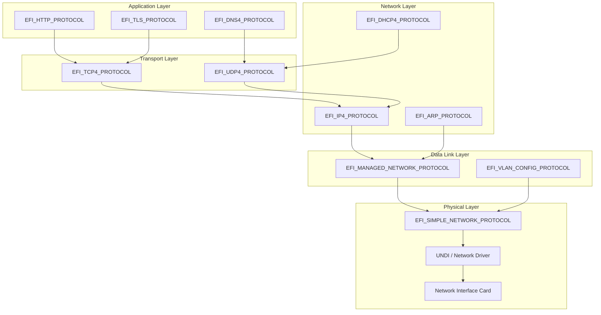
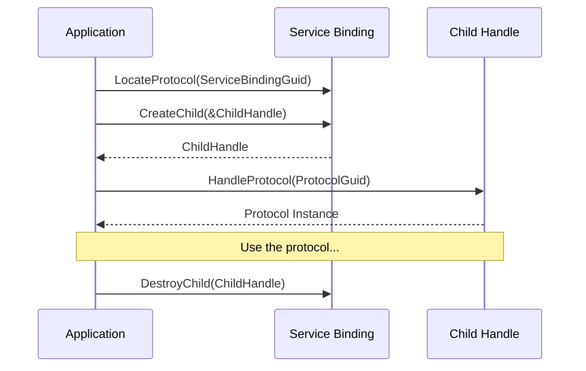
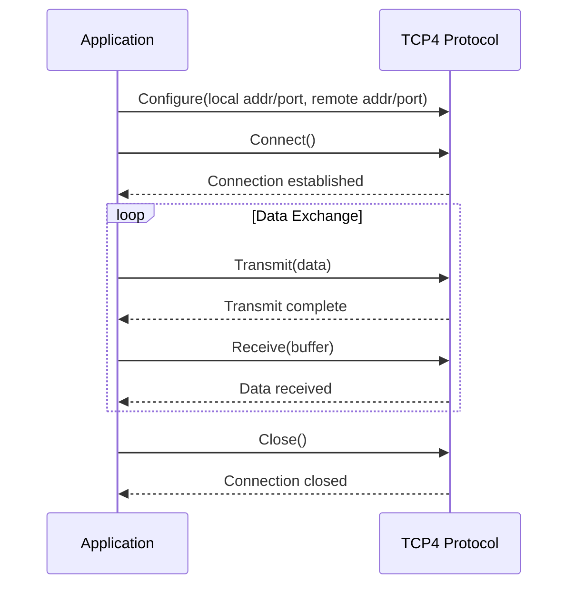
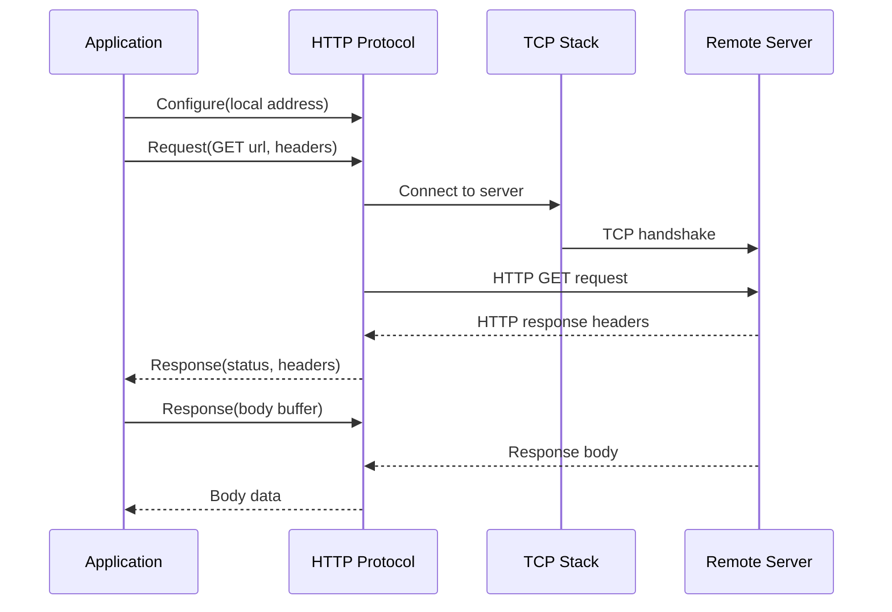

# Chapter 17: Network Stack
{: .fs-9 }

Explore the layered UEFI network architecture, configure interfaces via DHCP, and build TCP and UDP applications.
{: .fs-6 .fw-300 }

---

## 17.1 UEFI Network Architecture

UEFI implements a full-featured network stack organized into well-defined layers, each exposed as a separate protocol. This design allows applications to operate at whatever level of abstraction suits their needs.



### Layer Summary

| Layer | Protocol | Purpose |
|---|---|---|
| Physical | `EFI_SIMPLE_NETWORK_PROTOCOL` (SNP) | Raw Ethernet frame send/receive |
| Data Link | `EFI_MANAGED_NETWORK_PROTOCOL` (MNP) | Managed Ethernet with filtering, VLAN |
| Network | `EFI_IP4_PROTOCOL` | IPv4 packet send/receive |
| Network | `EFI_DHCP4_PROTOCOL` | Dynamic IP configuration |
| Network | `EFI_ARP_PROTOCOL` | Address Resolution Protocol |
| Transport | `EFI_TCP4_PROTOCOL` | Reliable stream connections |
| Transport | `EFI_UDP4_PROTOCOL` | Connectionless datagrams |
| Application | `EFI_DNS4_PROTOCOL` | Domain name resolution |
| Application | `EFI_HTTP_PROTOCOL` | HTTP client |
| Application | `EFI_TLS_PROTOCOL` | TLS encryption |

{: .note }
> IPv6 equivalents exist for most protocols (`EFI_TCP6_PROTOCOL`, `EFI_UDP6_PROTOCOL`, `EFI_IP6_PROTOCOL`, etc.). The concepts are identical; only the address structures differ. This chapter focuses on IPv4 for clarity.

---

## 17.2 Simple Network Protocol (SNP)

SNP provides the lowest-level network access -- raw Ethernet frames. Most applications use higher-level protocols, but SNP is useful for diagnostics and custom protocol implementations.

### 17.2.1 Locating and Initializing SNP

```c
#include <Uefi.h>
#include <Library/UefiLib.h>
#include <Library/UefiBootServicesTableLib.h>
#include <Protocol/SimpleNetwork.h>

EFI_STATUS
InitializeNetwork(
    OUT EFI_SIMPLE_NETWORK_PROTOCOL  **Snp
    )
{
    EFI_STATUS Status;

    Status = gBS->LocateProtocol(
                 &gEfiSimpleNetworkProtocolGuid,
                 NULL,
                 (VOID **)Snp
                 );
    if (EFI_ERROR(Status)) {
        Print(L"No network interface found: %r\n", Status);
        return Status;
    }

    //
    // SNP must be in the "Started" or "Initialized" state to operate.
    //
    if ((*Snp)->Mode->State == EfiSimpleNetworkStopped) {
        Status = (*Snp)->Start(*Snp);
        if (EFI_ERROR(Status)) {
            return Status;
        }
    }

    if ((*Snp)->Mode->State == EfiSimpleNetworkStarted) {
        Status = (*Snp)->Initialize(*Snp, 0, 0);
        if (EFI_ERROR(Status)) {
            return Status;
        }
    }

    //
    // Print MAC address.
    //
    EFI_MAC_ADDRESS *Mac = &(*Snp)->Mode->CurrentAddress;
    Print(L"MAC Address: %02x:%02x:%02x:%02x:%02x:%02x\n",
          Mac->Addr[0], Mac->Addr[1], Mac->Addr[2],
          Mac->Addr[3], Mac->Addr[4], Mac->Addr[5]);

    return EFI_SUCCESS;
}
```

### 17.2.2 Network Interface Information

```c
VOID
PrintNetworkInfo(
    IN EFI_SIMPLE_NETWORK_PROTOCOL  *Snp
    )
{
    EFI_SIMPLE_NETWORK_MODE *Mode = Snp->Mode;

    Print(L"Network Interface Information:\n");
    Print(L"  State:             %d\n", Mode->State);
    Print(L"  HW Address Size:   %d bytes\n", Mode->HwAddressSize);
    Print(L"  Media Header Size: %d bytes\n", Mode->MediaHeaderSize);
    Print(L"  Max Packet Size:   %d bytes\n", Mode->MaxPacketSize);
    Print(L"  NV RAM Size:       %d bytes\n", Mode->NvRamSize);
    Print(L"  Interface Type:    %d\n", Mode->IfType);
    Print(L"  Media Present:     %s\n",
          Mode->MediaPresent ? L"Yes" : L"No");
    Print(L"  Receive Filters:   0x%08x\n", Mode->ReceiveFilterSetting);
}
```

---

## 17.3 DHCP Configuration

Before using IP, TCP, or UDP, you typically need an IP address. The DHCP4 protocol automates this.

### 17.3.1 Service Binding Pattern

Network protocols above SNP use the **Service Binding** pattern. You do not locate them directly. Instead:

1. Locate the `EFI_SERVICE_BINDING_PROTOCOL` for the desired protocol.
2. Call `CreateChild()` to get a new child handle.
3. Open the actual protocol on the child handle.
4. When done, call `DestroyChild()`.



### 17.3.2 Acquiring an IP Address via DHCP

```c
#include <Protocol/Dhcp4.h>
#include <Protocol/ServiceBinding.h>

EFI_STATUS
ConfigureDhcp(
    IN  EFI_HANDLE  NicHandle,
    OUT EFI_IPv4_ADDRESS  *AssignedIp
    )
{
    EFI_STATUS                   Status;
    EFI_SERVICE_BINDING_PROTOCOL *Dhcp4Sb;
    EFI_DHCP4_PROTOCOL          *Dhcp4;
    EFI_HANDLE                   Dhcp4Handle = NULL;
    EFI_DHCP4_MODE_DATA          ModeData;

    //
    // Step 1: Locate DHCP4 Service Binding on the NIC handle.
    //
    Status = gBS->HandleProtocol(
                 NicHandle,
                 &gEfiDhcp4ServiceBindingProtocolGuid,
                 (VOID **)&Dhcp4Sb
                 );
    if (EFI_ERROR(Status)) {
        Print(L"DHCP4 service binding not found: %r\n", Status);
        return Status;
    }

    //
    // Step 2: Create a DHCP4 child instance.
    //
    Status = Dhcp4Sb->CreateChild(Dhcp4Sb, &Dhcp4Handle);
    if (EFI_ERROR(Status)) {
        return Status;
    }

    Status = gBS->HandleProtocol(
                 Dhcp4Handle,
                 &gEfiDhcp4ProtocolGuid,
                 (VOID **)&Dhcp4
                 );
    if (EFI_ERROR(Status)) {
        Dhcp4Sb->DestroyChild(Dhcp4Sb, Dhcp4Handle);
        return Status;
    }

    //
    // Step 3: Start the DHCP process.
    // This sends DISCOVER, waits for OFFER, sends REQUEST, waits for ACK.
    //
    Print(L"Starting DHCP...\n");
    Status = Dhcp4->Start(Dhcp4, NULL);  // NULL = no completion event (blocking)
    if (EFI_ERROR(Status)) {
        Print(L"DHCP failed: %r\n", Status);
        Dhcp4Sb->DestroyChild(Dhcp4Sb, Dhcp4Handle);
        return Status;
    }

    //
    // Step 4: Retrieve the assigned configuration.
    //
    Status = Dhcp4->GetModeData(Dhcp4, &ModeData);
    if (!EFI_ERROR(Status)) {
        CopyMem(AssignedIp, &ModeData.ClientAddress, sizeof(EFI_IPv4_ADDRESS));
        Print(L"Assigned IP:     %d.%d.%d.%d\n",
              AssignedIp->Addr[0], AssignedIp->Addr[1],
              AssignedIp->Addr[2], AssignedIp->Addr[3]);
        Print(L"Subnet Mask:     %d.%d.%d.%d\n",
              ModeData.SubnetMask.Addr[0], ModeData.SubnetMask.Addr[1],
              ModeData.SubnetMask.Addr[2], ModeData.SubnetMask.Addr[3]);
        Print(L"Router:          %d.%d.%d.%d\n",
              ModeData.RouterAddress.Addr[0], ModeData.RouterAddress.Addr[1],
              ModeData.RouterAddress.Addr[2], ModeData.RouterAddress.Addr[3]);
    }

    //
    // Note: Do not destroy the child while the DHCP lease is needed.
    // The lease must remain active for IP connectivity to work.
    //

    return EFI_SUCCESS;
}
```

---

## 17.4 TCP Connections

The TCP4 protocol provides reliable, ordered, byte-stream communication.

### 17.4.1 TCP4 Workflow



### 17.4.2 Creating a TCP Connection

```c
#include <Protocol/Tcp4.h>

EFI_STATUS
TcpConnect(
    IN EFI_HANDLE         NicHandle,
    IN EFI_IPv4_ADDRESS   *RemoteIp,
    IN UINT16             RemotePort,
    OUT EFI_TCP4_PROTOCOL **TcpOut,
    OUT EFI_HANDLE        *TcpHandle
    )
{
    EFI_STATUS                    Status;
    EFI_SERVICE_BINDING_PROTOCOL  *TcpSb;
    EFI_TCP4_PROTOCOL             *Tcp4;
    EFI_TCP4_CONFIG_DATA          ConfigData;
    EFI_TCP4_ACCESS_POINT         *AccessPoint;
    EFI_TCP4_CONNECTION_TOKEN     ConnToken;

    //
    // Create a TCP4 child instance.
    //
    Status = gBS->HandleProtocol(
                 NicHandle,
                 &gEfiTcp4ServiceBindingProtocolGuid,
                 (VOID **)&TcpSb
                 );
    if (EFI_ERROR(Status)) {
        return Status;
    }

    *TcpHandle = NULL;
    Status = TcpSb->CreateChild(TcpSb, TcpHandle);
    if (EFI_ERROR(Status)) {
        return Status;
    }

    Status = gBS->HandleProtocol(
                 *TcpHandle,
                 &gEfiTcp4ProtocolGuid,
                 (VOID **)&Tcp4
                 );
    if (EFI_ERROR(Status)) {
        TcpSb->DestroyChild(TcpSb, *TcpHandle);
        return Status;
    }

    //
    // Configure the TCP connection parameters.
    //
    ZeroMem(&ConfigData, sizeof(ConfigData));
    ConfigData.TypeOfService       = 0;
    ConfigData.TimeToLive          = 64;

    AccessPoint = &ConfigData.AccessPoint;
    AccessPoint->UseDefaultAddress = TRUE;   // Use DHCP-assigned address
    AccessPoint->StationPort       = 0;      // Ephemeral local port
    AccessPoint->ActiveFlag        = TRUE;   // Active open (client)
    CopyMem(&AccessPoint->RemoteAddress, RemoteIp, sizeof(EFI_IPv4_ADDRESS));
    AccessPoint->RemotePort        = RemotePort;

    ConfigData.ControlOption = NULL;  // Use default TCP options

    Status = Tcp4->Configure(Tcp4, &ConfigData);
    if (EFI_ERROR(Status)) {
        Print(L"TCP Configure failed: %r\n", Status);
        TcpSb->DestroyChild(TcpSb, *TcpHandle);
        return Status;
    }

    //
    // Initiate the TCP three-way handshake.
    //
    ZeroMem(&ConnToken, sizeof(ConnToken));
    Status = gBS->CreateEvent(0, 0, NULL, NULL, &ConnToken.CompletionToken.Event);
    if (EFI_ERROR(Status)) {
        TcpSb->DestroyChild(TcpSb, *TcpHandle);
        return Status;
    }

    Status = Tcp4->Connect(Tcp4, &ConnToken);
    if (EFI_ERROR(Status)) {
        Print(L"TCP Connect initiation failed: %r\n", Status);
        gBS->CloseEvent(ConnToken.CompletionToken.Event);
        TcpSb->DestroyChild(TcpSb, *TcpHandle);
        return Status;
    }

    //
    // Wait for the connection to complete.
    //
    UINTN EventIndex;
    gBS->WaitForEvent(1, &ConnToken.CompletionToken.Event, &EventIndex);
    gBS->CloseEvent(ConnToken.CompletionToken.Event);

    if (EFI_ERROR(ConnToken.CompletionToken.Status)) {
        Print(L"TCP Connect failed: %r\n", ConnToken.CompletionToken.Status);
        TcpSb->DestroyChild(TcpSb, *TcpHandle);
        return ConnToken.CompletionToken.Status;
    }

    Print(L"TCP connected to %d.%d.%d.%d:%d\n",
          RemoteIp->Addr[0], RemoteIp->Addr[1],
          RemoteIp->Addr[2], RemoteIp->Addr[3],
          RemotePort);

    *TcpOut = Tcp4;
    return EFI_SUCCESS;
}
```

### 17.4.3 Sending Data over TCP

```c
EFI_STATUS
TcpSend(
    IN EFI_TCP4_PROTOCOL  *Tcp4,
    IN VOID               *Data,
    IN UINTN              DataLength
    )
{
    EFI_STATUS           Status;
    EFI_TCP4_IO_TOKEN    TxToken;
    EFI_TCP4_TRANSMIT_DATA TxData;
    EFI_TCP4_FRAGMENT_DATA Fragment;

    Fragment.FragmentLength = (UINT32)DataLength;
    Fragment.FragmentBuffer = Data;

    ZeroMem(&TxData, sizeof(TxData));
    TxData.Push           = TRUE;
    TxData.Urgent         = FALSE;
    TxData.DataLength     = (UINT32)DataLength;
    TxData.FragmentCount  = 1;
    TxData.FragmentTable[0] = Fragment;

    ZeroMem(&TxToken, sizeof(TxToken));
    TxToken.Packet.TxData = &TxData;

    Status = gBS->CreateEvent(0, 0, NULL, NULL, &TxToken.CompletionToken.Event);
    if (EFI_ERROR(Status)) {
        return Status;
    }

    Status = Tcp4->Transmit(Tcp4, &TxToken);
    if (EFI_ERROR(Status)) {
        gBS->CloseEvent(TxToken.CompletionToken.Event);
        return Status;
    }

    UINTN EventIndex;
    gBS->WaitForEvent(1, &TxToken.CompletionToken.Event, &EventIndex);
    gBS->CloseEvent(TxToken.CompletionToken.Event);

    return TxToken.CompletionToken.Status;
}
```

### 17.4.4 Receiving Data over TCP

```c
EFI_STATUS
TcpReceive(
    IN  EFI_TCP4_PROTOCOL  *Tcp4,
    OUT VOID               *Buffer,
    IN  UINTN              BufferSize,
    OUT UINTN              *BytesReceived
    )
{
    EFI_STATUS              Status;
    EFI_TCP4_IO_TOKEN       RxToken;
    EFI_TCP4_RECEIVE_DATA   RxData;
    EFI_TCP4_FRAGMENT_DATA  Fragment;

    Fragment.FragmentLength = (UINT32)BufferSize;
    Fragment.FragmentBuffer = Buffer;

    ZeroMem(&RxData, sizeof(RxData));
    RxData.UrgentFlag     = FALSE;
    RxData.DataLength     = (UINT32)BufferSize;
    RxData.FragmentCount  = 1;
    RxData.FragmentTable[0] = Fragment;

    ZeroMem(&RxToken, sizeof(RxToken));
    RxToken.Packet.RxData = &RxData;

    Status = gBS->CreateEvent(0, 0, NULL, NULL, &RxToken.CompletionToken.Event);
    if (EFI_ERROR(Status)) {
        return Status;
    }

    Status = Tcp4->Receive(Tcp4, &RxToken);
    if (EFI_ERROR(Status)) {
        gBS->CloseEvent(RxToken.CompletionToken.Event);
        return Status;
    }

    UINTN EventIndex;
    gBS->WaitForEvent(1, &RxToken.CompletionToken.Event, &EventIndex);
    gBS->CloseEvent(RxToken.CompletionToken.Event);

    if (!EFI_ERROR(RxToken.CompletionToken.Status)) {
        *BytesReceived = RxData.FragmentTable[0].FragmentLength;
    }

    return RxToken.CompletionToken.Status;
}
```

---

## 17.5 UDP Communication

UDP provides connectionless, best-effort datagram delivery. It is simpler than TCP and useful for DNS queries, TFTP, and PXE boot.

### 17.5.1 Sending a UDP Datagram

```c
#include <Protocol/Udp4.h>

EFI_STATUS
UdpSendDatagram(
    IN EFI_HANDLE         NicHandle,
    IN EFI_IPv4_ADDRESS   *DestIp,
    IN UINT16             DestPort,
    IN VOID               *Data,
    IN UINTN              DataLength
    )
{
    EFI_STATUS                    Status;
    EFI_SERVICE_BINDING_PROTOCOL  *UdpSb;
    EFI_UDP4_PROTOCOL             *Udp4;
    EFI_HANDLE                    UdpHandle = NULL;
    EFI_UDP4_CONFIG_DATA          ConfigData;
    EFI_UDP4_COMPLETION_TOKEN     TxToken;
    EFI_UDP4_TRANSMIT_DATA        TxData;
    EFI_UDP4_SESSION_DATA         SessionData;
    EFI_UDP4_FRAGMENT_DATA        Fragment;

    //
    // Create a UDP4 child.
    //
    Status = gBS->HandleProtocol(
                 NicHandle,
                 &gEfiUdp4ServiceBindingProtocolGuid,
                 (VOID **)&UdpSb
                 );
    if (EFI_ERROR(Status)) {
        return Status;
    }

    Status = UdpSb->CreateChild(UdpSb, &UdpHandle);
    if (EFI_ERROR(Status)) {
        return Status;
    }

    Status = gBS->HandleProtocol(
                 UdpHandle,
                 &gEfiUdp4ProtocolGuid,
                 (VOID **)&Udp4
                 );
    if (EFI_ERROR(Status)) {
        UdpSb->DestroyChild(UdpSb, UdpHandle);
        return Status;
    }

    //
    // Configure UDP endpoint.
    //
    ZeroMem(&ConfigData, sizeof(ConfigData));
    ConfigData.AcceptBroadcast    = FALSE;
    ConfigData.AcceptPromiscuous  = FALSE;
    ConfigData.AcceptAnyPort      = FALSE;
    ConfigData.AllowDuplicatePort = FALSE;
    ConfigData.TimeToLive         = 64;
    ConfigData.TypeOfService      = 0;
    ConfigData.DoNotFragment      = FALSE;
    ConfigData.ReceiveTimeout     = 0;
    ConfigData.TransmitTimeout    = 0;
    ConfigData.UseDefaultAddress  = TRUE;
    ConfigData.StationPort        = 0;  // Ephemeral port

    Status = Udp4->Configure(Udp4, &ConfigData);
    if (EFI_ERROR(Status)) {
        Print(L"UDP Configure failed: %r\n", Status);
        UdpSb->DestroyChild(UdpSb, UdpHandle);
        return Status;
    }

    //
    // Build the transmit token.
    //
    ZeroMem(&SessionData, sizeof(SessionData));
    CopyMem(&SessionData.DestinationAddress, DestIp, sizeof(EFI_IPv4_ADDRESS));
    SessionData.DestinationPort = DestPort;

    Fragment.FragmentLength = (UINT32)DataLength;
    Fragment.FragmentBuffer = Data;

    ZeroMem(&TxData, sizeof(TxData));
    TxData.UdpSessionData  = &SessionData;
    TxData.GatewayAddress  = NULL;
    TxData.DataLength      = (UINT32)DataLength;
    TxData.FragmentCount   = 1;
    TxData.FragmentTable[0] = Fragment;

    ZeroMem(&TxToken, sizeof(TxToken));
    TxToken.Packet.TxData = &TxData;

    Status = gBS->CreateEvent(0, 0, NULL, NULL, &TxToken.Event);
    if (EFI_ERROR(Status)) {
        UdpSb->DestroyChild(UdpSb, UdpHandle);
        return Status;
    }

    Status = Udp4->Transmit(Udp4, &TxToken);
    if (!EFI_ERROR(Status)) {
        UINTN EventIndex;
        gBS->WaitForEvent(1, &TxToken.Event, &EventIndex);
    }

    gBS->CloseEvent(TxToken.Event);
    UdpSb->DestroyChild(UdpSb, UdpHandle);

    return Status;
}
```

---

## 17.6 DNS Resolution

The `EFI_DNS4_PROTOCOL` resolves hostnames to IP addresses.

```c
#include <Protocol/Dns4.h>

EFI_STATUS
ResolveHostname(
    IN  EFI_HANDLE        NicHandle,
    IN  CHAR16            *Hostname,
    OUT EFI_IPv4_ADDRESS  *ResolvedIp
    )
{
    EFI_STATUS                    Status;
    EFI_SERVICE_BINDING_PROTOCOL  *DnsSb;
    EFI_DNS4_PROTOCOL             *Dns4;
    EFI_HANDLE                    DnsHandle = NULL;
    EFI_DNS4_CONFIG_DATA          ConfigData;
    EFI_DNS4_COMPLETION_TOKEN     Token;

    //
    // Create DNS4 child.
    //
    Status = gBS->HandleProtocol(
                 NicHandle,
                 &gEfiDns4ServiceBindingProtocolGuid,
                 (VOID **)&DnsSb
                 );
    if (EFI_ERROR(Status)) {
        Print(L"DNS4 service not available: %r\n", Status);
        return Status;
    }

    Status = DnsSb->CreateChild(DnsSb, &DnsHandle);
    if (EFI_ERROR(Status)) return Status;

    Status = gBS->HandleProtocol(
                 DnsHandle, &gEfiDns4ProtocolGuid, (VOID **)&Dns4);
    if (EFI_ERROR(Status)) {
        DnsSb->DestroyChild(DnsSb, DnsHandle);
        return Status;
    }

    //
    // Configure DNS with a DNS server address.
    // In a real application, get this from DHCP option 6.
    //
    ZeroMem(&ConfigData, sizeof(ConfigData));
    ConfigData.DnsServerListCount = 1;
    EFI_IPv4_ADDRESS DnsServer = {{ 8, 8, 8, 8 }};  // Google DNS
    ConfigData.DnsServerList = &DnsServer;
    ConfigData.UseDefaultSetting = FALSE;
    ConfigData.EnableDnsCache    = TRUE;
    ConfigData.Protocol          = EFI_DNS4_CONFIG_DATA_PROTOCOL;
    // Set station address to use default
    ZeroMem(&ConfigData.StationIp, sizeof(EFI_IPv4_ADDRESS));
    ZeroMem(&ConfigData.SubnetMask, sizeof(EFI_IPv4_ADDRESS));
    ConfigData.RetryCount   = 3;
    ConfigData.RetryInterval = 5;

    Status = Dns4->Configure(Dns4, &ConfigData);
    if (EFI_ERROR(Status)) {
        Print(L"DNS Configure failed: %r\n", Status);
        DnsSb->DestroyChild(DnsSb, DnsHandle);
        return Status;
    }

    //
    // Perform the lookup.
    //
    ZeroMem(&Token, sizeof(Token));
    Status = gBS->CreateEvent(0, 0, NULL, NULL, &Token.Event);
    if (EFI_ERROR(Status)) {
        DnsSb->DestroyChild(DnsSb, DnsHandle);
        return Status;
    }

    Status = Dns4->HostNameToIp(Dns4, Hostname, &Token);
    if (!EFI_ERROR(Status)) {
        UINTN EventIndex;
        gBS->WaitForEvent(1, &Token.Event, &EventIndex);

        if (!EFI_ERROR(Token.Status) &&
            Token.RspData.H2AData != NULL &&
            Token.RspData.H2AData->IpCount > 0)
        {
            CopyMem(ResolvedIp,
                    Token.RspData.H2AData->IpList,
                    sizeof(EFI_IPv4_ADDRESS));
            Print(L"Resolved %s -> %d.%d.%d.%d\n",
                  Hostname,
                  ResolvedIp->Addr[0], ResolvedIp->Addr[1],
                  ResolvedIp->Addr[2], ResolvedIp->Addr[3]);
        } else {
            Status = EFI_NOT_FOUND;
        }
    }

    gBS->CloseEvent(Token.Event);
    DnsSb->DestroyChild(DnsSb, DnsHandle);
    return Status;
}
```

---

## 17.7 HTTP Protocol Overview

The `EFI_HTTP_PROTOCOL` provides a high-level HTTP client that handles TCP connection management, chunked transfer encoding, and (with TLS) HTTPS.

### 17.7.1 HTTP Request Flow



### 17.7.2 Making an HTTP GET Request

```c
#include <Protocol/Http.h>

EFI_STATUS
HttpGet(
    IN  EFI_HANDLE   NicHandle,
    IN  CHAR16       *Url,
    OUT VOID         **ResponseBody,
    OUT UINTN        *BodyLength
    )
{
    EFI_STATUS                    Status;
    EFI_SERVICE_BINDING_PROTOCOL  *HttpSb;
    EFI_HTTP_PROTOCOL             *Http;
    EFI_HANDLE                    HttpHandle = NULL;
    EFI_HTTP_CONFIG_DATA          ConfigData;
    EFI_HTTPv4_ACCESS_POINT       Ipv4Node;
    EFI_HTTP_TOKEN                ReqToken, RspToken;
    EFI_HTTP_MESSAGE              ReqMessage, RspMessage;
    EFI_HTTP_REQUEST_DATA         RequestData;
    EFI_HTTP_RESPONSE_DATA        ResponseData;
    EFI_HTTP_HEADER               RequestHeaders[1];

    //
    // Create HTTP child.
    //
    Status = gBS->HandleProtocol(
                 NicHandle,
                 &gEfiHttpServiceBindingProtocolGuid,
                 (VOID **)&HttpSb
                 );
    if (EFI_ERROR(Status)) return Status;

    Status = HttpSb->CreateChild(HttpSb, &HttpHandle);
    if (EFI_ERROR(Status)) return Status;

    Status = gBS->HandleProtocol(
                 HttpHandle, &gEfiHttpProtocolGuid, (VOID **)&Http);
    if (EFI_ERROR(Status)) {
        HttpSb->DestroyChild(HttpSb, HttpHandle);
        return Status;
    }

    //
    // Configure HTTP to use IPv4 with default address.
    //
    ZeroMem(&Ipv4Node, sizeof(Ipv4Node));
    Ipv4Node.UseDefaultAddress = TRUE;

    ZeroMem(&ConfigData, sizeof(ConfigData));
    ConfigData.HttpVersion          = HttpVersion11;
    ConfigData.TimeOutMillisec      = 30000;
    ConfigData.LocalAddressIsIPv6   = FALSE;
    ConfigData.AccessPoint.IPv4Node = &Ipv4Node;

    Status = Http->Configure(Http, &ConfigData);
    if (EFI_ERROR(Status)) {
        Print(L"HTTP Configure failed: %r\n", Status);
        HttpSb->DestroyChild(HttpSb, HttpHandle);
        return Status;
    }

    //
    // Build the HTTP request.
    //
    RequestData.Method = HttpMethodGet;
    RequestData.Url    = Url;

    RequestHeaders[0].FieldName  = "Host";
    RequestHeaders[0].FieldValue = "example.com";  // Set appropriately

    ZeroMem(&ReqMessage, sizeof(ReqMessage));
    ReqMessage.Data.Request = &RequestData;
    ReqMessage.HeaderCount  = 1;
    ReqMessage.Headers      = RequestHeaders;
    ReqMessage.BodyLength   = 0;
    ReqMessage.Body         = NULL;

    ZeroMem(&ReqToken, sizeof(ReqToken));
    ReqToken.Message = &ReqMessage;
    Status = gBS->CreateEvent(0, 0, NULL, NULL, &ReqToken.Event);
    if (EFI_ERROR(Status)) {
        HttpSb->DestroyChild(HttpSb, HttpHandle);
        return Status;
    }

    //
    // Send the request.
    //
    Status = Http->Request(Http, &ReqToken);
    if (!EFI_ERROR(Status)) {
        UINTN EventIndex;
        gBS->WaitForEvent(1, &ReqToken.Event, &EventIndex);
    }
    gBS->CloseEvent(ReqToken.Event);

    if (EFI_ERROR(ReqToken.Status)) {
        Print(L"HTTP Request failed: %r\n", ReqToken.Status);
        HttpSb->DestroyChild(HttpSb, HttpHandle);
        return ReqToken.Status;
    }

    //
    // Receive the response headers.
    //
    ZeroMem(&ResponseData, sizeof(ResponseData));
    ZeroMem(&RspMessage, sizeof(RspMessage));
    RspMessage.Data.Response = &ResponseData;
    RspMessage.BodyLength    = 0;
    RspMessage.Body          = NULL;

    ZeroMem(&RspToken, sizeof(RspToken));
    RspToken.Message = &RspMessage;
    Status = gBS->CreateEvent(0, 0, NULL, NULL, &RspToken.Event);
    if (EFI_ERROR(Status)) {
        HttpSb->DestroyChild(HttpSb, HttpHandle);
        return Status;
    }

    Status = Http->Response(Http, &RspToken);
    if (!EFI_ERROR(Status)) {
        UINTN EventIndex;
        gBS->WaitForEvent(1, &RspToken.Event, &EventIndex);
    }
    gBS->CloseEvent(RspToken.Event);

    Print(L"HTTP Status: %d\n", ResponseData.StatusCode);

    //
    // For brevity, body reading is omitted here.
    // In production, check Content-Length or use chunked reading.
    //

    HttpSb->DestroyChild(HttpSb, HttpHandle);
    return EFI_SUCCESS;
}
```

---

## 17.8 TLS Support

UEFI provides `EFI_TLS_PROTOCOL` and `EFI_TLS_CONFIGURATION_PROTOCOL` for TLS encryption. The HTTP protocol can use TLS automatically when given an `https://` URL, provided that:

1. TLS drivers are loaded in the firmware.
2. Trusted CA certificates are provisioned via `EFI_TLS_CONFIGURATION_PROTOCOL`.

```c
//
// Conceptual overview of TLS certificate provisioning:
//
// 1. Locate EFI_TLS_CONFIGURATION_PROTOCOL.
// 2. Call SetData() with EfiTlsConfigDataTypeCACertificate.
// 3. Provide the DER-encoded CA certificate.
// 4. Now HTTPS connections will validate server certificates against this CA.
//

// Most firmware images include a default set of trusted CAs,
// but custom deployments may need to add their own.
```

{: .note }
> TLS support in UEFI firmware varies significantly between vendors. Not all firmware images include TLS drivers. For PXE boot over HTTPS, verify that your firmware supports `EFI_HTTP_PROTOCOL` with TLS before deploying.

---

## 17.9 Finding Network Interface Handles

All the examples above require a NIC handle. Here is how to find them:

```c
EFI_STATUS
FindNetworkInterfaces(
    OUT EFI_HANDLE  **Handles,
    OUT UINTN       *HandleCount
    )
{
    //
    // Network interfaces are identified by handles that support
    // the Managed Network Service Binding Protocol.
    //
    return gBS->LocateHandleBuffer(
               ByProtocol,
               &gEfiManagedNetworkServiceBindingProtocolGuid,
               NULL,
               HandleCount,
               Handles
               );
}
```

---

## 17.10 Practical Tips

### Timeouts

All network operations should have timeouts. The blocking `WaitForEvent` can hang indefinitely if the network is down. Use `CheckEvent` in a polling loop with a timeout counter, or configure protocol-level timeouts where available.

### Error Recovery

Network protocols require careful cleanup:

1. Always destroy child handles when done.
2. If `Configure` succeeds but a later step fails, call `Configure(NULL)` to reset the protocol before destroying the child.
3. Close all events, even on error paths.

### PXE Boot

UEFI's PXE boot infrastructure (`EFI_PXE_BASE_CODE_PROTOCOL`) builds on top of the network stack described in this chapter. It provides DHCP/BOOTP configuration, TFTP file download, and boot image loading in a single high-level interface.

### IPv6

All IPv4 protocols have IPv6 counterparts (e.g., `EFI_TCP6_PROTOCOL`, `EFI_UDP6_PROTOCOL`). The API patterns are identical; only the address structures change from `EFI_IPv4_ADDRESS` (4 bytes) to `EFI_IPv6_ADDRESS` (16 bytes).

---

{: .note }
> **Complete source code**: The full working example for this chapter is available at [`examples/UefiMuGuidePkg/NetworkExample/`]({{ site.baseurl }}/examples/UefiMuGuidePkg/NetworkExample/).

## Summary

| Concept | Key Points |
|---|---|
| **Architecture** | Layered stack: SNP, MNP, IP4, TCP4/UDP4, DNS, HTTP |
| **Service Binding** | Create child handles for each protocol instance; destroy when done |
| **DHCP** | `Dhcp4->Start()` performs full DISCOVER/OFFER/REQUEST/ACK |
| **TCP** | Configure, Connect, Transmit/Receive, Close -- all event-driven |
| **UDP** | Connectionless; configure once, send/receive datagrams |
| **DNS** | `HostNameToIp()` resolves hostnames; needs DNS server configuration |
| **HTTP** | High-level client; supports HTTPS with TLS drivers |
| **Cleanup** | Always destroy child handles and close events to prevent resource leaks |

In the next chapter, we explore UEFI Variables -- the persistent key-value store that controls boot configuration and Secure Boot policy.
