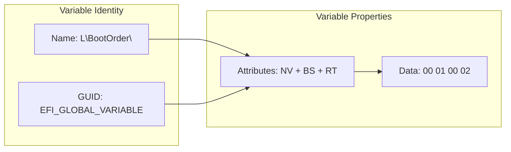
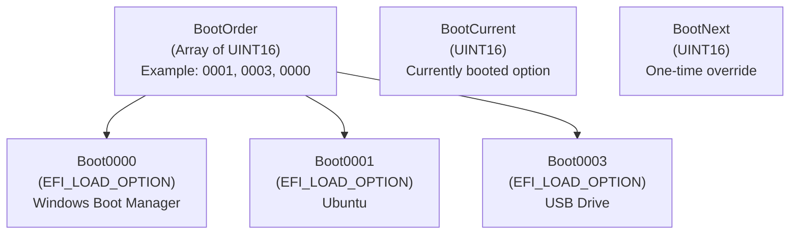
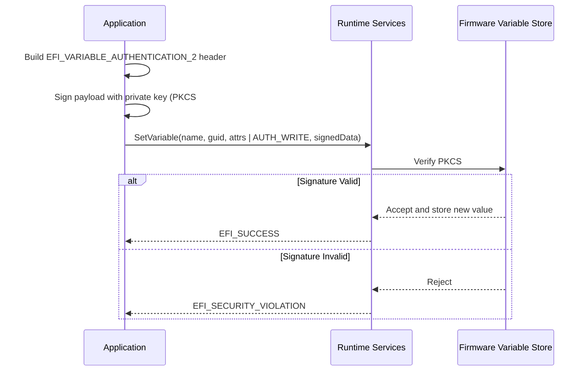
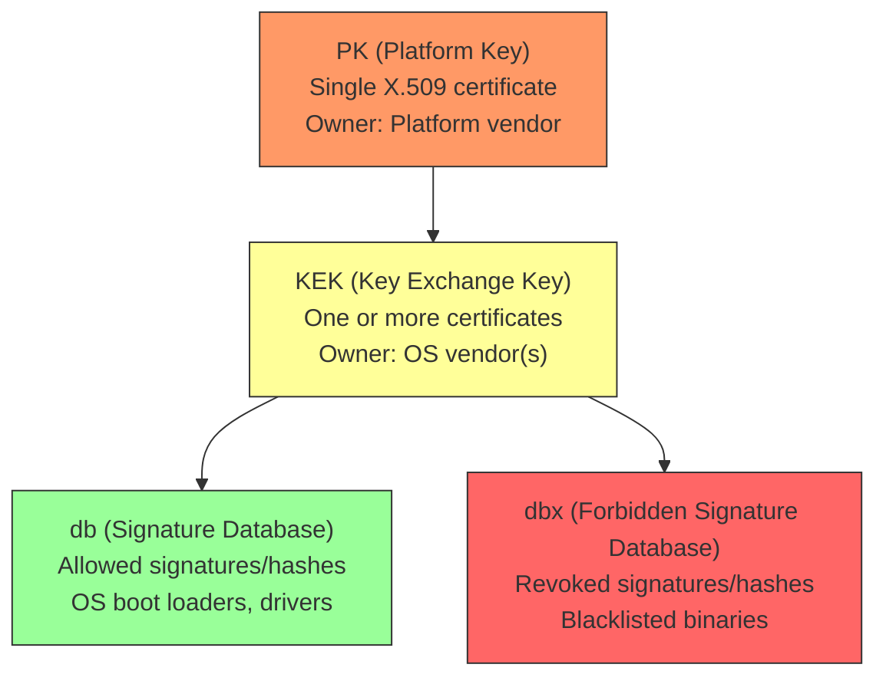
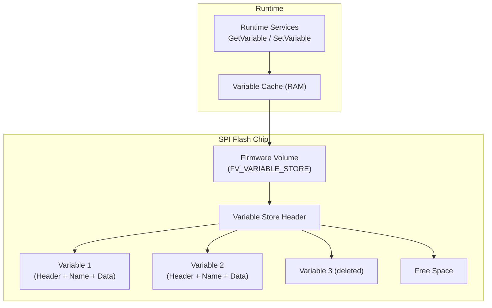

# Chapter 18: UEFI Variables
{: .fs-9 }

Master the UEFI variable store: read and write persistent settings, manage boot options, and understand Secure Boot variables.
{: .fs-6 .fw-300 }

---

## 18.1 Variable Concepts

UEFI variables are persistent key-value pairs stored in non-volatile memory (typically SPI flash on the motherboard). They survive reboots and power cycles, serving as the primary mechanism for firmware configuration, boot option management, and Secure Boot policy.

Each variable is identified by a **name** (Unicode string) and a **vendor GUID** (namespace). This two-part key prevents naming collisions between different firmware components.



### 18.1.1 Variable Attributes

Every variable has a set of attribute flags that control its visibility and persistence:

| Attribute | Flag | Meaning |
|---|---|---|
| Non-Volatile (NV) | `EFI_VARIABLE_NON_VOLATILE` | Stored in flash; survives reboot |
| Boot Services (BS) | `EFI_VARIABLE_BOOTSERVICE_ACCESS` | Accessible during boot services |
| Runtime (RT) | `EFI_VARIABLE_RUNTIME_ACCESS` | Accessible after ExitBootServices |
| Authenticated Write | `EFI_VARIABLE_TIME_BASED_AUTHENTICATED_WRITE_ACCESS` | Requires signed write |
| Append Write | `EFI_VARIABLE_APPEND_WRITE` | Append data instead of replacing |

Common attribute combinations:

| Use Case | Attributes | Notes |
|---|---|---|
| Persistent setting | NV + BS + RT | Typical for boot variables |
| Boot-time only data | BS | Disappears after ExitBootServices |
| Volatile runtime | BS + RT | Survives ExitBootServices but not reboot |
| Secure Boot keys | NV + BS + RT + Auth | Requires authenticated writes |

---

## 18.2 Reading Variables with GetVariable

`GetVariable` is a **Runtime Service**, meaning it is available both during boot services and after `ExitBootServices()` (if the variable has the RT attribute).

### 18.2.1 The Two-Pass Pattern

UEFI uses a standard two-pass pattern for variable-size data:

1. Call with `DataSize = 0` to learn the required buffer size.
2. Allocate the buffer.
3. Call again with the correct size.

```c
#include <Uefi.h>
#include <Library/UefiLib.h>
#include <Library/UefiRuntimeServicesTableLib.h>
#include <Library/MemoryAllocationLib.h>
#include <Library/BaseMemoryLib.h>

EFI_STATUS
ReadVariable(
    IN  CHAR16     *VariableName,
    IN  EFI_GUID   *VendorGuid,
    OUT VOID       **Data,
    OUT UINTN      *DataSize,
    OUT UINT32     *Attributes    OPTIONAL
    )
{
    EFI_STATUS  Status;
    UINT32      Attr;

    //
    // First pass: get the required size.
    //
    *DataSize = 0;
    Status = gRT->GetVariable(
                 VariableName,
                 VendorGuid,
                 &Attr,
                 DataSize,
                 NULL
                 );
    if (Status != EFI_BUFFER_TOO_SMALL) {
        return Status;  // EFI_NOT_FOUND if variable does not exist
    }

    //
    // Allocate buffer.
    //
    *Data = AllocatePool(*DataSize);
    if (*Data == NULL) {
        return EFI_OUT_OF_RESOURCES;
    }

    //
    // Second pass: read the data.
    //
    Status = gRT->GetVariable(
                 VariableName,
                 VendorGuid,
                 &Attr,
                 DataSize,
                 *Data
                 );
    if (EFI_ERROR(Status)) {
        FreePool(*Data);
        *Data = NULL;
        return Status;
    }

    if (Attributes != NULL) {
        *Attributes = Attr;
    }

    return EFI_SUCCESS;
}
```

### 18.2.2 Reading a Known Fixed-Size Variable

When you know the exact data type, skip the two-pass pattern:

```c
EFI_STATUS
ReadTimeout(
    OUT UINT16  *Timeout
    )
{
    UINTN   DataSize = sizeof(UINT16);
    UINT32  Attributes;

    return gRT->GetVariable(
               L"Timeout",
               &gEfiGlobalVariableGuid,
               &Attributes,
               &DataSize,
               Timeout
               );
}
```

---

## 18.3 Writing Variables with SetVariable

```c
EFI_STATUS
WriteVariable(
    IN CHAR16    *VariableName,
    IN EFI_GUID  *VendorGuid,
    IN UINT32    Attributes,
    IN UINTN    DataSize,
    IN VOID      *Data
    )
{
    return gRT->SetVariable(
               VariableName,
               VendorGuid,
               Attributes,
               DataSize,
               Data
               );
}
```

### 18.3.1 Creating a New Variable

```c
EFI_STATUS
CreateMyVariable(VOID)
{
    //
    // Define a custom GUID for your application's namespace.
    //
    EFI_GUID MyAppGuid = {
        0x12345678, 0xABCD, 0xEF01,
        { 0x23, 0x45, 0x67, 0x89, 0xAB, 0xCD, 0xEF, 0x01 }
    };

    UINT32 MyConfig = 42;

    return gRT->SetVariable(
               L"MyConfigValue",
               &MyAppGuid,
               EFI_VARIABLE_NON_VOLATILE |
               EFI_VARIABLE_BOOTSERVICE_ACCESS |
               EFI_VARIABLE_RUNTIME_ACCESS,
               sizeof(MyConfig),
               &MyConfig
               );
}
```

### 18.3.2 Deleting a Variable

Set `DataSize` to 0 and `Data` to NULL to delete a variable:

```c
EFI_STATUS
DeleteMyVariable(VOID)
{
    EFI_GUID MyAppGuid = {
        0x12345678, 0xABCD, 0xEF01,
        { 0x23, 0x45, 0x67, 0x89, 0xAB, 0xCD, 0xEF, 0x01 }
    };

    return gRT->SetVariable(
               L"MyConfigValue",
               &MyAppGuid,
               0,      // Attributes (ignored for delete, but must match or be 0)
               0,      // DataSize = 0 means delete
               NULL
               );
}
```

{: .important }
> When deleting a variable, the attributes parameter must either be 0 or match the variable's existing attributes. If they do not match, some firmware implementations return `EFI_INVALID_PARAMETER`.

---

## 18.4 Enumerating Variables

`GetNextVariableName` iterates over all variables in the variable store. It returns one variable name and GUID per call.

```c
EFI_STATUS
ListAllVariables(VOID)
{
    EFI_STATUS  Status;
    CHAR16      VariableName[256];
    EFI_GUID    VendorGuid;
    UINTN       NameSize;
    UINTN       Count = 0;

    //
    // Initialize with an empty string to start enumeration.
    //
    VariableName[0] = L'\0';
    ZeroMem(&VendorGuid, sizeof(EFI_GUID));

    Print(L"All UEFI Variables:\n\n");

    while (TRUE) {
        NameSize = sizeof(VariableName);
        Status = gRT->GetNextVariableName(&NameSize, VariableName, &VendorGuid);

        if (Status == EFI_NOT_FOUND) {
            break;  // No more variables
        }

        if (EFI_ERROR(Status)) {
            Print(L"GetNextVariableName error: %r\n", Status);
            break;
        }

        Print(L"  [%3d] %g : %s\n", Count, &VendorGuid, VariableName);
        Count++;
    }

    Print(L"\nTotal: %d variables\n", Count);
    return EFI_SUCCESS;
}
```

### 18.4.1 Filtering by Vendor GUID

```c
EFI_STATUS
ListGlobalVariables(VOID)
{
    EFI_STATUS  Status;
    CHAR16      VariableName[256];
    EFI_GUID    VendorGuid;
    UINTN       NameSize;
    UINTN       DataSize;
    UINT32      Attributes;

    VariableName[0] = L'\0';
    ZeroMem(&VendorGuid, sizeof(EFI_GUID));

    Print(L"EFI Global Variables:\n\n");
    Print(L"  %-30s %-8s %s\n", L"Name", L"Size", L"Attributes");

    while (TRUE) {
        NameSize = sizeof(VariableName);
        Status = gRT->GetNextVariableName(&NameSize, VariableName, &VendorGuid);
        if (Status == EFI_NOT_FOUND) break;
        if (EFI_ERROR(Status)) break;

        //
        // Filter: only show variables in the EFI Global namespace.
        //
        if (!CompareGuid(&VendorGuid, &gEfiGlobalVariableGuid)) {
            continue;
        }

        //
        // Get variable size and attributes.
        //
        DataSize = 0;
        Status = gRT->GetVariable(VariableName, &VendorGuid, &Attributes, &DataSize, NULL);
        if (Status != EFI_BUFFER_TOO_SMALL) continue;

        CHAR16 AttrStr[32];
        AttrStr[0] = L'\0';
        if (Attributes & EFI_VARIABLE_NON_VOLATILE)        StrCatS(AttrStr, 32, L"NV ");
        if (Attributes & EFI_VARIABLE_BOOTSERVICE_ACCESS)   StrCatS(AttrStr, 32, L"BS ");
        if (Attributes & EFI_VARIABLE_RUNTIME_ACCESS)       StrCatS(AttrStr, 32, L"RT ");

        Print(L"  %-30s %-8d %s\n", VariableName, DataSize, AttrStr);
    }

    return EFI_SUCCESS;
}
```

---

## 18.5 Standard UEFI Variables

The UEFI specification defines several standard variables under the `EFI_GLOBAL_VARIABLE` GUID. These control fundamental boot behavior.

### 18.5.1 Boot Variables



| Variable | Type | Description |
|---|---|---|
| `Boot####` | `EFI_LOAD_OPTION` | Defines a boot option (#### is hex, e.g., `Boot0001`) |
| `BootOrder` | `UINT16[]` | Array of Boot#### numbers in priority order |
| `BootCurrent` | `UINT16` | The Boot#### number that was used for the current boot |
| `BootNext` | `UINT16` | One-time boot override (deleted after use) |
| `Timeout` | `UINT16` | Seconds to wait before auto-booting the first BootOrder entry |

### 18.5.2 Reading BootOrder

```c
EFI_STATUS
PrintBootOrder(VOID)
{
    EFI_STATUS  Status;
    UINT16      *BootOrder;
    UINTN       DataSize;
    UINT32      Attributes;

    Status = ReadVariable(L"BootOrder", &gEfiGlobalVariableGuid,
                          (VOID **)&BootOrder, &DataSize, &Attributes);
    if (EFI_ERROR(Status)) {
        Print(L"BootOrder not found: %r\n", Status);
        return Status;
    }

    UINTN EntryCount = DataSize / sizeof(UINT16);
    Print(L"Boot Order (%d entries): ", EntryCount);

    for (UINTN i = 0; i < EntryCount; i++) {
        Print(L"Boot%04x ", BootOrder[i]);
    }
    Print(L"\n");

    FreePool(BootOrder);
    return EFI_SUCCESS;
}
```

### 18.5.3 Parsing a Boot#### Variable

The `EFI_LOAD_OPTION` structure is variable-length:

```c
#pragma pack(1)
typedef struct {
    UINT32   Attributes;         // LOAD_OPTION_ACTIVE, etc.
    UINT16   FilePathListLength; // Size of FilePathList in bytes
    // CHAR16 Description[];     // Null-terminated description string
    // EFI_DEVICE_PATH_PROTOCOL  FilePathList[];
    // UINT8  OptionalData[];    // Optional vendor-specific data
} EFI_LOAD_OPTION;
#pragma pack()

#define LOAD_OPTION_ACTIVE   0x00000001
#define LOAD_OPTION_HIDDEN   0x00000008

EFI_STATUS
PrintBootOption(
    IN UINT16  BootNum
    )
{
    EFI_STATUS  Status;
    CHAR16      VarName[16];
    VOID        *Data;
    UINTN       DataSize;

    UnicodeSPrint(VarName, sizeof(VarName), L"Boot%04x", BootNum);

    Status = ReadVariable(VarName, &gEfiGlobalVariableGuid,
                          &Data, &DataSize, NULL);
    if (EFI_ERROR(Status)) {
        Print(L"%s: not found\n", VarName);
        return Status;
    }

    EFI_LOAD_OPTION *Option = (EFI_LOAD_OPTION *)Data;
    CHAR16          *Description = (CHAR16 *)((UINT8 *)Data + sizeof(EFI_LOAD_OPTION));

    Print(L"%s: \"%s\"", VarName, Description);
    Print(L" [%s]\n",
          (Option->Attributes & LOAD_OPTION_ACTIVE) ? L"Active" : L"Inactive");

    FreePool(Data);
    return EFI_SUCCESS;
}
```

### 18.5.4 Displaying All Boot Options

```c
EFI_STATUS
PrintAllBootOptions(VOID)
{
    EFI_STATUS  Status;
    UINT16      *BootOrder;
    UINTN       DataSize;

    Status = ReadVariable(L"BootOrder", &gEfiGlobalVariableGuid,
                          (VOID **)&BootOrder, &DataSize, NULL);
    if (EFI_ERROR(Status)) {
        return Status;
    }

    UINTN EntryCount = DataSize / sizeof(UINT16);
    Print(L"\nBoot Options:\n\n");

    for (UINTN i = 0; i < EntryCount; i++) {
        Print(L"  [%d] ", i);
        PrintBootOption(BootOrder[i]);
    }

    //
    // Show current and next boot.
    //
    UINT16 BootCurrent;
    DataSize = sizeof(BootCurrent);
    Status = gRT->GetVariable(L"BootCurrent", &gEfiGlobalVariableGuid,
                              NULL, &DataSize, &BootCurrent);
    if (!EFI_ERROR(Status)) {
        Print(L"\n  Current boot: Boot%04x\n", BootCurrent);
    }

    UINT16 BootNext;
    DataSize = sizeof(BootNext);
    Status = gRT->GetVariable(L"BootNext", &gEfiGlobalVariableGuid,
                              NULL, &DataSize, &BootNext);
    if (!EFI_ERROR(Status)) {
        Print(L"  Next boot override: Boot%04x\n", BootNext);
    }

    FreePool(BootOrder);
    return EFI_SUCCESS;
}
```

---

## 18.6 Authenticated Variables

Certain variables (especially Secure Boot keys) require **authenticated writes**. The caller must provide a signed payload using a time-based signature (PKCS#7/Authenticode). This prevents unauthorized modification of critical security settings.

### 18.6.1 Authentication Flow



### 18.6.2 Authenticated Variable Data Format

```c
typedef struct {
    EFI_TIME   TimeStamp;
    // WIN_CERTIFICATE_UEFI_GUID  AuthInfo;
    //   Contains the PKCS#7 signed data
} EFI_VARIABLE_AUTHENTICATION_2;
```

The `TimeStamp` must be later than the timestamp of any previously written value for the same variable. This prevents replay attacks.

{: .note }
> Creating authenticated variable payloads is complex and typically done offline using tools like `sign-efi-sig-list` (on Linux) or the `signtool` from the Windows SDK. You rarely build these payloads inside a UEFI application.

---

## 18.7 Secure Boot Variables

Secure Boot uses four authenticated variables to form a chain of trust:



| Variable | GUID | Purpose |
|---|---|---|
| `PK` | `EFI_GLOBAL_VARIABLE` | Platform Key -- the root of trust; only PK holder can update KEK |
| `KEK` | `EFI_GLOBAL_VARIABLE` | Key Exchange Keys -- can update db and dbx |
| `db` | `EFI_IMAGE_SECURITY_DATABASE_GUID` | Allowed signatures database |
| `dbx` | `EFI_IMAGE_SECURITY_DATABASE_GUID` | Forbidden signatures database |
| `dbt` | `EFI_IMAGE_SECURITY_DATABASE_GUID` | Timestamp signature database (optional) |

### 18.7.1 Checking Secure Boot Status

```c
EFI_STATUS
CheckSecureBootStatus(VOID)
{
    UINT8   SecureBoot = 0;
    UINT8   SetupMode  = 0;
    UINT8   AuditMode  = 0;
    UINTN   DataSize;

    DataSize = sizeof(SecureBoot);
    gRT->GetVariable(L"SecureBoot", &gEfiGlobalVariableGuid,
                     NULL, &DataSize, &SecureBoot);

    DataSize = sizeof(SetupMode);
    gRT->GetVariable(L"SetupMode", &gEfiGlobalVariableGuid,
                     NULL, &DataSize, &SetupMode);

    DataSize = sizeof(AuditMode);
    gRT->GetVariable(L"AuditMode", &gEfiGlobalVariableGuid,
                     NULL, &DataSize, &AuditMode);

    Print(L"Secure Boot Status:\n");
    Print(L"  SecureBoot: %s\n", SecureBoot ? L"Enabled" : L"Disabled");
    Print(L"  SetupMode:  %s\n", SetupMode  ? L"Setup (PK not enrolled)" : L"User (PK enrolled)");
    Print(L"  AuditMode:  %s\n", AuditMode  ? L"Audit" : L"Normal");

    if (SecureBoot) {
        Print(L"\n  Secure Boot is ACTIVE. All loaded images must be signed\n");
        Print(L"  with a key present in 'db' and not revoked in 'dbx'.\n");
    } else if (SetupMode) {
        Print(L"\n  System is in Setup Mode. Enroll a Platform Key (PK)\n");
        Print(L"  to activate Secure Boot.\n");
    }

    return EFI_SUCCESS;
}
```

### 18.7.2 Reading the Signature Database

```c
#include <Guid/ImageAuthentication.h>

EFI_STATUS
PrintSignatureDatabase(
    IN CHAR16    *DbName    // L"db", L"dbx", L"KEK", etc.
    )
{
    EFI_STATUS  Status;
    VOID        *Data;
    UINTN       DataSize;
    EFI_GUID    *DbGuid;

    //
    // PK and KEK use global GUID; db/dbx use image security GUID.
    //
    if (StrCmp(DbName, L"db") == 0 || StrCmp(DbName, L"dbx") == 0) {
        DbGuid = &gEfiImageSecurityDatabaseGuid;
    } else {
        DbGuid = &gEfiGlobalVariableGuid;
    }

    Status = ReadVariable(DbName, DbGuid, &Data, &DataSize, NULL);
    if (EFI_ERROR(Status)) {
        Print(L"%s: not found (%r)\n", DbName, Status);
        return Status;
    }

    Print(L"%s: %d bytes\n", DbName, DataSize);

    //
    // The data contains one or more EFI_SIGNATURE_LIST structures.
    // Each list has a signature type GUID and one or more signatures.
    //
    UINT8 *Ptr = (UINT8 *)Data;
    UINT8 *End = Ptr + DataSize;
    UINTN ListIndex = 0;

    while (Ptr < End) {
        EFI_SIGNATURE_LIST *SigList = (EFI_SIGNATURE_LIST *)Ptr;

        Print(L"  Signature List %d:\n", ListIndex);
        Print(L"    Type: %g\n", &SigList->SignatureType);
        Print(L"    Size: %d bytes\n", SigList->SignatureListSize);

        UINTN SigSize  = SigList->SignatureSize;
        UINTN SigCount = (SigList->SignatureListSize - sizeof(EFI_SIGNATURE_LIST)
                          - SigList->SignatureHeaderSize) / SigSize;

        Print(L"    Signatures: %d (each %d bytes)\n", SigCount, SigSize);

        Ptr += SigList->SignatureListSize;
        ListIndex++;
    }

    FreePool(Data);
    return EFI_SUCCESS;
}
```

---

## 18.8 Variable Storage Architecture



### How Variable Storage Works

1. **Flash layout**: Variables are stored in a dedicated firmware volume (FV) in SPI flash. Each variable has a header containing the name, GUID, attributes, data size, and state.

2. **Garbage collection**: When a variable is updated, the old copy is marked as deleted and a new copy is written to free space. When free space is exhausted, the firmware performs garbage collection (also called "reclaim") -- copying all valid variables to a clean region and erasing the old one.

3. **Runtime cache**: For performance, the variable driver caches all variables in RAM. `GetVariable` reads from the cache. `SetVariable` updates both the cache and flash.

4. **Size limits**: Variable storage is finite (typically 64 KB to 256 KB depending on the platform). Monitor available space using `QueryVariableInfo`:

```c
EFI_STATUS
PrintVariableStorageInfo(VOID)
{
    EFI_STATUS  Status;
    UINT64      MaximumVariableStorageSize;
    UINT64      RemainingVariableStorageSize;
    UINT64      MaximumVariableSize;

    Status = gRT->QueryVariableInfo(
                 EFI_VARIABLE_NON_VOLATILE |
                 EFI_VARIABLE_BOOTSERVICE_ACCESS |
                 EFI_VARIABLE_RUNTIME_ACCESS,
                 &MaximumVariableStorageSize,
                 &RemainingVariableStorageSize,
                 &MaximumVariableSize
                 );
    if (EFI_ERROR(Status)) {
        Print(L"QueryVariableInfo failed: %r\n", Status);
        return Status;
    }

    Print(L"Variable Storage Info (NV+BS+RT):\n");
    Print(L"  Total capacity:       %ld bytes (%ld KB)\n",
          MaximumVariableStorageSize, MaximumVariableStorageSize / 1024);
    Print(L"  Remaining space:      %ld bytes (%ld KB)\n",
          RemainingVariableStorageSize, RemainingVariableStorageSize / 1024);
    Print(L"  Max single variable:  %ld bytes\n", MaximumVariableSize);
    Print(L"  Usage:                %d%%\n",
          (UINTN)((MaximumVariableStorageSize - RemainingVariableStorageSize) * 100
                  / MaximumVariableStorageSize));

    return EFI_SUCCESS;
}
```

---

## 18.9 Best Practices

### Use a Custom GUID

Never store your application's variables under `EFI_GLOBAL_VARIABLE`. Define a unique GUID for your namespace:

```c
//
// Generate a GUID with 'uuidgen' or an online tool.
// Use this consistently for all your application's variables.
//
#define MY_APP_VARIABLE_GUID \
    { 0xa1b2c3d4, 0x1234, 0x5678, \
      { 0x9a, 0xbc, 0xde, 0xf0, 0x12, 0x34, 0x56, 0x78 } }

EFI_GUID gMyAppVariableGuid = MY_APP_VARIABLE_GUID;
```

### Keep Variables Small

Variable storage is limited and shared across all firmware components. Follow these guidelines:

- Store configuration data, not bulk data. Use files for large datasets.
- A single variable should not exceed a few kilobytes.
- Clean up variables that are no longer needed.

### Preserve Attributes on Update

When updating an existing variable, always use the same attributes it was created with. Changing attributes is not allowed and will return `EFI_INVALID_PARAMETER`:

```c
EFI_STATUS
UpdateVariable(
    IN CHAR16    *Name,
    IN EFI_GUID  *Guid,
    IN VOID      *NewData,
    IN UINTN     NewDataSize
    )
{
    EFI_STATUS  Status;
    UINTN       OldSize = 0;
    UINT32      OldAttributes;

    //
    // Read existing attributes.
    //
    Status = gRT->GetVariable(Name, Guid, &OldAttributes, &OldSize, NULL);
    if (Status != EFI_BUFFER_TOO_SMALL) {
        //
        // Variable does not exist; create with default attributes.
        //
        OldAttributes = EFI_VARIABLE_NON_VOLATILE |
                        EFI_VARIABLE_BOOTSERVICE_ACCESS |
                        EFI_VARIABLE_RUNTIME_ACCESS;
    }

    return gRT->SetVariable(Name, Guid, OldAttributes, NewDataSize, NewData);
}
```

### Handle EFI_NOT_FOUND Gracefully

A missing variable is normal -- it may not have been created yet. Always provide default values:

```c
UINT32
ReadConfigWithDefault(
    IN CHAR16  *Name,
    IN UINT32  DefaultValue
    )
{
    UINT32  Value;
    UINTN   DataSize = sizeof(Value);

    EFI_STATUS Status = gRT->GetVariable(
                            Name,
                            &gMyAppVariableGuid,
                            NULL,
                            &DataSize,
                            &Value
                            );

    return EFI_ERROR(Status) ? DefaultValue : Value;
}
```

### Avoid Excessive Writes

Each `SetVariable` call with NV attribute writes to flash memory, which has limited write endurance (typically 100,000 erase cycles). Avoid writing variables in tight loops. Batch changes when possible.

---

## 18.10 Complete Example: Configuration Manager

This example implements a simple key-value configuration store using UEFI variables:

```c
#include <Uefi.h>
#include <Library/UefiLib.h>
#include <Library/UefiRuntimeServicesTableLib.h>
#include <Library/UefiBootServicesTableLib.h>
#include <Library/MemoryAllocationLib.h>
#include <Library/BaseMemoryLib.h>

STATIC EFI_GUID gConfigGuid = {
    0xDEADBEEF, 0xCAFE, 0xF00D,
    { 0x01, 0x02, 0x03, 0x04, 0x05, 0x06, 0x07, 0x08 }
};

#define CONFIG_ATTRS  (EFI_VARIABLE_NON_VOLATILE | \
                       EFI_VARIABLE_BOOTSERVICE_ACCESS | \
                       EFI_VARIABLE_RUNTIME_ACCESS)

EFI_STATUS
ConfigSet(
    IN CHAR16  *Key,
    IN UINT32  Value
    )
{
    return gRT->SetVariable(Key, &gConfigGuid, CONFIG_ATTRS, sizeof(Value), &Value);
}

EFI_STATUS
ConfigGet(
    IN  CHAR16  *Key,
    OUT UINT32  *Value
    )
{
    UINTN Size = sizeof(*Value);
    return gRT->GetVariable(Key, &gConfigGuid, NULL, &Size, Value);
}

EFI_STATUS
ConfigDelete(
    IN CHAR16  *Key
    )
{
    return gRT->SetVariable(Key, &gConfigGuid, 0, 0, NULL);
}

VOID
ConfigList(VOID)
{
    CHAR16    Name[256];
    EFI_GUID  Guid;
    UINTN     NameSize;

    Name[0] = L'\0';
    ZeroMem(&Guid, sizeof(Guid));

    Print(L"\nStored Configuration:\n\n");

    while (TRUE) {
        NameSize = sizeof(Name);
        EFI_STATUS Status = gRT->GetNextVariableName(&NameSize, Name, &Guid);
        if (Status == EFI_NOT_FOUND) break;
        if (EFI_ERROR(Status)) break;

        if (!CompareGuid(&Guid, &gConfigGuid)) {
            continue;
        }

        UINT32 Value;
        UINTN  Size = sizeof(Value);
        Status = gRT->GetVariable(Name, &gConfigGuid, NULL, &Size, &Value);
        if (!EFI_ERROR(Status)) {
            Print(L"  %s = %d (0x%08x)\n", Name, Value, Value);
        }
    }
}

EFI_STATUS
EFIAPI
UefiMain(
    IN EFI_HANDLE        ImageHandle,
    IN EFI_SYSTEM_TABLE  *SystemTable
    )
{
    //
    // Set some configuration values.
    //
    ConfigSet(L"ScreenBrightness", 75);
    ConfigSet(L"BootTimeout", 5);
    ConfigSet(L"DebugLevel", 3);

    //
    // List all configuration.
    //
    ConfigList();

    //
    // Read a specific value.
    //
    UINT32 Brightness;
    if (!EFI_ERROR(ConfigGet(L"ScreenBrightness", &Brightness))) {
        Print(L"\nScreen brightness is set to %d%%\n", Brightness);
    }

    //
    // Show storage usage.
    //
    Print(L"\n");
    PrintVariableStorageInfo();

    return EFI_SUCCESS;
}
```

---

{: .note }
> **Complete source code**: The full working example for this chapter is available at [`examples/UefiMuGuidePkg/VariableExample/`]({{ site.baseurl }}/examples/UefiMuGuidePkg/VariableExample/).

## Summary

| Concept | Key Points |
|---|---|
| **Identity** | Variables are keyed by (Name, VendorGUID) pair |
| **Attributes** | NV (persistent), BS (boot-time), RT (runtime), Auth (signed writes) |
| **GetVariable** | Two-pass pattern: query size, allocate, read |
| **SetVariable** | Create, update, or delete (DataSize=0); preserve original attributes |
| **Enumeration** | `GetNextVariableName` iterates all variables across all namespaces |
| **Boot variables** | `BootOrder` (UINT16 array) + `Boot####` (EFI_LOAD_OPTION) control boot |
| **Secure Boot** | PK, KEK, db, dbx form the trust chain; require authenticated writes |
| **Storage** | Limited flash space (64-256 KB); avoid excessive writes |
| **Best practice** | Use custom GUID, keep variables small, handle EFI_NOT_FOUND gracefully |

This concludes Part 4. You now have the tools to interact with consoles, graphics, files, disks, networks, and persistent storage -- covering the essential I/O subsystems available in the UEFI pre-boot environment.
