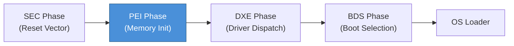
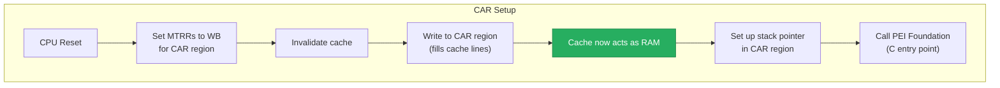
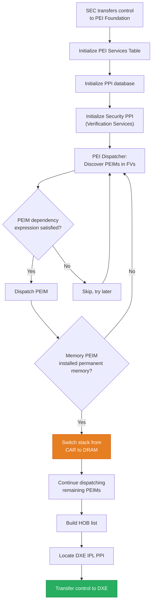
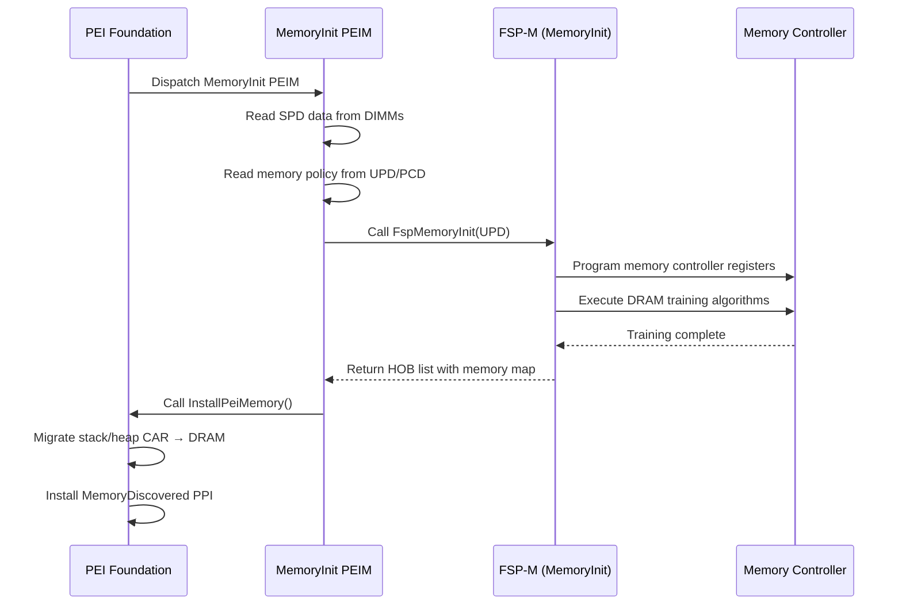

# Chapter 19: PEI Phase
{: .fs-9 }

The Pre-EFI Initialization phase brings the platform from reset to the point where permanent memory is available and the DXE environment can launch.
{: .fs-6 .fw-300 }

---

## Table of Contents
{: .no_toc }

1. TOC
{:toc}

---

## 19.1 What Is PEI?

The Pre-EFI Initialization (PEI) phase is the first phase of the Platform Initialization (PI) specification that executes code from the firmware flash. It runs in the most resource-constrained environment of any UEFI phase: there is no DRAM yet, the CPU may still be in its reset configuration, and only a small region of flash is memory-mapped for execution.

PEI has three primary responsibilities:

1. **Discover and initialize permanent memory** (DRAM training)
2. **Describe the platform state** to subsequent phases through Hand-Off Blocks (HOBs)
3. **Pass control to the DXE phase** once memory is available

Despite these limited goals, PEI must solve a bootstrapping problem: it needs to run code and allocate data structures before DRAM exists. The solution is Cache-As-RAM (CAR), where the CPU's L1/L2 cache is configured as a temporary memory region.

## 19.2 PEI in the Boot Flow



The Security (SEC) phase executes the reset vector, initializes CAR, locates the PEI Foundation in flash, and transfers control to it. PEI then runs PEI Modules (PEIMs) to discover memory and describe the platform. Once permanent memory is established, PEI builds the HOB list and hands off to DXE.

## 19.3 Cache-As-RAM (CAR)

### 19.3.1 The Problem

At power-on, the DRAM controller has not been programmed. Without memory, conventional C code cannot run because it needs a stack for local variables, function calls, and return addresses.

### 19.3.2 The Solution

CAR configures a region of the processor cache as no-eviction memory. The CPU's Memory Type Range Registers (MTRRs) mark a physical address range as Write-Back (WB), while the actual DRAM behind those addresses remains uninitialized. Reads from this region will miss in DRAM but hit in cache after the first write, effectively giving you a small (typically 64 KB to 256 KB) RAM region backed entirely by cache.



### 19.3.3 CAR Limitations

- **Size**: Typically 64-256 KB, depending on cache size
- **No eviction tolerance**: If the working set exceeds cache capacity, lines evict to non-functional DRAM and data is lost
- **Single core**: Usually only the bootstrap processor (BSP) has CAR configured initially
- **Performance**: Cache is fast, but the region is small, so PEIMs must be memory-efficient

### 19.3.4 CAR in Project Mu

In Project Mu platforms, the SEC phase is typically provided by silicon vendor code (e.g., Intel FSP's TempRamInit API). The platform DSC file configures CAR parameters:

```ini
[PcdsFixedAtBuild]
  # CAR base address and size
  gIntelFsp2PkgTokenSpaceGuid.PcdTemporaryRamBase|0xFEF00000
  gIntelFsp2PkgTokenSpaceGuid.PcdTemporaryRamSize|0x00040000   # 256 KB
```

## 19.4 PEI Foundation

The PEI Foundation is the core dispatcher and service provider of the PEI phase. It is analogous to the DXE Foundation but much simpler, reflecting the constrained environment.

### 19.4.1 PEI Services Table

The PEI Foundation exposes its functionality through the **PEI Services Table** (`EFI_PEI_SERVICES`), which is the PEI equivalent of the Boot Services Table. PEIMs receive a pointer to this table as their entry point parameter.

Key PEI Services include:

| Service | Purpose |
|---------|---------|
| `InstallPpi` | Register a PPI with the PEI Foundation |
| `ReInstallPpi` | Replace an existing PPI |
| `LocatePpi` | Find a PPI by GUID |
| `NotifyPpi` | Register for notification when a PPI is installed |
| `GetBootMode` | Query the current boot mode (normal, recovery, S3) |
| `SetBootMode` | Set the boot mode |
| `GetHobList` | Get the start of the HOB list |
| `CreateHob` | Add a new HOB to the HOB list |
| `FfsFindNextVolume` | Enumerate firmware volumes |
| `FfsFindNextFile` | Find files within a firmware volume |
| `FfsFindSectionData` | Extract section data from a firmware file |
| `InstallPeiMemory` | Report permanent memory to the Foundation |
| `AllocatePages` | Allocate pages (after permanent memory) |
| `AllocatePool` | Allocate pool memory (after permanent memory) |
| `ResetSystem` | Reset the platform |

### 19.4.2 PEI Foundation Boot Flow



The critical transition happens at step J: once a memory-initialization PEIM calls `InstallPeiMemory()`, the PEI Foundation migrates the stack, heap, and HOB list from CAR to permanent DRAM. This is called the **CAR teardown** or **memory migration**. After this point, PEIMs have access to much more memory and CAR is released so the cache can resume normal operation.

## 19.5 PEI Modules (PEIMs)

A PEIM is the PEI equivalent of a DXE driver. It is a PE/COFF executable stored in a firmware volume (FV) and dispatched by the PEI Foundation.

### 19.5.1 PEIM Entry Point

Every PEIM implements a standard entry point:

```c
#include <PiPei.h>
#include <Library/PeiServicesLib.h>
#include <Library/DebugLib.h>

EFI_STATUS
EFIAPI
MyPeimEntryPoint (
  IN EFI_PEI_FILE_HANDLE    FileHandle,
  IN CONST EFI_PEI_SERVICES **PeiServices
  )
{
  DEBUG ((DEBUG_INFO, "MyPeim: Entry point called\n"));

  //
  // Perform initialization work here.
  // Install PPIs, create HOBs, etc.
  //

  return EFI_SUCCESS;
}
```

The INF file for a PEIM uses `PEIM` as the module type:

```ini
[Defines]
  INF_VERSION    = 0x00010017
  BASE_NAME      = MyPeim
  FILE_GUID      = A1B2C3D4-1234-5678-9ABC-DEF012345678
  MODULE_TYPE    = PEIM
  VERSION_STRING = 1.0
  ENTRY_POINT    = MyPeimEntryPoint

[Sources]
  MyPeim.c

[Packages]
  MdePkg/MdePkg.dec
  MdeModulePkg/MdeModulePkg.dec

[LibraryClasses]
  PeimEntryPoint
  PeiServicesLib
  DebugLib

[Depex]
  TRUE
```

### 19.5.2 Common PEIMs and Their Roles

| PEIM | Responsibility |
|------|---------------|
| **PlatformInitPreMem** | Early platform configuration before DRAM |
| **MemoryInit / FspMemoryInit** | DRAM controller training and initialization |
| **PlatformInitPostMem** | Platform configuration after DRAM is available |
| **CpuMpPei** | Multi-processor initialization |
| **PcdPeim** | PCD (Platform Configuration Database) service |
| **ReportStatusCodeRouter** | Status code infrastructure |
| **DxeIpl** | DXE Initial Program Loader (transitions to DXE) |
| **S3Resume** | ACPI S3 resume path handling |
| **RecoveryModule** | Firmware recovery support |
| **VariablePei** | Read-only variable access during PEI |

### 19.5.3 Pre-Memory vs Post-Memory PEIMs

PEIMs fall into two categories based on when they execute relative to memory initialization:

**Pre-Memory PEIMs** run while CAR is the only available memory. They must:
- Use minimal stack space
- Avoid large data structures
- Not call `AllocatePages()` or `AllocatePool()` (these fail before memory)
- Focus on discovering and initializing DRAM

**Post-Memory PEIMs** run after `InstallPeiMemory()` and the stack migration. They have:
- Full access to DRAM for allocations
- A normal-sized stack
- The ability to decompress and shadow other firmware volumes from flash into memory

## 19.6 PEIM-to-PEIM Interfaces (PPIs)

PPIs are the PEI-phase equivalent of UEFI protocols. They provide a mechanism for PEIMs to expose services to other PEIMs.

### 19.6.1 PPI Structure

A PPI is identified by a GUID and carries a pointer to an interface structure:

```c
//
// Define the PPI GUID
//
#define MY_CUSTOM_PPI_GUID \
  { 0x12345678, 0xABCD, 0xEF01, \
    { 0x23, 0x45, 0x67, 0x89, 0xAB, 0xCD, 0xEF, 0x01 } }

extern EFI_GUID gMyCustomPpiGuid;

//
// Define the PPI interface
//
typedef
EFI_STATUS
(EFIAPI *MY_CUSTOM_GET_VALUE)(
  IN  CONST MY_CUSTOM_PPI  *This,
  OUT UINT32                *Value
  );

typedef
EFI_STATUS
(EFIAPI *MY_CUSTOM_SET_VALUE)(
  IN  CONST MY_CUSTOM_PPI  *This,
  IN  UINT32                Value
  );

typedef struct _MY_CUSTOM_PPI {
  MY_CUSTOM_GET_VALUE  GetValue;
  MY_CUSTOM_SET_VALUE  SetValue;
} MY_CUSTOM_PPI;
```

### 19.6.2 Installing a PPI

```c
//
// Private instance data
//
STATIC UINT32 mStoredValue = 0;

STATIC
EFI_STATUS
EFIAPI
CustomGetValue (
  IN  CONST MY_CUSTOM_PPI  *This,
  OUT UINT32               *Value
  )
{
  *Value = mStoredValue;
  return EFI_SUCCESS;
}

STATIC
EFI_STATUS
EFIAPI
CustomSetValue (
  IN  CONST MY_CUSTOM_PPI  *This,
  IN  UINT32               Value
  )
{
  mStoredValue = Value;
  return EFI_SUCCESS;
}

//
// PPI instance
//
STATIC MY_CUSTOM_PPI mMyCustomPpi = {
  CustomGetValue,
  CustomSetValue
};

//
// PPI descriptor (links GUID to interface pointer)
//
STATIC EFI_PEI_PPI_DESCRIPTOR mPpiList[] = {
  {
    EFI_PEI_PPI_DESCRIPTOR_PPI | EFI_PEI_PPI_DESCRIPTOR_TERMINATE_LIST,
    &gMyCustomPpiGuid,
    &mMyCustomPpi
  }
};

EFI_STATUS
EFIAPI
ProducerPeimEntryPoint (
  IN EFI_PEI_FILE_HANDLE    FileHandle,
  IN CONST EFI_PEI_SERVICES **PeiServices
  )
{
  return PeiServicesInstallPpi (mPpiList);
}
```

### 19.6.3 Consuming a PPI

```c
EFI_STATUS
EFIAPI
ConsumerPeimEntryPoint (
  IN EFI_PEI_FILE_HANDLE    FileHandle,
  IN CONST EFI_PEI_SERVICES **PeiServices
  )
{
  EFI_STATUS      Status;
  MY_CUSTOM_PPI   *CustomPpi;
  UINT32          Value;

  Status = PeiServicesLocatePpi (
             &gMyCustomPpiGuid,
             0,           // Instance number
             NULL,        // PPI descriptor (optional out)
             (VOID **)&CustomPpi
             );
  if (EFI_ERROR (Status)) {
    DEBUG ((DEBUG_ERROR, "Failed to locate MyCustomPpi: %r\n", Status));
    return Status;
  }

  Status = CustomPpi->GetValue (CustomPpi, &Value);
  DEBUG ((DEBUG_INFO, "Custom value = 0x%08X\n", Value));

  return EFI_SUCCESS;
}
```

### 19.6.4 PPI Notification

PEIMs can register for notification when a specific PPI is installed, which is useful for ordering dependencies without creating tight coupling:

```c
STATIC
EFI_STATUS
EFIAPI
OnMemoryDiscovered (
  IN EFI_PEI_SERVICES          **PeiServices,
  IN EFI_PEI_NOTIFY_DESCRIPTOR *NotifyDescriptor,
  IN VOID                      *Ppi
  )
{
  DEBUG ((DEBUG_INFO, "Memory has been discovered!\n"));
  //
  // Perform post-memory initialization here
  //
  return EFI_SUCCESS;
}

STATIC EFI_PEI_NOTIFY_DESCRIPTOR mMemoryNotifyList[] = {
  {
    EFI_PEI_PPI_DESCRIPTOR_NOTIFY_CALLBACK |
      EFI_PEI_PPI_DESCRIPTOR_TERMINATE_LIST,
    &gEfiPeiMemoryDiscoveredPpiGuid,
    OnMemoryDiscovered
  }
};

EFI_STATUS
EFIAPI
NotifyPeimEntryPoint (
  IN EFI_PEI_FILE_HANDLE    FileHandle,
  IN CONST EFI_PEI_SERVICES **PeiServices
  )
{
  return PeiServicesNotifyPpi (mMemoryNotifyList);
}
```

### 19.6.5 Important Platform PPIs

| PPI | GUID | Purpose |
|-----|------|---------|
| `EFI_PEI_MASTER_BOOT_MODE_PPI` | `gEfiPeiMasterBootModePpiGuid` | Signals that boot mode has been determined |
| `EFI_PEI_PERMANENT_MEMORY_INSTALLED_PPI` | `gEfiPeiMemoryDiscoveredPpiGuid` | Signals that permanent memory is available |
| `EFI_PEI_READ_ONLY_VARIABLE2_PPI` | `gEfiPeiReadOnlyVariable2PpiGuid` | Read variables during PEI |
| `EFI_PEI_RESET2_PPI` | `gEfiPeiReset2PpiGuid` | Platform reset services |
| `EFI_PEI_STALL_PPI` | `gEfiPeiStallPpiGuid` | Microsecond delay |
| `EFI_PEI_CPU_IO_PPI` | `gEfiPeiCpuIoPpiGuid` | CPU I/O port access |

## 19.7 Hand-Off Blocks (HOBs)

HOBs are the mechanism by which PEI communicates platform information to the DXE phase. They form a linked list of typed data structures that describe memory, firmware volumes, CPU configuration, and platform-specific data.

### 19.7.1 HOB List Structure


### 19.7.2 HOB Types

| HOB Type | Description |
|----------|-------------|
| `EFI_HOB_HANDOFF_INFO_TABLE` | First HOB; contains boot mode and memory bounds |
| `EFI_HOB_RESOURCE_DESCRIPTOR` | Describes a physical memory or I/O region |
| `EFI_HOB_MEMORY_ALLOCATION` | Records a memory allocation made during PEI |
| `EFI_HOB_FIRMWARE_VOLUME` | Describes a firmware volume for DXE to process |
| `EFI_HOB_CPU` | CPU address and I/O space widths |
| `EFI_HOB_GUID_TYPE` | Platform-specific data identified by GUID |

### 19.7.3 Creating HOBs

PEIMs create HOBs using PEI Services or the HobLib library:

```c
#include <Library/HobLib.h>

//
// Report a system memory region to DXE
//
VOID
ReportSystemMemory (
  IN EFI_PHYSICAL_ADDRESS  BaseAddress,
  IN UINT64                Length
  )
{
  BuildResourceDescriptorHob (
    EFI_RESOURCE_SYSTEM_MEMORY,                       // Resource type
    EFI_RESOURCE_ATTRIBUTE_PRESENT |                   // Attributes
      EFI_RESOURCE_ATTRIBUTE_INITIALIZED |
      EFI_RESOURCE_ATTRIBUTE_TESTED |
      EFI_RESOURCE_ATTRIBUTE_UNCACHEABLE |
      EFI_RESOURCE_ATTRIBUTE_WRITE_COMBINEABLE |
      EFI_RESOURCE_ATTRIBUTE_WRITE_THROUGH_CACHEABLE |
      EFI_RESOURCE_ATTRIBUTE_WRITE_BACK_CACHEABLE,
    BaseAddress,
    Length
    );

  DEBUG ((
    DEBUG_INFO,
    "Reported memory: 0x%lX - 0x%lX (%lu MB)\n",
    BaseAddress,
    BaseAddress + Length - 1,
    Length / (1024 * 1024)
    ));
}
```

### 19.7.4 GUID Extension HOBs

GUID Extension HOBs let you pass arbitrary platform-specific data from PEI to DXE:

```c
//
// Define a custom data structure to pass to DXE
//
typedef struct {
  UINT32    PlatformId;
  UINT32    BoardRevision;
  UINT8     MemoryChannelCount;
  BOOLEAN   SecureBootEnabled;
} PLATFORM_INFO_HOB;

//
// Create the HOB in a PEIM
//
VOID
CreatePlatformInfoHob (
  VOID
  )
{
  PLATFORM_INFO_HOB *PlatformHob;

  PlatformHob = BuildGuidHob (
                   &gPlatformInfoHobGuid,
                   sizeof (PLATFORM_INFO_HOB)
                   );
  ASSERT (PlatformHob != NULL);

  PlatformHob->PlatformId        = 0x0042;
  PlatformHob->BoardRevision     = 3;
  PlatformHob->MemoryChannelCount = 2;
  PlatformHob->SecureBootEnabled = TRUE;
}
```

### 19.7.5 Consuming HOBs in DXE

DXE drivers retrieve HOBs using the HobLib:

```c
#include <Library/HobLib.h>

EFI_STATUS
ReadPlatformInfoFromHob (
  OUT PLATFORM_INFO_HOB  **PlatformInfo
  )
{
  EFI_HOB_GUID_TYPE  *GuidHob;

  GuidHob = GetFirstGuidHob (&gPlatformInfoHobGuid);
  if (GuidHob == NULL) {
    return EFI_NOT_FOUND;
  }

  *PlatformInfo = (PLATFORM_INFO_HOB *)GET_GUID_HOB_DATA (GuidHob);
  return EFI_SUCCESS;
}
```

## 19.8 Dependency Expressions in PEI

Like DXE drivers, PEIMs use dependency expressions (depex) to declare which PPIs must be installed before the PEIM can be dispatched.

### 19.8.1 Depex Syntax in INF Files

```ini
[Depex]
  gEfiPeiMemoryDiscoveredPpiGuid AND
  gEfiPeiReadOnlyVariable2PpiGuid
```

This tells the PEI Dispatcher: "Do not dispatch this PEIM until both the memory-discovered PPI and the read-only variable PPI have been installed."

### 19.8.2 Common Depex Patterns

```ini
# Always dispatch (no dependencies)
[Depex]
  TRUE

# Dispatch after memory is available
[Depex]
  gEfiPeiMemoryDiscoveredPpiGuid

# Dispatch after multiple PPIs are available
[Depex]
  gEfiPeiCpuIoPpiGuid AND
  gEfiPeiStallPpiGuid AND
  gEfiPeiMemoryDiscoveredPpiGuid

# Dispatch at end of PEI (useful for cleanup PEIMs)
[Depex]
  gEfiEndOfPeiSignalPpiGuid
```

### 19.8.3 Dispatch Order

The PEI Dispatcher uses a priority-based ordering:

1. **A Priori file**: PEIMs listed in the a priori file (a special FFS file) are dispatched first, in listed order, regardless of depex.
2. **Depex evaluation**: Remaining PEIMs are dispatched in firmware volume order, but only when their depex evaluates to TRUE.
3. **Iterative passes**: The Dispatcher makes repeated passes over undispatched PEIMs. Each dispatched PEIM may install PPIs that satisfy other PEIMs' dependencies.
4. **Termination**: Dispatch ends when a full pass produces no newly dispatched PEIMs.

## 19.9 Memory Initialization

Memory initialization is the single most important task in PEI. On Intel platforms, this is typically handled by the FSP (Firmware Support Package) MemoryInit API.

### 19.9.1 Typical Memory Init Flow



### 19.9.2 Installing Permanent Memory

```c
EFI_STATUS
EFIAPI
MemoryInitPeimEntryPoint (
  IN EFI_PEI_FILE_HANDLE    FileHandle,
  IN CONST EFI_PEI_SERVICES **PeiServices
  )
{
  EFI_STATUS            Status;
  EFI_PHYSICAL_ADDRESS  MemoryBase;
  UINT64                MemorySize;

  //
  // Perform DRAM training (platform-specific)
  //
  Status = PlatformMemoryInit (&MemoryBase, &MemorySize);
  if (EFI_ERROR (Status)) {
    DEBUG ((DEBUG_ERROR, "DRAM training failed: %r\n", Status));
    CpuDeadLoop ();
  }

  //
  // Report memory to the PEI Foundation.
  // This triggers CAR-to-DRAM migration.
  //
  Status = PeiServicesInstallPeiMemory (MemoryBase, MemorySize);
  ASSERT_EFI_ERROR (Status);

  //
  // Report all memory regions as resource descriptor HOBs
  //
  BuildResourceDescriptorHob (
    EFI_RESOURCE_SYSTEM_MEMORY,
    EFI_RESOURCE_ATTRIBUTE_PRESENT |
      EFI_RESOURCE_ATTRIBUTE_INITIALIZED |
      EFI_RESOURCE_ATTRIBUTE_TESTED,
    MemoryBase,
    MemorySize
    );

  DEBUG ((
    DEBUG_INFO,
    "Permanent memory installed: 0x%lX, %lu MB\n",
    MemoryBase,
    MemorySize / (1024 * 1024)
    ));

  return EFI_SUCCESS;
}
```

## 19.10 Boot Modes

PEI supports multiple boot modes that alter the execution path:

| Boot Mode | Description |
|-----------|-------------|
| `BOOT_WITH_FULL_CONFIGURATION` | Normal cold boot; full initialization |
| `BOOT_WITH_MINIMAL_CONFIGURATION` | Fast boot; skip some initialization |
| `BOOT_ON_S3_RESUME` | Resume from ACPI S3 (sleep); restore memory, skip DXE |
| `BOOT_ON_FLASH_UPDATE` | Capsule update in progress |
| `BOOT_IN_RECOVERY_MODE` | Recovery boot from external media |
| `BOOT_WITH_MFG_MODE_SETTINGS` | Manufacturing/factory mode |

The boot mode affects which PEIMs are dispatched (via depex) and how memory initialization is handled. For example, S3 resume restores DRAM content from the NVS (Non-Volatile Sleep) region rather than retraining.

```c
EFI_STATUS
EFIAPI
BootModePeimEntryPoint (
  IN EFI_PEI_FILE_HANDLE    FileHandle,
  IN CONST EFI_PEI_SERVICES **PeiServices
  )
{
  EFI_BOOT_MODE BootMode;
  EFI_STATUS    Status;

  //
  // Determine boot mode from platform hardware
  //
  if (IsS3Resume ()) {
    BootMode = BOOT_ON_S3_RESUME;
  } else if (IsRecoveryBoot ()) {
    BootMode = BOOT_IN_RECOVERY_MODE;
  } else {
    BootMode = BOOT_WITH_FULL_CONFIGURATION;
  }

  Status = PeiServicesSetBootMode (BootMode);
  ASSERT_EFI_ERROR (Status);

  //
  // Install the Master Boot Mode PPI to signal that
  // boot mode has been determined
  //
  Status = PeiServicesInstallPpi (&mMasterBootModePpiList);
  ASSERT_EFI_ERROR (Status);

  DEBUG ((DEBUG_INFO, "Boot mode set to: 0x%X\n", BootMode));
  return EFI_SUCCESS;
}
```

## 19.11 Transition to DXE

The final step of PEI is transferring control to the DXE phase. This is handled by the **DXE Initial Program Loader (DxeIpl)** PEIM.

### 19.11.1 DxeIpl Responsibilities

1. Locate the DXE Foundation (DxeCore) in a firmware volume
2. Load DxeCore into permanent memory
3. Build the final HOB list
4. Install the End-of-PEI Signal PPI (`gEfiEndOfPeiSignalPpiGuid`)
5. Transfer control to DxeCore's entry point, passing the HOB list pointer


## 19.12 Project Mu PEI Libraries and Packages

Project Mu provides several libraries and packages that enhance or extend PEI functionality:

| Package/Library | Purpose |
|----------------|---------|
| `MdeModulePkg/Core/Pei` | PEI Foundation implementation |
| `MU_BASECORE/PeiCore` | Project Mu customizations to PEI Core |
| `PolicyLib` (PEI) | Policy-based configuration during PEI |
| `AdvancedLoggerLib` (PEI) | Enhanced debug logging with memory buffer |
| `PerformanceLib` (PEI) | Boot performance measurement |
| `ReportStatusCodeLib` (PEI) | Status code routing |
| `VariablePolicyLib` | Variable access policy enforcement |

### 19.12.1 Project Mu Policy Library in PEI

Project Mu's Policy Library provides a structured way to pass configuration from platform code to silicon code, replacing the traditional PCD and UPD approaches:

```c
#include <Library/PolicyLib.h>

//
// Platform code sets memory policy
//
EFI_STATUS
SetMemoryPolicy (
  VOID
  )
{
  MEMORY_POLICY  MemPolicy;

  ZeroMem (&MemPolicy, sizeof (MemPolicy));
  MemPolicy.DdrFrequency   = DDR_FREQ_4800;
  MemPolicy.ChannelCount   = 2;
  MemPolicy.DimmPerChannel = 1;
  MemPolicy.EccEnabled     = TRUE;

  return SetPolicy (&gMemoryPolicyGuid, 0, &MemPolicy, sizeof (MemPolicy));
}

//
// Silicon code reads memory policy
//
EFI_STATUS
GetMemoryPolicy (
  OUT MEMORY_POLICY  *Policy
  )
{
  UINT16  Size = sizeof (MEMORY_POLICY);

  return GetPolicy (&gMemoryPolicyGuid, NULL, Policy, &Size);
}
```

## 19.13 Debugging PEI

Debugging PEI code is challenging because most of the infrastructure developers rely on (console output, debugger support, memory) is unavailable during early PEI.

### 19.13.1 Serial Port Debug Output

The most common approach is serial output via `DebugLib`. The PEI version of `DebugLib` is typically mapped to `BaseDebugLibSerialPort`, which sends output directly to a UART without needing protocols or drivers:

```c
DEBUG ((DEBUG_INFO,  "Informational message\n"));
DEBUG ((DEBUG_WARN,  "Warning: something unexpected\n"));
DEBUG ((DEBUG_ERROR, "Error: critical failure at 0x%X\n", Address));
```

### 19.13.2 Status Codes

For environments without serial output (or in addition to it), PEIMs report progress through status codes that can be routed to a POST code port (port 0x80):

```c
#include <Library/ReportStatusCodeLib.h>

//
// Report PEI progress codes
//
REPORT_STATUS_CODE (
  EFI_PROGRESS_CODE,
  EFI_COMPUTING_UNIT_MEMORY | EFI_CU_MEMORY_PC_INIT
  );
```

### 19.13.3 Project Mu Advanced Logger

Project Mu's AdvancedLoggerLib stores debug output in a memory buffer during PEI. This buffer is passed to DXE via a HOB, where it can be flushed to serial, a file, or a network:

```c
//
// AdvancedLoggerLib works transparently with standard DEBUG macros.
// In PEI, configure it in the platform DSC:
//
// [LibraryClasses.common.PEIM]
//   DebugLib|AdvancedLoggerLib/DebugLib/PeiDebugLib.inf
//
```

## 19.14 Summary

The PEI phase solves the fundamental bootstrapping problem of firmware: initializing memory when no memory exists. Through Cache-As-RAM, a minimal Foundation, lightweight PPIs, and the HOB mechanism, PEI builds the foundation that the DXE phase requires.

**Key takeaways:**

- **CAR provides temporary memory** before DRAM is trained, but it is size-limited and fragile.
- **PEIMs are small, focused modules** that install PPIs and create HOBs.
- **PPIs are the PEI equivalent of protocols**, providing typed interfaces between PEIMs.
- **HOBs are the data transfer mechanism** from PEI to DXE, describing memory, firmware volumes, and platform state.
- **The PEI Dispatcher** uses dependency expressions to order PEIM execution.
- **Memory initialization** is the critical PEI task that triggers the CAR-to-DRAM migration.
- **Project Mu extends PEI** with the Policy Library, Advanced Logger, and enhanced configuration mechanisms.

---

**Next:** [Chapter 20: DXE Phase]() explores how the DXE Foundation takes the HOB list from PEI and builds the rich protocol environment you used in earlier chapters.
