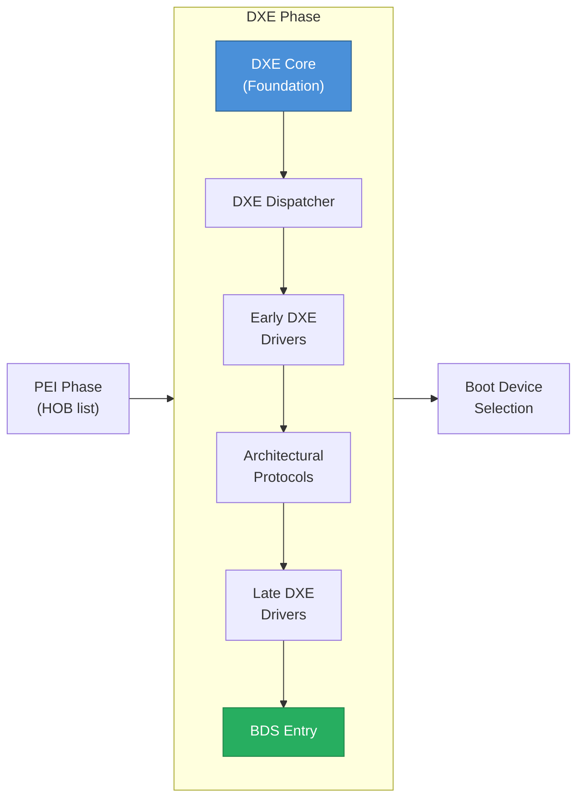
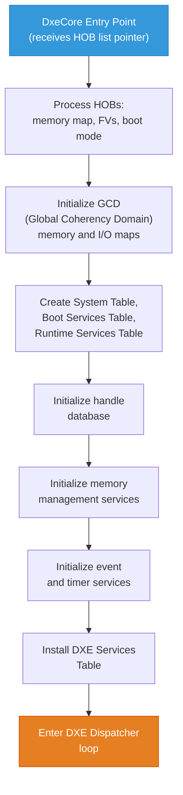
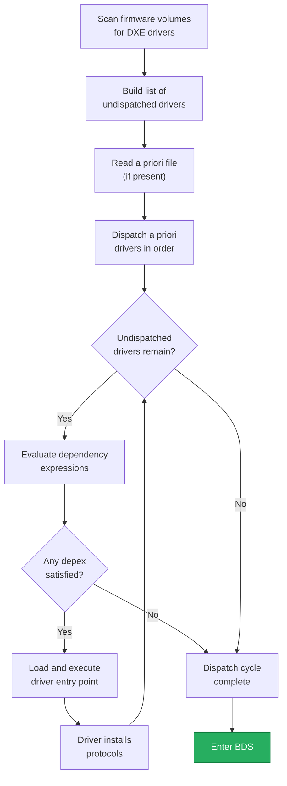
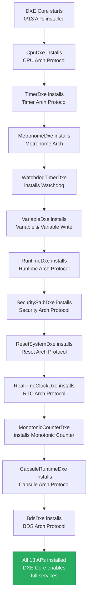
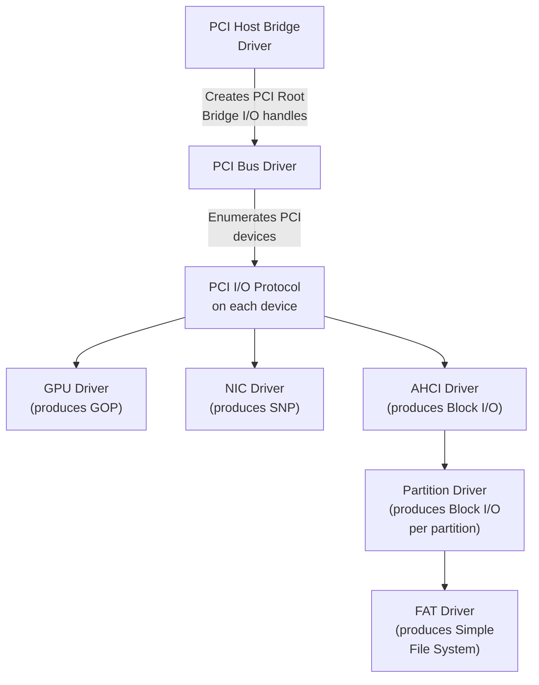

# Chapter 20: DXE Phase
{: .fs-9 }

The Driver Execution Environment phase builds the rich protocol infrastructure that UEFI applications and the OS loader depend on.
{: .fs-6 .fw-300 }

---

## Table of Contents
{: .no_toc }

1. TOC
{:toc}

---

## 20.1 What Is DXE?

The Driver Execution Environment (DXE) is the phase where the UEFI firmware becomes fully functional. Unlike PEI, which operates in a resource-constrained environment with no DRAM, DXE has full access to system memory, a complete memory manager, and the ability to load and execute a large number of drivers.

DXE is responsible for:

1. **Processing the HOB list** from PEI to learn about available memory and firmware volumes
2. **Establishing the UEFI System Table**, Boot Services Table, and Runtime Services Table
3. **Dispatching DXE drivers** that populate the protocol database
4. **Handing off to BDS** (Boot Device Selection) to find and launch the OS loader

By the end of DXE, the handle database contains all the protocols that UEFI applications and OS loaders use -- the same protocols you worked with in Parts 3 and 4 of this guide.

## 20.2 DXE in the Boot Flow



## 20.3 DXE Foundation (DXE Core)

The DXE Foundation is the heart of the DXE phase. It is a single executable (`DxeCore`) loaded by the DxeIpl PEIM at the end of PEI. The Foundation initializes the UEFI environment and manages all subsequent driver loading.

### 20.3.1 DXE Core Initialization Sequence

When DxeCore receives control from PEI, it performs these steps:



### 20.3.2 Global Coherency Domain (GCD)

The GCD is a DXE-specific service that maintains the system's physical memory and I/O space maps. It is initialized from the resource descriptor HOBs built during PEI.

The GCD tracks:
- **Memory space**: Which physical address ranges are system memory, MMIO, or reserved
- **I/O space**: Which I/O port ranges are available
- **Attributes**: Cacheability, access permissions, and allocation status

```c
#include <Pi/PiDxeCis.h>

//
// DXE drivers can query and modify GCD mappings
//
EFI_STATUS
AddMmioRegion (
  IN EFI_PHYSICAL_ADDRESS  BaseAddress,
  IN UINT64                Length
  )
{
  EFI_STATUS  Status;

  //
  // Add the MMIO region to GCD memory space
  //
  Status = gDS->AddMemorySpace (
                  EfiGcdMemoryTypeMemoryMappedIo,
                  BaseAddress,
                  Length,
                  EFI_MEMORY_UC  // Uncacheable
                  );
  if (EFI_ERROR (Status)) {
    return Status;
  }

  //
  // Allocate it so no one else can claim it
  //
  Status = gDS->AllocateMemorySpace (
                  EfiGcdAllocateAddress,
                  EfiGcdMemoryTypeMemoryMappedIo,
                  0,         // Alignment
                  Length,
                  &BaseAddress,
                  gImageHandle,
                  NULL
                  );

  return Status;
}
```

## 20.4 DXE Dispatcher

The DXE Dispatcher is the engine that discovers, evaluates, and loads DXE drivers from firmware volumes. It is conceptually similar to the PEI Dispatcher but operates with far more capability.

### 20.4.1 Dispatcher Algorithm



### 20.4.2 Dependency Expressions

DXE drivers declare their dependencies in the `[Depex]` section of their INF file:

```ini
# This driver needs the CPU Arch Protocol and Variable services
[Depex]
  gEfiCpuArchProtocolGuid AND
  gEfiVariableArchProtocolGuid
```

The depex is compiled into a bytecode section within the driver's firmware file. The Dispatcher evaluates it using a simple stack machine that supports `AND`, `OR`, `NOT`, `TRUE`, `FALSE`, `PUSH` (a GUID), and `END` operations.

### 20.4.3 A Priori File

The a priori file is a special file in the firmware volume that lists driver GUIDs in the exact order they should be dispatched, bypassing depex evaluation. This is used for drivers that must load in a precise order during early DXE:

```
# Example a priori file contents (list of GUIDs)
# PcdDxe         - Platform Configuration Database
# ReportStatusCodeRouterDxe - Status code infrastructure
# StatusCodeHandlerRuntimeDxe - Status code handler
```

## 20.5 DXE Driver Types

DXE drivers come in several categories based on their execution model and lifetime.

### 20.5.1 Classification by Lifetime

| Type | MODULE_TYPE | Description |
|------|------------|-------------|
| Early DXE Driver | `DXE_DRIVER` | Loads early, often provides architectural protocols |
| Late DXE Driver | `DXE_DRIVER` | Loads after architectural protocols are available |
| Runtime Driver | `DXE_RUNTIME_DRIVER` | Persists after ExitBootServices; provides Runtime Services |
| SMM Driver | `DXE_SMM_DRIVER` | Loaded by DXE but executes in SMM context |
| UEFI Driver | `UEFI_DRIVER` | Follows the UEFI Driver Model with Driver Binding |

### 20.5.2 Boot Service vs Runtime Drivers

**Boot Service drivers** are unloaded when `ExitBootServices()` is called. Their memory is reclaimed by the OS.

**Runtime drivers** survive `ExitBootServices()` and continue to provide services to the OS. They must:
- Allocate memory as `EfiRuntimeServicesCode` and `EfiRuntimeServicesData`
- Handle virtual address translation via `SetVirtualAddressMap()`
- Register for the Virtual Address Change event

```c
#include <Library/UefiRuntimeLib.h>

//
// Runtime driver must convert internal pointers when the OS
// switches to virtual addressing
//
STATIC EFI_EVENT  mVirtualAddressChangeEvent;
STATIC VOID       *mRuntimeBuffer;

VOID
EFIAPI
VirtualAddressChangeCallback (
  IN EFI_EVENT  Event,
  IN VOID       *Context
  )
{
  //
  // Convert our internal pointer to the new virtual address
  //
  EfiConvertPointer (0, (VOID **)&mRuntimeBuffer);
}

EFI_STATUS
EFIAPI
RuntimeDriverEntryPoint (
  IN EFI_HANDLE       ImageHandle,
  IN EFI_SYSTEM_TABLE *SystemTable
  )
{
  EFI_STATUS Status;

  //
  // Allocate runtime memory (survives ExitBootServices)
  //
  Status = gBS->AllocatePool (
                  EfiRuntimeServicesData,
                  4096,
                  &mRuntimeBuffer
                  );
  if (EFI_ERROR (Status)) {
    return Status;
  }

  //
  // Register for virtual address change notification
  //
  Status = gBS->CreateEventEx (
                  EVT_NOTIFY_SIGNAL,
                  TPL_NOTIFY,
                  VirtualAddressChangeCallback,
                  NULL,
                  &gEfiEventVirtualAddressChangeGuid,
                  &mVirtualAddressChangeEvent
                  );

  return Status;
}
```

### 20.5.3 UEFI Driver Model Drivers

UEFI Driver Model drivers use the Driver Binding Protocol to manage devices. They do not connect to hardware in their entry point; instead, they install a `EFI_DRIVER_BINDING_PROTOCOL` and wait for the bus enumerator to call them:

```c
EFI_STATUS
EFIAPI
MyDriverSupported (
  IN EFI_DRIVER_BINDING_PROTOCOL *This,
  IN EFI_HANDLE                  ControllerHandle,
  IN EFI_DEVICE_PATH_PROTOCOL    *RemainingDevicePath OPTIONAL
  )
{
  EFI_STATUS          Status;
  EFI_PCI_IO_PROTOCOL *PciIo;

  //
  // Check if this controller has PCI I/O and is our device
  //
  Status = gBS->OpenProtocol (
                  ControllerHandle,
                  &gEfiPciIoProtocolGuid,
                  (VOID **)&PciIo,
                  This->DriverBindingHandle,
                  ControllerHandle,
                  EFI_OPEN_PROTOCOL_BY_DRIVER
                  );
  if (EFI_ERROR (Status)) {
    return Status;
  }

  //
  // Read PCI Vendor/Device ID to check if this is our hardware
  //
  UINT16 VendorId, DeviceId;
  PciIo->Pci.Read (PciIo, EfiPciIoWidthUint16, 0x00, 1, &VendorId);
  PciIo->Pci.Read (PciIo, EfiPciIoWidthUint16, 0x02, 1, &DeviceId);

  Status = (VendorId == 0x8086 && DeviceId == 0x1234)
           ? EFI_SUCCESS
           : EFI_UNSUPPORTED;

  gBS->CloseProtocol (
         ControllerHandle,
         &gEfiPciIoProtocolGuid,
         This->DriverBindingHandle,
         ControllerHandle
         );

  return Status;
}
```

## 20.6 Architectural Protocols

Architectural Protocols (APs) are the thirteen protocols that the DXE Foundation requires before it can provide full UEFI services. Until all APs are installed, some Boot Services and Runtime Services may not function.

### 20.6.1 The Thirteen Architectural Protocols

| # | Architectural Protocol | GUID | Purpose |
|---|----------------------|------|---------|
| 1 | **Security** | `gEfiSecurity2ArchProtocolGuid` | Verifies firmware images before execution |
| 2 | **CPU** | `gEfiCpuArchProtocolGuid` | CPU configuration, interrupt management |
| 3 | **Metronome** | `gEfiMetronomeArchProtocolGuid` | Short-duration stall/delay services |
| 4 | **Timer** | `gEfiTimerArchProtocolGuid` | Periodic timer tick for event system |
| 5 | **BDS** | `gEfiBdsArchProtocolGuid` | Boot Device Selection policy |
| 6 | **Watchdog Timer** | `gEfiWatchdogTimerArchProtocolGuid` | Hardware watchdog management |
| 7 | **Runtime** | `gEfiRuntimeArchProtocolGuid` | Runtime driver registration and VA mapping |
| 8 | **Variable** | `gEfiVariableArchProtocolGuid` | GetVariable/SetVariable implementation |
| 9 | **Variable Write** | `gEfiVariableWriteArchProtocolGuid` | Non-volatile variable write support |
| 10 | **Monotonic Counter** | `gEfiMonotonicCounterArchProtocolGuid` | Monotonically increasing counter |
| 11 | **Reset** | `gEfiResetArchProtocolGuid` | Platform reset (cold/warm/shutdown) |
| 12 | **Real Time Clock** | `gEfiRealTimeClockArchProtocolGuid` | GetTime/SetTime implementation |
| 13 | **Capsule** | `gEfiCapsuleArchProtocolGuid` | Firmware update capsule processing |

### 20.6.2 AP Installation Flow



### 20.6.3 Implementing an Architectural Protocol

Here is a simplified example of how a Timer Architectural Protocol driver works:

```c
#include <Protocol/Timer.h>
#include <Protocol/Cpu.h>

STATIC EFI_CPU_ARCH_PROTOCOL   *mCpu;
STATIC EFI_TIMER_NOTIFY         mTimerNotifyFunction = NULL;
STATIC UINT64                   mTimerPeriod = 0;

//
// Timer interrupt handler -- called by CPU Arch Protocol
//
VOID
EFIAPI
TimerInterruptHandler (
  IN EFI_EXCEPTION_TYPE  InterruptType,
  IN EFI_SYSTEM_CONTEXT  SystemContext
  )
{
  //
  // Acknowledge the timer interrupt in hardware
  //
  AcknowledgeTimerIrq ();

  //
  // Call the registered notification function (DXE Core's timer tick)
  //
  if (mTimerNotifyFunction != NULL) {
    mTimerNotifyFunction (mTimerPeriod);
  }
}

EFI_STATUS
EFIAPI
TimerRegisterHandler (
  IN EFI_TIMER_ARCH_PROTOCOL  *This,
  IN EFI_TIMER_NOTIFY         NotifyFunction
  )
{
  mTimerNotifyFunction = NotifyFunction;
  return EFI_SUCCESS;
}

EFI_STATUS
EFIAPI
TimerSetTimerPeriod (
  IN EFI_TIMER_ARCH_PROTOCOL  *This,
  IN UINT64                   TimerPeriod
  )
{
  mTimerPeriod = TimerPeriod;

  if (TimerPeriod == 0) {
    DisableTimerHardware ();
  } else {
    ProgramTimerHardware (TimerPeriod);
  }

  return EFI_SUCCESS;
}

EFI_STATUS
EFIAPI
TimerGetTimerPeriod (
  IN  EFI_TIMER_ARCH_PROTOCOL  *This,
  OUT UINT64                   *TimerPeriod
  )
{
  *TimerPeriod = mTimerPeriod;
  return EFI_SUCCESS;
}

EFI_STATUS
EFIAPI
TimerGenerateSoftInterrupt (
  IN EFI_TIMER_ARCH_PROTOCOL  *This
  )
{
  //
  // Trigger a software timer interrupt
  //
  if (mTimerNotifyFunction != NULL) {
    mTimerNotifyFunction (mTimerPeriod);
  }

  return EFI_SUCCESS;
}

STATIC EFI_TIMER_ARCH_PROTOCOL mTimerProtocol = {
  TimerRegisterHandler,
  TimerSetTimerPeriod,
  TimerGetTimerPeriod,
  TimerGenerateSoftInterrupt
};

EFI_STATUS
EFIAPI
TimerDriverEntryPoint (
  IN EFI_HANDLE       ImageHandle,
  IN EFI_SYSTEM_TABLE *SystemTable
  )
{
  EFI_STATUS Status;

  //
  // Get the CPU Arch Protocol to register our interrupt handler
  //
  Status = gBS->LocateProtocol (
                  &gEfiCpuArchProtocolGuid,
                  NULL,
                  (VOID **)&mCpu
                  );
  ASSERT_EFI_ERROR (Status);

  //
  // Register the timer interrupt handler
  //
  Status = mCpu->RegisterInterruptHandler (
                   mCpu,
                   TIMER_IRQ_NUMBER,
                   TimerInterruptHandler
                   );
  ASSERT_EFI_ERROR (Status);

  //
  // Install the Timer Architectural Protocol
  //
  Status = gBS->InstallProtocolInterface (
                  &ImageHandle,
                  &gEfiTimerArchProtocolGuid,
                  EFI_NATIVE_INTERFACE,
                  &mTimerProtocol
                  );

  return Status;
}
```

## 20.7 Events and Notifications in DXE

The DXE event system provides asynchronous notification capabilities that drivers use to respond to state changes.

### 20.7.1 Event Types

| Event Type | Description |
|------------|-------------|
| `EVT_TIMER` | Fired on a timer schedule (periodic or one-shot) |
| `EVT_NOTIFY_WAIT` | Checked when `WaitForEvent()` is called |
| `EVT_NOTIFY_SIGNAL` | Notification function called when event is signaled |
| `EVT_SIGNAL_EXIT_BOOT_SERVICES` | Signaled during `ExitBootServices()` |
| `EVT_SIGNAL_VIRTUAL_ADDRESS_CHANGE` | Signaled during `SetVirtualAddressMap()` |

### 20.7.2 Protocol Notification Events

One of the most powerful patterns in DXE is registering for notification when a protocol is installed. This allows drivers to respond to new hardware or services without polling:

```c
STATIC EFI_EVENT  mProtocolNotifyEvent;
STATIC VOID       *mProtocolNotifyRegistration;

VOID
EFIAPI
OnPciIoInstalled (
  IN EFI_EVENT  Event,
  IN VOID       *Context
  )
{
  EFI_STATUS           Status;
  EFI_HANDLE           Handle;
  UINTN                BufferSize;
  EFI_PCI_IO_PROTOCOL  *PciIo;

  while (TRUE) {
    BufferSize = sizeof (EFI_HANDLE);
    Status = gBS->LocateHandle (
                    ByRegisterNotify,
                    NULL,
                    mProtocolNotifyRegistration,
                    &BufferSize,
                    &Handle
                    );
    if (EFI_ERROR (Status)) {
      break;
    }

    Status = gBS->HandleProtocol (
                    Handle,
                    &gEfiPciIoProtocolGuid,
                    (VOID **)&PciIo
                    );
    if (!EFI_ERROR (Status)) {
      DEBUG ((DEBUG_INFO, "New PCI device discovered\n"));
      //
      // Process the new PCI device
      //
    }
  }
}

EFI_STATUS
RegisterForPciDevices (
  VOID
  )
{
  mProtocolNotifyEvent = EfiCreateProtocolNotifyEvent (
                           &gEfiPciIoProtocolGuid,
                           TPL_CALLBACK,
                           OnPciIoInstalled,
                           NULL,
                           &mProtocolNotifyRegistration
                           );

  return (mProtocolNotifyEvent != NULL) ? EFI_SUCCESS : EFI_OUT_OF_RESOURCES;
}
```

### 20.7.3 Timer Events

```c
EFI_STATUS
CreatePeriodicTimer (
  VOID
  )
{
  EFI_STATUS Status;
  EFI_EVENT  TimerEvent;

  Status = gBS->CreateEvent (
                  EVT_TIMER | EVT_NOTIFY_SIGNAL,
                  TPL_CALLBACK,
                  MyTimerCallback,
                  NULL,
                  &TimerEvent
                  );
  if (EFI_ERROR (Status)) {
    return Status;
  }

  //
  // Fire every 1 second (10,000,000 * 100ns ticks)
  //
  Status = gBS->SetTimer (
                  TimerEvent,
                  TimerPeriodic,
                  10000000
                  );

  return Status;
}
```

## 20.8 Protocol Database Population During DXE

The protocol database that UEFI applications use is populated during DXE by driver dispatch. Understanding the order in which protocols appear helps explain why certain depex patterns exist.

### 20.8.1 Protocol Population Timeline

```mermaid
gantt
    title Protocol Installation During DXE
    dateFormat X
    axisFormat %s

    section Core Protocols
    CPU Arch Protocol         :done, 0, 1
    Timer Arch Protocol       :done, 1, 2
    Variable Services         :done, 2, 3

    section Bus Drivers
    PCI Host Bridge           :done, 3, 4
    PCI Bus Driver            :done, 4, 5
    PCI I/O on devices        :done, 5, 6

    section Device Drivers
    GOP (Graphics)            :done, 6, 7
    Console Splitter          :done, 7, 8
    Disk I/O / Block I/O      :done, 8, 9
    File System Driver        :done, 9, 10
    Network Stack             :done, 9, 10
```



### 20.8.2 Bus Enumeration

DXE builds a device tree by recursively enumerating buses. Each bus driver discovers child devices and creates handles with protocols that the next level of drivers can consume:



## 20.9 DXE to BDS Transition

Once the DXE Dispatcher has exhausted all dispatchable drivers, the DXE Core calls the BDS Architectural Protocol's `Entry` function.

### 20.9.1 What BDS Does

BDS (Boot Device Selection) is responsible for:

1. Reading boot option variables (`Boot####`, `BootOrder`)
2. Connecting required device paths
3. Presenting a boot menu (if applicable)
4. Loading and starting the selected OS loader
5. Handling boot failures and fallback

### 20.9.2 Ready-to-Boot Event

Before transferring to the OS loader, BDS signals the **Ready-to-Boot** event group. This is the last chance for firmware code to perform actions before the OS takes over:

```c
VOID
EFIAPI
OnReadyToBoot (
  IN EFI_EVENT  Event,
  IN VOID       *Context
  )
{
  //
  // Last-chance firmware actions:
  // - Lock flash regions
  // - Finalize ACPI tables
  // - Lock security-sensitive settings
  //
  DEBUG ((DEBUG_INFO, "Ready to Boot: finalizing platform\n"));

  LockSpiFlash ();
  FinalizeAcpiTables ();
  LockVariablePolicy ();
}

EFI_STATUS
RegisterReadyToBootHandler (
  VOID
  )
{
  EFI_STATUS Status;
  EFI_EVENT  Event;

  Status = gBS->CreateEventEx (
                  EVT_NOTIFY_SIGNAL,
                  TPL_CALLBACK,
                  OnReadyToBoot,
                  NULL,
                  &gEfiEventReadyToBootGuid,
                  &Event
                  );

  return Status;
}
```

### 20.9.3 ExitBootServices

When the OS loader calls `ExitBootServices()`, the firmware:

1. Signals the `ExitBootServices` event group
2. Terminates all boot service drivers
3. Reclaims boot service memory
4. Disables the timer interrupt
5. Returns control to the OS loader

After this point, only Runtime Services remain available.

## 20.10 SMM Initialization from DXE

System Management Mode drivers are loaded during DXE but execute in a separate, isolated environment. The SMM infrastructure includes:

- **SmmCore**: A separate dispatcher that runs inside SMRAM
- **SmmAccess**: Protocol to open/close/lock SMRAM regions
- **SmmControl**: Protocol to trigger SMIs
- **SmmCommunication**: Protocol for DXE-to-SMM message passing

DXE loads SMM drivers into SMRAM through the SMM Core, which has its own protocol database and dispatcher. Chapter 21 covers SMM in detail.

## 20.11 Project Mu DXE Extensions

Project Mu enhances the standard DXE environment with several features.

### 20.11.1 Advanced Logger

The Advanced Logger captures debug output from all DXE drivers into a persistent memory buffer. This buffer can be retrieved after boot for analysis:

```c
//
// Platform DSC configuration for Advanced Logger in DXE
//
// [LibraryClasses.common.DXE_DRIVER]
//   DebugLib|AdvLoggerLib/DebugLib/DxeDebugLib.inf
//
// The logger automatically captures all DEBUG() output and stores
// it in a ring buffer that persists across boot phases.
//
```

### 20.11.2 Variable Policy

Project Mu's Variable Policy engine adds fine-grained access control to UEFI variables:

```c
#include <Library/VariablePolicyHelperLib.h>

EFI_STATUS
LockCriticalVariables (
  VOID
  )
{
  EFI_STATUS                     Status;
  EDKII_VARIABLE_POLICY_PROTOCOL *VariablePolicy;

  Status = gBS->LocateProtocol (
                  &gEdkiiVariablePolicyProtocolGuid,
                  NULL,
                  (VOID **)&VariablePolicy
                  );
  if (EFI_ERROR (Status)) {
    return Status;
  }

  //
  // Lock the SecureBoot variable so it cannot be modified
  // after this point
  //
  Status = RegisterBasicVariablePolicy (
             VariablePolicy,
             &gEfiGlobalVariableGuid,
             L"SecureBoot",
             0,                                  // Min size
             VARIABLE_POLICY_NO_MAX_SIZE,
             VARIABLE_POLICY_NO_MUST_ATTR,
             VARIABLE_POLICY_NO_CANT_ATTR,
             VARIABLE_POLICY_TYPE_LOCK_NOW
             );

  return Status;
}
```

### 20.11.3 DFCI (Device Firmware Configuration Interface)

DFCI provides zero-touch firmware configuration through cloud-managed settings. DXE drivers register settings that can be remotely managed:

```c
//
// Register a DFCI setting for Secure Boot control
//
Status = DfciRegisterProvider (
           &mSecureBootSettingProvider,
           DFCI_SETTING_ID__SECURE_BOOT_KEYS_ENUM,
           DFCI_SETTING_TYPE_ENABLE
           );
```

### 20.11.4 MU Telemetry / WHEA Integration

Project Mu integrates hardware error reporting through the WHEA (Windows Hardware Error Architecture) framework, allowing firmware errors to be reported to the OS:

```c
//
// Report a firmware error through the MU error logging infrastructure
//
MuTelemetryLogError (
  FIRMWARE_ERROR_MEMORY_TRAINING,     // Component
  EFI_ERROR_MAJOR,                     // Severity
  0x0042,                              // Error code
  "DRAM training failed on channel 1"  // Description
  );
```

## 20.12 Debugging DXE

### 20.12.1 Common DXE Debugging Techniques

| Technique | How |
|-----------|-----|
| Serial debug output | `DEBUG ((DEBUG_INFO, "..."))` via DebugLib |
| Status code POST codes | `REPORT_STATUS_CODE()` to port 0x80 |
| UEFI Shell `dh` command | Dump handle database to see installed protocols |
| UEFI Shell `drivers` | List loaded DXE drivers |
| UEFI Shell `devtree` | Show device tree and driver bindings |
| Advanced Logger | Retrieve full boot log after boot |
| Source-level debugging | Use Intel UDK Debugger or JTAG |

### 20.12.2 Common DXE Issues

**Driver not dispatching**: Check the depex. Use `DEBUG` output in the entry point to confirm it is being called. Verify the driver is in the firmware volume.

**Protocol not found**: Use `LocateHandleBuffer` to enumerate all instances. The protocol may be installed on a different handle than expected, or the producing driver may have failed to load.

**Timing issues**: DXE drivers should not assume protocol availability at entry point time. Use protocol notification events to react to protocols that may not be installed yet.

## 20.13 Summary

The DXE phase transforms the minimal environment left by PEI into the full UEFI runtime that applications and OS loaders depend on.

**Key takeaways:**

- **DXE Core processes HOBs** from PEI and initializes the System Table, Boot Services, and Runtime Services.
- **The DXE Dispatcher** evaluates dependency expressions and loads drivers from firmware volumes in multiple passes.
- **Thirteen Architectural Protocols** must be installed before the DXE Core can provide full services.
- **DXE drivers** come in multiple types: boot service, runtime, SMM, and UEFI Driver Model.
- **Events and notifications** provide asynchronous programming patterns for responding to protocol installation, timers, and boot phase transitions.
- **BDS** takes over after DXE dispatch completes, selecting and launching the OS loader.
- **Project Mu extends DXE** with Variable Policy, Advanced Logger, DFCI, and telemetry infrastructure.

---

**Next:** [Chapter 21: System Management Mode]() explores the hardware-isolated execution environment that handles firmware runtime services and security-critical operations.
