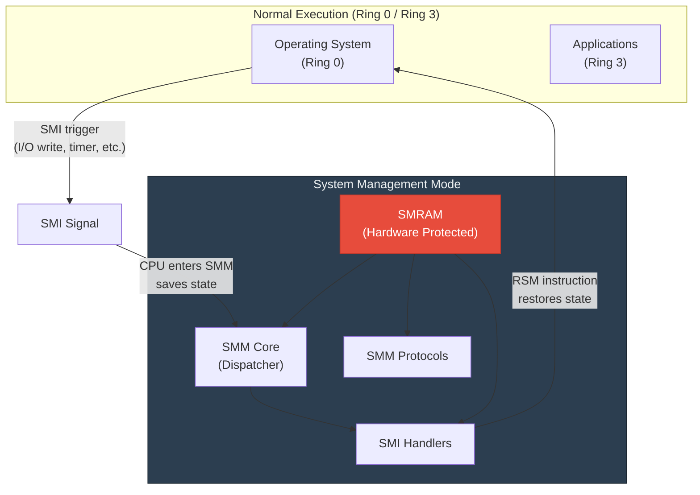
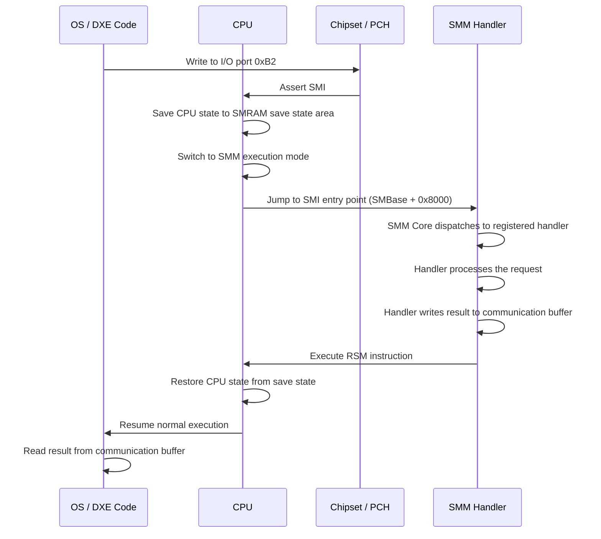
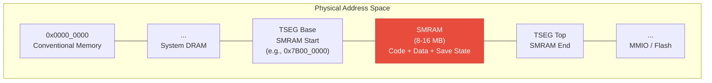
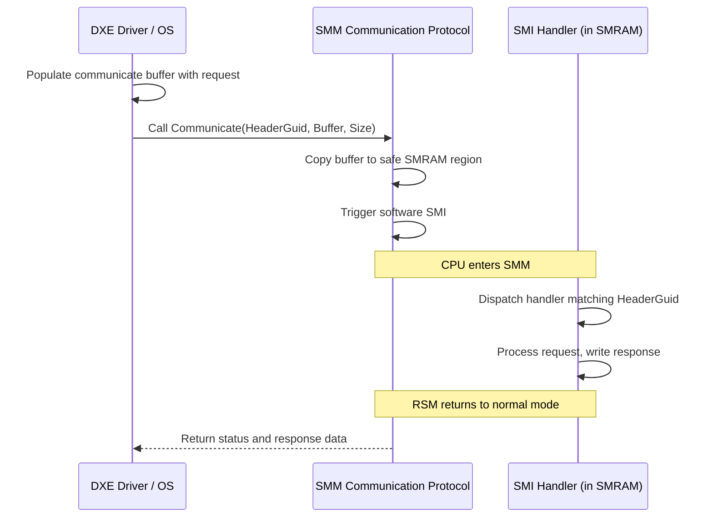
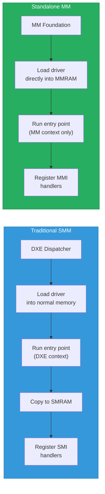
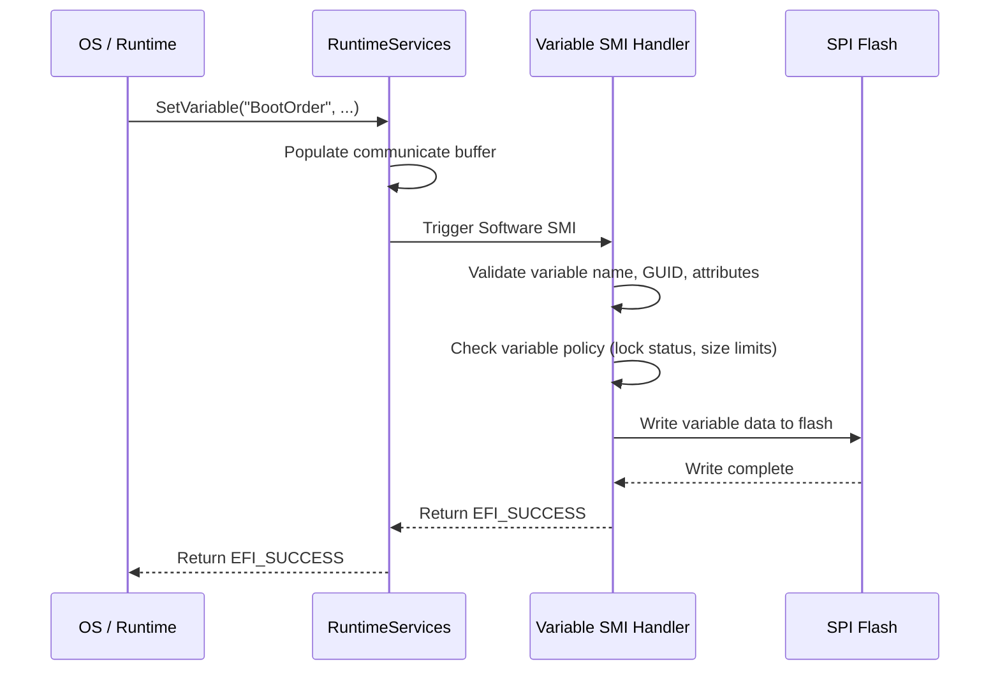

# Chapter 21: System Management Mode
{: .fs-9 }

SMM provides a hardware-isolated execution environment for firmware services that must persist after the OS boots and resist tampering from privileged software.
{: .fs-6 .fw-300 }

---

## Table of Contents
{: .no_toc }

1. TOC
{:toc}

---

## 21.1 What Is System Management Mode?

System Management Mode (SMM) is a special-purpose CPU operating mode on x86 processors that is invisible to the operating system. When the CPU enters SMM, it saves its entire state, switches to a dedicated memory region (SMRAM) that is inaccessible from normal execution modes, runs firmware code, then restores the CPU state and resumes normal execution.

SMM was originally designed for power management and hardware control, but in modern firmware it serves as the execution environment for security-critical runtime services, including:

- **Variable storage**: Writing to SPI flash for non-volatile variables
- **Firmware updates**: Processing capsule updates
- **Hardware error handling**: Machine check exception recovery
- **Security enforcement**: Locking critical registers and flash protection
- **Platform-specific handlers**: Thermal management, GPIO events, port trap emulation

## 21.2 SMM Architecture Overview



## 21.3 SMI Triggers

A System Management Interrupt (SMI) is the mechanism that causes the CPU to enter SMM. SMIs can be triggered by:

| Trigger Type | Source | Example |
|-------------|--------|---------|
| **Software SMI** | I/O write to port 0xB2 | Variable write, capsule processing |
| **Hardware SMI** | Chipset event | Power button, thermal alert |
| **Timer SMI** | Periodic hardware timer | Watchdog, polling tasks |
| **I/O Trap SMI** | Access to a trapped I/O port | Legacy device emulation |
| **PCI SMI** | PCI device event | PCIe hot-plug |
| **GPIO SMI** | GPIO pin state change | Lid open/close, AC adapter |

### 21.3.1 Software SMI Example

The most common way to enter SMM from the OS or from boot services is a software SMI, triggered by writing a command byte to I/O port 0xB2:

```c
#include <Library/IoLib.h>

//
// Trigger a software SMI with command value 0x42
//
VOID
TriggerSoftwareSmi (
  IN UINT8  CommandValue
  )
{
  //
  // Write command to port 0xB2 (SMI command port)
  // Optional data byte goes to port 0xB3
  //
  IoWrite8 (0xB3, 0x00);    // Data byte
  IoWrite8 (0xB2, CommandValue);  // Triggers SMI
  //
  // CPU enters SMM here, runs handler, then resumes
  //
}
```

## 21.4 SMM Entry and Exit Flow



### 21.4.1 Key Details

- **All CPUs enter SMM simultaneously**: When an SMI fires, all logical processors rendezvous in SMRAM. The BSP (bootstrap processor) runs the handler while APs wait or execute assigned tasks.
- **State is transparent**: The OS cannot observe that SMM executed. Registers, memory, and the instruction pointer are restored.
- **Time-critical**: SMM execution blocks all normal processing. Long-running SMI handlers cause visible system pauses.

## 21.5 SMRAM Protection and Isolation

SMRAM is the memory region dedicated to SMM code and data. Hardware mechanisms prevent access from outside SMM:

### 21.5.1 Hardware Protection

- **SMRAM region**: Typically defined by the TSEG (Top Segment) register in the memory controller. Common sizes are 8 MB or 16 MB.
- **SMRAM lock**: Once locked (D_LCK bit), the SMRAM region cannot be opened or remapped until a platform reset.
- **SMM ranges**: The processor enforces that code outside SMM cannot read or write SMRAM.

### 21.5.2 Memory Map



### 21.5.3 SMRAM Sub-regions

Within SMRAM, memory is organized into:

| Region | Purpose |
|--------|---------|
| **SMM Core code and data** | The SMM dispatcher and its heap |
| **SMM driver code and data** | Loaded SMI handler modules |
| **Save State area** | Per-CPU saved register state on SMI entry |
| **Communication buffer** | Shared region for DXE/OS to pass data to SMM |
| **Stack** | Per-CPU SMM execution stacks |

## 21.6 SMM Communication Protocol

The SMM Communication Protocol is the standard mechanism for code outside SMM to send requests to SMI handlers and receive responses.

### 21.6.1 Communication Flow



### 21.6.2 Communication Buffer Structure

```c
typedef struct {
  EFI_GUID    HeaderGuid;    // Identifies which SMI handler to invoke
  UINTN       MessageLength; // Size of Data[]
  UINT8       Data[1];       // Variable-length payload
} EFI_SMM_COMMUNICATE_HEADER;
```

### 21.6.3 Sending a Message to SMM

```c
#include <Protocol/SmmCommunication.h>

EFI_STATUS
SendCommandToSmm (
  IN EFI_GUID  *HandlerGuid,
  IN VOID      *InputData,
  IN UINTN     InputSize,
  OUT VOID     *OutputData,
  IN UINTN     OutputSize
  )
{
  EFI_STATUS                        Status;
  EFI_SMM_COMMUNICATION_PROTOCOL    *SmmComm;
  EFI_SMM_COMMUNICATE_HEADER        *Header;
  UINTN                             BufferSize;

  Status = gBS->LocateProtocol (
                  &gEfiSmmCommunicationProtocolGuid,
                  NULL,
                  (VOID **)&SmmComm
                  );
  if (EFI_ERROR (Status)) {
    return Status;
  }

  //
  // Allocate communication buffer (must be outside SMRAM)
  //
  BufferSize = sizeof (EFI_SMM_COMMUNICATE_HEADER) + InputSize;
  Header = AllocateZeroPool (BufferSize);
  if (Header == NULL) {
    return EFI_OUT_OF_RESOURCES;
  }

  //
  // Fill in the header and payload
  //
  CopyGuid (&Header->HeaderGuid, HandlerGuid);
  Header->MessageLength = InputSize;
  CopyMem (Header->Data, InputData, InputSize);

  //
  // Send the communicate call (triggers SMI internally)
  //
  Status = SmmComm->Communicate (SmmComm, Header, &BufferSize);

  //
  // Copy response data back
  //
  if (!EFI_ERROR (Status) && OutputData != NULL) {
    CopyMem (OutputData, Header->Data, OutputSize);
  }

  FreePool (Header);
  return Status;
}
```

## 21.7 Writing an SMI Handler

### 21.7.1 SMI Handler Registration

SMI handlers are DXE_SMM_DRIVER modules that register with the SMM Core. Here is a complete example:

```c
#include <PiSmm.h>
#include <Protocol/SmmBase2.h>
#include <Library/SmmServicesTableLib.h>
#include <Library/DebugLib.h>
#include <Library/BaseMemoryLib.h>

#define MY_SMI_HANDLER_GUID \
  { 0xAABBCCDD, 0x1122, 0x3344, \
    { 0x55, 0x66, 0x77, 0x88, 0x99, 0xAA, 0xBB, 0xCC } }

EFI_GUID gMySmiHandlerGuid = MY_SMI_HANDLER_GUID;

//
// Command codes for this handler
//
#define CMD_GET_STATUS   0x01
#define CMD_SET_CONFIG   0x02

typedef struct {
  UINT8   Command;
  UINT32  Status;
  UINT8   Data[256];
} MY_SMI_PAYLOAD;

EFI_STATUS
EFIAPI
MySmiHandler (
  IN     EFI_HANDLE  DispatchHandle,
  IN     CONST VOID  *Context         OPTIONAL,
  IN OUT VOID        *CommBuffer      OPTIONAL,
  IN OUT UINTN       *CommBufferSize  OPTIONAL
  )
{
  MY_SMI_PAYLOAD *Payload;

  if (CommBuffer == NULL || CommBufferSize == NULL) {
    return EFI_SUCCESS;
  }

  //
  // Validate the communication buffer size
  //
  if (*CommBufferSize < sizeof (MY_SMI_PAYLOAD)) {
    return EFI_SUCCESS;
  }

  Payload = (MY_SMI_PAYLOAD *)CommBuffer;

  switch (Payload->Command) {
    case CMD_GET_STATUS:
      DEBUG ((DEBUG_INFO, "MySmiHandler: GET_STATUS\n"));
      Payload->Status = 0;  // Success
      break;

    case CMD_SET_CONFIG:
      DEBUG ((DEBUG_INFO, "MySmiHandler: SET_CONFIG\n"));
      //
      // Process configuration data from Payload->Data
      //
      Payload->Status = 0;
      break;

    default:
      Payload->Status = (UINT32)EFI_UNSUPPORTED;
      break;
  }

  return EFI_SUCCESS;
}

EFI_STATUS
EFIAPI
MySmiDriverEntryPoint (
  IN EFI_HANDLE       ImageHandle,
  IN EFI_SYSTEM_TABLE *SystemTable
  )
{
  EFI_STATUS  Status;
  EFI_HANDLE  DispatchHandle;

  //
  // Register the SMI handler with the SMM Core
  //
  DispatchHandle = NULL;
  Status = gSmst->SmiHandlerRegister (
                    MySmiHandler,
                    &gMySmiHandlerGuid,
                    &DispatchHandle
                    );
  ASSERT_EFI_ERROR (Status);

  DEBUG ((DEBUG_INFO, "MySmiHandler registered successfully\n"));
  return EFI_SUCCESS;
}
```

### 21.7.2 INF File for an SMM Driver

```ini
[Defines]
  INF_VERSION    = 0x00010017
  BASE_NAME      = MySmiDriver
  FILE_GUID      = AABBCCDD-1122-3344-5566-778899AABBCC
  MODULE_TYPE    = DXE_SMM_DRIVER
  VERSION_STRING = 1.0
  PI_SPECIFICATION_VERSION = 0x00010032
  ENTRY_POINT    = MySmiDriverEntryPoint

[Sources]
  MySmiDriver.c

[Packages]
  MdePkg/MdePkg.dec
  MdeModulePkg/MdeModulePkg.dec

[LibraryClasses]
  UefiDriverEntryPoint
  SmmServicesTableLib
  DebugLib
  BaseMemoryLib

[Protocols]
  gEfiSmmBase2ProtocolGuid

[Depex]
  gEfiSmmBase2ProtocolGuid
```

## 21.8 Traditional SMM vs Standalone MM

The PI specification defines two models for management mode drivers.

### 21.8.1 Traditional SMM (DXE_SMM_DRIVER)

- Loaded by the DXE dispatcher into normal memory
- Entry point runs in DXE context (has access to Boot Services)
- Then loaded into SMRAM by the SMM Core
- Can use DXE protocols during initialization
- Tightly coupled to the DXE phase

### 21.8.2 Standalone MM (MM_STANDALONE)

- Loaded directly by the MM Foundation into SMRAM
- Entry point runs entirely in MM context
- No access to DXE Boot Services or protocols
- Decoupled from DXE -- can work with non-UEFI boot flows
- Required for ARM TrustZone-based Secure Partitions



### 21.8.3 Standalone MM INF File

```ini
[Defines]
  INF_VERSION    = 0x00010032
  BASE_NAME      = MyStandaloneMmDriver
  FILE_GUID      = 11223344-5566-7788-99AA-BBCCDDEEFF00
  MODULE_TYPE    = MM_STANDALONE
  VERSION_STRING = 1.0
  PI_SPECIFICATION_VERSION = 0x00010032
  ENTRY_POINT    = MyStandaloneMmEntryPoint

[Sources]
  MyStandaloneMmDriver.c

[Packages]
  MdePkg/MdePkg.dec
  StandaloneMmPkg/StandaloneMmPkg.dec

[LibraryClasses]
  StandaloneMmDriverEntryPoint
  MmServicesTableLib
  DebugLib
```

### 21.8.4 Project Mu's MM Abstraction

Project Mu encourages writing MM drivers that compile as both Traditional SMM and Standalone MM. This is achieved by using the `MmServicesTableLib` abstraction instead of `SmmServicesTableLib`:

```c
#include <Library/MmServicesTableLib.h>

//
// Use gMmst instead of gSmst -- works in both Traditional and Standalone
//
Status = gMmst->MmiHandlerRegister (
                  MyHandler,
                  &gMyHandlerGuid,
                  &DispatchHandle
                  );
```

## 21.9 SMM Security Considerations

SMM has the highest privilege level on x86 platforms. A vulnerability in SMM code can compromise the entire system beyond recovery by the OS. This makes SMM security critical.

### 21.9.1 Communication Buffer Validation

The most common SMM vulnerability is improper validation of the communication buffer. The buffer pointer comes from untrusted code (DXE or the OS) and could point to SMRAM, causing the handler to corrupt its own code or data:

```c
//
// BAD: No validation of CommBuffer
//
EFI_STATUS
EFIAPI
VulnerableHandler (
  IN     EFI_HANDLE  DispatchHandle,
  IN     CONST VOID  *Context,
  IN OUT VOID        *CommBuffer,
  IN OUT UINTN       *CommBufferSize
  )
{
  MY_DATA *Data = (MY_DATA *)CommBuffer;
  //
  // VULNERABILITY: CommBuffer could point into SMRAM!
  // An attacker could craft a buffer address that overlaps
  // with SMM code, causing the handler to overwrite itself.
  //
  ProcessData (Data);
  return EFI_SUCCESS;
}

//
// GOOD: Validate the buffer is outside SMRAM
//
#include <Library/SmmMemLib.h>

EFI_STATUS
EFIAPI
SecureHandler (
  IN     EFI_HANDLE  DispatchHandle,
  IN     CONST VOID  *Context,
  IN OUT VOID        *CommBuffer,
  IN OUT UINTN       *CommBufferSize
  )
{
  MY_DATA *Data;

  if (CommBuffer == NULL || CommBufferSize == NULL) {
    return EFI_INVALID_PARAMETER;
  }

  if (*CommBufferSize < sizeof (MY_DATA)) {
    return EFI_INVALID_PARAMETER;
  }

  //
  // Verify the buffer is entirely outside SMRAM
  //
  if (!SmmIsBufferOutsideSmmValid (
         (EFI_PHYSICAL_ADDRESS)(UINTN)CommBuffer,
         *CommBufferSize))
  {
    DEBUG ((DEBUG_ERROR, "CommBuffer overlaps SMRAM!\n"));
    return EFI_SECURITY_VIOLATION;
  }

  Data = (MY_DATA *)CommBuffer;
  ProcessData (Data);
  return EFI_SUCCESS;
}
```

### 21.9.2 TOCTOU (Time-of-Check/Time-of-Use) Attacks

Because the communication buffer resides in normal memory, an attacker running on another CPU core can modify it between the SMI handler's validation check and its use of the data:

```c
//
// VULNERABLE to TOCTOU:
//
if (Data->Offset < MAX_OFFSET) {
  //
  // Attacker changes Data->Offset on another core right here!
  //
  WriteToFlash (Data->Offset, Data->Value);  // Out-of-bounds write
}

//
// MITIGATION: Copy data into SMRAM before validation
//
MY_DATA  LocalCopy;
CopyMem (&LocalCopy, CommBuffer, sizeof (MY_DATA));
//
// Now validate and use LocalCopy (attacker cannot modify it)
//
if (LocalCopy.Offset < MAX_OFFSET) {
  WriteToFlash (LocalCopy.Offset, LocalCopy.Value);
}
```

### 21.9.3 SMM Callout Detection

An SMM callout occurs when SMM code calls a function pointer that is located outside SMRAM. An attacker who controls normal memory can redirect these pointers to arbitrary code that executes with SMM privilege.

Project Mu includes an SMM callout detection mechanism that audits function pointer targets during SMM execution:

```c
//
// BAD: Calling a function pointer from outside SMRAM
//
typedef VOID (*CALLBACK_FUNC)(VOID);
CALLBACK_FUNC ExternalCallback;  // Set during DXE, points outside SMRAM

//
// Inside SMI handler:
// ExternalCallback();  // SMM CALLOUT -- attacker can redirect this!
//

//
// GOOD: Never call function pointers from outside SMRAM
// Copy needed data or code into SMRAM during driver initialization
//
```

### 21.9.4 Security Best Practices for SMM

1. **Validate all communication buffers** using `SmmIsBufferOutsideSmmValid()`
2. **Copy input data into SMRAM** before validation to prevent TOCTOU attacks
3. **Never call function pointers** that originate from outside SMRAM
4. **Minimize SMM code surface**: Less code means fewer potential vulnerabilities
5. **Lock SMRAM before boot**: Call `SmmAccess->Lock()` before ExitBootServices
6. **Use Standalone MM** when possible to reduce the attack surface from DXE dependencies
7. **Enable SMM page protection**: Mark code pages as read-only and data pages as non-executable

## 21.10 SMM Infrastructure Protocols

| Protocol | Purpose |
|----------|---------|
| `EFI_SMM_BASE2_PROTOCOL` | Determines if code is executing in SMM |
| `EFI_SMM_ACCESS2_PROTOCOL` | Opens, closes, and locks SMRAM regions |
| `EFI_SMM_CONTROL2_PROTOCOL` | Triggers and clears SMIs |
| `EFI_SMM_COMMUNICATION_PROTOCOL` | Passes data between DXE and SMM |
| `EFI_SMM_SW_DISPATCH2_PROTOCOL` | Registers handlers for software SMIs |
| `EFI_SMM_SX_DISPATCH2_PROTOCOL` | Registers handlers for sleep state transitions |
| `EFI_SMM_PERIODIC_TIMER_DISPATCH2_PROTOCOL` | Registers periodic timer SMI handlers |
| `EFI_SMM_GPI_DISPATCH2_PROTOCOL` | Registers handlers for GPIO SMIs |
| `EFI_SMM_IO_TRAP_DISPATCH2_PROTOCOL` | Registers handlers for I/O port trap SMIs |

### 21.10.1 Registering a Software SMI Dispatch Handler

```c
#include <Protocol/SmmSwDispatch2.h>

EFI_STATUS
EFIAPI
SwSmiCallback (
  IN EFI_HANDLE                    DispatchHandle,
  IN CONST EFI_SMM_SW_REGISTER_CONTEXT *DispatchContext,
  IN OUT   EFI_SMM_SW_CONTEXT     *SwContext,
  IN OUT   UINTN                  *CommBufferSize
  )
{
  DEBUG ((
    DEBUG_INFO,
    "Software SMI received: command = 0x%02X\n",
    DispatchContext->SwSmiInputValue
    ));

  //
  // Handle the specific software SMI command
  //
  return EFI_SUCCESS;
}

EFI_STATUS
RegisterSwSmiHandler (
  VOID
  )
{
  EFI_STATUS                          Status;
  EFI_SMM_SW_DISPATCH2_PROTOCOL       *SwDispatch;
  EFI_SMM_SW_REGISTER_CONTEXT         SwContext;
  EFI_HANDLE                          DispatchHandle;

  Status = gMmst->MmLocateProtocol (
                    &gEfiSmmSwDispatch2ProtocolGuid,
                    NULL,
                    (VOID **)&SwDispatch
                    );
  if (EFI_ERROR (Status)) {
    return Status;
  }

  //
  // Register for software SMI value 0x42
  //
  SwContext.SwSmiInputValue = 0x42;
  Status = SwDispatch->Register (
                         SwDispatch,
                         SwSmiCallback,
                         &SwContext,
                         &DispatchHandle
                         );

  return Status;
}
```

## 21.11 SMM and Variable Storage

One of the most important uses of SMM is protecting variable storage. In a typical implementation:

1. DXE/OS code calls `SetVariable()` (a Runtime Service)
2. The Runtime Services implementation triggers a software SMI
3. The SMI handler in SMRAM validates the request
4. The handler writes to SPI flash (which is locked to SMM-only access)
5. The handler returns status via the communication buffer

This ensures that only validated, authorized code can modify firmware variables, even if the OS kernel is compromised.



## 21.12 Summary

System Management Mode is the most privileged execution environment on x86 platforms. It provides hardware-isolated firmware services that persist after the OS boots, but this power comes with significant security responsibilities.

**Key takeaways:**

- **SMM executes in hardware-protected SMRAM** that is invisible to the OS and applications.
- **SMIs trigger SMM entry**, saving and restoring all CPU state transparently.
- **The SMM Communication Protocol** is the standard interface for passing data into and out of SMM.
- **Traditional SMM drivers** (DXE_SMM_DRIVER) initialize in DXE context; **Standalone MM** (MM_STANDALONE) drivers are self-contained.
- **Communication buffer validation is critical** -- failing to validate buffers is the most common SMM vulnerability class.
- **TOCTOU attacks** require copying input data into SMRAM before use.
- **Project Mu's MM abstraction** lets drivers compile for both Traditional SMM and Standalone MM.

---

**Next:** [Chapter 22: Security and Secure Boot]() builds on SMM's role as a secure execution environment and explores the broader UEFI security architecture.
