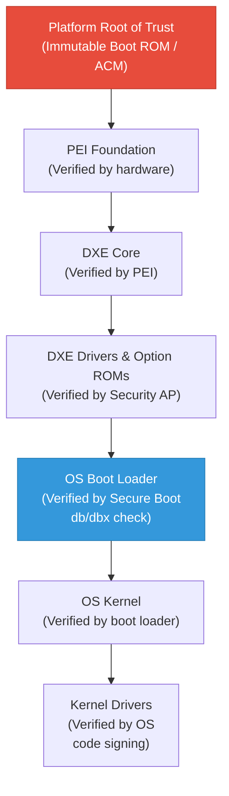
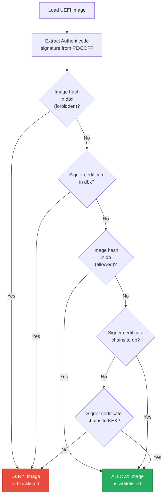
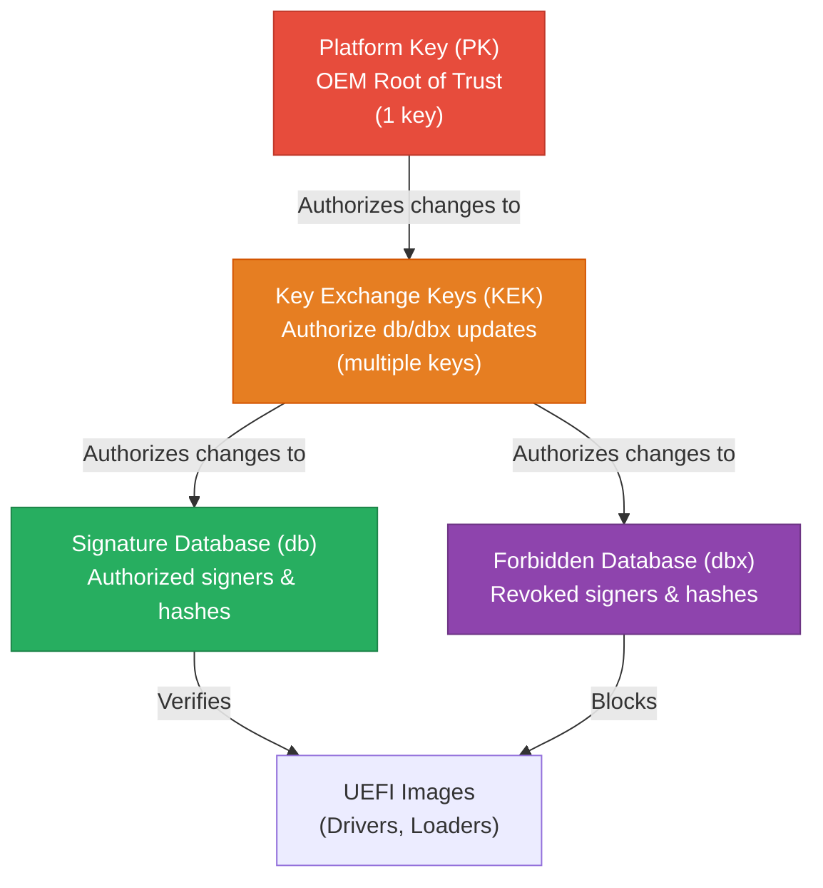
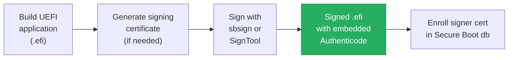
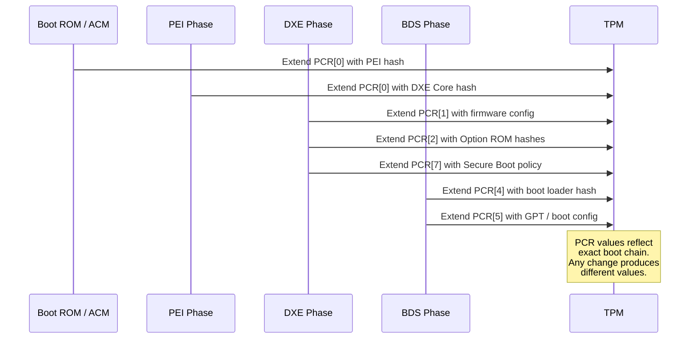
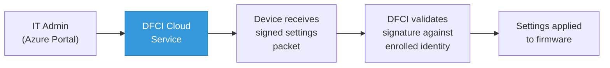

# Chapter 22: Security and Secure Boot
{: .fs-9 }

Establish a chain of trust from the first instruction at power-on through OS handoff, using cryptographic verification and hardware-rooted measurement.
{: .fs-6 .fw-300 }

---

## Table of Contents
{: .no_toc }

1. TOC
{:toc}

---

## 22.1 Why Firmware Security Matters

Firmware executes before any operating system security mechanism. An attacker who compromises firmware can:

- **Persist across OS reinstalls**: Firmware rootkits survive disk formatting and OS replacement
- **Evade detection**: Anti-malware tools running in the OS cannot inspect firmware code
- **Subvert the OS kernel**: Firmware can modify the kernel as it loads
- **Disable security features**: Secure Boot, BitLocker, and virtualization-based security can all be undermined at the firmware level

Modern firmware security rests on two complementary mechanisms: **Secure Boot** (verification) and **Measured Boot** (attestation).

## 22.2 UEFI Secure Boot

Secure Boot is a UEFI specification feature that ensures only cryptographically signed and authorized code can execute during the boot process. It uses public-key cryptography to verify each binary before it runs.

### 22.2.1 Chain of Trust



### 22.2.2 How Secure Boot Verification Works

When the firmware loads a UEFI executable (driver, application, or OS loader), the Security Architectural Protocol performs these checks:



## 22.3 Key Hierarchy

Secure Boot uses a four-level key hierarchy stored in authenticated UEFI variables.

### 22.3.1 Key Roles

| Key | Variable | Description |
|-----|----------|-------------|
| **PK** (Platform Key) | `PK` | The root of trust for the Secure Boot key hierarchy. Typically owned by the OEM. Only one PK can be enrolled. The PK authorizes changes to the KEK. |
| **KEK** (Key Exchange Key) | `KEK` | Authorizes updates to the `db` and `dbx` databases. Multiple KEKs can exist. Microsoft and the OEM typically each enroll a KEK. |
| **db** (Signature Database) | `db` | Contains certificates and hashes of authorized images. An image signed by a certificate in `db` (or whose hash is in `db`) is allowed to execute. |
| **dbx** (Forbidden Signature Database) | `dbx` | Contains certificates and hashes of forbidden images. Takes priority over `db`. Used to revoke compromised boot loaders or certificates. |

### 22.3.2 Key Hierarchy Diagram



### 22.3.3 Key Types in the Databases

Each database can contain:

- **X.509 certificates** (`EFI_CERT_X509_GUID`): Trust any image signed by this certificate
- **SHA-256 hashes** (`EFI_CERT_SHA256_GUID`): Trust (or forbid) a specific image by its hash
- **RSA-2048 keys** (`EFI_CERT_RSA2048_GUID`): Trust images signed by this public key

## 22.4 Enrolling Secure Boot Keys

### 22.4.1 Secure Boot Modes

| Mode | PK Enrolled | Secure Boot | Description |
|------|------------|-------------|-------------|
| **Setup Mode** | No | Disabled | PK can be enrolled without authentication |
| **User Mode** | Yes | Enabled | All key changes require authentication |
| **Audit Mode** | Yes | Logging only | Images execute but verification results are logged |
| **Deployed Mode** | Yes | Enforced | Most restrictive; Setup Mode cannot be re-entered via firmware UI |

### 22.4.2 Enrolling Keys Programmatically

```c
#include <Guid/ImageAuthentication.h>
#include <Library/UefiRuntimeServicesTableLib.h>

EFI_STATUS
EnrollSecureBootCertificate (
  IN CHAR16    *VariableName,     // L"db", L"KEK", etc.
  IN EFI_GUID  *VendorGuid,      // &gEfiImageSecurityDatabaseGuid
  IN UINT8     *CertData,        // DER-encoded X.509 certificate
  IN UINTN     CertSize
  )
{
  EFI_STATUS                     Status;
  EFI_SIGNATURE_LIST             *SigList;
  EFI_SIGNATURE_DATA             *SigData;
  UINTN                          DataSize;
  EFI_VARIABLE_AUTHENTICATION_2  *AuthVar;
  UINTN                          AuthVarSize;

  //
  // Calculate sizes
  //
  DataSize = sizeof (EFI_SIGNATURE_LIST) +
             sizeof (EFI_SIGNATURE_DATA) - 1 +
             CertSize;

  SigList = AllocateZeroPool (DataSize);
  if (SigList == NULL) {
    return EFI_OUT_OF_RESOURCES;
  }

  //
  // Build the EFI_SIGNATURE_LIST
  //
  CopyGuid (&SigList->SignatureType, &gEfiCertX509Guid);
  SigList->SignatureListSize = (UINT32)DataSize;
  SigList->SignatureHeaderSize = 0;
  SigList->SignatureSize = (UINT32)(sizeof (EFI_SIGNATURE_DATA) - 1 + CertSize);

  //
  // Fill in the EFI_SIGNATURE_DATA
  //
  SigData = (EFI_SIGNATURE_DATA *)((UINT8 *)SigList + sizeof (EFI_SIGNATURE_LIST));
  CopyGuid (&SigData->SignatureOwner, &gMyOwnerGuid);
  CopyMem (SigData->SignatureData, CertData, CertSize);

  //
  // In Setup Mode, authenticated write is simpler.
  // In User Mode, this must be wrapped in EFI_VARIABLE_AUTHENTICATION_2
  // with a valid PKCS#7 signature from the KEK.
  //
  Status = gRT->SetVariable (
                  VariableName,
                  VendorGuid,
                  EFI_VARIABLE_NON_VOLATILE |
                    EFI_VARIABLE_RUNTIME_ACCESS |
                    EFI_VARIABLE_BOOTSERVICE_ACCESS |
                    EFI_VARIABLE_TIME_BASED_AUTHENTICATED_WRITE_ACCESS |
                    EFI_VARIABLE_APPEND_WRITE,
                  DataSize,
                  SigList
                  );

  FreePool (SigList);
  return Status;
}
```

## 22.5 Signing UEFI Binaries

To run under Secure Boot, UEFI executables must be signed with the Authenticode signature format.

### 22.5.1 Signing Workflow



### 22.5.2 Signing with sbsign (Linux)

```bash
# Generate a self-signed certificate and key for testing
openssl req -new -x509 -newkey rsa:2048 -keyout db.key \
  -out db.crt -days 3650 -nodes -subj "/CN=My Test Key"

# Sign the UEFI binary
sbsign --key db.key --cert db.crt --output signed.efi unsigned.efi

# Verify the signature
sbverify --cert db.crt signed.efi
```

### 22.5.3 Signing with SignTool (Windows)

```powershell
# Create a PFX from the certificate and key
openssl pkcs12 -export -out db.pfx -inkey db.key -in db.crt

# Sign with Microsoft SignTool
signtool sign /f db.pfx /p password /fd sha256 /tr http://timestamp.digicert.com MyApp.efi
```

### 22.5.4 Microsoft's UEFI CA

Most Linux distributions and third-party boot loaders are signed by the **Microsoft UEFI CA** certificate, which is pre-enrolled in the `db` of virtually all retail PCs. Microsoft's signing service (the Microsoft Sysdev portal) signs third-party boot loaders after review.

The Microsoft UEFI CA is separate from the **Microsoft Windows Production PCA**, which signs the Windows boot loader. Both are typically enrolled in `db`.

## 22.6 Secure Boot Variables in Detail

### 22.6.1 Standard Secure Boot Variables

| Variable | GUID | Attributes | Description |
|----------|------|-----------|-------------|
| `PK` | `gEfiGlobalVariableGuid` | NV, BS, RT, AT | Platform Key |
| `KEK` | `gEfiGlobalVariableGuid` | NV, BS, RT, AT | Key Exchange Keys |
| `db` | `gEfiImageSecurityDatabaseGuid` | NV, BS, RT, AT | Authorized signatures |
| `dbx` | `gEfiImageSecurityDatabaseGuid` | NV, BS, RT, AT | Forbidden signatures |
| `dbt` | `gEfiImageSecurityDatabaseGuid` | NV, BS, RT, AT | Trusted timestamp certificates |
| `SecureBoot` | `gEfiGlobalVariableGuid` | BS, RT | Current Secure Boot state (read-only) |
| `SetupMode` | `gEfiGlobalVariableGuid` | BS, RT | Whether platform is in Setup Mode |
| `AuditMode` | `gEfiGlobalVariableGuid` | BS, RT | Whether platform is in Audit Mode |
| `DeployedMode` | `gEfiGlobalVariableGuid` | BS, RT | Whether platform is in Deployed Mode |

(NV = Non-Volatile, BS = Boot Service Access, RT = Runtime Access, AT = Authenticated)

### 22.6.2 Checking Secure Boot State

```c
EFI_STATUS
IsSecureBootEnabled (
  OUT BOOLEAN *Enabled
  )
{
  EFI_STATUS  Status;
  UINT8       SecureBoot;
  UINTN       DataSize;

  DataSize = sizeof (SecureBoot);
  Status = gRT->GetVariable (
                  L"SecureBoot",
                  &gEfiGlobalVariableGuid,
                  NULL,
                  &DataSize,
                  &SecureBoot
                  );
  if (EFI_ERROR (Status)) {
    *Enabled = FALSE;
    return Status;
  }

  *Enabled = (SecureBoot == 1);
  return EFI_SUCCESS;
}
```

## 22.7 Measured Boot and TPM Integration

While Secure Boot *verifies* that code is authorized, Measured Boot *records* what code actually executed, enabling remote attestation.

### 22.7.1 What Is Measured Boot?

Measured Boot uses a Trusted Platform Module (TPM) to cryptographically record (measure) each component loaded during boot. The measurements are stored in Platform Configuration Registers (PCRs) that cannot be directly written -- they can only be *extended*:

```
PCR_new = SHA-256(PCR_old || measurement)
```

This means the final PCR value is a cumulative hash of every measurement in sequence. Any change to any component produces a different PCR value.

### 22.7.2 PCR Allocation

| PCR | What Is Measured |
|-----|-----------------|
| PCR[0] | BIOS/firmware code (PEI, DXE Core) |
| PCR[1] | BIOS/firmware configuration (Setup settings) |
| PCR[2] | Option ROM code |
| PCR[3] | Option ROM configuration and data |
| PCR[4] | IPL (Initial Program Loader) code -- boot loader |
| PCR[5] | IPL configuration -- boot manager data, GPT table |
| PCR[6] | State transitions and wake events |
| PCR[7] | Secure Boot policy (PK, KEK, db, dbx) |
| PCR[8-15] | Reserved for OS use (Linux IMA, etc.) |

### 22.7.3 TPM Event Log

In addition to PCR extension, firmware records each measurement in the **TPM Event Log**, a data structure passed to the OS that describes what was measured and into which PCR:

```c
#include <IndustryStandard/UefiTcgPlatform.h>
#include <Protocol/Tcg2Protocol.h>

EFI_STATUS
MeasureDataToTpm (
  IN UINT32  PcrIndex,
  IN UINT32  EventType,
  IN CHAR8   *EventDescription,
  IN VOID    *Data,
  IN UINTN   DataSize
  )
{
  EFI_STATUS               Status;
  EFI_TCG2_PROTOCOL        *Tcg2;
  EFI_TCG2_EVENT           *Tcg2Event;
  UINTN                    EventSize;

  Status = gBS->LocateProtocol (
                  &gEfiTcg2ProtocolGuid,
                  NULL,
                  (VOID **)&Tcg2
                  );
  if (EFI_ERROR (Status)) {
    return Status;
  }

  //
  // Build the TCG2 event structure
  //
  EventSize = sizeof (EFI_TCG2_EVENT) - sizeof (Tcg2Event->Event) +
              AsciiStrSize (EventDescription);

  Tcg2Event = AllocateZeroPool (EventSize);
  if (Tcg2Event == NULL) {
    return EFI_OUT_OF_RESOURCES;
  }

  Tcg2Event->Size = (UINT32)EventSize;
  Tcg2Event->Header.HeaderSize    = sizeof (EFI_TCG2_EVENT_HEADER);
  Tcg2Event->Header.HeaderVersion = EFI_TCG2_EVENT_HEADER_VERSION;
  Tcg2Event->Header.PCRIndex      = PcrIndex;
  Tcg2Event->Header.EventType     = EventType;
  CopyMem (Tcg2Event->Event, EventDescription, AsciiStrSize (EventDescription));

  //
  // Hash the data and extend into the PCR
  //
  Status = Tcg2->HashLogExtendEvent (
                   Tcg2,
                   0,                      // Flags
                   (EFI_PHYSICAL_ADDRESS)(UINTN)Data,
                   DataSize,
                   Tcg2Event
                   );

  FreePool (Tcg2Event);
  return Status;
}
```

### 22.7.4 Measured Boot Flow



### 22.7.5 Remote Attestation

The PCR values and event log can be sent to a remote server (an attestation service) that knows the expected values. If the PCRs match, the server trusts the platform's boot integrity. If they differ, the platform may be compromised.

This is the foundation of technologies like:
- **BitLocker** (seals decryption key to PCR values)
- **Azure Attestation** (verifies VM firmware integrity)
- **Google Cloud Shielded VMs**

## 22.8 Project Mu Security Features

Project Mu adds several security capabilities beyond the UEFI specification.

### 22.8.1 DFCI (Device Firmware Configuration Interface)

DFCI enables zero-touch, cloud-managed firmware configuration. It uses a certificate-based identity model where an enterprise can remotely manage firmware settings without physical access:



DFCI can control:
- Secure Boot enable/disable
- Boot from USB enable/disable
- Camera/microphone enable/disable
- Wi-Fi/Bluetooth enable/disable
- Any custom OEM-defined setting

### 22.8.2 Secure Variable Provisioning

Project Mu supports provisioning Secure Boot keys and other authenticated variables through signed packages that can be applied during manufacturing or via DFCI:

```c
//
// Example: Processing a signed Secure Boot key provisioning package
//
EFI_STATUS
ProcessKeyProvisioningPacket (
  IN UINT8  *PacketData,
  IN UINTN  PacketSize
  )
{
  EFI_STATUS Status;

  //
  // 1. Verify packet signature against provisioning authority
  //
  Status = VerifyProvisioningSignature (PacketData, PacketSize);
  if (EFI_ERROR (Status)) {
    DEBUG ((DEBUG_ERROR, "Provisioning packet signature invalid\n"));
    return EFI_SECURITY_VIOLATION;
  }

  //
  // 2. Extract and apply Secure Boot keys
  //
  Status = ApplySecureBootKeys (PacketData, PacketSize);
  if (EFI_ERROR (Status)) {
    return Status;
  }

  //
  // 3. Transition from Setup Mode to User Mode
  //
  Status = TransitionToUserMode ();

  return Status;
}
```

### 22.8.3 Variable Policy Engine

As discussed in Chapter 20, Project Mu's Variable Policy engine enforces fine-grained access control on UEFI variables. This is critical for security because variables control:
- Secure Boot keys (`PK`, `KEK`, `db`, `dbx`)
- Boot options (`Boot####`, `BootOrder`)
- Platform configuration settings

```c
//
// Lock Secure Boot key variables after provisioning
//
Status = RegisterBasicVariablePolicy (
           VariablePolicy,
           &gEfiImageSecurityDatabaseGuid,
           L"db",
           0,
           VARIABLE_POLICY_NO_MAX_SIZE,
           VARIABLE_POLICY_NO_MUST_ATTR,
           VARIABLE_POLICY_NO_CANT_ATTR,
           VARIABLE_POLICY_TYPE_LOCK_ON_VAR_STATE
           );
```

### 22.8.4 Mu Feature Security Packages

| Package | Purpose |
|---------|---------|
| `DfciPkg` | Zero-touch cloud firmware management |
| `TpmTestingPkg` | TPM testing and validation |
| `SecureBootKeyStoreLib` | Secure Boot key provisioning |
| `VariablePolicyLib` | Variable access control |
| `Mu_Tiano_Plus/SecurityPkg` | Enhanced security features |

## 22.9 Common Vulnerabilities and Mitigations

### 22.9.1 Bootkits

A bootkit is malware that compromises the boot process to execute before (or instead of) the legitimate OS.

**Attack vector**: Replace or modify the OS boot loader on disk.

**Mitigation**: Secure Boot verifies the boot loader signature. The `dbx` database can revoke compromised boot loaders (e.g., the "BlackLotus" bootkit was mitigated by adding its hash to `dbx` via Windows Update).

### 22.9.2 Firmware Rootkits

Firmware rootkits modify the SPI flash to persist malicious code in the firmware itself.

**Attack vector**: Exploit a vulnerability to write to SPI flash (e.g., via a vulnerable SMI handler or by bypassing flash write protection).

**Mitigations**:
- **SPI flash write protection**: Hardware write-protect SPI flash via the PCH's BIOS Lock Enable (BLE) and SMM-only write access
- **Boot Guard / Verified Boot**: Hardware verifies the firmware before execution
- **Firmware TPM measurement**: PCR[0] changes if firmware code is modified

### 22.9.3 DMA Attacks

DMA-capable devices (Thunderbolt, FireWire, PCI Express) can read or write system memory, bypassing CPU-enforced protections.

**Attack vector**: Connect a malicious Thunderbolt device that reads SMRAM or modifies boot code in memory.

**Mitigations**:
- **IOMMU / VT-d**: Configure DMA remapping to prevent unauthorized device memory access
- **Kernel DMA Protection**: Available in Windows 10+ and modern Linux kernels
- **Pre-boot DMA protection**: Firmware enables IOMMU before ExitBootServices

### 22.9.4 Variable Attacks

Malformed or oversized variable writes can cause buffer overflows in the variable storage implementation.

**Mitigations**:
- **Variable Policy**: Enforce size limits, attribute requirements, and lock states
- **Authenticated variables**: Require cryptographic signatures for modifications
- **SMM-based variable storage**: Variable writes go through validated SMM handlers

### 22.9.5 Rollback Attacks

An attacker downgrades firmware to an older version with known vulnerabilities.

**Mitigations**:
- **Anti-rollback counters**: Store a monotonic counter in fuses or TPM NV storage; refuse to boot firmware older than the counter value
- **Secure version numbering**: Embed version numbers in signed firmware and verify during update

## 22.10 Secure Boot Implementation Checklist

For platform developers implementing Secure Boot in a Project Mu firmware:

1. **Enable the Security Architectural Protocol** -- Ensure `SecurityStubDxe` or a platform-specific security driver is included
2. **Include DxeImageVerificationLib** -- Provides the Authenticode verification logic
3. **Enroll default keys** -- Provide factory-default PK, KEK, db, and dbx via `SecureBootKeyStoreLib`
4. **Include dbx updates** -- Integrate the latest UEFI Revocation List from uefi.org
5. **Enable Variable Policy** -- Lock Secure Boot variables appropriately
6. **Measure Secure Boot policy** -- Extend PCR[7] with PK, KEK, db, dbx contents
7. **Test with signed and unsigned images** -- Verify that unsigned images are rejected
8. **Test key revocation** -- Verify that images signed by revoked keys are rejected
9. **Enable SPI flash protection** -- Ensure flash is locked to SMM-only write access
10. **Enable Boot Guard** (Intel) or **Platform Secure Boot** (AMD) -- Hardware-rooted verification

## 22.11 Summary

UEFI security is a layered defense built on cryptographic verification, hardware-rooted measurement, and access control enforcement.

**Key takeaways:**

- **Secure Boot verifies** each binary in the boot chain using the PK/KEK/db/dbx key hierarchy.
- **Measured Boot records** each boot component into TPM PCRs, enabling remote attestation.
- **The key hierarchy** (PK -> KEK -> db/dbx) provides a structured trust model with clear ownership.
- **Project Mu extends security** with DFCI for cloud-managed configuration, Variable Policy for access control, and enhanced secure provisioning.
- **Common attacks** (bootkits, firmware rootkits, DMA attacks, rollback) have well-understood mitigations that firmware must implement.
- **Defense in depth** is essential: Secure Boot, Measured Boot, flash protection, IOMMU, and anti-rollback should all be enabled.

---

**Next:** [Chapter 23: ACPI Integration]() covers how firmware publishes hardware description tables that the operating system uses for device discovery, power management, and configuration.
