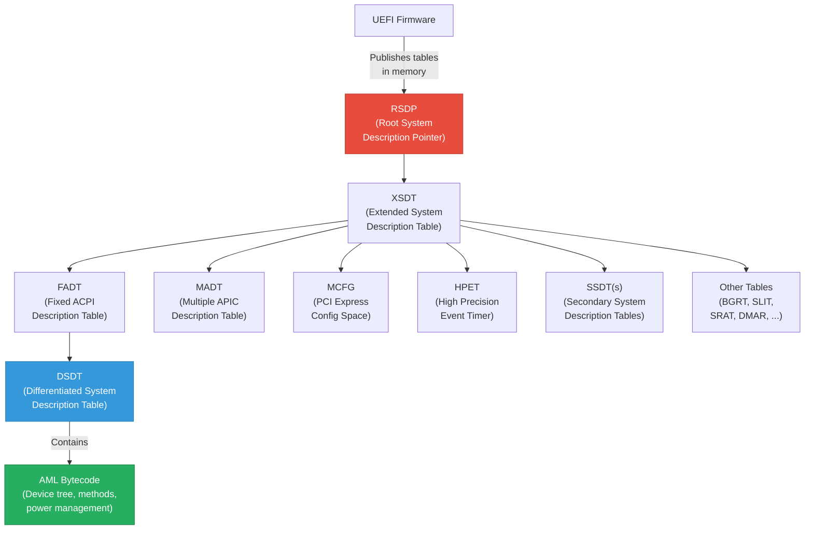

# Chapter 23: ACPI Integration
{: .fs-9 }

ACPI tables are the bridge between firmware and the operating system, describing platform topology, power management, and device configuration in a machine-readable format.
{: .fs-6 .fw-300 }

---

## Table of Contents
{: .no_toc }

1. TOC
{:toc}

---

## 23.1 What Is ACPI?

The Advanced Configuration and Power Interface (ACPI) is an open standard that defines how the operating system discovers and configures hardware, manages power states, and handles platform events. ACPI replaced older standards (APM, MPS, PnP BIOS) by providing a single, unified interface.

From a firmware developer's perspective, ACPI is a set of data tables and executable bytecode (AML -- ACPI Machine Language) that the firmware publishes in memory. The OS reads these tables to learn:

- How many CPUs exist and their APIC IDs
- Which interrupt controllers are present
- How devices are connected (PCI topology, GPIO, I2C, SPI)
- How to put devices and the platform into low-power states
- How to handle thermal zones, battery status, and lid events
- Which memory-mapped configuration regions exist

## 23.2 ACPI Architecture Overview



### 23.2.1 Table Discovery

The OS locates ACPI tables through this chain:

1. **RSDP**: Found via the UEFI Configuration Table (or EBDA in legacy BIOS). Contains the physical address of the XSDT.
2. **XSDT**: An array of 64-bit physical addresses pointing to all other ACPI tables.
3. **Individual tables**: Each table has a standard header with signature, length, revision, and checksum.

## 23.3 Key ACPI Tables

### 23.3.1 RSDP (Root System Description Pointer)

The RSDP is not a full table but a fixed-size structure that bootstraps ACPI table discovery:

```c
typedef struct {
  CHAR8   Signature[8];      // "RSD PTR "
  UINT8   Checksum;          // Checksum of first 20 bytes
  CHAR8   OemId[6];          // OEM identification
  UINT8   Revision;          // 2 for ACPI 2.0+
  UINT32  RsdtAddress;       // Physical address of RSDT (32-bit)
  UINT32  Length;             // Length of this structure
  UINT64  XsdtAddress;       // Physical address of XSDT (64-bit)
  UINT8   ExtendedChecksum;  // Checksum of entire structure
  UINT8   Reserved[3];
} EFI_ACPI_RSDP;
```

In UEFI firmware, the RSDP is published in the EFI System Table's Configuration Table array under `gEfiAcpi20TableGuid`.

### 23.3.2 XSDT (Extended System Description Table)

The XSDT contains an array of 64-bit physical addresses, each pointing to another ACPI table:

```c
typedef struct {
  EFI_ACPI_DESCRIPTION_HEADER  Header;    // Signature = "XSDT"
  UINT64                       Entry[];   // Array of table pointers
} EFI_ACPI_XSDT;
```

### 23.3.3 FADT (Fixed ACPI Description Table)

The FADT describes fixed hardware features and contains the address of the DSDT:

| Field | Description |
|-------|-------------|
| `FIRMWARE_CTRL` | Physical address of FACS (Firmware ACPI Control Structure) |
| `DSDT` | Physical address of the DSDT |
| `PM1a_EVT_BLK` | Address of PM1a Event Register Block |
| `PM1a_CNT_BLK` | Address of PM1a Control Register Block |
| `PM_TMR_BLK` | Address of PM Timer Block |
| `SCI_INT` | System Control Interrupt vector |
| `SMI_CMD` | I/O port address for SMI command |
| `ACPI_ENABLE` | Value to write to SMI_CMD to enable ACPI |
| `FLAGS` | Feature flags (HW_REDUCED_ACPI, etc.) |

### 23.3.4 MADT (Multiple APIC Description Table)

The MADT describes the interrupt controller topology:

```c
//
// MADT entry types
//
// Type 0: Processor Local APIC
// Type 1: I/O APIC
// Type 2: Interrupt Source Override
// Type 9: Processor Local x2APIC
//
typedef struct {
  UINT8   Type;               // 0 = Local APIC
  UINT8   Length;              // 8
  UINT8   AcpiProcessorId;    // ACPI processor UID
  UINT8   ApicId;             // Local APIC ID
  UINT32  Flags;              // Bit 0: Enabled
} EFI_ACPI_MADT_LOCAL_APIC;

typedef struct {
  UINT8   Type;               // 1 = I/O APIC
  UINT8   Length;              // 12
  UINT8   IoApicId;           // I/O APIC ID
  UINT8   Reserved;
  UINT32  IoApicAddress;      // Physical address
  UINT32  GlobalSystemInterruptBase;
} EFI_ACPI_MADT_IO_APIC;
```

### 23.3.5 MCFG (PCI Express Memory-Mapped Configuration Space)

The MCFG table tells the OS where the PCI Express Enhanced Configuration Access Mechanism (ECAM) memory region is located:

```c
typedef struct {
  UINT64  BaseAddress;       // Base address of ECAM
  UINT16  PciSegmentGroup;   // PCI segment group number
  UINT8   StartBusNumber;    // Start PCI bus number
  UINT8   EndBusNumber;      // End PCI bus number
  UINT32  Reserved;
} EFI_ACPI_MCFG_CONFIG_SPACE;
```

### 23.3.6 DSDT and SSDT

The DSDT (Differentiated System Description Table) and SSDTs (Secondary System Description Tables) contain AML bytecode that defines the device hierarchy, power management methods, and platform-specific logic. The DSDT is required; SSDTs are optional and additive.

## 23.4 ASL Basics

ACPI Source Language (ASL) is the high-level language used to write ACPI tables that contain executable logic. The ASL compiler (`iasl`) compiles ASL into AML (ACPI Machine Language) bytecode.

### 23.4.1 DefinitionBlock

Every ASL file starts with a `DefinitionBlock`:

```asl
DefinitionBlock ("dsdt.aml", "DSDT", 2, "MYOEM", "MYBOARD", 0x00000001)
{
    // Table contents go here
}
```

Parameters: output filename, table signature, compliance revision, OEM ID, OEM Table ID, OEM revision.

### 23.4.2 Scopes and Devices

ASL organizes hardware into a hierarchical namespace:

```asl
DefinitionBlock ("dsdt.aml", "DSDT", 2, "PROJMU", "BOARD01", 1)
{
    //
    // Root scope - the ACPI namespace root
    //
    Scope (\_SB)  // System Bus
    {
        //
        // CPU definitions
        //
        Device (PR00)  // Processor 0
        {
            Name (_HID, "ACPI0007")   // Processor Device HID
            Name (_UID, 0)
        }

        //
        // PCI Root Bridge
        //
        Device (PCI0)
        {
            Name (_HID, EisaId ("PNP0A08"))  // PCI Express Root Bridge
            Name (_CID, EisaId ("PNP0A03"))  // PCI Bus (compatible)
            Name (_SEG, 0)                    // PCI Segment Group
            Name (_BBN, 0)                    // Base Bus Number
            Name (_UID, 0)

            //
            // PCI device under the root bridge
            //
            Device (GFX0)  // Integrated Graphics
            {
                Name (_ADR, 0x00020000)  // PCI Device 2, Function 0
            }

            //
            // Another PCI device
            //
            Device (SATA)  // SATA Controller
            {
                Name (_ADR, 0x00170000)  // PCI Device 23, Function 0
            }
        }

        //
        // Power Button
        //
        Device (PWRB)
        {
            Name (_HID, EisaId ("PNP0C0C"))  // Power Button Device
        }
    }
}
```

### 23.4.3 Methods

Methods are executable ASL procedures that the OS calls:

```asl
Device (LID0)
{
    Name (_HID, EisaId ("PNP0C0D"))  // Lid Device

    //
    // _LID method returns lid state (0 = closed, 1 = open)
    //
    Method (_LID, 0, Serialized)
    {
        //
        // Read GPIO pin to determine lid state
        //
        If (\_SB.PCI0.LPCB.EC0.LIDS)
        {
            Return (1)  // Lid is open
        }
        Else
        {
            Return (0)  // Lid is closed
        }
    }
}
```

### 23.4.4 OperationRegion and Fields

OperationRegions define how ASL accesses hardware registers:

```asl
//
// Access an MMIO region at address 0xFED00000
//
OperationRegion (HPTM, SystemMemory, 0xFED00000, 0x400)
Field (HPTM, DWordAcc, Lock, Preserve)
{
    GCID, 32,    // General Capabilities and ID Register
    GPER, 32,    // General Period Register
    Offset (0xF0),
    MCFG, 64,    // Main Counter Value
}

//
// Access PCI configuration space for Device 31, Function 0
//
OperationRegion (LPCR, PCI_Config, 0x00, 0x100)
Field (LPCR, AnyAcc, NoLock, Preserve)
{
    Offset (0x60),
    PIRA, 8,     // PIRQ[A] Routing Control
    PIRB, 8,     // PIRQ[B] Routing Control
    PIRC, 8,     // PIRQ[C] Routing Control
    PIRD, 8,     // PIRQ[D] Routing Control
}

//
// Access I/O ports
//
OperationRegion (SYSI, SystemIO, 0x0072, 0x02)
Field (SYSI, ByteAcc, NoLock, Preserve)
{
    INDX, 8,     // CMOS Index Register
    DATA, 8,     // CMOS Data Register
}

//
// Access Embedded Controller
//
OperationRegion (ECOR, EmbeddedControl, 0x00, 0xFF)
Field (ECOR, ByteAcc, Lock, Preserve)
{
    Offset (0x10),
    BTMP, 16,    // Battery Temperature
    BCUR, 16,    // Battery Current
    BVOL, 16,    // Battery Voltage
    BCAP, 16,    // Battery Remaining Capacity
}
```

### 23.4.5 Power Management (_PSx, _PRx Methods)

```asl
Device (WIFI)
{
    Name (_ADR, 0x00140003)  // PCI Device 20, Function 3

    //
    // Power state methods
    //
    Method (_PS0, 0, Serialized)  // Enter D0 (fully on)
    {
        // Enable power to WiFi module
        Store (1, \_SB.PCI0.LPCB.GPIO.WFP0)
        Sleep (10)  // Wait 10ms for power stabilization
    }

    Method (_PS3, 0, Serialized)  // Enter D3 (off)
    {
        // Cut power to WiFi module
        Store (0, \_SB.PCI0.LPCB.GPIO.WFP0)
    }

    //
    // Power resource requirements
    //
    Name (_PR0, Package () { \_SB.PCI0.WFPW })  // D0 power resources
    Name (_PR3, Package () { \_SB.PCI0.WFPW })  // D3 power resources
}

//
// Power Resource definition
//
PowerResource (WFPW, 0, 0)
{
    Method (_STA, 0)
    {
        Return (\_SB.PCI0.LPCB.GPIO.WFP0)
    }

    Method (_ON, 0)
    {
        Store (1, \_SB.PCI0.LPCB.GPIO.WFP0)
    }

    Method (_OFF, 0)
    {
        Store (0, \_SB.PCI0.LPCB.GPIO.WFP0)
    }
}
```

## 23.5 Installing ACPI Tables from UEFI Firmware

UEFI firmware installs ACPI tables using the `EFI_ACPI_TABLE_PROTOCOL`. This protocol manages the RSDP, XSDT, and individual tables.

### 23.5.1 Installing a Static Table

Static ACPI tables are typically compiled from ASL sources and linked into the firmware as binary data:

```c
#include <Protocol/AcpiTable.h>
#include <IndustryStandard/Acpi.h>

//
// The compiled AML table is linked as an external array
//
extern UINT8 DsdtTable[];

EFI_STATUS
InstallDsdtTable (
  VOID
  )
{
  EFI_STATUS               Status;
  EFI_ACPI_TABLE_PROTOCOL  *AcpiTable;
  UINTN                    TableKey;

  Status = gBS->LocateProtocol (
                  &gEfiAcpiTableProtocolGuid,
                  NULL,
                  (VOID **)&AcpiTable
                  );
  if (EFI_ERROR (Status)) {
    return Status;
  }

  //
  // Install the DSDT
  //
  Status = AcpiTable->InstallAcpiTable (
                        AcpiTable,
                        DsdtTable,
                        ((EFI_ACPI_DESCRIPTION_HEADER *)DsdtTable)->Length,
                        &TableKey
                        );
  if (EFI_ERROR (Status)) {
    DEBUG ((DEBUG_ERROR, "Failed to install DSDT: %r\n", Status));
  }

  return Status;
}
```

### 23.5.2 Building a Dynamic MADT

Some tables must be built dynamically because their content depends on the actual hardware configuration discovered at boot time. The MADT is a common example -- the number of CPUs varies by platform:

```c
#include <IndustryStandard/Acpi.h>
#include <Protocol/AcpiTable.h>
#include <Protocol/MpService.h>

EFI_STATUS
BuildAndInstallMadt (
  VOID
  )
{
  EFI_STATUS                          Status;
  EFI_MP_SERVICES_PROTOCOL            *MpServices;
  UINTN                               NumberOfProcessors;
  UINTN                               NumberOfEnabledProcessors;
  EFI_ACPI_TABLE_PROTOCOL             *AcpiTable;
  UINTN                               TableKey;
  UINT8                               *MadtBuffer;
  UINTN                               MadtSize;
  EFI_ACPI_6_5_MULTIPLE_APIC_DESCRIPTION_TABLE_HEADER  *MadtHeader;
  EFI_ACPI_6_5_PROCESSOR_LOCAL_APIC_STRUCTURE           *LocalApic;
  EFI_ACPI_6_5_IO_APIC_STRUCTURE                        *IoApic;
  UINTN                               Index;
  UINTN                               Offset;

  //
  // Get processor count
  //
  Status = gBS->LocateProtocol (
                  &gEfiMpServiceProtocolGuid,
                  NULL,
                  (VOID **)&MpServices
                  );
  if (EFI_ERROR (Status)) {
    return Status;
  }

  Status = MpServices->GetNumberOfProcessors (
                          MpServices,
                          &NumberOfProcessors,
                          &NumberOfEnabledProcessors
                          );
  if (EFI_ERROR (Status)) {
    return Status;
  }

  //
  // Calculate MADT size
  //
  MadtSize = sizeof (EFI_ACPI_6_5_MULTIPLE_APIC_DESCRIPTION_TABLE_HEADER) +
             (NumberOfProcessors *
              sizeof (EFI_ACPI_6_5_PROCESSOR_LOCAL_APIC_STRUCTURE)) +
             sizeof (EFI_ACPI_6_5_IO_APIC_STRUCTURE);

  MadtBuffer = AllocateZeroPool (MadtSize);
  if (MadtBuffer == NULL) {
    return EFI_OUT_OF_RESOURCES;
  }

  //
  // Fill MADT header
  //
  MadtHeader = (EFI_ACPI_6_5_MULTIPLE_APIC_DESCRIPTION_TABLE_HEADER *)MadtBuffer;
  MadtHeader->Header.Signature = EFI_ACPI_6_5_MULTIPLE_APIC_DESCRIPTION_TABLE_SIGNATURE;
  MadtHeader->Header.Length    = (UINT32)MadtSize;
  MadtHeader->Header.Revision  = EFI_ACPI_6_5_MULTIPLE_APIC_DESCRIPTION_TABLE_REVISION;
  CopyMem (MadtHeader->Header.OemId, "PROJMU", 6);
  MadtHeader->Header.OemTableId     = SIGNATURE_64 ('B','O','A','R','D','0','0','1');
  MadtHeader->Header.OemRevision    = 1;
  MadtHeader->Header.CreatorId      = SIGNATURE_32 ('P','M','U',' ');
  MadtHeader->Header.CreatorRevision = 1;
  MadtHeader->LocalApicAddress      = 0xFEE00000;  // Standard Local APIC address
  MadtHeader->Flags                 = EFI_ACPI_6_5_PCAT_COMPAT;

  Offset = sizeof (EFI_ACPI_6_5_MULTIPLE_APIC_DESCRIPTION_TABLE_HEADER);

  //
  // Add Local APIC entries for each processor
  //
  for (Index = 0; Index < NumberOfProcessors; Index++) {
    LocalApic = (EFI_ACPI_6_5_PROCESSOR_LOCAL_APIC_STRUCTURE *)(MadtBuffer + Offset);
    LocalApic->Type            = EFI_ACPI_6_5_PROCESSOR_LOCAL_APIC;
    LocalApic->Length           = sizeof (EFI_ACPI_6_5_PROCESSOR_LOCAL_APIC_STRUCTURE);
    LocalApic->AcpiProcessorUid = (UINT8)Index;
    LocalApic->ApicId           = (UINT8)Index;  // Simplified; real code queries MpServices
    LocalApic->Flags            = EFI_ACPI_6_5_LOCAL_APIC_ENABLED;
    Offset += sizeof (EFI_ACPI_6_5_PROCESSOR_LOCAL_APIC_STRUCTURE);
  }

  //
  // Add I/O APIC entry
  //
  IoApic = (EFI_ACPI_6_5_IO_APIC_STRUCTURE *)(MadtBuffer + Offset);
  IoApic->Type                    = EFI_ACPI_6_5_IO_APIC;
  IoApic->Length                  = sizeof (EFI_ACPI_6_5_IO_APIC_STRUCTURE);
  IoApic->IoApicId                = 2;
  IoApic->IoApicAddress           = 0xFEC00000;
  IoApic->GlobalSystemInterruptBase = 0;

  //
  // Install the MADT
  //
  Status = gBS->LocateProtocol (
                  &gEfiAcpiTableProtocolGuid,
                  NULL,
                  (VOID **)&AcpiTable
                  );
  if (EFI_ERROR (Status)) {
    FreePool (MadtBuffer);
    return Status;
  }

  Status = AcpiTable->InstallAcpiTable (
                        AcpiTable,
                        MadtBuffer,
                        MadtSize,
                        &TableKey
                        );

  FreePool (MadtBuffer);
  return Status;
}
```

### 23.5.3 Patching an Existing Table

Sometimes a static DSDT needs runtime patching to reflect actual hardware:

```c
EFI_STATUS
PatchDsdtTable (
  IN EFI_ACPI_DESCRIPTION_HEADER  *Dsdt
  )
{
  UINT8  *Ptr;
  UINT8  *End;

  Ptr = (UINT8 *)Dsdt + sizeof (EFI_ACPI_DESCRIPTION_HEADER);
  End = (UINT8 *)Dsdt + Dsdt->Length;

  //
  // Scan for a Name object "MEM0" and patch its value
  // This is a simplified example; production code uses
  // proper AML parsing.
  //
  while (Ptr < End - 8) {
    //
    // Look for NameOp (0x08) followed by "MEM0"
    //
    if (Ptr[0] == 0x08 &&  // NameOp
        Ptr[1] == 'M' &&
        Ptr[2] == 'E' &&
        Ptr[3] == 'M' &&
        Ptr[4] == '0')
    {
      //
      // Patch the DWord value that follows
      // (assuming it's a DWordConst: opcode 0x0C + 4 bytes)
      //
      if (Ptr[5] == 0x0C) {
        UINT32 *Value = (UINT32 *)&Ptr[6];
        *Value = GetActualMemorySize ();
        DEBUG ((DEBUG_INFO, "Patched MEM0 to 0x%08X\n", *Value));
      }
      break;
    }
    Ptr++;
  }

  //
  // Recalculate table checksum
  //
  Dsdt->Checksum = 0;
  Dsdt->Checksum = CalculateCheckSum8 ((UINT8 *)Dsdt, Dsdt->Length);

  return EFI_SUCCESS;
}
```

## 23.6 SSDT Overlays

SSDTs (Secondary System Description Tables) allow firmware to add device definitions without modifying the DSDT. This is useful for modular platform designs where different boards share a common DSDT but need board-specific additions.

### 23.6.1 SSDT ASL Example

```asl
//
// SSDT for a board-specific I2C sensor
//
DefinitionBlock ("sensor.aml", "SSDT", 2, "PROJMU", "SENSOR01", 1)
{
    External (\_SB.PCI0.I2C0, DeviceObj)

    Scope (\_SB.PCI0.I2C0)
    {
        Device (SENS)
        {
            Name (_HID, "BME0280")   // Bosch BME280 sensor
            Name (_UID, 0)

            Name (_CRS, ResourceTemplate ()
            {
                I2cSerialBusV2 (0x76, ControllerInitiated,
                    400000, AddressingMode7Bit,
                    "\\_SB.PCI0.I2C0", 0x00)
            })

            Method (_STA, 0)
            {
                //
                // Return 0x0F if sensor is present, 0x00 otherwise
                //
                If (\_SB.PCI0.I2C0.SENS.PRES)
                {
                    Return (0x0F)
                }
                Return (0x00)
            }
        }
    }
}
```

### 23.6.2 Loading SSDTs from Firmware

```c
//
// Install a compiled SSDT from a firmware volume file
//
EFI_STATUS
InstallSsdtFromFv (
  IN EFI_GUID  *SsdtFileGuid
  )
{
  EFI_STATUS                Status;
  EFI_ACPI_TABLE_PROTOCOL   *AcpiTable;
  EFI_FIRMWARE_VOLUME2_PROTOCOL *Fv;
  UINT8                     *SsdtBuffer;
  UINTN                     SsdtSize;
  UINT32                    AuthenticationStatus;
  UINTN                     TableKey;

  //
  // Locate the Firmware Volume containing our SSDT
  //
  Status = LocateFvWithFile (SsdtFileGuid, &Fv);
  if (EFI_ERROR (Status)) {
    return Status;
  }

  //
  // Read the SSDT section from the FV file
  //
  SsdtBuffer = NULL;
  SsdtSize   = 0;
  Status = Fv->ReadSection (
                 Fv,
                 SsdtFileGuid,
                 EFI_SECTION_RAW,
                 0,
                 (VOID **)&SsdtBuffer,
                 &SsdtSize,
                 &AuthenticationStatus
                 );
  if (EFI_ERROR (Status)) {
    return Status;
  }

  //
  // Install the SSDT
  //
  Status = gBS->LocateProtocol (
                  &gEfiAcpiTableProtocolGuid,
                  NULL,
                  (VOID **)&AcpiTable
                  );
  if (!EFI_ERROR (Status)) {
    Status = AcpiTable->InstallAcpiTable (
                          AcpiTable,
                          SsdtBuffer,
                          SsdtSize,
                          &TableKey
                          );
  }

  FreePool (SsdtBuffer);
  return Status;
}
```

## 23.7 ACPI Table INF and DSC Integration

### 23.7.1 INF File for an ACPI Table Driver

```ini
[Defines]
  INF_VERSION    = 0x00010017
  BASE_NAME      = PlatformAcpiTables
  FILE_GUID      = 7E374E25-8E01-4FEE-87F2-390C23C606CD
  MODULE_TYPE    = DXE_DRIVER
  VERSION_STRING = 1.0
  ENTRY_POINT    = AcpiTableEntryPoint

[Sources]
  AcpiTableDxe.c
  Dsdt.asl         # Compiled by build system
  Madt.c
  Fadt.c

[Packages]
  MdePkg/MdePkg.dec
  MdeModulePkg/MdeModulePkg.dec

[LibraryClasses]
  UefiDriverEntryPoint
  UefiBootServicesTableLib
  DebugLib
  BaseMemoryLib
  MemoryAllocationLib

[Protocols]
  gEfiAcpiTableProtocolGuid
  gEfiMpServiceProtocolGuid

[Depex]
  gEfiAcpiTableProtocolGuid
```

### 23.7.2 ASL Compilation in the Build System

The EDK II build system automatically compiles `.asl` files listed in `[Sources]` using the `iasl` compiler. The output AML is packaged as a raw section in the firmware volume. Build configuration in the DSC:

```ini
[BuildOptions]
  # IASL flags
  *_*_*_ASL_FLAGS = -oi -so
```

## 23.8 ACPI Debugging

### 23.8.1 acpidump

`acpidump` extracts raw ACPI tables from a running system:

```bash
# Dump all ACPI tables to binary files
sudo acpidump -b

# This creates files like dsdt.dat, apic.dat, facp.dat, etc.

# Disassemble the DSDT back to ASL
iasl -d dsdt.dat
# Produces dsdt.dsl (human-readable ASL)
```

### 23.8.2 iasl Disassembly

The Intel ASL compiler can disassemble AML back to ASL for inspection:

```bash
# Disassemble with external reference resolution
iasl -d -e ssdt*.dat dsdt.dat

# Compile ASL and check for errors/warnings
iasl -tc dsdt.dsl

# Common flags:
#   -d    Disassemble AML to ASL
#   -e    Include external table references
#   -tc   Compile ASL and create C header output
#   -so   Override table signature validation
```

### 23.8.3 Linux ACPI Debugging

```bash
# View installed ACPI tables
ls /sys/firmware/acpi/tables/

# Read a specific table
cat /sys/firmware/acpi/tables/MADT | xxd | head

# View the ACPI namespace
cat /sys/firmware/acpi/tables/DSDT > /tmp/dsdt.dat
iasl -d /tmp/dsdt.dat

# Enable ACPI debug output in kernel
echo "method" > /sys/module/acpi/parameters/debug_layer
echo "0x1F" > /sys/module/acpi/parameters/debug_level

# View ACPI errors
dmesg | grep -i acpi
```

### 23.8.4 Windows ACPI Debugging

```powershell
# Dump ACPI tables (requires administrator)
# Use the Windows ADK or RWEverything tool

# Check ACPI errors in Event Viewer:
# Applications and Services Logs -> Microsoft -> Windows -> Kernel-ACPI

# Use ACPI Test tool (part of Windows HLK)
```

### 23.8.5 Common ACPI Issues

| Issue | Symptom | Solution |
|-------|---------|----------|
| Bad checksum | OS rejects table | Recalculate checksum after patching |
| Missing \_STA method | Device not enumerated | Add \_STA returning 0x0F |
| Wrong \_ADR | Device not matched | Verify PCI device/function address |
| AML error in method | OS BSOD / panic | Test with `iasl -d` and fix ASL |
| Missing interrupt override | IRQ conflicts | Add proper MADT interrupt source overrides |
| Wrong ECAM base in MCFG | PCI devices not found | Verify PCIe config space base address |

## 23.9 Project Mu ACPI Management

### 23.9.1 ACPI Table Generation Patterns

Project Mu platforms typically use a combination of:

1. **Static ASL tables**: DSDT and board-specific SSDTs compiled from ASL source
2. **Dynamic C-generated tables**: MADT, SRAT, SLIT built at runtime based on hardware topology
3. **Silicon-provided SSDTs**: CPU power management tables from silicon vendor packages
4. **SSDT overlays**: Board-specific device additions

### 23.9.2 DynamicTablesPkg

Project Mu leverages EDK II's `DynamicTablesPkg` for ARM and increasingly for x86 platforms. This package provides a framework for generating ACPI tables from a platform description:


The Configuration Manager is a platform-specific module that answers queries about the hardware (e.g., "How many CPUs?", "What is the I/O APIC address?"). Table Generators are reusable components that consume these answers and produce standard ACPI tables.

### 23.9.3 ACPI SDT Protocol for Runtime Table Access

The `EFI_ACPI_SDT_PROTOCOL` allows DXE drivers to programmatically traverse and modify installed ACPI tables:

```c
#include <Protocol/AcpiSystemDescriptionTable.h>

EFI_STATUS
FindAndModifyAcpiTable (
  IN UINT32  TableSignature
  )
{
  EFI_STATUS                     Status;
  EFI_ACPI_SDT_PROTOCOL          *AcpiSdt;
  EFI_ACPI_DESCRIPTION_HEADER    *Table;
  UINTN                          Index;
  UINTN                          TableKey;
  EFI_ACPI_TABLE_VERSION         Version;

  Status = gBS->LocateProtocol (
                  &gEfiAcpiSdtProtocolGuid,
                  NULL,
                  (VOID **)&AcpiSdt
                  );
  if (EFI_ERROR (Status)) {
    return Status;
  }

  //
  // Iterate through installed tables to find our target
  //
  for (Index = 0; ; Index++) {
    Status = AcpiSdt->GetAcpiTable (
                        Index,
                        &Table,
                        &Version,
                        &TableKey
                        );
    if (EFI_ERROR (Status)) {
      break;  // No more tables
    }

    if (Table->Signature == TableSignature) {
      DEBUG ((
        DEBUG_INFO,
        "Found table '%.4a' at 0x%p, length %u\n",
        (CHAR8 *)&Table->Signature,
        Table,
        Table->Length
        ));

      //
      // Modify the table as needed
      //
      // ...

      break;
    }
  }

  return Status;
}
```

## 23.10 Hardware-Reduced ACPI

Modern platforms, especially those targeting Windows on ARM or simplified x86 designs, use **Hardware-Reduced ACPI** (HW_REDUCED_ACPI flag in FADT). This mode removes the requirement for legacy hardware like the PM timer, fixed event registers, and SMI command port.

In Hardware-Reduced ACPI:
- All events are delivered via GPIO Signaled ACPI Events (GED)
- No SMI command port is required
- Sleep states use the HW-reduced sleep mechanism
- Platform reset uses the ACPI Reset Register or a GED

```asl
//
// Generic Event Device (GED) for Hardware-Reduced ACPI
//
Device (\_SB.GED0)
{
    Name (_HID, "ACPI0013")  // Generic Event Device

    Name (_CRS, ResourceTemplate ()
    {
        GpioInt (Edge, ActiveHigh, ExclusiveAndWake, PullNone, 0,
                 "\\_SB.GPIO", 0, ResourceConsumer, , ) { 10 }
        GpioInt (Edge, ActiveHigh, Exclusive, PullNone, 0,
                 "\\_SB.GPIO", 0, ResourceConsumer, , ) { 15 }
    })

    Method (_EVT, 1, Serialized)
    {
        Switch (ToInteger (Arg0))
        {
            Case (10)
            {
                // Power button event
                Notify (\_SB.PWRB, 0x80)
            }
            Case (15)
            {
                // Thermal event
                Notify (\_TZ.TZ00, 0x80)
            }
        }
    }
}
```

## 23.11 Summary

ACPI tables are the primary mechanism through which UEFI firmware describes the platform to the operating system. Building correct ACPI tables is essential for hardware to function properly under the OS.

**Key takeaways:**

- **RSDP -> XSDT -> individual tables** forms the ACPI table discovery chain.
- **DSDT and SSDTs** contain AML bytecode describing the device hierarchy, power management methods, and hardware access regions.
- **The ACPI Table Protocol** is the standard UEFI interface for installing tables.
- **Dynamic table generation** is necessary for tables like MADT where content depends on runtime hardware discovery.
- **ASL** is the source language for ACPI bytecode; key constructs include `Device`, `Method`, `Name`, `OperationRegion`, and `Field`.
- **Debugging tools** (`acpidump`, `iasl -d`, kernel ACPI logging) are essential for diagnosing table issues.
- **Project Mu** uses a combination of static ASL, dynamic C-generated tables, and the DynamicTablesPkg framework for ACPI management.

---

This concludes Part 5: Advanced Topics. You now have a deep understanding of the UEFI boot phases (PEI and DXE), system management mode, the security infrastructure, and how firmware communicates hardware topology to the OS through ACPI.
