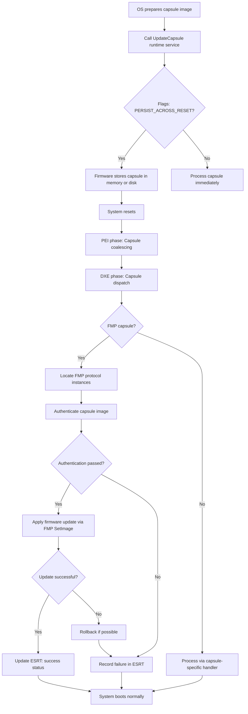

# Chapter 24: Capsule Updates

## Introduction

Firmware updates are among the most critical operations a system can perform. A failed update can render a device permanently inoperable -- a state commonly known as "bricking." The UEFI specification addresses this challenge through the **Capsule Update** mechanism, a standardized way to deliver firmware updates that is both reliable and secure.

Project Mu builds on the UEFI capsule infrastructure with its **FmpDevicePkg** and related packages, providing a robust, tested, and security-hardened firmware update pipeline that integrates seamlessly with operating system update mechanisms such as Windows Update.

This chapter covers the capsule update architecture from the ground up: the binary format, the runtime services involved, the dispatch flow during reboot, the EFI System Resource Table (ESRT) for OS integration, capsule signing and authentication, recovery and rollback strategies, and practical guidance for testing capsule updates in QEMU.

---

## The UEFI Capsule Update Mechanism

### What Is a Capsule?

A capsule is a binary blob delivered to firmware through a well-defined interface. It can contain firmware images, configuration data, or any payload that the platform firmware knows how to process. The UEFI specification defines the capsule format and the runtime services used to submit capsules, but the actual update logic is platform-specific.

### Why Capsules?

Before UEFI capsules, firmware updates were typically performed through vendor-specific tools running in DOS, custom boot environments, or OS-specific utilities. This fragmented landscape created several problems:

- No standardized update interface for operating systems
- No built-in authentication or integrity verification
- No rollback mechanism on failure
- Difficulty integrating with enterprise deployment tools

Capsule updates solve these problems by providing a common interface that any operating system can use, with built-in support for authentication, versioning, and integration with OS update infrastructure.

---

## Capsule Format

### EFI_CAPSULE_HEADER

Every capsule begins with an `EFI_CAPSULE_HEADER` structure:

```c
typedef struct {
    EFI_GUID    CapsuleGuid;
    UINT32      HeaderSize;
    UINT32      Flags;
    UINT32      CapsuleImageSize;
} EFI_CAPSULE_HEADER;
```

**Field descriptions:**

| Field | Description |
|-------|-------------|
| `CapsuleGuid` | Identifies the capsule type and determines how firmware processes it |
| `HeaderSize` | Size of the header in bytes, including any extended header data |
| `Flags` | Bit flags controlling capsule behavior |
| `CapsuleImageSize` | Total size of the capsule including header and payload |

### Capsule Flags

The `Flags` field uses the following bit definitions:

```c
#define CAPSULE_FLAGS_PERSIST_ACROSS_RESET  0x00010000
#define CAPSULE_FLAGS_POPULATE_SYSTEM_TABLE 0x00020000
#define CAPSULE_FLAGS_INITIATE_RESET        0x00040000
```

- **PERSIST_ACROSS_RESET**: The capsule must survive a system reset. Firmware stores the capsule contents (or a pointer to them) so they can be processed after reboot.
- **POPULATE_SYSTEM_TABLE**: After processing, the capsule result is placed in the EFI System Table configuration table so the OS can read the outcome.
- **INITIATE_RESET**: Firmware should trigger a reset after accepting the capsule.

### Firmware Management Protocol Capsule

For firmware updates specifically, the capsule payload follows the **Firmware Management Protocol (FMP)** capsule format. The capsule GUID is set to `EFI_FIRMWARE_MANAGEMENT_CAPSULE_ID_GUID`, and the payload contains:

```c
typedef struct {
    UINT32    Version;
    UINT16    EmbeddedDriverCount;
    UINT16    PayloadItemCount;
    // UINT64 ItemOffsetList[];
} EFI_FIRMWARE_MANAGEMENT_CAPSULE_HEADER;
```

Each payload item is an `EFI_FIRMWARE_MANAGEMENT_CAPSULE_IMAGE_HEADER`:

```c
typedef struct {
    UINT32      Version;
    EFI_GUID    UpdateImageTypeId;
    UINT8       UpdateImageIndex;
    UINT8       reserved_bytes[3];
    UINT32      UpdateImageSize;
    UINT32      UpdateVendorCodeSize;
    UINT64      UpdateHardwareInstance;
    UINT64      ImageCapsuleSupport;
} EFI_FIRMWARE_MANAGEMENT_CAPSULE_IMAGE_HEADER;
```

The `UpdateImageTypeId` GUID identifies which firmware component the image targets (system firmware, microcontroller firmware, option ROM, and so on).

---

## Capsule Update Flow

### High-Level Overview



### Step-by-Step Walkthrough

#### 1. OS Prepares the Capsule

The operating system (or a user-space tool) constructs the capsule binary. On Windows, this is handled by the Windows Update infrastructure. The capsule binary is typically placed on the EFI System Partition (ESP) at a well-known location.

#### 2. UpdateCapsule Runtime Service

The OS calls the `UpdateCapsule()` UEFI runtime service:

```c
EFI_STATUS
EFIAPI
UpdateCapsule (
    IN EFI_CAPSULE_HEADER   **CapsuleHeaderArray,
    IN UINTN                CapsuleCount,
    IN EFI_PHYSICAL_ADDRESS ScatterGatherList OPTIONAL
);
```

**Parameters:**
- `CapsuleHeaderArray`: Array of pointers to capsule headers
- `CapsuleCount`: Number of capsules
- `ScatterGatherList`: Physical addresses for capsule data that must persist across reset

The companion service `QueryCapsuleCapabilities()` allows the OS to check whether the platform supports a given capsule type and what resources are needed.

#### 3. Persist Across Reset

When `CAPSULE_FLAGS_PERSIST_ACROSS_RESET` is set, firmware must preserve the capsule data through a system reset. Two common approaches exist:

- **Memory-based**: The capsule data remains in physical memory, and firmware stores the scatter-gather list address in a UEFI variable so PEI can find it after reset.
- **Disk-based**: The capsule is written to persistent storage (ESP or a dedicated partition), and firmware reads it back after reset.

Project Mu primarily uses the memory-based approach, leveraging the `CapsuleOnDisk` feature as an alternative for systems where memory preservation is unreliable.

#### 4. PEI Phase: Capsule Coalescing

After reset, the PEI phase detects pending capsules by checking for the capsule variable. The **CapsuleCoalescing** PEIM gathers scattered capsule fragments from physical memory and assembles them into contiguous buffers. This process is necessary because the OS may have placed capsule data in non-contiguous physical pages.

#### 5. DXE Phase: Capsule Dispatch

During DXE, the **CapsuleDxe** driver processes coalesced capsules:

1. Parses each capsule header
2. Identifies the capsule type by GUID
3. For FMP capsules, locates all installed FMP protocol instances
4. Matches the capsule `UpdateImageTypeId` to the appropriate FMP instance
5. Calls `SetImage()` on the matched FMP instance

#### 6. Authentication and Application

Before applying the image, the FMP driver verifies the capsule signature. If authentication fails, the update is rejected and an error status is recorded. On success, the new firmware image is written to the target storage (SPI flash, eMMC, or other non-volatile storage).

---

## EFI System Resource Table (ESRT)

### Purpose

The **ESRT** is the bridge between firmware update capabilities and operating system update infrastructure. It provides the OS with a list of updatable firmware components, their current versions, and the status of the last update attempt.

### ESRT Structure

```c
typedef struct {
    UINT32                      FwResourceCount;
    UINT32                      FwResourceCountMax;
    UINT64                      FwResourceVersion;
    // EFI_SYSTEM_RESOURCE_ENTRY  Entries[];
} EFI_SYSTEM_RESOURCE_TABLE;

typedef struct {
    EFI_GUID    FwClass;
    UINT32      FwType;
    UINT32      FwVersion;
    UINT32      LowestSupportedFwVersion;
    UINT32      CapsuleFlags;
    UINT32      LastAttemptVersion;
    UINT32      LastAttemptStatus;
} EFI_SYSTEM_RESOURCE_ENTRY;
```

### Key Fields

| Field | Description |
|-------|-------------|
| `FwClass` | GUID identifying the firmware component |
| `FwType` | System firmware (1), device firmware (2), or UEFI driver (3) |
| `FwVersion` | Current installed firmware version |
| `LowestSupportedFwVersion` | Anti-rollback: minimum version that can be installed |
| `LastAttemptVersion` | Version of the last attempted update |
| `LastAttemptStatus` | Result code of the last update attempt |

### Windows Update Integration

Windows uses the ESRT to:

1. **Discover updatable components**: Windows reads the ESRT at boot and registers each entry as a device in Device Manager
2. **Match driver packages**: Each `FwClass` GUID maps to a driver package on Windows Update that contains the capsule binary
3. **Deliver updates**: Windows downloads the capsule, invokes `UpdateCapsule()`, and triggers a reboot
4. **Report results**: After reboot, Windows reads the `LastAttemptStatus` to determine success or failure

The `LastAttemptStatus` values include:

| Value | Meaning |
|-------|---------|
| 0x00000000 | Success |
| 0x00000001 | Error: unsuccessful |
| 0x00000002 | Error: insufficient resources |
| 0x00000003 | Error: incorrect version |
| 0x00000004 | Error: invalid format |
| 0x00000005 | Error: authentication error |
| 0x00000006 | Error: power event (AC not connected) |
| 0x00000007 | Error: power event (insufficient battery) |

---

## Project Mu's FmpDevicePkg

### Architecture

Project Mu provides the **FmpDevicePkg** package, which implements the Firmware Management Protocol infrastructure. The architecture separates the common FMP logic from platform-specific device access:

```
FmpDevicePkg/
  FmpDxe/                      # Core FMP DXE driver
  Library/
    FmpDeviceLib/               # NULL library instance (template)
    FmpDependencyLib/           # Capsule dependency evaluation
    FmpDependencyCheckLib/      # Dependency checking logic
    CapsuleUpdatePolicyLib/     # Update policy decisions
  Include/
    Library/
      FmpDeviceLib.h            # Library class for device-specific operations
      FmpDependencyLib.h        # Dependency expression support
      CapsuleUpdatePolicyLib.h  # Policy interface
```

### FmpDeviceLib

The key abstraction is `FmpDeviceLib`, which platform code implements to provide device-specific operations:

```c
// Get the current firmware version
EFI_STATUS
EFIAPI
FmpDeviceGetVersion (
    OUT UINT32  *Version
);

// Get the current firmware image
EFI_STATUS
EFIAPI
FmpDeviceGetImage (
    OUT VOID    *Image,
    IN OUT UINTN *ImageSize
);

// Write a new firmware image
EFI_STATUS
EFIAPI
FmpDeviceSetImage (
    IN CONST VOID   *Image,
    IN UINTN        ImageSize,
    IN CONST VOID   *VendorCode       OPTIONAL,
    IN EFI_FIRMWARE_MANAGEMENT_UPDATE_IMAGE_PROGRESS Progress OPTIONAL,
    OUT CHAR16      **AbortReason      OPTIONAL
);

// Check if an image is valid before applying
EFI_STATUS
EFIAPI
FmpDeviceCheckImage (
    IN CONST VOID   *Image,
    IN UINTN        ImageSize,
    OUT UINT32      *ImageUpdatable
);
```

### Creating a Platform FMP Driver

To add capsule update support for your platform:

1. **Create a FmpDeviceLib instance** that implements the required functions for your specific flash device
2. **Define the firmware class GUID** that identifies your firmware component
3. **Configure the FmpDxe driver** in your platform DSC file:

```ini
[LibraryClasses]
    FmpDeviceLib|MyPlatformPkg/Library/FmpDeviceLibSpiFlash/FmpDeviceLibSpiFlash.inf
    FmpAuthenticationLib|SecurityPkg/Library/FmpAuthenticationLibPkcs7/FmpAuthenticationLibPkcs7.inf
    CapsuleUpdatePolicyLib|FmpDevicePkg/Library/CapsuleUpdatePolicyLibOnProtocol/CapsuleUpdatePolicyLibOnProtocol.inf

[Components]
    FmpDevicePkg/FmpDxe/FmpDxe.inf {
        <PcdsFixedAtBuild>
            gFmpDevicePkgTokenSpaceGuid.PcdFmpDeviceImageIdName|L"System Firmware"
            gFmpDevicePkgTokenSpaceGuid.PcdFmpDeviceImageTypeIdGuid|{GUID("12345678-ABCD-EF01-2345-6789ABCDEF01")}
        <LibraryClasses>
            FmpDeviceLib|MyPlatformPkg/Library/FmpDeviceLibSpiFlash/FmpDeviceLibSpiFlash.inf
    }
```

4. **Add ESRT support** by including the ESRT DXE driver in your platform FDF:

```ini
INF MdeModulePkg/Universal/EsrtDxe/EsrtDxe.inf
INF FmpDevicePkg/FmpDxe/FmpDxe.inf
```

---

## Capsule Signing and Authentication

### Why Sign Capsules?

Unsigned firmware updates are a critical security vulnerability. An attacker who can deliver arbitrary firmware gains persistent, pre-OS control of the system. Capsule signing ensures:

- **Authenticity**: The update comes from the legitimate firmware vendor
- **Integrity**: The capsule has not been modified in transit
- **Anti-rollback**: Combined with `LowestSupportedFwVersion`, prevents downgrade attacks

### PKCS#7 Authentication

Project Mu uses PKCS#7 (CMS) signatures for capsule authentication. The authentication flow:

1. The capsule image includes an `EFI_FIRMWARE_IMAGE_AUTHENTICATION` header:

```c
typedef struct {
    UINT64                          MonotonicCount;
    WIN_CERTIFICATE_UEFI_GUID       AuthInfo;
} EFI_FIRMWARE_IMAGE_AUTHENTICATION;
```

2. The `AuthInfo` field contains a PKCS#7 detached signature
3. Firmware verifies the signature against a trusted certificate stored in the `db` (signature database) or a dedicated capsule trust store
4. The `MonotonicCount` provides replay protection

### Generating Signing Keys

```bash
# Generate a self-signed certificate for development
openssl req -x509 -newkey rsa:2048 -keyout capsule_key.pem \
    -out capsule_cert.pem -days 365 -nodes \
    -subj "/CN=Firmware Update Signing Key"

# Convert to DER format for firmware enrollment
openssl x509 -in capsule_cert.pem -outform DER -out capsule_cert.der
```

### Signing a Capsule

Project Mu provides tooling to sign capsules during the build process. The `GenerateCapsule` tool from BaseTools handles this:

```bash
# Generate a signed capsule
GenerateCapsule \
    --encode \
    --fw-version 0x00000002 \
    --lsv 0x00000001 \
    --guid 12345678-ABCD-EF01-2345-6789ABCDEF01 \
    --signer-private-cert capsule_key.pem \
    --other-public-cert capsule_cert.pem \
    --trusted-public-cert capsule_cert.pem \
    -o signed_capsule.cap \
    firmware_image.bin
```

---

## Recovery and Rollback Mechanisms

### The Problem

Firmware updates modify the very code responsible for booting the system. If an update is interrupted (power loss, flash write error) or the new firmware is defective, the system may fail to boot.

### A/B Update Strategy

The most robust approach uses two firmware slots:

```
+---------------------+
|  SPI Flash Layout   |
+---------------------+
| Boot ROM (fixed)    |
+---------------------+
| Slot A (active)     |
+---------------------+
| Slot B (standby)    |
+---------------------+
| Shared Data         |
+---------------------+
```

1. The update is written to the inactive slot
2. A boot flag is set to try the new slot on next boot
3. If the new firmware boots successfully and passes validation, it becomes the active slot
4. If it fails, the boot ROM falls back to the previous active slot

### Watchdog-Based Recovery

For single-slot systems:

1. Before writing the update, set a hardware watchdog timer
2. Write the new firmware
3. On successful boot, clear the watchdog
4. If the new firmware fails to boot, the watchdog triggers a reset
5. On the reset, firmware detects the watchdog event and enters recovery mode
6. Recovery mode loads firmware from a backup location (recovery partition, USB drive, or network)

### Project Mu's Approach

Project Mu implements several recovery features:

- **LastAttemptStatus tracking**: Records the result of every update attempt for OS-level reporting
- **LowestSupportedFwVersion**: Prevents rollback to known-vulnerable firmware versions
- **Capsule dependency expressions**: Ensures prerequisites are met before applying an update
- **FmpDeviceCheckImage**: Validates the image before writing, catching format errors early

---

## Testing Capsule Updates in QEMU

### Setting Up the Test Environment

QEMU provides an excellent environment for testing capsule updates without risking physical hardware. The key is configuring QEMU with a writable flash device:

```bash
# Create a QEMU flash image from your build output
cp Build/QemuQ35Pkg/DEBUG_GCC5/FV/QEMU_EFI.fd flash.img

# Create a variable store
truncate -s 256K OVMF_VARS.fd

# Create an ESP image for capsule delivery
dd if=/dev/zero of=esp.img bs=1M count=64
mkfs.vfat esp.img
```

### Delivering a Capsule via ESP

```bash
# Mount the ESP and place the capsule
mkdir -p /tmp/esp_mount
sudo mount -o loop esp.img /tmp/esp_mount
sudo mkdir -p /tmp/esp_mount/EFI/UpdateCapsule
sudo cp signed_capsule.cap /tmp/esp_mount/EFI/UpdateCapsule/
sudo umount /tmp/esp_mount
```

### Running QEMU with Capsule Support

```bash
qemu-system-x86_64 \
    -machine q35,smm=on \
    -drive if=pflash,format=raw,unit=0,file=flash.img \
    -drive if=pflash,format=raw,unit=1,file=OVMF_VARS.fd \
    -drive file=esp.img,format=raw,if=virtio \
    -m 2048 \
    -serial stdio \
    -display none
```

### Automated Testing Script

```python
#!/usr/bin/env python3
"""Automated capsule update test for QEMU."""

import subprocess
import sys
import time

QEMU_CMD = [
    "qemu-system-x86_64",
    "-machine", "q35,smm=on",
    "-drive", "if=pflash,format=raw,unit=0,file=flash.img",
    "-drive", "if=pflash,format=raw,unit=1,file=OVMF_VARS.fd",
    "-drive", "file=esp.img,format=raw,if=virtio",
    "-m", "2048",
    "-serial", "stdio",
    "-display", "none",
    "-monitor", "telnet:127.0.0.1:5555,server,nowait",
]

def run_capsule_test():
    """Run QEMU and verify capsule update processing."""
    proc = subprocess.Popen(
        QEMU_CMD,
        stdout=subprocess.PIPE,
        stderr=subprocess.PIPE,
        text=True,
    )

    capsule_processed = False
    timeout = time.time() + 120  # 2-minute timeout

    for line in iter(proc.stdout.readline, ''):
        print(line, end='')
        if "Capsule Update Success" in line:
            capsule_processed = True
            break
        if time.time() > timeout:
            print("ERROR: Timeout waiting for capsule processing")
            proc.terminate()
            return False

    proc.terminate()
    return capsule_processed

if __name__ == "__main__":
    success = run_capsule_test()
    sys.exit(0 if success else 1)
```

### Verifying the Update

After the capsule is processed and the system reboots, verify the update by:

1. **Checking the ESRT**: Use the UEFI shell or an OS tool to read the ESRT and confirm `LastAttemptStatus` is 0 (success)
2. **Checking the firmware version**: Verify the `FwVersion` field matches the new version
3. **Checking debug logs**: Review serial output for capsule processing messages

```
# Example serial output during successful capsule processing
CapsuleOnDiskLoad: Found capsule file \EFI\UpdateCapsule\signed_capsule.cap
ProcessCapsuleImage: Processing capsule 12345678-ABCD-EF01-2345-6789ABCDEF01
FmpSetImage: Authentication successful
FmpSetImage: Writing image to flash...
FmpSetImage: Update successful, new version = 0x00000002
EsrtDxe: Updated ESRT entry, LastAttemptStatus = Success
```

---

## Common Pitfalls and Debugging Tips

### Capsule Not Found After Reboot

- Verify the scatter-gather list variable is correctly written
- Check that physical memory containing the capsule is not reclaimed during reset
- For CapsuleOnDisk, ensure the ESP is accessible during early boot

### Authentication Failures

- Confirm the signing certificate matches the one enrolled in firmware
- Verify the capsule was signed with the correct GUID and version
- Check that the `MonotonicCount` has not been used before

### ESRT Not Visible to OS

- Ensure the ESRT DXE driver is included in the platform build
- Verify the FMP driver is producing valid FMP protocol instances
- On Linux, check `/sys/firmware/efi/esrt/entries/`
- On Windows, check Device Manager under "Firmware"

### Version Rollback Rejected

- The `LowestSupportedFwVersion` is enforced by FMP
- To update this threshold, the new capsule must set a version equal to or greater than the current LSV
- During development, you can set `PcdFmpDeviceBuildTimeLowestSupportedVersion` to 0

---

## Summary

Capsule updates provide a standardized, secure, and reliable mechanism for delivering firmware updates through the operating system. The UEFI specification defines the capsule format and runtime services, while Project Mu's FmpDevicePkg provides a practical, production-ready implementation.

Key takeaways:

- **EFI_CAPSULE_HEADER** is the fundamental capsule format, with FMP capsules used for firmware updates
- **UpdateCapsule()** is the runtime service that initiates the update process
- **ESRT** enables seamless OS integration, allowing Windows Update to discover and deliver firmware updates
- **PKCS#7 signing** provides authentication and integrity protection
- **Recovery mechanisms** (A/B slots, watchdog recovery) protect against bricking
- **QEMU testing** allows safe development and validation of capsule update flows

In the next chapter, we explore DFCI (Device Firmware Configuration Interface), which extends firmware management beyond updates to include remote configuration of device settings.

---

[Next: Chapter 25 - DFCI]({{ site.baseurl }}/part5/dfci/){: .btn .btn-primary .fs-5 .mb-4 .mb-md-0 .mr-2 }
[Previous: Chapter 23 - ACPI Integration]({{ site.baseurl }}/part5/acpi/){: .btn .fs-5 .mb-4 .mb-md-0 }
