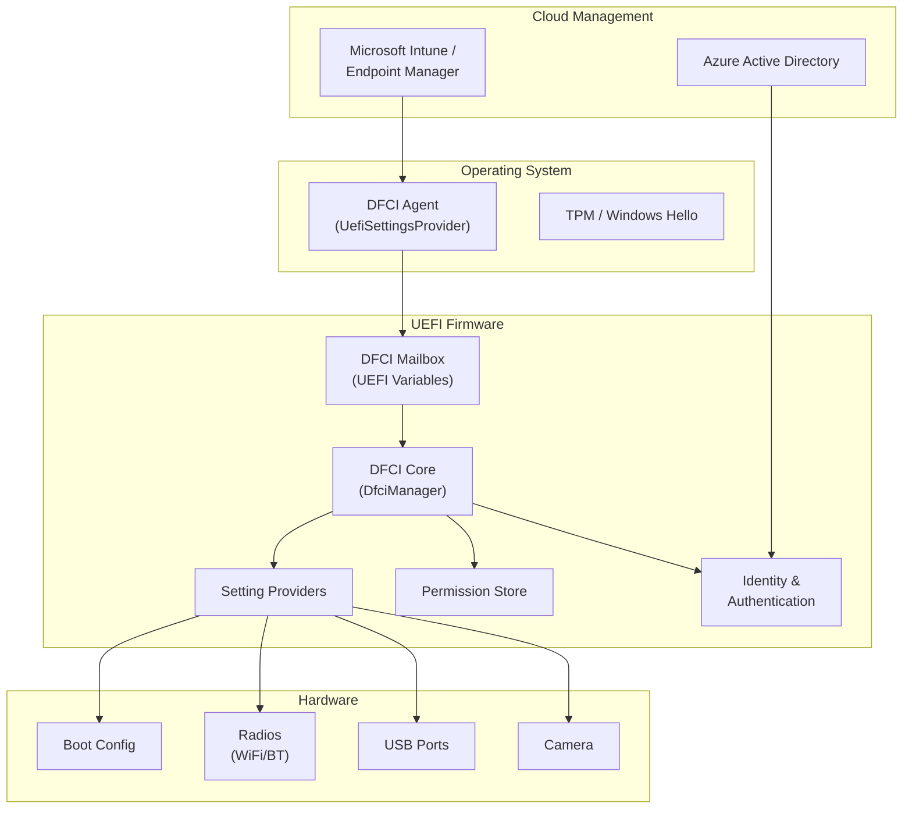
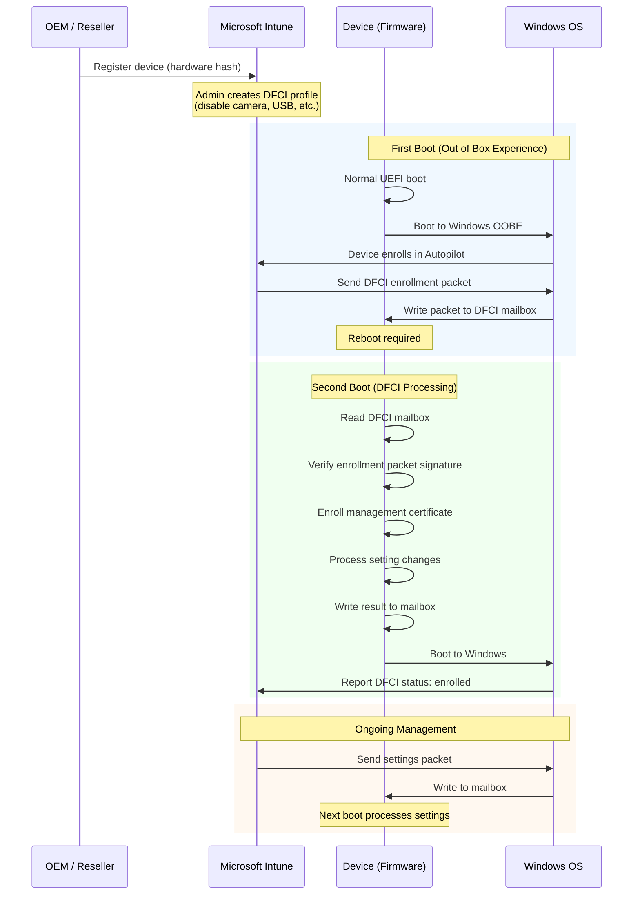
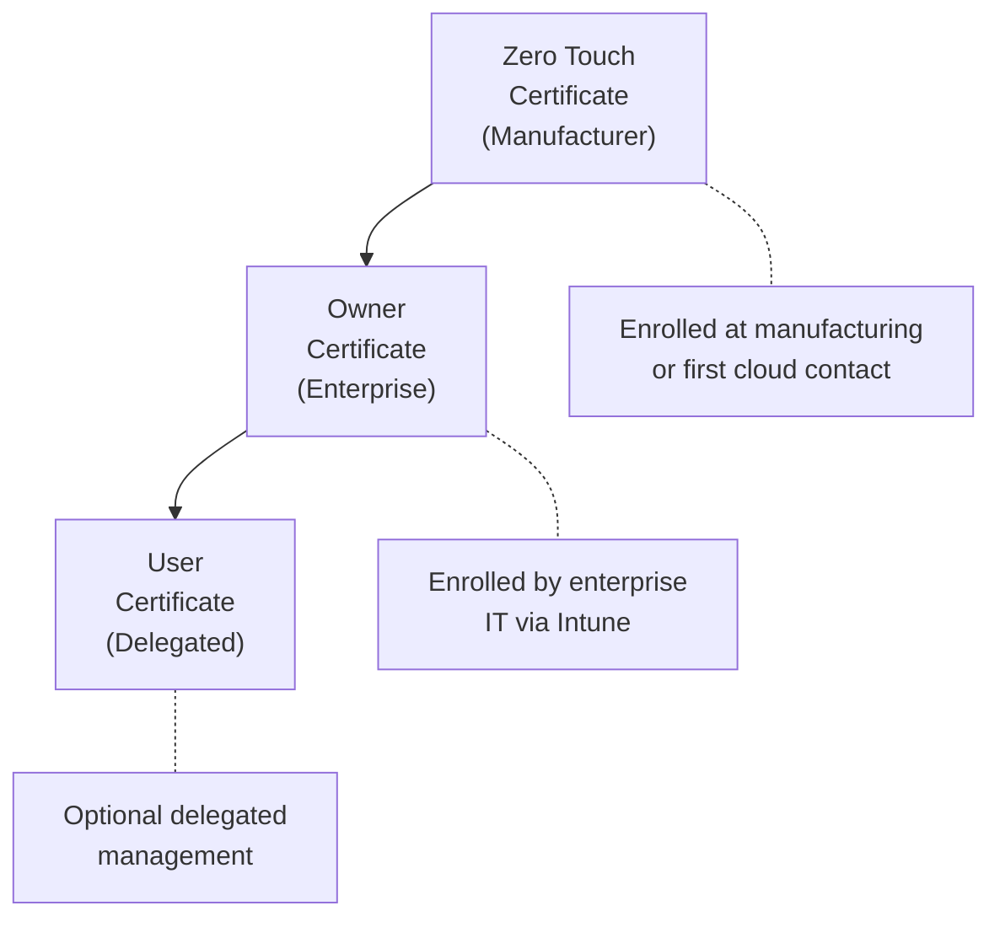
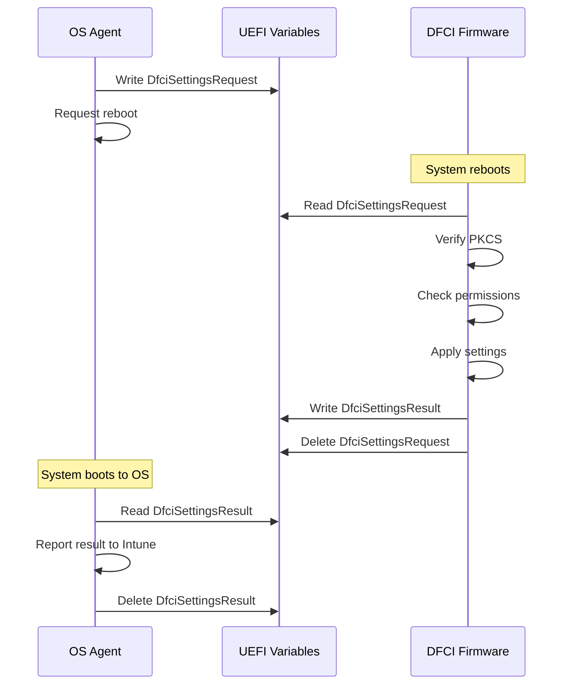

# Chapter 25: Device Firmware Configuration Interface (DFCI)

## Introduction

Managing firmware settings on a single machine is straightforward -- open the BIOS setup menu, change a setting, save, and reboot. But what happens when you need to manage firmware settings across thousands of devices in an enterprise fleet? Walking up to each machine is not feasible. Distributing USB drives with configuration payloads does not scale. And traditional remote management tools cannot reach firmware settings because they operate above the OS layer.

**DFCI (Device Firmware Configuration Interface)** solves this problem. Developed as part of Project Mu, DFCI enables cloud-based, zero-touch management of firmware settings on UEFI devices. It allows IT administrators to configure settings like camera access, USB ports, boot device order, and boot from external media -- all through a cloud management console such as Microsoft Intune, without ever physically touching the device.

---

## Why DFCI?

### The Enterprise Problem

Modern enterprises face several firmware management challenges:

- **Scale**: Managing firmware configuration on tens of thousands of devices
- **Security**: Ensuring users cannot override enterprise security policies at the firmware level
- **Compliance**: Proving that devices meet regulatory requirements for hardware feature access
- **Zero-touch deployment**: Configuring devices before an employee first opens the box
- **Remote workforce**: Managing devices that never visit the corporate network

### Traditional Approaches and Their Limitations

| Approach | Limitation |
|----------|-----------|
| BIOS passwords | Easily bypassed; password distribution is a security risk |
| USB provisioning | Requires physical access; does not scale |
| Custom BIOS builds | Vendor lock-in; slow update cycle |
| AMT/Intel vPro | Hardware-specific; requires network infrastructure |
| WMI-BIOS interfaces | Vendor-specific; no standard interface |

DFCI provides a vendor-neutral, cloud-native solution that works with the existing UEFI firmware infrastructure.

---

## DFCI Architecture

### Component Overview



### Key Components

**Cloud Management Console**: Microsoft Intune (or another MDM solution) serves as the control plane. Administrators define firmware policies in the console, and these are delivered to devices as signed DFCI packets.

**DFCI Agent (OS-side)**: A component running in the OS that receives DFCI packets from the MDM and writes them to UEFI variables (the "mailbox"). On Windows, this is the `UefiSettingsProvider` CSP (Configuration Service Provider).

**DFCI Mailbox**: A set of UEFI variables that serve as the communication channel between the OS agent and firmware. The OS writes incoming packets, and firmware reads and processes them on the next boot.

**DFCI Core (DfciManager)**: The firmware-side engine that processes DFCI packets, verifies signatures, checks permissions, and applies settings.

**Setting Providers**: Modular firmware components that implement access to specific settings (camera enable/disable, USB port control, and others).

**Identity and Authentication**: Certificate-based authentication that verifies the authority of incoming packets.

**Permission Store**: Tracks which identity has permission to modify which settings.

---

## Zero-Touch Provisioning Flow

DFCI's most powerful feature is zero-touch provisioning -- the ability to configure firmware settings on a device before an employee first uses it.



### Enrollment Steps in Detail

1. **Device Registration**: The OEM or reseller registers device hardware hashes with Microsoft Intune through Windows Autopilot
2. **Profile Assignment**: An IT administrator creates a DFCI profile specifying which settings to manage and their values
3. **First Boot**: The device boots to Windows OOBE and enrolls with Intune through Autopilot
4. **Enrollment Packet Delivery**: Intune sends a DFCI enrollment packet containing the management certificate and initial settings
5. **Mailbox Write**: The OS-side agent writes the packet to UEFI variables
6. **Firmware Processing**: On the next boot, DFCI firmware reads the mailbox, verifies the packet signature, enrolls the management certificate, and applies settings
7. **Result Reporting**: Firmware writes results back to the mailbox; the OS reads and reports them to Intune

---

## Settings Management

### Supported Settings Categories

DFCI defines settings using string identifiers. Standard settings include:

| Setting ID | Description | Values |
|-----------|-------------|--------|
| `Dfci.OnboardCameras.Enable` | Built-in camera access | Enabled / Disabled |
| `Dfci.OnboardAudio.Enable` | Built-in microphone and speakers | Enabled / Disabled |
| `Dfci.OnboardRadios.Enable` | WiFi and Bluetooth radios | Enabled / Disabled |
| `Dfci.BootExternalMedia.Enable` | Boot from USB/external devices | Enabled / Disabled |
| `Dfci.BootOnboardNetwork.Enable` | PXE / network boot | Enabled / Disabled |
| `Dfci.Cpu.Microcode.Enable` | CPU microcode updates | Enabled / Disabled |
| `Dfci.Tpm.Enable` | TPM device | Enabled / Disabled |

### Implementing a Setting Provider

Setting providers are UEFI drivers that register with the DFCI infrastructure to handle specific settings. Here is a simplified example:

```c
#include <DfciSystemSettingTypes.h>
#include <Protocol/DfciSettingAccess.h>

// Setting provider for camera control
EFI_STATUS
EFIAPI
CameraSettingGet (
    IN  CONST DFCI_SETTING_PROVIDER  *This,
    IN  OUT   UINTN                  *ValueSize,
    OUT       VOID                   *Value
)
{
    BOOLEAN  CameraEnabled;

    // Read current camera state from platform hardware/configuration
    CameraEnabled = PlatformGetCameraState();

    if (*ValueSize < sizeof(UINT8)) {
        *ValueSize = sizeof(UINT8);
        return EFI_BUFFER_TOO_SMALL;
    }

    *((UINT8 *)Value) = CameraEnabled ? 1 : 0;
    *ValueSize = sizeof(UINT8);
    return EFI_SUCCESS;
}

EFI_STATUS
EFIAPI
CameraSettingSet (
    IN  CONST DFCI_SETTING_PROVIDER  *This,
    IN        UINTN                  ValueSize,
    IN  CONST VOID                   *Value,
    OUT       DFCI_SETTING_FLAGS     *Flags
)
{
    UINT8  NewValue;

    if (ValueSize != sizeof(UINT8)) {
        return EFI_INVALID_PARAMETER;
    }

    NewValue = *((UINT8 *)Value);

    // Apply camera setting to platform hardware
    PlatformSetCameraState(NewValue != 0);

    *Flags = DFCI_SETTING_FLAGS_OUT_REBOOT_REQUIRED;
    return EFI_SUCCESS;
}

EFI_STATUS
EFIAPI
CameraSettingDefault (
    IN  CONST DFCI_SETTING_PROVIDER  *This,
    IN  OUT   UINTN                  *ValueSize,
    OUT       VOID                   *Value
)
{
    if (*ValueSize < sizeof(UINT8)) {
        *ValueSize = sizeof(UINT8);
        return EFI_BUFFER_TOO_SMALL;
    }

    // Default: camera enabled
    *((UINT8 *)Value) = 1;
    *ValueSize = sizeof(UINT8);
    return EFI_SUCCESS;
}

// Register the setting provider during driver initialization
DFCI_SETTING_PROVIDER  mCameraProvider = {
    .Id            = "Dfci.OnboardCameras.Enable",
    .Type          = DFCI_SETTING_TYPE_ENABLE,
    .GetDefault    = CameraSettingDefault,
    .Get           = CameraSettingGet,
    .Set           = CameraSettingSet,
};

EFI_STATUS
EFIAPI
CameraSettingProviderInit (
    IN EFI_HANDLE        ImageHandle,
    IN EFI_SYSTEM_TABLE  *SystemTable
)
{
    return DfciRegisterProvider(&mCameraProvider);
}
```

### Group Settings

DFCI supports group settings that control multiple individual settings at once. For example, the `Dfci.AllCameras.Enable` group setting controls both `Dfci.OnboardCameras.Enable` and any external camera settings. This simplifies policy management for administrators who want to apply broad restrictions.

---

## Certificate-Based Authentication Chain

### Trust Model

DFCI uses a hierarchical certificate chain to authenticate management operations:



### Certificate Roles

**Zero-Touch Certificate (ZTP / ZTPM)**: The root of trust, typically provisioned by the OEM or through the cloud enrollment process. This certificate authorizes the enrollment of the Owner certificate.

**Owner Certificate**: Represents the enterprise that owns the device. The Owner has the highest level of management authority and can:
- Modify any DFCI-managed setting
- Set permissions for other identities
- Enroll or unenroll the User certificate
- Unenroll DFCI entirely (returning the device to unmanaged state)

**User Certificate**: An optional delegated identity with limited permissions. The Owner determines which settings the User identity can access.

### Packet Signing

Every DFCI packet is signed using PKCS#7 with the appropriate certificate:

```
+---------------------------+
| DFCI Packet               |
+---------------------------+
| Header                    |
|   - Session ID            |
|   - Packet Type           |
|   - Version               |
+---------------------------+
| Payload                   |
|   - Settings / Permissions|
|   - Certificate data      |
+---------------------------+
| PKCS#7 Signature          |
|   - Signed by Owner or    |
|     ZTP certificate       |
+---------------------------+
```

Firmware verifies the signature before processing any packet. If verification fails, the packet is rejected and an error is recorded in the result mailbox.

---

## Permission Model

### Three Identity Levels

DFCI defines three identity levels, each with different capabilities:

| Identity | Authority Level | Typical Use |
|----------|----------------|-------------|
| **Owner** | Highest | Enterprise IT management |
| **User** | Delegated | Departmental or role-based management |
| **Local** | Lowest | End-user via BIOS setup UI |

### Permission Enforcement

Each setting has a permission entry that determines which identities can read or write it:

```c
typedef struct {
    DFCI_SETTING_ID_STRING  SettingId;
    DFCI_PERMISSION_MASK    PMask;      // Who can modify
    DFCI_PERMISSION_MASK    DMask;      // Delegated permissions
} DFCI_PERMISSION_ENTRY;
```

Permission masks use bit flags:

```c
#define DFCI_PERMISSION_LOCAL   0x01    // Local user (BIOS UI)
#define DFCI_PERMISSION_USER    0x02    // User certificate
#define DFCI_PERMISSION_OWNER   0x04    // Owner certificate
```

### Permission Scenarios

**Scenario 1: Lock Down Camera**

The IT administrator sends a settings packet (signed with Owner certificate) that:
1. Sets `Dfci.OnboardCameras.Enable` to `Disabled`
2. Sets the permission for `Dfci.OnboardCameras.Enable` to `Owner` only

Result: The camera is disabled, and neither the local user (through BIOS setup) nor the User identity can re-enable it. Only a new Owner-signed packet can change the setting.

**Scenario 2: Delegate USB Management**

The IT administrator:
1. Sets `Dfci.Usb.Enable` permission mask to `Owner | User`
2. Enrolls a User certificate for the regional IT team

Result: Both the Owner (central IT) and the User (regional IT) can manage USB port settings, but the local user at the keyboard cannot.

**Scenario 3: Allow Local Boot Order Changes**

The IT administrator:
1. Sets `Dfci.BootOrder` permission mask to `Owner | User | Local`

Result: Anyone, including the end user through the BIOS setup menu, can change the boot order.

---

## Integration with Microsoft Intune

### Intune Configuration Profile

In Microsoft Intune (Endpoint Manager), DFCI is configured through a device configuration profile:

1. Navigate to **Devices > Configuration profiles > Create profile**
2. Select **Windows 10 and later** as the platform
3. Select **Templates > Device Firmware Configuration Interface** as the profile type
4. Configure settings:

| Setting | Options |
|---------|---------|
| Allow local user to change UEFI settings | None / Not configured |
| CPU and IO virtualization | Enabled / Disabled |
| Cameras | Enabled / Disabled |
| Microphones and speakers | Enabled / Disabled |
| Radios (Bluetooth, Wi-Fi, etc.) | Enabled / Disabled |
| Boot from external media | Enabled / Disabled |
| Boot from network adapters | Enabled / Disabled |

5. Assign the profile to a device group
6. Devices receive the policy at next Intune sync and apply it at next reboot

### Intune Reporting

Intune provides reporting on DFCI status:

- **Enrollment status**: Whether DFCI is enrolled on each device
- **Setting compliance**: Whether each device matches the assigned policy
- **Error reporting**: Details on any failed DFCI operations

### Autopilot Integration

DFCI works best with Windows Autopilot for zero-touch scenarios:

1. OEM registers device hardware hashes in Intune
2. Admin assigns both an Autopilot profile and a DFCI profile to the device
3. On first boot, the device enrolls in Autopilot, receives the DFCI enrollment packet, and applies firmware settings
4. The user receives a fully configured device with firmware-level security policies already enforced

---

## Implementing DFCI in a Platform

### Required Packages

To add DFCI support to a Project Mu platform, include these packages:

```
DfciPkg                  # Core DFCI infrastructure
ZeroTouchPkg             # Zero-touch provisioning support
```

### Platform DSC Configuration

```ini
[LibraryClasses]
    DfciSettingPermissionLib|DfciPkg/Library/DfciSettingPermissionLib/DfciSettingPermissionLib.inf
    DfciDeviceIdSupportLib|MyPlatformPkg/Library/DfciDeviceIdSupportLib/DfciDeviceIdSupportLib.inf
    DfciGroupLib|DfciPkg/Library/DfciGroupLibNull/DfciGroupLibNull.inf
    DfciUiSupportLib|DfciPkg/Library/DfciUiSupportLibNull/DfciUiSupportLibNull.inf

[Components]
    DfciPkg/SettingsManager/SettingsManagerDxe.inf
    DfciPkg/IdentityAndAuthManager/IdentityAndAuthManagerDxe.inf
    DfciPkg/DfciManager/DfciManager.inf
    ZeroTouchPkg/ZeroTouchSettingsDxe/ZeroTouchSettingsDxe.inf
```

### DfciDeviceIdSupportLib

Each platform must implement `DfciDeviceIdSupportLib` to provide device identity information:

```c
EFI_STATUS
EFIAPI
DfciIdSupportGetManufacturer (
    OUT CHAR8  **Manufacturer,
    OUT UINTN  *ManufacturerSize
)
{
    *Manufacturer = AllocateCopyPool(
        sizeof("Contoso"),
        "Contoso"
    );
    *ManufacturerSize = sizeof("Contoso");
    return EFI_SUCCESS;
}

EFI_STATUS
EFIAPI
DfciIdSupportGetProductName (
    OUT CHAR8  **ProductName,
    OUT UINTN  *ProductNameSize
)
{
    *ProductName = AllocateCopyPool(
        sizeof("ContosoLaptop-X1"),
        "ContosoLaptop-X1"
    );
    *ProductNameSize = sizeof("ContosoLaptop-X1");
    return EFI_SUCCESS;
}

EFI_STATUS
EFIAPI
DfciIdSupportGetSerialNumber (
    OUT CHAR8  **SerialNumber,
    OUT UINTN  *SerialNumberSize
)
{
    // Read serial number from platform-specific source
    // (SMBIOS, EEPROM, fuse, etc.)
    return PlatformGetSerialNumber(SerialNumber, SerialNumberSize);
}
```

---

## Mailbox Communication

### How the Mailbox Works

The DFCI mailbox is a set of UEFI variables used for bidirectional communication between the OS and firmware:

| Variable | Direction | Purpose |
|----------|-----------|---------|
| `DfciSettingsRequest` | OS to FW | Incoming settings packet |
| `DfciSettingsResult` | FW to OS | Processing result |
| `DfciPermissionsRequest` | OS to FW | Incoming permissions packet |
| `DfciPermissionsResult` | FW to OS | Processing result |
| `DfciIdentityRequest` | OS to FW | Enrollment/unenrollment packet |
| `DfciIdentityResult` | FW to OS | Processing result |

### Processing Sequence



### Packet Format

DFCI packets use an XML-based format for settings:

```xml
<?xml version="1.0" encoding="utf-8"?>
<DfciSettingsPacket xmlns="urn:uefi-dfci:settings:1.0">
    <Version>2</Version>
    <LSV>2</LSV>
    <Settings>
        <Setting>
            <Id>Dfci.OnboardCameras.Enable</Id>
            <Value>Disabled</Value>
        </Setting>
        <Setting>
            <Id>Dfci.BootExternalMedia.Enable</Id>
            <Value>Disabled</Value>
        </Setting>
    </Settings>
</DfciSettingsPacket>
```

The XML payload is wrapped in a signed envelope before being written to the mailbox variable.

---

## Security Considerations

### Threat Model

DFCI is designed to resist the following threats:

- **Unauthorized setting changes**: Only holders of the appropriate certificate can modify settings
- **Replay attacks**: Each packet includes a session ID and lowest supported version (LSV) to prevent replaying old packets
- **Tampering**: PKCS#7 signatures ensure packet integrity
- **Privilege escalation**: The permission model prevents lower-privilege identities from modifying settings beyond their authority
- **Unenrollment attacks**: Unenrollment requires a signed packet from the Owner or ZTP certificate

### Best Practices

1. **Protect the Owner private key**: Store it in an HSM or secure key vault; never on individual devices
2. **Use the LSV**: Increment the Lowest Supported Version with each packet to prevent rollback of settings
3. **Audit regularly**: Review Intune DFCI reports to detect non-compliant devices
4. **Test before deployment**: Validate DFCI profiles on test devices before deploying to the fleet
5. **Plan for recovery**: Document the unenrollment procedure in case a device needs to be repurposed

---

## Summary

DFCI transforms firmware configuration from a manual, device-by-device process into a scalable, cloud-managed operation. By integrating with Microsoft Intune and the UEFI firmware stack, DFCI enables enterprises to enforce firmware-level security policies across their entire device fleet.

Key takeaways:

- **DFCI enables cloud-based firmware settings management** through Microsoft Intune and other MDM solutions
- **Zero-touch provisioning** allows devices to be configured before first use
- **Certificate-based authentication** with Owner/User/Local hierarchy provides fine-grained access control
- **The mailbox mechanism** uses UEFI variables for OS-firmware communication
- **Setting providers** are modular firmware components that map DFCI settings to hardware control
- **Permission model** allows enterprises to lock down specific settings while leaving others user-configurable

In the next chapter, we explore Rust in firmware development -- how Project Mu is bringing memory-safe programming to the UEFI ecosystem.

---

[Next: Chapter 26 - Rust in Firmware](/part5/rust-firmware/){: .btn .btn-primary .fs-5 .mb-4 .mb-md-0 .mr-2 }
[Previous: Chapter 24 - Capsule Updates](/part5/capsule-updates/){: .btn .fs-5 .mb-4 .mb-md-0 }
