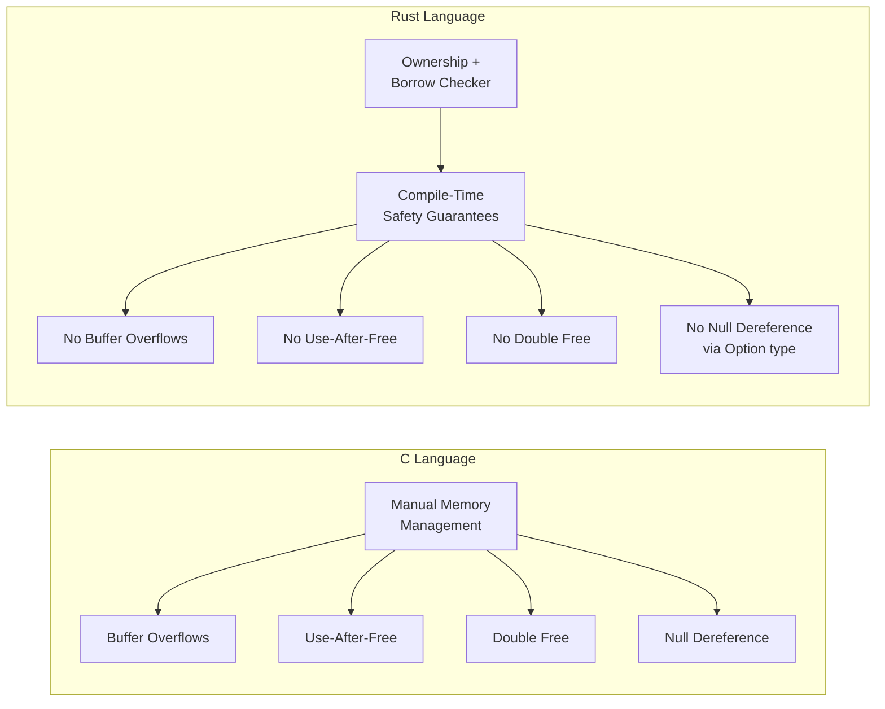
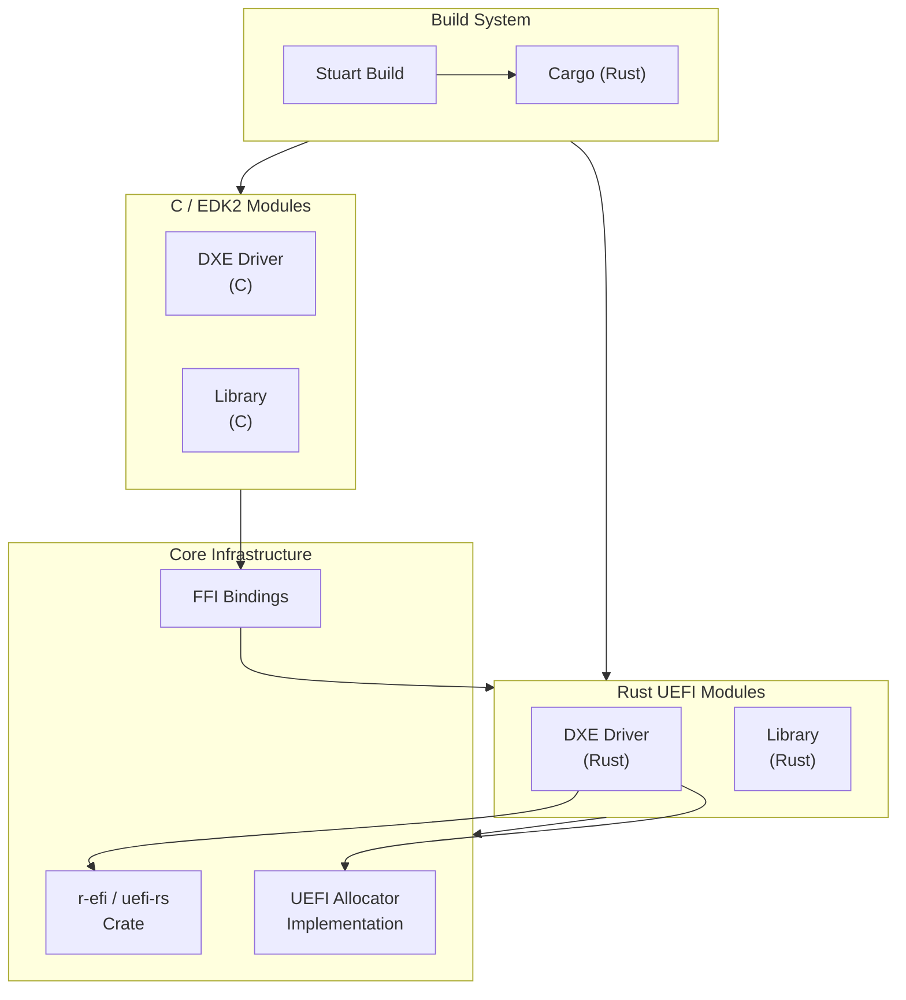

# Chapter 26: Rust in Firmware

## Introduction

Firmware is among the most security-sensitive code on a computing platform. It runs before the operating system, with full hardware access and no memory protection. Yet the vast majority of firmware is written in C -- a language where a single buffer overflow, use-after-free, or null pointer dereference can compromise the entire system.

**Rust** offers a compelling alternative. With its ownership model, borrow checker, and type system, Rust eliminates entire classes of memory safety bugs at compile time -- without the overhead of garbage collection. Project Mu has been at the forefront of integrating Rust into the UEFI firmware ecosystem, enabling developers to write firmware modules in Rust alongside existing C/EDK2 code.

This chapter covers the motivation for Rust in firmware, how to set up the Rust toolchain for UEFI development, writing UEFI modules in Rust, interoperating with existing C code through FFI, and building Rust modules within the Project Mu build system.

---

## Why Rust for Firmware?

### Memory Safety Without Garbage Collection

Firmware operates in a constrained environment where garbage collection is not feasible. Rust provides memory safety through compile-time ownership analysis rather than runtime garbage collection:



### The Cost of C in Firmware

Microsoft has reported that approximately 70% of CVEs in their products are memory safety issues. Firmware is no exception. Common firmware vulnerabilities include:

- **Buffer overflows in SMM handlers**: Can allow privilege escalation to System Management Mode
- **Use-after-free in DXE drivers**: Can allow boot-time code injection
- **Integer overflows in protocol implementations**: Can lead to incorrect memory allocations
- **Format string vulnerabilities in debug output**: Can leak or corrupt memory

### What Rust Brings to Firmware

| Property | Benefit for Firmware |
|----------|---------------------|
| **Ownership model** | Prevents use-after-free and double-free at compile time |
| **Borrow checker** | Ensures references are always valid; no dangling pointers |
| **No null pointers** | `Option<T>` forces explicit handling of absent values |
| **Array bounds checking** | Prevents buffer overflows (with zero-cost abstractions for known-size arrays) |
| **Type safety** | Prevents type confusion bugs common in C void pointer usage |
| **Pattern matching** | Exhaustive matching ensures all cases are handled |
| **No undefined behavior** | Safe Rust has no undefined behavior by definition |
| **Zero-cost abstractions** | High-level safety without runtime overhead |

---

## Project Mu's Rust Integration

### Current State

Project Mu has been building Rust support incrementally. The integration includes:

- **Build system support**: Stuart can build Rust modules alongside C modules
- **UEFI target support**: Rust's `x86_64-unknown-uefi` target produces PE32+ binaries compatible with the UEFI loader
- **Core library availability**: `core` and `alloc` crates work in the UEFI `no_std` environment
- **FFI interoperability**: Rust modules can call into and be called from C/EDK2 code
- **Base crate ecosystem**: Foundational crates for UEFI types, protocols, and services

### Architecture



---

## Setting Up the Rust Toolchain for UEFI

### Prerequisites

Rust UEFI development requires the nightly toolchain because the UEFI targets and certain features (`abi_efiapi`, allocator APIs) are not yet stabilized.

```bash
# Install Rust via rustup
curl --proto '=https' --tlsv1.2 -sSf https://sh.rustup.rs | sh

# Install the nightly toolchain
rustup toolchain install nightly

# Add the UEFI target
rustup target add x86_64-unknown-uefi --toolchain nightly

# For AArch64 UEFI targets
rustup target add aarch64-unknown-uefi --toolchain nightly

# Install useful components
rustup component add rust-src --toolchain nightly
rustup component add clippy --toolchain nightly
rustup component add rustfmt --toolchain nightly
```

### Verifying the Setup

```bash
# Confirm the UEFI target is available
rustup target list --installed --toolchain nightly
# Should show: x86_64-unknown-uefi

# Verify cargo can create a project
cargo +nightly new --lib my_uefi_module
```

### Cargo Configuration for UEFI

Create a `.cargo/config.toml` in your project:

```toml
[build]
target = "x86_64-unknown-uefi"

[unstable]
build-std = ["core", "compiler_builtins", "alloc"]
build-std-features = ["compiler-builtins-mem"]

[target.x86_64-unknown-uefi]
runner = "qemu-system-x86_64 -drive if=pflash,format=raw,file=OVMF.fd -drive format=raw,file=fat:rw:esp"
```

The `build-std` option is important: it tells Cargo to recompile the standard library crates (`core`, `alloc`) for the UEFI target, since pre-compiled versions are not shipped.

---

## Writing a UEFI Module in Rust

### Minimal UEFI Application

Here is a complete, minimal UEFI application written in Rust:

```rust
// src/main.rs
#![no_main]
#![no_std]

use core::fmt::Write;
use core::panic::PanicInfo;
use r_efi::efi;

// Panic handler -- required in no_std environments
#[panic_handler]
fn panic(_info: &PanicInfo) -> ! {
    loop {}
}

// UEFI application entry point
#[export_name = "efi_main"]
pub extern "efiapi" fn efi_main(
    image_handle: efi::Handle,
    system_table: *mut efi::SystemTable,
) -> efi::Status {
    // Safety: system_table is provided by the UEFI firmware and is valid
    let st = unsafe { &mut *system_table };
    let con_out = unsafe { &mut *st.con_out };

    // Print "Hello from Rust!" to the console
    let hello = "Hello from Rust UEFI!\r\n";
    for c in hello.encode_utf16() {
        let chars = [c, 0u16];
        unsafe {
            (con_out.output_string)(con_out, chars.as_ptr() as *mut efi::Char16);
        }
    }

    efi::Status::SUCCESS
}
```

### Cargo.toml

```toml
[package]
name = "hello-uefi"
version = "0.1.0"
edition = "2021"

[dependencies]
r-efi = "4.5.0"

[profile.dev]
panic = "abort"

[profile.release]
panic = "abort"
opt-level = "z"    # Optimize for size
lto = true          # Link-time optimization
```

### Building and Running

```bash
# Build the UEFI application
cargo +nightly build --target x86_64-unknown-uefi

# The output is at target/x86_64-unknown-uefi/debug/hello-uefi.efi

# Set up an ESP directory structure for QEMU
mkdir -p esp/EFI/BOOT
cp target/x86_64-unknown-uefi/debug/hello-uefi.efi esp/EFI/BOOT/BOOTX64.EFI

# Run in QEMU
qemu-system-x86_64 \
    -drive if=pflash,format=raw,readonly=on,file=OVMF_CODE.fd \
    -drive if=pflash,format=raw,file=OVMF_VARS.fd \
    -drive format=raw,file=fat:rw:esp \
    -nographic
```

---

## A More Complete UEFI Driver

### DXE Driver in Rust

A DXE driver that installs a custom protocol:

```rust
#![no_main]
#![no_std]

extern crate alloc;

use alloc::boxed::Box;
use core::panic::PanicInfo;
use r_efi::efi;

// Custom protocol GUID
const MY_PROTOCOL_GUID: efi::Guid = efi::Guid::from_fields(
    0x12345678, 0xABCD, 0xEF01,
    0x23, 0x45, &[0x67, 0x89, 0xAB, 0xCD, 0xEF, 0x01],
);

// Protocol interface structure
#[repr(C)]
struct MyProtocol {
    revision: u64,
    get_value: unsafe extern "efiapi" fn(
        this: *mut MyProtocol,
        value: *mut u32,
    ) -> efi::Status,
}

// Protocol method implementation
unsafe extern "efiapi" fn my_get_value(
    _this: *mut MyProtocol,
    value: *mut u32,
) -> efi::Status {
    if value.is_null() {
        return efi::Status::INVALID_PARAMETER;
    }
    unsafe {
        *value = 42;
    }
    efi::Status::SUCCESS
}

// Global boot services pointer (set during entry)
static mut BOOT_SERVICES: *mut efi::BootServices = core::ptr::null_mut();

#[panic_handler]
fn panic(_info: &PanicInfo) -> ! {
    loop {}
}

#[export_name = "efi_main"]
pub extern "efiapi" fn efi_main(
    image_handle: efi::Handle,
    system_table: *mut efi::SystemTable,
) -> efi::Status {
    let st = unsafe { &*system_table };
    let bs = unsafe { &*st.boot_services };

    // Store boot services for later use
    unsafe {
        BOOT_SERVICES = st.boot_services;
    }

    // Create the protocol instance
    let protocol = Box::new(MyProtocol {
        revision: 1,
        get_value: my_get_value,
    });

    // Leak the box -- firmware protocols must live for the lifetime of the driver
    let protocol_ptr = Box::into_raw(protocol);

    // Install the protocol on a new handle
    let mut handle: efi::Handle = core::ptr::null_mut();
    let status = unsafe {
        (bs.install_protocol_interface)(
            &mut handle,
            &MY_PROTOCOL_GUID as *const efi::Guid as *mut efi::Guid,
            efi::NATIVE_INTERFACE,
            protocol_ptr as *mut core::ffi::c_void,
        )
    };

    status
}
```

---

## Rust-C FFI for EDK2 Interop

### Calling C from Rust

Existing EDK2 libraries and protocols can be called from Rust through FFI declarations:

```rust
// Declare external C functions from EDK2
extern "C" {
    /// DebugPrint from DebugLib
    fn DebugPrint(error_level: usize, format: *const u8, ...);

    /// AllocatePool from MemoryAllocationLib
    fn AllocatePool(size: usize) -> *mut u8;

    /// FreePool from MemoryAllocationLib
    fn FreePool(buffer: *mut u8);

    /// CopyMem from BaseMemoryLib
    fn CopyMem(dest: *mut u8, src: *const u8, length: usize);
}

// Safe wrapper around AllocatePool/FreePool
pub struct UefiBuffer {
    ptr: *mut u8,
    size: usize,
}

impl UefiBuffer {
    pub fn new(size: usize) -> Option<Self> {
        let ptr = unsafe { AllocatePool(size) };
        if ptr.is_null() {
            None
        } else {
            Some(UefiBuffer { ptr, size })
        }
    }

    pub fn as_slice(&self) -> &[u8] {
        unsafe { core::slice::from_raw_parts(self.ptr, self.size) }
    }

    pub fn as_mut_slice(&mut self) -> &mut [u8] {
        unsafe { core::slice::from_raw_parts_mut(self.ptr, self.size) }
    }
}

impl Drop for UefiBuffer {
    fn drop(&mut self) {
        if !self.ptr.is_null() {
            unsafe { FreePool(self.ptr) };
        }
    }
}
```

### Calling Rust from C

To expose Rust functions to C code:

```rust
/// A function callable from C
///
/// # Safety
/// `buffer` must point to at least `buffer_size` bytes of valid memory.
#[no_mangle]
pub unsafe extern "C" fn RustValidateBuffer(
    buffer: *const u8,
    buffer_size: usize,
) -> u32 {
    if buffer.is_null() || buffer_size == 0 {
        return 1; // Error: invalid parameter
    }

    let data = unsafe { core::slice::from_raw_parts(buffer, buffer_size) };

    // Perform validation using safe Rust
    if validate_contents(data) {
        0 // Success
    } else {
        2 // Error: validation failed
    }
}

fn validate_contents(data: &[u8]) -> bool {
    // Safe Rust code with bounds checking, no buffer overflows possible
    if data.len() < 4 {
        return false;
    }

    let magic = u32::from_le_bytes([data[0], data[1], data[2], data[3]]);
    magic == 0x5A4D_4F52 // Expected magic number
}
```

The corresponding C header:

```c
// RustValidation.h
#ifndef RUST_VALIDATION_H_
#define RUST_VALIDATION_H_

#include <Uefi.h>

/**
    Validate a buffer using Rust implementation.

    @param[in] Buffer       Pointer to the buffer to validate.
    @param[in] BufferSize   Size of the buffer in bytes.

    @retval 0   Validation successful.
    @retval 1   Invalid parameter.
    @retval 2   Validation failed.
**/
UINT32
EFIAPI
RustValidateBuffer (
    IN CONST UINT8  *Buffer,
    IN UINTN        BufferSize
);

#endif
```

---

## Using core and alloc in UEFI

### The no_std Environment

UEFI applications run in a `no_std` environment, meaning the Rust standard library (`std`) is not available. However, two foundational crates are available:

- **`core`**: Provides fundamental types (`Option`, `Result`, `slice`, and others), traits, and utilities that require no OS support
- **`alloc`**: Provides heap allocation types (`Box`, `Vec`, `String`, `BTreeMap`) given a global allocator

### Implementing a UEFI Allocator

To use `alloc`, you must provide a global allocator that uses UEFI's memory allocation services:

```rust
use core::alloc::{GlobalAlloc, Layout};
use r_efi::efi;

struct UefiAllocator;

unsafe impl GlobalAlloc for UefiAllocator {
    unsafe fn alloc(&self, layout: Layout) -> *mut u8 {
        let bs = unsafe { &*BOOT_SERVICES };
        let mut ptr: *mut core::ffi::c_void = core::ptr::null_mut();

        // UEFI AllocatePool guarantees 8-byte alignment
        // For larger alignments, we need to over-allocate and adjust
        let (alloc_size, offset) = if layout.align() <= 8 {
            (layout.size(), 0usize)
        } else {
            // Over-allocate to ensure alignment
            (layout.size() + layout.align(), layout.align())
        };

        let status = unsafe {
            (bs.allocate_pool)(
                efi::LOADER_DATA,
                alloc_size,
                &mut ptr,
            )
        };

        if status != efi::Status::SUCCESS || ptr.is_null() {
            return core::ptr::null_mut();
        }

        if offset == 0 {
            ptr as *mut u8
        } else {
            // Align the pointer
            let raw = ptr as usize;
            let aligned = (raw + offset) & !(layout.align() - 1);
            // Store the original pointer just before the aligned pointer
            unsafe {
                *((aligned - core::mem::size_of::<usize>()) as *mut usize) = raw;
            }
            aligned as *mut u8
        }
    }

    unsafe fn dealloc(&self, ptr: *mut u8, layout: Layout) {
        let bs = unsafe { &*BOOT_SERVICES };
        let actual_ptr = if layout.align() <= 8 {
            ptr as *mut core::ffi::c_void
        } else {
            let raw = unsafe {
                *((ptr as usize - core::mem::size_of::<usize>()) as *const usize)
            };
            raw as *mut core::ffi::c_void
        };
        unsafe {
            (bs.free_pool)(actual_ptr);
        }
    }
}

#[global_allocator]
static ALLOCATOR: UefiAllocator = UefiAllocator;
```

With this allocator in place, you can use `Vec`, `String`, `Box`, and other heap-allocated types:

```rust
extern crate alloc;

use alloc::vec::Vec;
use alloc::string::String;
use alloc::format;

fn process_data() -> Vec<u8> {
    let mut buffer = Vec::with_capacity(256);
    buffer.extend_from_slice(b"UEFI data processed by Rust");
    buffer
}

fn format_version(major: u16, minor: u16) -> String {
    format!("v{}.{}", major, minor)
}
```

---

## Building Rust Modules with Stuart

### Integration with the EDK2 Build System

Project Mu's build system (Stuart) integrates Rust compilation through custom build plugins. The general approach:

1. Rust code lives in a subdirectory of the EDK2 module
2. A Cargo.toml defines the Rust crate
3. The INF file references the Rust build output as a binary or library
4. Stuart invokes Cargo during the build process

### Module Directory Structure

```
MyPlatformPkg/
  RustModule/
    RustModule.inf          # EDK2 module description
    RustModule.c            # Thin C wrapper (if needed)
    rust/
      Cargo.toml            # Rust crate definition
      src/
        lib.rs              # Rust library code
      .cargo/
        config.toml         # Cargo configuration for UEFI target
```

### INF File with Rust Integration

```ini
[Defines]
    INF_VERSION    = 0x00010017
    BASE_NAME      = RustModule
    FILE_GUID      = AABBCCDD-1122-3344-5566-778899AABBCC
    MODULE_TYPE    = DXE_DRIVER
    VERSION_STRING = 1.0
    ENTRY_POINT    = RustModuleEntryPoint

[Sources]
    RustModule.c

[Packages]
    MdePkg/MdePkg.dec
    MdeModulePkg/MdeModulePkg.dec

[LibraryClasses]
    UefiDriverEntryPoint
    UefiBootServicesTableLib
    DebugLib

[Depex]
    TRUE
```

### Build Plugin Configuration

In your platform's stuart configuration, enable Rust support:

```python
# PlatformBuild.py
class PlatformBuilder(UefiBuilder):
    def GetActiveScopes(self):
        scopes = super().GetActiveScopes()
        scopes += ("rust",)
        return scopes

    def GetPackagesPath(self):
        paths = super().GetPackagesPath()
        return paths
```

---

## Practical Patterns for Rust Firmware

### Error Handling

Rust's `Result` type maps naturally to UEFI's `EFI_STATUS` pattern:

```rust
use r_efi::efi;

// Define a firmware-specific error type
#[derive(Debug)]
enum FirmwareError {
    InvalidParameter,
    OutOfResources,
    DeviceError,
    NotFound,
}

impl From<FirmwareError> for efi::Status {
    fn from(e: FirmwareError) -> efi::Status {
        match e {
            FirmwareError::InvalidParameter => efi::Status::INVALID_PARAMETER,
            FirmwareError::OutOfResources => efi::Status::OUT_OF_RESOURCES,
            FirmwareError::DeviceError => efi::Status::DEVICE_ERROR,
            FirmwareError::NotFound => efi::Status::NOT_FOUND,
        }
    }
}

// Use Result for internal logic
fn read_config_value(key: &str) -> Result<u32, FirmwareError> {
    match key {
        "timeout" => Ok(30),
        "retries" => Ok(3),
        _ => Err(FirmwareError::NotFound),
    }
}

// Convert at the FFI boundary
#[no_mangle]
pub extern "efiapi" fn GetConfigValue(
    key: *const u8,
    key_len: usize,
    value: *mut u32,
) -> efi::Status {
    if key.is_null() || value.is_null() {
        return efi::Status::INVALID_PARAMETER;
    }

    let key_slice = unsafe { core::slice::from_raw_parts(key, key_len) };
    let key_str = match core::str::from_utf8(key_slice) {
        Ok(s) => s,
        Err(_) => return efi::Status::INVALID_PARAMETER,
    };

    match read_config_value(key_str) {
        Ok(v) => {
            unsafe { *value = v };
            efi::Status::SUCCESS
        }
        Err(e) => e.into(),
    }
}
```

### Safe Protocol Wrappers

```rust
/// Type-safe wrapper around a UEFI protocol handle
pub struct ProtocolHandle<'a, T> {
    interface: &'a T,
    handle: efi::Handle,
}

impl<'a, T> ProtocolHandle<'a, T> {
    /// Locate and open a protocol by GUID
    pub unsafe fn locate(
        bs: &efi::BootServices,
        guid: &efi::Guid,
    ) -> Result<Self, efi::Status> {
        let mut handle: efi::Handle = core::ptr::null_mut();
        // ... locate protocol logic
        todo!()
    }

    pub fn interface(&self) -> &T {
        self.interface
    }
}
```

---

## Current Limitations and Roadmap

### Limitations

| Limitation | Details |
|-----------|---------|
| **Nightly toolchain required** | The `x86_64-unknown-uefi` target is not yet stabilized |
| **Limited crate ecosystem** | Most crates depend on `std` and cannot be used in UEFI |
| **Debugging** | Rust debug info in UEFI is less mature than C/DWARF |
| **Build integration** | Cargo and EDK2 build systems require glue code to work together |
| **SMM support** | Writing SMM handlers in Rust requires additional safety analysis |
| **Code size** | Rust generics can lead to code bloat in size-constrained firmware |

### Roadmap

The Rust-in-firmware ecosystem is evolving rapidly:

- **Target stabilization**: The UEFI targets are on track for stabilization in Rust
- **Standard UEFI crates**: Crates like `r-efi` and `uefi-rs` continue to mature
- **Better build integration**: Tighter integration between Cargo and EDK2/Stuart
- **More Rust modules in Project Mu**: Gradual migration of security-critical code to Rust
- **Formal verification**: Rust's type system enables easier formal verification of firmware properties
- **Community growth**: Increasing interest from the firmware development community

---

## Summary

Rust brings transformative safety improvements to firmware development. By eliminating memory safety bugs at compile time, Rust can prevent the majority of firmware vulnerabilities without sacrificing performance or adding runtime overhead.

Key takeaways:

- **Memory safety without GC** makes Rust uniquely suited for firmware environments
- **The `x86_64-unknown-uefi` target** allows Rust to produce UEFI-compatible binaries directly
- **`no_std` with `core` and `alloc`** provides a rich programming environment without OS dependencies
- **FFI interoperability** allows incremental adoption alongside existing C/EDK2 code
- **Project Mu's build integration** enables Rust modules to coexist in the firmware build
- **Safe wrappers** around unsafe FFI boundaries contain the risk to narrow, auditable code sections

Rust is not a silver bullet -- it requires learning new patterns and working within the constraints of the `no_std` environment. But for security-critical firmware code, the compile-time guarantees are well worth the investment.

---

[Next: Chapter 27 - Platform Testing](/part5/platform-testing/){: .btn .btn-primary .fs-5 .mb-4 .mb-md-0 .mr-2 }
[Previous: Chapter 25 - DFCI](/part5/dfci/){: .btn .fs-5 .mb-4 .mb-md-0 }
