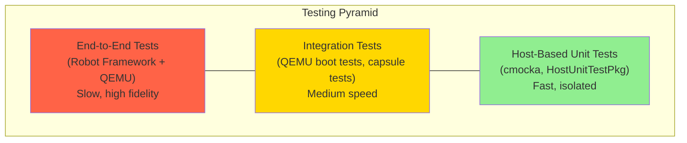
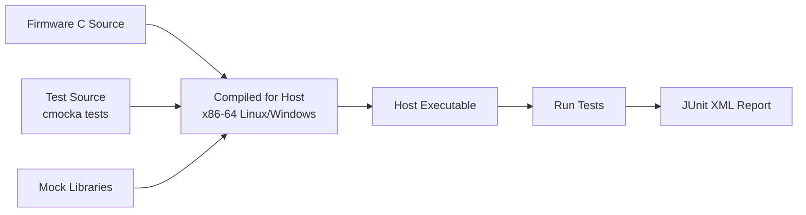
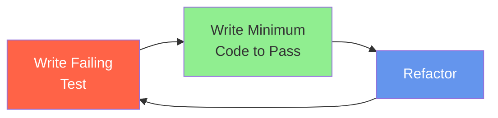

# Chapter 27: Platform Testing

## Introduction

Firmware testing presents unique challenges. The code under test runs before the operating system, often on bare metal with no file system, no networking, and no standard test harness. Traditional software testing tools -- JUnit, pytest, Google Test -- assume an OS environment that simply does not exist during firmware execution.

Project Mu addresses this challenge with a comprehensive testing strategy that spans multiple layers: **host-based unit tests** that run on the developer's machine, **integration tests** that exercise firmware in QEMU, and **Robot Framework tests** for automated end-to-end validation. Combined with Stuart's CI integration, these tools enable test-driven firmware development with the same rigor expected of any modern software project.

---

## Project Mu's Testing Philosophy

### Test Pyramid for Firmware



### Core Principles

1. **Test at the lowest level possible**: Prefer unit tests over integration tests, and integration tests over end-to-end tests
2. **Run tests on the host**: Avoid requiring target hardware for the majority of tests
3. **Automate everything**: Every test should run in CI without manual intervention
4. **Test in isolation**: Unit tests should mock external dependencies to test logic independently
5. **Fail fast**: Catch bugs at build time, not during firmware bring-up on hardware

---

## Host-Based Unit Testing

### Overview

Host-based unit testing compiles firmware C code for the host machine (x86-64 Linux or Windows) rather than for the firmware target. This allows tests to run directly on the developer's machine or in CI, without QEMU or hardware.

Project Mu uses the **cmocka** testing framework, integrated through **UnitTestFrameworkPkg** (formerly HostUnitTestPkg).

### How It Works



The key insight is that most firmware logic -- parsing, validation, state machines, calculations -- is pure C code that does not depend on actual hardware. By providing mock implementations of hardware-dependent functions, we can test this logic on any machine.

### Setting Up a Unit Test Module

#### Directory Structure

```
MyPkg/
  Library/
    MyLib/
      MyLib.c                    # Production code
      MyLib.inf                  # Production INF
      UnitTest/
        MyLibUnitTest.c          # Test code
        MyLibUnitTest.inf        # Test INF
        MyLibHostUnitTest.inf    # Host-based test INF
```

#### Test INF File

```ini
[Defines]
    INF_VERSION    = 0x00010017
    BASE_NAME      = MyLibHostUnitTest
    FILE_GUID      = 11223344-5566-7788-99AA-BBCCDDEEFF00
    MODULE_TYPE    = HOST_APPLICATION
    VERSION_STRING = 1.0

[Sources]
    MyLibUnitTest.c
    ../MyLib.c

[Packages]
    MdePkg/MdePkg.dec
    UnitTestFrameworkPkg/UnitTestFrameworkPkg.dec

[LibraryClasses]
    UnitTestLib
    DebugLib
    BaseLib
    BaseMemoryLib
```

The critical setting is `MODULE_TYPE = HOST_APPLICATION`, which tells the build system to compile for the host rather than for UEFI.

### Writing Unit Tests

#### Basic Test Structure

```c
#include <stdio.h>
#include <Uefi.h>
#include <Library/UnitTestLib.h>
#include <Library/BaseLib.h>

// Include the code under test
#include "../MyLib.h"

#define UNIT_TEST_NAME     "MyLib Unit Tests"
#define UNIT_TEST_VERSION  "1.0"

/**
    Test that ParseVersion correctly parses a valid version string.
**/
UNIT_TEST_STATUS
EFIAPI
TestParseVersionValid (
    IN UNIT_TEST_CONTEXT  Context
)
{
    UINT32  Major = 0;
    UINT32  Minor = 0;
    UINT32  Patch = 0;

    EFI_STATUS Status = ParseVersion("1.2.3", &Major, &Minor, &Patch);

    UT_ASSERT_NOT_EFI_ERROR(Status);
    UT_ASSERT_EQUAL(Major, 1);
    UT_ASSERT_EQUAL(Minor, 2);
    UT_ASSERT_EQUAL(Patch, 3);

    return UNIT_TEST_PASSED;
}

/**
    Test that ParseVersion rejects NULL input.
**/
UNIT_TEST_STATUS
EFIAPI
TestParseVersionNull (
    IN UNIT_TEST_CONTEXT  Context
)
{
    UINT32  Major, Minor, Patch;

    EFI_STATUS Status = ParseVersion(NULL, &Major, &Minor, &Patch);

    UT_ASSERT_STATUS_EQUAL(Status, EFI_INVALID_PARAMETER);

    return UNIT_TEST_PASSED;
}

/**
    Test that ParseVersion handles malformed input.
**/
UNIT_TEST_STATUS
EFIAPI
TestParseVersionMalformed (
    IN UNIT_TEST_CONTEXT  Context
)
{
    UINT32  Major, Minor, Patch;

    EFI_STATUS Status = ParseVersion("not.a.version.string", &Major, &Minor, &Patch);

    UT_ASSERT_STATUS_EQUAL(Status, EFI_INVALID_PARAMETER);

    return UNIT_TEST_PASSED;
}

/**
    Test that ParseVersion handles boundary values.
**/
UNIT_TEST_STATUS
EFIAPI
TestParseVersionBoundary (
    IN UNIT_TEST_CONTEXT  Context
)
{
    UINT32  Major, Minor, Patch;

    // Maximum values
    EFI_STATUS Status = ParseVersion("255.255.65535", &Major, &Minor, &Patch);

    UT_ASSERT_NOT_EFI_ERROR(Status);
    UT_ASSERT_EQUAL(Major, 255);
    UT_ASSERT_EQUAL(Minor, 255);
    UT_ASSERT_EQUAL(Patch, 65535);

    return UNIT_TEST_PASSED;
}

/**
    Entry point for the unit test application.
**/
EFI_STATUS
EFIAPI
MyLibUnitTestEntry (
    IN EFI_HANDLE        ImageHandle,
    IN EFI_SYSTEM_TABLE  *SystemTable
)
{
    EFI_STATUS                  Status;
    UNIT_TEST_FRAMEWORK_HANDLE  Framework;
    UNIT_TEST_SUITE_HANDLE      VersionTests;

    // Initialize the test framework
    Status = InitUnitTestFramework(
        &Framework,
        UNIT_TEST_NAME,
        gEfiCallerBaseName,
        UNIT_TEST_VERSION
    );
    if (EFI_ERROR(Status)) {
        return Status;
    }

    // Create a test suite
    Status = CreateUnitTestSuite(
        &VersionTests,
        Framework,
        "Version Parsing Tests",
        "MyLib.VersionParsing",
        NULL,  // Suite setup
        NULL   // Suite teardown
    );
    if (EFI_ERROR(Status)) {
        goto EXIT;
    }

    // Add test cases
    AddTestCase(
        VersionTests,
        "ParseVersion with valid input",
        "ParseVersion.Valid",
        TestParseVersionValid,
        NULL,  // Prerequisite
        NULL,  // Cleanup
        NULL   // Context
    );

    AddTestCase(
        VersionTests,
        "ParseVersion with NULL input",
        "ParseVersion.Null",
        TestParseVersionNull,
        NULL, NULL, NULL
    );

    AddTestCase(
        VersionTests,
        "ParseVersion with malformed input",
        "ParseVersion.Malformed",
        TestParseVersionMalformed,
        NULL, NULL, NULL
    );

    AddTestCase(
        VersionTests,
        "ParseVersion with boundary values",
        "ParseVersion.Boundary",
        TestParseVersionBoundary,
        NULL, NULL, NULL
    );

    // Run all tests
    Status = RunAllTestSuites(Framework);

EXIT:
    if (Framework != NULL) {
        FreeUnitTestFramework(Framework);
    }

    return Status;
}
```

### Assertion Macros

The UnitTestLib provides a rich set of assertion macros:

| Macro | Description |
|-------|-------------|
| `UT_ASSERT_TRUE(Expression)` | Assert expression is TRUE |
| `UT_ASSERT_FALSE(Expression)` | Assert expression is FALSE |
| `UT_ASSERT_EQUAL(A, B)` | Assert A equals B |
| `UT_ASSERT_NOT_EQUAL(A, B)` | Assert A does not equal B |
| `UT_ASSERT_MEM_EQUAL(A, B, Len)` | Assert memory regions are equal |
| `UT_ASSERT_NOT_EFI_ERROR(Status)` | Assert Status is not an error |
| `UT_ASSERT_STATUS_EQUAL(Status, Expected)` | Assert Status equals expected |
| `UT_ASSERT_NOT_NULL(Ptr)` | Assert pointer is not NULL |
| `UT_EXPECT_ASSERT_FAILURE(Expr, Status)` | Assert that an ASSERT fires |
| `UT_LOG_INFO(Format, ...)` | Log informational message |
| `UT_LOG_WARNING(Format, ...)` | Log warning message |
| `UT_LOG_ERROR(Format, ...)` | Log error message |

### Mocking Dependencies

When the code under test calls functions that depend on firmware services, provide mock implementations:

```c
#include <Library/UnitTestLib.h>

// Mock for a function that reads from SPI flash
EFI_STATUS
EFIAPI
MockSpiFlashRead (
    IN  UINT32  Offset,
    IN  UINT32  Size,
    OUT UINT8   *Buffer
)
{
    // Verify parameters using cmocka
    check_expected(Offset);
    check_expected(Size);

    // Return pre-configured test data
    UINT8  *MockData = (UINT8 *)mock();
    CopyMem(Buffer, MockData, Size);

    return (EFI_STATUS)mock();
}

// In the test case:
UNIT_TEST_STATUS
EFIAPI
TestReadConfigFromFlash (
    IN UNIT_TEST_CONTEXT  Context
)
{
    UINT8  ExpectedData[] = {0x01, 0x02, 0x03, 0x04};
    CONFIG_DATA  Config;

    // Set up mock expectations
    expect_value(MockSpiFlashRead, Offset, CONFIG_FLASH_OFFSET);
    expect_value(MockSpiFlashRead, Size, sizeof(CONFIG_DATA));
    will_return(MockSpiFlashRead, ExpectedData);
    will_return(MockSpiFlashRead, EFI_SUCCESS);

    // Call the function under test
    EFI_STATUS Status = ReadConfigFromFlash(&Config);

    UT_ASSERT_NOT_EFI_ERROR(Status);
    UT_ASSERT_MEM_EQUAL(&Config.RawData, ExpectedData, sizeof(ExpectedData));

    return UNIT_TEST_PASSED;
}
```

---

## Integration Testing with QEMU

### Purpose

While unit tests verify individual functions in isolation, integration tests verify that firmware components work together correctly. QEMU provides a virtual platform where complete firmware images can be tested.

### QEMU Boot Test

A basic integration test verifies that the firmware boots successfully:

```python
#!/usr/bin/env python3
"""QEMU integration test for firmware boot."""

import subprocess
import sys
import time

def test_firmware_boot():
    """Verify firmware boots to UEFI shell."""
    proc = subprocess.Popen(
        [
            "qemu-system-x86_64",
            "-machine", "q35,smm=on",
            "-drive", "if=pflash,format=raw,unit=0,file=Build/QemuQ35Pkg/DEBUG_GCC5/FV/QEMUQ35_CODE.fd",
            "-drive", "if=pflash,format=raw,unit=1,file=Build/QemuQ35Pkg/DEBUG_GCC5/FV/QEMUQ35_VARS.fd",
            "-m", "2048",
            "-serial", "pipe:serial_log",
            "-display", "none",
            "-no-reboot",
        ],
        stdout=subprocess.PIPE,
        stderr=subprocess.PIPE,
    )

    boot_successful = False
    timeout = time.time() + 180  # 3-minute timeout

    with open("serial_log.out", "r") as log:
        while time.time() < timeout:
            line = log.readline()
            if not line:
                time.sleep(0.1)
                continue
            print(line, end="")
            if "Shell>" in line or "UEFI Interactive Shell" in line:
                boot_successful = True
                break

    proc.terminate()
    proc.wait(timeout=10)

    if boot_successful:
        print("\nPASS: Firmware booted to UEFI Shell")
        return 0
    else:
        print("\nFAIL: Firmware did not reach UEFI Shell within timeout")
        return 1

if __name__ == "__main__":
    sys.exit(test_firmware_boot())
```

### Testing Specific Features

Integration tests can target specific firmware features:

```python
def test_secure_boot_enforcement():
    """Verify Secure Boot rejects unsigned binaries."""
    # 1. Build firmware with Secure Boot enabled and keys enrolled
    # 2. Create an unsigned test application
    # 3. Place it on the ESP
    # 4. Boot QEMU and attempt to run the unsigned application
    # 5. Verify the application is rejected (security violation)
    pass

def test_capsule_update():
    """Verify capsule update processing."""
    # 1. Build firmware with FMP support
    # 2. Create a signed test capsule
    # 3. Place capsule on ESP at EFI/UpdateCapsule/
    # 4. Boot QEMU and verify capsule is processed
    # 5. Reboot and verify new firmware version
    pass

def test_dfci_enrollment():
    """Verify DFCI enrollment via mailbox."""
    # 1. Build firmware with DFCI support
    # 2. Create a signed DFCI enrollment packet
    # 3. Set the enrollment UEFI variable
    # 4. Boot QEMU and verify enrollment is processed
    # 5. Verify result variable indicates success
    pass
```

---

## Robot Framework for Firmware Testing

### What Is Robot Framework?

Robot Framework is an open-source test automation framework that uses a keyword-driven approach. It is particularly well-suited for firmware testing because:

- Test cases are written in plain language, making them accessible to non-developers
- Custom keywords can abstract complex firmware interactions
- Built-in reporting produces detailed HTML reports
- Easy integration with CI systems

### Setup

```bash
# Install Robot Framework
pip install robotframework
pip install robotframework-seriallibrary

# For QEMU management
pip install robotframework-process
```

### Project Structure

```
tests/
  robot/
    resources/
      qemu_keywords.robot        # QEMU management keywords
      uefi_shell_keywords.robot  # UEFI shell interaction keywords
      common_variables.robot     # Shared variables
    suites/
      boot_tests.robot           # Boot verification tests
      secure_boot_tests.robot    # Secure Boot tests
      capsule_tests.robot        # Capsule update tests
    results/                     # Test output directory
```

### QEMU Management Keywords

```robot
*** Settings ***
Library    Process
Library    OperatingSystem
Library    String

*** Variables ***
${QEMU_BINARY}         qemu-system-x86_64
${FIRMWARE_CODE}       ${BUILD_DIR}/FV/QEMUQ35_CODE.fd
${FIRMWARE_VARS}       ${BUILD_DIR}/FV/QEMUQ35_VARS.fd
${QEMU_MEMORY}         2048
${BOOT_TIMEOUT}        180

*** Keywords ***
Start QEMU
    [Documentation]    Start a QEMU instance with the firmware under test
    [Arguments]    ${extra_args}=
    ${process}=    Start Process
    ...    ${QEMU_BINARY}
    ...    -machine    q35,smm\=on
    ...    -drive    if\=pflash,format\=raw,unit\=0,file\=${FIRMWARE_CODE}
    ...    -drive    if\=pflash,format\=raw,unit\=1,file\=${FIRMWARE_VARS}
    ...    -m    ${QEMU_MEMORY}
    ...    -serial    stdio
    ...    -display    none
    ...    ${extra_args}
    ...    stdout=${CURDIR}/serial.log
    ...    stderr=STDOUT
    Set Suite Variable    ${QEMU_PROCESS}    ${process}
    RETURN    ${process}

Stop QEMU
    [Documentation]    Terminate the QEMU instance
    Terminate Process    ${QEMU_PROCESS}

Wait For Boot
    [Documentation]    Wait for firmware to reach the UEFI Shell
    [Arguments]    ${timeout}=${BOOT_TIMEOUT}
    ${result}=    Wait For Pattern In Log
    ...    pattern=Shell>
    ...    timeout=${timeout}
    Should Be True    ${result}    Firmware did not boot within ${timeout}s

Wait For Pattern In Log
    [Documentation]    Wait for a pattern to appear in the serial log
    [Arguments]    ${pattern}    ${timeout}=60
    ${deadline}=    Evaluate    time.time() + ${timeout}    time
    FOR    ${i}    IN RANGE    9999
        ${content}=    Get File    ${CURDIR}/serial.log
        ${found}=    Run Keyword And Return Status
        ...    Should Contain    ${content}    ${pattern}
        IF    ${found}    RETURN    ${True}
        ${now}=    Evaluate    time.time()    time
        IF    ${now} > ${deadline}    RETURN    ${False}
        Sleep    1s
    END
    RETURN    ${False}
```

### Test Suite Example

```robot
*** Settings ***
Resource    ../resources/qemu_keywords.robot
Suite Setup       Start QEMU
Suite Teardown    Stop QEMU

*** Test Cases ***
Firmware Boots Successfully
    [Documentation]    Verify that firmware reaches the UEFI Shell
    [Tags]    boot    smoke
    Wait For Boot    timeout=180

DXE Drivers Load Without Errors
    [Documentation]    Verify no DXE driver load failures in serial output
    [Tags]    boot    drivers
    Wait For Boot
    ${log}=    Get File    ${CURDIR}/serial.log
    Should Not Contain    ${log}    ERROR: Driver failed to load
    Should Not Contain    ${log}    ASSERT

PCI Enumeration Completes
    [Documentation]    Verify PCI bus enumeration completes
    [Tags]    boot    pci
    ${found}=    Wait For Pattern In Log
    ...    pattern=PciBus: Discovered PCI
    ...    timeout=120
    Should Be True    ${found}    PCI enumeration did not complete

ACPI Tables Published
    [Documentation]    Verify ACPI tables are installed
    [Tags]    boot    acpi
    ${found}=    Wait For Pattern In Log
    ...    pattern=InstallAcpiTable
    ...    timeout=120
    Should Be True    ${found}    ACPI tables not installed

Timer Interrupt Functional
    [Documentation]    Verify timer interrupts are firing
    [Tags]    boot    timer
    ${found}=    Wait For Pattern In Log
    ...    pattern=Timer Interrupt
    ...    timeout=120
    Should Be True    ${found}    Timer interrupts not detected
```

---

## Stuart CI Build Test Integration

### stuart_ci_build

`stuart_ci_build` is Project Mu's CI-focused build command that automatically discovers and runs host-based unit tests. It is the primary tool for continuous integration.

```bash
# Run CI build with tests for a specific package
stuart_ci_build -c .pytool/CISettings.py -p MyPkg

# Run CI build for all packages
stuart_ci_build -c .pytool/CISettings.py

# Run only the host-based unit tests
stuart_ci_build -c .pytool/CISettings.py -p MyPkg --FlashOnly
```

### CI Configuration

The CI settings file configures which tests run and how:

```python
# .pytool/CISettings.py
class CISettings(CISetupSettingsManager, CIBuildSettingsManager):
    def GetActiveScopes(self):
        return ("cibuild", "host-based-test")

    def GetPackages(self):
        return [
            "MyPkg",
            "MyPlatformPkg",
        ]

    def GetPackagesPath(self):
        return [
            "MU_BASECORE",
            "Common/MU_TIANO",
            "Common/MU",
        ]

    def GetArchitecturesSupported(self):
        return ["IA32", "X64", "AARCH64"]

    def GetWorkspaceRoot(self):
        return os.path.dirname(os.path.dirname(os.path.abspath(__file__)))
```

### CI Plugin for Unit Tests

Stuart uses a plugin system to discover and run unit tests. The `HostUnitTestCompilerPlugin` automatically finds INF files with `MODULE_TYPE = HOST_APPLICATION` and compiles/runs them:

```python
# The plugin discovers test INFs automatically based on MODULE_TYPE
# No additional configuration is needed beyond including the test INF
# in your package's DSC file

# In your package DSC:
[Components.X64]
    MyPkg/Library/MyLib/UnitTest/MyLibHostUnitTest.inf
```

### GitHub Actions Integration

```yaml
# .github/workflows/ci.yml
name: Firmware CI

on:
  push:
    branches: [main]
  pull_request:
    branches: [main]

jobs:
  build-and-test:
    runs-on: ubuntu-latest

    steps:
      - name: Checkout
        uses: actions/checkout@v4
        with:
          submodules: recursive

      - name: Setup Python
        uses: actions/setup-python@v5
        with:
          python-version: '3.12'

      - name: Install Dependencies
        run: |
          pip install -r pip-requirements.txt
          stuart_setup -c .pytool/CISettings.py

      - name: Update Dependencies
        run: stuart_update -c .pytool/CISettings.py

      - name: Build and Test
        run: stuart_ci_build -c .pytool/CISettings.py -a X64

      - name: Upload Test Results
        if: always()
        uses: actions/upload-artifact@v4
        with:
          name: test-results
          path: Build/**/HOST_APPLICATION/**/TEST_OUTPUT/

      - name: Publish Test Report
        if: always()
        uses: dorny/test-reporter@v1
        with:
          name: Unit Test Results
          path: Build/**/HOST_APPLICATION/**/*.xml
          reporter: java-junit
```

---

## Test Coverage and Reporting

### Generating Coverage Reports

For host-based unit tests compiled with GCC, lcov can generate coverage reports:

```bash
# Build with coverage instrumentation
export EXTRA_CFLAGS="--coverage -fprofile-arcs -ftest-coverage"
stuart_ci_build -c .pytool/CISettings.py -p MyPkg

# Collect coverage data
lcov --capture --directory Build/ --output-file coverage.info

# Filter to only your package's source files
lcov --extract coverage.info '*/MyPkg/*' --output-file mypackage_coverage.info

# Generate HTML report
genhtml mypackage_coverage.info --output-directory coverage_report/

# View the report
# open coverage_report/index.html
```

### Interpreting Results

Coverage metrics to monitor:

| Metric | Target | Notes |
|--------|--------|-------|
| Line coverage | 80%+ | Percentage of code lines executed by tests |
| Branch coverage | 70%+ | Percentage of conditional branches taken |
| Function coverage | 90%+ | Percentage of functions called |

Focus on coverage of security-critical code paths:

- Input validation functions
- Authentication and authorization logic
- Flash write operations
- SMM handler entry points
- Capsule parsing code

---

## Writing Custom Test Cases

### Test Case Design Patterns

#### Boundary Value Testing

```c
UNIT_TEST_STATUS
EFIAPI
TestBufferBoundaries (
    IN UNIT_TEST_CONTEXT  Context
)
{
    EFI_STATUS  Status;

    // Empty buffer
    Status = ProcessBuffer(NULL, 0);
    UT_ASSERT_STATUS_EQUAL(Status, EFI_INVALID_PARAMETER);

    // Minimum valid buffer
    UINT8  MinBuffer[1] = {0};
    Status = ProcessBuffer(MinBuffer, 1);
    UT_ASSERT_NOT_EFI_ERROR(Status);

    // Maximum valid buffer
    UINT8  *MaxBuffer = AllocatePool(MAX_BUFFER_SIZE);
    UT_ASSERT_NOT_NULL(MaxBuffer);
    Status = ProcessBuffer(MaxBuffer, MAX_BUFFER_SIZE);
    UT_ASSERT_NOT_EFI_ERROR(Status);
    FreePool(MaxBuffer);

    // Over-maximum buffer
    Status = ProcessBuffer(MaxBuffer, MAX_BUFFER_SIZE + 1);
    UT_ASSERT_STATUS_EQUAL(Status, EFI_BAD_BUFFER_SIZE);

    return UNIT_TEST_PASSED;
}
```

#### State Machine Testing

```c
UNIT_TEST_STATUS
EFIAPI
TestStateMachineTransitions (
    IN UNIT_TEST_CONTEXT  Context
)
{
    STATE_MACHINE  Sm;

    // Initialize to IDLE state
    InitStateMachine(&Sm);
    UT_ASSERT_EQUAL(Sm.CurrentState, STATE_IDLE);

    // IDLE -> PROCESSING on START event
    HandleEvent(&Sm, EVENT_START);
    UT_ASSERT_EQUAL(Sm.CurrentState, STATE_PROCESSING);

    // PROCESSING -> COMPLETE on DONE event
    HandleEvent(&Sm, EVENT_DONE);
    UT_ASSERT_EQUAL(Sm.CurrentState, STATE_COMPLETE);

    // COMPLETE -> IDLE on RESET event
    HandleEvent(&Sm, EVENT_RESET);
    UT_ASSERT_EQUAL(Sm.CurrentState, STATE_IDLE);

    // Invalid transition: IDLE should ignore DONE event
    HandleEvent(&Sm, EVENT_DONE);
    UT_ASSERT_EQUAL(Sm.CurrentState, STATE_IDLE);

    return UNIT_TEST_PASSED;
}
```

#### Error Injection Testing

```c
UNIT_TEST_STATUS
EFIAPI
TestFlashWriteFailureHandling (
    IN UNIT_TEST_CONTEXT  Context
)
{
    // Configure mock to simulate flash write failure
    expect_any(MockSpiFlashWrite, Offset);
    expect_any(MockSpiFlashWrite, Size);
    expect_any(MockSpiFlashWrite, Buffer);
    will_return(MockSpiFlashWrite, EFI_DEVICE_ERROR);

    // Call the function under test
    EFI_STATUS Status = UpdateFirmwareRegion(
        TEST_REGION_OFFSET,
        TestImageData,
        TestImageSize
    );

    // Verify error is propagated correctly
    UT_ASSERT_STATUS_EQUAL(Status, EFI_DEVICE_ERROR);

    // Verify the original data was not corrupted
    // (the function should not have partially written)
    UINT8  ReadBack[TEST_IMAGE_SIZE];
    MockSpiFlashReadOriginal(TEST_REGION_OFFSET, TEST_IMAGE_SIZE, ReadBack);
    UT_ASSERT_MEM_EQUAL(ReadBack, OriginalData, TEST_IMAGE_SIZE);

    return UNIT_TEST_PASSED;
}
```

---

## Test-Driven Firmware Development

### The TDD Cycle in Firmware



### TDD Example: Implementing a CRC32 Checker

**Step 1: Write the test first**

```c
UNIT_TEST_STATUS
EFIAPI
TestCrc32KnownValue (
    IN UNIT_TEST_CONTEXT  Context
)
{
    // "123456789" has a well-known CRC32 value
    UINT8   TestData[] = "123456789";
    UINT32  Crc;

    EFI_STATUS Status = CalculateCrc32(TestData, 9, &Crc);

    UT_ASSERT_NOT_EFI_ERROR(Status);
    UT_ASSERT_EQUAL(Crc, 0xCBF43926);

    return UNIT_TEST_PASSED;
}

UNIT_TEST_STATUS
EFIAPI
TestCrc32EmptyBuffer (
    IN UNIT_TEST_CONTEXT  Context
)
{
    UINT32  Crc;

    EFI_STATUS Status = CalculateCrc32(NULL, 0, &Crc);

    UT_ASSERT_STATUS_EQUAL(Status, EFI_INVALID_PARAMETER);

    return UNIT_TEST_PASSED;
}
```

**Step 2: Run the test -- it fails** (the function does not exist yet)

**Step 3: Implement the minimum code**

```c
EFI_STATUS
EFIAPI
CalculateCrc32 (
    IN  CONST UINT8  *Data,
    IN  UINTN        DataSize,
    OUT UINT32       *CrcOut
)
{
    if (Data == NULL || DataSize == 0 || CrcOut == NULL) {
        return EFI_INVALID_PARAMETER;
    }

    UINT32 Crc = 0xFFFFFFFF;

    for (UINTN i = 0; i < DataSize; i++) {
        Crc ^= Data[i];
        for (int j = 0; j < 8; j++) {
            if (Crc & 1) {
                Crc = (Crc >> 1) ^ 0xEDB88320;
            } else {
                Crc >>= 1;
            }
        }
    }

    *CrcOut = Crc ^ 0xFFFFFFFF;
    return EFI_SUCCESS;
}
```

**Step 4: Run the test -- it passes**

**Step 5: Refactor** (optimize, add table-based lookup, and so on)

### Benefits of TDD in Firmware

- **Catches design issues early**: Writing tests first forces you to think about the API before implementation
- **Prevents regressions**: Every bug fix comes with a test that prevents the bug from recurring
- **Documentation by example**: Tests serve as executable documentation showing how functions should be used
- **Confidence to refactor**: With a comprehensive test suite, you can restructure code knowing that tests will catch breakage
- **Faster development**: Debugging on the host is orders of magnitude faster than debugging on target hardware

---

## Summary

Testing is not optional in firmware development -- it is essential for producing reliable, secure, and maintainable code. Project Mu provides a comprehensive testing framework that enables firmware developers to apply the same testing discipline as any modern software project.

Key takeaways:

- **Host-based unit tests** with cmocka run fast on developer machines and in CI, without requiring hardware or emulators
- **MODULE_TYPE = HOST_APPLICATION** tells the build system to compile firmware C code for the host
- **Mocking** allows testing firmware logic in isolation from hardware dependencies
- **QEMU integration tests** verify that firmware components work together in a realistic environment
- **Robot Framework** enables keyword-driven end-to-end testing with detailed HTML reports
- **stuart_ci_build** automates test discovery and execution in continuous integration
- **Test-driven development** catches bugs earlier, prevents regressions, and improves code design

Invest in testing infrastructure early in your firmware project. The upfront cost pays for itself many times over in reduced debugging time, fewer field issues, and greater confidence in firmware updates.

---

[Previous: Chapter 26 - Rust in Firmware]({{ site.baseurl }}/part5/rust-firmware/){: .btn .fs-5 .mb-4 .mb-md-0 }
