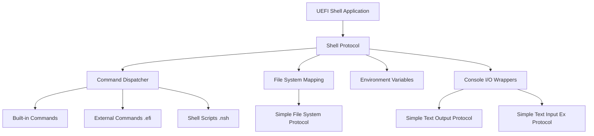
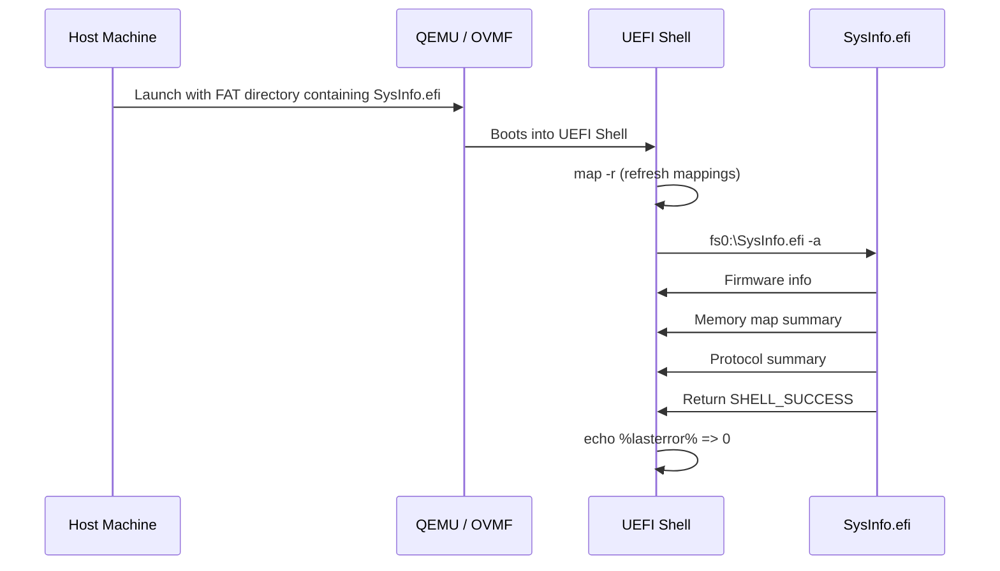

# Chapter 28: Custom Shell Command

This chapter walks you through building a fully functional UEFI Shell command from scratch. The command, called `sysinfo`, displays system information including firmware vendor, version, memory map summary, and installed protocol counts. Along the way you will learn the ShellPkg architecture, parameter parsing, HII-based help text, output formatting, and proper status-code handling.

---

## 28.1 UEFI Shell Overview

The UEFI Shell is a pre-OS command-line environment defined by the UEFI Shell Specification. It provides:

- A file-system navigation model (fs0:, fs1:, etc.)
- Script execution (.nsh files)
- Environment variables and command aliases
- A set of built-in commands (ls, cp, map, drivers, etc.)
- An extensible architecture for adding custom commands



The Shell itself is a UEFI application (`Shell.efi`) that installs the `EFI_SHELL_PROTOCOL` and `EFI_SHELL_PARAMETERS_PROTOCOL`. External commands are standalone `.efi` files placed on a file system accessible to the Shell.

---

## 28.2 ShellPkg Architecture

Project Mu (and EDK2) ship the ShellPkg package that contains:

| Component | Purpose |
|-----------|---------|
| `ShellPkg/Library/UefiShellLib` | Wrappers around Shell Protocol calls |
| `ShellPkg/Library/ShellCommandLib` | Command registration and dispatching |
| `ShellPkg/Library/ShellCEntryLib` | Provides a C-style `ShellAppMain` entry point |
| `ShellPkg/Include/Library/ShellLib.h` | Public API for shell operations |
| `ShellPkg/Include/Protocol/EfiShell.h` | Shell Protocol definition |

When you write an external shell command you typically link against `ShellCEntryLib`, which gives you an entry point that receives `Argc`/`Argv` just like a C `main()` function.


---

## 28.3 Project Structure

```
SysInfoPkg/
  SysInfoPkg.dsc
  SysInfo/
    SysInfo.c
    SysInfo.inf
    SysInfo.uni        (HII help strings)
```

---

## 28.4 The INF File

```ini
## @file
#  SysInfo - A custom UEFI Shell command that displays system information.
#
#  Copyright (c) 2026, Your Name. All rights reserved.
#  SPDX-License-Identifier: BSD-2-Clause-Patent
##

[Defines]
  INF_VERSION                    = 0x00010017
  BASE_NAME                      = SysInfo
  FILE_GUID                      = A1B2C3D4-1234-5678-9ABC-DEF012345678
  MODULE_TYPE                    = UEFI_APPLICATION
  VERSION_STRING                 = 1.0
  ENTRY_POINT                    = ShellCEntryLib

[Sources]
  SysInfo.c
  SysInfo.uni

[Packages]
  MdePkg/MdePkg.dec
  MdeModulePkg/MdeModulePkg.dec
  ShellPkg/ShellPkg.dec

[LibraryClasses]
  UefiApplicationEntryPoint
  ShellCEntryLib
  ShellLib
  UefiLib
  BaseMemoryLib
  MemoryAllocationLib
  UefiBootServicesTableLib
  UefiRuntimeServicesTableLib
  PrintLib
  HiiLib

[Protocols]
  gEfiLoadedImageProtocolGuid

[Guids]
  gEfiMemoryAttributesTableGuid
```

---

## 28.5 HII Help Strings (SysInfo.uni)

UEFI Shell commands register their help text through HII (Human Interface Infrastructure) string resources. This allows the Shell's `help` command to display usage information.

```
// SysInfo.uni
/=#

#langdef en-US "English"

#string STR_SYSINFO_HELP       #language en-US ""
".TH sysinfo 0 "Display system information."\r\n"
".SH NAME\r\n"
"sysinfo - Display firmware and system information.\r\n"
".SH SYNOPSIS\r\n"
"sysinfo [-v] [-m] [-p] [-a]\r\n"
".SH OPTIONS\r\n"
"  -v    Show firmware vendor and version.\r\n"
"  -m    Show memory map summary.\r\n"
"  -p    Show protocol database summary.\r\n"
"  -a    Show all information (default if no flags).\r\n"
".SH DESCRIPTION\r\n"
"  Displays information about the running UEFI firmware,\r\n"
"  memory layout, and installed protocol database.\r\n"
".SH EXAMPLES\r\n"
"  fs0:\\> sysinfo -v\r\n"
"  fs0:\\> sysinfo -a\r\n"
```

---

## 28.6 Command-Line Parameter Parsing

ShellPkg provides `ShellCommandLineParse` for structured parameter parsing. You define a parameter list with flags and whether each flag takes a value.

```c
#include <Library/ShellLib.h>

//
// Parameter definition table.
// Each entry: { flag-string, value-type, position }
// TypeFlag  = no argument
// TypeValue = requires an argument
//
STATIC SHELL_PARAM_ITEM  mParamList[] = {
  { L"-v", TypeFlag },
  { L"-m", TypeFlag },
  { L"-p", TypeFlag },
  { L"-a", TypeFlag },
  { NULL,  TypeMax  }    // Terminator
};
```

Then in your entry point:

```c
LIST_ENTRY    *CheckPackage = NULL;
EFI_STATUS    Status;

Status = ShellCommandLineParse (
           mParamList,
           &CheckPackage,
           NULL,    // ProblemParam (filled on error)
           TRUE     // AlwaysAllowNumbers
           );

if (EFI_ERROR (Status)) {
  ShellPrintEx (-1, -1, L"Error: invalid parameter.\r\n");
  return SHELL_INVALID_PARAMETER;
}

BOOLEAN ShowVendor   = ShellCommandLineGetFlag (CheckPackage, L"-v");
BOOLEAN ShowMemory   = ShellCommandLineGetFlag (CheckPackage, L"-m");
BOOLEAN ShowProtocol = ShellCommandLineGetFlag (CheckPackage, L"-p");
BOOLEAN ShowAll      = ShellCommandLineGetFlag (CheckPackage, L"-a");

// Default: show everything if no specific flag given
if (!ShowVendor && !ShowMemory && !ShowProtocol) {
  ShowAll = TRUE;
}
```

---

## 28.7 Complete Source Code (SysInfo.c)

```c
/** @file
  SysInfo -- Custom UEFI Shell command to display system information.

  Copyright (c) 2026, Your Name. All rights reserved.
  SPDX-License-Identifier: BSD-2-Clause-Patent
**/

#include <Uefi.h>
#include <Library/UefiLib.h>
#include <Library/ShellLib.h>
#include <Library/ShellCEntryLib.h>
#include <Library/UefiBootServicesTableLib.h>
#include <Library/UefiRuntimeServicesTableLib.h>
#include <Library/BaseMemoryLib.h>
#include <Library/MemoryAllocationLib.h>
#include <Library/PrintLib.h>
#include <Protocol/LoadedImage.h>

//
// Parameter definition table
//
STATIC SHELL_PARAM_ITEM  mParamList[] = {
  { L"-v", TypeFlag },
  { L"-m", TypeFlag },
  { L"-p", TypeFlag },
  { L"-a", TypeFlag },
  { L"-h", TypeFlag },
  { NULL,  TypeMax  }
};

/**
  Print a horizontal separator line.

  @param[in] Width   Number of characters wide.
**/
STATIC
VOID
PrintSeparator (
  IN UINTN  Width
  )
{
  UINTN  Index;

  for (Index = 0; Index < Width; Index++) {
    ShellPrintEx (-1, -1, L"-");
  }
  ShellPrintEx (-1, -1, L"\r\n");
}

/**
  Print a section header.

  @param[in] Title   Section title string.
**/
STATIC
VOID
PrintHeader (
  IN CONST CHAR16  *Title
  )
{
  ShellPrintEx (-1, -1, L"\r\n");
  PrintSeparator (60);
  ShellPrintEx (-1, -1, L"  %s\r\n", Title);
  PrintSeparator (60);
}

/**
  Display firmware vendor and version information.
**/
STATIC
VOID
ShowFirmwareInfo (
  VOID
  )
{
  PrintHeader (L"Firmware Information");

  ShellPrintEx (-1, -1, L"  Vendor       : %s\r\n",
                gST->FirmwareVendor);
  ShellPrintEx (-1, -1, L"  Revision     : 0x%08X (%d.%d)\r\n",
                gST->FirmwareRevision,
                gST->FirmwareRevision >> 16,
                gST->FirmwareRevision & 0xFFFF);
  ShellPrintEx (-1, -1, L"  UEFI Version : %d.%d.%d\r\n",
                gST->Hdr.Revision >> 16,
                (gST->Hdr.Revision >> 8) & 0xFF,
                gST->Hdr.Revision & 0xFF);
  ShellPrintEx (-1, -1, L"  System Table : 0x%016lX\r\n",
                (UINT64)(UINTN)gST);
  ShellPrintEx (-1, -1, L"  Boot Services: 0x%016lX\r\n",
                (UINT64)(UINTN)gBS);
  ShellPrintEx (-1, -1, L"  Runtime Svcs : 0x%016lX\r\n",
                (UINT64)(UINTN)gRT);

  //
  // Configuration table count
  //
  ShellPrintEx (-1, -1, L"  Config Tables: %d entries\r\n",
                gST->NumberOfTableEntries);
}

/**
  Display a memory map summary.
**/
STATIC
VOID
ShowMemoryMapSummary (
  VOID
  )
{
  EFI_STATUS             Status;
  UINTN                  MemoryMapSize;
  EFI_MEMORY_DESCRIPTOR  *MemoryMap;
  EFI_MEMORY_DESCRIPTOR  *Entry;
  UINTN                  MapKey;
  UINTN                  DescriptorSize;
  UINT32                 DescriptorVersion;
  UINTN                  EntryCount;
  UINTN                  Index;

  // Counters for each memory type category
  UINT64  ConventionalPages  = 0;
  UINT64  ReservedPages      = 0;
  UINT64  ACPIPages          = 0;
  UINT64  RuntimePages       = 0;
  UINT64  LoaderPages        = 0;
  UINT64  BootServicesPages  = 0;
  UINT64  MmioPages          = 0;
  UINT64  OtherPages         = 0;

  PrintHeader (L"Memory Map Summary");

  //
  // First call: determine required buffer size
  //
  MemoryMapSize = 0;
  MemoryMap     = NULL;

  Status = gBS->GetMemoryMap (
                  &MemoryMapSize,
                  MemoryMap,
                  &MapKey,
                  &DescriptorSize,
                  &DescriptorVersion
                  );

  if (Status != EFI_BUFFER_TOO_SMALL) {
    ShellPrintEx (-1, -1, L"  Error: GetMemoryMap failed: %r\r\n", Status);
    return;
  }

  //
  // Add extra space for map changes between calls
  //
  MemoryMapSize += 4 * DescriptorSize;
  MemoryMap = AllocatePool (MemoryMapSize);

  if (MemoryMap == NULL) {
    ShellPrintEx (-1, -1, L"  Error: memory allocation failed.\r\n");
    return;
  }

  Status = gBS->GetMemoryMap (
                  &MemoryMapSize,
                  MemoryMap,
                  &MapKey,
                  &DescriptorSize,
                  &DescriptorVersion
                  );

  if (EFI_ERROR (Status)) {
    ShellPrintEx (-1, -1, L"  Error: GetMemoryMap failed: %r\r\n", Status);
    FreePool (MemoryMap);
    return;
  }

  EntryCount = MemoryMapSize / DescriptorSize;

  //
  // Walk the memory map and accumulate page counts
  //
  for (Index = 0; Index < EntryCount; Index++) {
    Entry = (EFI_MEMORY_DESCRIPTOR *)((UINT8 *)MemoryMap +
                                       Index * DescriptorSize);

    switch (Entry->Type) {
      case EfiConventionalMemory:
        ConventionalPages += Entry->NumberOfPages;
        break;
      case EfiReservedMemoryType:
        ReservedPages += Entry->NumberOfPages;
        break;
      case EfiACPIReclaimMemory:
      case EfiACPIMemoryNVS:
        ACPIPages += Entry->NumberOfPages;
        break;
      case EfiRuntimeServicesCode:
      case EfiRuntimeServicesData:
        RuntimePages += Entry->NumberOfPages;
        break;
      case EfiLoaderCode:
      case EfiLoaderData:
        LoaderPages += Entry->NumberOfPages;
        break;
      case EfiBootServicesCode:
      case EfiBootServicesData:
        BootServicesPages += Entry->NumberOfPages;
        break;
      case EfiMemoryMappedIO:
      case EfiMemoryMappedIOPortSpace:
        MmioPages += Entry->NumberOfPages;
        break;
      default:
        OtherPages += Entry->NumberOfPages;
        break;
    }
  }

  ShellPrintEx (-1, -1, L"  Descriptor Count   : %d\r\n", EntryCount);
  ShellPrintEx (-1, -1, L"  Descriptor Size    : %d bytes\r\n", DescriptorSize);
  ShellPrintEx (-1, -1, L"  Descriptor Version : %d\r\n", DescriptorVersion);
  ShellPrintEx (-1, -1, L"\r\n");
  ShellPrintEx (-1, -1, L"  %-22s %10s %12s\r\n",
                L"Type", L"Pages", L"Size (KB)");
  PrintSeparator (50);
  ShellPrintEx (-1, -1, L"  %-22s %10ld %12ld\r\n",
                L"Conventional", ConventionalPages,
                ConventionalPages * 4);
  ShellPrintEx (-1, -1, L"  %-22s %10ld %12ld\r\n",
                L"Reserved", ReservedPages,
                ReservedPages * 4);
  ShellPrintEx (-1, -1, L"  %-22s %10ld %12ld\r\n",
                L"ACPI", ACPIPages,
                ACPIPages * 4);
  ShellPrintEx (-1, -1, L"  %-22s %10ld %12ld\r\n",
                L"Runtime Services", RuntimePages,
                RuntimePages * 4);
  ShellPrintEx (-1, -1, L"  %-22s %10ld %12ld\r\n",
                L"Loader", LoaderPages,
                LoaderPages * 4);
  ShellPrintEx (-1, -1, L"  %-22s %10ld %12ld\r\n",
                L"Boot Services", BootServicesPages,
                BootServicesPages * 4);
  ShellPrintEx (-1, -1, L"  %-22s %10ld %12ld\r\n",
                L"MMIO", MmioPages,
                MmioPages * 4);
  ShellPrintEx (-1, -1, L"  %-22s %10ld %12ld\r\n",
                L"Other", OtherPages,
                OtherPages * 4);

  UINT64 TotalPages = ConventionalPages + ReservedPages + ACPIPages +
                      RuntimePages + LoaderPages + BootServicesPages +
                      MmioPages + OtherPages;
  PrintSeparator (50);
  ShellPrintEx (-1, -1, L"  %-22s %10ld %12ld\r\n",
                L"TOTAL", TotalPages, TotalPages * 4);

  FreePool (MemoryMap);
}

/**
  Display a summary of installed protocol database.
**/
STATIC
VOID
ShowProtocolSummary (
  VOID
  )
{
  EFI_STATUS  Status;
  EFI_HANDLE  *HandleBuffer;
  UINTN       HandleCount;
  UINTN       TotalProtocols;
  UINTN       Index;

  PrintHeader (L"Protocol Database Summary");

  //
  // Locate all handles in the system
  //
  Status = gBS->LocateHandleBuffer (
                  AllHandles,
                  NULL,
                  NULL,
                  &HandleCount,
                  &HandleBuffer
                  );

  if (EFI_ERROR (Status)) {
    ShellPrintEx (-1, -1, L"  Error: LocateHandleBuffer failed: %r\r\n",
                  Status);
    return;
  }

  //
  // For each handle, count installed protocols
  //
  TotalProtocols = 0;

  for (Index = 0; Index < HandleCount; Index++) {
    EFI_GUID  **ProtocolGuidArray;
    UINTN     ProtocolCount;

    Status = gBS->ProtocolsPerHandle (
                    HandleBuffer[Index],
                    &ProtocolGuidArray,
                    &ProtocolCount
                    );

    if (!EFI_ERROR (Status)) {
      TotalProtocols += ProtocolCount;
      FreePool (ProtocolGuidArray);
    }
  }

  ShellPrintEx (-1, -1, L"  Total Handles    : %d\r\n", HandleCount);
  ShellPrintEx (-1, -1, L"  Total Protocols  : %d\r\n", TotalProtocols);
  ShellPrintEx (-1, -1, L"  Avg per Handle   : %d\r\n",
                HandleCount > 0 ? TotalProtocols / HandleCount : 0);

  FreePool (HandleBuffer);
}

/**
  Print short usage text.
**/
STATIC
VOID
PrintUsage (
  VOID
  )
{
  ShellPrintEx (-1, -1, L"Usage: sysinfo [-v] [-m] [-p] [-a] [-h]\r\n");
  ShellPrintEx (-1, -1, L"  -v  Firmware vendor and version\r\n");
  ShellPrintEx (-1, -1, L"  -m  Memory map summary\r\n");
  ShellPrintEx (-1, -1, L"  -p  Protocol database summary\r\n");
  ShellPrintEx (-1, -1, L"  -a  All information (default)\r\n");
  ShellPrintEx (-1, -1, L"  -h  This help text\r\n");
}

/**
  Entry point for the SysInfo shell command.

  @param[in] Argc  Argument count.
  @param[in] Argv  Argument vector.

  @retval SHELL_SUCCESS            Command completed successfully.
  @retval SHELL_INVALID_PARAMETER  Bad parameter supplied.
  @retval SHELL_ABORTED            Internal error.
**/
SHELL_STATUS
EFIAPI
ShellAppMain (
  IN UINTN   Argc,
  IN CHAR16  **Argv
  )
{
  EFI_STATUS    Status;
  LIST_ENTRY    *CheckPackage;
  CHAR16        *ProblemParam;
  BOOLEAN       ShowVendor;
  BOOLEAN       ShowMemory;
  BOOLEAN       ShowProtocol;
  BOOLEAN       ShowAll;
  BOOLEAN       ShowHelp;

  CheckPackage = NULL;
  ProblemParam = NULL;

  //
  // Parse command line parameters
  //
  Status = ShellCommandLineParse (
             mParamList,
             &CheckPackage,
             &ProblemParam,
             TRUE
             );

  if (EFI_ERROR (Status)) {
    if (ProblemParam != NULL) {
      ShellPrintEx (-1, -1, L"Error: unknown parameter '%s'\r\n",
                    ProblemParam);
      FreePool (ProblemParam);
    }
    return SHELL_INVALID_PARAMETER;
  }

  //
  // Read flags
  //
  ShowHelp     = ShellCommandLineGetFlag (CheckPackage, L"-h");
  ShowVendor   = ShellCommandLineGetFlag (CheckPackage, L"-v");
  ShowMemory   = ShellCommandLineGetFlag (CheckPackage, L"-m");
  ShowProtocol = ShellCommandLineGetFlag (CheckPackage, L"-p");
  ShowAll      = ShellCommandLineGetFlag (CheckPackage, L"-a");

  //
  // Help requested?
  //
  if (ShowHelp) {
    PrintUsage ();
    ShellCommandLineFreeVarList (CheckPackage);
    return SHELL_SUCCESS;
  }

  //
  // Default to "all" if no specific section requested
  //
  if (!ShowVendor && !ShowMemory && !ShowProtocol) {
    ShowAll = TRUE;
  }

  //
  // Banner
  //
  ShellPrintEx (-1, -1, L"\r\n  === SysInfo v1.0 ===\r\n");

  //
  // Display requested sections
  //
  if (ShowAll || ShowVendor) {
    ShowFirmwareInfo ();
  }

  if (ShowAll || ShowMemory) {
    ShowMemoryMapSummary ();
  }

  if (ShowAll || ShowProtocol) {
    ShowProtocolSummary ();
  }

  ShellPrintEx (-1, -1, L"\r\n");

  //
  // Clean up
  //
  ShellCommandLineFreeVarList (CheckPackage);

  return SHELL_SUCCESS;
}
```

---

## 28.8 Shell Status Codes

Shell commands return `SHELL_STATUS` values, not `EFI_STATUS`. The key return codes are:

| Value | Name | Meaning |
|-------|------|---------|
| 0 | `SHELL_SUCCESS` | Command completed without error |
| 1 | `SHELL_LOAD_ERROR` | Could not load a required image |
| 2 | `SHELL_INVALID_PARAMETER` | Bad argument or option |
| 3 | `SHELL_UNSUPPORTED` | Operation not supported |
| 5 | `SHELL_NOT_FOUND` | Requested item not found |
| 6 | `SHELL_ACCESS_DENIED` | Permission denied |
| 7 | `SHELL_ABORTED` | Internal error / abort |

The Shell uses the return value to set the `lasterror` environment variable, which scripts can test with `if`.

---

## 28.9 DSC Fragment for Building

Add the following to your platform DSC file (or create a standalone `SysInfoPkg.dsc`):

```ini
[Defines]
  PLATFORM_NAME           = SysInfoPkg
  PLATFORM_GUID           = 12345678-AAAA-BBBB-CCCC-DDDDEEEEFFFF
  PLATFORM_VERSION        = 1.0
  DSC_SPECIFICATION       = 0x0001001C
  OUTPUT_DIRECTORY        = Build/SysInfoPkg
  SUPPORTED_ARCHITECTURES = X64
  BUILD_TARGETS           = DEBUG|RELEASE|NOOPT
  SKUID_IDENTIFIER        = DEFAULT

[LibraryClasses]
  UefiApplicationEntryPoint|MdePkg/Library/UefiApplicationEntryPoint/UefiApplicationEntryPoint.inf
  ShellCEntryLib|ShellPkg/Library/UefiShellCEntryLib/UefiShellCEntryLib.inf
  ShellLib|ShellPkg/Library/UefiShellLib/UefiShellLib.inf
  UefiLib|MdePkg/Library/UefiLib/UefiLib.inf
  BaseLib|MdePkg/Library/BaseLib/BaseLib.inf
  BaseMemoryLib|MdePkg/Library/BaseMemoryLibRepStr/BaseMemoryLibRepStr.inf
  MemoryAllocationLib|MdePkg/Library/UefiMemoryAllocationLib/UefiMemoryAllocationLib.inf
  UefiBootServicesTableLib|MdePkg/Library/UefiBootServicesTableLib/UefiBootServicesTableLib.inf
  UefiRuntimeServicesTableLib|MdePkg/Library/UefiRuntimeServicesTableLib/UefiRuntimeServicesTableLib.inf
  PrintLib|MdePkg/Library/BasePrintLib/BasePrintLib.inf
  DebugLib|MdePkg/Library/UefiDebugLibConOut/UefiDebugLibConOut.inf
  DebugPrintErrorLevelLib|MdePkg/Library/BaseDebugPrintErrorLevelLib/BaseDebugPrintErrorLevelLib.inf
  PcdLib|MdePkg/Library/BasePcdLibNull/BasePcdLibNull.inf
  DevicePathLib|MdePkg/Library/UefiDevicePathLib/UefiDevicePathLib.inf
  FileHandleLib|MdePkg/Library/UefiFileHandleLib/UefiFileHandleLib.inf
  HiiLib|MdeModulePkg/Library/UefiHiiLib/UefiHiiLib.inf
  SortLib|MdeModulePkg/Library/UefiSortLib/UefiSortLib.inf
  UefiHiiServicesLib|MdeModulePkg/Library/UefiHiiServicesLib/UefiHiiServicesLib.inf

[Components]
  SysInfoPkg/SysInfo/SysInfo.inf
```

---

## 28.10 Building with Stuart

```bash
# From the workspace root
stuart_setup -c SysInfoPkg/PlatformBuild.py
stuart_update -c SysInfoPkg/PlatformBuild.py
stuart_build -c SysInfoPkg/PlatformBuild.py TOOL_CHAIN_TAG=GCC5
```

The resulting binary appears at:

```
Build/SysInfoPkg/DEBUG_GCC5/X64/SysInfo.efi
```

---

## 28.11 Testing in QEMU Shell



Step-by-step:

1. **Create a FAT directory:**

   ```bash
   mkdir -p /tmp/uefi-test
   cp Build/SysInfoPkg/DEBUG_GCC5/X64/SysInfo.efi /tmp/uefi-test/
   ```

2. **Launch QEMU with OVMF:**

   ```bash
   qemu-system-x86_64 \
     -bios /path/to/OVMF.fd \
     -drive file=fat:rw:/tmp/uefi-test,format=raw,media=disk \
     -net none \
     -nographic
   ```

3. **Run the command in Shell:**

   ```
   Shell> fs0:
   FS0:\> SysInfo.efi -a
   ```

   You should see firmware information, memory map summary, and protocol counts.

4. **Test individual flags:**

   ```
   FS0:\> SysInfo.efi -v
   FS0:\> SysInfo.efi -m
   FS0:\> SysInfo.efi -p
   ```

5. **Verify help:**

   ```
   FS0:\> SysInfo.efi -h
   ```

---

## 28.12 Extending the Command

Ideas for additional features:

- **`-t` flag** -- display configuration table GUIDs with human-readable names (ACPI, SMBIOS, etc.)
- **`-d` flag** -- dump the full memory map with physical address ranges
- **`-j` flag** -- output in a JSON-like text format for scripting
- **PCI enumeration** -- list PCI devices using `EFI_PCI_ROOT_BRIDGE_IO_PROTOCOL`

---

## 28.13 Key Takeaways

1. External Shell commands are UEFI applications that link against `ShellCEntryLib` for a `ShellAppMain` entry point with `Argc`/`Argv`.
2. Use `ShellCommandLineParse` and `ShellCommandLineGetFlag`/`GetValue` for structured parameter parsing.
3. HII `.uni` files provide the help text that `help <command>` displays.
4. Shell commands return `SHELL_STATUS` codes, not `EFI_STATUS`.
5. The `ShellPrintEx` function is the recommended output function -- it handles console pagination and formatting.
6. Testing in QEMU with a FAT directory is the fastest feedback loop for command development.

---

{: .note }
> **Complete source code**: The full working example for this chapter is available at [`examples/UefiMuGuidePkg/ShellCommand/`](https://github.com/MichaelTien8901/uefi-mu-guide-tutorial/tree/main/examples/UefiMuGuidePkg/ShellCommand).

## Summary

You now have a complete, working UEFI Shell command that demonstrates the full lifecycle: defining parameters, parsing them, accessing UEFI services, formatting output, and returning proper status codes. This pattern extends naturally to any shell utility you need to build.
