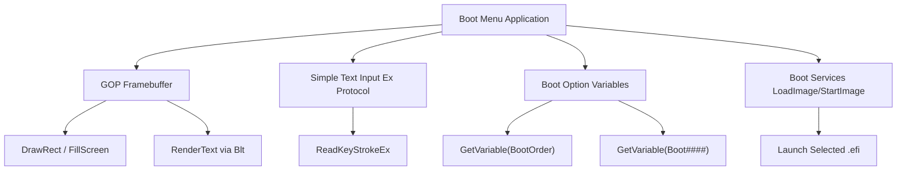
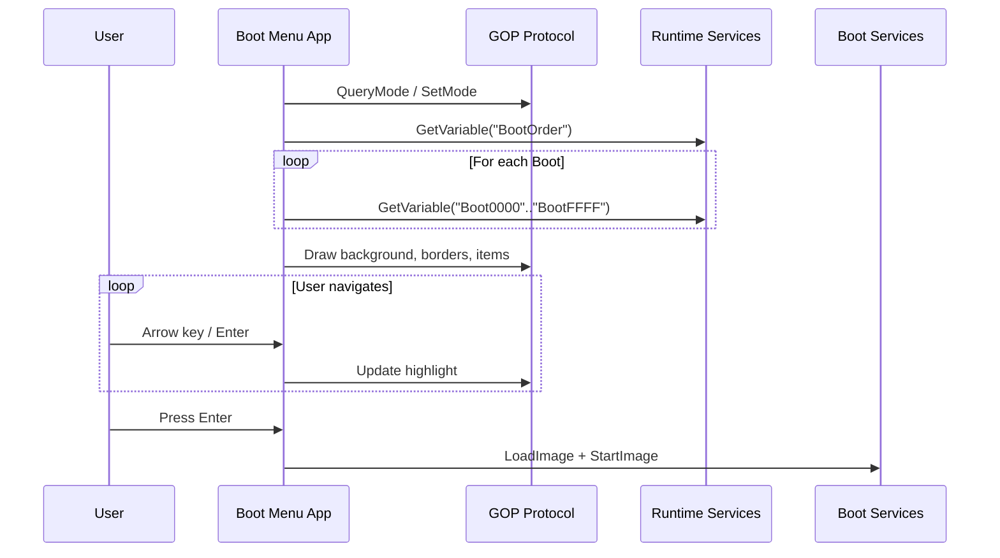

# Chapter 29: Graphical Boot Menu

This chapter builds a graphical boot menu application that combines the Graphics Output Protocol (GOP) for pixel-level rendering with console input for keyboard navigation. The menu enumerates boot options stored in UEFI variables, displays them in a styled, navigable list, and launches the user's selection.

---

## 29.1 Architecture Overview





---

## 29.2 Boot Option Variables

UEFI stores boot options in NVRAM variables under the `EFI_GLOBAL_VARIABLE` GUID:

| Variable | Type | Description |
|----------|------|-------------|
| `BootOrder` | `UINT16[]` | Ordered list of boot option numbers |
| `Boot0000`..`BootFFFF` | `EFI_LOAD_OPTION` | Individual boot option descriptors |

The `EFI_LOAD_OPTION` structure is:

```c
typedef struct {
  UINT32  Attributes;             // LOAD_OPTION_ACTIVE, etc.
  UINT16  FilePathListLength;     // Bytes in FilePathList
  // CHAR16 Description[];         // Null-terminated display name
  // EFI_DEVICE_PATH FilePathList; // Device path to boot target
  // UINT8  OptionalData[];        // Vendor-specific data
} EFI_LOAD_OPTION;
```

The fields after `FilePathListLength` are variable-length and packed sequentially.

---

## 29.3 Enumerating Boot Options

```c
/**
  Read BootOrder variable and populate the boot option list.

  @param[out] Options    Array of BOOT_MENU_ENTRY structures.
  @param[out] Count      Number of entries populated.

  @retval EFI_SUCCESS    Boot options read successfully.
**/
STATIC
EFI_STATUS
EnumerateBootOptions (
  OUT BOOT_MENU_ENTRY  **Options,
  OUT UINTN            *Count
  )
{
  EFI_STATUS  Status;
  UINT16      *BootOrder;
  UINTN       BootOrderSize;
  UINTN       OptionCount;
  UINTN       Index;

  BootOrder     = NULL;
  BootOrderSize = 0;

  //
  // Read BootOrder variable
  //
  Status = gRT->GetVariable (
                  L"BootOrder",
                  &gEfiGlobalVariableGuid,
                  NULL,
                  &BootOrderSize,
                  NULL
                  );

  if (Status != EFI_BUFFER_TOO_SMALL) {
    return EFI_NOT_FOUND;
  }

  BootOrder = AllocatePool (BootOrderSize);
  if (BootOrder == NULL) {
    return EFI_OUT_OF_RESOURCES;
  }

  Status = gRT->GetVariable (
                  L"BootOrder",
                  &gEfiGlobalVariableGuid,
                  NULL,
                  &BootOrderSize,
                  BootOrder
                  );

  if (EFI_ERROR (Status)) {
    FreePool (BootOrder);
    return Status;
  }

  OptionCount = BootOrderSize / sizeof (UINT16);

  *Options = AllocateZeroPool (OptionCount * sizeof (BOOT_MENU_ENTRY));
  if (*Options == NULL) {
    FreePool (BootOrder);
    return EFI_OUT_OF_RESOURCES;
  }

  *Count = 0;

  for (Index = 0; Index < OptionCount; Index++) {
    CHAR16  VariableName[16];
    UINT8   *OptionData;
    UINTN   OptionSize;

    UnicodeSPrint (VariableName, sizeof (VariableName),
                   L"Boot%04X", BootOrder[Index]);

    OptionSize = 0;
    Status = gRT->GetVariable (
                    VariableName,
                    &gEfiGlobalVariableGuid,
                    NULL,
                    &OptionSize,
                    NULL
                    );

    if (Status != EFI_BUFFER_TOO_SMALL) {
      continue;
    }

    OptionData = AllocatePool (OptionSize);
    if (OptionData == NULL) {
      continue;
    }

    Status = gRT->GetVariable (
                    VariableName,
                    &gEfiGlobalVariableGuid,
                    NULL,
                    &OptionSize,
                    OptionData
                    );

    if (EFI_ERROR (Status)) {
      FreePool (OptionData);
      continue;
    }

    //
    // Parse EFI_LOAD_OPTION
    //
    UINT32  Attributes        = *(UINT32 *)OptionData;
    UINT16  FilePathListLen   = *(UINT16 *)(OptionData + 4);
    CHAR16  *Description      = (CHAR16 *)(OptionData + 6);

    //
    // Skip inactive options
    //
    if ((Attributes & LOAD_OPTION_ACTIVE) == 0) {
      FreePool (OptionData);
      continue;
    }

    //
    // Populate menu entry
    //
    BOOT_MENU_ENTRY  *Entry = &((*Options)[*Count]);
    Entry->BootNumber = BootOrder[Index];
    StrnCpyS (Entry->Description, BOOT_DESC_MAX, Description,
              BOOT_DESC_MAX - 1);

    UINTN DescBytes = StrSize (Description);
    Entry->DevicePath = DuplicateDevicePath (
                          (EFI_DEVICE_PATH_PROTOCOL *)(OptionData + 6 + DescBytes)
                          );

    Entry->RawData     = OptionData;  // Caller frees
    Entry->RawDataSize = OptionSize;

    (*Count)++;
  }

  FreePool (BootOrder);
  return EFI_SUCCESS;
}
```

---

## 29.4 GOP Drawing Primitives

The following helper functions perform basic framebuffer drawing through the `EFI_GRAPHICS_OUTPUT_PROTOCOL`:

```c
#define COLOR_BG        {0x20, 0x20, 0x30, 0x00}  // Dark blue-gray
#define COLOR_BORDER    {0x60, 0x80, 0xC0, 0x00}  // Steel blue
#define COLOR_ITEM_BG   {0x30, 0x30, 0x40, 0x00}  // Slightly lighter
#define COLOR_HIGHLIGHT {0x40, 0x60, 0xA0, 0x00}  // Bright selection
#define COLOR_TEXT      {0xFF, 0xFF, 0xFF, 0x00}  // White

/**
  Fill a rectangle on the framebuffer.

  @param[in] Gop     Graphics Output Protocol instance.
  @param[in] Color   Fill color.
  @param[in] X       Left coordinate.
  @param[in] Y       Top coordinate.
  @param[in] Width   Rectangle width in pixels.
  @param[in] Height  Rectangle height in pixels.
**/
STATIC
VOID
FillRect (
  IN EFI_GRAPHICS_OUTPUT_PROTOCOL       *Gop,
  IN EFI_GRAPHICS_OUTPUT_BLT_PIXEL      Color,
  IN UINTN                              X,
  IN UINTN                              Y,
  IN UINTN                              Width,
  IN UINTN                              Height
  )
{
  //
  // Create a single-pixel buffer and Blt with EfiBltVideoFill
  //
  Gop->Blt (
         Gop,
         &Color,
         EfiBltVideoFill,
         0, 0,           // Source (ignored for fill)
         X, Y,           // Destination
         Width, Height,
         0               // Delta (ignored for fill)
         );
}

/**
  Draw a bordered box.

  @param[in] Gop          GOP instance.
  @param[in] X, Y         Top-left corner.
  @param[in] W, H         Outer dimensions.
  @param[in] BorderWidth  Border thickness in pixels.
  @param[in] BorderColor  Color for the border.
  @param[in] FillColor    Color for the interior.
**/
STATIC
VOID
DrawBox (
  IN EFI_GRAPHICS_OUTPUT_PROTOCOL   *Gop,
  IN UINTN                          X,
  IN UINTN                          Y,
  IN UINTN                          W,
  IN UINTN                          H,
  IN UINTN                          BorderWidth,
  IN EFI_GRAPHICS_OUTPUT_BLT_PIXEL  BorderColor,
  IN EFI_GRAPHICS_OUTPUT_BLT_PIXEL  FillColor
  )
{
  // Border (draw as four rects to avoid overdraw)
  FillRect (Gop, BorderColor, X, Y, W, BorderWidth);                     // Top
  FillRect (Gop, BorderColor, X, Y + H - BorderWidth, W, BorderWidth);   // Bottom
  FillRect (Gop, BorderColor, X, Y, BorderWidth, H);                     // Left
  FillRect (Gop, BorderColor, X + W - BorderWidth, Y, BorderWidth, H);   // Right

  // Interior fill
  FillRect (Gop, FillColor,
            X + BorderWidth, Y + BorderWidth,
            W - 2 * BorderWidth, H - 2 * BorderWidth);
}

/**
  Fill the entire screen with a solid color.
**/
STATIC
VOID
ClearScreen (
  IN EFI_GRAPHICS_OUTPUT_PROTOCOL       *Gop,
  IN EFI_GRAPHICS_OUTPUT_BLT_PIXEL      Color
  )
{
  EFI_GRAPHICS_OUTPUT_MODE_INFORMATION  *Info = Gop->Mode->Info;

  FillRect (Gop, Color, 0, 0,
            Info->HorizontalResolution,
            Info->VerticalResolution);
}
```

---

## 29.5 Text Rendering

UEFI does not provide a pixel-level font API through GOP alone. The simplest approach is to use `EFI_SIMPLE_TEXT_OUTPUT_PROTOCOL` alongside GOP. The text console is overlaid on the framebuffer:

```c
/**
  Position the text cursor and print a string using the console.

  @param[in] Con    SimpleTextOutput protocol.
  @param[in] Col    Column (character position).
  @param[in] Row    Row (character position).
  @param[in] Attr   Text attribute (foreground | background).
  @param[in] Fmt    Format string.
  @param[in] ...    Format arguments.
**/
STATIC
VOID
EFIAPI
PrintAt (
  IN EFI_SIMPLE_TEXT_OUTPUT_PROTOCOL  *Con,
  IN UINTN                           Col,
  IN UINTN                           Row,
  IN UINTN                           Attr,
  IN CONST CHAR16                    *Fmt,
  ...
  )
{
  VA_LIST  Args;
  CHAR16   Buffer[256];

  Con->SetCursorPosition (Con, Col, Row);
  Con->SetAttribute (Con, Attr);

  VA_START (Args, Fmt);
  UnicodeVSPrint (Buffer, sizeof (Buffer), Fmt, Args);
  VA_END (Args);

  Con->OutputString (Con, Buffer);
}
```

For fully graphical text rendering independent of the console, you would implement a bitmap font renderer that blits character glyphs into the GOP framebuffer. That approach is covered in the HII font protocol (`EFI_HII_FONT_PROTOCOL`).

---

## 29.6 Rendering the Menu

```c
#define MENU_START_ROW    4
#define MENU_START_COL    4
#define MENU_ITEM_HEIGHT  1    // rows per item

/**
  Draw the complete boot menu.

  @param[in] Con         Console output for text.
  @param[in] Options     Array of boot menu entries.
  @param[in] Count       Number of entries.
  @param[in] Selected    Currently highlighted index.
**/
STATIC
VOID
DrawMenu (
  IN EFI_SIMPLE_TEXT_OUTPUT_PROTOCOL  *Con,
  IN BOOT_MENU_ENTRY                 *Options,
  IN UINTN                           Count,
  IN UINTN                           Selected
  )
{
  UINTN  Index;
  UINTN  Row;
  UINTN  Attr;

  //
  // Title bar
  //
  PrintAt (Con, MENU_START_COL, 1,
           EFI_WHITE | EFI_BACKGROUND_BLUE,
           L"  Boot Menu  -  Use Arrow Keys, Enter to Select  ");

  //
  // Separator
  //
  PrintAt (Con, MENU_START_COL, 3,
           EFI_LIGHTGRAY | EFI_BACKGROUND_BLACK,
           L"----------------------------------------------------");

  //
  // Menu items
  //
  for (Index = 0; Index < Count; Index++) {
    Row = MENU_START_ROW + Index * MENU_ITEM_HEIGHT;

    if (Index == Selected) {
      Attr = EFI_WHITE | EFI_BACKGROUND_CYAN;
    } else {
      Attr = EFI_LIGHTGRAY | EFI_BACKGROUND_BLACK;
    }

    //
    // Format: "  [Boot####]  Description                       "
    //
    PrintAt (Con, MENU_START_COL, Row, Attr,
             L"  [Boot%04X]  %-40s",
             Options[Index].BootNumber,
             Options[Index].Description);
  }

  //
  // Footer
  //
  Row = MENU_START_ROW + Count * MENU_ITEM_HEIGHT + 1;
  PrintAt (Con, MENU_START_COL, Row,
           EFI_LIGHTGRAY | EFI_BACKGROUND_BLACK,
           L"----------------------------------------------------");
  PrintAt (Con, MENU_START_COL, Row + 1,
           EFI_YELLOW | EFI_BACKGROUND_BLACK,
           L"  UP/DOWN: Navigate   ENTER: Boot   ESC: Reboot     ");
}
```

---

## 29.7 Keyboard Navigation Loop

```c
/**
  Main input loop for the boot menu.

  @param[in] Options   Boot option list.
  @param[in] Count     Number of options.

  @retval  Index of selected option, or (UINTN)-1 for ESC/reboot.
**/
STATIC
UINTN
RunMenuLoop (
  IN BOOT_MENU_ENTRY  *Options,
  IN UINTN            Count
  )
{
  EFI_STATUS                         Status;
  EFI_SIMPLE_TEXT_INPUT_EX_PROTOCOL  *InputEx;
  EFI_KEY_DATA                       KeyData;
  UINTN                              Selected;

  Selected = 0;

  //
  // Locate extended input protocol for key data
  //
  Status = gBS->LocateProtocol (
                  &gEfiSimpleTextInputExProtocolGuid,
                  NULL,
                  (VOID **)&InputEx
                  );

  if (EFI_ERROR (Status)) {
    //
    // Fall back to simple text input
    //
    InputEx = NULL;
  }

  //
  // Initial draw
  //
  DrawMenu (gST->ConOut, Options, Count, Selected);

  while (TRUE) {
    //
    // Wait for a key event
    //
    UINTN  EventIndex;
    gBS->WaitForEvent (1, &gST->ConIn->WaitForKey, &EventIndex);

    if (InputEx != NULL) {
      Status = InputEx->ReadKeyStrokeEx (InputEx, &KeyData);
    } else {
      EFI_INPUT_KEY  Key;
      Status = gST->ConIn->ReadKeyStroke (gST->ConIn, &Key);
      KeyData.Key = Key;
    }

    if (EFI_ERROR (Status)) {
      continue;
    }

    switch (KeyData.Key.ScanCode) {
      case SCAN_UP:
        if (Selected > 0) {
          Selected--;
        } else {
          Selected = Count - 1;  // Wrap around
        }
        DrawMenu (gST->ConOut, Options, Count, Selected);
        break;

      case SCAN_DOWN:
        if (Selected < Count - 1) {
          Selected++;
        } else {
          Selected = 0;  // Wrap around
        }
        DrawMenu (gST->ConOut, Options, Count, Selected);
        break;

      case SCAN_ESC:
        return (UINTN)-1;

      case SCAN_NULL:
        //
        // Check UnicodeChar for Enter
        //
        if (KeyData.Key.UnicodeChar == CHAR_CARRIAGE_RETURN) {
          return Selected;
        }
        break;
    }
  }
}
```

---

## 29.8 Launching a Boot Option

```c
/**
  Launch the selected boot option.

  @param[in] Entry   The boot menu entry to launch.

  @retval EFI_SUCCESS         Image started (may return on failure).
  @retval EFI_NOT_FOUND       Could not load image.
**/
STATIC
EFI_STATUS
LaunchBootOption (
  IN BOOT_MENU_ENTRY  *Entry
  )
{
  EFI_STATUS                 Status;
  EFI_HANDLE                 ImageHandle;
  EFI_DEVICE_PATH_PROTOCOL   *DevicePath;

  DevicePath = Entry->DevicePath;

  if (DevicePath == NULL) {
    Print (L"Error: no device path for Boot%04X\r\n", Entry->BootNumber);
    return EFI_NOT_FOUND;
  }

  //
  // Load the boot image
  //
  Status = gBS->LoadImage (
                  TRUE,                // BootPolicy
                  gImageHandle,        // Parent image
                  DevicePath,
                  NULL,                // SourceBuffer
                  0,                   // SourceSize
                  &ImageHandle
                  );

  if (EFI_ERROR (Status)) {
    Print (L"Error: LoadImage failed for Boot%04X: %r\r\n",
           Entry->BootNumber, Status);
    return Status;
  }

  //
  // Start the image
  //
  Status = gBS->StartImage (ImageHandle, NULL, NULL);

  //
  // If StartImage returns, the boot target exited or failed.
  // We return to the menu.
  //
  Print (L"Boot%04X returned: %r\r\n", Entry->BootNumber, Status);
  gBS->Stall (2000000);  // 2 second pause

  return Status;
}
```

---

## 29.9 Complete Main Entry Point

```c
/** @file
  BootMenu -- Graphical boot menu UEFI application.

  Copyright (c) 2026, Your Name. All rights reserved.
  SPDX-License-Identifier: BSD-2-Clause-Patent
**/

#include <Uefi.h>
#include <Library/UefiLib.h>
#include <Library/UefiBootServicesTableLib.h>
#include <Library/UefiRuntimeServicesTableLib.h>
#include <Library/BaseMemoryLib.h>
#include <Library/MemoryAllocationLib.h>
#include <Library/PrintLib.h>
#include <Library/DevicePathLib.h>
#include <Protocol/GraphicsOutput.h>
#include <Protocol/SimpleTextInEx.h>
#include <Guid/GlobalVariable.h>

#define BOOT_DESC_MAX  80
#define LOAD_OPTION_ACTIVE  0x00000001

typedef struct {
  UINT16                       BootNumber;
  CHAR16                       Description[BOOT_DESC_MAX];
  EFI_DEVICE_PATH_PROTOCOL     *DevicePath;
  UINT8                        *RawData;
  UINTN                        RawDataSize;
} BOOT_MENU_ENTRY;

// (Include all functions from sections 29.3 through 29.8 above)

/**
  Application entry point.
**/
EFI_STATUS
EFIAPI
UefiMain (
  IN EFI_HANDLE        ImageHandle,
  IN EFI_SYSTEM_TABLE  *SystemTable
  )
{
  EFI_STATUS                    Status;
  EFI_GRAPHICS_OUTPUT_PROTOCOL  *Gop;
  BOOT_MENU_ENTRY               *Options;
  UINTN                         OptionCount;
  UINTN                         Selection;

  //
  // Locate GOP (optional -- we can work with console-only too)
  //
  Status = gBS->LocateProtocol (
                  &gEfiGraphicsOutputProtocolGuid,
                  NULL,
                  (VOID **)&Gop
                  );

  if (!EFI_ERROR (Status)) {
    //
    // Clear screen with background color
    //
    EFI_GRAPHICS_OUTPUT_BLT_PIXEL BgColor = COLOR_BG;
    ClearScreen (Gop, BgColor);
  }

  //
  // Disable cursor for cleaner menu rendering
  //
  gST->ConOut->EnableCursor (gST->ConOut, FALSE);
  gST->ConOut->ClearScreen (gST->ConOut);

  //
  // Enumerate boot options from UEFI variables
  //
  Status = EnumerateBootOptions (&Options, &OptionCount);

  if (EFI_ERROR (Status) || OptionCount == 0) {
    Print (L"No boot options found. Dropping to Shell.\r\n");
    return EFI_NOT_FOUND;
  }

  //
  // Run the interactive menu
  //
  while (TRUE) {
    Selection = RunMenuLoop (Options, OptionCount);

    if (Selection == (UINTN)-1) {
      //
      // User pressed ESC -- reset system
      //
      gRT->ResetSystem (EfiResetCold, EFI_SUCCESS, 0, NULL);
      // Should not return
      CpuDeadLoop ();
    }

    //
    // Attempt to boot the selected option
    //
    Status = LaunchBootOption (&Options[Selection]);

    //
    // If boot returns, redraw menu
    //
    gST->ConOut->ClearScreen (gST->ConOut);
    if (!EFI_ERROR (Status) && Gop != NULL) {
      EFI_GRAPHICS_OUTPUT_BLT_PIXEL BgColor = COLOR_BG;
      ClearScreen (Gop, BgColor);
    }
  }

  // Unreachable
  return EFI_SUCCESS;
}
```

---

## 29.10 INF File

```ini
[Defines]
  INF_VERSION       = 0x00010017
  BASE_NAME         = BootMenu
  FILE_GUID         = B1B2C3D4-5678-9ABC-DEF0-123456789ABC
  MODULE_TYPE       = UEFI_APPLICATION
  VERSION_STRING    = 1.0
  ENTRY_POINT       = UefiMain

[Sources]
  BootMenu.c

[Packages]
  MdePkg/MdePkg.dec
  MdeModulePkg/MdeModulePkg.dec

[LibraryClasses]
  UefiApplicationEntryPoint
  UefiLib
  UefiBootServicesTableLib
  UefiRuntimeServicesTableLib
  BaseMemoryLib
  MemoryAllocationLib
  PrintLib
  DevicePathLib

[Protocols]
  gEfiGraphicsOutputProtocolGuid
  gEfiSimpleTextInputExProtocolGuid

[Guids]
  gEfiGlobalVariableGuid
```

---

## 29.11 Custom Styling and Branding

You can extend the menu with vendor branding:

```c
/**
  Draw a logo bitmap at the top of the screen.

  In production firmware this would use EFI_HII_IMAGE_PROTOCOL or
  load a BMP from FV. For simplicity, we draw a colored banner.
**/
STATIC
VOID
DrawBanner (
  IN EFI_GRAPHICS_OUTPUT_PROTOCOL  *Gop
  )
{
  EFI_GRAPHICS_OUTPUT_BLT_PIXEL BannerColor = {0x00, 0x50, 0xA0, 0x00};
  UINTN Width  = Gop->Mode->Info->HorizontalResolution;

  // Full-width banner, 80 pixels tall
  FillRect (Gop, BannerColor, 0, 0, Width, 80);
}
```

For loading an actual BMP image:

1. Include the BMP in the firmware volume (FV) as a `RAW` file.
2. Use `gBS->LocateProtocol` to find `EFI_HII_IMAGE_PROTOCOL`.
3. Call `NewImage` / `DrawImage` to render it.

Alternatively, decode the BMP manually:

```c
// Simplified BMP header check and pixel extraction
typedef struct {
  CHAR8   Signature[2];    // 'B', 'M'
  UINT32  FileSize;
  UINT32  Reserved;
  UINT32  DataOffset;
  UINT32  HeaderSize;
  INT32   Width;
  INT32   Height;
  UINT16  Planes;
  UINT16  BitsPerPixel;
  // ... compression, etc.
} BMP_HEADER;
```

---

## 29.12 Testing in QEMU

```bash
# Build the boot menu application
stuart_build -c Platforms/YourPlatform/PlatformBuild.py

# Create a test disk image with multiple boot options
mkdir -p /tmp/boot-test/EFI/BOOT
cp Build/BootMenuPkg/DEBUG_GCC5/X64/BootMenu.efi \
   /tmp/boot-test/EFI/BOOT/BOOTX64.EFI

# Launch QEMU with OVMF
qemu-system-x86_64 \
  -bios OVMF.fd \
  -drive file=fat:rw:/tmp/boot-test,format=raw,media=disk \
  -device virtio-gpu-pci \
  -display gtk \
  -m 256
```

To test with actual boot options you need to set UEFI variables. You can use the UEFI Shell `bcfg` command:

```
Shell> bcfg boot add 0 fs0:\EFI\BOOT\Shell.efi "UEFI Shell"
Shell> bcfg boot add 1 fs0:\EFI\BOOT\grubx64.efi "GRUB Bootloader"
```

Then reboot into the boot menu to see those entries listed.

---

## 29.13 Advanced Topics

### Timeout and Auto-Boot

```c
/**
  If no key is pressed within TimeoutSeconds, auto-boot the first entry.
**/
STATIC
UINTN
RunMenuLoopWithTimeout (
  IN BOOT_MENU_ENTRY  *Options,
  IN UINTN            Count,
  IN UINTN            TimeoutSeconds
  )
{
  UINTN    Remaining = TimeoutSeconds;
  UINTN    Selected  = 0;

  DrawMenu (gST->ConOut, Options, Count, Selected);

  while (Remaining > 0) {
    PrintAt (gST->ConOut, 4, MENU_START_ROW + Count + 3,
             EFI_YELLOW | EFI_BACKGROUND_BLACK,
             L"  Auto-boot in %2d seconds...  ", Remaining);

    //
    // Wait 1 second or until key press
    //
    EFI_EVENT  TimerEvent;
    gBS->CreateEvent (EVT_TIMER, 0, NULL, NULL, &TimerEvent);
    gBS->SetTimer (TimerEvent, TimerRelative, 10000000); // 1 second

    UINTN      EventIndex;
    EFI_EVENT  WaitEvents[2];
    WaitEvents[0] = gST->ConIn->WaitForKey;
    WaitEvents[1] = TimerEvent;

    gBS->WaitForEvent (2, WaitEvents, &EventIndex);
    gBS->CloseEvent (TimerEvent);

    if (EventIndex == 0) {
      // Key pressed -- enter interactive mode
      return RunMenuLoop (Options, Count);
    }

    Remaining--;
  }

  return 0;  // Auto-boot first entry
}
```

### Mouse/Touch Support

For platforms with `EFI_SIMPLE_POINTER_PROTOCOL` or `EFI_ABSOLUTE_POINTER_PROTOCOL`, you can add mouse/touch input by polling the pointer state and mapping coordinates to menu item positions.

---

## 29.14 Key Takeaways

1. GOP provides pixel-level framebuffer access through `Blt` operations -- `EfiBltVideoFill` is the workhorse for solid rectangles.
2. The console text output (`SimpleTextOutput`) can be used alongside GOP for text rendering without implementing a bitmap font.
3. Boot options are stored as `BootOrder` + `Boot####` UEFI variables; parse the packed `EFI_LOAD_OPTION` structure to extract descriptions and device paths.
4. `LoadImage` + `StartImage` launches a boot target; if it returns, you can fall back to the menu.
5. Keyboard navigation uses `WaitForEvent` on the console input event, then `ReadKeyStroke` or `ReadKeyStrokeEx`.
6. Timeouts use `CreateEvent` / `SetTimer` with `TimerRelative` to implement auto-boot countdowns.

---

## Summary

This project demonstrates how to build an interactive, graphical boot menu that ties together display output, user input, UEFI variable storage, and image loading. The patterns here form the foundation for production boot managers and pre-boot UI applications found in modern firmware.
