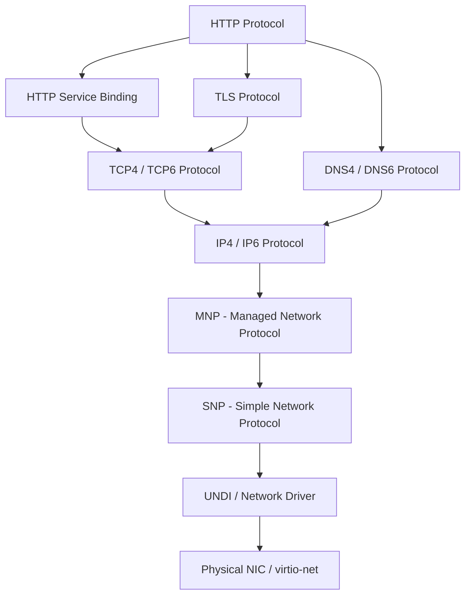
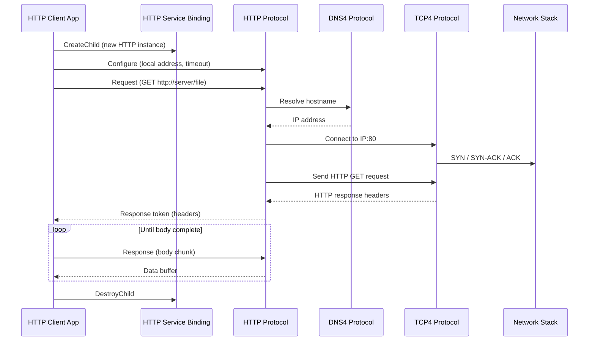
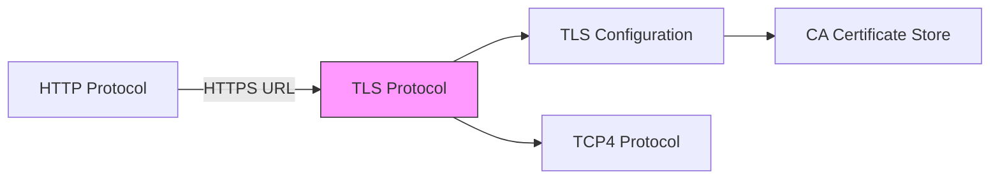

# Chapter 30: Network Application

This chapter builds a UEFI HTTP client application that downloads a file from a web server. Along the way you will learn DNS resolution, TCP connection management, HTTP request/response handling, TLS basics, and QEMU network configuration.

---

## 30.1 UEFI Network Stack Overview

UEFI provides a layered network stack through a series of protocols:



| Layer | Protocol | Purpose |
|-------|----------|---------|
| Application | `EFI_HTTP_PROTOCOL` | HTTP/HTTPS request/response |
| Transport | `EFI_TCP4_PROTOCOL` | TCP connections |
| Network | `EFI_IP4_PROTOCOL` | IP routing, fragmentation |
| Data Link | `EFI_MANAGED_NETWORK_PROTOCOL` | Frame TX/RX |
| Physical | `EFI_SIMPLE_NETWORK_PROTOCOL` | NIC hardware abstraction |
| Resolution | `EFI_DNS4_PROTOCOL` | DNS name resolution |
| Security | `EFI_TLS_PROTOCOL` | TLS 1.2/1.3 encryption |

---

## 30.2 Project Architecture



---

## 30.3 Locating the Network Interface

Before using HTTP, you need a configured network interface. UEFI firmware typically runs DHCP during the network stack initialization, but you may need to trigger it manually:

```c
#include <Uefi.h>
#include <Library/UefiLib.h>
#include <Library/UefiBootServicesTableLib.h>
#include <Library/BaseMemoryLib.h>
#include <Library/MemoryAllocationLib.h>
#include <Library/PrintLib.h>
#include <Protocol/Http.h>
#include <Protocol/ServiceBinding.h>
#include <Protocol/Ip4Config2.h>

/**
  Ensure the network interface has an IP address via DHCP.

  @param[in] NicHandle   Handle with IP4Config2 protocol.

  @retval EFI_SUCCESS     IP address acquired.
**/
STATIC
EFI_STATUS
EnsureNetworkConfigured (
  IN EFI_HANDLE  NicHandle
  )
{
  EFI_STATUS                  Status;
  EFI_IP4_CONFIG2_PROTOCOL    *Ip4Config2;
  EFI_IP4_CONFIG2_POLICY      Policy;
  UINTN                       DataSize;
  EFI_IP4_CONFIG2_INTERFACE_INFO  *IfInfo;

  Status = gBS->HandleProtocol (
                  NicHandle,
                  &gEfiIp4Config2ProtocolGuid,
                  (VOID **)&Ip4Config2
                  );

  if (EFI_ERROR (Status)) {
    return Status;
  }

  //
  // Set DHCP policy
  //
  Policy = Ip4Config2PolicyDhcp;
  Status = Ip4Config2->SetData (
                         Ip4Config2,
                         Ip4Config2DataTypePolicy,
                         sizeof (Policy),
                         &Policy
                         );

  if (EFI_ERROR (Status) && Status != EFI_ALREADY_STARTED) {
    Print (L"Warning: SetData(Policy) = %r\r\n", Status);
  }

  //
  // Wait a moment for DHCP to complete
  //
  gBS->Stall (3000000);  // 3 seconds

  //
  // Verify we have an IP address
  //
  DataSize = 0;
  Status = Ip4Config2->GetData (
                         Ip4Config2,
                         Ip4Config2DataTypeInterfaceInfo,
                         &DataSize,
                         NULL
                         );

  if (Status != EFI_BUFFER_TOO_SMALL) {
    Print (L"Error: No interface info available.\r\n");
    return EFI_NOT_READY;
  }

  IfInfo = AllocatePool (DataSize);
  Status = Ip4Config2->GetData (
                         Ip4Config2,
                         Ip4Config2DataTypeInterfaceInfo,
                         &DataSize,
                         IfInfo
                         );

  if (!EFI_ERROR (Status)) {
    Print (L"IP Address: %d.%d.%d.%d\r\n",
           IfInfo->StationAddress.Addr[0],
           IfInfo->StationAddress.Addr[1],
           IfInfo->StationAddress.Addr[2],
           IfInfo->StationAddress.Addr[3]);
  }

  FreePool (IfInfo);
  return Status;
}
```

---

## 30.4 Creating an HTTP Instance

HTTP in UEFI uses the service binding pattern:

```c
/**
  Create an HTTP child instance ready for use.

  @param[out] HttpHandle     The created child handle.
  @param[out] Http           The HTTP protocol on that handle.

  @retval EFI_SUCCESS        Instance created and configured.
**/
STATIC
EFI_STATUS
CreateHttpInstance (
  OUT EFI_HANDLE          *HttpHandle,
  OUT EFI_HTTP_PROTOCOL   **Http
  )
{
  EFI_STATUS                       Status;
  EFI_SERVICE_BINDING_PROTOCOL     *HttpSb;
  EFI_HANDLE                       *Handles;
  UINTN                            HandleCount;
  EFI_HTTP_CONFIG_DATA             ConfigData;
  EFI_HTTPv4_ACCESS_POINT          IPv4Node;

  //
  // Find HTTP Service Binding
  //
  Status = gBS->LocateHandleBuffer (
                  ByProtocol,
                  &gEfiHttpServiceBindingProtocolGuid,
                  NULL,
                  &HandleCount,
                  &Handles
                  );

  if (EFI_ERROR (Status) || HandleCount == 0) {
    Print (L"Error: HTTP Service Binding not found.\r\n");
    return EFI_NOT_FOUND;
  }

  Status = gBS->HandleProtocol (
                  Handles[0],
                  &gEfiHttpServiceBindingProtocolGuid,
                  (VOID **)&HttpSb
                  );

  FreePool (Handles);

  if (EFI_ERROR (Status)) {
    return Status;
  }

  //
  // Create child
  //
  *HttpHandle = NULL;
  Status = HttpSb->CreateChild (HttpSb, HttpHandle);

  if (EFI_ERROR (Status)) {
    Print (L"Error: CreateChild failed: %r\r\n", Status);
    return Status;
  }

  Status = gBS->HandleProtocol (
                  *HttpHandle,
                  &gEfiHttpProtocolGuid,
                  (VOID **)Http
                  );

  if (EFI_ERROR (Status)) {
    return Status;
  }

  //
  // Configure for IPv4 with default local address
  //
  ZeroMem (&IPv4Node, sizeof (IPv4Node));
  IPv4Node.UseDefaultAddress = TRUE;
  IPv4Node.LocalPort         = 0;    // Ephemeral

  ZeroMem (&ConfigData, sizeof (ConfigData));
  ConfigData.HttpVersion          = HttpVersion11;
  ConfigData.TimeOutMillisec      = 30000;  // 30 seconds
  ConfigData.LocalAddressIsIPv6   = FALSE;
  ConfigData.AccessPoint.IPv4Node = &IPv4Node;

  Status = (*Http)->Configure (*Http, &ConfigData);

  if (EFI_ERROR (Status)) {
    Print (L"Error: HTTP Configure failed: %r\r\n", Status);
  }

  return Status;
}
```

---

## 30.5 Sending an HTTP GET Request

```c
/**
  Send an HTTP GET request to the specified URL.

  @param[in]  Http       Configured HTTP protocol instance.
  @param[in]  Url        Full URL (e.g., "http://10.0.2.2:8080/file.txt").
  @param[out] ReqToken   Request token (caller must manage lifecycle).

  @retval EFI_SUCCESS    Request sent.
**/
STATIC
EFI_STATUS
SendHttpGet (
  IN  EFI_HTTP_PROTOCOL     *Http,
  IN  CHAR16                *Url,
  OUT EFI_HTTP_TOKEN        *ReqToken
  )
{
  EFI_STATUS              Status;
  EFI_HTTP_REQUEST_DATA   *RequestData;
  EFI_HTTP_MESSAGE        *RequestMessage;
  EFI_HTTP_HEADER         RequestHeaders[2];

  //
  // Build request headers
  //
  RequestHeaders[0].FieldName  = "Host";
  RequestHeaders[0].FieldValue = "10.0.2.2";  // Adjust per URL

  RequestHeaders[1].FieldName  = "Accept";
  RequestHeaders[1].FieldValue = "*/*";

  //
  // Request data
  //
  RequestData = AllocateZeroPool (sizeof (EFI_HTTP_REQUEST_DATA));
  RequestData->Method = HttpMethodGet;
  RequestData->Url    = Url;

  //
  // Request message
  //
  RequestMessage = AllocateZeroPool (sizeof (EFI_HTTP_MESSAGE));
  RequestMessage->Data.Request = RequestData;
  RequestMessage->HeaderCount  = 2;
  RequestMessage->Headers      = RequestHeaders;
  RequestMessage->BodyLength   = 0;
  RequestMessage->Body         = NULL;

  //
  // Token and event
  //
  ZeroMem (ReqToken, sizeof (EFI_HTTP_TOKEN));

  Status = gBS->CreateEvent (
                  EVT_NOTIFY_SIGNAL,
                  TPL_CALLBACK,
                  HttpNotifyCallback,
                  &ReqToken->Status,
                  &ReqToken->Event
                  );

  if (EFI_ERROR (Status)) {
    return Status;
  }

  ReqToken->Status  = EFI_NOT_READY;
  ReqToken->Message = RequestMessage;

  //
  // Send request
  //
  Status = Http->Request (Http, ReqToken);

  if (EFI_ERROR (Status)) {
    Print (L"Error: HTTP Request failed: %r\r\n", Status);
    return Status;
  }

  //
  // Poll until request completes
  //
  while (ReqToken->Status == EFI_NOT_READY) {
    Http->Poll (Http);
  }

  return ReqToken->Status;
}

/**
  Callback for HTTP async events.
**/
STATIC
VOID
EFIAPI
HttpNotifyCallback (
  IN EFI_EVENT  Event,
  IN VOID       *Context
  )
{
  // The status is already written by the HTTP driver.
  // This callback simply allows WaitForEvent or Poll to return.
}
```

---

## 30.6 Receiving the HTTP Response

```c
/**
  Receive the HTTP response headers and body.

  @param[in]  Http          HTTP protocol instance.
  @param[in]  OutputPath    File path to write downloaded data (or NULL for stdout).

  @retval EFI_SUCCESS       File downloaded successfully.
**/
STATIC
EFI_STATUS
ReceiveHttpResponse (
  IN EFI_HTTP_PROTOCOL  *Http,
  IN CHAR16             *OutputPath   OPTIONAL
  )
{
  EFI_STATUS            Status;
  EFI_HTTP_TOKEN        RspToken;
  EFI_HTTP_MESSAGE      RspMessage;
  EFI_HTTP_RESPONSE_DATA  RspData;
  UINT8                 BodyBuffer[4096];
  UINTN                 TotalReceived;
  BOOLEAN               HeadersDone;
  EFI_HTTP_STATUS_CODE  HttpStatus;

  TotalReceived = 0;
  HeadersDone   = FALSE;

  //
  // First response: headers
  //
  ZeroMem (&RspData, sizeof (RspData));
  ZeroMem (&RspMessage, sizeof (RspMessage));
  RspMessage.Data.Response = &RspData;
  RspMessage.BodyLength    = sizeof (BodyBuffer);
  RspMessage.Body          = BodyBuffer;

  ZeroMem (&RspToken, sizeof (RspToken));
  Status = gBS->CreateEvent (
                  EVT_NOTIFY_SIGNAL,
                  TPL_CALLBACK,
                  HttpNotifyCallback,
                  &RspToken.Status,
                  &RspToken.Event
                  );

  RspToken.Status  = EFI_NOT_READY;
  RspToken.Message = &RspMessage;

  Status = Http->Response (Http, &RspToken);

  if (EFI_ERROR (Status)) {
    Print (L"Error: HTTP Response failed: %r\r\n", Status);
    return Status;
  }

  while (RspToken.Status == EFI_NOT_READY) {
    Http->Poll (Http);
  }

  //
  // Check HTTP status code
  //
  HttpStatus = RspData.StatusCode;
  Print (L"HTTP Status: %d\r\n", HttpStatus);

  if (HttpStatus != HTTP_STATUS_200_OK) {
    Print (L"Error: server returned non-200 status.\r\n");
    return EFI_ABORTED;
  }

  //
  // Print response headers
  //
  UINTN HeaderIndex;
  for (HeaderIndex = 0; HeaderIndex < RspMessage.HeaderCount; HeaderIndex++) {
    Print (L"  %a: %a\r\n",
           RspMessage.Headers[HeaderIndex].FieldName,
           RspMessage.Headers[HeaderIndex].FieldValue);
  }

  //
  // Process first body chunk
  //
  if (RspMessage.BodyLength > 0) {
    TotalReceived += RspMessage.BodyLength;
    // Write to file or print to console
    Print (L"Received %d bytes...\r\n", TotalReceived);
  }

  //
  // Continue receiving body chunks
  //
  while (TRUE) {
    ZeroMem (&RspMessage, sizeof (RspMessage));
    RspMessage.Data.Response = NULL;   // No response data for body chunks
    RspMessage.BodyLength    = sizeof (BodyBuffer);
    RspMessage.Body          = BodyBuffer;

    RspToken.Status  = EFI_NOT_READY;
    RspToken.Message = &RspMessage;

    Status = Http->Response (Http, &RspToken);

    if (EFI_ERROR (Status)) {
      break;  // End of body or error
    }

    while (RspToken.Status == EFI_NOT_READY) {
      Http->Poll (Http);
    }

    if (EFI_ERROR (RspToken.Status) || RspMessage.BodyLength == 0) {
      break;  // Transfer complete
    }

    TotalReceived += RspMessage.BodyLength;
    Print (L"\rReceived %d bytes...", TotalReceived);
  }

  Print (L"\r\nDownload complete: %d bytes total.\r\n", TotalReceived);

  gBS->CloseEvent (RspToken.Event);
  return EFI_SUCCESS;
}
```

---

## 30.7 DNS Resolution

If you need to resolve a hostname before building the URL, use `EFI_DNS4_PROTOCOL`:

```c
/**
  Resolve a hostname to an IPv4 address.

  @param[in]  Hostname    ASCII hostname string.
  @param[out] IpAddr      Resolved IPv4 address.

  @retval EFI_SUCCESS     Name resolved.
**/
STATIC
EFI_STATUS
ResolveHostname (
  IN  CHAR16            *Hostname,
  OUT EFI_IPv4_ADDRESS  *IpAddr
  )
{
  EFI_STATUS                       Status;
  EFI_DNS4_PROTOCOL                *Dns4;
  EFI_SERVICE_BINDING_PROTOCOL     *DnsSb;
  EFI_HANDLE                       DnsHandle;
  EFI_HANDLE                       *Handles;
  UINTN                            HandleCount;
  EFI_DNS4_CONFIG_DATA             DnsConfig;
  EFI_DNS4_COMPLETION_TOKEN        Token;
  EFI_IPv4_ADDRESS                 DnsServer;

  //
  // Find DNS4 Service Binding
  //
  Status = gBS->LocateHandleBuffer (
                  ByProtocol,
                  &gEfiDns4ServiceBindingProtocolGuid,
                  NULL,
                  &HandleCount,
                  &Handles
                  );

  if (EFI_ERROR (Status)) {
    Print (L"DNS4 Service Binding not found.\r\n");
    return Status;
  }

  Status = gBS->HandleProtocol (
                  Handles[0],
                  &gEfiDns4ServiceBindingProtocolGuid,
                  (VOID **)&DnsSb
                  );
  FreePool (Handles);

  //
  // Create DNS child
  //
  DnsHandle = NULL;
  Status = DnsSb->CreateChild (DnsSb, &DnsHandle);
  if (EFI_ERROR (Status)) return Status;

  Status = gBS->HandleProtocol (
                  DnsHandle,
                  &gEfiDns4ProtocolGuid,
                  (VOID **)&Dns4
                  );
  if (EFI_ERROR (Status)) return Status;

  //
  // Configure DNS with a known server (e.g., 10.0.2.3 for QEMU)
  //
  ZeroMem (&DnsConfig, sizeof (DnsConfig));
  DnsConfig.DnsServerListCount = 1;
  DnsServer.Addr[0] = 10;
  DnsServer.Addr[1] = 0;
  DnsServer.Addr[2] = 2;
  DnsServer.Addr[3] = 3;
  DnsConfig.DnsServerList    = &DnsServer;
  DnsConfig.UseDefaultSetting = FALSE;
  DnsConfig.EnableDnsCache    = TRUE;
  DnsConfig.Protocol          = EFI_IP_PROTO_UDP;

  // Set a local address
  DnsConfig.StationIp.Addr[0] = 0;  // Use default
  DnsConfig.SubnetMask.Addr[0] = 0;

  Status = Dns4->Configure (Dns4, &DnsConfig);
  if (EFI_ERROR (Status)) {
    Print (L"DNS Configure failed: %r\r\n", Status);
    return Status;
  }

  //
  // Perform lookup
  //
  ZeroMem (&Token, sizeof (Token));
  Status = gBS->CreateEvent (EVT_NOTIFY_SIGNAL, TPL_CALLBACK,
                             HttpNotifyCallback, &Token.Status,
                             &Token.Event);
  Token.Status = EFI_NOT_READY;

  Status = Dns4->HostNameToIp (Dns4, Hostname, &Token);

  if (EFI_ERROR (Status)) {
    Print (L"HostNameToIp failed: %r\r\n", Status);
    return Status;
  }

  // Poll
  while (Token.Status == EFI_NOT_READY) {
    Dns4->Poll (Dns4);
  }

  if (!EFI_ERROR (Token.Status) &&
      Token.RspData.H2AData != NULL &&
      Token.RspData.H2AData->IpCount > 0) {
    CopyMem (IpAddr,
             &Token.RspData.H2AData->IpList[0],
             sizeof (EFI_IPv4_ADDRESS));
    Print (L"Resolved: %d.%d.%d.%d\r\n",
           IpAddr->Addr[0], IpAddr->Addr[1],
           IpAddr->Addr[2], IpAddr->Addr[3]);
  } else {
    Status = EFI_NOT_FOUND;
  }

  gBS->CloseEvent (Token.Event);
  DnsSb->DestroyChild (DnsSb, DnsHandle);
  return Status;
}
```

---

## 30.8 TLS Overview

For HTTPS connections, the UEFI HTTP driver uses `EFI_TLS_PROTOCOL` and `EFI_TLS_CONFIGURATION_PROTOCOL` internally. The key points:



| Component | Role |
|-----------|------|
| `EFI_TLS_PROTOCOL` | Handles TLS handshake, encryption, decryption |
| `EFI_TLS_CONFIGURATION_PROTOCOL` | Manages CA certificates and TLS settings |
| `TlsCaCertificate` Variable | NVRAM storage for trusted root CAs |

To use HTTPS in your application:

1. Ensure `NetworkPkg/TlsDxe` and `NetworkPkg/TlsAuthConfigDxe` are in the firmware image.
2. Provision CA certificates into the `TlsCaCertificate` variable.
3. Use `https://` URLs with `EFI_HTTP_PROTOCOL` -- the TLS layer is transparent.

```c
//
// Enroll a CA certificate for HTTPS support
//
EFI_STATUS
EnrollCaCertificate (
  IN UINT8   *CertData,
  IN UINTN   CertSize
  )
{
  //
  // Write to the TlsCaCertificate variable
  //
  return gRT->SetVariable (
                L"TlsCaCertificate",
                &gEfiTlsCaCertificateGuid,
                EFI_VARIABLE_NON_VOLATILE |
                EFI_VARIABLE_BOOTSERVICE_ACCESS,
                CertSize,
                CertData
                );
}
```

---

## 30.9 Complete Application Entry Point

```c
/** @file
  HttpGet -- UEFI HTTP client application.

  Usage: HttpGet.efi <URL>

  Copyright (c) 2026, Your Name. All rights reserved.
  SPDX-License-Identifier: BSD-2-Clause-Patent
**/

// (Include all headers and helper functions from sections above)

EFI_STATUS
EFIAPI
UefiMain (
  IN EFI_HANDLE        ImageHandle,
  IN EFI_SYSTEM_TABLE  *SystemTable
  )
{
  EFI_STATUS          Status;
  EFI_HANDLE          HttpHandle;
  EFI_HTTP_PROTOCOL   *Http;
  EFI_HTTP_TOKEN      ReqToken;

  //
  // Get command line arguments
  //
  EFI_LOADED_IMAGE_PROTOCOL  *LoadedImage;
  Status = gBS->HandleProtocol (
                  ImageHandle,
                  &gEfiLoadedImageProtocolGuid,
                  (VOID **)&LoadedImage
                  );

  CHAR16  *CmdLine = (CHAR16 *)LoadedImage->LoadOptions;
  CHAR16  *Url     = NULL;

  if (CmdLine != NULL) {
    // Simple: skip past the executable name to find the URL
    Url = CmdLine;
    while (*Url != L' ' && *Url != L'\0') Url++;
    while (*Url == L' ') Url++;
  }

  if (Url == NULL || *Url == L'\0') {
    Print (L"Usage: HttpGet.efi <URL>\r\n");
    Print (L"Example: HttpGet.efi http://10.0.2.2:8080/test.txt\r\n");
    return EFI_INVALID_PARAMETER;
  }

  Print (L"Downloading: %s\r\n\r\n", Url);

  //
  // Ensure network is configured
  //
  EFI_HANDLE  *NicHandles;
  UINTN       NicCount;

  Status = gBS->LocateHandleBuffer (
                  ByProtocol,
                  &gEfiIp4Config2ProtocolGuid,
                  NULL,
                  &NicCount,
                  &NicHandles
                  );

  if (!EFI_ERROR (Status) && NicCount > 0) {
    EnsureNetworkConfigured (NicHandles[0]);
    FreePool (NicHandles);
  }

  //
  // Create HTTP instance
  //
  Status = CreateHttpInstance (&HttpHandle, &Http);
  if (EFI_ERROR (Status)) {
    Print (L"Failed to create HTTP instance: %r\r\n", Status);
    return Status;
  }

  //
  // Send GET request
  //
  ZeroMem (&ReqToken, sizeof (ReqToken));
  Status = SendHttpGet (Http, Url, &ReqToken);

  if (EFI_ERROR (Status)) {
    Print (L"HTTP GET failed: %r\r\n", Status);
    goto Cleanup;
  }

  //
  // Receive response
  //
  Status = ReceiveHttpResponse (Http, NULL);

Cleanup:
  //
  // Destroy the HTTP child
  //
  {
    EFI_SERVICE_BINDING_PROTOCOL  *HttpSb;
    EFI_HANDLE                    *Handles;
    UINTN                         HandleCount;

    Status = gBS->LocateHandleBuffer (
                    ByProtocol,
                    &gEfiHttpServiceBindingProtocolGuid,
                    NULL,
                    &HandleCount,
                    &Handles
                    );

    if (!EFI_ERROR (Status) && HandleCount > 0) {
      gBS->HandleProtocol (
             Handles[0],
             &gEfiHttpServiceBindingProtocolGuid,
             (VOID **)&HttpSb
             );
      HttpSb->DestroyChild (HttpSb, HttpHandle);
      FreePool (Handles);
    }
  }

  return Status;
}
```

---

## 30.10 INF File

```ini
[Defines]
  INF_VERSION       = 0x00010017
  BASE_NAME         = HttpGet
  FILE_GUID         = C1D2E3F4-AAAA-BBBB-CCCC-112233445566
  MODULE_TYPE       = UEFI_APPLICATION
  VERSION_STRING    = 1.0
  ENTRY_POINT       = UefiMain

[Sources]
  HttpGet.c

[Packages]
  MdePkg/MdePkg.dec
  MdeModulePkg/MdeModulePkg.dec
  NetworkPkg/NetworkPkg.dec

[LibraryClasses]
  UefiApplicationEntryPoint
  UefiLib
  UefiBootServicesTableLib
  UefiRuntimeServicesTableLib
  BaseMemoryLib
  MemoryAllocationLib
  PrintLib
  HttpLib

[Protocols]
  gEfiHttpProtocolGuid
  gEfiHttpServiceBindingProtocolGuid
  gEfiIp4Config2ProtocolGuid
  gEfiDns4ProtocolGuid
  gEfiDns4ServiceBindingProtocolGuid
  gEfiLoadedImageProtocolGuid

[Guids]
  gEfiTlsCaCertificateGuid
```

---

## 30.11 QEMU Network Setup

QEMU provides several networking modes. For UEFI HTTP testing, user-mode networking is the simplest:


### Step 1: Start a local HTTP server on the host

```bash
# Create a test file
mkdir -p /tmp/http-test
echo "Hello from UEFI HTTP client!" > /tmp/http-test/test.txt

# Start Python HTTP server
cd /tmp/http-test
python3 -m http.server 8080
```

### Step 2: Launch QEMU with network support

```bash
qemu-system-x86_64 \
  -bios OVMF.fd \
  -drive file=fat:rw:/tmp/uefi-app,format=raw,media=disk \
  -netdev user,id=net0,hostfwd=tcp::8080-:80 \
  -device virtio-net-pci,netdev=net0 \
  -m 512 \
  -nographic
```

Key QEMU networking options:

| Option | Description |
|--------|-------------|
| `-netdev user,id=net0` | User-mode (NAT) networking |
| `-device virtio-net-pci,netdev=net0` | Use virtio NIC (best OVMF support) |
| `hostfwd=tcp::8080-:80` | Forward host port 8080 to guest port 80 |

### Step 3: Run the application in the UEFI Shell

```
Shell> ifconfig -s eth0 dhcp
Shell> fs0:
FS0:\> HttpGet.efi http://10.0.2.2:8080/test.txt
```

The guest reaches the host at `10.0.2.2` in QEMU's user-mode networking. The DNS server is at `10.0.2.3`.

---

## 30.12 Error Handling Patterns

Network operations are inherently unreliable. Robust error handling is critical:

```c
/**
  Retry wrapper for HTTP operations.

  @param[in] Http        HTTP protocol instance.
  @param[in] Url         Target URL.
  @param[in] MaxRetries  Maximum retry count.

  @retval EFI_SUCCESS    Download succeeded.
**/
STATIC
EFI_STATUS
DownloadWithRetry (
  IN EFI_HTTP_PROTOCOL  *Http,
  IN CHAR16             *Url,
  IN UINTN              MaxRetries
  )
{
  EFI_STATUS      Status;
  EFI_HTTP_TOKEN  ReqToken;
  UINTN           Attempt;

  for (Attempt = 0; Attempt < MaxRetries; Attempt++) {
    if (Attempt > 0) {
      Print (L"Retry %d/%d...\r\n", Attempt, MaxRetries - 1);
      gBS->Stall (2000000);  // 2 second backoff
    }

    ZeroMem (&ReqToken, sizeof (ReqToken));
    Status = SendHttpGet (Http, Url, &ReqToken);

    if (EFI_ERROR (Status)) {
      Print (L"Request failed: %r\r\n", Status);
      continue;
    }

    Status = ReceiveHttpResponse (Http, NULL);

    if (!EFI_ERROR (Status)) {
      return EFI_SUCCESS;
    }

    Print (L"Response failed: %r\r\n", Status);
  }

  Print (L"All %d attempts failed.\r\n", MaxRetries);
  return EFI_TIMEOUT;
}
```

---

## 30.13 Key Takeaways

1. The UEFI network stack is fully layered: SNP, MNP, IP4, TCP4, HTTP, DNS4, and TLS protocols.
2. HTTP uses the **service binding** pattern: `CreateChild` to get an instance, `Configure` it, then `Request`/`Response`.
3. DNS resolution is available through `EFI_DNS4_PROTOCOL` with the same service binding pattern.
4. HTTPS is handled transparently by the HTTP driver when TLS modules are present and CA certificates are enrolled.
5. All network I/O is asynchronous with completion tokens; use `Poll` to drive the state machine.
6. QEMU user-mode networking provides a simple NAT environment where the host is reachable at `10.0.2.2`.
7. Always implement retry logic -- network operations can fail transiently at the firmware level.

---

## Summary

You have built a complete UEFI HTTP client that configures the network, resolves DNS names, sends HTTP GET requests, and receives response data. This project exercises the full UEFI network stack and demonstrates patterns that apply to PXE boot clients, firmware update agents, and pre-OS diagnostic tools.
