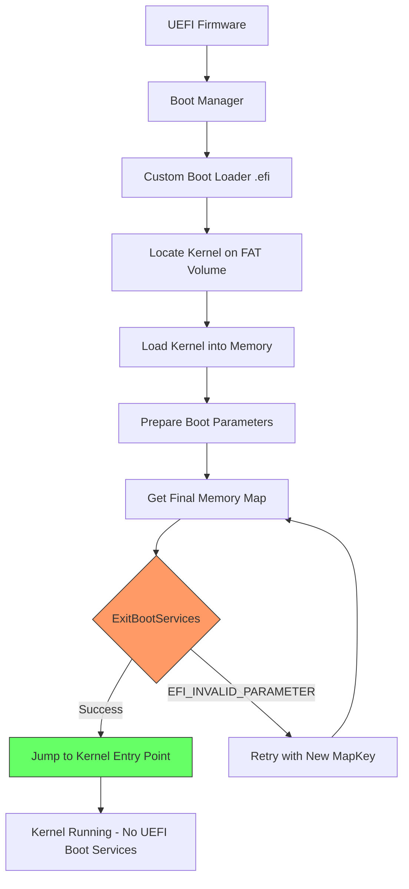
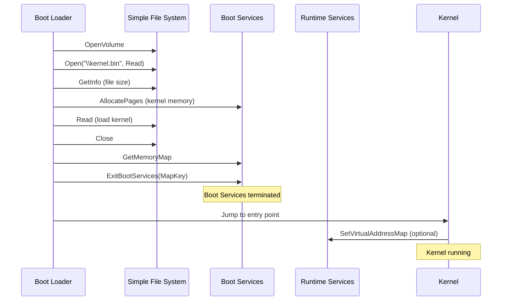
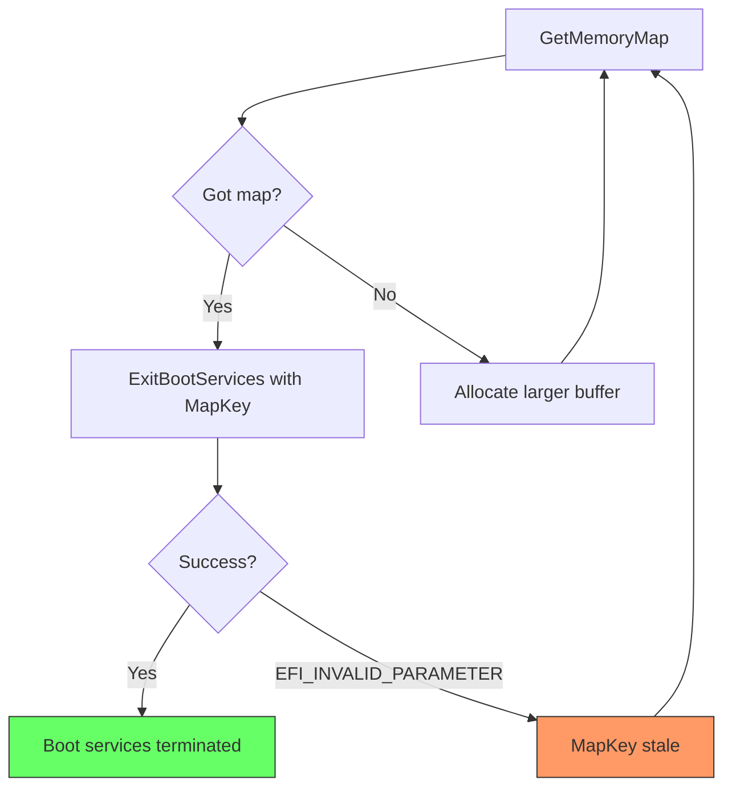

# Chapter 31: Custom Boot Loader

This chapter builds a custom UEFI boot loader that loads a kernel image from a FAT filesystem, prepares the memory environment, calls `ExitBootServices`, and transfers control to the kernel. This is the most complex project in the guide, bringing together filesystem access, memory management, and the critical boot-services-to-runtime transition.

---

## 31.1 Boot Loader Architecture





---

## 31.2 Boot Parameter Structure

The boot loader passes information to the kernel through a structured parameter block placed at a known address or passed via register:

```c
#pragma pack(1)

#define BOOT_PARAMS_MAGIC  0x4D55424F4F54  // "MUBOOT"

typedef struct {
  UINT64                        Magic;
  UINT64                        Version;

  //
  // Framebuffer information (from GOP)
  //
  EFI_PHYSICAL_ADDRESS          FramebufferBase;
  UINT64                        FramebufferSize;
  UINT32                        HorizontalResolution;
  UINT32                        VerticalResolution;
  UINT32                        PixelsPerScanLine;
  UINT32                        PixelFormat;

  //
  // Memory map (snapshot at ExitBootServices time)
  //
  EFI_PHYSICAL_ADDRESS          MemoryMapAddr;
  UINT64                        MemoryMapSize;
  UINT64                        DescriptorSize;
  UINT32                        DescriptorVersion;

  //
  // ACPI tables
  //
  EFI_PHYSICAL_ADDRESS          AcpiRsdpAddr;

  //
  // Runtime services (virtual call after SetVirtualAddressMap)
  //
  EFI_PHYSICAL_ADDRESS          RuntimeServicesAddr;

  //
  // Kernel load address and size
  //
  EFI_PHYSICAL_ADDRESS          KernelBase;
  UINT64                        KernelSize;

  //
  // Command line
  //
  CHAR8                         CommandLine[256];

} BOOT_PARAMS;

#pragma pack()
```

---

## 31.3 Locating and Loading the Kernel

```c
#include <Uefi.h>
#include <Library/UefiLib.h>
#include <Library/UefiBootServicesTableLib.h>
#include <Library/UefiRuntimeServicesTableLib.h>
#include <Library/BaseMemoryLib.h>
#include <Library/MemoryAllocationLib.h>
#include <Library/PrintLib.h>
#include <Library/DevicePathLib.h>
#include <Protocol/SimpleFileSystem.h>
#include <Protocol/LoadedImage.h>
#include <Protocol/GraphicsOutput.h>
#include <Guid/FileInfo.h>
#include <Guid/Acpi.h>

#define KERNEL_FILENAME  L"\\kernel.bin"

/**
  Load the kernel file from the boot volume into memory.

  @param[in]  ImageHandle    The boot loader's image handle.
  @param[out] KernelBase     Physical address where kernel was loaded.
  @param[out] KernelSize     Size of the kernel in bytes.

  @retval EFI_SUCCESS        Kernel loaded.
**/
STATIC
EFI_STATUS
LoadKernel (
  IN  EFI_HANDLE            ImageHandle,
  OUT EFI_PHYSICAL_ADDRESS  *KernelBase,
  OUT UINT64                *KernelSize
  )
{
  EFI_STATUS                       Status;
  EFI_LOADED_IMAGE_PROTOCOL        *LoadedImage;
  EFI_SIMPLE_FILE_SYSTEM_PROTOCOL  *FileSystem;
  EFI_FILE_PROTOCOL                *Root;
  EFI_FILE_PROTOCOL                *KernelFile;
  EFI_FILE_INFO                    *FileInfo;
  UINTN                            InfoSize;
  UINTN                            Pages;
  EFI_PHYSICAL_ADDRESS             Address;
  UINTN                            ReadSize;

  //
  // Step 1: Get the device handle of the volume we booted from
  //
  Status = gBS->HandleProtocol (
                  ImageHandle,
                  &gEfiLoadedImageProtocolGuid,
                  (VOID **)&LoadedImage
                  );

  if (EFI_ERROR (Status)) {
    Print (L"Error: LoadedImage protocol not found: %r\r\n", Status);
    return Status;
  }

  //
  // Step 2: Open the filesystem on the boot device
  //
  Status = gBS->HandleProtocol (
                  LoadedImage->DeviceHandle,
                  &gEfiSimpleFileSystemProtocolGuid,
                  (VOID **)&FileSystem
                  );

  if (EFI_ERROR (Status)) {
    Print (L"Error: File system not found on boot device: %r\r\n", Status);
    return Status;
  }

  Status = FileSystem->OpenVolume (FileSystem, &Root);
  if (EFI_ERROR (Status)) {
    Print (L"Error: OpenVolume failed: %r\r\n", Status);
    return Status;
  }

  //
  // Step 3: Open the kernel file
  //
  Status = Root->Open (
                   Root,
                   &KernelFile,
                   KERNEL_FILENAME,
                   EFI_FILE_MODE_READ,
                   0
                   );

  if (EFI_ERROR (Status)) {
    Print (L"Error: Cannot open %s: %r\r\n", KERNEL_FILENAME, Status);
    Root->Close (Root);
    return Status;
  }

  //
  // Step 4: Query file size
  //
  InfoSize = 0;
  Status = KernelFile->GetInfo (KernelFile, &gEfiFileInfoGuid,
                                &InfoSize, NULL);

  if (Status != EFI_BUFFER_TOO_SMALL) {
    Print (L"Error: GetInfo failed: %r\r\n", Status);
    KernelFile->Close (KernelFile);
    Root->Close (Root);
    return Status;
  }

  FileInfo = AllocatePool (InfoSize);
  Status = KernelFile->GetInfo (KernelFile, &gEfiFileInfoGuid,
                                &InfoSize, FileInfo);

  if (EFI_ERROR (Status)) {
    Print (L"Error: GetInfo failed: %r\r\n", Status);
    FreePool (FileInfo);
    KernelFile->Close (KernelFile);
    Root->Close (Root);
    return Status;
  }

  *KernelSize = FileInfo->FileSize;
  Print (L"Kernel file: %s, size: %ld bytes\r\n",
         KERNEL_FILENAME, *KernelSize);

  FreePool (FileInfo);

  //
  // Step 5: Allocate pages for the kernel
  //
  Pages = EFI_SIZE_TO_PAGES (*KernelSize);
  Address = 0;  // Let firmware choose address

  Status = gBS->AllocatePages (
                  AllocateAnyPages,
                  EfiLoaderData,
                  Pages,
                  &Address
                  );

  if (EFI_ERROR (Status)) {
    Print (L"Error: AllocatePages failed for %d pages: %r\r\n",
           Pages, Status);
    KernelFile->Close (KernelFile);
    Root->Close (Root);
    return Status;
  }

  *KernelBase = Address;
  Print (L"Kernel loaded at: 0x%016lX (%d pages)\r\n", Address, Pages);

  //
  // Step 6: Read the kernel into memory
  //
  ReadSize = (UINTN)*KernelSize;
  Status = KernelFile->Read (KernelFile, &ReadSize, (VOID *)(UINTN)Address);

  if (EFI_ERROR (Status)) {
    Print (L"Error: Read failed: %r\r\n", Status);
    gBS->FreePages (Address, Pages);
    *KernelBase = 0;
  }

  KernelFile->Close (KernelFile);
  Root->Close (Root);

  return Status;
}
```

---

## 31.4 Gathering Framebuffer Information

```c
/**
  Collect GOP framebuffer details for the kernel.

  @param[out] Params   Boot parameters to populate.

  @retval EFI_SUCCESS  Framebuffer info collected.
**/
STATIC
EFI_STATUS
CollectFramebufferInfo (
  OUT BOOT_PARAMS  *Params
  )
{
  EFI_STATUS                    Status;
  EFI_GRAPHICS_OUTPUT_PROTOCOL  *Gop;

  Status = gBS->LocateProtocol (
                  &gEfiGraphicsOutputProtocolGuid,
                  NULL,
                  (VOID **)&Gop
                  );

  if (EFI_ERROR (Status)) {
    Print (L"Warning: GOP not found, no framebuffer info.\r\n");
    ZeroMem (&Params->FramebufferBase,
             sizeof (UINT64) + 4 * sizeof (UINT32));
    return EFI_NOT_FOUND;
  }

  Params->FramebufferBase       = Gop->Mode->FrameBufferBase;
  Params->FramebufferSize       = Gop->Mode->FrameBufferSize;
  Params->HorizontalResolution  = Gop->Mode->Info->HorizontalResolution;
  Params->VerticalResolution    = Gop->Mode->Info->VerticalResolution;
  Params->PixelsPerScanLine     = Gop->Mode->Info->PixelsPerScanLine;
  Params->PixelFormat           = (UINT32)Gop->Mode->Info->PixelFormat;

  Print (L"Framebuffer: 0x%lX, %dx%d, format %d\r\n",
         Params->FramebufferBase,
         Params->HorizontalResolution,
         Params->VerticalResolution,
         Params->PixelFormat);

  return EFI_SUCCESS;
}
```

---

## 31.5 Finding the ACPI RSDP

```c
/**
  Locate the ACPI RSDP in the EFI configuration table.

  @param[out] RsdpAddr  Physical address of the RSDP.

  @retval EFI_SUCCESS   RSDP found.
**/
STATIC
EFI_STATUS
FindAcpiRsdp (
  OUT EFI_PHYSICAL_ADDRESS  *RsdpAddr
  )
{
  UINTN  Index;

  *RsdpAddr = 0;

  //
  // Search for ACPI 2.0 table first, then fall back to 1.0
  //
  for (Index = 0; Index < gST->NumberOfTableEntries; Index++) {
    EFI_CONFIGURATION_TABLE  *Table = &gST->ConfigurationTable[Index];

    if (CompareGuid (&Table->VendorGuid, &gEfiAcpi20TableGuid)) {
      *RsdpAddr = (EFI_PHYSICAL_ADDRESS)(UINTN)Table->VendorTable;
      Print (L"ACPI 2.0 RSDP at: 0x%016lX\r\n", *RsdpAddr);
      return EFI_SUCCESS;
    }
  }

  for (Index = 0; Index < gST->NumberOfTableEntries; Index++) {
    EFI_CONFIGURATION_TABLE  *Table = &gST->ConfigurationTable[Index];

    if (CompareGuid (&Table->VendorGuid, &gEfiAcpi10TableGuid)) {
      *RsdpAddr = (EFI_PHYSICAL_ADDRESS)(UINTN)Table->VendorTable;
      Print (L"ACPI 1.0 RSDP at: 0x%016lX\r\n", *RsdpAddr);
      return EFI_SUCCESS;
    }
  }

  Print (L"Warning: ACPI RSDP not found.\r\n");
  return EFI_NOT_FOUND;
}
```

---

## 31.6 ExitBootServices with Retry Pattern

`ExitBootServices` is the most critical call in a boot loader. It terminates all UEFI boot-time services. The call requires the current memory map key, and since `GetMemoryMap` itself may allocate memory (changing the map), a retry loop is essential.



```c
/**
  Exit boot services with the required retry pattern.

  The memory map may change between GetMemoryMap and ExitBootServices
  (for example, due to the GetMemoryMap allocation itself), so we must
  be prepared to retry.

  @param[in]  ImageHandle   The boot loader's image handle.
  @param[out] Params        Boot parameters (memory map fields populated).

  @retval EFI_SUCCESS       Boot services exited.
**/
STATIC
EFI_STATUS
ExitBootServicesWithRetry (
  IN  EFI_HANDLE    ImageHandle,
  OUT BOOT_PARAMS   *Params
  )
{
  EFI_STATUS             Status;
  UINTN                  MemoryMapSize;
  EFI_MEMORY_DESCRIPTOR  *MemoryMap;
  UINTN                  MapKey;
  UINTN                  DescriptorSize;
  UINT32                 DescriptorVersion;
  UINTN                  Retries;

  MemoryMap     = NULL;
  MemoryMapSize = 0;

  for (Retries = 0; Retries < 5; Retries++) {
    //
    // Free previous buffer if any
    //
    if (MemoryMap != NULL) {
      gBS->FreePool (MemoryMap);
      MemoryMap = NULL;
    }

    //
    // Query required size
    //
    MemoryMapSize = 0;
    Status = gBS->GetMemoryMap (
                    &MemoryMapSize,
                    NULL,
                    &MapKey,
                    &DescriptorSize,
                    &DescriptorVersion
                    );

    if (Status != EFI_BUFFER_TOO_SMALL) {
      Print (L"Error: GetMemoryMap returned unexpected: %r\r\n", Status);
      return Status;
    }

    //
    // Add space for potential map changes from the allocation below
    //
    MemoryMapSize += 8 * DescriptorSize;

    //
    // Allocate with AllocatePool (boot services still active)
    //
    Status = gBS->AllocatePool (
                    EfiLoaderData,
                    MemoryMapSize,
                    (VOID **)&MemoryMap
                    );

    if (EFI_ERROR (Status)) {
      Print (L"Error: AllocatePool failed: %r\r\n", Status);
      return Status;
    }

    //
    // Get the actual memory map
    //
    Status = gBS->GetMemoryMap (
                    &MemoryMapSize,
                    MemoryMap,
                    &MapKey,
                    &DescriptorSize,
                    &DescriptorVersion
                    );

    if (EFI_ERROR (Status)) {
      continue;
    }

    //
    // Attempt ExitBootServices
    //
    Status = gBS->ExitBootServices (ImageHandle, MapKey);

    if (!EFI_ERROR (Status)) {
      //
      // Success! Populate boot params with memory map info.
      // Note: Boot services are now GONE. No Print, no AllocatePool, etc.
      //
      Params->MemoryMapAddr    = (EFI_PHYSICAL_ADDRESS)(UINTN)MemoryMap;
      Params->MemoryMapSize    = MemoryMapSize;
      Params->DescriptorSize   = DescriptorSize;
      Params->DescriptorVersion = DescriptorVersion;

      return EFI_SUCCESS;
    }

    //
    // ExitBootServices failed -- MapKey was stale.
    // The memory map changed between GetMemoryMap and ExitBootServices.
    // Retry with a fresh map.
    //
  }

  Print (L"Error: ExitBootServices failed after %d retries.\r\n", Retries);
  return EFI_ABORTED;
}
```

---

## 31.7 Jumping to the Kernel

After `ExitBootServices` succeeds, no UEFI boot services are available. The boot loader must jump to the kernel entry point using a function pointer:

```c
typedef VOID (EFIAPI *KERNEL_ENTRY)(BOOT_PARAMS *Params);

/**
  Transfer control to the loaded kernel.

  This function does not return.

  @param[in] KernelBase   Address where kernel was loaded.
  @param[in] Params       Pointer to the boot parameter block.
**/
STATIC
VOID
EFIAPI
JumpToKernel (
  IN EFI_PHYSICAL_ADDRESS  KernelBase,
  IN BOOT_PARAMS           *Params
  )
{
  KERNEL_ENTRY  EntryPoint;

  //
  // The kernel entry point is at the start of the loaded image.
  // Some formats (ELF, PE) require parsing headers to find the
  // actual entry point. For simplicity, we assume a flat binary
  // where execution begins at byte 0.
  //
  EntryPoint = (KERNEL_ENTRY)(UINTN)KernelBase;

  //
  // Call the kernel. This should never return.
  //
  EntryPoint (Params);

  //
  // If the kernel returns (it shouldn't), halt.
  //
  while (TRUE) {
    CpuDeadLoop ();
  }
}
```

---

## 31.8 Error Recovery and Fallback

A production boot loader should handle failures gracefully:

```c
/**
  Attempt to boot a fallback kernel if the primary fails.

  @param[in] ImageHandle   Boot loader image handle.

  @retval EFI_SUCCESS      Fallback booted (should not return).
  @retval other            All fallback attempts failed.
**/
STATIC
EFI_STATUS
TryFallbackBoot (
  IN EFI_HANDLE  ImageHandle
  )
{
  STATIC CONST CHAR16  *FallbackPaths[] = {
    L"\\kernel.bak",
    L"\\EFI\\BOOT\\kernel.bin",
    L"\\EFI\\recovery\\kernel.bin",
    NULL
  };

  UINTN                Index;
  EFI_STATUS           Status;
  EFI_PHYSICAL_ADDRESS KernelBase;
  UINT64               KernelSize;

  for (Index = 0; FallbackPaths[Index] != NULL; Index++) {
    Print (L"Trying fallback: %s\r\n", FallbackPaths[Index]);

    // Temporarily override the kernel filename for LoadKernel
    // (In production, pass the path as a parameter)
    Status = LoadKernel (ImageHandle, &KernelBase, &KernelSize);

    if (!EFI_ERROR (Status)) {
      Print (L"Fallback kernel loaded successfully.\r\n");
      return EFI_SUCCESS;
    }
  }

  Print (L"All fallback paths exhausted.\r\n");
  return EFI_NOT_FOUND;
}
```

---

## 31.9 Complete Main Entry Point

```c
/** @file
  MuBootLoader -- Custom UEFI boot loader.

  Loads kernel.bin from the boot volume, prepares boot parameters,
  exits boot services, and jumps to the kernel.

  Copyright (c) 2026, Your Name. All rights reserved.
  SPDX-License-Identifier: BSD-2-Clause-Patent
**/

// (Include all headers, structures, and functions from above)

EFI_STATUS
EFIAPI
UefiMain (
  IN EFI_HANDLE        ImageHandle,
  IN EFI_SYSTEM_TABLE  *SystemTable
  )
{
  EFI_STATUS           Status;
  BOOT_PARAMS          *Params;
  EFI_PHYSICAL_ADDRESS KernelBase;
  UINT64               KernelSize;

  Print (L"\r\n");
  Print (L"===========================================\r\n");
  Print (L"  MuBootLoader v1.0\r\n");
  Print (L"  Custom UEFI Boot Loader\r\n");
  Print (L"===========================================\r\n\r\n");

  //
  // Allocate boot parameters in EfiLoaderData
  // (survives ExitBootServices)
  //
  Status = gBS->AllocatePages (
                  AllocateAnyPages,
                  EfiLoaderData,
                  EFI_SIZE_TO_PAGES (sizeof (BOOT_PARAMS)),
                  (EFI_PHYSICAL_ADDRESS *)(UINTN)&Params
                  );

  // Use AllocatePool as a simpler alternative:
  Params = AllocateZeroPool (sizeof (BOOT_PARAMS));
  if (Params == NULL) {
    Print (L"Fatal: Cannot allocate boot parameters.\r\n");
    return EFI_OUT_OF_RESOURCES;
  }

  Params->Magic   = BOOT_PARAMS_MAGIC;
  Params->Version = 1;

  //
  // Step 1: Load the kernel
  //
  Print (L"[1/5] Loading kernel...\r\n");
  Status = LoadKernel (ImageHandle, &KernelBase, &KernelSize);

  if (EFI_ERROR (Status)) {
    Print (L"Primary kernel load failed.\r\n");
    Status = TryFallbackBoot (ImageHandle);
    if (EFI_ERROR (Status)) {
      Print (L"Fatal: No bootable kernel found.\r\n");
      return Status;
    }
  }

  Params->KernelBase = KernelBase;
  Params->KernelSize = KernelSize;

  //
  // Step 2: Collect framebuffer info
  //
  Print (L"[2/5] Collecting framebuffer info...\r\n");
  CollectFramebufferInfo (Params);

  //
  // Step 3: Find ACPI RSDP
  //
  Print (L"[3/5] Locating ACPI tables...\r\n");
  FindAcpiRsdp (&Params->AcpiRsdpAddr);

  //
  // Step 4: Store runtime services pointer
  //
  Print (L"[4/5] Recording runtime services...\r\n");
  Params->RuntimeServicesAddr = (EFI_PHYSICAL_ADDRESS)(UINTN)gRT;

  //
  // Step 5: Set command line
  //
  AsciiSPrint (Params->CommandLine, sizeof (Params->CommandLine),
               "console=ttyS0 root=/dev/sda1");

  //
  // Step 6: Exit boot services and jump
  //
  Print (L"[5/5] Exiting boot services...\r\n");

  Status = ExitBootServicesWithRetry (ImageHandle, Params);

  if (EFI_ERROR (Status)) {
    //
    // If ExitBootServices fails, we can still use Print
    //
    Print (L"Fatal: ExitBootServices failed: %r\r\n", Status);
    return Status;
  }

  //
  // ============================================================
  // POINT OF NO RETURN
  // Boot services are gone. No Print, no AllocatePool, no events.
  // Only Runtime Services and the memory we already allocated.
  // ============================================================
  //

  JumpToKernel (KernelBase, Params);

  //
  // Should never reach here
  //
  return EFI_ABORTED;
}
```

---

## 31.10 INF File

```ini
[Defines]
  INF_VERSION       = 0x00010017
  BASE_NAME         = MuBootLoader
  FILE_GUID         = D1E2F3A4-DEAD-BEEF-CAFE-AABBCCDDEEFF
  MODULE_TYPE       = UEFI_APPLICATION
  VERSION_STRING    = 1.0
  ENTRY_POINT       = UefiMain

[Sources]
  MuBootLoader.c

[Packages]
  MdePkg/MdePkg.dec
  MdeModulePkg/MdeModulePkg.dec

[LibraryClasses]
  UefiApplicationEntryPoint
  UefiLib
  UefiBootServicesTableLib
  UefiRuntimeServicesTableLib
  BaseMemoryLib
  MemoryAllocationLib
  PrintLib
  DevicePathLib

[Protocols]
  gEfiLoadedImageProtocolGuid
  gEfiSimpleFileSystemProtocolGuid
  gEfiGraphicsOutputProtocolGuid

[Guids]
  gEfiFileInfoGuid
  gEfiAcpi20TableGuid
  gEfiAcpi10TableGuid
```

---

## 31.11 Testing with a Minimal Kernel

To test the boot loader without a real OS kernel, create a minimal assembly stub:

```nasm
; kernel.asm -- Minimal test kernel
; Writes "OK" to the framebuffer and halts.
;
; Build: nasm -f bin -o kernel.bin kernel.asm

BITS 64

; Entry point -- called with RCX = pointer to BOOT_PARAMS
global _start
_start:
    ; Save boot params pointer
    mov rsi, rcx

    ; Check magic (offset 0 in BOOT_PARAMS)
    mov rax, [rsi]
    mov rbx, 0x4D55424F4F54    ; "MUBOOT"
    cmp rax, rbx
    jne .halt

    ; Get framebuffer base (offset 16 in BOOT_PARAMS)
    mov rdi, [rsi + 16]

    ; Write 'O' (white on black) -- assuming 32-bit pixel format
    mov dword [rdi], 0x00FFFFFF      ; White pixel
    mov dword [rdi + 4], 0x00FFFFFF
    mov dword [rdi + 8], 0x00FFFFFF

    ; Move to next character position (8 pixels right)
    add rdi, 32
    mov dword [rdi], 0x00FFFFFF
    mov dword [rdi + 4], 0x00FFFFFF

.halt:
    cli
    hlt
    jmp .halt
```

Build and test:

```bash
# Assemble the test kernel
nasm -f bin -o kernel.bin kernel.asm

# Prepare the boot disk
mkdir -p /tmp/boot-disk/EFI/BOOT
cp Build/MuBootLoaderPkg/DEBUG_GCC5/X64/MuBootLoader.efi \
   /tmp/boot-disk/EFI/BOOT/BOOTX64.EFI
cp kernel.bin /tmp/boot-disk/

# Launch QEMU
qemu-system-x86_64 \
  -bios OVMF.fd \
  -drive file=fat:rw:/tmp/boot-disk,format=raw,media=disk \
  -device virtio-gpu-pci \
  -serial stdio \
  -m 256 \
  -display gtk
```

You should see:
1. The boot loader prints its banner and progress messages.
2. `ExitBootServices` succeeds.
3. The kernel receives control and writes pixels to the framebuffer.

---

## 31.12 Memory Layout Considerations

After `ExitBootServices`, the memory map looks like:

| Type | Status | Notes |
|------|--------|-------|
| `EfiConventionalMemory` | Available | Free RAM for kernel use |
| `EfiLoaderCode` / `EfiLoaderData` | Available | Boot loader + kernel + params |
| `EfiRuntimeServicesCode` / `Data` | Reserved | Runtime services, must not overwrite |
| `EfiACPIReclaimMemory` | Available after parsing | ACPI tables |
| `EfiACPIMemoryNVS` | Reserved | ACPI NVS storage |
| `EfiReservedMemoryType` | Reserved | Firmware reserved |
| `EfiMemoryMappedIO` | Reserved | Device MMIO regions |

The kernel must:
1. Parse the memory map from `BOOT_PARAMS` to know which regions are usable.
2. Avoid overwriting `EfiRuntimeServicesCode`/`Data` if it plans to call Runtime Services.
3. Call `SetVirtualAddressMap` if it enables paging with different virtual addresses.

---

## 31.13 ELF Kernel Loading (Advanced)

Production boot loaders parse ELF or PE headers to load kernel segments at the correct addresses:

```c
/**
  Parse ELF64 header and load program segments.

  @param[in]  FileData    Raw file contents.
  @param[in]  FileSize    Size of file data.
  @param[out] EntryPoint  Virtual address of ELF entry point.

  @retval EFI_SUCCESS     Segments loaded.
**/
STATIC
EFI_STATUS
LoadElf64 (
  IN  VOID                  *FileData,
  IN  UINT64                FileSize,
  OUT EFI_PHYSICAL_ADDRESS  *EntryPoint
  )
{
  // ELF64 header at offset 0
  typedef struct {
    UINT8   e_ident[16];
    UINT16  e_type;
    UINT16  e_machine;
    UINT32  e_version;
    UINT64  e_entry;
    UINT64  e_phoff;
    UINT64  e_shoff;
    UINT32  e_flags;
    UINT16  e_ehsize;
    UINT16  e_phentsize;
    UINT16  e_phnum;
    // ...
  } Elf64_Ehdr;

  typedef struct {
    UINT32  p_type;
    UINT32  p_flags;
    UINT64  p_offset;
    UINT64  p_vaddr;
    UINT64  p_paddr;
    UINT64  p_filesz;
    UINT64  p_memsz;
    UINT64  p_align;
  } Elf64_Phdr;

  Elf64_Ehdr  *Ehdr = (Elf64_Ehdr *)FileData;

  // Validate ELF magic
  if (Ehdr->e_ident[0] != 0x7F ||
      Ehdr->e_ident[1] != 'E'  ||
      Ehdr->e_ident[2] != 'L'  ||
      Ehdr->e_ident[3] != 'F') {
    return EFI_UNSUPPORTED;
  }

  *EntryPoint = Ehdr->e_entry;

  // Load each PT_LOAD segment
  UINTN  Idx;
  for (Idx = 0; Idx < Ehdr->e_phnum; Idx++) {
    Elf64_Phdr *Phdr = (Elf64_Phdr *)((UINT8 *)FileData +
                        Ehdr->e_phoff + Idx * Ehdr->e_phentsize);

    if (Phdr->p_type != 1) {  // PT_LOAD = 1
      continue;
    }

    // Allocate at the physical address specified
    EFI_PHYSICAL_ADDRESS  Addr = Phdr->p_paddr;
    UINTN Pages = EFI_SIZE_TO_PAGES (Phdr->p_memsz);

    gBS->AllocatePages (AllocateAddress, EfiLoaderData, Pages, &Addr);

    // Copy file data
    CopyMem ((VOID *)(UINTN)Addr,
             (UINT8 *)FileData + Phdr->p_offset,
             (UINTN)Phdr->p_filesz);

    // Zero BSS (memsz > filesz)
    if (Phdr->p_memsz > Phdr->p_filesz) {
      ZeroMem ((VOID *)(UINTN)(Addr + Phdr->p_filesz),
               (UINTN)(Phdr->p_memsz - Phdr->p_filesz));
    }
  }

  return EFI_SUCCESS;
}
```

---

## 31.14 Key Takeaways

1. A UEFI boot loader is a UEFI application that loads a kernel, prepares parameters, calls `ExitBootServices`, and jumps to the kernel entry point.
2. **ExitBootServices requires a retry loop** because `GetMemoryMap` may change the map key through its own memory allocation.
3. After `ExitBootServices`, **no boot services are available** -- no `Print`, no `AllocatePool`, no protocol calls. Only Runtime Services survive.
4. The boot loader must pass essential information (memory map, framebuffer, ACPI RSDP) to the kernel via a parameter structure.
5. The kernel is responsible for calling `SetVirtualAddressMap` if it remaps runtime services to virtual addresses.
6. For testing, a minimal assembly stub kernel that writes to the framebuffer validates the entire boot chain.

---

{: .note }
> **Complete source code**: The full working example for this chapter is available at [`examples/UefiMuGuidePkg/BootLoader/`]({{ site.baseurl }}/examples/UefiMuGuidePkg/BootLoader/).

## Summary

This project demonstrated the complete boot loading process: filesystem access, kernel loading, information gathering, the critical `ExitBootServices` transition, and kernel handoff. These are the same fundamental steps that production boot loaders like GRUB, systemd-boot, and Windows Boot Manager perform, all built on the UEFI specification.
